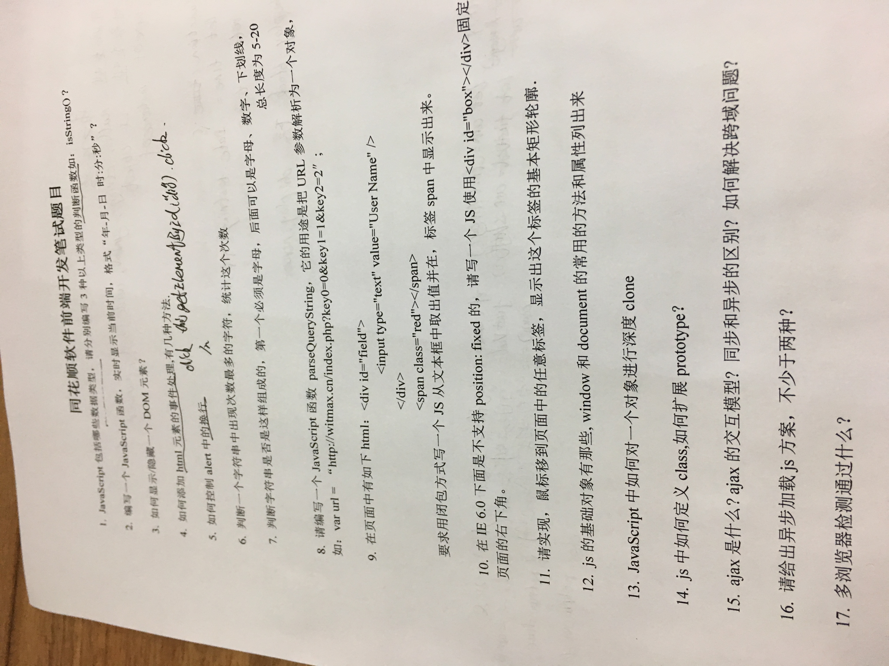

# 耗时6小时的同花顺面试

其实笔试和面试各1个小时，在路上竟然需要4个小时WTF.
    下午4点约得面试，我早早就到了同花顺，好吧，那里附近挺荒凉的，没有滨江繁华（个人觉得），同花顺是一个独立的大楼。坐了这么久的地铁，尿急死的我就啪啪啪往里走，然后解手后，发现才1点多，是我太早了，突然想到一句话：准时是礼貌，早到是修养。不知道是我谁说的。于是，我就坐在一楼的沙发上继续地铁上的复习。我来之前查过，同花顺面试是笔试+面试。然后它笔试主要会考察js。所以我将小册里的《前端面试之道》打开，继续开始我的学习。好吧，我并没有看完。突然想到昨天我的朋友的话：你的胆子好大啊，第一家就是大公司。看不完，准备不完，碰巧微信里有同花顺的hr，那就联系他咯。他说可以面试，那我就去试一试咯。

## 面试前需要注意的细节点
1. 简历一定要写好。
好吧，虽然我改了五六次，但是我的简历还是很low。注意：千万不要给自己挖坑，不要写自己答不上来的东东。

2. 提前想好自己为什么要跳槽或者是为什么要去那上班。
这一点很关键，你如果连个理由都没有，万一你啥理由都没有就离职了。GG。公司归属感很重要滴。大厂宁可不招，也不会招进一个随时会走的人。理由：1，工资太低，想加薪；2，为了提升技术；3，换一个氛围；4，其他因素（譬如，小孩上学、另一伴的工作、父母要求等等）。个人感觉，不能说理由1。大厂会认为你是金钱主义者，下一家给的多，你就去，毫无归属感。推荐理由2、理由3和理由4,哈哈，虽然你的目标是加薪。

3. 不用说了，没看过面经没准备过的，千万别找虐。
我19届的，今年才毕业，已经在滨江实习了7、8个月了。这几个月了，我疯狂做项目，疯狂敲代码。你要想着：比你优秀的人都还在努力。我一边做项目，一边会去做笔记，推荐有道云笔记。之前用过印象。哎，充满金钱味的笔记（买不起会员）。我遇到过的bug，我会记载下来。在网上看到的优秀文章，除了收藏那就是放进笔记中。优秀博客也是。上文提到的朋友也告诉我要用一句话概括自己今天所做的————我归纳为今日总结。面试前将笔记刷一遍，将面经刷一遍。重要的是前端面试题刷一遍（很多多会考到，没考到就会问到）。

笔试题：
我拍了张照，微笑

面试知识点
两个面试官人超级好，都挺帅的。我不是gay。感觉没比我大多少。

> windowOnload()在哪个周期中？

> 如何异步加载js？
script中加入async和reffer

> vue生命周期？

> generator如何执行？如何让generator自动next（不通过next.next.next）？

async await
中间加上await

> 遇到过的兼容性问题？

> promise原理？

> koa和express？

> 你有哪些优秀代码可以讲讲？哪些好项目？

> 你怎么学习？

github关注大佬动态，看他们博客。慕课网、Stack Overflow，v2、掘金。

>看什么书？其中有什么你要说的

犀牛书和红皮书当字典查。generator不太懂其原理。

> 你为什么要从事前端？什么时候？未来展望？

> echarts如何画图？

> 你用什么布局？

>把ui图给你，你要怎么操作？没有UI库呢？

先选UI库，将UI图拆分，拆分成一个个组件。选择布局，flex，grid布局。用html和css实现框架，完成细枝末节。

我的问题：
>技术栈？

>团建？打球？

>996吗？

弹性工作制度。潜台词：会很迟。

没了。