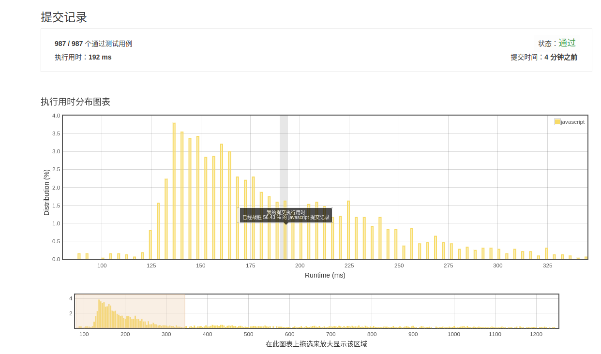

# 面试题
[[toc]]

## 创邻科技笔试题：
### 题目1
   ```text
 小明的女朋友最喜欢在网上买买买了，可是钱包里钞票有限，不能想买啥就买啥。面对琳琅满目的物品，她想买尽可能多的种类，每种只买一件，同时总价格还不能超过预算上限。于是她请小明写程序帮她找出应该买哪些物品，并算出这些物品的总价格。
    
    输入规范：
    每个输入包含两行。第一行是预算上限。第二行是用空格分隔的一组数字，代表每种物品的价格。所有数字都为正整数并且不会超过10000。
    
    输出规范：
    对每个输入，输出应买物品的总价格。
    
    输入示例1:
    100
    50 50
    输出示例1:
    100
    
    输入示例2:
    188
    50 42 9 15 105 63 14 30
    输出示例2:
    160
    
```

   这道题简单，实现了基本框架
   
 ```js        
        function sortNum(a, b) {
            return a - b
        }
        
        function f(total, arr) {
            var sum = 0
            arr.sort(sortNum)
            arr.forEach(num => {
                if (num <= total) {
                    total -= num
                    sum += num
                } else {
                    return sum
                }
            })
            return sum
        }
        
        console.log(f(100, [50, 50]))//100
        console.log(f(188, [50, 42, 9, 15, 105, 63, 14, 30]))//160
   ``` 
    
 ### 题目2
 ```text

 李雷和韩梅梅坐前后排，上课想说话怕被老师发现，所以改为传小纸条。为了不被老师发现他们纸条上说的是啥，他们约定了如下方法传递信息：
        将26个英文字母（全为大写），外加空格，一共27个字符分成3组，每组9个。也就是ABCDEFGHI是第一组，JKLMNOPQR是第二组，STUVWXYZ*是第三组（此处用*代表空格）。
        然后根据传递纸条那天的日期，改变字母的位置。
        先根据月份数m，以整个分组为单位进行循环左移，移动(m-1)次。
        然后根据日期数d，对每个分组内的字符进行循环左移，移动(d-1)次。
        以3月8日为例，首先移动分组，3月需要循环左移2次，变成：
        STUVWXYZ*，ABCDEFGHI，JKLMNOPQR
        然后每组内的字符，8日的话需要循环左移7次，最终的编码为：
        Z*STUVWXY，HIABCDEFG，QRJKLMNOP
        对于要传递信息中的每个字符，用组号和组内序号两个数字来表示。
        如果在3月8日传递信息“HAPPY”，那么H位于第2组的第1个，A位于第2组第3个，P位于第3组第9个，Y位于第1组第9个，所以纸条上会写成：
        21 23 39 39 19
        现在给定日期和需要传递的信息，请输出应该写在纸条上的编码。
              
        输入规范：
        每个输入包含两行。第一行是用空格分隔的两个数字，第一个数字是月份，第二个数字是日子。输入保证是一个合法的日期。
        第二行为需要编码的信息字符串，仅由A~Z和空格组成，长度不超过1024个字符。
        
        输出规范：
        对每个输入，打印对应的编码，数字之间用空格分隔，每个输出占一行。
        
        输入示例1:
        1 1
        HI
        输出示例1:
        18 19
        
        输入示例2:
        3 8
        HAPPY
        输出示例2:
        21 23 39 39 19
        
        输入示例3:
        2 14
        I LOVE YOU
        输出示例3:
        35 25 18 12 29 31 25 23 12 28
 ```
 此题有点难，我目前只能实现整个数组和单个数组的左移方法，并且把两者的位置找出来，还需要解析位置的索引。我猜最好的方法是在数组的数组找位置。
 ```js
 var arrFirst = ["A", "B", "C", "D", "E", "F", "G", "H", "I"]
 var arrSecond = ["J", "K", "L", "M", "N", "O", "P", "Q", "R"]
 var arrThird = ["S", "T", "U", "V", "W", "X", "Y", "Z", "*"]
 var arrTotal = new Array()
 arrTotal.push(arrFirst, arrSecond, arrThird)
 // 要进行编码的数组
 var arrTotalSecond = new Array()
 
 // 数组集合左移m个单位
 function moveArrList(m) {
     return arrTotal.slice(-m).concat(arrTotal.slice(0, -m))
 }
 
 // 每个数组左移d个单位
 function moveArr(d) {
     arrTotal.forEach(item => {
         arrTotalSecond.push(item.slice(-d).concat(item.slice(0, -d)))
     })
     return arrTotalSecond
 }
 
 function f(m, d, arr) {
     var newArr = new Array()
     m -= 1
     d -= 1
     moveArrList(m)
     moveArr(d)
     arr.forEach(string => {
         arrTotalSecond.forEach(arr => {
             newArr.push(arr.indexOf(string))
         })
     })
     return newArr
 }
 
 console.log(f(1, 1, ['H', 'I']))//[ 7, -1, -1, 8, -1, -1 ]

```       
        
        
## 介绍模块化发展历程
模块化主要用来抽离公共代码，隔离作用域，避免变量冲突等。

- IIFE：使用自执行函数来编写模块化，特点：在一个单独的函数作用域中执行代码，避免变量冲突。
```
(function () {
    return
    {
        data:[]
    }
})()
```        

- AMD:使用requireJS来编写模块化，特点：依赖必须提前声明好。
```
define('./index.js',function (code) {
    // code是index.js返回的内容
})
```    
  
- CMD：使用seaJS来编写模块化，特点：支持动态引入依赖文件。
```
define(function (require,exports,module) {
    var indexCode=require('./index.js')
})
```  

- CommonJS:nodejs中自带的模块化。
```
var fs=require('fs')
```        

- UMD:兼容AMD，CommonJS模块化语法。

- webpack(require,ensure):webpack 2.x版本中的代码分割。

- ES Modules：ES6引入的模块化，支持import来引入另一个js。
```
import a from 'a'
```
## 两个数组合并成一个数组
```js
let arrA = ['A1', 'A2', 'B1', 'B2', 'C1', 'C2', 'D1', 'D2']
let arrB = ['A', 'B', 'C', 'D'].map(item => {
    return item + 3
})
let arrC = [...arrA, ...arrB].sort().map(item => {
    if (item.includes('3')) {
        return item.split('')[0]
    }
    return item
})
console.log(arrC)
// [ 'A1', 'A2', 'A', 'B1', 'B2', 'B', 'C1', 'C2', 'C', 'D1', 'D2', 'D' ]
```
## 改造下面的代码，使之输出0 - 9，写出你能想到的所有解法
```js
for (var i = 0; i< 10; i++){
	setTimeout(() => {
		console.log(i);
    }, 1000)
}
```

- 闭包解决
```js
for (var i = 0; i < 10; i++) {
    (function (j) {
        setTimeout(() => {
            console.log(j);
        }, 1000)
    })(i)
}
```
- setTimeout第三参数
```js
for (var i = 0; i < 10; i++) {
    setTimeout((j) => {
        console.log(j);
    }, 1000, i)
}
```

- let作用域<var作用域
```js
for (let i = 0; i< 10; i++){
    setTimeout(() => {
        console.log(i);
    }, 1000)
}
```
 
## Virtual DOM 真的比操作原生 DOM 快吗？谈谈你的想法
1. 原生 DOM 操作 vs. 通过框架封装操作

这是一个性能 vs. 可维护性的取舍。框架的意义在于为你掩盖底层的 DOM 操作，让你用更声明式的方式来描述你的目的，从而让你的代码更容易维护。没有任何框架可以比纯手动的优化 DOM 操作更快，因为框架的 DOM 操作层需要应对任何上层 API 可能产生的操作，它的实现必须是普适的。针对任何一个 benchmark，我都可以写出比任何框架更快的手动优化，但是那有什么意义呢？在构建一个实际应用的时候，你难道为每一个地方都去做手动优化吗？出于可维护性的考虑，这显然不可能。框架给你的保证是，你在不需要手动优化的情况下，我依然可以给你提供过得去的性能。

2. 对 React 的 Virtual DOM 的误解

React 从来没有说过 “React 比原生操作 DOM 快”。React 的基本思维模式是每次有变动就整个重新渲染整个应用。如果没有 Virtual DOM，简单来想就是直接重置 innerHTML。很多人都没有意识到，在一个大型列表所有数据都变了的情况下，重置 innerHTML 其实是一个还算合理的操作... 真正的问题是在 “全部重新渲染” 的思维模式下，即使只有一行数据变了，它也需要重置整个 innerHTML，这时候显然就有大量的浪费。
我们可以比较一下 innerHTML vs. Virtual DOM 的重绘性能消耗：

- innerHTML: render html string O(template size) + 重新创建所有 DOM 元素 O(DOM size)
- Virtual DOM: render Virtual DOM + diff O(template size) + 必要的 DOM 更新 O(DOM change)

Virtual DOM render + diff 显然比渲染 html 字符串要慢，但是！它依然是纯 js 层面的计算，比起后面的 DOM 操作来说，依然便宜了太多。可以看到，innerHTML 的总计算量不管是 js 计算还是 DOM 操作都是和整个界面的大小相关，但 Virtual DOM 的计算量里面，只有 js 计算和界面大小相关，DOM 操作是和数据的变动量相关的。前面说了，和 DOM 操作比起来，js 计算是极其便宜的。这才是为什么要有 Virtual DOM：它保证了 1）不管你的数据变化多少，每次重绘的性能都可以接受；2) 你依然可以用类似 innerHTML 的思路去写你的应用。

3. 性能比较也要看场合
在比较性能的时候，要分清楚初始渲染、小量数据更新、大量数据更新这些不同的场合。Virtual DOM、脏检查 MVVM、数据收集 MVVM 在不同场合各有不同的表现和不同的优化需求。Virtual DOM 为了提升小量数据更新时的性能，也需要针对性的优化，比如 shouldComponentUpdate 或是 immutable data。

- 初始渲染：Virtual DOM > 脏检查 >= 依赖收集
- 小量数据更新：依赖收集 >> Virtual DOM + 优化 > 脏检查（无法优化） > Virtual DOM 无优化
- 大量数据更新：脏检查 + 优化 >= 依赖收集 + 优化 > Virtual DOM（无法/无需优化）>> MVVM 无优化

不要天真地以为 Virtual DOM 就是快，diff 不是免费的，batching 么 MVVM 也能做，而且最终 patch 的时候还不是要用原生 API。在我看来 Virtual DOM 真正的价值从来都不是性能，而是它 1) 为函数式的 UI 编程方式打开了大门；2) 可以渲染到 DOM 以外的 backend，比如 ReactNative。
## IIFE
> IIFE（ 立即调用函数表达式）是一个在定义时就会立即执行的JavaScript 函数。这是一个被称为 自执行匿名函数 的设计模式，主要包含两部分。第一部分是包围在 圆括号运算符() 里的一个匿名函数，这个匿名函数拥有独立的词法作用域。这不仅避免了外界访问此 IIFE 中的变量，而且又不会污染全局作用域。第二部分再一次使用 () 创建了一个立即执行函数表达式，JavaScript 引擎到此将直接执行函数。
  
 1. 函数表达式与函数声明不同，函数名只在该函数内部有效，并且此绑定是常量绑定。
 2. 对于一个常量进行赋值，在 strict 模式下会报错，非 strict 模式下静默失败。
 3. IIFE中的函数是函数表达式，而不是函数声明。

```js
var b = 10;
(function b(){
    b = 20;
    console.log(b); 
})();
```
// [Function: b]
因为函数b的声明会覆盖变量b的声明，函数的优先级比变量的优先级高。内部作用域，会先去查找是有已有变量b的声明，有就直接赋值20，确实有了呀。发现了具名函数 function b(){}，拿此b做赋值；


其余例子：

- b同上，而window.b=10是因为在外部作用域中申明了b，则b被挂载在了window上
```js
var b = 10;
(function b() {
    b = 20;
    console.log(b);// [Function: b]
    console.log(window.b)// 10
})();
```

- 在严格模式下，b是个常量，无法更改，所以会报错
```js
var b = 10;
(function b() {
    'use strict'
    b = 20;
    console.log(b)
})() // "Uncaught TypeError: Assignment to constant variable."
```

- b同上，而window.b=20是因为在外部作用域中申明了b，则b被挂载在了window上，但是内部作用域中，b又进行重新赋值为20，重新被挂载到window上
```js
var b = 10;
(function b() {
    window.b = 20;
    console.log(b); // [Function b]
    console.log(window.b); // 20是必然的
})();
```

- 立即执行函数内var重新申明b,调用b函数内部变量

```js
var b = 10;
(function b() {
    var b = 20; // IIFE内部变量
    console.log(b); // 20
    console.log(window.b); // 10
})();
```

- 立即执行函数参数2对外部参数重新赋值
```js
var test = (function (i) {
    return function () {
        console.log(i * 2)//4
    }
})(2)
test(5)
```
## 浏览器缓存读取规则
可以分成 Service Worker、Memory Cache、Disk Cache 和 Push Cache，那请求的时候 from memory cache 和 from disk cache 的依据是什么，哪些数据什么时候存放在 Memory Cache 和 Disk Cache中？

解答：

- 如果开启了Service Worker首先会从Service Worker中拿
- 如果新开一个以前打开过的页面缓存会从Disk Cache中拿（前提是命中强缓存）
- 刷新当前页面时浏览器会根据当前运行环境内存来决定是从 Memory Cache 还是 从Disk Cache中拿
## 使用迭代的方式实现 flatten（压扁） 函数
将多维数组压扁成一维数组
```js
let arr = [1, 2, [3, 4, [5, [6, 7]], 8], 9, 10, [11, [12, 13]]]
// some() 方法测试是否至少有一个元素通过由提供的函数实现的测试。
// 用扩展运算符一层层剥离数组
const flatten = (arr) => {
    while (arr.some(item => Array.isArray(item))) {
        arr = [].concat(...arr)
    }
    return arr
}

console.log(flatten(arr))//[ 1, 2, 3, 4, 5, 6, 7, 8, 9, 10, 11, 12, 13 ]
```

```js
// reduce() 方法对数组中的每个元素执行一个由您提供的reducer函数(升序执行)，将其结果汇总为单个返回值。
let arr = [1, 2, [3, 4, [5, [6, 7]], 8], 9, 10, [11, [12, 13]]]
const flatten = array => array.reduce((acc, cur) => (Array.isArray(cur) ? [...acc, ...flatten(cur)] : [...acc, cur]), [])
console.log(flatten(arr))
```
## 下面代码中 a 在什么情况下会打印 1？
>隐式转换

```js
var a = ?;
if(a == 1 && a == 2 && a == 3){
 	console.log(1);
}

```

- toString

重写Object的toString或者valueOf
Object类型与Number类型的==比较，Object类型会转换为数字类型后再和数字比较。

A为Object类型，B为Number类型，A==B实际是

ToPrimitive(A) == B
ToPrimitive(A)会尝试调用A.toString()和A.valueOf()方法来获取A对应的数字基本类型。

```js
let a = {
    i: 1,
    toString () {
        return a.i++
    }
}

if(a == 1 && a == 2 && a == 3) {
    console.log(1);
}
```
- valueOf
```js
let a = {
    i: 1,
    valueOf () {
        return a.i++
    }
}

if(a == 1 && a == 2 && a == 3) {
    console.log(1);
}

```

- 数组这个就有点妖了
  

```js

var a = [1,2,3];
a.join = a.shift;
if(a == 1 && a == 2 && a == 3) {
    console.log(1);
}

```
- ES6的symbol
```js

let a = {
    [Symbol.toPrimitive]: (i => () => ++i) (0)
};
if(a == 1 && a == 2 && a == 3) {
    console.log(1);
}

```

- Object.defineProperty 

定义"a"属性，并重写它的getter方法
Object.defineProperty()定义"a"为this的属性，并定义了a属性的getter方法。这样在条件语句里使用的a，实际为this的属性a。

这里使用了ES6新增的特性：Generator函数来产生value。
```js
Object.defineProperty(window, 'a', {
    get: function() {
        return this.value = this.value ? (this.value += 1) : 1;
    }
});
if(a == 1 && a == 2 && a == 3) {
    console.log(1);
}
```
- 字符编码
有很好几个答案都是利用了Unicode的字符编码：同义字和隐形字符。

同义字示例
```js
var aﾠ = 1;
var a = 2;
var a = 3;
if (aﾠ == 1 && a == 2 && ﾠa == 3) {
    console.log(1)
}
```
## 介绍下 BFC 及其应用
BFC是CSS布局的一个概念，是一块独立的渲染区域，是一个环境，里面的元素不会影响到外部的元素 。

- 如何生成BFC：（即脱离文档流）
  - 1、根元素，即HTML元素（最大的一个BFC）
  - 2、float的值不为none
  - 3、position的值为absolute或fixed
  - 4、overflow的值不为visible（默认值内容不会被修剪，会呈现在元素框之外）
  - 5、display的值为inline-block、table-cell、table-caption

- BFC布局规则：
  - 1.内部的Box会在垂直方向，一个接一个地放置
  - 2.属于同一个BFC的两个相邻的Box的margin会发生重叠
  - 3.BFC就是页面上的一个隔离的独立容器，容器里面的子元素不会影响到外面的元素。反之也如此, 文字环绕效果，设置float
  - 4.BFC的区域不会与float box重叠
  - 5.计算BFC的高度，浮动元素也参与计算

- BFC作用：
  - 1.自适应两栏布局
  - 2.可以阻止元素被浮动元素覆盖
  - 3.可以包含浮动元素---清除内部浮动 原理：触发父div的BFC属性，使下面的子div都处在父div的同一个BFC区域之内
  - 4.分属于不同的BFC时，可以阻止margin重叠
## 无重复字符的最长子串
给定一个字符串，请你找出其中不含有重复字符的 最长子串 的长度。

示例 1:

输入: "abcabcbb"
输出: 3 
解释: 因为无重复字符的最长子串是 "abc"，所以其长度为 3。
示例 2:

输入: "bbbbb"
输出: 1
解释: 因为无重复字符的最长子串是 "b"，所以其长度为 1。
示例 3:

输入: "pwwkew"
输出: 3
解释: 因为无重复字符的最长子串是 "wke"，所以其长度为 3。
     请注意，你的答案必须是 子串 的长度，"pwke" 是一个子序列，不是子串。
     

我的答案：
```javascript
/**
 * @param {string} s
 * @return {number}
 */
var lengthOfLongestSubstring = function(s) {
    // 判断是否是空字符串
    if(s===''){
        return 0
    }
    // 最终要返回的结果的初始值
    let result = 1;        
    // 用于存放无重复子串
    let norepeatStr = '';  
    // 字符串长度
    let len = s.length;
    for(let i = 0; i < len; i++){
        // charAt()获取的是字符串索引对应的具体字符
        let specStr = s.charAt(i);
        // indexOf()查找的是某个字符第一次出现并返回这个索引值，若没有这个字符，返回-1
        let index = norepeatStr.indexOf(specStr);
        if(index === -1){
            // 将遍历得到的字符（未重复）拼接在norepeatStr后面
            norepeatStr = norepeatStr + specStr;
            result = result < norepeatStr.length ? norepeatStr.length : result;
        }else{
            // 若遇到重复的字符，那么将已出现在norepeatStr里的字符删除，并将新的（重复的）添加到末尾
            norepeatStr = norepeatStr.substr(index+1) + specStr;
        }
    }
    return result;
};
```


 ## 最长公共前缀
编写一个函数来查找字符串数组中的最长公共前缀。

如果不存在公共前缀，返回空字符串 ""。

示例 1:

输入: ["flower","flow","flight"]
输出: "fl"
示例 2:

输入: ["dog","racecar","car"]
输出: ""
解释: 输入不存在公共前缀。
说明:

所有输入只包含小写字母 a-z 。

我的答案：
```javascript
/**
 * @param {string[]} strs
 * @return {string}
 */
var longestCommonPrefix = function(strs) {
    var firstStr = strs[0];
   var comStr ='';
   if(!strs.length){
       return comStr;
   }
   for (var i = 0; i < firstStr.length; i++) {
       for (var j =  1; j < strs.length; j++) {
           if(firstStr[i] != strs[j][i]){
               return comStr;
           }
        }
        comStr += firstStr[i];
    }
    return comStr;
};
```


## 参考文献
[IIFE](https://developer.mozilla.org/zh-CN/docs/Glossary/%E7%AB%8B%E5%8D%B3%E6%89%A7%E8%A1%8C%E5%87%BD%E6%95%B0%E8%A1%A8%E8%BE%BE%E5%BC%8F)

[【半月刊 3】前端高频面试题及答案汇总](https://juejin.im/post/5c9ac3f66fb9a070e056718f?utm_source=gold_browser_extension#heading-4)

[中高级前端大厂面试秘籍，为你保驾护航金三银四，直通大厂(上)](https://juejin.im/post/5c64d15d6fb9a049d37f9c20)

[头条日常实习生面经](https://www.cnblogs.com/lhh520/p/10321103.html)

[有意思的JavaScript面试题：如何让(a ==1 && a== 2 && a==3) 的值为true](https://majing.io/posts/10000006051204)
