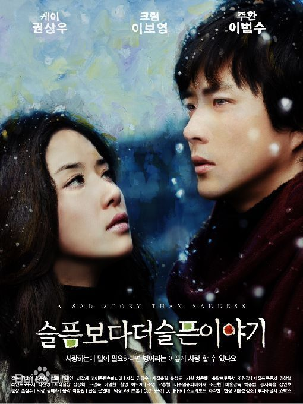

# 比悲伤更悲伤的电影
[[toc]]

《比悲伤更悲伤的电影》---对于爱情的一点点感悟

----

- 背景
---
故事剧情不拖沓，情节跌宕起伏。
 先介绍下他们都是孤儿，男主有家族遗传癌症，父亲死亡，母亲出走；女主父母出车祸死亡。
 
- 剧情 
---
篇头是一个歌手和经纪人去找女主写词，却意外听到了这个故事。故事开头男主因为女主的调皮被老师责罚，但是那时，男主就对女主一见钟情。为了一些事情，他们住在一起，温馨度过了很久很久的时光。正如，女主对医生所说，男主在家里是母亲，在工作上是父亲，在受伤的时候是哥哥，但是更多时候是情人。男主在得知自己不久就要离世，他没有讲这件事告诉女主，而是希望女主早日结婚，于是他就帮助女主，摆平医生的前妻。最后，女主结婚了，男主不久去世后，随后，女主也就跟着走了。

- 所思

---

这是多么伟大的爱情！男主想到的不是自己，而是女主，第一想法就是想让女主幸福，正如影片中所说，他的愿望是女主能找一个健康、阳光和温柔的男人。男主到最后还是没有告诉女主，而是默默地付出。但是女主却意外得知男主发生的一切，也知道男主的愿望。所以女主坚强的忍受痛苦，明明很爱他，却为了他，最后和一个不爱的人结婚。谁说爱情不如面包！在这里，我认为面包并没有爱情重要。这两个彼此相爱的人，却因为生死而不能结婚，但是这够了，他们的行动证明了一切：爱情可以让彼此付出一切，爱情可以让人奋不顾身。爱并不是非要让对方和自己在一起，而是只要对方幸福，哪怕是一点点开心，自己就很满足了。

这是多么心酸的爱情！当在教堂他牵着女主走向牧师，将女主交给医生后转身哭泣的时候，鼻尖一酸，仿佛自己所经历一样。我受不了这样的离别。为什么男主要患有癌症？假如他身体健康，那么就可以和女主在一起，结婚生子，过着浪漫满屋的生活。偏偏上天这么捉弄人，使这两个人多么不幸和心酸。

- 心得

要珍惜身边爱我和我爱的人。

---

链接: [https://pan.baidu.com/s/1aW9bFcp256fgqt8v9mBg1Q](https://pan.baidu.com/s/1aW9bFcp256fgqt8v9mBg1Q) 提取码: rd31 复制这段内容后打开百度网盘手机App，操作更方便哦
