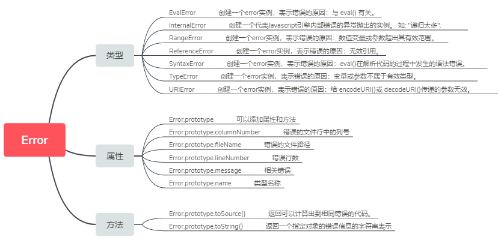

# 重读MDN-严格模式

MDN里面涵盖了所有web开发的知识，对开发者学习和夯实基础来说就是一个宝库。

将官网上的主要知识点抽离，组合成自己的知识网络。

每个人的知识体系是不同的，但又是各有相同之处，希望我的整理对您有帮助。

《重读MDN》系列是作者会坚持下去的，旨在查漏补缺，让自己知识的盲区能缩小些。

当然，MDN中有些翻译不对的地方，希望大家可以一起修改，作者修改了好几处错误。



## 前置知识
1. 正常模式
就是非严格模式——平时我们会称之为正常模式(sloppy mode)，也被翻译为马虎模式/稀松模式/懒散模式。
2. 静默错误
脚本在编码的时候都是正常的，没有错误，但是使用的时候却发现了错误。
3. 内联事件处理属性
就是在DOM元素中加入事件，如：
```js
<input type="button" value="click me" onclick="show(this,type,event)">
```

ES5的严格模式是采用具有限制性JavaScript变体的一种方式，从而使代码显示地 脱离“马虎模式/稀松模式/懒散模式“（sloppy）模式。

严格模式不仅仅是一个子集：它的产生是为了形成与正常代码不同的语义。

不支持严格模式与支持严格模式的浏览器在执行严格模式代码时会采用不同行为。

所以在没有对运行环境展开特性测试来验证对于严格模式相关方面支持的情况下，就算采用了严格模式也不一定会取得预期效果。严格模式代码和非严格模式代码可以共存，因此项目脚本可以渐进式地采用严格模式。
 
严格模式对正常的 JavaScript语义做了一些更改。

1. 严格模式通过抛出错误来消除了一些原有静默错误。
2. 严格模式修复了一些导致 JavaScript引擎难以执行优化的缺陷：有时候，相同的代码，严格模式可以比非严格模式下运行得更快。
3. 严格模式禁用了在ECMAScript的未来版本中可能会定义的一些语法。
## 调用严格模式
严格模式可以应用到整个脚本或个别函数中。不要在封闭大括弧 {} 内这样做，在这样的上下文中这么做是没有效果的。在 eval 、Function 、内联事件处理属性、  WindowTimers.setTimeout() 方法中传入的脚本字符串，其行为类似于开启了严格模式的一个单独脚本，它们会如预期一样工作。
### 为脚本开启严格模式
为整个脚本文件开启严格模式，需要在所有语句之前放一个特定语句 "use strict"; （或 'use strict';）
```js
// 整个脚本都开启严格模式的语法
"use strict";
var v = "Hi!  I'm a strict mode script!";
```
不能盲目的合并冲突代码。
### 为函数开启严格模式
同样的，要给某个函数开启严格模式，得把 "use strict";  (或 'use strict'; )声明一字不漏地放在函数体所有语句之前。
```js
function strict() {
  // 函数级别严格模式语法
  'use strict';
  function nested() { 
    return "And so am I!"; 
  }
  return "Hi!  I'm a strict mode function!  " + nested();
}

function notStrict() { 
  return "I'm not strict."; 
}
```

## 严格模式中的变化
严格模式同时改变了语法及运行时行为。变化通常分为这几类：将问题直接转化为错误（如语法错误或运行时错误）, 简化了如何为给定名称的特定变量计算，简化了 eval 以及 arguments, 将写"安全“JavaScript的步骤变得更简单，以及改变了预测未来ECMAScript行为的方式。

### 将过失错误转成异常

在严格模式下, 某些先前被接受的过失错误将会被认为是异常. JavaScript被设计为能使新人开发者更易于上手, 所以有时候会给本来错误操作赋予新的不报错误的语义(non-error semantics). 有时候这可以解决当前的问题, 但有时候却会给以后留下更大的问题. 严格模式则把这些失误当成错误, 以便可以发现并立即将其改正.

第一，严格模式下无法再意外创建全局变量。在普通的JavaScript里面给一个错误命名的变量名赋值会使全局对象新增一个属性并继续“工作”（尽管将来可能会失败：在现代的JavaScript中有可能）。严格模式中意外创建全局变量被抛出错误替代：

```js
"use strict";
                       // 假如有一个全局变量叫做mistypedVariable
mistypedVaraible = 17; // 因为变量名拼写错误
                       // 这一行代码就会抛出 ReferenceError
```
这就涉及到我们之前整理的[Error](https://www.qiufeihong.top/technical-mdn/error/#%E8%AF%AD%E6%B3%95)有关，如果代码中出现申明的全局变量，则会抛出引用错误`ReferenceError`

第二, 严格模式会使引起静默失败(silently fail,注:不报错也没有任何效果)的赋值操作抛出异常. 例如, NaN 是一个不可写的全局变量. 在正常模式下, 给 NaN 赋值不会产生任何作用; 开发者也不会受到任何错误反馈. 但在严格模式下, 给 NaN 赋值会抛出一个异常. 任何在正常模式下引起静默失败的赋值操作 (给不可写属性赋值, 给只读属性(getter-only)赋值赋值, 给不可扩展对象(non-extensible object)的新属性赋值) 都会抛出异常:

```js
"use strict";

// 给不可写属性赋值
var obj1 = {};
Object.defineProperty(obj1, "x", { value: 42, writable: false });
obj1.x = 9; // 抛出TypeError错误

// 给只读属性赋值
var obj2 = { get x() { return 17; } };
obj2.x = 5; // 抛出TypeError错误

// 给不可扩展对象的新属性赋值
var fixed = {};
Object.preventExtensions(fixed);
fixed.newProp = "ohai"; // 抛出TypeError错误
```

第三, 在严格模式下, 试图删除不可删除的属性时会抛出异常(之前这种操作不会产生任何效果):

```js
"use strict";
delete Object.prototype; // 抛出TypeError错误
```

第四，在Gecko版本34之前，严格模式要求一个对象内的所有属性名在对象内必须唯一。正常模式下重名属性是允许的，最后一个重名的属性决定其属性值。因为只有最后一个属性起作用，当代码要去改变属性值而不是修改最后一个重名属性的时候，复制这个对象就产生一连串的bug。在严格模式下，重名属性被认为是语法错误：

```js
"use strict";
var o = { p: 1, p: 2 }; // !!! 语法错误
```

第五, 严格模式要求函数的参数名唯一. 在正常模式下, 最后一个重名参数名会掩盖之前的重名参数. 之前的参数仍然可以通过 arguments[i] 来访问, 还不是完全无法访问. 然而, 这种隐藏毫无意义而且可能是意料之外的 (比如它可能本来是打错了), 所以在严格模式下重名参数被认为是语法错误:
```js
function sum(a, a, c) { // !!! 语法错误
  "use strict";
  return a + a + c; // 代码运行到这里会出错
}
```
第六, 严格模式禁止八进制数字语法. ECMAScript并不包含八进制语法, 但所有的浏览器都支持这种以零(0)开头的八进制语法: 0644 === 420 还有 "\045" === "%".在ECMAScript 6中支持为一个数字加"0o"的前缀来表示八进制数.

```js
var a = 0o10; // ES6: 八进制
```

有些新手开发者认为数字的前导零没有语法意义, 所以他们会用作对齐措施 — 但其实这会改变数字的意义! 八进制语法很少有用并且可能会错误使用, 所以严格模式下八进制语法会引起语法错误:

```js
"use strict";
var sum = 015 + // !!! 语法错误
          197 +
          142;
```

第七，ECMAScript 6中的严格模式禁止设置primitive值的属性.不采用严格模式,设置属性将会简单忽略(no-op),采用严格模式,将抛出TypeError错误

```js
(function() {
  "use strict";

  false.true = "";              //TypeError
  (14).sailing = "home";        //TypeError
  "with".you = "far away";      //TypeError
})();
```

### 简化变量的使用
严格模式简化了代码中变量名字映射到变量定义的方式. 很多编译器的优化是依赖存储变量X位置的能力：这对全面优化JavaScript代码至关重要. JavaScript有些情况会使得代码中名字到变量定义的基本映射只在运行时才产生. 严格模式移除了大多数这种情况的发生, 所以编译器可以更好的优化严格模式的代码.

第一, 严格模式禁用 with.  with所引起的问题是块内的任何名称可以映射(map)到with传进来的对象的属性, 也可以映射到包围这个块的作用域内的变量(甚至是全局变量), 这一切都是在运行时决定的: 在代码运行之前是无法得知的. 严格模式下, 使用 with 会引起语法错误, 所以就不会存在 with 块内的变量在运行是才决定引用到哪里的情况了:
```js
"use strict";
var x = 17;
with (obj) { // !!! 语法错误
  // 如果没有开启严格模式，with中的这个x会指向with上面的那个x，还是obj.x？
  // 如果不运行代码，我们无法知道，因此，这种代码让引擎无法进行优化，速度也就会变慢。
  x;
}
```

一种取代 with的简单方法是，将目标对象赋给一个短命名变量，然后访问这个变量上的相应属性.

第二, 严格模式下的 eval 不再为上层范围(surrounding scope,注:包围eval代码块的范围)引入新变量. 在正常模式下,  代码 eval("var x;") 会给上层函数(surrounding function)或者全局引入一个新的变量 x . 这意味着, 一般情况下,  在一个包含 eval 调用的函数内所有没有引用到参数或者局部变量的名称都必须在运行时才能被映射到特定的定义 (因为 eval 可能引入的新变量会覆盖它的外层变量). 在严格模式下 eval 仅仅为被运行的代码创建变量, 所以 eval 不会使得名称映射到外部变量或者其他局部变量:

```js
var x = 17;
var evalX = eval("'use strict'; var x = 42; x");
console.assert(x === 17);
console.assert(evalX === 42);
```
相应的, 如果函数 eval 被在严格模式下的eval(...)以表达式的形式调用时, 其代码会被当做严格模式下的代码执行. 当然也可以在代码中显式开启严格模式, 但这样做并不是必须的.
```js
function strict1(str) {
  "use strict";
  return eval(str); // str中的代码在严格模式下运行
}
function strict2(f, str) {
  "use strict";
  return f(str); // 没有直接调用eval(...): 当且仅当str中的代码开启了严格模式时
                 // 才会在严格模式下运行
}
function nonstrict(str) {
  return eval(str); // 当且仅当str中的代码开启了"use strict"，str中的代码才会在严格模式下运行
}

strict1("'Strict mode code!'");
strict1("'use strict'; 'Strict mode code!'");
strict2(eval, "'Non-strict code.'");
strict2(eval, "'use strict'; 'Strict mode code!'");
nonstrict("'Non-strict code.'");
nonstrict("'use strict'; 'Strict mode code!'");
```
因此，在 eval 执行的严格模式代码下，变量的行为与严格模式下非 eval 执行的代码中的变量相同。

第三, 严格模式禁止删除声明变量。delete name 在严格模式下会引起语法错误：
```js
"use strict";

var x;
delete x; // !!! 语法错误

eval("var y; delete y;"); // !!! 语法错误
```

### 让eval和arguments变的简单
严格模式让arguments和eval少了一些奇怪的行为。两者在通常的代码中都包含了很多奇怪的行为： eval会添加删除绑定，改变绑定好的值，还会通过用它索引过的属性给形参取别名的方式修改形参. 虽然在未来的ECMAScript版本解决这个问题之前，是不会有补丁来完全修复这个问题，但严格模式下将eval和arguments作为关键字对于此问题的解决是很有帮助的。

第一, 名称 eval 和 arguments 不能通过程序语法被绑定(be bound)或赋值. 以下的所有尝试将引起语法错误:

```JS
"use strict";
eval = 17;
arguments++;
++eval;
var obj = { set p(arguments) { } };
var eval;
try { } catch (arguments) { }
function x(eval) { }
function arguments() { }
var y = function eval() { };
var f = new Function("arguments", "'use strict'; return 17;");
```
第二，严格模式下，参数的值不会随 arguments 对象的值的改变而变化。在正常模式下，对于第一个参数是 arg 的函数，对 arg 赋值时会同时赋值给 arguments[0]，反之亦然（除非没有参数，或者 arguments[0] 被删除）。严格模式下，函数的 arguments 对象会保存函数被调用时的原始参数。arguments[i] 的值不会随与之相应的参数的值的改变而变化，同名参数的值也不会随与之相应的 arguments[i] 的值的改变而变化。

```js
function f(a) {
  "use strict";
  a = 42;
  return [a, arguments[0]];
}
var pair = f(17);
console.assert(pair[0] === 42);
console.assert(pair[1] === 17);
```

第三，不再支持 arguments.callee。正常模式下，arguments.callee 指向当前正在执行的函数。这个作用很小：直接给执行函数命名就可以了！此外，arguments.callee 十分不利于优化，例如内联函数，因为 arguments.callee 会依赖对非内联函数的引用。在严格模式下，arguments.callee 是一个不可删除属性，而且赋值和读取时都会抛出异常：

```js
"use strict";
var f = function() { return arguments.callee; };
f(); // 抛出类型错误
```

### "安全的" JavaScript
严格模式下更容易写出“安全”的JavaScript。现在有些网站提供了方式给用户编写能够被网站其他用户执行的JavaScript代码。在浏览器环境下，JavaScript能够获取用户的隐私信息，因此这类Javascript必须在运行前部分被转换成需要申请访问禁用功能的权限。没有很多的执行时检查的情况，Javascript的灵活性让它无法有效率地做这件事。一些语言中的函数普遍出现，以至于执行时检查他们会引起严重的性能损耗。做一些在严格模式下发生的小改动，要求用户提交的JavaScript开启严格模式并且用特定的方式调用，就会大大减少在执行时进行检查的必要。

第一，在严格模式下通过this传递给一个函数的值不会被强制转换为一个对象。对一个普通的函数来说，this总会是一个对象：不管调用时this它本来就是一个对象；还是用布尔值，字符串或者数字调用函数时函数里面被封装成对象的this；还是使用undefined或者null调用函数式this代表的全局对象（使用call, apply或者bind方法来指定一个确定的this）。这种自动转化为对象的过程不仅是一种性能上的损耗，同时在浏览器中暴露出全局对象也会成为安全隐患，因为全局对象提供了访问那些所谓安全的JavaScript环境必须限制的功能的途径。所以对于一个开启严格模式的函数，指定的this不再被封装为对象，而且如果没有指定this的话它值是undefined：
```js
"use strict";
function fun() { return this; }
console.assert(fun() === undefined);
console.assert(fun.call(2) === 2);
console.assert(fun.apply(null) === null);
console.assert(fun.call(undefined) === undefined);
console.assert(fun.bind(true)() === true);
```

第二，在严格模式中再也不能通过广泛实现的ECMAScript扩展“游走于”JavaScript的栈中。在普通模式下用这些扩展的话，当一个叫fun的函数正在被调用的时候，fun.caller是最后一个调用fun的函数，而且fun.arguments包含调用fun时用的形参。这两个扩展接口对于“安全”JavaScript而言都是有问题的，因为他们允许“安全的”代码访问"专有"函数和他们的（通常是没有经过保护的）形参。如果fun在严格模式下，那么fun.caller和fun.arguments都是不可删除的属性而且在存值、取值时都会报错：

```js
function restricted() {
  "use strict";
  restricted.caller;    // 抛出类型错误
  restricted.arguments; // 抛出类型错误
}

function privilegedInvoker() {
  return restricted();
}

privilegedInvoker();
```

第三，严格模式下的arguments不会再提供访问与调用这个函数相关的变量的途径。在一些旧时的ECMAScript实现中arguments.caller曾经是一个对象，里面存储的属性指向那个函数的变量。这是一个安全隐患，因为它通过函数抽象打破了本来被隐藏起来的保留值；它同时也是引起大量优化工作的原因。出于这些原因，现在的浏览器没有实现它。但是因为它这种历史遗留的功能，arguments.caller在严格模式下同样是一个不可被删除的属性，在赋值或者取值时会报错：
```js
"use strict";
function fun(a, b) {
  "use strict";
  var v = 12;
  return arguments.caller; // 抛出类型错误
}
fun(1, 2); // 不会暴露v（或者a，或者b）
```

## 浏览器的严格模式
主流浏览器现在实现了严格模式。但是不要盲目的依赖它，因为市场上仍然有大量的浏览器版本只部分支持严格模式或者根本就不支持（比如IE10之前的版本）。严格模式改变了语义。依赖这些改变可能会导致没有实现严格模式的浏览器中出现问题或者错误。谨慎地使用严格模式，通过检测相关代码的功能保证严格模式不出问题。最后，记得在支持或者不支持严格模式的浏览器中测试你的代码。如果你只在不支持严格模式的浏览器中测试，那么在支持的浏览器中就很有可能出问题，反之亦然。
## 参考文献
[严格模式](https://developer.mozilla.org/zh-CN/docs/Web/JavaScript/Reference/Strict_mode)