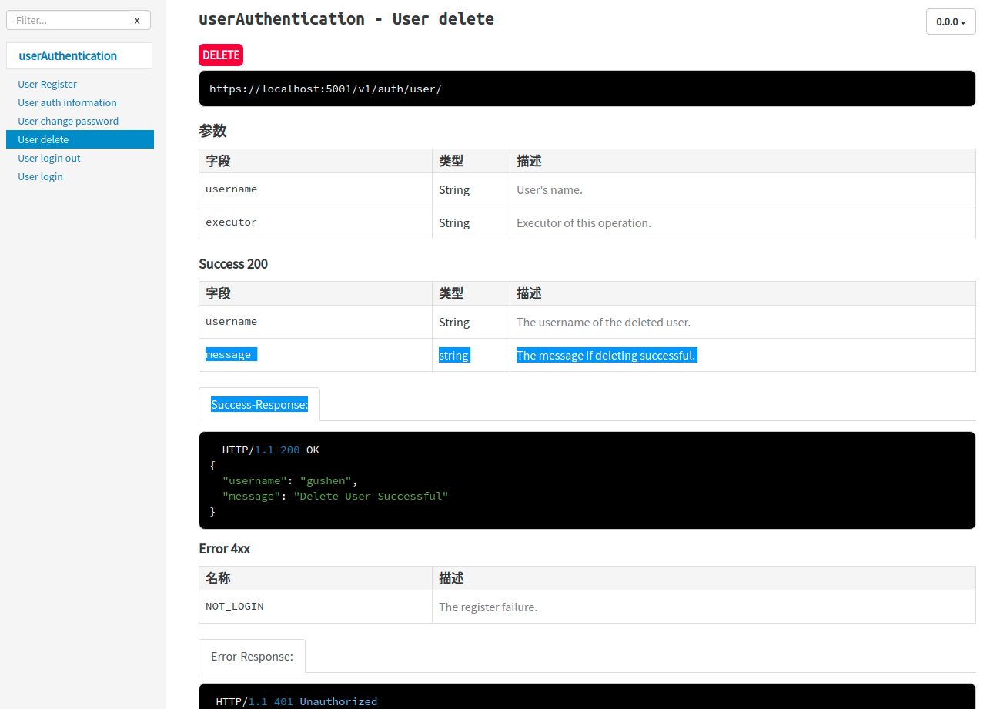
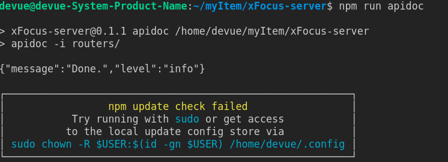
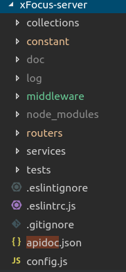
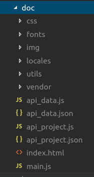

# apiDoc生成接口文档,不费吹灰之力

## 效果


## 背景
之前做前端的时候,后端同学仗着自己是老同志,不给我接口文档

苦逼如我,需要拿着笔坐在他的旁边,听他口述

写下需要的api接口url和参数等等

现在自己做后端了,那不能这样子胡作非为了

自己吃的苦,怎能给其他同学吃呢?

这时候,apiDoc你值得拥有,稳稳的输出一篇优质的接口文档

## 安装apidoc
官网上是全局安装,我是喜欢安装到项目中,这样可以在另一个环境下,`npm install`就可以下载有所有依赖包
```bash
npm install apidoc --save-dev/-D
```
## 写注释
### 注册接口的注释
```javascript
/**
 * @api {post} /v1/auth/register User Register
 * @apiName UserRegister
 * @apiGroup userAuthentication
 *
 * @apiParam {String} username  New user's username.
 * @apiParam {String} password  New user's password.
 *
 * @apiSuccess {String} username  The username of the register user.
 * @apiSuccess {string} message  The registering success info.
 *
 * @apiSuccessExample Success-Response:
 *     HTTP/1.1 200 OK
 *     {
 *       "username": "username",
 *       "message": "User registered successful"
 *     }
 *
 * @apiError REGISTER_FAILURE The register failure.
 *
 * @apiErrorExample Error-Response:
 *     HTTP/1.1 500 Internal Server Error
 *    {
 *      "err": "REGISTER_FAILURE",
 *      "message": "User register failure!"
 *    }
 */
```
### 删除接口的注释

```js
/**
 * @api {delete} /v1/auth/user/ User delete
 * @apiName UserDelete
 * @apiGroup userAuthentication
 *
 * @apiParam {String} username  User's username.
 * @apiParam {String} executor  Executor of this operation.
 *
 * @apiSuccess {String} username  The username of the deleted user.
 * @apiSuccess {string} message  The message if deleting successful.
 *
 * @apiSuccessExample Success-Response:
 *     HTTP/1.1 200 OK
 *   {
 *     "username": "username",
 *     "message": "Delete User Successful"
 *   }
 *
 * @apiError NOT_LOGIN The register failure.
 *
 * @apiErrorExample Error-Response:
 *     HTTP/1.1 401 Unauthorized
 *    {
 *      "err": "NOT_LOGIN",
 *      "message": "User has not logon in!"
 *    }
 */
```
## 写入命令
将`apidoc -i routers/`写入package.json的命令中

routers文件夹下都是路由文件

```json {4}
  "scripts": {
    "test": "echo \"Error: no test specified\" && exit 1",
    "lint": "eslint .",
    "apidoc": "apidoc -i routers/",
    "dev": "node --harmony index.js"
  },
```
出现了`{"message":"Done.","level":"info"}`,即成功了


## 执行命令

执行`npm run apidoc`即可拿到接口文档

这样,在项目中就会出现`doc`文件夹



## 生成文档
这样,`doc`文件夹中包含该页面的所有材料



打开`index.html`


热乎乎的接口文档诞生了


## 结构解读

一个静态的文档很漂亮的生成了，但是实际控制这个方法的是api_data.js和api_project.js。但是实际上的数据显示是由api_data.json和api_project.json这两个json文件。

所以在支持将其他json格式转换成api_data.json和api_project.json，把apidoc生成的这两个文件进行替换，然后替换js文件，直接生产静态文档。

## 命令行界面
查看所有命令
```
apidoc -h
```

选项|作用
--|--
-f --file-filters |用于选择应分析的文件的regex筛选器（可以使用多个-f）。（默认值：[]）
-e, --exclude-filters |用于选择不应解析的文件/目录的regex筛选器（可以使用many-e）。（默认值：[]）
-i, --input |输入/源目录名。（默认值：[]）           
-o, --output |输出目录。（默认：“./doc/”）    
-t, --template |对输出文件使用模板。（默认值：“/usr/local/lib/node_modules/apidoc/template/”）
-c, --config |包含配置文件（apidoc.json）的目录路径。（默认值：“./”）
-p, --private|Include private APIs in output.                      
-v, --verbose|详细调试输出。    
--debug|显示调试消息。  
--color|关闭日志颜色。
--parse|只解析文件并返回数据，不创建文件。
--parse-filters |可选的用户定义筛选器。格式名=文件名（默认值：[]）
--parse-languages |可选的用户定义语言。格式名=文件名（默认值：[]
--parse-parsers |可选的用户定义的分析器。格式名=文件名（默认值：[]）
--parse-workers |可选的用户定义的工作人员。格式名=文件名（默认值：[]）
--silent|关闭所有输出。   
--simulate|执行但不写入任何文件。
--markdown [markdown]|关闭默认标记分析器或将文件设置为自定义分析器。（默认值：真）         
--line-ending |关闭自动检测行尾。允许值：lf，cr，crlf。      
--encoding |设置源代码的编码。[UTF8]格式。（默认值：“utf8”）
-h, --help|输出使用信息                    

## 所用的的apiDoc的参数(翻译)
### @api
```
@api {method} path [title]
```
必需的！
如果没有该指示器，apidoc解析器将忽略文档块。
唯一的例外是`@apidefine`定义的文档块，它们不需要`@api`。


Usage: @api {get} /user/:id Users unique ID.

Name|Description
--|--
method|Request method name: DELETE, GET, POST, PUT, ...
path|Request Path.
title optional|A short title. (used for navigation and article header)

```
/**
 * @api {get} /user/:id
 */
```
### @apiName
```
@apiName name
```
应始终使用。
定义方法文档块的名称。名称将用于生成的输出中的子导航。结构定义不需要`@apinname`。
用法：`@apinname getuser`

Name|Description
--|--
name|方法的唯一名称。可以定义相同的名称和不同的`@apiversion`。格式：`method+path`（例如`get+user`），只有一个建议，您可以根据需要命名。也可以用作导航标题。

```
/**
 * @api {get} /user/:id
 * @apiName GetUser
 */
```
### @apiGroup
```
@apiGroup name
```
应始终使用。
定义方法文档块所属的组。组将用于生成的输出中的主导航。结构定义不需要`@apigroup`。
用法：`@apigroup user`

Name|Description
--|--
name|组名称。也使用导航标题。

```
/**
 * @api {get} /user/:id
 * @apiGroup User
 */
```

### @apiParam
```
@apiParam [(group)] [{type}] [field=defaultValue] [description]
```

描述传递给API方法的参数。

用法：`@apiparam（mygroup）number id users unique id`。

Name|Description
--|--
(group)optional|所有参数都将按此名称分组。如果没有组，则设置默认参数。您可以使用`@apidefine`设置标题和说明。
{type}optional|参数类型,如`{Boolean}`, `{Number}`, `{String}`, `{Object}`, `{String[]}`
{type{size}}optional|变量大小的信息`{string{..5}}` 最大值为5的字符串.`{string{2..5}}` 最小2最大为5的字符串.`{number{100-999}}` 在100到999的i数字.
{type=allowedValues}optional|有关变量允许值的信息。`{string="small"} `包含`small`的字符串,`{string="small","huge"}`包含`small`/`huge`的字符串,`{number=1,2,3,99}`一个允许值是1,2,3,和99的数字,`{string {..5}="small","huge"}`最多5个字符的字符串，只包含单词“small”或“mage”。
field|变量名称.
[field]|带括号的fieldname将变量定义为可选变量。
=defaultValueoptional|参数默认值。
descriptionoptional|字段的说明。

```
/**
 * @api {get} /user/:id
 * @apiParam {Number} id Users unique ID.
 */

/**
 * @api {post} /user/
 * @apiParam {String} [firstname]  Optional Firstname of the User.
 * @apiParam {String} lastname     Mandatory Lastname.
 * @apiParam {String} country="DE" Mandatory with default value "DE".
 * @apiParam {Number} [age=18]     Optional Age with default 18.
 *
 * @apiParam (Login) {String} pass Only logged in users can post this.
 *                                 In generated documentation a separate
 *                                 "Login" Block will be generated.
 */
```
### @apiSuccess
```
@apiSuccess [(group)] [{type}] field [description]
```
成功返回参数。
用法：`@apiSuccess {String} firstname Firstname of the User`。

Name|Description
--|--
(group)optional|所有参数都将按此名称分组。
如果没有组，则设置默认成功200。
您可以使用@apidefine设置标题和说明。
{type}optional|返回类型,如`{Boolean}`, `{Number}`, `{String}`, `{Object}`, `{String[]}`
field|返回标识符（返回成功代码）。
description optional|字段的说明。

```
/**
 * @api {get} /user/:id
 * @apiSuccess {String} firstname Firstname of the User.
 * @apiSuccess {String} lastname  Lastname of the User.
 */
```
Example with (group), more group-examples at @apiSuccessTitle:
```
/**
 * @api {get} /user/:id
 * @apiSuccess (200) {String} firstname Firstname of the User.
 * @apiSuccess (200) {String} lastname  Lastname of the User.
 */
```
Example with Object:

```
/**
 * @api {get} /user/:id
 * @apiSuccess {Boolean} active        Specify if the account is active.
 * @apiSuccess {Object}  profile       User profile information.
 * @apiSuccess {Number}  profile.age   Users age.
 * @apiSuccess {String}  profile.image Avatar-Image.
 */
```
Example with Array:
```
/**
 * @api {get} /users
 * @apiSuccess {Object[]} profiles       List of user profiles.
 * @apiSuccess {Number}   profiles.age   Users age.
 * @apiSuccess {String}   profiles.image Avatar-Image.
 */
```

### @apiSuccessExample
```
@apiSuccessExample [{type}] [title]
                   example
```
成功返回消息的示例，输出为预先格式化的代码。
用途：` @apiSuccessExample {json} Success-Response:
                   { "content": "This is an example content" }`

Name|Description
--|--
typeoptional|响应格式
titleoptional|示例的简短标题
example|详细示例，支持多行

```
/**
 * @api {get} /user/:id
 * @apiSuccessExample {json} Success-Response:
 *     HTTP/1.1 200 OK
 *     {
 *       "firstname": "John",
 *       "lastname": "Doe"
 *     }
 */
```

### @apiError
```
@apiError [(group)] [{type}] field [description]
```
成功返回参数。
用法：`@apiError UserNotFound`。

Name|Description
--|--
(group)optional|所有参数都将按此名称分组。如果没有组，则设置默认错误`4xx`。您可以使用`@apidefine`设置标题和说明。
{type}optional|返回类型,如`{Boolean}`, `{Number}`, `{String}`, `{Object}`, `{String[]}`
field|返回标识符（返回失败代码）。
description optional|字段的说明。

```
/**
 * @api {get} /user/:id
 * @apiSuccess {String} firstname Firstname of the User.
 * @apiSuccess {String} lastname  Lastname of the User.
 */
```

### @apiErrorExample
```
@apiErrorExample [{type}] [title]
                 example
```


失败返回消息的示例，输出为预先格式化的代码。
用途：` @apiErrorExample {json} Error-Response:
                 This is an example. `

Name|Description
--|--
typeoptional|响应格式
titleoptional|示例的简短标题
example|详细示例，支持多行

```
/**
 * @api {get} /user/:id
 * @apiErrorExample {json} Error-Response:
 *     HTTP/1.1 404 Not Found
 *     {
 *       "error": "UserNotFound"
 *     }
 */
```

## 参考文献
[apidoc官网](http://apidocjs.com/)

[接口文档神器之apidoc](https://www.cnblogs.com/yuanyuanyuan/p/9000198.html)

[apidoc快速生成在线文档，apidoc生成静态文件的生成规则，原理分析，实践](https://www.jqhtml.com/44647.html)


最后，别忘了给这个项目点一个star哦，谢谢支持。

[blog](https://github.com/qiufeihong2018/vuepress-blog)


一个学习编程技术的公众号。每天推送高质量的优秀博文、开源项目、实用工具、面试技巧、编程学习资源等等。目标是做到个人技术与公众号一起成长。欢迎大家关注，一起进步，走向全栈大佬的修炼之路

<style scoped>
    p:nth-last-child(2) {
        text-align: center
    }
</style>