# 【canvas】小白看了都会的canvas圣经
## canvas是什么
众所周知， `canvas` 是一个可以使用脚本在其中绘制图像的 `HTML` 元素。

> ​它最初由苹果内部使用自己 MacOS X WebKit 推出，供应用程序使用像仪表盘的构件和 Safari 浏览器使用。后来，有人通过 Gecko 内核的浏览器 (尤其是 Mozilla和Firefox)，Opera 和 Chrome 和超文本网络应用技术工作组建议为下一代的网络技术使用该元素。

>​ Canvas 是由 HTML 代码配合高度和宽度属性而定义出的可绘制区域。JavaScript 代码可以访问该区域，类似于其他通用的二维 API，通过一套完整的绘图函数来动态生成图形。Mozilla 程序从 Gecko 1.8 (Firefox 1.5) 开始支持 `<canvas>`, Internet Explorer 从 IE9 开始 `<canvas>` 。Chrome 和 Opera 9+ 也支持 `<canvas>`。
## 属性
支持全局属性（所有 `HTML` 元素共有的属性）

基本的 `HTML` 全局属性之外，还存在以下全局属性:

1. xml:lang 和 xml:base ——两者都是从XHTML规范继承，但为了兼容性而被保留的。
2. 多重aria-*属性，用于改善可访问性。
3. 事件处理程序 属性：onabort, onautocomplete, onautocompleteerror, onblur, oncancel, oncanplay, oncanplaythrough, onchange, onclick, onclose, oncontextmenu, oncuechange, ondblclick, ondrag, ondragend, ondragenter, ondragexit, ondragleave, ondragover, ondragstart, ondrop, ondurationchange, onemptied, onended, onerror, onfocus, oninput, oninvalid, onkeydown, onkeypress, onkeyup, onload, onloadeddata, onloadedmetadata, onloadstart, onmousedown, onmouseenter, onmouseleave, onmousemove, onmouseout, onmouseover, onmouseup, onmousewheel, onpause, onplay, onplaying, onprogress, onratechange, onreset, onresize, onscroll, onseeked, onseeking, onselect, onshow, onsort, onstalled, onsubmit, onsuspend, ontimeupdate, ontoggle, onvolumechange, onwaiting.
4. height
该元素占用空间的高度，以 `CSS` 像素（`px`）表示，默认为 150。
5. moz-opaque  
通过设置这个属性，来控制canvas元素是否半透明。如果你不想canvas元素被设置为半透明，使用这个元素将可以优化浏览器绘图性能。
6. width
该元素占用空间的宽度，以 `CSS` 像素（`px`）表示，默认为 300。

当然可以使用`CSS`来修改`canvas`达到自适应，但是如果`<canvas>`元素中展示的内容变形，可以通过`<canvas>`自带的`height`和`width`属性进行相关设置，而不要使用`CSS`。
## 缺点
- 可访问性差
本身只是一个位图，不提供任何绘制对象的信息。画布内容不像`HTML`那样具有语义并能暴露给可访问性工具。
应该避免在交互型的网站或者`App`上使用`canvas`。

但是还是有下面 `4` 中方式来交互:
1. 内容兼容
2. ARIA 规则
3. 点击区域（hit region）
4. 焦点圈
## Canvas API
### HTMLCanvasElement
先来看思维导图

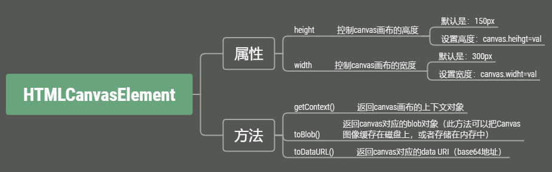
### CanvasRenderingContext2D
先来看思维导图

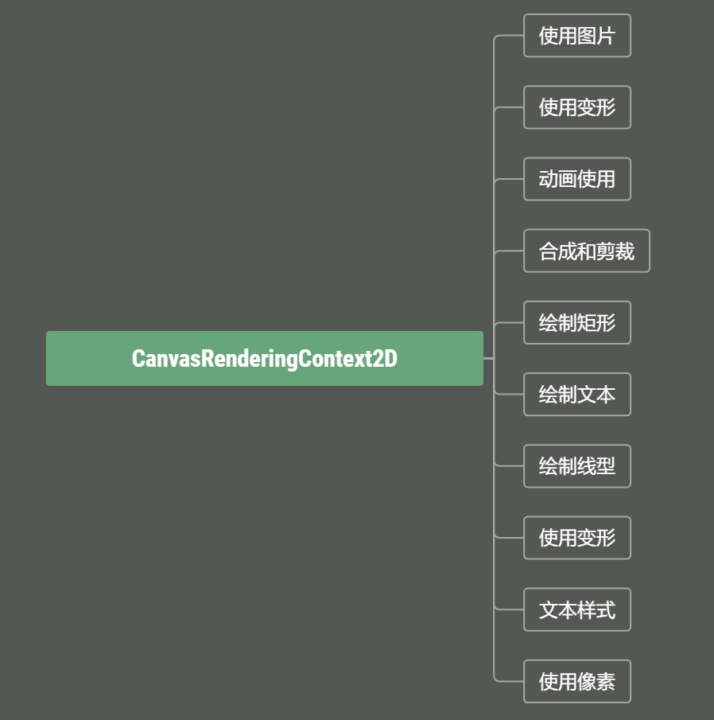

提供的 `2D` 渲染背景用来绘制`<canvas>`元素，为了获得这个接口的对象，需要在 `<canvas>` 上调用 `getContext()` ，并提供一个 "`2d`" 的参数：
```js
var canvas = document.getElementById('rectCanvas');
var ctx = canvas.getContext('2d');
```
只要获得`2d`渲染后，就可以调用`Canvas API`在画布上画出图形。

下面就开始演示如何绘制矩形、文本等图形啦。
### 绘制矩形
想到的就是`strokeRect`方法，其有四个参数，分别是`x`(`x`轴起点坐标),`y`(`y`轴起点坐标),`w`(矩形宽度)和`h`(矩形高度)。

在 `canvas` 中，使用`strokeRect`方法，描绘一个起点在 (`x`, `y`) 、宽度为 `w` 、高度为 `h` 的矩形。

1. strokeRect()
```html
<!DOCTYPE html>
<html lang="en">

<head>
    <meta charset="UTF-8">
    <meta name="viewport" content="width=\, initial-scale=1.0">
    <title>Canvas</title>
</head>

<body>
    <canvas id="rectCanvas"></canvas>
</body>
<script>
    var canvas = document.getElementById('rectCanvas');
    var ctx = canvas.getContext('2d');
    ctx.strokeStyle = '#ff0000'
    ctx.strokeRect(10, 10, 100, 100)
</script>

</html>
```

生成矩形

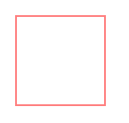

1. fillRect()
那如果想要给矩形填充某个颜色呢？`canvas`也给开发者提供了方法：`fillRect()`。其参数与`strokeRect()`方法一样。

绘制填充矩形，矩形的起点在 (`x`, `y`) 位置，矩形的宽度为 `w` 、高度为 `h`。
```html
<!DOCTYPE html>
<html lang="en">

<head>
    <meta charset="UTF-8">
    <meta name="viewport" content="width=\, initial-scale=1.0">
    <title>Canvas</title>
</head>

<body>
    <canvas id="rectCanvas"></canvas>
</body>
<script>
    var canvas = document.getElementById('rectCanvas');
    var ctx = canvas.getContext('2d');
    ctx.fillStyle = "#ff0000"
    ctx.fillRect(10, 10, 100, 100)
</script>

</html>
```
生成矩形

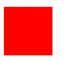

3. clearRect()
比如说当我画一个矩形想清除上一个矩形是否有提供方法？当然有。

`clearRect()`（参数和`strokeRect()`一样）就设置指定矩形区域内所有像素变成透明，并擦除之前绘制的所有内容。
```html
<!DOCTYPE html>
<html lang="en">

<head>
    <meta charset="UTF-8">
    <meta name="viewport" content="width=\, initial-scale=1.0">
    <title>Canvas</title>
</head>

<body>
    <canvas id="rectCanvas"></canvas>
</body>
<script>
    var canvas = document.getElementById('rectCanvas');
    var ctx = canvas.getContext('2d');
    ctx.beginPath();
    ctx.moveTo(20, 20);
    ctx.lineTo(200, 20);
    ctx.lineTo(120, 120);
    // 构成三角形
    ctx.closePath(); 
    ctx.stroke();
    ctx.clearRect(40, 40, 200, 60);
</script>

</html>
```
生成残缺的三角形

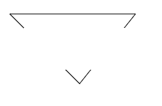
### 绘制文本
1. fillText()
第一个参数`text`,指的是画布上的文本,`x`是起点的 `x` 轴坐标,`y`是起点的 `y` 轴坐标,`maxWidth`是绘制的最大宽度。

`fillText()`方法是在 `(x, y)`位置填充文本的方法。如果选项的第四个参数提供了最大宽度，文本会进行缩放以适应最大宽度。
```html
<!DOCTYPE html>
<html lang="en">

<head>
    <meta charset="UTF-8">
    <meta name="viewport" content="width=\, initial-scale=1.0">
    <title>Canvas</title>
</head>

<body>
    <canvas id="textCanvas"></canvas>
</body>
<script>
    var canvas = document.getElementById('textCanvas');
    var ctx = canvas.getContext('2d');
    ctx.font = '30px serif'
    ctx.fillText('qfh is ok!', 30, 60,400)
</script>

</html>
```

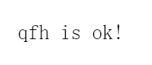

2. strokeText()
参数和方法与`fillText()`方法类同。

`strokeText()`是在给定的 `(x, y)` 位置绘制（描边）文本。注意：这是描边，不是填充。
```html
<!DOCTYPE html>
<html lang="en">

<head>
    <meta charset="UTF-8">
    <meta name="viewport" content="width=\, initial-scale=1.0">
    <title>Canvas</title>
</head>

<body>
    <canvas id="textCanvas"></canvas>
</body>
<script>
    var canvas = document.getElementById('textCanvas');
    var ctx = canvas.getContext('2d');
    ctx.font = '30px serif'
    ctx.strokeText('qfh is ok!', 30, 60,400)
</script>

</html>
```


3. measureText()
参数只有`text`，就是需要测量的字符串。

该方法返回一个关于被测量文本`TextMetrics` 对象包含的信息。
```html
<!DOCTYPE html>
<html lang="en">

<head>
    <meta charset="UTF-8">
    <meta name="viewport" content="width=\, initial-scale=1.0">
    <title>Canvas</title>
</head>

<body>
    <canvas id="textCanvas"></canvas>
</body>
<script>
    var canvas = document.getElementById('textCanvas');
    var ctx = canvas.getContext('2d');
    ctx.font = '30px serif'
    ctx.strokeText('qfh is ok!', 30, 60, 400)
    var str = ctx.measureText('qfh is ok!', 30, 60, 400)
    console.log('str', str)
    // actualBoundingBoxAscent: 21 标明的水平线到渲染文本的所有字体的矩形最高边界顶部的距离
    // actualBoundingBoxDescent: 4 标明的水平线到渲染文本的所有字体的矩形边界最底部的距离
    // actualBoundingBoxLeft: -1 确定的对齐点到文本矩形边界左侧的距离
    // actualBoundingBoxRight: 145 确定的对齐点到文本矩形边界右侧的距离
    // width: 150 字符串的宽度
</script>

</html>
```

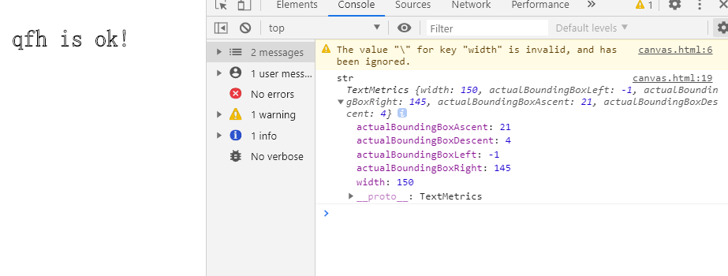

除上述之外，`TextMetrics`还有其他属性：
- ideographicBaseline 标明的水平线到线框的 ideographic 基线的距离
- alphabeticBaseline 标明的水平线到线框的 alphabetic 基线的距离
- hangingBaseline 标明的水平线到线框的 hanging 基线的距离
- emHeightDescent 标明的水平线到线框中 em 方块底部的距离
- emHeightAscent 标明的水平线到线框中 em 方块顶部的距离
- actualBoundingBoxDescent 标明的水平线到渲染文本的矩形边界底部的距离
- fontBoundingBoxDescent 标明的水平线到渲染文本的所有字体的矩形边界最底部的距离
- fontBoundingBoxAscent 标明的水平线到渲染文本的所有字体的矩形最高边界顶部的距离
### 绘制线型
1. lineWidth
设置线段厚度的属性（即线段的宽度）。
```html
    var canvas = document.getElementById('canvas');
    var ctx = canvas.getContext('2d');
    ctx.lineWidth = 30
    ctx.strokeRect(10, 10, 100, 100)
```

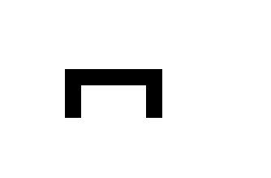

2. lineCap 
绘制每一条线段末端的属性（有 `3` 个可能的值： `butt` ,  `round`  和  `square` 。默认值是 `butt` ）
```html
    var canvas = document.getElementById('canvas');
    var ctx = canvas.getContext('2d');
    // 标准线
    ctx.lineWidth = 1
    ctx.strokeStyle = "#666666"
    ctx.beginPath()
    ctx.moveTo(10, 10)
    ctx.lineTo(150, 10)
    ctx.moveTo(10, 100)
    ctx.lineTo(150, 100)
    ctx.stroke()
    // 三种末端方式
    lineCapArr = ['butt', 'round', 'square']
    for (let i in lineCapArr) {
        ctx.lineWidth = 20
        ctx.strokeStyle = "#ff0000"
        ctx.lineCap = lineCapArr[i]
        ctx.beginPath()
        ctx.moveTo(20 + i * 50, 10)
        ctx.lineTo(20 + i * 50, 100)
        ctx.stroke()
    }
```

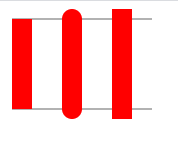

上面的例子可以发现，`butt`是上下是跟标准线平齐，`round`是上下凸出来一个直径为线宽的半圆，`square`是上下凸出来一个高度为线宽一半的矩形。
3. lineJoin
设置 `2` 个长度不为 `0` 的相连部分（线段，圆弧，曲线）如何连接在一起的属性（长度为 `0` 的变形部分，其指定的末端和控制点在同一位置，会被忽略）。此属性有 `3` 个值： `round, bevel and miter`。默认值是 `miter`。注意：如果 `2` 个相连部分在同一方向，那么`lineJoin`不会产生任何效果，因为在那种情况下不会出现连接区域。`round`
通过填充一个额外的，圆心在相连部分末端的<font color = #00FF00 size=4 face="STCAIYUN">扇形</font>，绘制拐角的形状。 圆角的半径是线段的宽度。`bevel`在相连部分的末端填充一个额外的以<font color = #00FF00 size=4 face="STCAIYUN">三角形</font>为底的区域， 每个部分都有各自独立的矩形拐角。`miter`通过延伸相连部分的外边缘，使其相交于一点，形成一个额外的<font color = #00FF00 size=4 face="STCAIYUN">菱形</font>区域。这个设置可以通过 `miterLimit` 属性看到效果。

`lineJoin` 属性3种不同的设置。
```html
    var canvas = document.getElementById('canvas');
    var ctx = canvas.getContext('2d');
    var lineJoinArr = ['round', 'miter', 'bevel']
    ctx.lineWidth = 15
    for (let i in lineJoinArr) {
        ctx.lineJoin = lineJoinArr[i]
        ctx.beginPath()
        ctx.moveTo(0, 45 + i * 30)
        ctx.lineTo(45, 10 + i * 30)
        ctx.lineTo(90, 45 + i * 30)
        ctx.lineTo(135, 10 + i * 30)
        ctx.lineTo(180, 45 + i * 30)
        ctx.stroke()
    }
```

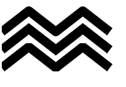

4. miterLimit
设置斜接面限制比例的属性。当获取属性值时，会返回当前的值（默认值是`10.0` ）
```html
<!DOCTYPE html>
<html lang="en">

<head>
  <meta charset="UTF-8">
  <meta name="viewport" content="width=\, initial-scale=1.0">
  <title>Canvas</title>
</head>

<body>
  <canvas id="canvas"></canvas>
  <input id="miterLimit"></input>
  <button onClick="reDraw()">重绘</button>
</body>
<script>
  function reDraw() {
    var ctx = document.getElementById('canvas').getContext('2d');
    ctx.clearRect(0, 0, 300, 150);
    // 标准框
    ctx.strokeStyle = '#666666';
    ctx.lineWidth = 2;
    ctx.strokeRect(0, 50, 300, 50);

    if (document.getElementById('miterLimit').value.match(/\d+(\.\d+)?/)) {
      ctx.miterLimit = parseFloat(document.getElementById('miterLimit').value);
    } else {
      alert('请输入数字！');
    }

    ctx.strokeStyle = '#000';
    ctx.lineWidth = 10;
    ctx.beginPath();
    ctx.moveTo(0, 100);
    for (i = 0; i < 48; i++) {
      var neg = i % 2 == 0 ? 25 : -25;
      ctx.lineTo(Math.pow(i, 1.8), 75 + neg);
    }
    ctx.stroke();
    return false;
  }
</script>

</html>
```

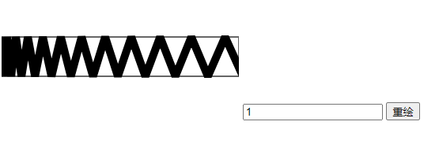

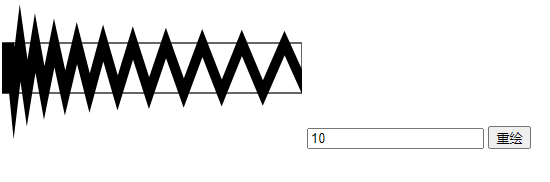


从这三幅图中可以知道，数字（`miterLimit`）越大，斜面面积越多。
5. getLineDash()
当前线段样式的数组，数组包含一组数量为偶数的非负数数字。

这个必须要和`setLineDash()`是一对。
6. setLineDash()
设置当前的线段样式。
```html
 function drawDashedLine(pattern) {
  ctx.beginPath();
  ctx.setLineDash(pattern);
  console.log(ctx.getLineDash())
  ctx.moveTo(0, y);
  ctx.lineTo(300, y);
  ctx.stroke();
  y += 10;
}

const canvas = document.getElementById('canvas');
const ctx = canvas.getContext('2d');
let y = 5;

drawDashedLine([]);
drawDashedLine([1, 1]);
drawDashedLine([100, 100]);
drawDashedLine([50, 50]);
drawDashedLine([50, 1]);
drawDashedLine([20, 5]);
drawDashedLine([15, 3, 3, 3]);
drawDashedLine([20, 3, 3, 3, 3, 3, 3, 3]);
drawDashedLine([12, 3, 3]);  
drawDashedLine([3, 3]);  
```

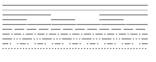

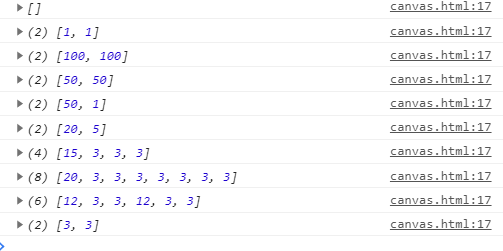

7. lineDashOffset
设置虚线偏移量的属性，描述在哪里开始绘制线段。

实现<font color = #00FF00 size=4 face="STCAIYUN">蚂蚁线</font>

在`ps`套索工具中。 它能帮助用户根据图片背景动态变化的边界来区分选择的边界。
```html
var canvas = document.getElementById("canvas");
var ctx = canvas.getContext("2d");
var offset = 0;

function draw() {
  ctx.clearRect(0,0, canvas.width, canvas.height);
  ctx.setLineDash([10, 2]);
  ctx.lineDashOffset = -offset;
  ctx.strokeRect(10,10, 200, 100);
}

function march() {
  offset++;
  if (offset > 16) {
    offset = 0;
  }
  draw();
  setTimeout(march, 10);
}

march();
```

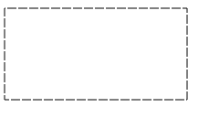
### 文本样式
1. font
描述绘制文字时，当前字体样式的属性。
```js
 var canvas = document.getElementById("canvas");
  var ctx = canvas.getContext("2d");
  ctx.font = "italic bold 24px/30px arial,sans-serif"
  ctx.strokeText('qfh', 10, 50)
```

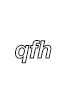

2. textAlign
绘制文本时，文本的对齐方式的属性。

这里的`textAlign="center"`比较特殊。`textAlign`的值为`center`时候文本的居中是基于你在`fillText`的时候所给的`x`的值，也就是说文本一半在`x`的左边，一半在`x`的右边（可以理解为计算`x`的位置时从默认文字的左端，改为文字的中心，因此你只需要考虑`x`的位置即可）。所以，如果你想让文本在整个`canvas`居中，就需要将`fillText`的`x`值设置成`canvas`的宽度的一半。

默认是`start`,可以是`left`、`center`、`right`和`end`。
```html
<!DOCTYPE html>
<html lang="en">

<head>
  <meta charset="UTF-8">
  <meta name="viewport" content="width=\, initial-scale=1.0">
  <title>Canvas</title>
</head>

<body>
  <canvas id="canvas" width="1000" height="1000"></canvas>
</body>
<script>
  var canvas = document.getElementById("canvas");
  var ctx = canvas.getContext("2d");
  ctx.font="italic bold 100px arial,sans-serif"
  ctx.textAlign = "start"
  ctx.strokeText('start', 500, 500)
  ctx.textAlign = "left"
  ctx.strokeText('left', 500, 500)
  ctx.textAlign = "center"
  ctx.strokeText('center', 500, 500)
  ctx.textAlign = "right"
  ctx.strokeText('right', 500, 500)
  ctx.textAlign = "end"
  ctx.strokeText('end', 500, 500)
</script>
</html>
```

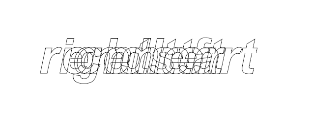

有图可以得知：从左到右属性分别是：`right`
`end`、`center`、`left`和`start`。

3. textBaseline
绘制文本时，当前文本基线的属性。

决定文字垂直方向的对齐方式。

其默认值是`alphabetic`(文本基线是标准的字母基线),还有`top`、`hanging`(文本基线是悬挂基线)、`middle`(文本基线在文本块的中间)、`ideographic`(文字基线是表意字基线；如果字符本身超出了`alphabetic` 基线，那么`ideograhpic`基线位置在字符本身的底部)和`bottom`。
```html
<!DOCTYPE html>
<html lang="en">

<head>
  <meta charset="UTF-8">
  <meta name="viewport" content="width=\, initial-scale=1.0">
  <title>Canvas</title>
</head>

<body>
  <canvas id="canvas" width="1000" height="1000"></canvas>
</body>
<script>
  var canvas = document.getElementById("canvas");
  var ctx = canvas.getContext("2d");
  ctx.font="italic bold 100px arial,sans-serif"
  ctx.textBaseline = "alphabetic"
  ctx.strokeText('alphabetic', 500, 500)
  ctx.textBaseline = "top"
  ctx.strokeText('top', 500, 500)
  ctx.textBaseline = "hanging"
  ctx.strokeText('hanging', 500, 500)
  ctx.textBaseline = "middle"
  ctx.strokeText('middle', 500, 500)
  ctx.textBaseline = "ideographic"
  ctx.strokeText('ideographic', 500, 500)
  ctx.textBaseline = "bottom"
  ctx.strokeText('bottom', 500, 500)
</script>
</html>
```

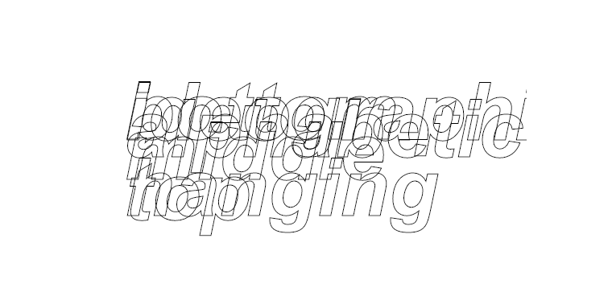

有图可以得知：第一排从左到右属性分别是：`bottom`
`alphabetic`、`ideographic`;第二排从左到右属性分别是：`middle`;
第三排从左到右属性分别是：`top`
`hanging`。

4. direction
当前文本方向的属性

其默认值是`inherit`(继承 `<canvas>` 元素或者 `Document`),还可以是`ltr`(从左向右)、`rtl`(从右向左)。
```html
<!DOCTYPE html>
<html lang="en">

<head>
  <meta charset="UTF-8">
  <meta name="viewport" content="width=\, initial-scale=1.0">
  <title>Canvas</title>
</head>

<body>
  <canvas id="canvas" width="1000" height="1000"></canvas>
</body>
<script>
  var canvas = document.getElementById("canvas");
  var ctx = canvas.getContext("2d");
  ctx.font="italic bold 100px arial,sans-serif"
  ctx.direction  = "inherit"
  ctx.strokeText('inherit', 500, 500)
  ctx.direction  = "ltr"
  ctx.strokeText('从左向右', 500, 500)
  ctx.direction  = "rtl"
  ctx.strokeText('从右向左', 500, 500)
</script>
</html>
```

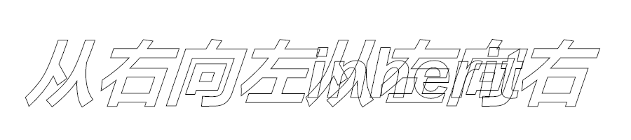

有图可以得知：从左到右属性分别是：`rtl`
`inherit`和`ltr`（最后两个开始位置一样）;

### [使用图片](https://developer.mozilla.org/zh-CN/docs/Web/API/Canvas_API/Tutorial/Using_images)
#### 获得需要绘制的图片

- HTMLImageElement
这些图片是由`Image()`函数构造出来的，或者任何的``元素
- HTMLVideoElement
用一个`HTML`的 `<video>`元素作为你的图片源，可以从视频中抓取当前帧作为一个图像

- HTMLCanvasElement
可以使用另一个 `<canvas>` 元素作为你的图片源。

- ImageBitmap
这是一个高性能的位图，可以低延迟地绘制，它可以从上述的所有源以及其它几种源中生成。

> 使用相同页面内的图片
我们可以通过下列方法的一种来获得与`canvas`相同页面内的图片的引用：

- document.images集合
- document.getElementsByTagName()方法
- 如果你知道你想使用的指定图片的ID，你可以用document.getElementById()获得这个图片

> 使用其它域名下的图片
在 `HTMLImageElement` 上使用 `crossOrigin` 属性，你可以请求加载其它域名上的图片。如果图片的服务器允许跨域访问这个图片，那么你可以使用这个图片而不污染 `canvas` ，否则，使用这个图片将会污染 `canvas` 。

> 使用其它 canvas 元素
和引用页面内的图片类似地，用 `document.getElementsByTagName` 或 `document.getElementById` 方法来获取其它 `canvas` 元素。但你引入的应该是已经准备好的 `canvas`。

一个常用的应用就是将第二个 `canvas` 作为另一个大的 `canvas` 的缩略图。

> 由零开始创建图像
或者我们可以用脚本创建一个新的 `HTMLImageElement` 对象。要实现这个方法，我们可以使用很方便的 `Image()` 构造函数。
```js
var img = new Image();   // 创建一个元素
img.src = 'myImage.png'; // 设置图片源地址
```
当脚本执行后，图片开始装载。

若调用 `drawImage` 时，图片没装载完，那什么都不会发生（在一些旧的浏览器中可能会抛出异常）。因此你应该用 `load` 事件来保证不会在加载完毕之前使用这个图片：
```js
var img = new Image();   // 创建img元素
img.onload = function(){
  // 执行drawImage语句
}
img.src = 'myImage.png'; // 设置图片源地址
```
如果你只用到一张图片的话，这已经够了。但一旦需要不止一张图片，那就需要更加复杂的处理方法，但图片预加载策略超出本教程的范围。

> 通过 data: url 方式嵌入图像
我们还可以通过 `data:url` 方式来引用图像。`Data urls` 允许用一串 `Base64` 编码的字符串的方式来定义一个图片。
```js
img.src = 'data:image/gif;base64,R0lGODlhCwALAIAAAAAA3pn/ZiH5BAEAAAEALAAAAAALAAsAAAIUhA+hkcuO4lmNVindo7qyrIXiGBYAOw==';
```
其优点就是图片内容即时可用，无须再到服务器兜一圈。（还有一个优点是，可以将 `CSS`，`JavaScript`，`HTML` 和 图片全部封装在一起，迁移起来十分方便。）缺点就是图像没法缓存，图片大的话内嵌的 `url` 数据会相当的长：

>使用视频帧
你还可以使用 `<video>` 中的视频帧（即便视频是不可见的）。例如，如果你有一个 `ID` 为“`myvideo`”的 `<video>` 元素，你可以这样做：
```js
function getMyVideo() {
  var canvas = document.getElementById('canvas');
  if (canvas.getContext) {
    var ctx = canvas.getContext('2d');

    return document.getElementById('myvideo');
  }
}
```
它将为这个视频返回 `HTMLVideoElement` 对象，正如我们前面提到的，它可以作为我们的 `Canvas` 图片源。

#### 绘制图片
一旦获得了源图对象，我们就可以使用 `drawImage` 方法将它渲染到 `canvas` 里。`drawImage` 方法有三种形态，下面是最基础的一种。
```
drawImage(image, x, y)
```
其中 `image` 是 `image` 或者 `canvas` 对象，`x` 和 `y` 是其在目标 `canvas` 里的起始坐标。
`SVG`图像必须在 `<svg>` 根指定元素的宽度和高度。

下图是在图片上画一个三角形：
```js
 function draw(){
  var canvas = document.getElementById("canvas");
  var ctx = canvas.getContext("2d");
  var img=new Image()
  img.onload=function(){
    ctx.drawImage(img,0,0)
    ctx.beginPath()
    ctx.moveTo(500,500)
    ctx.lineTo(1000,1000)
    ctx.lineTo(1500,500)
    ctx.lineTo(500,500)
    ctx.stroke()
  }
  img.src="https://images.qiufeihong.top/vuepress2.png"
  }
  draw()
```

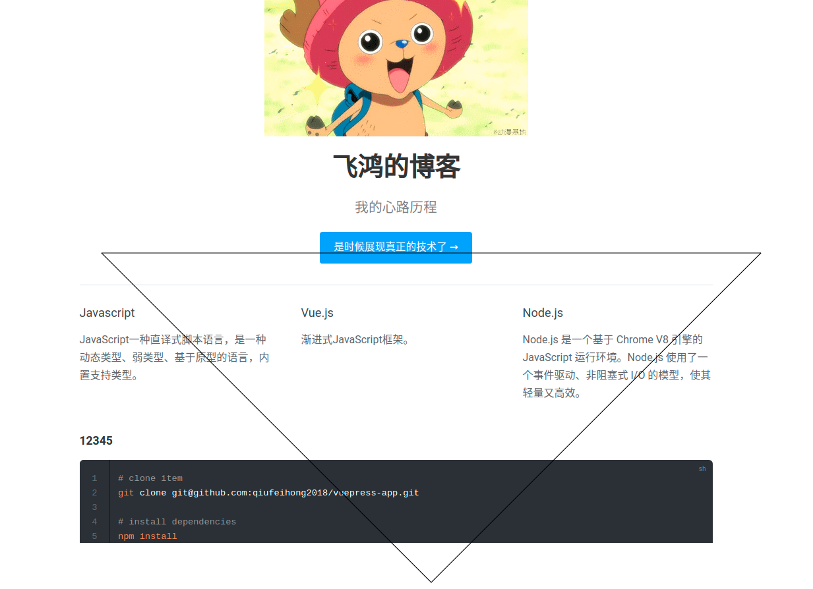

#### 缩放(Scaling)
```js
drawImage(image, x, y, width, height)
```
这个方法多了 `2` 个参数：`width` 和 `height` ，这两个参数用来控制 当向 `canvas` 画入时应该缩放的大小。

下图是缩放图片并平铺：
```html
  function draw() {
    var canvas = document.getElementById("canvas");
    var ctx = canvas.getContext("2d");
    var img = new Image()
    img.onload = function () {
      for (let i = 0; i < 4; i++) {
        for (let j = 0; j < 4; j++) {
          ctx.drawImage(img, i * 250, j * 350, 250, 350)
        }
      }
    }
    img.src = "https://images.qiufeihong.top/vuepress2.png"
  }
  draw()
```

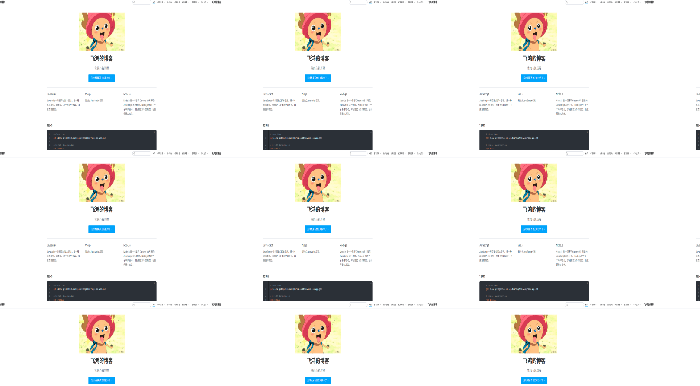

>注意：图像可能会因为大幅度的缩放而变得起杂点或者模糊。如果您的图像里面有文字，那么最好还是不要进行缩放，因为那样处理之后很可能图像里的文字就会变得无法辨认了。
#### 切片(Slicing)
`drawImage` 方法的第三个也是最后一个变种有 `8` 个新参数，用于控制做切片显示的。
```js
drawImage(image, sx, sy, sWidth, sHeight, dx, dy, dWidth, dHeight)
```
第一个参数和其它的是相同的，都是一个图像或者另一个 `canvas` 的引用。其它 `8` 个参数最好是参照右边的图解，前 `4` 个是定义图像源的切片位置和大小，后 `4` 个则是定义切片的目标显示位置和大小。
#### 控制图像的缩放行为 Controlling image scaling behavior
`Gecko 1.9.2` 引入了 `mozImageSmoothingEnabled` 属性，值为 `false` 时，图像不会平滑地缩放。默认是 `true` 。
### 使用变形
目前，我们只是根据我们的需要使用默认的网格，改变整个画布的大小。变形是一种更强大的方法，可以将原点移动到另一点、对网格进行旋转和缩放。

#### 状态的保存和恢复 Saving and restoring state
- save()
保存画布的所有状态

- restore()
恢复画布转态

 `canvas` 状态存储在栈中，每当调用 `save()` ，当前状态就被推送到栈中保存。

保存当前应用的变形、以及 `canvas` 的属性和当前的裁切路径。

##### 应用save和restore的多层矩形
```js
 function draw() {
    var ctx = document.getElementById('canvas').getContext('2d')
    ctx.fillRect(0, 0, 150, 150)
    ctx.save()

    ctx.fillStyle = "#ff0000"
    ctx.fillRect(15, 15, 120, 120)

    ctx.save()
    ctx.fillStyle = "#ffff00"
    ctx.globalAlpha = 0.8
    ctx.fillRect(30, 30, 90, 90)
    ctx.save()

    ctx.restore()
    ctx.globalAlpha = 0.5
    ctx.fillRect(45, 45, 60, 60)

    ctx.restore()
    ctx.fillRect(60, 60, 20, 20)

    ctx.restore()
    ctx.fillRect(80, 80, 10, 10)
  }
  draw()
```

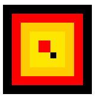

##### 应用translate的加载矩形
`translate` 移动 `canvas` 和它的原点到一个不同的位置。

> 在做变形之前先保存状态是一个良好的习惯。大多数情况下，调用 restore 方法比手动恢复原先的状态要简单得多。又，如果你是在一个循环中做位移但没有保存和恢复 canvas 的状态，很可能到最后会发现怎么有些东西不见了，那是因为它很可能已经超出 canvas 范围以外了。

下图就是多维矩形（很多人应该在加载样式中应用过）：
```js
  function draw() {
    var ctx = document.getElementById('canvas').getContext('2d')
    for (var i = 0; i < 4; i++) {
      for (var j = 0; j < 4; j++) {
        ctx.save()
        ctx.fillStyle = 'rgb(255,' + (60 * i) + ', ' + (255 - 60 * i) + ')'
        ctx.translate(10 + j * 20, 10 + i * 20)
        ctx.fillRect(0, 0, 10, 10)
        ctx.restore()
      }
    }
  }
  draw()
```

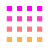

##### 应用rotate的多层圆形
`rotate` 以某个坐标为中心旋转。
```js
  function draw() {
    var ctx = document.getElementById('canvas').getContext('2d')
    ctx.translate(250, 250)
    // 画20圈
    for (var i = 1; i < 20; i++) {
      ctx.save()
      // 颜色渐变
      ctx.fillStyle = 'rgb(' + (3 * i) + ',' + (30 * i) + ', ' + (255 - 30 * i) + ')'
      // 画完整一个圆
      for (var j = 0; j < i * 6; j++) {
        ctx.rotate(Math.PI * 2 / (i * 2))
        ctx.beginPath()
        ctx.arc(0, i * 12.5, 5, 100, Math.PI * 2, true)
        ctx.fill()
      }
      ctx.restore()
    }
  }
  draw()
```

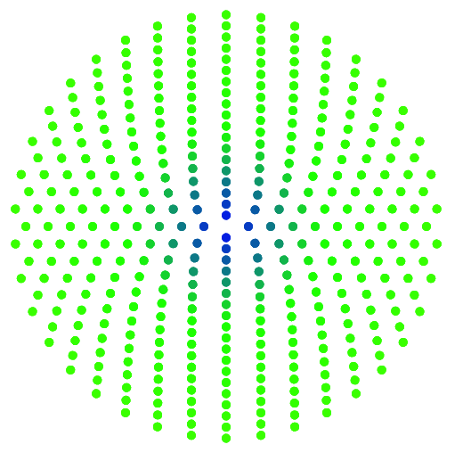

##### 应用scale的字体和矩形
`scale` 对形状，位图进行缩小或者放大。

关键词-镜像反转。

```js
  function draw() {
    var ctx = document.getElementById('canvas').getContext('2d')
    ctx.save();
    ctx.scale(10, 30);
    ctx.fillRect(10, 10, 10, 10);
    ctx.restore();

    // mirror horizontally
    ctx.scale(2, -1);
    ctx.font = '60px serif';
    ctx.fillText('qfh', 135, -120);
  }
  draw()
```

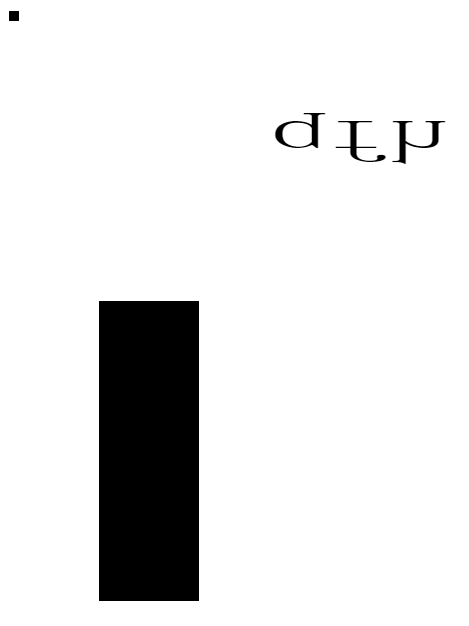

##### 应用transforms的矩形
对变形矩阵直接修改。
- transform(a, b, c, d, e, f)
- setTransform(a, b, c, d, e, f)
- resetTransform()

```js
  function draw() {
    var ctx = document.getElementById('canvas').getContext('2d');

    var sin = Math.sin(Math.PI / 6);
    var cos = Math.cos(Math.PI / 6);
    ctx.translate(100, 100);
    var c = 0;
    for (var i = 0; i <= 12; i++) {
      c = Math.floor(255 / 12 * i);
      ctx.fillStyle = "rgb(" + -c + "," + c + "," + c + ")";
      ctx.fillRect(0, 0, 100, 10);
      ctx.transform(cos, sin, -sin, cos, 0, 0);
    }

    ctx.setTransform(-1, 0, 0, 1, 100, 100);
    ctx.fillStyle = "#00ffff20";
    ctx.fillRect(0, 0, 100, 100);
  }
  draw()
```

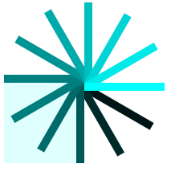

### 合成和剪裁
#### globalCompositeOperation

不仅可以在已有图形后面再画新图形，还可以用来遮盖指定区域，清除画布中的某些部分（清除区域不仅限于矩形，像 `clearRect()` 方法做的那样）以及更多其他操作。

#### 应用clip()用一个圆形的裁切路径来限制随机星星的绘制区域
裁切路径和普通的 `canvas` 图形差不多，不同的是它的作用是遮罩，用来隐藏不需要的部分。

用一个圆形的裁切路径来限制随机星星的绘制区域（星星每隔一秒增加）
```js
  function draw() {
    var ctx = document.getElementById('canvas').getContext('2d');
    ctx.fillRect(0, 0, 500, 500);
    ctx.translate(250, 250);

    // Create a circular clipping path
    ctx.beginPath();
    ctx.arc(0, 0, 60, 0, Math.PI * 2, true);
    ctx.clip();

    // draw background
    var lingrad = ctx.createLinearGradient(0, -75, 0, 75);
    lingrad.addColorStop(0, '#ff0000');
    lingrad.addColorStop(1, '#143798');

    ctx.fillStyle = lingrad;
    ctx.fillRect(-75, -75, 150, 150);

    setInterval(() => {
      // draw stars
      for (var j = 1; j < 500; j++) {
        ctx.save();
        ctx.fillStyle = '#fff';
        ctx.translate(75 - Math.floor(Math.random() * 500),
          75 - Math.floor(Math.random() * 500));

        drawStar(ctx, Math.floor(Math.random() * 4) + 2);
        ctx.restore();
      }
    }, 1000)
  }

  function drawStar(ctx, r) {
    ctx.save();
    ctx.beginPath()
    ctx.moveTo(r, 0);
    for (var i = 0; i < 9; i++) {
      ctx.rotate(Math.PI / 5);
      if (i % 2 == 0) {
        ctx.lineTo((r / 0.525731) * 0.200811, 0);
      } else {
        ctx.lineTo(r, 0);
      }
    }
    ctx.closePath();
    ctx.fill();
    ctx.restore();
  }
  draw()
```

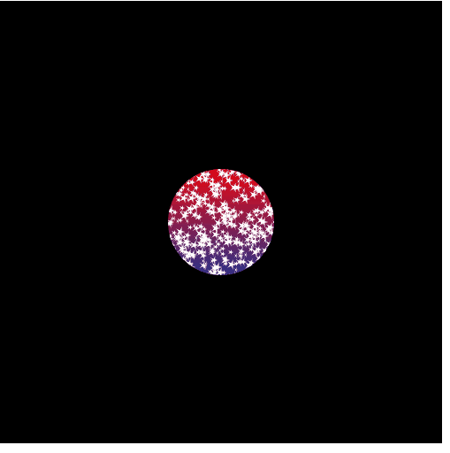

### 动画使用
#### 基本步骤
1. 清空canvas
调用 `clearRect` 方法
2. 保存canvas状态
要改变一些会改变 `canvas` 状态的设置（样式，变形之类的），又要在每画一帧之时都是原始状态的话，你需要先保存一下。
3. 绘制动画
4. 恢复canvas状态

#### canvas版的太阳系动画
```js
 var sun = new Image();
  var moon = new Image();
  var earth = new Image();

  function init() {
    sun.src = './sun.png';
    moon.src = './moon.png';
    earth.src = './earth.png';
    window.requestAnimationFrame(draw);
  }

  function draw() {
    var ctx = document.getElementById('canvas').getContext('2d');
    // 在源图像上方显示目标图像
    ctx.globalCompositeOperation = 'destination-over';
    ctx.clearRect(0, 0, 500, 500);

    ctx.fillStyle = 'rgba(0,0,0,0.4)';
    ctx.strokeStyle = 'rgba(0,153,255,0.4)';
    ctx.save();
    ctx.translate(150, 150);

    // 地球
    var time = new Date();
    ctx.rotate(((2 * Math.PI) / 60) * time.getSeconds() + ((2 * Math.PI) / 60000) * time.getMilliseconds());
    ctx.translate(115, -10);
    ctx.fillRect(0, -12, 40, 24); // Shadow
    ctx.drawImage(earth, -12, -24, 40, 40);

    // 月球
    ctx.save();
    ctx.rotate(((2 * Math.PI) / 6) * time.getSeconds() + ((2 * Math.PI) / 6000) * time.getMilliseconds());
    ctx.translate(0, 28.5);
    ctx.drawImage(moon, -3.5, -3.5, 10, 10);
    ctx.restore();

    ctx.restore();

    ctx.beginPath();
    // 地球轨道(并不是正圆的)
    // ctx.arc(150,150,105,0,Math.PI*2,false);
    ctx.ellipse(150, 150, 130, 105, 0, 0, Math.PI * 2, false)
    ctx.stroke();

    ctx.drawImage(sun, 0, 0, 300, 300);

    window.requestAnimationFrame(draw);
  }

  init();
```

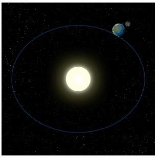

#### canvas版的时钟动画
```js
 function clock() {
    var now = new Date();
    var ctx = document.getElementById('canvas').getContext('2d');
    ctx.save();
    ctx.clearRect(0, 0, 150, 150);
    ctx.translate(75, 75);
    ctx.scale(0.4, 0.4);
    ctx.rotate(-Math.PI / 2);
    ctx.strokeStyle = "#c8bdbd";
    ctx.fillStyle = "#fff";
    ctx.lineWidth = 4;
    ctx.lineCap = "round";

    // 小时的刻度
    ctx.save();
    for (var i = 0; i < 12; i++) {
      ctx.beginPath();
      ctx.rotate(Math.PI / 6);
      ctx.moveTo(100, 0);
      ctx.lineTo(120, 0);
      ctx.stroke();
    }
    ctx.restore();

    // 分钟的刻度
    ctx.save();
    ctx.lineWidth = 5;
    for (i = 0; i < 60; i++) {
      if (i % 5 != 0) {
        ctx.beginPath();
        ctx.moveTo(117, 0);
        ctx.lineTo(120, 0);
        ctx.stroke();
      }
      ctx.rotate(Math.PI / 30);
    }
    ctx.restore();

    var sec = now.getSeconds();
    var min = now.getMinutes();
    var hr = now.getHours();
    hr = hr >= 12 ? hr - 12 : hr;

    ctx.fillStyle = "black";

    // 画出小时
    ctx.save();
    ctx.rotate(hr * (Math.PI / 6) + (Math.PI / 360) * min + (Math.PI / 21600) * sec)
    ctx.lineWidth = 14;
    ctx.beginPath();
    ctx.moveTo(-20, 0);
    ctx.lineTo(80, 0);
    ctx.stroke();
    ctx.restore();

    // 画出分钟
    ctx.save();
    ctx.rotate((Math.PI / 30) * min + (Math.PI / 1800) * sec)
    ctx.lineWidth = 10;
    ctx.beginPath();
    ctx.moveTo(-28, 0);
    ctx.lineTo(112, 0);
    ctx.stroke();
    ctx.restore();

    // 画出秒钟
    ctx.save();
    ctx.rotate(sec * Math.PI / 30);
    ctx.strokeStyle = "#ed7270";
    ctx.fillStyle = "#ff0000";
    ctx.lineWidth = 6;
    ctx.beginPath();
    ctx.moveTo(-30, 0);
    ctx.lineTo(83, 0);
    ctx.stroke();
    ctx.beginPath();
    ctx.arc(0, 0, 10, 0, Math.PI * 2, true);
    ctx.fill();
    ctx.beginPath();
    ctx.arc(95, 0, 10, 0, Math.PI * 2, true);
    ctx.stroke();
    ctx.fillStyle = "rgba(0,0,0,0)";
    ctx.arc(0, 0, 3, 0, Math.PI * 2, true);
    ctx.fill();
    ctx.restore();

    // 画出大圆
    ctx.beginPath();
    ctx.lineWidth = 14;
    ctx.strokeStyle = '#4b4242';
    ctx.arc(0, 0, 142, 0, Math.PI * 2, true);
    ctx.stroke();

    ctx.restore();

    window.requestAnimationFrame(clock);
  }

  window.requestAnimationFrame(clock);
```

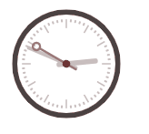

#### canvas版的全景动画
```js
 <!DOCTYPE html>
<html lang="en">

<head>
  <meta charset="UTF-8">
  <meta name="viewport" content="width=\, initial-scale=1.0">
  <title>Canvas</title>
</head>

<body>
  <canvas id="canvas" width="800" height="400"></canvas>
</body>
<script>
  var img = new Image()
  img.src = './canvas26.png';
  var canvasWidth = 800;
  var canvasHeight = 400;
  // 数字越小越快，依赖的是setInterval方法，是其第二个参数
  var speed = 3;
  var scale = 1.05;

  // 需要绘制到目标上下文中的，image的矩形（裁剪）选择框的左上角 Y 轴坐标
  var y = -4.5; // vertical offset

  var dx = 0.75;
  var imgW;
  var imgH;

  // 需要绘制到目标上下文中的，image的矩形（裁剪）选择框的左上角 X 轴坐标
  var x = 0;
  var clearX;
  var clearY;
  var ctx;

  img.onload = function () {
    imgW = img.width * scale;
    imgH = img.height * scale;

    if (imgW > canvasWidth) {
      // 图片太宽
      x = canvasWidth - imgW;
    }
    if (imgW > canvasWidth) {
      // 图片太宽
      clearX = imgW;
    } else {
      clearX = canvasWidth;
    }
    if (imgH > canvasHeight) {
      // 图片太高
      clearY = imgH;
    } else {
      clearY = canvasHeight;
    }

    ctx = document.getElementById('canvas').getContext('2d');

    // 定时重绘
    return setInterval(draw, speed);
  }

  function draw() {
    // 先清空
    ctx.clearRect(0, 0, clearX, clearY);

    // 图片宽度窄
    if (imgW <= canvasWidth) {
      // 重置，从头开始
      if (x > canvasWidth) {
        x = -imgW + x;
      }
      // 画额外image1
      if (x > 0) {
        ctx.drawImage(img, -imgW + x, y, imgW, imgH);
      }
      //画额外image2
      if (x - imgW > 0) {
        ctx.drawImage(img, -imgW * 2 + x, y, imgW, imgH);
      }
    } else {
      // 重置，从头开始
      if (x > (canvasWidth)) {
        x = canvasWidth - imgW;
      }
      // 画额外image
      if (x > (canvasWidth - imgW)) {
        ctx.drawImage(img, x - imgW + 1, y, imgW, imgH);
      }
    }

    ctx.drawImage(img, x, y, imgW, imgH);
    // 移动量
    x += dx;
  }
</script>

</html>
```


#### canvas版的鼠标追踪器
```html
        <script>
            var cn;
            var c;
            var u = 10;
            // 鼠标追踪器初始位置（水平垂直居中）
            const m = {
                x: innerWidth / 2,
                y: innerHeight / 2
            };
            // 鼠标移动，获取鼠标当前位置
            window.onmousemove = function(e) {
                m.x = e.clientX;
                m.y = e.clientY;

            }
            // 追踪器颜色
            function gc() {
                var s = "0123456789ABCDEF";
                var c = "#";
                // 16进制的颜色目前6位数字（随机选择）
                for (var i = 0; i < 6; i++) {
                    c += s[Math.ceil(Math.random() * 15)]
                }
                return c
            }
            var a = [];
            window.onload = function myfunction() {
                cn = document.getElementById('cw');
                c = cn.getContext('2d');
                // 追踪器的圈数
                for (var i = 0; i < 10; i++) {
                    var r = 30;
                    var x = Math.random() * (innerWidth - 2 * r) + r;
                    var y = Math.random() * (innerHeight - 2 * r) + r;
                    var t = new ob(innerWidth / 2,innerHeight / 2,5,"red",Math.random() * 200 + 20,2);
                    a.push(t);
                }
                // 渐变
                cn.style.backgroundColor = "#700bc8";

                c.lineWidth = "2";
                c.globalAlpha = 0.5;
                resize();
                anim()
            }
            window.onresize = function() {

                resize();

            }
            function resize() {
                cn.height = innerHeight;
                cn.width = innerWidth;
                // 追踪器的密度
                for (var i = 0; i < 101; i++) {
                    var r = 30;
                    var x = Math.random() * (innerWidth - 2 * r) + r;
                    var y = Math.random() * (innerHeight - 2 * r) + r;
                    a[i] = new ob(innerWidth / 2,innerHeight / 2,4,gc(),Math.random() * 200 + 20,0.02);

                }
                // 红条旋转
                 a[0] = new ob(innerWidth / 2, innerHeight / 2, 40, "red", 0.05, 0.05);
                a[0].dr();
            }
            function ob(x, y, r, cc, o, s) {
                this.x = x;
                this.y = y;
                this.r = r;
                this.cc = cc;
                this.theta = Math.random() * Math.PI * 2;
                this.s = s;
                this.o = o;
                this.t = Math.random() * 150;

                this.o = o;
                this.dr = function() {
                    const ls = {
                        x: this.x,
                        y: this.y
                    };
                    this.theta += this.s;
                    this.x = m.x + Math.cos(this.theta) * this.t;
                    this.y = m.y + Math.sin(this.theta) * this.t;
                    c.beginPath();
                    c.lineWidth = this.r;
                    c.strokeStyle = this.cc;
                    c.moveTo(ls.x, ls.y);
                    c.lineTo(this.x, this.y);
                    c.stroke();
                    c.closePath();

                }
            }
            function anim() {
                requestAnimationFrame(anim);
                c.fillStyle = "rgba(0,0,0,0.05)";
                c.fillRect(0, 0, cn.width, cn.height);
                a.forEach(function(e, i) {
                    e.dr();
                });

            }
        </script>
        <style>
            #cw {
                position: fixed;
                z-index: -1;
            }

            body {
                margin: 0;
                padding: 0;
                background-color: rgba(0,0,0,0.05);
            }
        </style>
    </head>
    <body>
        <canvas id="cw"></canvas>
    </body>
```


#### canvas版的贪吃蛇游戏
```html
<!DOCTYPE html>
<html lang="en">

<head>
  <meta charset="UTF-8">
  <meta name="viewport" content="width=device-width,initial-scale=1">
  <meta http-equiv="X-UA-Compatible" content="ie=edge">
  <title>Nokia 1100:snake..Member berries</title>
</head>

<body>
  <div class="keypress hide">
    <div class="up" onclick="emit(38)">&#8593;</div>
    <div class="right" onclick="emit(39)">&#8594;</div>
    <div class="left" onclick="emit(37)">&#8592;</div>
    <div class="down" onclick="emit(40)">&#8595;</div>
  </div>
  <div class="banner" id="selector">
    <div>
      Time :<span id="time">0</span>
    </div>
    <div>LousyGames ©</div>
    <div>
      Score :<span id="score">0</span>
    </div>
    <div class="touch off" onclick="touch(this)">touch</div>
  </div>
  <canvas id="main"></canvas>
</body>
<style>
  body {
    margin: 0;
    overflow: hidden;
    background: #000
  }

  .banner {
    text-align: center;
    color: #fff;
    background: #3f51b5;
    line-height: 29px;
    position: fixed;
    left: 0;
    top: 0;
    right: 0;
    font-family: monospace;
    height: 30px;
    opacity: .4;
    display: flex;
    transition: .5s
  }

  .banner:hover {
    opacity: 1
  }

  div#selector>div {
    flex-basis: 30%
  }

  @keyframes diss {
    from {
      opacity: 1
    }

    to {
      opacity: 0
    }
  }

  .keypress>div {
    border: dashed 3px #fff;
    height: 48%;
    width: 48%;
    display: flex;
    align-content: center;
    justify-content: center;
    align-self: center;
    align-items: center;
    font-size: -webkit-xxx-large;
    font-weight: 900;
    color: #fff;
    transition: .5s;
    opacity: .1;
    border-radius: 7px
  }

  .keypress {
    position: fixed;
    width: 100vw;
    height: 100vh;
    top: 0;
    left: 0;
    display: flex;
    flex-wrap: wrap;
    justify-content: space-around;
    opacity: 1;
    user-select: none
  }

  .keypress>div:hover {
    opacity: 1
  }

  .touch {
    background: #8bc34a
  }

  .off {
    background: #f44336
  }

  .hide {
    opacity: 0
  }
</style>
<script>
  function tmz() {
    var e = new Date(t),
      i = new Date,
      n = Math.abs(i.getMinutes() - e.getMinutes()),
      o = Math.abs(i.getSeconds() - e.getSeconds());
    return n + " : " + o
  }

  function coll(t, e) {
    return t.x < e.x + e.w && t.x + t.w > e.x && t.y < e.y + e.h && t.h + t.y > e.y
  }

  function snake() {
    this.w = 15, this.h = 15, this.dx = 1, this.dy = 1, this.xf = 1, this.yf = 1, this.sn = [];
    for (var t = {
        x: w / 2,
        y: h / 2
      }, e = 0; e < 5; e++) this.sn.push(Object.assign({}, t)), t.x += this.w;
    this.draw = function () {
      var t = d && d.search("Arrow") > -1,
        e = -1;
      if (t) {
        var i = {
          ...this.sn[0]
        };
        if ("ArrowUp" == d && (i.y -= this.h), "ArrowDown" == d && (i.y += this.h), "ArrowLeft" == d && (i.x -= this
            .w), "ArrowRight" == d && (i.x += this.w), i.x >= w ? i.x = 0 : i.x < 0 && (i.x = w - this.w), i.y > h ? i
          .y = 0 : i.y < 0 && (i.y = h), e = fa.findIndex(t => coll({
            ...this.sn[0],
            h: this.h,
            w: this.w
          }, t)), this.sn.unshift(i), -1 != e) return console.log(e), fa[e].renew(), void(document.getElementById(
          "score").innerText = Number(document.getElementById("score").innerText) + 1);
        this.sn.pop(), console.log(6)
      }
      this.sn.forEach((t, e, i) => {
        if (0 == e || i.length - 1 == e) {
          var n = c.createLinearGradient(t.x, t.y, t.x + this.w, t.y + this.h);
          i.length - 1 == e ? (n.addColorStop(0, "black"), n.addColorStop(1, "#8BC34A")) : (n.addColorStop(0,
            "#8BC34A"), n.addColorStop(1, "white")), c.fillStyle = n
        } else c.fillStyle = "#8BC34A";
        c.fillRect(t.x, t.y, this.w, this.h), c.strokeStyle = "#E91E63", c.font = "30px serif", c.strokeStyle =
          "#9E9E9E", i.length - 1 != e && 0 != e && c.strokeRect(t.x, t.y, this.w, this.h), 0 == e && (c
            .beginPath(), c.fillStyle = "#F44336", c.arc(t.x + 10, t.y + 2, 5, 360, 0), c.fill()), c.arc(t.x + 10,
            t.y + 2, 5, 360, 0), c.fill(), c.beginPath()
      })
    }
  }

  function gc() {
    for (var t = "0123456789ABCDEF", e = "#", i = 0; i < 6; i++) e += t[Math.ceil(15 * Math.random())];
    return e
  }

  function food() {
    this.x = 0, this.y = 0, this.b = 10, this.w = this.b, this.h = this.b, this.color = gc(), this.renew = function () {
      this.x = Math.floor(Math.random() * (w - 200) + 10), this.y = Math.floor(Math.random() * (h - 200) + 30), this
        .color = gc()
    }, this.renew(), this.put = (() => {
      c.fillStyle = this.color, c.arc(this.x, this.y, this.b - 5, 0, 2 * Math.PI), c.fill(), c.beginPath(), c.arc(
          this.x, this.y, this.b - 5, 0, Math.PI), c.strokeStyle = "green", c.lineWidth = 10, c.stroke(), c
        .beginPath(), c.lineWidth = 1
    })
  }

  function init() {
    cc.height = h, cc.width = w, c.fillRect(0, 0, w, innerHeight);
    for (var t = 0; t < 10; t++) fa.push(new food);
    s = new snake(w / 2, h / 2, 400, 4, 4), anima()
  }

  function anima() {
    c.fillStyle = "rgba(0,0,0,0.11)", c.fillRect(0, 0, cc.width, cc.height), fa.forEach(t => t.put()), s.draw(),
      document.getElementById("time").innerText = tmz(), setTimeout(() => {
        requestAnimationFrame(anima)
      }, fw)
  }

  function emit(t) {
    key.keydown(t)
  }

  function touch(t) {
    t.classList.toggle("off"), document.getElementsByClassName("keypress")[0].classList.toggle("hide")
  }
  var t = new Date + "",
    d = void 0,
    cc = document.getElementsByTagName("canvas")[0],
    c = cc.getContext("2d");
  key = {}, key.keydown = function (t) {
    var e = document.createEvent("KeyboardEvent");
    Object.defineProperty(e, "keyCode", {
        get: function () {
          return this.keyCodeVal
        }
      }), Object.defineProperty(e, "key", {
        get: function () {
          return 37 == this.keyCodeVal ? "ArrowLeft" : 38 == this.keyCodeVal ? "ArrowUp" : 39 == this.keyCodeVal ?
            "ArrowRight" : "ArrowDown"
        }
      }), Object.defineProperty(e, "which", {
        get: function () {
          return this.keyCodeVal
        }
      }), e.initKeyboardEvent ? e.initKeyboardEvent("keydown", !0, !0, document.defaultView, !1, !1, !1, !1, t, t) : e
      .initKeyEvent("keydown", !0, !0, document.defaultView, !1, !1, !1, !1, t, 0), e.keyCodeVal = t, e.keyCode !==
      t && alert("keyCode mismatch " + e.keyCode + "(" + e.which + ")"), document.dispatchEvent(e)
  };
  var o, s, h = innerHeight,
    w = innerWidth,
    fw = 60,
    fa = [];
  window.onkeydown = function (t) {
    var e = t.key;
    (e.search("Arrow") > -1 || "1" == e) && (d = t.key), "i" != e && "I" != e || (console.log("inc"), fw -= 10),
      "d" != e && "D" != e || (console.log("dec"), fw += 10)
  }, init();
</script>

</html>
```

可以左右上下键控制贪吃蛇走向，跟某基亚中的贪吃蛇差不多：

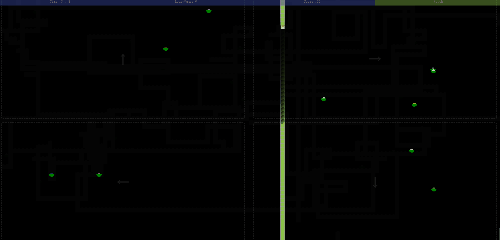

#### canvas版的反弹球
```html
   var canvas = document.getElementById('canvas');
    var ctx = canvas.getContext('2d');
    var raf;
    var running = false;

    var ball = {
      x: 100,
      y: 100,
      vx: 5,
      vy: 1,
      radius: 25,
      color: '#ff5645',
      draw: function () {
        ctx.beginPath();
        ctx.arc(this.x, this.y, this.radius, 0, Math.PI * 2, true);
        ctx.closePath();
        ctx.fillStyle = this.color;
        ctx.fill();
      }
    };

    function clear() {
      ctx.fillStyle = 'rgba(255,255,255,0.3)';
      ctx.fillRect(0, 0, canvas.width, canvas.height);
    }

    function draw() {
      clear();
      ball.draw();
      ball.x += ball.vx;
      ball.y += ball.vy;

      if (ball.y + ball.vy > canvas.height || ball.y + ball.vy < 0) {
        ball.vy = -ball.vy;
      }
      if (ball.x + ball.vx > canvas.width || ball.x + ball.vx < 0) {
        ball.vx = -ball.vx;
      }

      raf = window.requestAnimationFrame(draw);
    }

    canvas.addEventListener('mousemove', function (e) {
      if (!running) {
        clear();
        ball.x = e.offsetX;
        ball.y = e.offsetY;
        ball.draw();
      }
    });

    canvas.addEventListener('click', function (e) {
      if (!running) {
        raf = window.requestAnimationFrame(draw);
        running = true;
      }
    });

    canvas.addEventListener('mouseout', function (e) {
      window.cancelAnimationFrame(raf);
      running = false;
    });

    ball.draw();
```

碰到边界反弹，鼠标移出边界后，小球也就不动了：

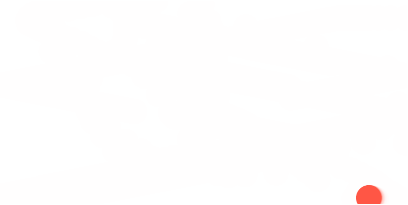

### 使用像素
这就不得不提到 `imageData` 对象，存储着 `canvas` 对象真实的像素数据。

这个方法会返回一个 `ImageData` 对象，它代表了画布区域的对象数据，此画布的四个角落分别表示为( `left` ,  `top` ), ( `left` + `width` , `top` ), ( `left` , `top` + `height` ), 以及( `left` + `width` , `top` + `height`) 四个点。这些坐标点被设定为画布坐标空间元素。

```js
 var img = new Image();
    img.src = 'file:///D:/githubMe/vuepress-blog/docs/technical-summary/public/aliyun1.png';
    var canvas = document.getElementById('canvas');
    var ctx = canvas.getContext('2d');
    var color = document.getElementById('color');
    img.onload = function () {
      ctx.drawImage(img, 0, 0);
      img.style.display = 'none';
    };

    function pick(event) {
      debugger
      var x = event.layerX;
      var y = event.layerY;
      var pixel = ctx.getImageData(x, y, 1, 1);
      var data = pixel.data;
      var rgba = 'rgba(' + data[0] + ',' + data[1] +
        ',' + data[2] + ',' + (data[3] / 255) + ')';
      color.style.background = rgba;
      color.textContent = rgba;
    }
    canvas.addEventListener('mousemove', pick);
```

遇到跨域获取的图片会出现的问题：
```
canvas.html:29 Uncaught DOMException: Failed to execute 'getImageData' on 'CanvasRenderingContext2D': The canvas has been tainted by cross-origin data.
```
原因是为了阻止欺骗，浏览器会追踪 `image data` 。当你把一个“跟 `canvas` 的域不同的”图片放到 `canvas` 上，这个 `canvas` 就成为 “`tainted`”(被污染的，脏的)，浏览器就不让你操作该 `canvas` 的任何像素。这对于阻止多种类型的 `XSS/CSRF` 攻击（两种典型的跨站攻击）是非常有用的。

### canvas
`CanvasRenderingContext2D.canvas `属性是 `Canvas API` 的一部分，是对与给定上下文关联的`HTMLCanvasElement`对象的只读引用。如果没有 `<canvas>` 元素与之对应，对象值为`null` 
### translate()
该方法重新映射画布上某位置的图形。

有两个参数，分别是 `x`	添加到水平坐标（`x`）上的值。
`y`	添加到垂直坐标（`y`）上的值。

在 `translate()` 之后调用诸如 `fillRect()` 之类的方法时，值会添加到 `x` 和 `y` 坐标值上。

## 在vue项目的图片上定制图形
我想可能会有人有一样的需求：绘制车牌框。

详细分析一下这个需求：
1. 页面初始化根据给定的坐标和宽高默认绘制车牌矩形框；
2. 点击绘制，手动在图片上绘制矩形；
3. 调整输入框中的x、y、宽度和高度的值，自动绘制矩形。
```vue
<template>
  <div class="main-img-canvas">
    <el-row :gutter="10">
      <el-col :span="18">
        <!-- 图片和画布 -->
        <div class="top-img-canvas">
          <div @mousedown="mousedown" @mousemove="mousemove" @mouseup="mouseup" @mouseleave="mouseleave"
            :style="imgStyle">
            
            <canvas ref="rectCanvas" :width="canvasWidth" :height="canvasHeight" :style="canvasStyle"></canvas>
          </div>
        </div>
      </el-col>
      <el-col :span="6">
        <!-- 数据显示层 -->
        <el-form ref="form" :model="customMark" label-width="80px">
          <el-form-item label="X:">
            <el-input-number v-model="customMark.x" controls-position="right"></el-input-number>
          </el-form-item>
          <el-form-item label="Y:">
            <el-input-number v-model="customMark.y" controls-position="right"></el-input-number>
          </el-form-item>
          <el-form-item label="Width:">
            <el-input-number v-model="customMark.width" controls-position="right"></el-input-number>
          </el-form-item>
          <el-form-item label="Height:">
            <el-input-number v-model="customMark.height" controls-position="right"></el-input-number>
          </el-form-item>
          <el-form-item>
            <el-button type="primary" @click="startMark">{{btnStartMark}}</el-button>
            <el-button @click="onClose">取 消</el-button>
          </el-form-item>
        </el-form>
      </el-col>
    </el-row>
  </div>

</template>
<script>
  export default {
    name: 'canvasDraw',
    data() {
      return {
        // 开始的X坐标
        startX: 10,
        // 开始的Y坐标
        startY: 10,
        //结束的X坐标
        endX: 300,
        //结束的Y坐标
        endY: 500,
        // 是否开始绘制
        isStartMark: false,
        // 画布
        customcxt: '',
        //原图与展示图片的宽度比
        customRwidth: '',
        //原图与展示图片的高度比
        customRheight: '',
        //根据图片大小自适应样式
        imgStyle: '',
        //根据图片大小canvas自适应样式 居中显示
        canvasStyle: '',
        //根据图片大小自适应canvas宽
        canvasWidth: '',
        //根据图片大小自适应canvas高
        canvasHeight: '',
        //最大宽度
        divWidth: 1369,
        //最大高度
        divHeight: 740,
        // 图片地址
        imgSrc: 'http://10.66.194.27:8083/13,034662641b59a8',
        // 自定义截取结果
        customMark: {},
        isMousedown: false,
        btnStartMark: '绘 制'
      };
    },
    watch: {
      imgSrc() {
        this.drawRect();
      },
      // 监听自定义标记数据重绘矩形
      customMark: {
        handler(n, o) {
          if (!(JSON.stringify(n) === '{}')) {
            this.startX = n.x
            this.startY = n.y
            this.endX = this.startX + n.width
            this.endY = this.startY + n.height
            this.drawRect();
          }
        },
        deep: true,
      }
    },
    // 初始化绘制矩形
    mounted() {
      this.customMark['x'] = this.startX
      this.customMark['y'] = this.startY
      this.customMark['width'] = this.endX - this.startX
      this.customMark['height'] = this.endY - this.startY
      this.drawRect();
    },

    methods: {
      // 开始绘制
      startMark() {
        this.$message.info('您可以在画布上开始绘制矩形')
        this.isStartMark = true
        this.btnStartMark = "绘制中"
      },
      //取消时返回组件调用处所需的数据
      onClose() {
        this.customcxt.clearRect(0, 0, this.divWidth, this.divHeight);
        this.isStartMark = false
        this.customMark = {}
      },
      //确定时返回组件调用处所需的数据
      onMark() {
        this.isStartMark = false
        //获取矩形框Left，Width
        let cLeft = 0;
        let cWidth = 0;
        if (this.startX > this.endX) {
          cLeft = this.endX;
          cWidth = this.startX - this.endX;
        } else {
          cLeft = this.startX;
          cWidth = this.endX - this.startX;
        }

        //获取矩形框Top，Height
        let cTop = 0;
        let cHeight = 0;
        if (this.startY > this.endY) {
          cTop = this.endY;
          cHeight = this.startY - this.endY;
        } else {
          cTop = this.startY;
          cHeight = this.endY - this.startY;
        }

        this.customMark['x'] = parseInt(cLeft / this.customRwidth);
        this.customMark['y'] = parseInt(cTop / this.customRheight);
        this.customMark['width'] = parseInt(cWidth / this.customRwidth);
        this.customMark['height'] = parseInt(cHeight / this.customRheight);
        this.$forceUpdate()
      },

      // 计算img与canvas标签自适应图片的大小
      drawRect() {
        // 画布绑定的属性
        let customCanvas = this.$refs.rectCanvas;
        // 画布
        this.customcxt = customCanvas.getContext("2d");
        // 绑定图片路径
        let img = new Image();
        img.src = this.imgSrc;
        let _this = this;
        // 图片加载完毕开始绘制画布
        img.onload = function () {
          // 画布距离左边的距离
          let canvasleft = 0;
          // 画布距离顶部的距离
          let canvastop = 0;
          //图片宽高比
          let WrH = img.width / img.height;
          //放置图片的容器的宽高比
          let RWrH = _this.divWidth / _this.divHeight;
          // 放置图片的容器和图片的比例
          let scale = 0;
          // 根据宽高比大小判断,自适应的宽和高
          if (RWrH > WrH) {
            // 如果图片高度太大,那么宽度自适应
            scale = _this.divHeight / img.height;
            // 画布的高度是放置图片的容器的高度
            _this.canvasHeight = _this.divHeight;
            // 画布的宽度是等比缩放
            _this.canvasWidth = img.width * scale;
            // 左边距是多余容器的一半
            canvasleft = (_this.divWidth - _this.canvasWidth) / 2
          } else {
            // 如果图片宽度太大,那么高度自适应
            scale = _this.divWidth / img.width;
            _this.canvasHeight = img.height * scale;
            _this.canvasWidth = _this.divWidth;
            canvastop = (_this.divHeight - _this.canvasHeight) / 2
          }
          //图片浮动定位居中显示
          _this.imgStyle = ' position: relative;  width:' + _this.canvasWidth +
            ' px; height:' + _this.canvasHeight + 'px';
          //原图与展示图片的宽高比
          _this.customRwidth = _this.canvasWidth / img.width;
          _this.customRheight = _this.canvasHeight / img.height;
          //画布绝对定位居中显示,覆盖在图片之上
          _this.canvasStyle = 'z-index: 1000;position: absolute;left: ' + canvasleft +
            '; top: ' + canvastop + ';'
          _this.$nextTick(() => {
            let wwidth = _this.endX - _this.startX
            let wheigth = _this.endY - _this.startY
            // 清除画布上的内容
            _this.customcxt.clearRect(0, 0, _this.divWidth, _this.divHeight);
            // 画笔颜色
            _this.customcxt.strokeStyle = "#ff0000";
            // 画笔宽度
            _this.customcxt.lineWidth = "2";
            // 绘制矩形
            _this.customcxt.strokeRect(_this.startX * scale, _this.startY * scale, wwidth * scale, wheigth *
              scale);
          })
        };
      },
      //鼠标按下时执行
      mousedown(e) {
        // 鼠标按下时开始位置与结束位置相同
        // 防止鼠标在画完矩形后 点击图画形成第二个图形
        this.endX = e.offsetX;
        this.endY = e.offsetY;
        this.startX = e.offsetX;
        this.startY = e.offsetY;
        this.isMousedown = true
        this.mousemove(e)
      },
      //鼠标移动时执行
      mousemove(e) {
        // 点击开始绘制清空画布
        if (this.isStartMark) {
          // 清除画布上的内容
          this.customcxt.clearRect(0, 0, this.divWidth, this.divHeight);
        }
        // 点击开始绘制并且鼠标按下
        if (this.isStartMark && this.isMousedown) {
          this.endX = e.offsetX;
          this.endY = e.offsetY;
          let wwidth = this.endX - this.startX;
          let wheigth = this.endY - this.startY;

          // 画笔颜色
          this.customcxt.strokeStyle = "#ff0000";
          // 画笔宽度
          this.customcxt.lineWidth = "2";
          // 绘制矩形
          this.customcxt.strokeRect(this.startX, this.startY, wwidth, wheigth);
        }
      },
      //鼠标松开时执行
      mouseup(e) {
        if (this.isStartMark) {
          this.onMark()
        }
        this.btnStartMark = "绘制"
        this.isMousedown = false
        this.isStartMark = false;
      },
      // 鼠标离开时执行
      mouseleave(e) {
        this.btnStartMark = "绘制"
        this.isMousedown = false
        this.isStartMark = false
      }
    }
  }
</script>
<style lang="less" scoped>
  .main-img-canvas {
    .top-img-canvas {
      width: 1369px;
      height: 740px;
      background-color: #f5f5f575;
      margin: 0 auto;
      display: -webkit-box;
      -webkit-box-align: center;
      -webkit-box-pack: center;
    }
  }
</style>
```
分析：

指点设备（通常是鼠标）的指针移出某个元素时，会触发mouseleave事件。

`mouseleave`  和 `mouseout` 是相似的，但是两者的不同在于 `mouseleave` 不会冒泡而 `mouseout` 会冒泡。
这意味着当指针离开元素及其所有后代时，会触发 `mouseleave` ，而当指针离开元素或离开元素的后代（即使指针仍在元素内）时，会触发 `mouseout`。

`mouseleave`  和 `mouseout` 的区别简单总结如下：

1. 如果在 `A` 元素注册 `mouseleave` 事件，那么必须鼠标指针完全移出 `A` 元素事件才会触发。
2. 如果在 `A` 元素注册 `mouseout` 事件，不但鼠标指针完全移出 `A` 元素会触发事件，鼠标指针从 `A` 元素移入它的子元素和鼠标指针从子元素移入A元素也会触发事件。

## canvas的神仙库
下面是本小编精心挑选的有助于 `canvas` 画图的工具库，为了方便大家和我查看源码，源码我全部放在本博客 `canvas` 目录下了。
### [canvas2image](https://github.com/hongru/canvas2image)
一个将`canvas`转化为图片格式的工具库（应用场景很多）。

[demo](http://hongru.github.io/proj/canvas2image/index.html)

他的仓库里就三个文件，分别是： `index.html` 、`canvas2image.js` 和 `README.md`

核心就是 `canvas2image.js` 。

先来看 `demo` ，就是 `index.html` 文件，是一个比较简单的实例，其中一个有矩形的 `canvas` 、几个按钮、几个选择器和一个 `img` ，通过保存或转换按钮，将 `canvas` 图形保存成指定格式的图片：

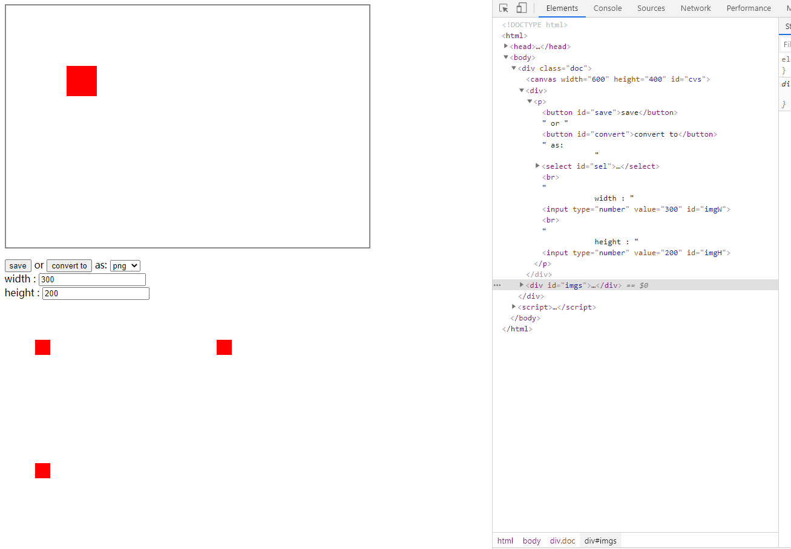

其中的 `html` 标签就不做解释了，脚本中有三个方法，分别是： `init()` 、 `bind()` 和 `draw()` 。文档 `onload` 刚加载完后执行 `init()` 方法,在 `init()` 方法中将标签中的所有属性获取并且赋值，然后执行 `bind()` 方法和 `draw()` 方法。

`draw()` 方法画一个红色矩形。

`bind()` 中 `save` 按钮点击方法中，先获取用户选择的格式、宽度和高度，然后执行 `saveAsImage()` 方法保存图片，这个方法后面在解释。

`convert to` 这个按钮其实主要实现一个预览功能，将用户自定义的 `canvas` 执行`convertToImage()` 方法转化成 `img` 标签呈现在下面。

`bind()` 方法中的 `canvas` 也没闲着，用户在画布上可以自定义作画， `onmousemove()` 方法获取鼠标坐标绘制路径， `onmousedown()` 获取开始坐标，并开始作画， `onmouseup()` 方法停止作画， `bMouseIsDown` 变量控制是否开始作画。

最后再来看看 `canvas2image.js` 文件做了什么？

文件里就一个立即执行方法： `Canvas2Image()` 。

先看 `return` 里的方法，看看该文件往外抛出去了哪些？

外部可以访问 `saveAsPNG` 、 `saveAsPNG` 、 `saveAsGIF` 、 `saveAsBMP` 都是调用了 `saveAsImage` ，只不过是改了 `type` 。

同理， `convertToPNG` 、 `convertToJPEG` 、 `convertToGIF` 和 `convertToBMP` 都是调用了 `convertToImage` ，改了 `type` ，然后返回其结果。

```js
	/**
	 * saveAsImage
	 * @param canvasElement
	 * @param {String} image type
	 * @param {Number} [optional] png width
	 * @param {Number} [optional] png height
	 */
	var saveAsImage = function (canvas, width, height, type) {
		if ($support.canvas && $support.dataURL) {
			// canvas是对象才行
			if (typeof canvas == "string") { canvas = document.getElementById(canvas); }
			// 给下载的图片类型默认为png
			if (type == undefined) { type = 'png'; }
			type = fixType(type);
			if (/bmp/.test(type)) {
				var data = getImageData(scaleCanvas(canvas, width, height));
				var strData = genBitmapImage(data);
				saveFile(makeURI(strData, downloadMime));
			} else {
				var strData = getDataURL(canvas, type, width, height);
				// strData是data uri 图像文件的内容直接写在了HTML 文件中
				saveFile(strData.replace(type, downloadMime));
			}
		}
	};
```

然后看看 `saveAsImage` ，其支持四个参数，分别是 `canvas` （带转换的画布）， `width` （图片宽度）， `height` (图片高度)和 `type` （图片类型）。

```js
	// https://developer.mozilla.org/zh-CN/docs/Web/API/HTMLCanvasElement/toDataURL
	// 返回一个包含图片展示的 data URI 。可以使用 type 参数其类型，默认为 PNG 格式。
	// https://developer.mozilla.org/zh-CN/docs/Web/HTTP/data_URIs
	function getDataURL (canvas, type, width, height) {
		canvas = scaleCanvas(canvas, width, height);
		return canvas.toDataURL(type);
	}
```

```js
	/**
	 * 创建 bitmap 图片
	 * 按照规则生成图片响应头和响应体
	 */
	var genBitmapImage = function (oData) {

		//
		//文件头 BITMAPFILEHEADER: http://msdn.microsoft.com/en-us/library/windows/desktop/dd183374(v=vs.85).aspx
		//位图信息头 BITMAPINFOHEADER: http://msdn.microsoft.com/en-us/library/dd183376.aspx
		//

		var biWidth  = oData.width;
		var biHeight	= oData.height;
		var biSizeImage = biWidth * biHeight * 3;
		var bfSize  = biSizeImage + 54; // total header size = 54 bytes

		//
		//  typedef struct tagBITMAPFILEHEADER {
		//  	WORD bfType;
		//  	DWORD bfSize;
		//  	WORD bfReserved1;
		//  	WORD bfReserved2;
		//  	DWORD bfOffBits;
		//  } BITMAPFILEHEADER;
		//
		var BITMAPFILEHEADER = [
			// WORD bfType -- The file type signature; must be "BM"
			0x42, 0x4D,
			// DWORD bfSize -- The size, in bytes, of the bitmap file
			bfSize & 0xff, bfSize >> 8 & 0xff, bfSize >> 16 & 0xff, bfSize >> 24 & 0xff,
			// WORD bfReserved1 -- 保留;必须为零
			0, 0,
			// WORD bfReserved2 -- 保留;必须为零
			0, 0,
			// DWORD bfOffBits -- 从BITMAPFILEHEADER结构开始到位图位的偏移量(以字节为单位)。
			54, 0, 0, 0
		];

		//
		//  typedef struct tagBITMAPINFOHEADER {
		//  	DWORD biSize;
		//  	LONG  biWidth;
		//  	LONG  biHeight;
		//  	WORD  biPlanes;
		//  	WORD  biBitCount;
		//  	DWORD biCompression;
		//  	DWORD biSizeImage;
		//  	LONG  biXPelsPerMeter;
		//  	LONG  biYPelsPerMeter;
		//  	DWORD biClrUsed;
		//  	DWORD biClrImportant;
		//  } BITMAPINFOHEADER, *PBITMAPINFOHEADER;
		//
		var BITMAPINFOHEADER = [
			// DWORD biSize -- The number of bytes required by the structure
			40, 0, 0, 0,
			// LONG biWidth -- The width of the bitmap, in pixels
			biWidth & 0xff, biWidth >> 8 & 0xff, biWidth >> 16 & 0xff, biWidth >> 24 & 0xff,
			// LONG biHeight -- The height of the bitmap, in pixels
			biHeight & 0xff, biHeight >> 8  & 0xff, biHeight >> 16 & 0xff, biHeight >> 24 & 0xff,
			// WORD biPlanes -- The number of planes for the target device. This value must be set to 1
			1, 0,
			// WORD biBitCount -- The number of bits-per-pixel, 24 bits-per-pixel -- the bitmap
			// has a maximum of 2^24 colors (16777216, Truecolor)
			24, 0,
			// DWORD biCompression -- The type of compression, BI_RGB (code 0) -- uncompressed
			0, 0, 0, 0,
			// DWORD biSizeImage -- The size, in bytes, of the image. This may be set to zero for BI_RGB bitmaps
			biSizeImage & 0xff, biSizeImage >> 8 & 0xff, biSizeImage >> 16 & 0xff, biSizeImage >> 24 & 0xff,
			// LONG biXPelsPerMeter, unused
			0,0,0,0,
			// LONG biYPelsPerMeter, unused
			0,0,0,0,
			// DWORD biClrUsed, the number of color indexes of palette, unused
			0,0,0,0,
			// DWORD biClrImportant, unused
			0,0,0,0
		];

		var iPadding = (4 - ((biWidth * 3) % 4)) % 4;

		var aImgData = oData.data;

		var strPixelData = '';
		var biWidth4 = biWidth<<2;
		var y = biHeight;
		var fromCharCode = String.fromCharCode;

		do {
			var iOffsetY = biWidth4*(y-1);
			var strPixelRow = '';
			for (var x = 0; x < biWidth; x++) {
				var iOffsetX = x<<2;
				strPixelRow += fromCharCode(aImgData[iOffsetY+iOffsetX+2]) +
							   fromCharCode(aImgData[iOffsetY+iOffsetX+1]) +
							   fromCharCode(aImgData[iOffsetY+iOffsetX]);
			}

			for (var c = 0; c < iPadding; c++) {
				strPixelRow += String.fromCharCode(0);
			}

			strPixelData += strPixelRow;
		} while (--y);

		var strEncoded = encodeData(BITMAPFILEHEADER.concat(BITMAPINFOHEADER)) + encodeData(strPixelData);

		return strEncoded;
	};
```
方法里首先判断是否支持`canvas`和`dataURL`，传入`canvas`也必须是对象，图片类型判断并添加`image/`前缀，执行`toDataURL`将`canvas`转化为图片的`data URI`文件，最后下载，过程其实很简单，重点就是要调用`toDataURL`方法。

除了普通的图片格式外，还有一种`bmp`格式，这种格式必须要获取画布上指定矩形的像素数据`imageData`对象，最后创建`bitmap`图片。

`convertToImage`方法就和`saveAsImage`方法步骤一样，只不过最后不是下载而是返回图片。

场景很多：可以应用于电子签名保存图等。

保存后`png`格式的图片，也没有失真：

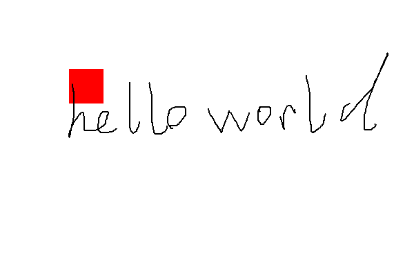

### [EaselJS](https://github.com/CreateJS/EaselJS) 
翻译为“画架”。

顾名思义，使制作游戏、创作类艺术和其他侧重图形项目更容易的开源 `canvas` 库。

该库提供了一个完整的分层显示列表、一个核心交互模型和帮助器类，使使用写 `Canvas` 元素更加容易。

是一个用于在 `HTML5` 中构建高性能交互式 `2D` 内容的库。它提供了一个功能丰富的显示列表，允许您操作和动画图形。它还为鼠标和触摸交互提供了一个健壮的交互模型。

它非常适合构建游戏、生成艺术、广告、数据可视化和其他高度图形化的体验。它可以单独工作，也可以与 `CreateJS` 套件的其他部分一起工作: `SoundJS` 、 `PreloadJS` 和 `TweenJS` 。它没有外部依赖关系，并且应该与您喜欢使用的任何框架兼容。

[地址](https://createjs.com/)

### [Fabric.js](https://github.com/fabricjs/fabric.js)
翻译为“构建”。

具有 `SVG` 解析功能的开源 `canvas` 库。

[地址](http://fabricjs.com/)

[demo](http://fabricjs.com/demos/)

它是一个位于 `canvas` 元素之上的交互式对象模型。它也是一个 `svg` 到画布的解析器。

由于 `canvas` 提供的` api` 太简单了，画出复杂的图形比较困难，做出来 `api` 也都忘了，这个库意旨在解决这个问题。

使用 `fabric.js` 可以在画布上创建和填充对象。几何图形的对象如：矩形，圆，椭圆，多边形，或更复杂的形状组成的数百或数千条简单路径。然后可以用鼠标缩放、移动和旋转这些对象;修改它们的属性- `color` ,  `transparency` ,  `z-index` 等等。还可以操作这些对象—通过简单的鼠标选择将它们分组。

可以直接 `npm` 下载使用：
```js
npm intall fabric -S
```

添加一个红色矩形：
```html

```
### [heatmap.js](https://github.com/pa7/heatmap.js)
翻译”热图“。

基于 `canvas` 的热点图的开源库。

它是一个轻量级的最先进的热图可视化的 `js` 库。
1. 变得更快，有一个新的渲染模块
2. 更强，以处理更多的数据点(40k+)
3. 更容易使用，所以你可以加快速度
4. 快速扩展自定义功能。

[地址](https://www.patrick-wied.at/static/heatmapjs/)

[demo](https://www.patrick-wied.at/static/heatmapjs/examples.html)
### JavaScript InfoVis Toolkit 
是创建交互式的 `2D Canvas` 数据可视化工具

[地址](http://philogb.github.io/jit/)

[demo](http://philogb.github.io/jit/demos.html)
### Konva.js 
是用于桌面端和移动端应用的 `2D canvas` 库。

可以基于 `Vue` 绘制复杂的画布图形。
[地址和demo](https://konvajs.org/)
### p5.js 
包含给艺术家、设计师、教育者、初学者使用的完整的 `canvas` 绘制功能。
### Paper.js 
是运行于 `HTML5 Canvas` 上的开源矢量图形脚本框架。

它提供了一个干净的场景图/文档对象模型和许多强大的功能来创建和使用向量图形和 `bezier` 曲线，所有这些都整齐地包装在一个设计良好的、一致的和干净的编程接口中。
[地址](http://paperjs.org/)

[demo](http://paperjs.org/examples/)
### Phaser 
用于基于 `Canvas` 和 `WebGL` 的浏览器尤其的快速、自由、有趣的开源框架。

[地址](http://phaser.io/)

[demo](http://phaser.io/examples)
### Processing.js 
用于处理可视化语言。是流行的可视化编程语言的姊妹项目，它是为 `web` 设计的。使您的数据可视化，数字艺术，交互式动画，教育图表，视频游戏等工作使用 `web` 标准，没有任何插件。使用 `Processing` 语言编写代码，并将其包含在 `web` 页面中，`Processing.js` 完成其余工作。这不是魔法，但几乎可以算的上是。

`Processing` 最初由 `Ben Fry` 和 `Casey Reas` 开发，最初是一种基于 `Java` 的开源编程语言，用于帮助电子艺术和视觉设计社区在视觉环境中学习计算机编程的基础知识。 `js` 将此提升到了一个新的水平，允许处理代码在任何兼容 `HTML5` 的浏览器上运行，包括当前版本的 `Firefox` 、 `Safari` 、 `Chrome` 、 `Opera` 和 `Internet Explorer`。 `js` 为 `web` 带来了最好的可视化编程，对处理和 `web` 开发人员都是如此。

使用 `Processing.js` 所需的所有东西都在这里。您可以下载最新版本的 `Processing.js` ，阅读快速入门指南处理开发人员或 `JavaScript` 开发人员，了解处理语言和处理。
[地址和demo](http://processingjs.org/)
### Pts.js 
在 `canvas` 和 `SVG` 中进行创意性代码写作和可视化的库。

`Pts` 是轻量级和模块化的。它是用 `typescript` 编写的，带有许多有用的可视化和创造性编码算法。它的友好的 `API` 支持快速原型和更大的项目。
[地址](https://ptsjs.org/)

[demo](https://ptsjs.org/demo/)
### Rekapi 
关键帧动画库。
`Rekapi` 是一个用于 `JavaScript` 的关键帧动画库。它给你一个 `API` :
- 义基于关键帧的动画
- 控制动画播放

`Rekapi` 的核心是不执行任何呈现。但是，它公开了一个用于定义渲染器的 `API` ，并与 `HTML DOM` 和 `HTML5 2D` `<canvas>`的渲染器捆绑在一起。
### Scrawl-canvas 
用来创建和编辑 `2D` 图形的开源库。

这是一个 `JavaScript` 库，旨在让 `HTML5 canvas` 元素的使用变得更简单、更有趣。无依赖，模块化设计。响应的画布为现代网站。

[地址](http://jster.net/library/scrawl-canvas)
### ZIM 
为canvas上的代码创意性提供方便性、组件和可控性，包括可用性和数百个色彩缤纷的教程

`ZIM JavaScript`画布框架-代码创造力!互动媒体。

`JavaScript` 画布框架-代码创造力!一个一致，完整，简单和丰富多彩的画布框架，提供快速的视觉效果。 `ZIM` 非常适合学习编程，也非常适合专业人士制作桌面和移动游戏、应用程序、美术等等!
[地址](https://github.com/danzen/zimjs)

[demo](https://zimjs.com/examples.html)
## 参考文献
[canvas解析](https://developer.mozilla.org/zh-CN/docs/Web/API/CanvasRenderingContext2D)

[学习 HTML5 Canvas](https://www.runoob.com/w3cnote/html5-canvas-intro.html)

[https://www.canvasapi.cn/](https://www.canvasapi.cn/)
