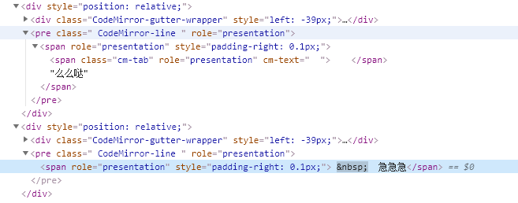
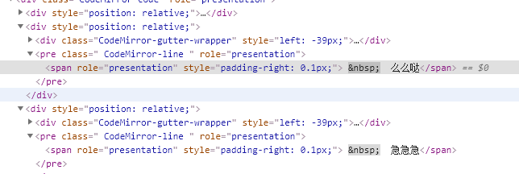
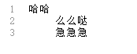

# 【编辑器】手把手教会使用codemirror
在做 `z` 项目的时候，需要用到编辑器，经过一段撕心裂肺的试炼后选择了 `codemirror` 。

`codemirror` 的优点：
- 文档完善
- 例子丰富
- 插件丰富
- 可扩展性强

需要实现的功能：
1. 支持联想关键词
2. 标定错误行
3. 关键词高亮
4. 增加全屏切换的功能
5. 自动补全括号
6. 添加图片，显示图片，与图片名称双向绑定

## 支持联想关键词
```js
      registerHelper(myHintList) {
        CodeMirror.registerHelper("hint", "myMode", function(cm) {
          var cur = cm.getCursor(),
            token = cm.getTokenAt(cur);
          var start = token.start,
            end = cur.ch
          var str = token.string
          // 当前输入的字符和myHintList内的文本前缀匹配过滤，实现一边输入一边查找的功能
          const list = myHintList.filter((item) => {
            return item.indexOf(str) === 0
          })
          if (list.length) return {
            list: list,
            from: CodeMirror.Pos(cur.line, start),
            to: CodeMirror.Pos(cur.line, end)
          };
        });
      },
```

## 标定错误行
```js
      /**
       * @description 标定错误行
       * @param {n} n-1是第几行错误
       */
      deltaErrDecorations(n) {
        const lineData = this.editorDoc.getLine(n)
        if (lineData) {
          const from = {
            line: n - 1,
            ch: 0
          }
          const to = {
            line: n - 1,
            ch: lineData.length
          }
          this.editorDoc.markText(from, to, {
            className: "myContentClass"
          })
        }
      },
```

## 关键词高亮


```js
<template>
  <textarea ref="mycode" class="codesql" v-model="code" style="height:200px;width:600px;"></textarea>
</template>

<script>
  import "codemirror/theme/ambiance.css";
  import "codemirror/lib/codemirror.css";
  import "codemirror/addon/hint/show-hint.css";

  let CodeMirror = require("codemirror/lib/codemirror");
  require("codemirror/addon/edit/matchbrackets");
  require("codemirror/addon/selection/active-line");
  require("codemirror/mode/sql/sql");
  require("codemirror/addon/hint/show-hint");
  require("codemirror/addon/hint/sql-hint");
    export default {
        name: "codeMirror",
      data () {
        return {
          code: '//按Ctrl键进行代码提示'
        }
      },
      mounted () {
        debugger
        let mime = 'text/x-mariadb'
        //let theme = 'ambiance'//设置主题，不设置的会使用默认主题
        let editor = CodeMirror.fromTextArea(this.$refs.mycode, {
          mode: mime,//选择对应代码编辑器的语言，我这边选的是数据库，根据个人情况自行设置即可
          indentWithTabs: true,
          smartIndent: true,
          lineNumbers: true,
          matchBrackets: true,
          //theme: theme,
          // autofocus: true,
          extraKeys: {'Ctrl': 'autocomplete'},//自定义快捷键
          hintOptions: {//自定义提示选项
            tables: {
              users: ['name', 'score', 'birthDate'],
              countries: ['name', 'population', 'size']
            }
          }
        })
        //代码自动提示功能，记住使用cursorActivity事件不要使用change事件，这是一个坑，那样页面直接会卡死
        editor.on('cursorActivity', function () {
          editor.showHint()
        })
      }
    }
</script>

<style>
  .codesql {
    font-size: 11pt;
    font-family: Consolas, Menlo, Monaco, Lucida Console, Liberation Mono, DejaVu Sans Mono, Bitstream Vera Sans Mono, Courier New, monospace, serif;
  }
</style>
```
结果，报了 `showHint is not a function`

```js
    /**
       * @description 关键词高亮
       */
      defineMode(myHighlightList) {
        CodeMirror.defineMode('myMode', (config) => {
          return {
            /**
                这个token方法就是用来标亮关键字的，
                CodeMirror会自上而下，从左往右得遍历每一个字符，依次调用token方法。
                stream参数可以用来控制遍历的粒度，比如我调用方法 stream.eatWhile(/\s/),
                那么当前cursor后面所有的空格会被匹配到stream中，stream.current()的值就是所有匹配到的空格。
            **/
            token: (stream) => {
              if (stream.eatSpace()) {
                return null
              }
              stream.eatWhile(/[\$\w\u4e00-\u9fa5]/)
              const cur = stream.current()
              const exist = myHighlightList.some((item) => {
                return item === cur
              })
              /**
               * 自定义颜色
                 .cm-keyword {
                    color: rgb(252, 142, 173);
                  }
                **/
              if (exist) {
                return 'keyword'
              }
              stream.next()
            }
          }
        })
      },
```
`myHighlightList` 是给定的高亮数据列表。

## 增加全屏切换的功能
先导入插件里的全屏插件
```js
 import "codemirror/addon/display/fullscreen.js"
 import "codemirror/addon/display/fullscreen.css"
```
然后注册快捷键, `extraKeys` 是 `CodeMirror.fromTextArea` 的配置项中的属性。
```js
extraKeys: { //自定义快捷键
            "F11": () => {
              _this.codeMirrorEditor.setOption("fullScreen", !_this.codeMirrorEditor.getOption("fullScreen"));
            },
            "Esc": () => {
              if (_this.codeMirrorEditor.getOption("fullScreen")) _this.codeMirrorEditor.setOption("fullScreen", false);
            }
          }
```

## 自动补全括号
具体需要自动补全括号(按下左括号，自动添加右括号)，例如：`()/{}/[]/<>` 等括号。
```js
      /**
       * @description 自动补全括号(按下左括号，自动添加右括号)，例如：()/{}/[]/<>
       */
      autoInsertParentheses() {
        this.codeMirrorEditor.addKeyMap({
          name: 'autoInsertParentheses',
          "'('": (cm) => {
            const cur = cm.getCursor()
            cm.replaceRange('()', cur, cur, '+insert')
            cm.doc.setCursor({
              line: cur.line,
              ch: cur.ch + 1
            })
          }
        })
        this.codeMirrorEditor.addKeyMap({
          name: 'autoInsertParentheses',
          "'{'": (cm) => {
            const cur = cm.getCursor()
            cm.replaceRange('{}', cur, cur, '+insert')
            cm.doc.setCursor({
              line: cur.line,
              ch: cur.ch + 1
            })
          }
        })
        this.codeMirrorEditor.addKeyMap({
          name: 'autoInsertParentheses',
          "'['": (cm) => {
            const cur = cm.getCursor()
            cm.replaceRange('[]', cur, cur, '+insert')
            cm.doc.setCursor({
              line: cur.line,
              ch: cur.ch + 1
            })
          }
        })
        this.codeMirrorEditor.addKeyMap({
          name: 'autoInsertParentheses',
          "'<'": (cm) => {
            const cur = cm.getCursor()
            cm.replaceRange('<>', cur, cur, '+insert')
            cm.doc.setCursor({
              line: cur.line,
              ch: cur.ch + 1
            })
          }
        })
      },
```

## 添加图片，显示图片，与图片名称双向绑定
```js
   /**
       * @description 从脚本中读取图片
       * @param val 图片值
       * @param positionArr 图片在代码行中的行列位置
       */
      readImage(val) {
        if (val) {
          let positionArr = []
          let codeArr = val.split('\n')
          for (let l = 0; l < codeArr.length; l++) {
            for (let col = -1;
              (col = codeArr[l].indexOf('.png', col + 1)) > -1; positionArr.push({
                line: l,
                ch: col
              }));
          }
          positionArr.forEach(j => {
            const name = codeArr[j.line].substring(j.ch - 13, j.ch)
            let fromPosition = JSON.parse(JSON.stringify(j))
            let toPosition = JSON.parse(JSON.stringify(j))
            fromPosition.ch -= 13
            toPosition.ch += 4
            this.addImage(name, fromPosition, toPosition)
          })
        }
      },
      /**
       * @description 截图并且添加图片
       */
      shotAddImage(imageName) {
        const fromPosition = JSON.parse(JSON.stringify(this.currentCursor))
        let toPosition = JSON.parse(JSON.stringify(this.currentCursor))
        toPosition.ch += 17
        this.addText(imageName, fromPosition, toPosition)
        this.addImage(imageName, fromPosition, toPosition)
      },
      /**
       * @description 添加图片对应的值 `${imageName}.png`
       */
      addText(imageName, fromPosition, toPosition) {
        this.editorDoc.replaceRange(`${imageName}.png`, fromPosition, toPosition)
      },
      /**
       * @description 添加图片
       */
      addImage(imageName, fromPosition, toPosition) {
        var img = document.createElement('img')
        img.setAttribute('src', `/ws/${imageName}.png`)
        img.setAttribute('id', imageName)
        img.setAttribute('class', 'imageClass')
        this.editorDoc.markText(fromPosition, toPosition, {
          className: 'image',
          replacedWith: img,
          readOnly: false
        })
      }
```

我的编辑器配置
```js
this.codeMirrorEditor = CodeMirror.fromTextArea(myTextarea, {
          lineNumbers: true, // 显示行数
          indentUnit: 4, // 缩进单位为4
          styleActiveLine: true, // 当前行背景高亮
          matchBrackets: true, // 括号匹配
          mode: 'myMode', // HMTL混合模式
          // mode: 'text/x-mysql', // HMTL混合模式
          lineWrapping: true, // 自动换行
          theme: 'monokai', // 使用monokai模版
          readOnly: false, //只读
          }
```

## CodeMirror：如何在光标位置之前或之后读取编辑器文本

```js
  //捕获光标更改事件
 editor.on（'cursorActivity'，function（e）{
 var line = e.doc.getCursor（）。line，//光标线
 ch = e.doc.getCursor（）。ch，//光标字符
```

## 设置编辑框
### 设置大小
```js
editor.setSize('800px', '950px');
```
### 获取内容
```js
editor.getValue();
```
仅仅单纯获取编辑器的文本内容，不能识别换行及一些特殊符号的转义
### 赋值
```js
editor.setValue("");　
```

## 关于CodeMirror如何实现实时提示
这个问题在原生的CodeMirror有两个问题，

问题1
一个问题就是代码提示的时候，在没有任何输入的时候就会弹出所有的提示关键词，这一点让人很讨厌，那么该如何改进呢。由于我们这里使用的javascript-hint.js来进行javascript代码的提示，那我们可以修改的文件就应该是public/codemirror/addon/hint/javascript-hint.js文件，如果大家仔细的阅读了CodeMirror的代码，就会发现在javascript-hint.js文件中有一个函数getCompletions，该函数有一个参数叫token,这个token其实是编译原理中所说的token，也就是一个语法分割单位，这个token是我们代码提示的关键，所有的关键字就要跟token进行比对，如果发现token是某些关键字的前缀，那么这些单词都要作为当前的关键字提示给用户。
例如，下图中，我们正在输入的语法单词是se，那么此时触发的cursorActivity事件调用showHint方法，经过一系列的函数判断，最重获取到当前的token是se，则我们需要将所有以se为首的单词进行弹出提示。那么，针对我们正在说的这个事情：CodeMirror在我们没有任何输入的时候，也会进行代码提示，那根据分析没有任何输入时，触发cursorActivity事件时，得到的token的值是""，我们只需要在getCompletions函数(这个函数就是获取和当前用户正在输入的语法单词匹配的所有关键词的函数)的开始判断token==""，如果是true，则直接返回一个空的list{}。

enter description here

改写的代码如下：

    function getCompletions(token, context, keywords,options) {

        //这里是处理没有任何字母输入时也会有代码提示的原因。
        if (token.string == "") {
            return {list:{}};;
        }
        ...
}
问题2
另外一个问题就是CodeMirror能提供的auto-complete(代码自动完成)是需要进行按键绑定的，用户通过某个按键组合才能触发autocomplete事件，这对于我们写代码的速度肯定影响是很大。因此，我们希望在我们输入字符的同时，界面可以给出我们实时的代码提示，而不需要进行按键组合来触发。一般网上的示例都是比较坑爹的，代码示例如下：

editor.on("change", function () {
     editor.showHint();
});
如果你是这么用CodeMirror的，或者你正在发愁的时候，我希望我的这的总结能够给你提供比较稳的帮助。继续说，上面的代码示例千万不要用，因为这样做了，浏览器会卡死的，而造成这种现象 的原因可能是CodeMirror内部处理的问题，我没有仔细研究，但是经过我的仔细阅读官方文档和不断摸索，我给出一个比较正确的方案来实现代码的实时提示。

//不要用change
editor.on("cursorActivity", function () {
            //调用显示提示
            editor.showHint();
});
如果，你是这么做的或者你刚好这么改正了，那么恭喜你，你应该得到了你要的效果。

好了，这两个问题，就简单论述到这里，下面还有更重要的东西需要我来论述的。

如何增加CodeMirror代码提示的关键字
enter description here

不失一般性，我这里就描述一下这个项目中，我是如何获取更多的关键字（这里的关键字是指匹配用户输入的提示单词）并且将这样单词进行匹配并跟随原有的关键字进行实时提示的。

还记得刚才看过的那个代码片段吧，上面的代码是我为了给大家描述如何来触发代码实时提示的解决方案的。下面才是本项目中实际用到的代码。下面的代码注释已经写的很清楚的，首先就是利用CodeMirror的API来获取用户输入代码（注意是纯代码），然后利用正则来提取出所有的单词，用match匹配后得到的是一个数组，然后将该数组传递给我们拓展在CodeMirror全局变量的上一个属性ukeys。然后再调用editor.showHint()来处理实际的代码提示。

 /**
 * 用来实时对用户的输入进行提示
 */
editor.on("cursorActivity", function () {
    //获取用户当前的编辑器中的编写的代码
    var words = editor.getValue() + "";
    //利用正则取出用户输入的所有的英文的字母
    words = words.replace(/[a-z]+[\-|\']+[a-z]+/ig, '').match(/([a-z]+)/ig);
    //将获取到的用户的单词传入CodeMirror,并在javascript-hint中做匹配
    CodeMirror.ukeys = words;
    //调用显示提示
    editor.showHint();
});
上面的描述希望没有给您带来阅读上的不顺畅，下面，我将描述一下如何在javascript-hint.js文件中如何接受我们传入的ukeys以及如何利用内置的函数快速完成关键字的匹配并将匹配的结果叠加进行关键字的提示。

首先是javascript-hint.js中javascript代码提示的主调函数
如果你对下面的文字描述不感兴趣，请移步github(点我)，直接看源码（有注释）.


    /**
     * 主调函数，加入了我自己定义的一个CodeMirror.ukeys变量，用来向CodeMirror传递用户
     * 输入的所有的单词
     * @param editor
     * @param options
     * @returns {{list, from, to}|*}
     */
    function javascriptHint(editor, options) {

        var ukeys =  CodeMirror.ukeys;//获取用户的所有的输入的单词
        return scriptHint(editor, javascriptKeywords,ukeys,
            function (e, cur) {
                return e.getTokenAt(cur);
            },
            options);
    };
如上面的代码所示，在javascriptHint函数中，我们获取到CodeMirror.ukeys，并将ukeys传递给scriptHint函数。scriptHint函数的主要代码如下：


    //这是处理关键字匹配的关键函数实现
    function scriptHint(editor, keywords, ukeys,getToken, options) {
        // Find the token at the cursor
        var cur = editor.getCursor(), token = getToken(editor, cur);
        if (/\b(?:string|comment)\b/.test(token.type)) return;
        token.state = CodeMirror.innerMode(editor.getMode(), token.state).state;

        // If it's not a 'word-style' token, ignore the token.
        if (!/^[\w$_]*$/.test(token.string)) {
            token = {
                start: cur.ch, end: cur.ch, string: "", state: token.state,
                type: token.string == "." ? "property" : null
            };
        } else if (token.end > cur.ch) {
            token.end = cur.ch;
            token.string = token.string.slice(0, cur.ch - token.start);
        }

        var tprop = token;
        // If it is a property, find out what it is a property of.
        while (tprop.type == "property") {
            tprop = getToken(editor, Pos(cur.line, tprop.start));
            if (tprop.string != ".") return;
            tprop = getToken(editor, Pos(cur.line, tprop.start));
            if (!context) var context = [];
            context.push(tprop);
        }
        return {
            list: getCompletions(token, context, keywords,ukeys, options),
            from: Pos(cur.line, token.start),
            to: Pos(cur.line, token.end)
        };
    }
从上面的代码中，可以看到scriptHint函数主要是获取list(匹配的关键字)。这也印证了上面我在处理没有任何输入时，判断token==""返回的是{list:{}}是正确的写法。这个函数的改动很小，主要还是将ukeys继续向下传递 list: getCompletions(token, context, keywords,ukeys, options)。所以的单词匹配都是在getCompletions函数中实现的，在这个函数中，提供了很多内置函数，我们只需要添加几行代码就可以完成附加关键词的功能了。该函数的改动后的代码如下所示：

 /**
     *
     * @param token 当前光标下用户正在输入的单词
     * @param context
     * @param keywords 关键字列表，本文件内定义
     * @param ukeys 用户添加的关键字
     * @param options
     * @returns {*}
     */
    function getCompletions(token, context, keywords, ukeys,options) {

        //这里是处理没有任何字母输入时也会有代码提示的原因。
        if (token.string == "") {
            return {list:{}};
        }
        var found = [], start = token.string, global = options && options.globalScope || window;

        function maybeAdd(str) {
            if (str.lastIndexOf(start, 0) == 0 && !arrayContains(found, str)) found.push(str);
        }

        function gatherCompletions(obj) {
            if (typeof obj == "string") forEach(stringProps, maybeAdd);
            else if (obj instanceof Array) forEach(arrayProps, maybeAdd);
            else if (obj instanceof Function) forEach(funcProps, maybeAdd);
            forEach(ukeys,maybeAdd);//匹配我们传进来的用户输入的代码中的所有的单词
            forAllProps(obj, maybeAdd)
        }

        if (context && context.length) {
            // If this is a property, see if it belongs to some object we can
            // find in the current environment.
            var obj = context.pop(), base;
            if (obj.type && obj.type.indexOf("variable") === 0) {
                if (options && options.additionalContext)
                    base = options.additionalContext[obj.string];
                if (!options || options.useGlobalScope !== false)
                    base = base || global[obj.string];
            } else if (obj.type == "string") {
                base = "";
            } else if (obj.type == "atom") {
                base = 1;
            } else if (obj.type == "function") {
                if (global.jQuery != null && (obj.string == '$' || obj.string == 'jQuery') &&
                    (typeof global.jQuery == 'function'))
                    base = global.jQuery();
                else if (global._ != null && (obj.string == '_') && (typeof global._ == 'function'))
                    base = global._();
            }
            while (base != null && context.length)
                base = base[context.pop().string];
            if (base != null) gatherCompletions(base);
        } else {
            // If not, just look in the global object and any local scope
            // (reading into JS mode internals to get at the local and global variables)
            for (var v = token.state.localVars; v; v = v.next) maybeAdd(v.name);
            for (var v = token.state.globalVars; v; v = v.next) maybeAdd(v.name);
            if (!options || options.useGlobalScope !== false)
                gatherCompletions(global);
            forEach(keywords, maybeAdd);
        }
        //console.log(found);
        return found;
    }
我们只在gatherCompletions函数中添加了一条语句
好了，如果你这么做了，就可以完成我们输入的变量也会出现在CodeMirror中了。


## 插入插件无效
需要将codemirror自带的插件导入

```js
// 需要的codemirror中的插件按需导入
  import * as CodeMirror from 'codemirror/lib/codemirror'
  import 'codemirror/lib/codemirror.css'
  import "codemirror/addon/hint/sql-hint"
  import "codemirror/addon/hint/show-hint.css"
  import "codemirror/addon/hint/show-hint.js"
  import "codemirror/addon/edit/matchbrackets"
  import "codemirror/mode/sql/sql"
```


## 如何激活 codemirror 中的全屏插件？
```
var editor = CodeMirror.fromTextArea(document.getElementById("code"), {
      lineNumbers: true,
      theme: "night",
      extraKeys: {
        "F11": function(cm) {
          cm.setOption("fullScreen", !cm.getOption("fullScreen"));
        },
        "Esc": function(cm) {
          if (cm.getOption("fullScreen")) cm.setOption("fullScreen", false);
        }
      }
    });
```

## 常用事件
1.onChange(instance,changeObj)：codeMirror文本被修改后触发。

instance是一个当前的codemirror对象，changeObj是一个｛from，to，text[,removed][，origin]｝对象。其中from，to分别表示起始行对象和结束行对象，行对象包括ch：改变位置距离行头的间隔字符，line：改变的行数。text是一个字符串数组表示被修改的文本内容，即你输入的内容。

2.onBeforeChange(instance,changObj):内容改变前被调用

3.onCursorActivity(instance)：当鼠标点击内容区、选中内容、修改内容时被触发

4.onKeyHandled:(instance,name,event):当一个都dom元素的事件触发时调用，name为操作名称。

5.onInputRead(insatance,changeObj):当一个新的input从隐藏的textara读取出时调用

6.onBeforeSelectionChange(instance,obj):当选中的区域被改变时调用，obj对象是选择的范围和改变的内容（本人未测试成功）

7.onUpdate(instance):编辑器内容被改变时触发

8.onFocus(instance):编辑器获得焦点式触发

9.onBlur(instance):编辑器失去焦点时触发

## 常用方法
getValue():获取编辑器文本内容

setValue(text):设置编辑器文本内容

getRange({line,ch},{line,ch}):获取指定范围内的文本内容第一个对象是起始坐标，第二个是结束坐标

replaceRange(replaceStr,{line,ch},{line,ch}):替换指定区域的内容

getLine(line)：获取指定行的文本内容

lineCount():统计编辑器内容行数

firstLine():获取第一行行数，默认为0，从开始计数

lastLine():获取最后一行行数

getLineHandle(line):根据行号获取行句柄

getSelection():获取鼠标选中区域的代码

replaceSelection(str):替换选中区域的代码

setSelection({line:num,ch:num1},{line:num2,ch:num3}):设置一个区域被选中

somethingSelected()：判断是否被选择

getEditor()：获取CodeMirror对像

undo()：撤销

redo():回退

## extraKeys的快捷键绑定命令

1. selectAllCtrl-A ：选择编辑器的全部内容。
2. killLine:Emacs式的清除行。用于删除行内光标后的内容。如果只包含空白字符，行尾的新行(应该是指换行 字符)也会被删除。
3. deleteLine :删除光标所在整行，包括行尾的新行。
4. delLineLeft:删除行内光标前的内容。
5. delWrappedLineLeft:删除光标所在可见行左边到光标处的部分。（这里是针对在行内有换行显示的情况，也就是说可能不是一行全部处理，而是只处理行的一部分）
6. delWrappedLineRight：删除光标所在可见行光标处到右边的部分。（同上）
7. undo：撤消最后一次更改。
8. redo:重做最后一次撤消更改。
9. undoSelection:撤消最后一次选择的更改，如果没有选择更改，那么就撤消最后一次文本更改。
10. redoSelection:重做最后一次选择的更改，如果没有选择更改，那么就重做最后一次文本更改。
11. goDocStart:移动光标到文档开始处。
12. goDocEnd:移动光标到文档结束处。
13. goLineStart:移动光标到行开始处。
14. goLineStartSmartHome:移动光标到行文字开始处，如果光标已经在那，那么就移动到行的真正开始处。
15. goLineEnd:移动光标到行结束处。
16. goLineRight:移动光标到可见行右边。
17. goLineLeft：移动光标到可见行左边。如果行内有换行，那么可能不会移动到行开始处。
18. goLineLeftSmart：移动光标到行文字开始处，如果光标已经在那，那么就移动到行的真正开始处。
19. goLineUp：移动光标到上一行。
20. goLineDown：移动光标到下一行。
21. goPageUp：移动光标到上一屏，（每次）向上滚动相同距离。
22. goPageDown：移动光标到下一屏，（每次）向下滚动相同距离。
23. goCharLeft：光标向左移动一个字符，如果在光标行首，那么移动到前一行。
24. goCharRight：光标向右移动一个字符，如果在光标行尾，那么移动到后一行。
25. goColumnLeft:光标向左移动一个字符，但是不会超过行边界。
26. goColumnRight：光标向右移动一个字符，但是不会超过行边界。
27. goWordLeft:光标移动到前一个词开始处。
28. goWordRight：光标移动到后一个词结束处。
29. goGroupLeft：移动光标到光标前的组的左边。组是词的扩展，扩展到标点符号，新行或者是多个空白字符。
30. goGroupRight：移动光标到光标后的组的右边。组是词的扩展，扩展到标点符号，新行或者是多个空白字符。
31. delCharBefore:删除光标前的一个字符。
32. delCharAfter:删除光标后的一个字符。
33. delWordBefore:删除光标前的一个词。
34. delWordAfter:删除光标后的一个词。
35. delGroupBefore：删除光标前的一个组。
36. delGroupAfter：删除光标后的一个组。
37. indentAuto：自动缩进当前行或选中行。
38. indentMore：缩进当前行或选中行一个缩进单位。
39. indentLess：反缩进当前行或选中行一个缩进单位。（移除一个缩进单元）
40. insertTab：在光标处插入Tab字符。
41. insertSoftTab：在光标处插入与Tab字符等宽的空格字符。
42. defaultTabTab：如果有选中行，则缩进一个缩进单位；如果没有选择行，则插入一个Tab字符。
43. transposeChars：交换光标前后的字符。
44. newlineAndIndentEnter：插入新行并且自动缩进。
45. toggleOverwriteInsert：反转overwrite标志。
46. save：只存在快捷键中，核心库未定义。这是为了给用户编码提供一个简单的方法来定义保存命令。
47. find：查找。
48. findNext:向前查找。
49. findPrev:向后查找。
50. replace:替换。
51. replaceAll:全部替换。
##  TAB 键缩进的格式问题
`codemirror` 默认 `TAB` 键是支持缩进的, 但在没有选择文本时, 缩进是一个 `Tab` 键而不是 `indexUnit` 对应的空格数. 默认也不支持 `Shift - Tab` 往回缩进, 这个在排版文本是非常麻烦的。

问题剖析如下：

例如输入“哈哈”回车tab后输入“么么哒”，
回车后输入“急急急”就出现如下格式问题。


打开控制台查看元素属性发现“么么哒”这一行tab是span内容是空格，以空格缩进，class是cm-tab。但是“急急急”这一行是&nbsp缩进。


为了解决这两个问题我们需要重新定义这两个快捷键的实现, 
```js
extraKeys: { // 注册快捷键
            Tab: (cm) => {
              if (cm.somethingSelected()) { // 存在文本选择
                cm.indentSelection('add'); // 正向缩进文本
              } else { // 无文本选择  
                //cm.indentLine(cm.getCursor().line, "add");  // 整行缩进 不符合预期
                cm.replaceSelection(Array(cm.getOption("indentUnit") + 1).join(" "), "end", "+input"); // 光标处插入 indentUnit 个空格
              }
            },
            "Shift-Tab": (cm) => { // 反向缩进   
              if (cm.somethingSelected()) {
                cm.indentSelection('subtract'); // 反向缩进
              } else {
                // cm.indentLine(cm.getCursor().line, "subtract");  // 直接缩进整行
                const cursor = cm.getCursor();
                cm.setCursor({
                  line: cursor.line,
                  ch: cursor.ch - 4
                }); // 光标回退 indexUnit 字符
              }
              return;
            }
          },
```

加了之后





格式恢复正常。
## 参考文献
[CodeMirror在线代码编辑器使用以及如何取值](https://www.cnblogs.com/web001/p/9370392.html)

[在vue项目中使用codemirror插件实现代码编辑器功能（代码高亮显示及自动提示）](https://www.cnblogs.com/GarsonZhang/p/10572651.html)

[关于CodeMirror如何实现实时提示](https://segmentfault.com/a/1190000016136831#item-1-5)

[CodeMirror入门指南](https://juejin.im/post/6844903637152432141)

[CodeMirror事件和常用方法](https://blog.csdn.net/mafan121/article/details/49178945?utm_source=blogxgwz1)

[CodeMirror使用说明书](https://blog.csdn.net/JLU_Lei/article/details/80259697)