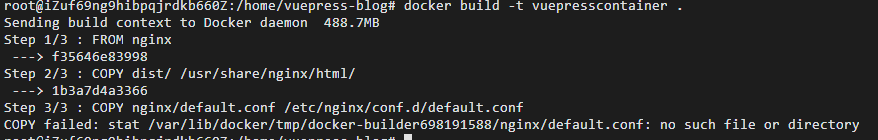
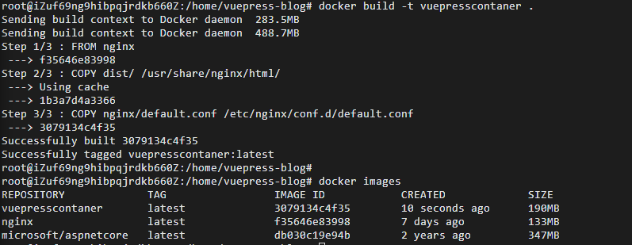
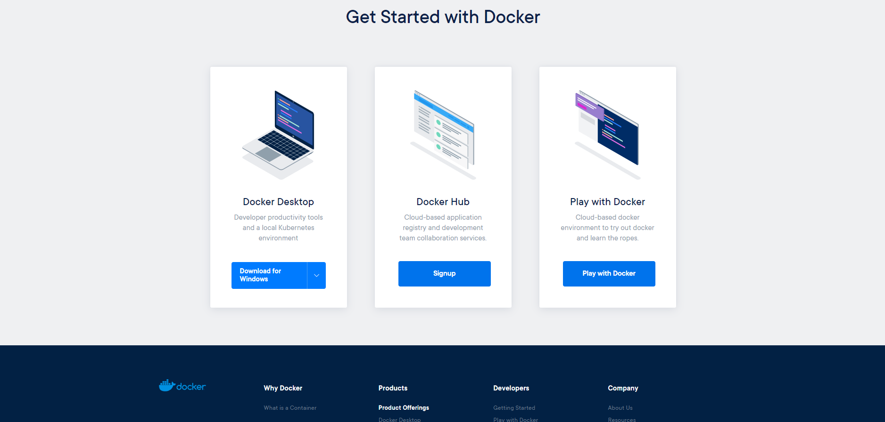
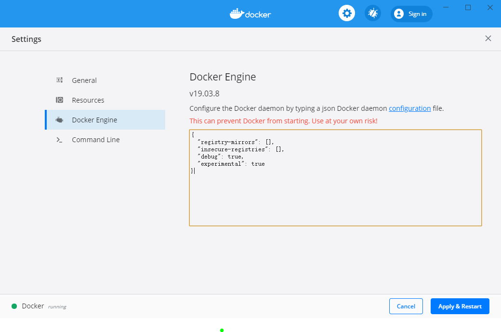
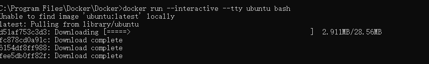
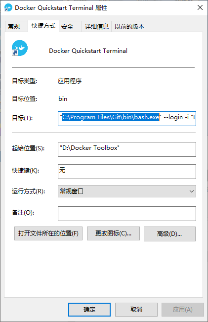

# 【运维】手把手教你docker部署vuepress项目
## 前言
`Docker` 作为轻量级虚拟化技术，拥有持续集成、版本控制、可移植性、隔离性和安全性等优势。本文使用 `Docker` 来部署一个 `vuepress` 项目，并尽可能详尽的介绍了实现思路和具体步骤，以方便有类似需要的同学参考。
> Docker 是一个开源的应用容器引擎，基于 Go 语言，并遵从 Apache2.0 协议开源。

> Docker 可以让开发者打包他们的应用以及依赖包到一个轻量级、可移植的容器中，然后发布到任何流行的 Linux 机器上，也可以实现虚拟化。

> 容器是完全使用沙箱机制，相互之间不会有任何接口（类似 iPhone 的 app）,更重要的是容器性能开销极低。

## Docker的应用场景
1. Web 应用的自动化打包和发布。
2. 自动化测试和持续集成、发布。
3. 在服务型环境中部署和调整数据库或其他的后台应用。
4. 从头编译或者扩展现有的 OpenShift 或 Cloud Foundry 平台来搭建自己的 PaaS 环境。

## Docker 的优点
Docker 是一个用于开发，交付和运行应用程序的开放平台。Docker 使您能够将应用程序与基础架构分开，从而可以快速交付软件。借助 Docker，您可以与管理应用程序相同的方式来管理基础架构。通过利用 Docker 的方法来快速交付，测试和部署代码，您可以大大减少编写代码和在生产环境中运行代码之间的延迟。

1. 快速，一致地交付您的应用程序
Docker 允许开发人员使用您提供的应用程序或服务的本地容器在标准化环境中工作，从而简化了开发的生命周期。

容器非常适合持续集成和持续交付（CI / CD）工作流程，请考虑以下示例方案：

您的开发人员在本地编写代码，并使用 Docker 容器与同事共享他们的工作。
他们使用 Docker 将其应用程序推送到测试环境中，并执行自动或手动测试。
当开发人员发现错误时，他们可以在开发环境中对其进行修复，然后将其重新部署到测试环境中，以进行测试和验证。
测试完成后，将修补程序推送给生产环境，就像将更新的镜像推送到生产环境一样简单。
2. 响应式部署和扩展
Docker 是基于容器的平台，允许高度可移植的工作负载。Docker 容器可以在开发人员的本机上，数据中心的物理或虚拟机上，云服务上或混合环境中运行。

Docker 的可移植性和轻量级的特性，还可以使您轻松地完成动态管理的工作负担，并根据业务需求指示，实时扩展或拆除应用程序和服务。

3. 在同一硬件上运行更多工作负载
Docker 轻巧快速。它为基于虚拟机管理程序的虚拟机提供了可行、经济、高效的替代方案，因此您可以利用更多的计算能力来实现业务目标。Docker 非常适合于高密度环境以及中小型部署，而您可以用更少的资源做更多的事情。

默认已经安装了 docker

相关版本：

`Docker version 18.03.0-ce, build 0520e24302`

运行环境为 `linux`，如果与阅读者操作系统之间存在差异，请自行调整

相关镜像：

`nginx:latest` 和 `node:latest`
## 具体实现
创建一个 `vuepress`项目，基于 `nginx docker` 镜像构建成一个前端工程镜像，然后基于这个前端工程镜像，启动一个容器 `vuepresscontainer`。



## 创建vuepress应用
1. 创建一个vuepress项目
2. 运行命令
3. 访问 http://localhost:8081
4. 构建vuepress项目
5. 运行命令
```
yarn build / npm run build
```
此时工程根目录下多出一个 `dist` 文件夹。

如果将该 `dist` 目录整个传到服务器上，部署成静态资源站点就能直接访问到该项目。

接下来就来构建一个这样的静态资源站点。
## 构建vuepress应用
`nginx` 是一个高性能的 `HTTP` 和反向代理服务器，此处我们选用 `nginx` 镜像作为基础来构建我们的应用镜像。

1. 获取 nginx 镜像
```
docker pull nginx
```

> docker镜像（Image）一个特殊的文件系统。Docker镜像是一个特殊的文件系统，除了提供容器运行时所需的程序、库、资源、配置等文件外，还包含了一些为运行时准备的一些配置参数（如匿名卷、环境变量、用户等）。 镜像不包含任何动态数据，其内容在构建之后也不会被改变。
> docker 镜像相关操作有: 搜索镜像docker search [REPOSITORY[:TAG]]、拉取镜像docker pull [REPOSITORY[:TAG]] 、查看镜像列表docker image ls、删除镜像：docker image rm [REPOSITORY[:TAG]] / docker rmi [REPOSITORY[:TAG]] 等等。
> docker 镜像名称由REPOSITORY和TAG组成 [REPOSITORY[:TAG]]，TAG默认为latest
2. 创建 nginx config配置文件
在项目根目录下创建 `nginx` 文件夹，该文件夹下新建文件 `default.conf`。
```
server {
    listen       80;
    server_name  localhost;

    #charset koi8-r;
    access_log  /var/log/nginx/host.access.log  main;
    error_log  /var/log/nginx/error.log  error;

    location / {
        root   /usr/share/nginx/html;
        index  index.html index.htm;
    }

    #error_page  404              /404.html;

    # redirect server error pages to the static page /50x.html
    #
    error_page   500 502 503 504  /50x.html;
    location = /50x.html {
        root   /usr/share/nginx/html;
    }
}
```
该配置文件定义了首页的指向为 `/usr/share/nginx/html/index.html`, 所以我们可以一会把构建出来的`index.html` 文件和相关的静态资源放到 `/usr/share/nginx/html` 目录下。

3. 创建 Dockerfile 文件
```
FROM nginx
COPY dist/ /usr/share/nginx/html/
COPY nginx/default.conf /etc/nginx/conf.d/default.conf
```
> 自定义构建镜像的时候基于Dockerfile来构建。
> FROM nginx 命令的意思该镜像是基于 nginx:latest 镜像而构建的。
> COPY dist/ /usr/share/nginx/html/ 命令的意思是将项目根目录下dist文件夹下的所有文件复制到镜像中 /usr/share/nginx/html/ 目录下。
> COPY nginx/default.conf /etc/nginx/conf.d/default.conf 命令的意思是将nginx目录下的default.conf 复制到 etc/nginx/conf.d/default.conf，用本地的 default.conf 配置来替换nginx镜像里的默认配置。

4. 基于该Dockerfile构建vue应用镜像
运行命令（注意不要少了最后的 “.” ）
```
docker build -t vuepresscontainer .
```
-t 是给镜像命名 . 是基于当前目录的Dockerfile来构建镜像
5. 查看本地镜像，运行命令
```
docker image ls | grep vuepresscontainer
```
```
docker grep image vuepresscontainer
```
应用镜像 `vuepresscontainer` 已经成功创建。接下来，我们基于该镜像启动一个 `docker` 容器。
6. 启动 vue app 容器

`Docker` 容器 `Container` ： 镜像运行时的实体。镜像（`Image`）和容器（`Container`）的关系，就像是面向对象程序设计中的类和实例一样，镜像是静态的定义，容器是镜像运行时的实体。容器可以被创建、启动、停止、删除、暂停等 。

基于 `vuenginxcontainer` 镜像启动容器，运行命令：
```
docker run -p 3000:80 -d --name vueApp vuenginxcontainer
```
`docker run` 基于镜像启动一个容器
`-p 3000:80` 端口映射，将宿主的 `3000` 端口映射到容器的 `80` 端口
-d 后台方式运行
--name 容器名
查看 `docker` 进程
```
docker ps
```
可以发现名为 `vueApp` 的容器已经运行起来。此时访问 http://localhost:3000 应该就能访问到该vue应用:

目前为止，已经通过 `docker` 容器部署了一个静态资源服务，可以访问到静态资源文件。
## 开发遇到的问题
### no such file or directory
问题如下
```
COPY failed: stat /var/lib/docker/tmp/docker-builder698191588/nginx/default.conf: no such file or directory
```

解决方案

`default.conf` 放置目录不对，先创建 `nginx`，将其放入其中，`Dockerfile` 中的 `COPY nginx/default.conf /etc/nginx/conf.d/default.conf`
会将 `nginx` 文件夹下的 `default.conf` 替换到 `/etc/nginx/conf.d/` 文件夹下。


### 使用docker 出现Error response from daemon: Conflict. The container name “***” is already in use
解决方法：
1. 给容器换一个名字, 比如说 docker run -it --name=mycentos2 centos:7 /bin/bash, 可以解决问题.
2. 将原来的容器删除

查询当前容器：`docker container ls -all`

在这里插入图片描述

删除当前容器：`docker container rm mycentos`(提示: 这一步要确定删除容器没问题的情况下, 才可以做)

### docker删除镜像Error response from daemon: conflict: unable to remove repository reference
1. 停止container，这样才能够删除其中的images：

`docker stop $(docker ps -a -q)`

如果想要删除所有 `container` 的话再加一个指令：

`docker rm $(docker ps -a -q)`
狠心把容器都删除掉了，因为光停止还是不能删除镜像。

1. 查看当前有些什么镜像 docker images

2. 相关容器关闭后，删除对应的images，通过image的id来指定删除谁

`docker rmi ID`

要删除全部image
 
`docker rmi $(docker images -q)`

 
### [win10安装docker](https://www.docker.com/products/developer-tools)

1. 点击图中的`Download for window`下载docker
2. 下载完成后点击`exe`文件进行安装
3. 安装完成后双击`docker`小鲸鱼即可打开docker桌面版



### docker是什么
对 Docker 最简单并且带有一定错误的认知就是 “Docker 是一种性能非常好的虚拟机”。
正如上面所说，这是有一定错误的说法。Docker 相比于传统虚拟机的技术来说先进了不少，具体表现在 Docker 不是在宿主机上虚拟出一套硬件后再虚拟出一个操作系统，而是让 Docker 容器里面的进程直接运行在宿主机上（Docker 会做文件、网络等的隔离），这样一来 Docker 会 “体积更轻、跑的更快、同宿主机下可创建的个数更多”。

### 执行`docker info`报错`The system cannot find the file specified. In the default daemon configuration on Windows, the docker client must be run elevated to connect. `
具体报错
```
ERROR: error during connect: Get http://%2F%2F.%2Fpipe%2Fdocker_engine/v1.40/info: open //./pipe/docker_engine: The system cannot find the file specified. In the default daemon configuration on Windows, the docker client must be run elevated to connect. This error may also indicate that the docker daemon is not running.
errors pretty printing info
```
意思是系统找不到指定的文件。在Windows上的默认守护进程配置中，必须运行docker客户端才能连接。这个错误也可能表明docker守护进程没有运行。
解决方法
```
cd "C:\Program Files\Docker\Docker"
DockerCli.exe -SwitchDaemon
```
### [docker入门【window】](https://docs.docker.com/docker-for-windows/?utm_source=docker4win_2.3.0.2&utm_medium=docs&utm_campaign=referral)

### docker报错`docker: no matching manifest for windows/amd64 10.0.17763 in the manifest list entries.`
意思是在清单列表条目中没有 `windows/amd64 10.0.17763`的匹配清单。

解决方法

右键 `docker` 小图标选择 `setting`



重新可以拉取



### 运行`docker-compose`报`Version in "./docker-compose.yml" is unsupported`的错误
具体错误如下：
```
Version in "./docker-compose.yml" is unsupported. You might be seeing this error because yo supported version (e.g "2.2" or "3.3") and place your service definitions under the 'services' keions at the root of the file to use version 1.  For more on the Compose file format versions, see [https://docs.docker.com/compose/compose-file/](https://docs.docker.com/compose/compose-file/)
```
这种问题一般是因为用`apt-get`下载`docker-compose`，其版本很低，所以`docker-compose`的版本和 `docker-compose.yml` 要求的版本对应不上。

解决方法：

按照官网的命令将 `docker-compose` 升到最新版
```
sudo curl -L "https://github.com/docker/compose/releases/download/1.24.1/docker-compose-$(uname -s)-$(uname -m)" -o /usr/local/bin/docker-compose

sudo chmod +x /usr/local/bin/docker-compose
```
### win10安装Docker后点击Docker Quickstart Terminal出现“Windows 正在查找 bash.exe 。如果想亲自查找文件，请单击“浏览”。”的问题解决方法
安装了 `Docker` 之后，点击“`Docker Quickstart Terminal`”时出现了一弹框，内容为：“`Windows` 正在查找 `bash.exe` 。如果想亲自查找文件，请单击“浏览”。”，然后就不能再进行下一步了，这样刚安装的 `Docker` 就不能使用了。
<!--  -->
查了查 `bash.exe`，应该是 `git` 里的 `bash.exe`，突然想起当时安装 `Docker` 是有一个选项是一并安装 `git`

问题应该就是因为这里引起的，再次确认 `Docker Quickstart Terminal` 的启动位置，查看其属性，发现目标一栏里的内容。
<!--  -->
目标："C:\Program Files\Git\bin\bash.exe" --login -i "D:\Docker Toolbox\start.sh"，bash路径“C:\Program Files\Git\bin\bash.exe”不对
我安装 `git` 的地方是正确为：“D:\Git\bin\bash.exe”

这就是因为当时安装时取消了”Git for Windows“引起的，因为安装时默认安装在 `C:\Program Files` 目录下，启动 `Docker` 时它还默认在 `C:\Program Files` 下去找 `git` 里的 `bash.exe`，但是我之前的 `git` 并没有安装在该目录。
所以将Docker Quickstart Terminal的属性里的目标一栏相应内容修改掉就行了。我的更改为了"D:\Git\bin\bash.exe" --login -i "D:\Docker Toolbox\start.sh"。

### client version 1.22 is too old. Minimum supported API version is 1.24, please upgrade your client to a newer version
这问题在 `issue` 中已经给出方法

https://github.com/docker/labs/issues/135

```
Changing this file:

docker-compose.windows.yml

Setting its version from '2' to '2.1' and executing 'build' again, It does not throw the error, but after a lot of time it seems not doing anything and stuck on this:

$ docker-compose -f ./docker-compose.windows.yml build

db uses an image, skipping
Building web
Step 1/13 : FROM microsoft/dotnet:1.0.0-preview2-windowsservercore-sdk
1.0.0-preview2-windowsservercore-sdk: Pulling from microsoft/dotnet
```
大致的意思是，设置版本从 '2' 到 '2.1' ，不会报错。

更好解决方法还在搜索中。
