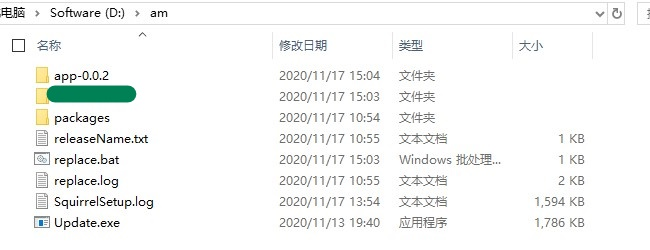

# 研究Electron自动更新 系列三【近8k字】
这是继《研究 `Electron` 自动更新》系列的最后一篇，感谢大家的耐心阅读。

[系列一](https://github.com/qiufeihong2018/vuepress-blog/blob/master/docs/technical-summary/electron-update/update.1.md)从自动更新的方案深入地讲解了其中的原理，另外还讲解了两种打包方式。

[系列二](https://github.com/qiufeihong2018/vuepress-blog/blob/master/docs/technical-summary/electron-update/update.2.md)列举了开发中出现的三个问题，分别是“`Can not find Squirrel`”、“安装目录中`packages`文件夹和`Update.exe`程序找不到”和“`Error: spawn UNKNOWN`”，从不同角度分析并且作了解答。

本文就继续系列二，再讲讲遇到的其他问题。

## 开发中存在的问题
### (四)	Error Downloading Update: Command failed: 4294967295
#### 1.	背景
自动更新过程中出现“`Error Downloading Update: Command failed: 4294967295`”的报错，这个 `error` 和系列二中的问题`3` “`Error: spawn UNKNOWN`” 很类似，因为这个问题很常见，所以我要挑出来讲。
#### 2.	原因分析
这个问题在 `Squirrel.Windows` 的 `issues`（`https://GitHub.com/Squirrel/Squirrel.Windows/issues/833`）中也有，
其中的回答绕不过一点：程序的错误，远程发布文件是空的或损坏影响我们的更新。
#### 3.	解决方式
对于开发者来说，我需要重新上传新的安装程序。还有可能是更新服务器提供的下载 `nupkg` 的 `url` 出错，这个需要通过  `SquirrelSetup.log` 去仔细检查，不难的。
 
对于用户来说，可能需要先卸载后重新安装新的版本。
### (五)	更新后，老版本没有被替换
#### 1.	背景
如果当前电脑上的应用版本是 `0.0.1`，服务器上最新是 `0.0.2`。自动更新完成后，多出来一个新版本的目录 `app-0.0.2`,但是没有覆盖 `xxx` 项目，桌面快捷方式打开的还是 `xxx` 项目里的旧版本。

究其原因，归咎于 `nsis` 没有集成 `updateManage` 机制。系列一和二已经描述过，就不再赘述。



图 7 安装目录

#### 2.	解决方案
1.	向服务器每隔一段时间发送当前版本的请求，询问其是否有新版本的应用（`setFeedURL` 和 `checkForUpdates` 方法实现）;
2.	当有更新进入 `error`、`checking-for-update`、`update-available`和`update-not-available` 这些钩子方法时，写入日志;
3.	更新进入 `update-downloaded`，提示用户更新完成，手动重启。然后，启动一个子进程去执行 `bat` 脚本，替换安装目录下面的旧版本。

`xxx` 项目的更新代码，见 `update.js`：
```js
import {autoUpdater} from 'electron'
// 服务器地址
const server = 'XXXXXXX'
const url = `${server}/update/${process.platform}/${app.getVersion()}/stable`
logger.info(`url:${url}`)
// 设置请求地址
autoUpdater.setFeedURL({
  url
})
logger.info(`process.ExecPath:${process.ExecPath}`)
// 检查更新
setInterval(() => {
  autoUpdater.checkForUpdates()
  logger.info('checkForUpdates')
}, 900000)

const appName = '应用更新'
const message = {
  error: '检查更新出错',
  checking: '正在检查更新……',
  updateAva: '下载更新包成功',
  updateNotAva: '现在使用的就是最新版本，不用更新',
  downloaded: '更新完成，请手动重启'
}
autoUpdater.on('error', error => {
  logger.error('There was a problem updating the application')
  logger.error(error)
})
.on('checking-for-update', function () {
    logger.info('当开始检查更新的时候触发')
  })
  .on('update-available', function () {
    logger.info('当有可用更新时发出，更新会自动下载')
  })
  .on('update-not-available', function () {
    logger.info('暂无更新')
  })
autoUpdater.on('update-downloaded', (event, releaseNotes, releaseName) => {
  logger.info('update-downloaded')
  logger.info(`releaseNotes:${releaseNotes}`)
  logger.info(`releaseName:${releaseName}`)

  dialog.showMessageBox({
    type: 'info',
    buttons: ['确定'],
    title: appName,
    message: process.platform === 'win32' ? releaseNotes : releaseName,
    detail: message.downloaded
  }).then((returnValue) => {
    if (returnValue.response === 0) {
      fs.writeFile('../releaseName.txt', releaseName, (err) => {
        if (err) {
          logger.error(err)
          throw err
        } else {
          var ls
          ls = childProcess.spawn('libs/Windows/adb/adb', ['kill-server'])
          ls.stdout.on('data', function (data) {
            logger.info('stdout: ' + data)
          })
          ls.stderr.on('data', function (data) {
            logger.error('stderr: ' + data)
          })
          ls.on('exit', function (code) {
            logger.info('目录替换程序开始运行')
            // 地址
            const a = process.cwd()
            logger.info('a ' + a)
            const arr = a.split('\\')
            logger.info('arr ' + arr)
            const pre = a.slice(0, -arr[arr.length - 1].length)
            logger.info('pre' + pre)
            process.chdir(pre)
            childProcess.Exec(`start /min  "" "${pre}replace.bat" ${releaseName}`)
            setTimeout(() => {
              logger.info('xxx项目退出')
              app.quit()
            }, 1000)
          })
        }
      })
    }
  })
})
```
`xxx` 项目新版本替换旧版本的脚本，见 `Replace.bat`：
```bash
chcp 65001
echo **更新即将完成，请勿关闭窗口！** >> replace.log
ping -n 5 127.0.0.1 >> replace.log
COPY ".\xxx项目\Uninstall xxx项目.Exe" app-%1 >> replace.log
COPY ".\xxx项目\uninstallerIcon.ico" app-%1 >> replace.log
RD /q /s ".\xxx项目" >> replace.log
ren app-%1 "xxx项目" >> replace.log
del "xxx项目.Exe" >> replace.log
exit
```
### (六)	Update.exe之外的操作无日志
#### 1.	背景
主进程中加入 `console`，仅仅打印在终端上，并不能持久化日志。

更新过程中产生的日志都存储在 `SquirrelSetup.log` 中，但是仅仅只是 `Update.exe` 产出的日志。可是很多步骤需要输出更多的日志。
自动化工具中的部分更新日志采用 `log4js` 方案，将不同的日志类型输出在不同文件中。
#### 2.	解决方案
`xxx` 项目的日志配置，见 `log4js.js`：
```js
const log4js = require('log4js')
const programName = 'xxx项目'
log4js.configure({
  appenders: {
    console: { // 记录器1:输出到控制台
      type: 'console'
    },
    log_file: { // 记录器2：输出到文件
      type: 'file',
      filename: `./logs/${programName}.log`, 
      maxLogSize: 20971520, 
      backups: 3, 
      encoding: 'utf-8' 
    },
    data_file: { // ：记录器3：输出到日期文件
      type: 'dateFile',
      filename: `./logs/${programName}`,  
      alwaysIncludePattern: true,  
      daysToKeep: 7, 
      pattern: 'yyyy-MM-dd-hh.log', 
      encoding: 'utf-8' 
    },
    error_file: { // ：记录器4：输出到error log
      type: 'dateFile',
      filename: `./logs/${programName}_error`, 
      alwaysIncludePattern: true, 
      daysToKeep: 7, 
    
      pattern: 'yyyy-MM-dd-hh.log', 
      encoding: 'utf-8' 
    }
  },
  categories: {
    default: {
      appenders: ['data_file', 'console', 'log_file'],
      level: 'info'
    }, // 默认log类型，输出到控制台 log文件 log日期文件 且登记大于info即可
    production: {
      appenders: ['data_file'],
      level: 'warn'
    }, // 生产环境 log类型 只输出到按日期命名的文件，且只输出警告以上的log
    console: {
      appenders: ['console'],
      level: 'debug'
    }, // 开发环境  输出到控制台
    debug: {
      appenders: ['console', 'log_file'],
      level: 'debug'
    }, // 调试环境 输出到log文件和控制台
    error_log: {
      appenders: ['error_file'],
      level: 'error'
    } // error 等级log 单独输出到error文件中 任何环境的errorlog 将都以日期文件单独记录
  }
})

module.exports = log4js
```
### 总结
解决的方式可能会很多，但是需要采用一种适合自己的方式钻研到底，坚持不懈，就一定能得到收获。

文中介绍了当前存在的问题、自动更新的方案、打包的两种方式和开发中存在的问题。其中，`xxx` 项目采用的是 `squirrel.windows` 的更新机制和 `nsis` 的自定义安装策略。

通过 `electron-builder` 将两者配置后，产出不同的安装程序 `setup.exe` 和更新程序 `nupkg`。然后将 `nsis` 的 `setup.exe` 和 `squirrel.windows` 中的 `nupkg` 上传到 `electron-release-server` 中。利用 `electron-release-server` 定时检查策略，对比本地版本和线上版本，自动下载依赖和程序，进行更新并且替换，做到用户无感知，操作不繁琐。

开发中遇到问题其实不止这些，由于篇幅问题，所以我总结了一部分常见的问题。


最后，希望大家一定要点赞三连。

可以阅读我的其他文章，见[blog地址](https://github.com/qiufeihong2018/vuepress-blog)

<style scoped>
    p:nth-last-child(2) {
        text-align: center
    }
</style>