# Electron操作SQLite数据库
```
目录
一、	背景	2
二、	数据库选型	2
(一)	LocalStorage	2
(二)	SessionStorage	2
(三)	WebSQL	2
(四)	Cookies	2
(五)	IndexedDB	3
(六)	SQLite	3
三、	electron安装SQLite3和环境配置	4
(一)	安装python环境	5
(二)	构建工具下载	5
(三)	开始安装	5
1.	方案一	5
2.	方案二	7
四、	SQLite可视化管理工具	7
(一)	SQLite studio	8
(二)	Sqlitespy	9
(三)	Navicat for SQLite	9
五、	操作SQLite3数据库	10
六、	参考文献	12
```

## 一、	背景
在我们开发某款应用程序的时候，可能会需要用到本地数据库，而不是一直通过 restful 接口，使用远程数据库。所以我们在应用中需要加入数据库，究其根本就是 `electron` 搭配数据库。那么，数据库要选择哪个呢？
## 二、	数据库选型
### (一)	LocalStorage
**LocalStorage** 存储的数据保存在浏览器中。存储容量很小，大概不会超过 **10M**，它是以键值对形式保存数据的，没有关联查询、条件查询的机制。
### (二)	SessionStorage	
**SessionStorage** 跟 `LocalStorage` 很相似，区别是每次关闭会话，其中的内容会被清空。在窗口中打开页面会复制顶级浏览会话的上下文作为新会话的上下文。相同 `url` 的不同 `tabs` 页面，其中的值是不同的。有过期时间设置，想持久化存储数据，它是做不到的。
### (三)	WebSQL
**Web SQL** 数据库 `API` 并不是 `HTML5` 规范的一部分，但是它是一个独立的规范。`WebSQL` 是在浏览器上模拟数据库，使用 `js` 来操作 `SQL` 完成对数据的读写。
### (四)	Cookies
**Cookies** 存储容量太小，只能存 **4kb** 的内容，而且每次与服务端交互，同域下的 `Cookie` 还会被携带到服务端，也没有关联查询、条件查询的机制。

数据以 `Json` 格式保存在本地文件中，以这种方式存储一些用户的配置信息是完全没问题的。但要用这种方式存储大量结构化数据，就很不合理了。主要原因是：用这种方案操作数据是需要把文件中的所有数据都加载到客户端电脑的内存中去的。由于没有索引机制，关联查询、条件查询等操作效率不高，更新了某项数据之后，要持久化更新操作，又要重写整个文件。
### (五)	IndexedDB
`IndexedDB` 是一种底层 `API`，用于在客户端存储大量的结构化数据。该 `API` 使用索引实现对数据的高性能搜索。

`IndexedDB` 是一个事务型数据库系统，类似于基于 `SQL` 的 `RDBMS`。 然而，不像 `RDBMS` 使用固定列表，`IndexedDB` 是一个基于 `js` 的面向对象数据库。`IndexedDB` 可以存储和检索用键索引的对象。只需要指定数据库模式，打开与数据库的连接，然后检索和更新一系列事务。
### (六)	SQLite
官网地址：https://sqlite.org/index.html 。
 
`SQLite` 是一个进程内的库，实现了自给自足的、无服务器的、零配置的、事务性的 `SQL` 数据库引擎。它是一个零配置的数据库，这意味着与其他数据库不一样，我们不需要在系统中配置。

就像其他数据库，`SQLite` 引擎不是一个独立的进程，可以按应用程序需求进行静态或动态连接。`SQLite` 直接访问其存储文件。

特性：
1.	不需要一个单独的服务器进程或操作的系统； 
2.	一个完整的 `SQLite` 数据库是存储在一个单一的跨平台的磁盘文件中；
3.	`SQLite` 是自给自足的，这意味着不需要任何外部的依赖；
4.	`SQLite` 事务是完全兼容 `ACID` 的，允许从多个进程或线程安全访问。

通过比较，我们选择了 `SQLite3` 作为 `electron` 搭配的数据库。`SQLite3` 的使用和 `api` 可以通过菜鸟教程进行学习 https://www.runoob.com/sqlite/sqlite-where-clause.html 。
## 三、	electron安装SQLite3和环境配置
在应用终端中下载依赖包：
```
npm install sqlite3 –save-dev 
```
启动应用又提示我去安装aws-sdk：
```
npm install --save aws-sdk
```
启动应用又报如下错误，真是多灾多难：

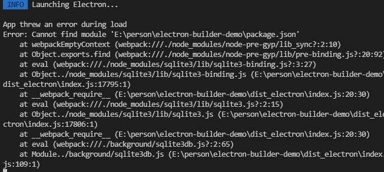

看来安装 `SQLite` 没有这么简单，还是需要做一些准备工作的。比如需要 `python` 环境（python2.7）和vsBuildTools构建工具（Visual Studio 15生成工具2017）。

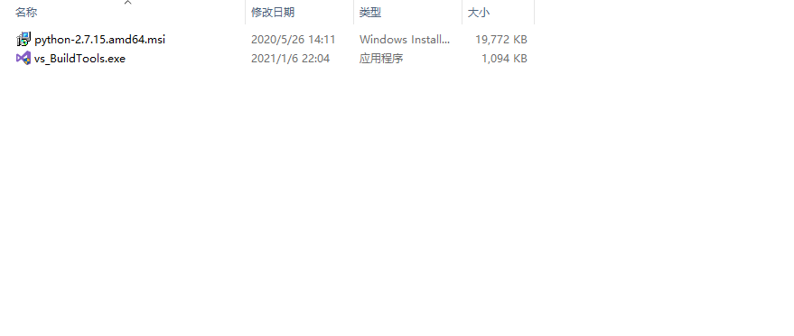

### (一)	安装python环境
我的 `python` 版本：
 
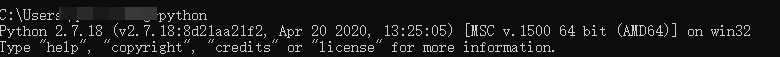

下载地址：https://www.python.org/downloads 。
下载并且安装 `python`，将默认没有勾选的“加入系统变量path”的选项勾选上，配置好环境变量后，在终端里测试一下。
### (二)	构建工具下载
我安装的是 **Visual Studio 15生成工具2017**
 
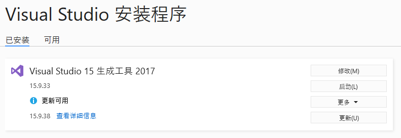

还需要执行
```
npm install windows-build-tools –g
```

安装 **windows-build-tools**。
### (三)	开始安装
#### 1.	方案一
```
cnpm install sqlite3@latest --build-from-source --runtime=electron --target=1.7.9 --dist-url=https://atom.io/download/electron --save
```

不要使用 `npm`。否则报错如下：

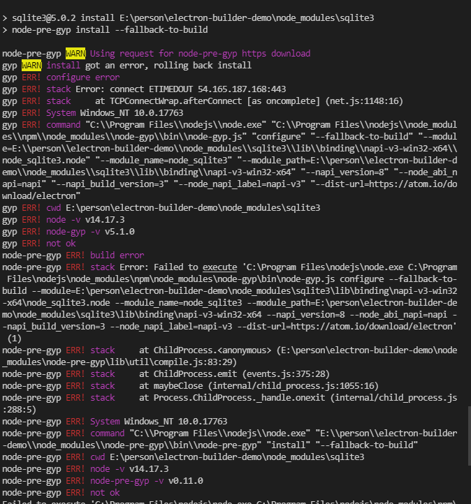
 
使用 cnpm 去安装它。

执行命令开始安装最新版的 `SQLite3`。
 
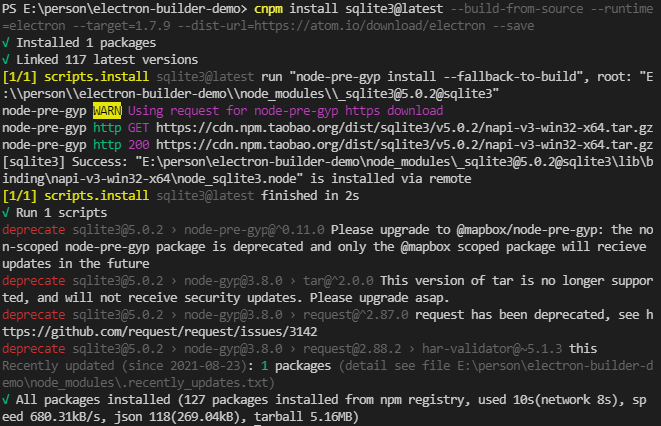

其实这个过程中，会试图下载 `SQLite3` 和我指定版本的 `electron` 的 `prebuild` 版本，没有发现的话。就会重新构建一份合适的版本出来。
#### 2.	方案二
执行下面三条命令：
```
npm install sqlite3 --save
npm install electron-rebuild --save
.\node_modules\.bin\electron-rebuild.cmd
```
这两个方案随便选一条执行，就能安装成功。安装成功后，就可以顺利使用 `SQLite`。
## 四、	SQLite可视化管理工具
生成的数据库并不是双击就能打开预览数据，所以就需要一款可视化管理工具。`SQLite` 的可视化管理工具，是做 `SQLite` 相关开发的必备软件。对于可视化管理工具，并不像 `mysql` 一样，`SQLite` 可选择的范围并不多。
### (一)	SQLite studio
官网地址：https://sqlitestudio.pl/ ，提供下载。

`SQLiteStudio` 是一款可以帮助用户管理 `SQLite` 数据库的工具。该 `SQLiteStudio` 数据库管理工具具有功能完善的 `SQLite2` 和 `SQLite3` 工具，视图编码支持 `utf8`，还可以同时打开多个数据库文件。

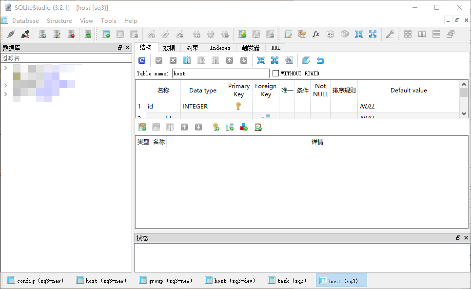

特点：

1.	功能完善的SQLite2和SQLite3工具；
2.	视图编码支持utf8；
3.	支持导出数据格式：csv、html、plain、sql、xml；
4.	可同时打开多个数据库文件；
5.	支持查看和编辑二进制字段；
6.	轻量级，独立性，没有依赖；
7.	隔离性，全部在一个文件夹系统；
8.	跨平台，支持众多操作系统；
9.	多语言接口 支持众多编程语言；
10.	安全性，通过独占性和共享锁来实现独立事务的处理，多个进程可以在同一个时间内从同一个数据库读取数据，但只有一个可以写入数据；
11.	支持数据库大小至2TB。

### (二)	Sqlitespy
下载地址：https://www.yunqa.de/delphi/products/sqlitespy/index 。

`SQLiteSpy` 是一款针对 `SQLite3` 数据库进行可视化管理的工具，不需要安装，只需将该软件提起到任何目录和执行文件就能立即开始工作，软件是一个独立的管理工具，他不会与数据库中的文件及程序产生冲突，操作起来非常方便。用户只需懂基础的 `SQL` 语句就可以轻松执行 `SQL` 查询，视图、复制和删除表、编辑单元格，以及查看索引，触发器和排序规则等操作，非常便捷。

### (三)	Navicat for SQLite
 
网站地址：https://www.navicat.com.cn/products/navicat-for-sqlite 。

`Navicat for SQLite` 是一款强大而全面的 `SQLite` 图形用户界面，提供了一套完整的数据库管理和开发功能，并且支持优化SQLite工作流程和生产力，通过它我们可以快速、安全地创建、组织、访问和共享信息。

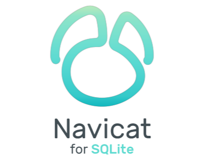

特点：
1.	数据传输和数据同步以低成本轻松快速地迁移数据；
2.	能将不同格式的数据传输到数据。表、视图或查询结果的数据可导出为 Excel、Access、CSV 等格式；
3.	可视化 SQL 创建工具帮助我们创建、编辑和运行 SQL 语句，而不必担心语法和正确命令的用法。透过关键字建议和减少重复输入相同的代码，自动完成代码和自定义的代码段功能可让编码更加快速。

## 五、	操作SQLite3数据库
在项目中的 `background` 文件夹中创建 `sqlite3db.js` 文件，引入 `SQLite3` 并初始化数据库，然后新建一张表，最后插入数据。
```js
import sq3 from "sqlite3";
const sqlite3 = sq3.verbose()
const db = new sqlite3.Database('sq3.db')

db.serialize(() => {
    db.run("create table test(name varchar(20))", () => {
        db.run("insert into test values('nihao')", () => {
            db.all("select * from test", (err, res) => {
                if (err) throw err
                console.log(JSON.stringify(res))
            })
        })
    })
})
export default db
```
在 **main.js** 中导入并且使用
```js
import sqlite3db from './sqlite3db'
// 数据库
app.sqlite3db = sqlite3db
```
启动应用，根目录下生成数据库。

使用 `sqlite studio` 打开，添加数据库，查看导入的数据。
 
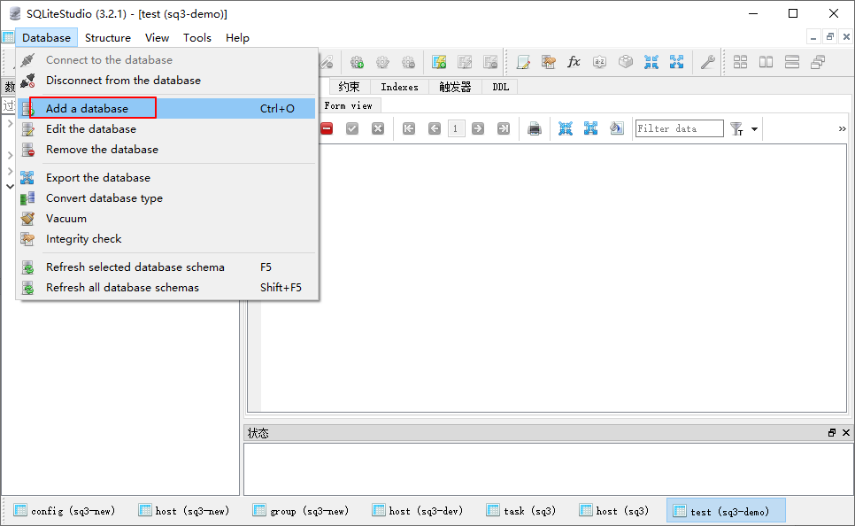

选择文件路径，添加数据库。

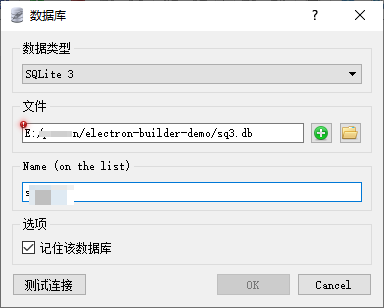
 
选择 `test` 表，切换到数据，查看插入的值。
 
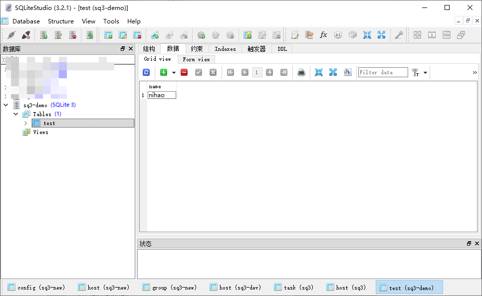

导入成功。

## 六、	参考文献
https://newsn.net/say/electron-install-sqlite3.html

https://www.cnblogs.com/liulun/p/13061672.html

