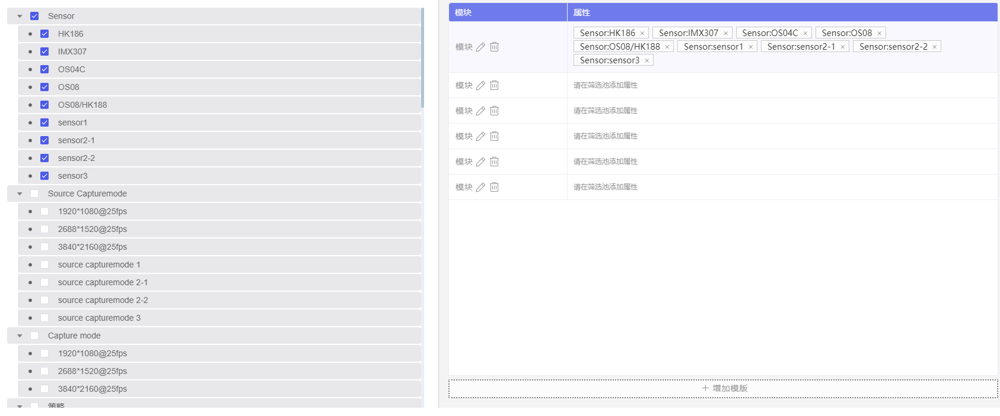
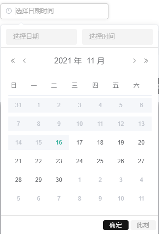

# element-ui
## el-table按住shift键实现多选
```js
<template>
<!-- 按住shift键选择 -->
  <div>
    <!-- 这里添加element组件table的select触发事件，用来实现按住shift多选的 -->
    <el-table
      :data="tableData"
      tooltip-effect="dark"
      style="width: 100%"
      @selection-change="handleSelectionChange"
      @select = "pinSelect"
      ref="multipleTable"  
      >
      
      <el-table-column
        type="selection"
        width="55">
      </el-table-column>
      <el-table-column
        label="日期"
        width="120">
        <template slot-scope="scope">{{ scope.row.date }}</template>
      </el-table-column>
      <el-table-column
        prop="name"
        label="姓名"
        width="120">
      </el-table-column>
      <el-table-column
        prop="address"
        label="地址"
        show-overflow-tooltip>
      </el-table-column>
      </el-table>
      <div style="margin-top: 20px">
        <el-button @click="toggleSelection([tableData[1], tableData[2]])">切换第二、第三行的选中状态</el-button>
        <el-button @click="toggleSelection()">取消选择</el-button>
    </div>
  </div>
</template>

<script>
export default {
  name:'ElementTable',
   data() {
      return {
        origin: -1, // 这里给一个变量作为起点
        pin: false, // 这里给一个变量，默认为false，不按住
        tableData: [{
          date: '2016-05-01',
          name: '王幼虎',
          address: '上海市普陀区金沙江路 1511 弄'
        }, {
          date: '2016-05-02',
          name: '王小虎',
          address: '上海市普陀区金沙江路 1512 弄'
        }, {
          date: '2016-05-03',
          name: '王中虎',
          address: '上海市普陀区金沙江路 1513 弄'
        }, {
          date: '2016-05-04',
          name: '王老虎',
          address: '上海市普陀区金沙江路 1514 弄'
        }, {
          date: '2016-05-05',
          name: '王死虎',
          address: '上海市普陀区金沙江路 1515 弄'
        }, {
          date: '2016-05-06',
          name: '王骨虎',
          address: '上海市普陀区金沙江路 1516 弄'
        }, {
          date: '2016-05-07',
          name: '王灰虎',
          address: '上海市普陀区金沙江路 1517 弄'
        }],
        multipleSelection: []
      }
    },
    methods: {
      toggleSelection(rows) {
        if (rows) {
          rows.forEach(row => {
            this.$refs.multipleTable.toggleRowSelection(row);
          });
        } else {
          this.$refs.multipleTable.clearSelection();
        }
      },
      handleSelectionChange(val) {
        this.multipleSelection = val;
      },
      // 这里是select事件开始
      pinSelect (item, index) {
        const data = this.$refs.multipleTable.tableData; // 获取所以数据
        const origin = this.origin; // 起点数 从-1开始
        const endIdx = index.index; // 终点数   
        if (this.pin && item.includes(data[origin])) { // 判断按住
          const sum = Math.abs(origin - endIdx) + 1;// 这里记录终点
          const min = Math.min(origin, endIdx);// 这里记录起点
          let i = 0;
          while (i < sum) {
            const index = min + i;
              this.$refs.multipleTable.toggleRowSelection(data[index], true); // 通过ref打点调用toggleRowSelection方法，第二个必须为true
            i++;
          }
        } else {
          this.origin = index.index; // 没按住记录起点
        }
      }
      // 这里是select事件结束
    },
    // 这里是获取键盘事件
    mounted(){
      window.addEventListener('keydown', code => { // 这个是获取键盘按住事件
      // console.log(code); // 这个是你按住键盘打印出键盘信息，在浏览器中自行查看
      if (code.keyCode === 16 && code.shiftKey) { // 判断是否按住shift键，是就把pin赋值为true
          this.pin = true;
        }
      });
      window.addEventListener('keyup', code => { // 这个是获取键盘松开事件
        if(code.keyCode === 16){ // 判断是否松开shift键，是就把pin赋值为false
          this.pin = false;
        }
      });
    },
    created(){
      this.tableData.forEach((item, index) => {// 遍历索引,赋值给data数据
        item.index = index;
      })
    }
  }
</script>
<style scoped>

</style>
```
## el-tree修改节点不影响后续操作
修改和添加子节点不能重新获取列表，否则折叠的树会进行展开。

`parentNode.data = res;` 修改子节点时，直接赋值并不会修改树绑定过的数据，只会修改当前节点的数据。

产生的问题：修改之后进行修改或添加脚本，之前的修改不生效。

解决方式:通过先删除后添加的方式，将数据打入树中。

```
        this.$refs.requireTypeTree.remove(parentNode)
        this.$refs.requireTypeTree.append(res, rootNode)
```
重要代码：
```js
      /**
       * @description 子向父发送修改子节点操作
       */
 emitModifyScript(res, rootdata) {
        // 修改文件夹必须重新刷新，否则直接children赋值，文件和文件夹交替修改还是旧数据
        if (res.isFolder === 1) {
          this.getTreeNodes();
        }
        let parentNode = this.$refs.requireTypeTree.getNode(rootdata.id);
        let rootNode = parentNode.parent
        // 直接赋值并不会修改树绑定过的数据
        // 产生的问题：修改之后进行修改或添加脚本，之前的修改不生效。
        // parentNode.data = res;
        // 解决方式：
        // 通过先删除后添加的方式，将数据打入树中
        this.$refs.requireTypeTree.remove(parentNode)
        this.$refs.requireTypeTree.append(res, rootNode)
        this.$forceUpdate();
        console.log('this.treeData', this.treeData)
      },
      /**
       * @description 子向父发送添加子节点操作
       */
      emitCreate(res, rootdata) {
        // (data) 要获得 node 的 key 或者 data
        let parentNode = this.$refs.requireTypeTree.getNode(rootdata.id);
        // (data, parentNode) 接收两个参数，1. 要追加的子节点的 data 2. 子节点的 parent 的 data、key 或者 node
        this.$refs.requireTypeTree.append(res, parentNode);
        this.$refs.requireTypeTree.setCheckedKeys([])
        console.log('this.treeData', this.treeData)
      },
```
## el-popover 弹出框不放在body中
不放在 body 中。

el-popover 默认将弹窗放到 body 中，但是在某个项目中，当 el-popover 的高度超出了父级 div 的宽度时，会造成 body 的滚动，而不是其父级的滚动。
所以要将 el-popover 放入到父级 div 中
```html
<el-popover
    class="add-step-popover"
    ref="add-step-popover"
    placement="bottom"
    width="212"
    trigger="click"
    @show="show"
    :append-to-body="false"
    :popper-options="{
      positionFixed: true
    }"
  >
  </el-popover>
```
根据项目需求，要注意 z-index 的使用

原来
```html
<div style="position: relative;z-index:1" >
   <el-popover ...>
     <span style="position: absolute;z-index:2" slot="reference">+</span>
   </el-popover>
</div>
```
解决
```html
<el-popover ...>
  <div style="position: relative;z-index:1"  >
    <span style="position: absolute;z-index:2" >+</span>
  </div>
</el-popover>
```

## el-tree和el-table梦幻联动


代码如下：
```js
<template>
  <div class="all-conditions">
    <div class="all-conditions__left">
      <div class="all-conditions__left__top">
        <y-dropdown @command="handleCommand" placement="bottom">
          <span class="y-dropdown-link">
            {{selectCategoryIdValue.name}}
            <i class="y-icon-arrow-down y-icon--right"></i>
          </span>
          <y-dropdown-menu slot="dropdown">
            <y-dropdown-item v-for="item in options" :key="item.id" :command="item">{{item.name}}
            </y-dropdown-item>
          </y-dropdown-menu>
        </y-dropdown>
        <y-input size="medium" placeholder="Search" v-model="input3" class="input-with-select">
          <y-button slot="append" icon="y-icon-search"></y-button>
        </y-input>
      </div>
      <div class="all-conditions__left__bottom">
        <div class="all-conditions__left__bottom__left">
          <y-menu :default-active="groupsOtps[0]" class="y-menu-vertical-demo" @select="selectGroup">
            <y-menu-item v-for="group in groupsOtps" :index="group" :key="group">
              <span slot="title">{{group}}</span>
            </y-menu-item>
          </y-menu>
        </div>
        <div class="all-conditions__left__bottom__right">
          <y-tree ref="allAttributesAndValuesTree" node-key="uniqueIdentity" :data="allAttributesAndValuesTreeData"
            :line-height="28" :props="props" show-checkbox @check-change="handleCheckChange"
            :filter-node-method="filterNode" default-expand-all>
          </y-tree>
        </div>
      </div>
    </div>
    <div class="all-conditions__right">
      <div class="all-conditions__right__title">添加属性标签</div>
      <y-table ref="singleTable" :data="tableData" style="width: 100%" border highlight-current-row
        :height="`calc(100% - 73px)`" @current-change="handleCurrentChange">
        <y-table-column prop="date" label="模块" width="200">
          <template slot-scope="scoped">
            <y-button v-if="!isChangeName[scoped.row.id]" type="text" style="    padding: 0;">
              <span style="display: flex;
    justify-content: center;
    align-items: center;">
                <span :title="scoped.row.name" class="hidden-text">
                  {{scoped.row.name}}
                </span>
                <y-icon @click="isChangeNameClick(scoped, true)" name='common_pen@hikke' class='y-icon'></y-icon>
                <y-icon @click="delModules(scoped)" name='common_trashcan@hikke' class='y-icon'></y-icon>
              </span>
            </y-button>
            <y-input v-else v-model="scoped.row.name" placeholder="请输入" @blur="isChangeNameClick(scoped, false)"
              @change="isChangeNameClick(scoped, false)"></y-input>
          </template>
        </y-table-column>
        <y-table-column prop="conditions" label="属性">
          <template slot-scope="scoped">
            <div style="font-family: PingFangSC-Regular;
font-size: 12px;
color: #969696;
letter-spacing: 0;" v-if="scoped.row.conditions.length===0">
              请在筛选池添加属性
            </div>
            <div v-else>
              <y-tag v-for="tag in scoped.row.conditions" :key="`${tag.key}:${tag.value}`" closable
                :type="`${tag.key}:${tag.value}`" @close="handleClose(tag, scoped.row)">
                {{tag.key}}:{{tag.value}}
              </y-tag>
            </div>
          </template>
        </y-table-column>
      </y-table>
      <div @click="addTemplate" class="add-template">
        <y-button type="text" style="    padding: 0;">
          <span style="display: flex;
    justify-content: center;
    align-items: center;">
            <y-icon name='common_plus_sm' class='y-icon'></y-icon>
            增加模版
          </span>
        </y-button>
      </div>
    </div>
  </div>
</template>
<script>
  import {
    mapActions,
    mapGetters
  } from 'vuex'
  export default {
    data() {
      return {
        delModuleList: [],
        isChangeName: {},
        allAttributesAndValuesTreeData: [],
        groupsOtps: [],
        tableData: [],
        props: {
          label: 'name',
          children: 'values'
        },
        options: [],
        selectCategoryIdValue: {
          name: '请选择模型',
        },
        categoryIdValue: '',
        input3: '',
        currentRow: null
      }
    },
    watch: {
      selectCategoryIdValue(n) {
        this.categoryIdValue = n.id
      },
      categoryIdValue(n, o) {
        if (n) {
          this.getGroups()
        }
      },
      input3(n, o) {
        this.$refs.allAttributesAndValuesTree.filter(n)
      },
      conditions: {
        handler(n, o) {
          this.tableData = n
        },
        deep: true
      },
    },
    computed: {
      ...mapGetters(['conditions'])
    },
    created() {
      this.getAllCategories()
    },
    methods: {
      ...mapActions(['setTickCol', 'setTickData', 'setConditions']),
      isChangeNameClick(data, flag) {
        this.$set(this.isChangeName, data.row.id, flag);
      },
      addTemplate() {
        let obj = {
          "name": "模块",
          "conditions": []
        }
        this.tableData.push(obj)
      },
      handleCommand(command) {
        this.selectCategoryIdValue = command
      },
      filterNode(value, data) {
        if (!value) return true;
        return data.name.indexOf(value) !== -1;
      },
      getAllCategories() {
        this.$api.specifiedCategory.getAllCategories()
          .then(res => {
            this.options = res
          })
      },
      getGroups() {
        const params = {
          categoryId: this.categoryIdValue
        }
        this.$api.specifiedCategory.getGroups(params)
          .then(res => {
            this.groupsOtps = res
          this.selectGroup(this.groupsOtps[0])
          })
      },
      selectGroup(key, keyPath) {
        console.log(key, keyPath);
        const params = {
          categoryId: this.categoryIdValue,
          groupName: key
        }
        this.$api.specifiedCategory.getAllAttributesAndValues(params)
          .then(res => {
            if (res) {
              this.allAttributesAndValuesTreeData = res.attributes
            } else {
              this.allAttributesAndValuesTreeData = []
            }
          })
      },
      /**
       * 树中选择节点
       */
      handleCheckChange(data, checked, indeterminate) {
        const _t = this
        _t.currentRow ? '' : (_t.$message.error(`请先选择模块`))
        let arr = data.values
        if (checked) {
          if (arr) {
            // 选择父
            let obj = {
              key: data.name
            }
            for (let i = 0; i < arr.length; i++) {
              obj.value = arr[i].name
              obj.uniqueIdentity = arr[i].uniqueIdentity
              let index = _t.currentRow.conditions.findIndex(con =>
                con.key === data.name && con.value === arr[i].name
              )
              if (index < 0) {
                _t.currentRow.conditions.push(JSON.parse(JSON.stringify(obj)))
              }
            }
          } else {
            // 选择叶子
            let obj = {
              key: data.parent
            }
            obj.value = data.name
            obj.uniqueIdentity = data.uniqueIdentity
            let index = _t.currentRow.conditions.findIndex(con =>
              con.key === data.parent && con.value === data.name
            )
            if (index < 0) {
              _t.currentRow.conditions.push(JSON.parse(JSON.stringify(obj)))
            }
          }
        } else {
          // 父节点状态变化，会遍历触发一次，子节点变化又会触发一次
          // if (arr) {
          //   for (let i = 0; i < arr.length; i++) {
          //     if (arr[i].uniqueIdentity) {
          //       _t.currentRow.conditions.findIndex(con =>
          //         con.uniqueIdentity === arr[i].uniqueIdentity
          //       ) !== -1 ? _t.currentRow.conditions.splice(_t.currentRow.conditions.findIndex(con =>
          //         con.uniqueIdentity === arr[i].uniqueIdentity
          //       ), 1) : ''
          //     }
          //   }
          // } else {
            if (data.uniqueIdentity) {
              _t.currentRow.conditions.findIndex(con =>
                con.uniqueIdentity === data.uniqueIdentity
              ) !== -1 ? _t.currentRow.conditions.splice(_t.currentRow.conditions.findIndex(con =>
                con.uniqueIdentity === data.uniqueIdentity
              ), 1) : ''
            }
          // }
        }
      },
      /**
       * 表格选中当前行
       */
      handleCurrentChange(val) {
        this.currentRow = val;
        const checkArr = []
        const curArr = this.currentRow.conditions
        if (curArr.length !== 0) {
          curArr.forEach(cur => {
            checkArr.push(cur.uniqueIdentity)
          })
        }
        this.$refs.allAttributesAndValuesTree.setCheckedKeys(checkArr);
      },
      handleClose(tag, row) {
        const curArr = row.conditions
        curArr.splice(curArr.findIndex(con =>
          con.key === tag.key && con.value === tag.value
        ), 1)
        if(row.id===this.currentRow.id){
          const checkArr = []
          if (curArr.length !== 0) {
            curArr.forEach(cur => {
              checkArr.push(cur.uniqueIdentity)
            })
          }
          this.$refs.allAttributesAndValuesTree.setCheckedKeys(checkArr);
        }
      },
      saveData() {
        this.setConditions(this.tableData)
        // 转化为表头数据
        let col = [{
          // 第一列不变
          prop: 'name',
          label: '模块'
        }]
        this.tableData.forEach(t => {
          t.conditions.forEach(c => {
            let index = col.findIndex(l => l.label === c.key)
            if (index > -1) {
              let jndex = col[index].children.findIndex(d => d.label === c.value)
              if (jndex < 0) {
                col[index].children.push({
                  prop: 'conditions',
                  label: c.value,
                  parent: c.key
                })
              }
            } else {
              let obj = {
                label: c.key,
                children: [{
                  prop: 'conditions',
                  label: c.value,
                  parent: c.key
                }]
              }
              col.push(obj)
            }
          })
        })
        this.setTickCol(col)
        // 转化为表格数据
        let data = []
        this.tableData.forEach(t => {
          let obj = {
            name: t.name,
            id: t?.id
          }
          t.conditions.forEach(c => {
            if (obj.hasOwnProperty(c.key)) {
              obj[c.key][c.value] = true
            } else {
              obj[c.key] = {
                [c.value]: true
              }
            }
          })
          data.push(obj)
        })
        this.setTickData(data)
      },
      delModules(row) {
        this.tableData.splice(row.$index, 1)
        if (row.row.id) {
          this.delModuleList.push(row.row.id);
        }
      },
      resetData() {
        this.delModuleList = [];
      },
    }
  }
</script>
<style lang="less" scoped>
  .all-conditions {
    display: flex;
    height: calc(100% - 64px);
    &__left {
      width: 50%;
      border-top: 1px solid #C9C9C9;
    }
    &__left__top {
      height: 48.5px;
      position: relative;
      display: flex;
      align-items: center;
      border-bottom: 1px solid #C9C9C9;
      .y-dropdown-link {
        cursor: pointer;
      }
    }
    &__left__bottom {
      height: calc(100% - 48.5px);
      display: flex;
    }
    &__left__bottom__left {
      border-right: 1px solid #C9C9C9;
    }
    &__left__bottom__right {
      width: 100%;
    }
    &__right {
      background: #F4F4F4;
      border-top: 1px solid #C9C9C9;
      border-left: 1px solid #C9C9C9;
      width: 50%;
      padding: 18px 16px;
    }
    .y-input-group {
      height: 36px;
      width: 240px;
    }
    .y-menu {
      height: 100%;
      width: 196px;
    }
    .add-template {
      text-align: center;
      background: #FCFCFC;
      border: 2px dotted #7D7D7D;
      border-radius: 2px;
      width: 100%;
      height: 32px;
      margin-top: 6px;
    }
    &__right__title {
      font-family: PingFangSC-Regular;
      font-size: 14px;
      color: #303030;
      letter-spacing: 0;
      margin-bottom: 16px;
    }
    .y-table /deep/ th {
      background: #707BEB;
      font-family: PingFangSC-Regular;
      font-size: 14px;
      color: #F8F8FE;
      letter-spacing: 0;
      line-height: 20px;
    }
    .y-menu {
      margin: 12.5px 6px 0 6px;
      /deep/ .y-menu-item.is-active {
        background: #E8E8EB;
      }
      /deep/ .y-menu-item {
        height: 40px;
      }
    }
    .y-tree {
      margin: 15.5px 24px 0 24px;
      height: calc(100% - 15.5px);
      overflow: auto;
    }
    .y-tree /deep/ .y-tree-node__content {
      background: #E8E8EB;
      border-radius: 4px;
      margin-bottom: 2px;
    }
    .input-with-select {
      position: absolute;
      top: 7px;
      right: 24px;
    }
    .y-dropdown {
      margin-left: 24px;
    }
    .y-tag {
      background: #FCFCFC;
      border: 1px solid #C9C9C9;
      border-radius: 0;
      margin-right: 6px;
      font-family: PingFangSC-Regular;
      font-size: 14px;
      color: #303030;
      letter-spacing: 0;
    }
    .y-input /deep/ .y-input-group__append {
      background: #F4F4F4;
      border: none;
      color: #4A4A4A;
    }
    .hidden-text {
      max-width: 139px;
      overflow: hidden;
      text-overflow: ellipsis;
      white-space: nowrap
    }
  }
</style>
```

树的格式
```
{
	"success": true,
	"msg": "",
	"data": {
		"groupName": "产品编解码参数",
		"attributes": [{
			"id": 1,
			"name": "Sensor",
			"values": [{
				"id": 2,
				"parent": "Sensor",
				"name": "HK186",
				"uniqueIdentity": "1_产品编解码参数_Sensor_HK186"
			}, {
				"id": 3,
				"parent": "Sensor",
				"name": "IMX307",
				"uniqueIdentity": "1_产品编解码参数_Sensor_IMX307"
			}, {
				"id": 4,
				"parent": "Sensor",
				"name": "OS04C",
				"uniqueIdentity": "1_产品编解码参数_Sensor_OS04C"
			}, {
				"id": 5,
				"parent": "Sensor",
				"name": "OS08",
				"uniqueIdentity": "1_产品编解码参数_Sensor_OS08"
			}, {
				"id": 6,
				"parent": "Sensor",
				"name": "OS08/HK188",
				"uniqueIdentity": "1_产品编解码参数_Sensor_OS08/HK188"
			}, {
				"id": 7,
				"parent": "Sensor",
				"name": "sensor1",
				"uniqueIdentity": "1_产品编解码参数_Sensor_sensor1"
			}, {
				"id": 8,
				"parent": "Sensor",
				"name": "sensor2-1",
				"uniqueIdentity": "1_产品编解码参数_Sensor_sensor2-1"
			}, {
				"id": 9,
				"parent": "Sensor",
				"name": "sensor2-2",
				"uniqueIdentity": "1_产品编解码参数_Sensor_sensor2-2"
			}, {
				"id": 10,
				"parent": "Sensor",
				"name": "sensor3",
				"uniqueIdentity": "1_产品编解码参数_Sensor_sensor3"
			}]
		}, {
			"id": 11,
			"name": "Source Capturemode",
			"values": [{
				"id": 12,
				"parent": "Source Capturemode",
				"name": "1920*1080@25fps",
				"uniqueIdentity": "1_产品编解码参数_Source Capturemode_1920*1080@25fps"
			}, {
				"id": 13,
				"parent": "Source Capturemode",
				"name": "2688*1520@25fps",
				"uniqueIdentity": "1_产品编解码参数_Source Capturemode_2688*1520@25fps"
			}, {
				"id": 14,
				"parent": "Source Capturemode",
				"name": "3840*2160@25fps",
				"uniqueIdentity": "1_产品编解码参数_Source Capturemode_3840*2160@25fps"
			}, {
				"id": 15,
				"parent": "Source Capturemode",
				"name": "source capturemode 1",
				"uniqueIdentity": "1_产品编解码参数_Source Capturemode_source capturemode 1"
			}, {
				"id": 16,
				"parent": "Source Capturemode",
				"name": "source capturemode 2-1",
				"uniqueIdentity": "1_产品编解码参数_Source Capturemode_source capturemode 2-1"
			}, {
				"id": 17,
				"parent": "Source Capturemode",
				"name": "source capturemode 2-2",
				"uniqueIdentity": "1_产品编解码参数_Source Capturemode_source capturemode 2-2"
			}, {
				"id": 18,
				"parent": "Source Capturemode",
				"name": "source capturemode 3",
				"uniqueIdentity": "1_产品编解码参数_Source Capturemode_source capturemode 3"
			}]
		}, {
			"id": 19,
			"name": "Capture mode",
			"values": [{
				"id": 20,
				"parent": "Capture mode",
				"name": "1920*1080@25fps",
				"uniqueIdentity": "1_产品编解码参数_Capture mode_1920*1080@25fps"
			}, {
				"id": 21,
				"parent": "Capture mode",
				"name": "2688*1520@25fps",
				"uniqueIdentity": "1_产品编解码参数_Capture mode_2688*1520@25fps"
			}, {
				"id": 22,
				"parent": "Capture mode",
				"name": "3840*2160@25fps",
				"uniqueIdentity": "1_产品编解码参数_Capture mode_3840*2160@25fps"
			}]
		}, {
			"id": 23,
			"name": "策略",
			"values": [{
				"id": 24,
				"parent": "策略",
				"name": "直出",
				"uniqueIdentity": "1_产品编解码参数_策略_直出"
			}, {
				"id": 25,
				"parent": "策略",
				"name": "缩放",
				"uniqueIdentity": "1_产品编解码参数_策略_缩放"
			}]
		}, {
			"id": 26,
			"name": "制式",
			"values": [{
				"id": 27,
				"parent": "制式",
				"name": "P制",
				"uniqueIdentity": "1_产品编解码参数_制式_P制"
			}, {
				"id": 28,
				"parent": "制式",
				"name": "制式1",
				"uniqueIdentity": "1_产品编解码参数_制式_制式1"
			}, {
				"id": 29,
				"parent": "制式",
				"name": "制式2",
				"uniqueIdentity": "1_产品编解码参数_制式_制式2"
			}, {
				"id": 30,
				"parent": "制式",
				"name": "制式3",
				"uniqueIdentity": "1_产品编解码参数_制式_制式3"
			}, {
				"id": 31,
				"parent": "制式",
				"name": "制式4",
				"uniqueIdentity": "1_产品编解码参数_制式_制式4"
			}]
		}, {
			"id": 32,
			"name": "主码流-分辨率",
			"values": [{
				"id": 33,
				"parent": "主码流-分辨率",
				"name": "1280*720",
				"uniqueIdentity": "1_产品编解码参数_主码流-分辨率_1280*720"
			}, {
				"id": 34,
				"parent": "主码流-分辨率",
				"name": "1920*1080",
				"uniqueIdentity": "1_产品编解码参数_主码流-分辨率_1920*1080"
			}, {
				"id": 35,
				"parent": "主码流-分辨率",
				"name": "2560*1440",
				"uniqueIdentity": "1_产品编解码参数_主码流-分辨率_2560*1440"
			}, {
				"id": 36,
				"parent": "主码流-分辨率",
				"name": "2688*1520",
				"uniqueIdentity": "1_产品编解码参数_主码流-分辨率_2688*1520"
			}, {
				"id": 37,
				"parent": "主码流-分辨率",
				"name": "3200*1800",
				"uniqueIdentity": "1_产品编解码参数_主码流-分辨率_3200*1800"
			}, {
				"id": 38,
				"parent": "主码流-分辨率",
				"name": "3840*2160",
				"uniqueIdentity": "1_产品编解码参数_主码流-分辨率_3840*2160"
			}, {
				"id": 39,
				"parent": "主码流-分辨率",
				"name": "默认1920*1080",
				"uniqueIdentity": "1_产品编解码参数_主码流-分辨率_默认1920*1080"
			}, {
				"id": 40,
				"parent": "主码流-分辨率",
				"name": "默认2560*1440",
				"uniqueIdentity": "1_产品编解码参数_主码流-分辨率_默认2560*1440"
			}, {
				"id": 41,
				"parent": "主码流-分辨率",
				"name": "默认2688*1520",
				"uniqueIdentity": "1_产品编解码参数_主码流-分辨率_默认2688*1520"
			}, {
				"id": 42,
				"parent": "主码流-分辨率",
				"name": "默认3200*1800",
				"uniqueIdentity": "1_产品编解码参数_主码流-分辨率_默认3200*1800"
			}, {
				"id": 43,
				"parent": "主码流-分辨率",
				"name": "默认3840*2160",
				"uniqueIdentity": "1_产品编解码参数_主码流-分辨率_默认3840*2160"
			}]
		}, {
			"id": 44,
			"name": "主码流-帧率",
			"values": [{
				"id": 45,
				"parent": "主码流-帧率",
				"name": "1/16-25fps",
				"uniqueIdentity": "1_产品编解码参数_主码流-帧率_1/16-25fps"
			}, {
				"id": 46,
				"parent": "主码流-帧率",
				"name": "默认25fps",
				"uniqueIdentity": "1_产品编解码参数_主码流-帧率_默认25fps"
			}]
		}, {
			"id": 47,
			"name": "主码流-码率",
			"values": [{
				"id": 48,
				"parent": "主码流-码率",
				"name": "16Mbps",
				"uniqueIdentity": "1_产品编解码参数_主码流-码率_16Mbps"
			}, {
				"id": 49,
				"parent": "主码流-码率",
				"name": "32Kbps-",
				"uniqueIdentity": "1_产品编解码参数_主码流-码率_32Kbps-"
			}, {
				"id": 50,
				"parent": "主码流-码率",
				"name": "8Mbps",
				"uniqueIdentity": "1_产品编解码参数_主码流-码率_8Mbps"
			}, {
				"id": 51,
				"parent": "主码流-码率",
				"name": "默认10Mbps",
				"uniqueIdentity": "1_产品编解码参数_主码流-码率_默认10Mbps"
			}, {
				"id": 52,
				"parent": "主码流-码率",
				"name": "默认12Mbps",
				"uniqueIdentity": "1_产品编解码参数_主码流-码率_默认12Mbps"
			}, {
				"id": 53,
				"parent": "主码流-码率",
				"name": "默认4Mbps",
				"uniqueIdentity": "1_产品编解码参数_主码流-码率_默认4Mbps"
			}, {
				"id": 54,
				"parent": "主码流-码率",
				"name": "默认6Mbps",
				"uniqueIdentity": "1_产品编解码参数_主码流-码率_默认6Mbps"
			}]
		}, {
			"id": 55,
			"name": "主码流-编码类型",
			"values": [{
				"id": 56,
				"parent": "主码流-编码类型",
				"name": "H.264",
				"uniqueIdentity": "1_产品编解码参数_主码流-编码类型_H.264"
			}, {
				"id": 57,
				"parent": "主码流-编码类型",
				"name": "H.264+",
				"uniqueIdentity": "1_产品编解码参数_主码流-编码类型_H.264+"
			}, {
				"id": 58,
				"parent": "主码流-编码类型",
				"name": "H.265",
				"uniqueIdentity": "1_产品编解码参数_主码流-编码类型_H.265"
			}, {
				"id": 59,
				"parent": "主码流-编码类型",
				"name": "H.265+",
				"uniqueIdentity": "1_产品编解码参数_主码流-编码类型_H.265+"
			}, {
				"id": 60,
				"parent": "主码流-编码类型",
				"name": "默认H.264",
				"uniqueIdentity": "1_产品编解码参数_主码流-编码类型_默认H.264"
			}]
		}, {
			"id": 61,
			"name": "子码流-分辨率",
			"values": [{
				"id": 62,
				"parent": "子码流-分辨率",
				"name": "640*360",
				"uniqueIdentity": "1_产品编解码参数_子码流-分辨率_640*360"
			}, {
				"id": 63,
				"parent": "子码流-分辨率",
				"name": "640*480",
				"uniqueIdentity": "1_产品编解码参数_子码流-分辨率_640*480"
			}, {
				"id": 64,
				"parent": "子码流-分辨率",
				"name": "默认640*360",
				"uniqueIdentity": "1_产品编解码参数_子码流-分辨率_默认640*360"
			}]
		}, {
			"id": 65,
			"name": "子码流-帧率",
			"values": [{
				"id": 66,
				"parent": "子码流-帧率",
				"name": "1/16-25fps",
				"uniqueIdentity": "1_产品编解码参数_子码流-帧率_1/16-25fps"
			}, {
				"id": 67,
				"parent": "子码流-帧率",
				"name": "默认25fps",
				"uniqueIdentity": "1_产品编解码参数_子码流-帧率_默认25fps"
			}]
		}, {
			"id": 68,
			"name": "子码流-码率",
			"values": [{
				"id": 69,
				"parent": "子码流-码率",
				"name": "32Kbps-8Mbps",
				"uniqueIdentity": "1_产品编解码参数_子码流-码率_32Kbps-8Mbps"
			}, {
				"id": 70,
				"parent": "子码流-码率",
				"name": "默认1M",
				"uniqueIdentity": "1_产品编解码参数_子码流-码率_默认1M"
			}, {
				"id": 71,
				"parent": "子码流-码率",
				"name": "默认1Mbps",
				"uniqueIdentity": "1_产品编解码参数_子码流-码率_默认1Mbps"
			}]
		}, {
			"id": 72,
			"name": "子码流-编码类型",
			"values": [{
				"id": 73,
				"parent": "子码流-编码类型",
				"name": "H.264",
				"uniqueIdentity": "1_产品编解码参数_子码流-编码类型_H.264"
			}, {
				"id": 74,
				"parent": "子码流-编码类型",
				"name": "H.265",
				"uniqueIdentity": "1_产品编解码参数_子码流-编码类型_H.265"
			}, {
				"id": 75,
				"parent": "子码流-编码类型",
				"name": "MJPEG",
				"uniqueIdentity": "1_产品编解码参数_子码流-编码类型_MJPEG"
			}, {
				"id": 76,
				"parent": "子码流-编码类型",
				"name": "默认H.264",
				"uniqueIdentity": "1_产品编解码参数_子码流-编码类型_默认H.264"
			}]
		}, {
			"id": 77,
			"name": "第三码流-分辨率",
			"values": [{
				"id": 78,
				"parent": "第三码流-分辨率",
				"name": "1280*720",
				"uniqueIdentity": "1_产品编解码参数_第三码流-分辨率_1280*720"
			}, {
				"id": 79,
				"parent": "第三码流-分辨率",
				"name": "640*360",
				"uniqueIdentity": "1_产品编解码参数_第三码流-分辨率_640*360"
			}, {
				"id": 80,
				"parent": "第三码流-分辨率",
				"name": "默认1280*720",
				"uniqueIdentity": "1_产品编解码参数_第三码流-分辨率_默认1280*720"
			}]
		}, {
			"id": 81,
			"name": "第三码流-帧率",
			"values": [{
				"id": 82,
				"parent": "第三码流-帧率",
				"name": "1/16~1fps",
				"uniqueIdentity": "1_产品编解码参数_第三码流-帧率_1/16~1fps"
			}, {
				"id": 83,
				"parent": "第三码流-帧率",
				"name": "默认1fps",
				"uniqueIdentity": "1_产品编解码参数_第三码流-帧率_默认1fps"
			}]
		}, {
			"id": 84,
			"name": "第三码流-码率",
			"values": [{
				"id": 85,
				"parent": "第三码流-码率",
				"name": "32kbps-1Mbps",
				"uniqueIdentity": "1_产品编解码参数_第三码流-码率_32kbps-1Mbps"
			}, {
				"id": 86,
				"parent": "第三码流-码率",
				"name": "默认512Kbps",
				"uniqueIdentity": "1_产品编解码参数_第三码流-码率_默认512Kbps"
			}]
		}, {
			"id": 87,
			"name": "第三码流-编码类型",
			"values": [{
				"id": 88,
				"parent": "第三码流-编码类型",
				"name": "H.264",
				"uniqueIdentity": "1_产品编解码参数_第三码流-编码类型_H.264"
			}, {
				"id": 89,
				"parent": "第三码流-编码类型",
				"name": "H.265",
				"uniqueIdentity": "1_产品编解码参数_第三码流-编码类型_H.265"
			}, {
				"id": 90,
				"parent": "第三码流-编码类型",
				"name": "默认H.264",
				"uniqueIdentity": "1_产品编解码参数_第三码流-编码类型_默认H.264"
			}]
		}]
	}
}
```

表格的格式
```
[{
	"name": "模块",
	"conditions": [{
		"key": "Sensor",
		"value": "HK186",
		"uniqueIdentity": "1_产品编解码参数_Sensor_HK186"
	}]
}, {
	"name": "模块",
	"conditions": [{
		"key": "Sensor",
		"value": "IMX307",
		"uniqueIdentity": "1_产品编解码参数_Sensor_IMX307"
	}]
}]
```
第二个表格格式
```
列头
[{
	"name": "模块",
	"Sensor": {
		"HK186": true
	}
}, {
	"name": "模块",
	"Sensor": {
		"IMX307": true
	}
}]
数据：
[{
	"prop": "name",
	"label": "模块"
}, {
	"label": "Sensor",
	"children": [{
		"prop": "conditions",
		"label": "HK186",
		"parent": "Sensor"
	}, {
		"prop": "conditions",
		"label": "IMX307",
		"parent": "Sensor"
	}]
}]
```
## el-date-picker获取时间不能小于现在时间
```html
    <el-date-picker :picker-options="pickerOptions" v-model="form.expect_return_time" type="datetime"
            placeholder="选择日期时间" default-time="12:00:00">
          </el-date-picker>
```
```js
    computed: {
      pickerOptions() {
        return {
          disabledDate(time) {
            return time.getTime() <= new Date().getTime()
          }
        }
      }
    }
```


## 参考文献
[vue按住shift键多选（以element框架的table为例）](https://blog.csdn.net/weixin_43734545/article/details/103582536)