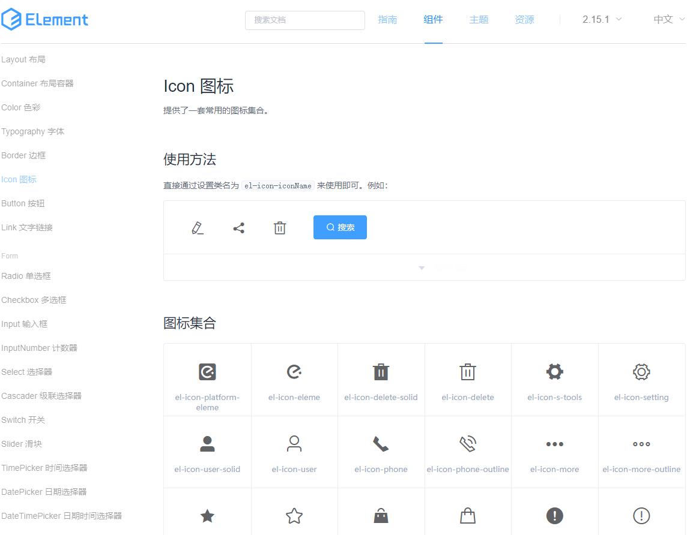

# 从Element-ui源码聊搭建UI库 系列一

## 一、	背景

组件库是组里一直想要搞的玩意，但是迫于业务繁忙，一直往后拖。


如果真的需要做组件库，那么下面的两个问题肯定多少是有答案的。
### 什么是组件库？
组件库其实就是一套详细的设计样式控件库，他把交互规范、视觉规范、前端代码融合到一起。在我们做项目的时候，只要在组件库中找到对应的组件就可以直接使用，非常方便。
### 为什么需要组件库？
1. 组里大大小小的项目有20多个，风格各异，没有统一。每个项目的交互也各不相同。用户们就需要适应20多个项目的交互，但是这样大大降低了用户使用的热情。
2. 开发的时候，产品经理为了节省设计成本，可能会口头说一下需求。没有统一的UI库，我们完成的组件可能没有达到经理的要求，这反而加大了开发成本。

总而言之，磨刀不误砍柴工，`UI` 组件库可以大大加快我们组里的开发效率，因为组里大部分开发使用 `vue`，所以搞一套基于 `vue` 的 `UI` 组件库迫在眉睫。而业界已经有比较成熟的一些 `UI` 库了，比如 `Element`、`AntDesign` 等。但是我们的设计往往喜欢不一样的风格和功能，来凸显我们的专业，所以业界的 `UI` 库不能完全满足。

结合框架 `Vue`，我们选择在 `Element` 基础上进行二次开发。保留其架构、文档、工程化和基础组件，对其中组件进行删减和增加。但造轮子绝非易事，首先需要先去下载源码，了解它整个工程化、官网构建、组件库、测试和组件类型声明等。本文通过分析 `Element` 完整的项目架构，为搭建我们组里的组件库做一些准备工作。

在阅读源码之前，我们再回顾一下使用官网组件翻阅烂了的 `Element` 的设计原则：
- 一致性
> - 与现实生活一致：与现实生活的流程、逻辑保持一致，遵循用户习惯的语言和概念；
> - 在界面中一致：所有的元素和结构需保持一致，比如：设计样式、图标和文本、元素的位置等。

- 反馈 
> - 控制反馈：通过界面样式和交互动效让用户可以清晰的感知自己的操作；
> - 页面反馈：操作后，通过页面元素的变化清晰地展现当前状态。

- 效率
> - 简化流程：设计简洁直观的操作流程；
> - 清晰明确：语言表达清晰且表意明确，让用户快速理解进而作出决策；
> - 帮助用户识别：界面简单直白，让用户快速识别而非回忆，减少用户记忆负担。

- 可控
> - 用户决策：根据场景可给予用户操作建议或安全提示，但不能代替用户进行决策；
> - 结果可控：用户可以自由的进行操作，包括撤销、回退和终止当前操作等。

这些原则都是老生常谈了，也是最重要的。`Element` 组件的设计和我们以后自己造的轮子切记也要遵循这些原则。
## 二、	目录结构
从[Element仓库](https://github.com/ElemeFE/element)下载源码（我下的是 `master` 分支），首先我们来看下未打包目录：


再来看下我们项目中用到的打包后的目录：


 
乍一看，区别挺大的。那么，每个文件的作用是什么呢？
1.	build：webpack相关的打包配置文件
2.	examples：官网的那些组件demo，构成官网的项目架构
3.	packages：每个组件源码
4.	src：公共方法和入口文件
5.	test：测试文件, 使用 karma 框架
6.	types：类型声明文件, 每个组件的类型声明文件，TS 项目使用组件库时有更好的代码提示
7.	.babelrc：babel的配置文件
8.	.eslintignore：忽略eslint的配置文件
9.	.eslintrc：eslint配置文件
10.	.gitattributes：允许我们指定由git使用的文件和路径的属性
11.	.gitignore：忽略git的配置文件
12.	.npmignore：上传npm的配置文件
13.	.travis.yml：持续集成ci的配置文件
14.	CHANGELOG：更新日志，提供了四种语言
15.	components.json：表明了组件的文件路径，方便webpack打包时获取组件的文件路径
16.	FAQ.md：常见的组件库问题
17.	LICENSE：mit协议
18.	Makefile：是一个适用于c/c++的工具，make环境下，输入make命令将会执行makefile文件中的某个目标命令
19.	package-lock.json：锁定安装时的包的版本号
20.	package.json：安装信息

在打包编译后，很多文件都消失殆尽，不仅缩小了组件库的体积，而且满足了我们对项目体积的需求。

比如少了构成官网的 `examples` 文件目录、做单元测试的 `test` 文件目录等，多了核心库 `lib` 文件目录等。
## 三、	packages目录分析
从上面我们知道了 `packages` 是 `UI` 库中的组件源码所在的目录，所有组件都放于其中。其中分为组件目录和 `theme-chalk` 主题样式目录。

组件目录通常由 `index.js` 和 `src` 组成，`src` 下的 `vue` 文件是生成组件的逻辑代码，`index.js` 文件是组件的注册和导出。如果有 `README.md` 文件，一般就是该组件的解释说明。

`theme-chalk` 主题样式目录包含了所有组件的样式，用 `sass` 编写的。其中 `src\common` 目录下的 `var.scss` 文件包含了所有颜色、边框以及单个组件抽取出来的的样式变量。比如我想修改 `dialog` 的样式，我可以在 `dialog.scss` 中对其修改调整，如果要修改涉及到全局变量，那么就在 `var.scss` 中定义。

比如输入框 `input` 组件：
`element-master\packages\input\index.js`
注册 `input`
```js
import ElInput from './src/input';

/* istanbul ignore next */
ElInput.install = function(Vue) {
  Vue.component(ElInput.name, ElInput);
};

export default ElInput;
```
`element-master\packages\input\src\input.vue`
实现 `input` 的 `vue` 组件：
```vue
<template>
  <div :class="[
    type === 'textarea' ? 'el-textarea' : 'el-input',
    inputSize ? 'el-input--' + inputSize : '',
    {
      'is-disabled': inputDisabled,
      'is-exceed': inputExceed,
      'el-input-group': $slots.prepend || $slots.append,
      'el-input-group--append': $slots.append,
      'el-input-group--prepend': $slots.prepend,
      'el-input--prefix': $slots.prefix || prefixIcon,
      'el-input--suffix': $slots.suffix || suffixIcon || clearable || showPassword
    }
    ]"
    @mouseenter="hovering = true"
    @mouseleave="hovering = false"
  >
  ……此处省略input相关html
    <span v-if="isWordLimitVisible && type === 'textarea'" class="el-input__count">{{ textLength }}/{{ upperLimit }}</span>
  </div>
</template>
<script>
  export default {
    name: 'ElInput',

    componentName: 'ElInput',
    ……此处省略input相关逻辑
  
  };
</script>
```
`element-master\packages\theme-chalk\src\input.scss`
输入框的样式，如果我们是基于其二次开发，改动最多的就是样式了：
```js
@import "mixins/mixins";
@import "common/var";

@include b(textarea) {
 ……此处省略多行文本输入框的样式
}

@include b(input) {
  ……此处省略input的样式
}

@include b(input-group) {
  ……此处省略输入框组的样式
}

/** disalbe default clear on IE */
.el-input__inner::-ms-clear {
  display: none;
  width: 0;
  height: 0;
}
```

## 四、	package.json
`package.json` 是项目的解释性文档（项目清单）。属性描述如下：
1.	name：项目名称，不能重复
2.	version：版本号
3.	description：项目描述
4.	main：项目主要入口点
5.	files：被项目包含的文件名数组（除非是被规则忽略的文件）
6.	scripts：项目脚本命令
7.	repository：指明代码仓库
8.	homepage：项目主页url
9.	keywords：项目关键词，有助于其他人发现包
10.	license：指定license来让用户知道他们的使用权力和任务限制
11.	bugs：项目的issue地址
12.	dependencies：指定了生产环境的依赖的包名和其版本范围的映射，不要将测试或过渡性的依赖放入其中
13.	peerDependencies：当主机无法导入依赖包时，指明哪些库与这个依赖包兼容
14.	devDependencies：指定了开发环境的依赖的包名和其版本范围的映射
## 五、	scripts脚本命令解析
其中最重要的 `scripts` 对象的中脚本命令需要一一描述：
### bootstrap
`"bootstrap": "yarn || npm i"`：安装依赖
### build:file
`"build:file": "node build/bin/iconInit.js & node build/bin/build-entry.js & node build/bin/i18n.js & node build/bin/version.js"`

这个命令自动构建一些文件，让我们拆开来一一剖析：
#### node build/bin/iconInit.js
将 `icon.scss` 文件中的 `icon` 抽离出来放入 `icon.json` 文件
```js
var fontFile = fs.readFileSync(path.resolve(__dirname, '../../packages/theme-chalk/src/icon.scss'), 'utf8');
var nodes = postcss.parse(fontFile).nodes;
var classList = [];

nodes.forEach((node) => {
  var selector = node.selector || '';
  var reg = new RegExp(/\.el-icon-([^:]+):before/);
  var arr = selector.match(reg);

  if (arr && arr[1]) {
    classList.push(arr[1]);
  }
});

classList.reverse(); // 希望按 css 文件顺序倒序排列

fs.writeFile(path.resolve(__dirname, '../../examples/icon.json'), JSON.stringify(classList), () => {});
```
如将 `platform=eleme` 放入 `icon.json` 的数组中：

`element-master\packages\theme-chalk\src\header.scss`
```css
.el-icon-platform-eleme:before {
  content: "\e7ca";
}
```
`element-master\examples\icon.json`
```js
"platform-eleme"
```
生成 `icon.json` 文件，在 `entry.js` 中引入，并且绑定在 `vue` 原型上
```js
import icon from './icon.json';
Vue.prototype.$icon = icon; // Icon 列表页用
```
应用在文档中`element-master\examples\docs\zh-CN\icon.md`：


通过之后说到的 `md-loader` 解析成 `vue` 组件，渲染在官网上。


#### node build/bin/build-entry.js
执行后自动生成`element-master\src\index.js`，也就是项目的入口文件，用 `json-templater` 结合变量生成模板，避免每次新增组件时手动在 `src\index.js` 中引入并导出组件。如何自动新增组件后文也会提及。

来看下具体实现：
```js
// 导入组件列表
var Components = require('../../components.json');
var fs = require('fs');
// 替换方法
var render = require('json-templater/string');
// 将破折号/点/下划线/空格分隔的字符串转换为UpperCamelCase:foo-bar → FooBar
var uppercamelcase = require('uppercamelcase');
var path = require('path');
// 行尾
var endOfLine = require('os').EOL;
// 输出文件路径
var OUTPUT_PATH = path.join(__dirname, '../../src/index.js');
// 导入模板
var IMPORT_TEMPLATE = 'import {{name}} from \'../packages/{{package}}/index.js\';';
// 安装组件模板
var INSTALL_COMPONENT_TEMPLATE = '  {{name}}';
// 主模板 过渡动画CollapseTransition纯js，特殊，不注册在packages目录下
var MAIN_TEMPLATE = `/* Automatically generated by './build/bin/build-entry.js' */

{{include}}
import locale from 'element-ui/src/locale';
import CollapseTransition from 'element-ui/src/transitions/collapse-transition';

const components = [
{{install}},
  CollapseTransition
];

const install = function(Vue, opts = {}) {
  locale.use(opts.locale);
  locale.i18n(opts.i18n);

  components.forEach(component => {
    Vue.component(component.name, component);
  });

  Vue.use(InfiniteScroll);
  Vue.use(Loading.directive);

  Vue.prototype.$ELEMENT = {
    size: opts.size || '',
    zIndex: opts.zIndex || 2000
  };

  Vue.prototype.$loading = Loading.service;
  Vue.prototype.$msgbox = MessageBox;
  Vue.prototype.$alert = MessageBox.alert;
  Vue.prototype.$confirm = MessageBox.confirm;
  Vue.prototype.$prompt = MessageBox.prompt;
  Vue.prototype.$notify = Notification;
  Vue.prototype.$message = Message;

};

/* istanbul ignore if */
if (typeof window !== 'undefined' && window.Vue) {
  install(window.Vue);
}

export default {
  version: '{{version}}',
  locale: locale.use,
  i18n: locale.i18n,
  install,
  CollapseTransition,
  Loading,
{{list}}
};
`;

delete Components.font;
// 获取组件的所有键放入数组中
var ComponentNames = Object.keys(Components);
// 包含组件模板
var includeComponentTemplate = [];
// 安装模板
var installTemplate = [];
// 列表模板
var listTemplate = [];

ComponentNames.forEach(name => {
  var componentName = uppercamelcase(name);

  includeComponentTemplate.push(render(IMPORT_TEMPLATE, {
    name: componentName,
    package: name
  }));
  // 输出如下
  //  "import Popconfirm from '../packages/popconfirm/index.js';"
  if (['Loading', 'MessageBox', 'Notification', 'Message', 'InfiniteScroll'].indexOf(componentName) === -1) {
    installTemplate.push(render(INSTALL_COMPONENT_TEMPLATE, {
      name: componentName,
      component: name
    }));
  }
  // 输出如下
  // '  Pagination',     '  Dialog',   
  if (componentName !== 'Loading') listTemplate.push(`  ${componentName}`);
  // 输出如下
  // '  Pagination',     '  Dialog',   
});
// 替换主模板中的变量 include、install、version、list
var template = render(MAIN_TEMPLATE, {
  include: includeComponentTemplate.join(endOfLine),
  install: installTemplate.join(',' + endOfLine),
  version: process.env.VERSION || require('../../package.json').version,
  list: listTemplate.join(',' + endOfLine)
});

fs.writeFileSync(OUTPUT_PATH, template);
console.log('[build entry] DONE:', OUTPUT_PATH);
```
#### node build/bin/i18n.js
根据模板创建各个语言下的组件，只需要维护 `page.json` 文件，执行命令自动生成官网上的语言组件


来看下具体实现：
```js
'use strict';

var fs = require('fs');
var path = require('path');
// 从examples/i18n/page.json获取国际化的配置
var langConfig = require('../../examples/i18n/page.json');
// 遍历配置
langConfig.forEach(lang => {
  // 创建 zh-CN 等在内的文件夹
  try {
    fs.statSync(path.resolve(__dirname, `../../examples/pages/${ lang.lang }`));
  } catch (e) {
    fs.mkdirSync(path.resolve(__dirname, `../../examples/pages/${ lang.lang }`));
  }

  Object.keys(lang.pages).forEach(page => {
    // 按照键创建模板下面的tpl
    var templatePath = path.resolve(__dirname, `../../examples/pages/template/${ page }.tpl`);
    // 按照键创建对应语言文件夹下的vue文件
    var outputPath = path.resolve(__dirname, `../../examples/pages/${ lang.lang }/${ page }.vue`);
    var content = fs.readFileSync(templatePath, 'utf8');
    var pairs = lang.pages[page];
    // 通过tpl模板获取内容
    Object.keys(pairs).forEach(key => {
      content = content.replace(new RegExp(`<%=\\s*${ key }\\s*>`, 'g'), pairs[key]);
    });
    // 往各个语言文件夹下的vue文件写入内容
    fs.writeFileSync(outputPath, content);
  });
});
```
#### node build/bin/version.js
根据 `/package.json` 文件，自动生成 `/examples/version.json`，用于记录组件库的版本信息，这些版本会渲染在官网组件页面的头部导航栏。


来看下具体实现：
```js
var fs = require('fs');
var path = require('path');
var version = process.env.VERSION || require('../../package.json').version;
var content = {
    '1.4.13': '1.4',
    '2.0.11': '2.0',
    '2.1.0': '2.1',
    '2.2.2': '2.2',
    '2.3.9': '2.3',
    '2.4.11': '2.4',
    '2.5.4': '2.5',
    '2.6.3': '2.6',
    '2.7.2': '2.7',
    '2.8.2': '2.8',
    '2.9.2': '2.9',
    '2.10.1': '2.10',
    '2.11.1': '2.11',
    '2.12.0': '2.12'
};
if (!content[version]) content[version] = '2.13';
// 往examples/versions.json写入所有版本
fs.writeFileSync(path.resolve(__dirname, '../../examples/versions.json'), JSON.stringify(content));
```
`examples\components\header.vue`
```vue
   created() {
      const xhr = new XMLHttpRequest();
      xhr.onreadystatechange = _ => {
        if (xhr.readyState === 4 && xhr.status === 200) {
          const versions = JSON.parse(xhr.responseText);
          this.versions = Object.keys(versions).reduce((prev, next) => {
            prev[next] = versions[next];
            return prev;
          }, {});
        }
      };
      xhr.open('GET', '/versions.json');
      xhr.send();
      let primaryLast = '#409EFF';
      bus.$on(ACTION_USER_CONFIG_UPDATE, (val) => {
        let primaryColor = val.global['$--color-primary'];
        if (!primaryColor) primaryColor = '#409EFF';
        const base64svg = 'data:image/svg+xml;base64,';
        const imgSet = document.querySelectorAll('h1 img');
        imgSet.forEach((img) => {
          img.src = `${base64svg}${window.btoa(window.atob(img.src.replace(base64svg, '')).replace(primaryLast, primaryColor))}`;
        });
        primaryLast = primaryColor;
      });
    }
```
至于其中的逻辑之后我们细讲。

## 小结
系列一主要分析了做组件库的初衷和阅读 `Element` 源码的目的。大致介绍源码中的目录结构，细讲了 `packages` 目录和 `package.json`，最后解析 `script` 脚本命令中的前两者`bootstrap` 和 `build:file` 命令。后面的命令系列二慢慢剖析。

最后，希望大家一定要点赞三连。

可以阅读我的其他文章，见[blog地址](https://github.com/qiufeihong2018/vuepress-blog)


一个学习编程技术的公众号。每天推送高质量的优秀博文、开源项目、实用工具、面试技巧、编程学习资源等等。目标是做到个人技术与公众号一起成长。欢迎大家关注，一起进步，走向全栈大佬的修炼之路

<style scoped>
    p:nth-last-child(2) {
        text-align: center
    }
</style>