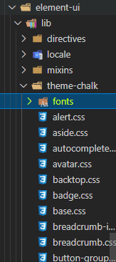
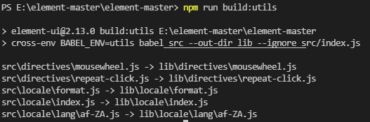
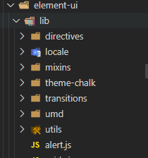

# 从Element-ui源码聊搭建UI库 系列二
这一篇是承接上一篇[《从Element-ui源码聊搭建UI库 系列一》](ui1.md)，

上一篇主要分析了做组件库和阅读 `Element` 源码的目的。大致介绍源码中的目录结构，细讲了 `packages` 目录和 `package.json`，最后解析 `script` 脚本命令中的前两者`bootstrap` 和 `build:file` 命令。这一篇
从 `scripts` 脚本命令解析继续分析其余命令。

## 五、	scripts脚本命令解析
### build:theme
`"build:theme": "node build/bin/gen-cssfile && gulp build --gulpfile packages/theme-chalk/gulpfile.js && cp-cli packages/theme-chalk/lib lib/theme-chalk"`

主要是处理样式相关的脚本。拆开来分析下：
#### node build/bin/gen-cssfile
执行该文件通过组件列表生成对应的 `css` 文件和 `theme-chalk/index.scss` 文件，并将所有组件的样式都导入。以后每次新增一个组件不用手动导入，执行命令自动导入。

比如创建了新组件 `aaa`，执行命令后生成 `aaa.scss`，并且 `index.scss` 多了 `aaa`。

来看下具体实现：
```js
var fs = require('fs');
var path = require('path');
var Components = require('../../components.json');
var themes = [
  'theme-chalk'
];
Components = Object.keys(Components);
var basepath = path.resolve(__dirname, '../../packages/');

function fileExists(filePath) {
  try {
    return fs.statSync(filePath).isFile();
  } catch (err) {
    return false;
  }
}

themes.forEach((theme) => {
  var isSCSS = theme !== 'theme-default';
  var indexContent = isSCSS ? '@import "./base.scss";\n' : '@import "./base.css";\n';
  Components.forEach(function(key) {
    // 导入的组件不在packages文件夹下,需要过滤
    // 以下是option-group的代码
//     import ElOptionGroup from '../select/src/option-group';

// /* istanbul ignore next */
// ElOptionGroup.install = function(Vue) {
  //   Vue.component(ElOptionGroup.name, ElOptionGroup);
  // };
  
  // export default ElOptionGroup;
  if (['icon', 'option', 'option-group'].indexOf(key) > -1) return;
  var fileName = key + (isSCSS ? '.scss' : '.css');

  // @import "./popconfirm.scss";
  indexContent += '@import "./' + fileName + '";\n';
  
  // 组装组件css文件路径 E:\element-master\element-master\packages\theme-chalk\src\popconfirm.scss
  var filePath = path.resolve(basepath, theme, 'src', fileName);
  
  // 文件不存在就创建遗漏的css文件
  if (!fileExists(filePath)) {
      fs.writeFileSync(filePath, '', 'utf8');
      console.log(theme, ' 创建遗漏的 ', fileName, ' 文件');
    }
  });
  // 往index.scss中写入导入 如:@import "./base.scss";
  fs.writeFileSync(path.resolve(basepath, theme, 'src', isSCSS ? 'index.scss' : 'index.css'), indexContent);
});
```

#### gulp build --gulpfile packages/theme-chalk/gulpfile.js
把所有的 `scss` 文件通过 `gulp` 编译成 `css`。

打包和压缩的工作平时一般交给 `webpack` 来做，但是基于工作流用 `gulp` 更加快捷和方便。
```js
'use strict';

const {
  series,
  src,
  dest
} = require('gulp');
// 编译gulp工具
const sass = require('gulp-sass');
// 添加厂商前缀
const autoprefixer = require('gulp-autoprefixer');
// 压缩css
const cssmin = require('gulp-cssmin');

// src下面的所有文件编译到lib下
function compile() {
  return src('./src/*.scss')
    .pipe(sass.sync()) //把scss编译成css
    .pipe(autoprefixer({ //基于目标浏览器版本,添加厂商前缀
      browsers: ['ie > 9', 'last 2 versions'],
      cascade: false
    }))
    .pipe(cssmin()) //压缩css
    // dest: 流会将 vinyl File保存到指定目录下
    .pipe(dest('./lib')); //输出到lib下
}
// 读取src下的fonts文件目录输出到lib下
function copyfont() {
  return src('./src/fonts/**')
    .pipe(cssmin())
    .pipe(dest('./lib/fonts'));
}
// series: 接受可变数量的字符串(taskName)和/或函数(fn)，并返回组合任务或函数的一个函数
exports.build = series(compile, copyfont);
```


执行命令输出 `css` 文件，放入 `lib` 目录：


 
为什么需要编译呢？

因为 `element` 在使用时有两种引入方式：

- 全局引用：
```js
import Vue from 'vue';
import ElementUI from 'element-ui';
import 'element-ui/lib/theme-chalk/index.css';
import App from './App.vue';

Vue.use(ElementUI);

new Vue({
  el: '#app',
  render: h => h(App)
});
```
引入了 `lib\theme-chalk\index.css` 文件

- 局部引入：
```js
import Vue from 'vue';
import { Button, Select } from 'element-ui';
import App from './App.vue';

Vue.component(Button.name, Button);
Vue.component(Select.name, Select);
/* 或写为
 * Vue.use(Button)
 * Vue.use(Select)
 */

new Vue({
  el: '#app',
  render: h => h(App)
});
```
不需要引入 `css` 文件，只需引入对应的 `scss` 文件。
这就是为什么需要编译 `scss` 的原因。

#### cp-cli packages/theme-chalk/lib lib/theme-chalk
`cp-cli` 是一个跨平台的 `copy` 工具
将`gulp build --gulpfile .\packages\theme-chalk\gulpfile.js`编译生成的 `css` 目录（`packages/theme-chalk/lib`）复制到 `lib/theme-chalk` 下



方便全局引用，导入 `css`
```js
import 'element-ui/lib/theme-chalk/index.css';
```
### build:utils
`"build:utils": "cross-env BABEL_ENV=utils babel src --out-dir lib --ignore src/index.js"`

将工具函数通过 `babel` 转译后移动到 `lib` 下，方便项目中使用。
 


将 `src` 目录下的内容忽略 `index.js` 通过 `babel` 转译，然后移动到 `lib` 下
 


比如 `mousewheel` 文件

没转译的：


转译后的：


### build:umd
`"build:umd": "node build/bin/build-locale.js"`

执行后生成 `umd` 模块的语言包。

将 `src/locale/lang` 下的语言包都编译到 `lib/umd/locale` 下。
```js
var fs = require('fs');
// 导出文件
var save = require('file-save');
// 解析为绝对路径
var resolve = require('path').resolve;
// 获取扩展名,返回path最后一部分 path.basename('/foo/bar/quux.html', '.html'); // 返回：‘quux’
var basename = require('path').basename;
var localePath = resolve(__dirname, '../../src/locale/lang');
// 读取src/locale/lang下的列表
var fileList = fs.readdirSync(localePath);
// 通过babel转译
var transform = function (filename, name, cb) {
  // https://babel.docschina.org/docs/en/6.26.3/babel-core/
  require('babel-core').transformFile(resolve(localePath, filename), {
    plugins: [
      'add-module-exports',
      ['transform-es2015-modules-umd', {
        loose: true
      }]
    ],
    moduleId: name
  }, cb);
};
fileList
  // 过滤js文件
  .filter(function (file) {
    return /\.js$/.test(file);
  })
  .forEach(function (file) {
    var name = basename(file, '.js');
    // 异步转译文件中的全部内容
    transform(file, name, function (err, result) {
      if (err) {
        console.error(err);
      } else {
        var code = result.code;

        code = code
          .replace('define(\'', 'define(\'element/locale/')
          .replace('global.', 'global.ELEMENT.lang = global.ELEMENT.lang || {}; \n    global.ELEMENT.lang.');
        save(resolve(__dirname, '../../lib/umd/locale', file)).write(code);

        console.log(file);
      }
    });
  });
```

### clean
`"clean": "rimraf lib && rimraf packages/*/lib && rimraf test/**/coverage"`

清除打包好后的文件
### deploy:build
`"deploy:build": "npm run build:file && cross-env NODE_ENV=production webpack --config build/webpack.demo.js && echo element.eleme.io>>examples/element-ui/CNAME"`

`npm run build:file` 前文分析过了，主要构建官网文件。接下来分析新的构建脚本。

生产环境下构建官网。
#### cross-env NODE_ENV=production webpack --config build/webpack.demo.js
生产环境下构建官网。

官网项目的 `webpack` 配置：
```js
// webpack第三方插件
// https://github.com/webpack-contrib

const path = require('path');
const webpack = require('webpack');
// 这个插件将CSS提取到单独的文件中。它为每个包含CSS的JS文件创建一个CSS文件。它支持按需加载CSS和SourceMaps。
const MiniCssExtractPlugin = require('mini-css-extract-plugin');
const CopyWebpackPlugin = require('copy-webpack-plugin');
const HtmlWebpackPlugin = require('html-webpack-plugin');
const ProgressBarPlugin = require('progress-bar-webpack-plugin');
const VueLoaderPlugin = require('vue-loader/lib/plugin');
const OptimizeCSSAssetsPlugin = require('optimize-css-assets-webpack-plugin');
const UglifyJsPlugin = require('uglifyjs-webpack-plugin');

const config = require('./config');

const isProd = process.env.NODE_ENV === 'production';
// "dev:play": "npm run build:file && cross-env NODE_ENV=development PLAY_ENV=true webpack-dev-server --config build/webpack.demo.js",
const isPlay = !!process.env.PLAY_ENV;

const webpackConfig = {
  mode: process.env.NODE_ENV,
  entry: isProd ? {
    docs: './examples/entry.js'
  } : (isPlay ? './examples/play.js' : './examples/entry.js'),
  output: {
    path: path.resolve(process.cwd(), './examples/element-ui/'),
    publicPath: process.env.CI_ENV || '',
    filename: '[name].[hash:7].js',
    chunkFilename: isProd ? '[name].[hash:7].js' : '[name].js'
  },
  resolve: {
    extensions: ['.js', '.vue', '.json'],
    alias: config.alias,
    modules: ['node_modules']
  },
  // 开发服务器
  // webpack-dev-server 可用于快速开发应用程序
  devServer: {
    host: '0.0.0.0',
    port: 8085,
    publicPath: '/',
    hot: true
  },
  performance: {
    hints: false
  },
  stats: {
    children: false
  },
  module: {
    rules: [{
        enforce: 'pre',
        test: /\.(vue|jsx?)$/,
        exclude: /node_modules/,
        loader: 'eslint-loader'
      },
      {
        test: /\.(jsx?|babel|es6)$/,
        include: process.cwd(),
        exclude: config.jsexclude,
        loader: 'babel-loader'
      },
      {
        test: /\.vue$/,
        loader: 'vue-loader',
        options: {
          compilerOptions: {
            preserveWhitespace: false
          }
        }
      },
      {
        test: /\.(scss|css)$/,
        use: [
          isProd ? MiniCssExtractPlugin.loader : 'style-loader',
          'css-loader',
          'sass-loader'
        ]
      },
      // 使用md-loader加载模块
      {
        test: /\.md$/,
        use: [{
            loader: 'vue-loader',
            options: {
              compilerOptions: {
                preserveWhitespace: false
              }
            }
          },
          {
            loader: path.resolve(__dirname, './md-loader/index.js')
          }
        ]
      },
      {
        test: /\.(svg|otf|ttf|woff2?|eot|gif|png|jpe?g)(\?\S*)?$/,
        loader: 'url-loader',
        // todo: 这种写法有待调整
        query: {
          limit: 10000,
          name: path.posix.join('static', '[name].[hash:7].[ext]')
        }
      }
    ]
  },
  plugins: [
    new webpack.HotModuleReplacementPlugin(),
    new HtmlWebpackPlugin({
      template: './examples/index.tpl',
      filename: './index.html',
      favicon: './examples/favicon.ico'
    }),
    new CopyWebpackPlugin([{
      from: 'examples/versions.json'
    }]),
    new ProgressBarPlugin(),
    new VueLoaderPlugin(),
    new webpack.DefinePlugin({
      'process.env.FAAS_ENV': JSON.stringify(process.env.FAAS_ENV)
    }),
    new webpack.LoaderOptionsPlugin({
      vue: {
        compilerOptions: {
          preserveWhitespace: false
        }
      }
    })
  ],
  optimization: {
    minimizer: []
  },
  devtool: '#eval-source-map'
};
// 生产环境更换插件\优化\扩展等
if (isProd) {
  webpackConfig.externals = {
    vue: 'Vue',
    'vue-router': 'VueRouter',
    'highlight.js': 'hljs'
  };
  webpackConfig.plugins.push(
    new MiniCssExtractPlugin({
      filename: '[name].[contenthash:7].css'
    })
  );
  webpackConfig.optimization.minimizer.push(
    new UglifyJsPlugin({
      cache: true,
      parallel: true,
      sourceMap: false
    }),
    new OptimizeCSSAssetsPlugin({})
  );
  // https://webpack.js.org/configuration/optimization/#optimizationsplitchunks
  webpackConfig.optimization.splitChunks = {
    cacheGroups: {
      vendor: {
        test: /\/src\//,
        name: 'element-ui',
        chunks: 'all'
      }
    }
  };
  webpackConfig.devtool = false;
}

module.exports = webpackConfig;
```
### deploy:extension
`"deploy:extension": "cross-env NODE_ENV=production webpack --config build/webpack.extension.js"`

在生产环境下构建主题插件，主题编辑器的 `chorme` 插件项目的 `webpack` 配置，项目在 `extension` 目录下。执行命令后会在 `extension` 目录下生成 `dist` 目录，其中包含了 `chorme` 插件，在浏览器加载已解压的扩展程序就可以使用主题生成插件。
### dev:extension
`"dev:extension": "rimraf examples/extension/dist && cross-env NODE_ENV=development webpack --watch --config build/webpack.extension.js"`

启动主题插件的开发环境，可以进行开发调试。
### dev
`"dev": "npm run bootstrap && npm run build:file && cross-env NODE_ENV=development webpack-dev-server --config build/webpack.demo.js & node build/bin/template.js"`

首先 `npm run bootstrap` 是用来安装依赖的。`npm run build:file` 在前面也有提到，主要用来自动化生成一些文件。主要是 `node build/bin/build-entry.js`，用于生成 `Element` 的入口 `js`：先是读取根目录的 `components.json`，这个 `json` 文件维护着 `Element` 所有的组件路径映射关系，键为组件名，值为组件源码的入口文件；然后遍历键值，将所有组件进行 `import`，对外暴露 `install` 方法，把所有 `import` 的组件通过 `Vue.component(name, component)` 方式注册为全局组件，并且把一些弹窗类的组件挂载到 `Vue` 的原型链上。

在生成了入口文件的 `src/index.js` 之后就会运行 `webpack-dev-server`。

启动组件库本地开发环境。在更改后可以热更新官网。
具体 `webpack` 配置见 `webpack.demo.js`。
### dev:play
`"dev:play": "npm run build:file && cross-env NODE_ENV=development PLAY_ENV=true webpack-dev-server --config build/webpack.demo.js"`

组件测试项目，在 `examples/play/index.vue` 中可以引入组件库任意组件，也可以直接使用 `dev` 启动的项目，在文档中使用组件。

用于查看某个组件的效果。适用于组件按需加载的显示效果。在 `webpack.demo.js` 通过环境变量配置输入。

`element-master\build\webpack.demo.js`
```js
const isPlay = !!process.env.PLAY_ENV;
 
……省略webpack具体配置

 entry: isProd ? {
    docs: './examples/entry.js'
  } : (isPlay ? './examples/play.js' : './examples/entry.js'),
```
`element-master\examples\play.js`
```js
import Vue from 'vue';
import Element from 'main/index.js';
import App from './play/index.vue';
import 'packages/theme-chalk/src/index.scss';

Vue.use(Element);

new Vue({ // eslint-disable-line
  render: h => h(App)
}).$mount('#app');

element-master\examples\play\index.vue
<template>
  <div style="margin: 20px;">
    <el-input v-model="input" placeholder="请输入内容"></el-input>
  </div>
</template>

<script>
  export default {
    data() {
      return {
        input: 'Hello Element UI!'
      };
    }
  };
</script>
```
### dist
`"dist": "npm run clean && npm run build:file && npm run lint && webpack --config build/webpack.conf.js && webpack --config build/webpack.common.js && webpack --config build/webpack.component.js && npm run build:utils && npm run build:umd && npm run build:theme"`

打包组件库

`npm run clean && npm run build:file && npm run lint` 都已经解释过了，分别是清除上一次打包产物、生成入口文件以及 `i18n` 文件和 `eslint` 检测。

#### webpack --config build/webpack.conf.js 
生成 `umd` 格式的 `js` 文件（`index.js`）
```js
const path = require('path');
const ProgressBarPlugin = require('progress-bar-webpack-plugin');
const VueLoaderPlugin = require('vue-loader/lib/plugin');
const TerserPlugin = require('terser-webpack-plugin');

const config = require('./config');
console.log(config)
module.exports = {
  // 模式
  mode: 'production',
  // 入口
  entry: {
    app: ['./src/index.js']
  },
  // 输出
  output: {
    path: path.resolve(process.cwd(), './lib'),
    publicPath: '/dist/',
    // 输出的文件名
    filename: 'index.js',
    // 初始的chunk文件名称
    chunkFilename: '[id].js',
    //  library 暴露为 AMD 模块。 在 AMD 或 CommonJS 的 require 之后可访问（libraryTarget:'umd'）
    libraryTarget: 'umd',
    // 入口的默认导出将分配给 library target：
    // if your entry has a default export of `MyDefaultModule`
    // var MyDefaultModule = _entry_return_.default;
    libraryExport: 'default',
    // 输出一个库，为你的入口做导出。
    library: 'ELEMENT',
    // 会把 AMD 模块命名为 UMD 构建
    umdNamedDefine: true,
    // 为了使 UMD 构建在浏览器和 Node.js 上均可用，应将 output.globalObject 选项设置为 'this'。对于类似 web 的目标，默认为 self。
    globalObject: 'typeof self !== \'undefined\' ? self : this'
  },
  // 解析
  resolve: {
    // 能够使用户在引入模块时不带扩展.尝试按顺序解析这些后缀名。如果有多个文件有相同的名字，但后缀名不同，webpack 会解析列在数组首位的后缀的文件 并跳过其余的后缀。
    extensions: ['.js', '.vue', '.json'],
    // 创建 import 或 require 的别名，来确保模块引入变得更简单。
    alias: config.alias
  },
  // 外部扩展
  externals: {
    vue: config.vue
  },
  // 优化
  optimization: {
    // 允许你通过提供一个或多个定制过的 TerserPlugin 实例， 覆盖默认压缩工具(minimizer)
    minimizer: [
      new TerserPlugin({
        terserOptions: {
          output: {
            comments: false
          }
        }
      })
    ]
  },
  // 性能
  performance: {
    // 不展示警告或错误提示。
    // 官网推荐使用error,有助于防止把体积大的bundle部署到生产环境,从而影响网页的性能
    // 很奇怪这里要把它关闭
    hints: false
  },
  // stats对象
  stats: {
    // 告知 stats 是否添加关于子模块的信息。
    children: false
  },
  // 模块
  module: {
    // 使用babel-loader和vue-loader
    rules: [
      {
        test: /\.(jsx?|babel|es6)$/,
        include: process.cwd(),
        exclude: config.jsexclude,
        loader: 'babel-loader'
      },
      {
        test: /\.vue$/,
        loader: 'vue-loader',
        options: {
          compilerOptions: {
            preserveWhitespace: false
          }
        }
      }
    ]
  },
  // 插件
  plugins: [
    new ProgressBarPlugin(),
    new VueLoaderPlugin()
  ]
};
```

#### webpack --config build/webpack.common.js 
生成 `commonjs` 格式的 `js` 文件（`element-ui.common.js`），`require` 时默认加载的是这个文件。
```js
    libraryTarget: 'commonjs2'
```
与 `webpack.conf.js` 不同在于输出 `output` 的 `libraryExport`。

前者暴露的是 `commonjs2`，后者暴露的是 `umd`。
#### webpack --config build/webpack.component.js
与前两者的 `index.js` 入口不同，以 `components.json` 为入口，将每一个组件打包生成一个文件，用于按需加载。

`npm run build:utils && npm run build:umd && npm run build:theme` 也已经讲过，分别是转译工具方法、转译语言包、生成样式文件。
### lint
`"lint": "eslint src/**/* test/**/* packages/**/* build/**/* --quiet"`

`eslint` 校验 `src` 和 `build` 目录下的文件。
### pub
`"pub": "npm run bootstrap && sh build/git-release.sh && sh build/release.sh && node build/bin/gen-indices.js && sh build/deploy-faas.sh"`

`npm run bootstrap` 下载依赖。

`sh build/git-release.sh`：主要是检测 `dev` 分支是否冲突。
```bash
#!/usr/bin/env sh
# 切换到dev分支
git checkout dev
# 检测本地是否有未提交文件
if test -n "$(git status --porcelain)"; then
# 输出日志
  echo 'Unclean working tree. Commit or stash changes first.' >&2;
  exit 128;
fi
# 检测本地分支是否有误
if ! git fetch --quiet 2>/dev/null; then
  # 输出日志
  echo 'There was a problem fetching your branch. Run `git fetch` to see more...' >&2;
  exit 128;
fi
# 检测是否有最新提交
if test "0" != "$(git rev-list --count --left-only @'{u}'...HEAD)"; then
  # 输出日志
  echo 'Remote history differ. Please pull changes.' >&2;
  exit 128;
fi
# 输出日志
echo 'No conflicts.' >&2;
```
`sh build/release.sh` 
脚本完成了以下工作：
1.	合并 dev 分支到 master
2.	修改样式包和组件库的版本号
3.	发布样式包和组件库
4.	提交 master 和 dev 分支到远程仓库

该脚本在发布组件库时可以使用，特别是其中自动更改版本号的功能（每次 `publish` 时都忘改版本号）。这里提交代码到远程仓库的日志很简单。
```bash
#!/usr/bin/env sh
set -e
# 切换到master
git checkout master
# 合并dev分支
git merge dev
# npx: 使用本地已安装的可执行工具，而不需要配置 scripts
VERSION=`npx select-version-cli`
# 更新版本号
read -p "Releasing $VERSION - are you sure? (y/n)" -n 1 -r
echo    # (optional) move to a new line
if [[ $REPLY =~ ^[Yy]$ ]]
then
  # 输出:压缩版本
  echo "Releasing $VERSION ..."

  # build
  # 编译打包
  VERSION=$VERSION npm run dist

  # ssr test
  node test/ssr/require.test.js            

  # 发布到npm
  # publish theme
  # 输出:压缩theme-chalk版本
  echo "Releasing theme-chalk $VERSION ..."
  cd packages/theme-chalk
  # 更改主题包的版本信息
  npm version $VERSION --message "[release] $VERSION"
  # 如果是beta版本则打个beta标签
  if [[ $VERSION =~ "beta" ]]
  then
    npm publish --tag beta
  else
    npm publish
  fi
  cd ../..

  # commit
  git add -A
  git commit -m "[build] $VERSION"
  # 更改组件库的版本信息
  npm version $VERSION --message "[release] $VERSION"
  # publish
  # 发布到远程仓库
  git push eleme master
  git push eleme refs/tags/v$VERSION
  git checkout dev
  git rebase master
  git push eleme dev
  # 发布组件库
  if [[ $VERSION =~ "beta" ]]
  then
    npm publish --tag beta
  else
    npm publish
  fi
fi
```

`node build/bin/gen-indices.js`
生成目录，支持搜索：
```js
'use strict';
// 生成目录
const fs = require('fs');
const path = require('path');
// 是一个托管的全文、数字和分面搜索引擎，能够从第一次击键交付实时结果。
const algoliasearch = require('algoliasearch');
// 将Unicode str转换为段字符串，确保在URL或文件名中使用它是安全的。
// https://www.npmjs.com/package/transliteration?activeTab=readme
// demo:
// slugify('你好，世界');
// // ni-hao-shi-jie
const slugify = require('transliteration').slugify;
// 密钥
const key = require('./algolia-key');

const client = algoliasearch('4C63BTGP6S', key);
const langs = {
  'zh-CN': 'element-zh',
  'en-US': 'element-en',
  'es': 'element-es',
  'fr-FR': 'element-fr'
};
// 四种语言
['zh-CN', 'en-US', 'es', 'fr-FR'].forEach(lang => {
  const indexName = langs[lang];
  const index = client.initIndex(indexName);
  index.clearIndex(err => {
    if (err) return;
    // 读取/examples/docs/中的文件
    fs.readdir(path.resolve(__dirname, `../../examples/docs/${ lang }`), (err, files) => {
      if (err) return;
      let indices = [];
      files.forEach(file => {
        console.log(file)
        const component = file.replace('.md', '');
        const content = fs.readFileSync(path.resolve(__dirname, `../../examples/docs/${ lang }/${ file }`), 'utf8');
        const matches = content
          .replace(/:::[\s\S]*?:::/g, '')
          .replace(/```[\s\S]*?```/g, '')
          .match(/#{2,4}[^#]*/g)
          .map(match => match.replace(/\n+/g, '\n').split('\n').filter(part => !!part))
          .map(match => {
            const length = match.length;
            if (length > 2) {
              const desc = match.slice(1, length).join('');
              return [match[0], desc];
            }
            return match;
          });

        indices = indices.concat(matches.map(match => {
          const isComponent = match[0].indexOf('###') < 0;
          const title = match[0].replace(/#{2,4}/, '').trim();
          const index = { component, title };
          index.ranking = isComponent ? 2 : 1;
          index.anchor = slugify(title);
          index.content = (match[1] || title).replace(/<[^>]+>/g, '');
          return index;
        }));
      });

      index.addObjects(indices, (err, res) => {
        console.log(err, res);
      });
    });
  });
});
```

### test
`"test": "npm run lint && npm run build:theme && cross-env CI_ENV=/dev/ BABEL_ENV=test karma start test/unit/karma.conf.js --single-run"
"test:watch": "npm run build:theme && cross-env BABEL_ENV=test karma start test/unit/karma.conf.js"`

单元测试：`UI` 组件作为高度抽象的基础公共组件，编写单元测试是很有必要的。


## 小结
系列二结合系列一中 `bootstrap` 和 `build:file` 脚本命令。我们一共学习了 15 中命令，分别是：
- `bootstrap` 安装依赖包
- `build:file` 构建官网所需的文件
- `build:theme` 构建主题样式
- `build:utils` 用 `babel` 编译工具函数库
- `build:umd` 编译生成 `umd` 模块的语言包
- `clean` 清理打包后的文件
- `deploy:build` 生产环境下构建官网
- `deploy:extension` 在生产环境下构建主题插件
- `dev:extension` 启动主题插件的开发环境，可以进行开发调试
- `dev` 启动本地开发环境，进行能够调试开发
- `dev:play` 用于查看某个组件的效果
- `dist` 打包组件库
- `lint` 校验文件
- `pub` 检测分支是否冲突
- `test` 测试项目

我们不仅知道了每条命令目的，还逐行解析了命令所对应的构建脚本，这对于我们对项目工程化、模块化很有帮助。所以我们还要继续对源码进行学习和推敲。

最后，希望大家一定要点赞三连。

可以阅读我的其他文章，见[blog地址](https://github.com/qiufeihong2018/vuepress-blog)


一个学习编程技术的公众号。每天推送高质量的优秀博文、开源项目、实用工具、面试技巧、编程学习资源等等。目标是做到个人技术与公众号一起成长。欢迎大家关注，一起进步，走向全栈大佬的修炼之路

<style scoped>
    p:nth-last-child(2) {
        text-align: center
    }
</style>