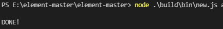

# 从Element-ui源码聊搭建UI库 系列三
这一篇是承接上一篇[《从Element-ui源码聊搭建UI库 系列二》](ui2.md)，

上一篇主要解析 `script` 脚本所有的命令。这一篇
继续分析 `makefile` 和其他脚本命令。


## 六、	makefile
> `makefile` 带来的好处就是——**“自动化编译”**。一旦写好，只需要一个 `make` 命令，整个工程完全自动编译，极大的提高了软件开发的效率。`make` 是一个命令工具，是一个解释 `makefile` 中指令的命令工具，一般来说，大多数的 `IDE` 都有这个命令，比如：`Delphi` 的 `make`，`Visual C++` 的 `nmake`，`Linux` 下 `GNU` 的 `make`。可见，`makefile` 都成为了一种在工程方面的编译方法。

`make xxx` 其实执行的还是对应的 `npm xxxx`，比如执行 `make dev` 实际上就是执行 `npm run dev`，更加的快捷。
```bash
# Makefile中，.PHONY后面的target表示的也是一个伪造的target, 而不是真实存在的文件target，注意Makefile的target默认是文件。
.PHONY: dist test
# 执行make默认指向help
default: help
# 构建主题
# build all theme
build-theme:
    npm run build:theme
# 安装依赖
install:
    npm install
# 使用淘宝源安装依赖
install-cn:
    npm install --registry=http://registry.npm.taobao.org
# 构建应用
dev:
    npm run dev

play:
    npm run dev:play
# 新增组件
new:
    node build/bin/new.js $(filter-out $@,$(MAKECMDGOALS))
# 为网站添加新语言
new-lang:
    node build/bin/new-lang.js $(filter-out $@,$(MAKECMDGOALS))
# 打包
dist: install
    npm run dist
# 部署
deploy:
    @npm run deploy
# 发布
pub:
    npm run pub
# 单元测试
test:
    npm run test:watch
# 帮助信息
help:
    @echo "   \033[35mmake\033[0m \033[1m命令使用说明\033[0m"
    @echo "   \033[35mmake install\033[0m\t\033[0m\t\033[0m\t\033[0m\t---  安装依赖"
    @echo "   \033[35mmake new <component-name> [中文名]\033[0m\t---  创建新组件 package. 例如 'make new button 按钮'"
    @echo "   \033[35mmake dev\033[0m\t\033[0m\t\033[0m\t\033[0m\t---  开发模式"
    @echo "   \033[35mmake dist\033[0m\t\033[0m\t\033[0m\t\033[0m\t---  编译项目，生成目标文件"
    @echo "   \033[35mmake deploy\033[0m\t\033[0m\t\033[0m\t\033[0m\t---  部署 demo"
    @echo "   \033[35mmake pub\033[0m\t\033[0m\t\033[0m\t\033[0m\t---  发布到 npm 上"
    @echo "   \033[35mmake new-lang <lang>\033[0m\t\033[0m\t\033[0m\t---  为网站添加新语言. 例如 'make new-lang fr'"
```
除了 `make new` 和 `make new-lang` 两个命令外，其他脚本命令都已经分析过了。
### make new
`node build/bin/new.js $(filter-out $@,$(MAKECMDGOALS))`

执行该命令可以新增组件。

可以执行 `node .\build\bin\new.js aaa` 来生成 `aaa` 组件，方便快捷多了。

添加新组件 `aaa`，优势出来了：

1.	在/packages目录下新建组件目录，并完成目录结构的构建/packages/aaa
2.	创建组件文档，/examples/docs/{lang}/aaa.md
3.	创建组件单元测试文件，/test/unit/specs/aaa.spec.js
4.	创建组件样式文件，/packages/theme-chalk/src/aaa.scss
5.	创建组件类型声明文件，/types/aaa.d.ts
6.	配置: 在 /components.json 文件中配置组件信息, 在 /examples/nav.config.json 中添加该组件的路由配置,  在 /packages/theme-chalk/src/index.scss 文件中自动引入该组件的样式文件, 将类型声明文件在 /types/element-ui.d.ts 中自动引入
 
生成组件 `aaa` 如下：



那怎么实现的呢？

来看下具体实现：
```js
'use strict';


console.log();
process.on('exit', () => {
  console.log();
});
// 非填抛出异常
if (!process.argv[2]) {
  console.error('[组件名]必填 - Please enter new component name');
  // 程序退出
  process.exit(1);
}

const path = require('path');
const fs = require('fs');
// 写文件
const fileSave = require('file-save');
// 首字母大写
const uppercamelcase = require('uppercamelcase');
// 组件英文名
const componentname = process.argv[2];
// 组件中文名
const chineseName = process.argv[3] || componentname;
const ComponentName = uppercamelcase(componentname);
console.log(ComponentName)
const PackagePath = path.resolve(__dirname, '../../packages', componentname);
const Files = [
  // 在src/main中写入index.js,注册组件
  {
    filename: 'index.js',
    content: `import ${ComponentName} from './src/main';
    
    /* istanbul ignore next */
    ${ComponentName}.install = function(Vue) {
      Vue.component(${ComponentName}.name, ${ComponentName});
    };
    
    export default ${ComponentName};`
  },
  // 在packages中xxx组件的src/main下新建模板
  {
    filename: 'src/main.vue',
    content: `<template>
    <div class="el-${componentname}"></div>
</template>

<script>
export default {
  name: 'El${ComponentName}'
};
</script>`
  },
  // 四种语言的文档
  {
    filename: path.join('../../examples/docs/zh-CN', `${componentname}.md`),
    content: `## ${ComponentName} ${chineseName}`
  },
  {
    filename: path.join('../../examples/docs/en-US', `${componentname}.md`),
    content: `## ${ComponentName}`
  },
  {
    filename: path.join('../../examples/docs/es', `${componentname}.md`),
    content: `## ${ComponentName}`
  },
  {
    filename: path.join('../../examples/docs/fr-FR', `${componentname}.md`),
    content: `## ${ComponentName}`
  },
  // 在test下新建组件的单元测试
  {
    filename: path.join('../../test/unit/specs', `${componentname}.spec.js`),
    content: `import { createTest, destroyVM } from '../util';
import ${ComponentName} from 'packages/${componentname}';

describe('${ComponentName}', () => {
  let vm;
  afterEach(() => {
    destroyVM(vm);
  });

  it('create', () => {
    vm = createTest(${ComponentName}, true);
    expect(vm.$el).to.exist;
  });
});
`
  },
  // 新建组件的主题样式
  {
    filename: path.join('../../packages/theme-chalk/src', `${componentname}.scss`),
    content: `@import "mixins/mixins";
@import "common/var";

@include b(${componentname}) {
}`
  },
  // 新建组件的类型声明
  {
    filename: path.join('../../types', `${componentname}.d.ts`),
    content: `import { ElementUIComponent } from './component'

/** ${ComponentName} Component */
export declare class El${ComponentName} extends ElementUIComponent {
}`
  }
];

// 添加到 components.json
const componentsFile = require('../../components.json');
if (componentsFile[componentname]) {
  console.error(`${componentname} 已存在.`);
  process.exit(1);
}
componentsFile[componentname] = `./packages/${componentname}/index.js`;
fileSave(path.join(__dirname, '../../components.json'))
  .write(JSON.stringify(componentsFile, null, '  '), 'utf8')
  .end('\n');

// 添加到 index.scss
const sassPath = path.join(__dirname, '../../packages/theme-chalk/src/index.scss');
const sassImportText = `${fs.readFileSync(sassPath)}@import "./${componentname}.scss";`;
fileSave(sassPath)
  .write(sassImportText, 'utf8')
  .end('\n');

// 添加到 element-ui.d.ts
const elementTsPath = path.join(__dirname, '../../types/element-ui.d.ts');

let elementTsText = `${fs.readFileSync(elementTsPath)}
/** ${ComponentName} Component */
export class ${ComponentName} extends El${ComponentName} {}`;

const index = elementTsText.indexOf('export') - 1;
const importString = `import { El${ComponentName} } from './${componentname}'`;

elementTsText = elementTsText.slice(0, index) + importString + '\n' + elementTsText.slice(index);

fileSave(elementTsPath)
  .write(elementTsText, 'utf8')
  .end('\n');

// 创建 package
Files.forEach(file => {
  fileSave(path.join(PackagePath, file.filename))
    .write(file.content, 'utf8')
    .end('\n');
});

// 添加到 nav.config.json
const navConfigFile = require('../../examples/nav.config.json');

Object.keys(navConfigFile).forEach(lang => {
  let groups = navConfigFile[lang][4].groups;
  groups[groups.length - 1].list.push({
    path: `/${componentname}`,
    title: lang === 'zh-CN' && componentname !== chineseName ?
      `${ComponentName} ${chineseName}` : ComponentName
  });
});

fileSave(path.join(__dirname, '../../examples/nav.config.json'))
  .write(JSON.stringify(navConfigFile, null, '  '), 'utf8')
  .end('\n');

console.log('DONE!');
```

### make new-lang
`node build/bin/new-lang.js $(filter-out $@,$(MAKECMDGOALS))`

执行该命令后添加新语言
```js
'use strict';

console.log();
process.on('exit', () => {
  console.log();
});

if (!process.argv[2]) {
  console.error('[language] is required!');
  process.exit(1);
}

var fs = require('fs');
const path = require('path');
const fileSave = require('file-save');
const lang = process.argv[2];
// const configPath = path.resolve(__dirname, '../../examples/i18n', lang);

// 添加到 components.json
const componentFile = require('../../examples/i18n/component.json');
if (componentFile.some(item => item.lang === lang)) {
  console.error(`${lang} already exists.`);
  process.exit(1);
}
let componentNew = Object.assign({}, componentFile.filter(item => item.lang === 'en-US')[0], { lang });
componentFile.push(componentNew);
fileSave(path.join(__dirname, '../../examples/i18n/component.json'))
  .write(JSON.stringify(componentFile, null, '  '), 'utf8')
  .end('\n');

// 添加到 page.json
const pageFile = require('../../examples/i18n/page.json');
let pageNew = Object.assign({}, pageFile.filter(item => item.lang === 'en-US')[0], { lang });
pageFile.push(pageNew);
fileSave(path.join(__dirname, '../../examples/i18n/page.json'))
  .write(JSON.stringify(pageFile, null, '  '), 'utf8')
  .end('\n');

// 添加到 route.json
const routeFile = require('../../examples/i18n/route.json');
routeFile.push({ lang });
fileSave(path.join(__dirname, '../../examples/i18n/route.json'))
  .write(JSON.stringify(routeFile, null, '  '), 'utf8')
  .end('\n');

// 添加到 nav.config.json
const navFile = require('../../examples/nav.config.json');
navFile[lang] = navFile['en-US'];
fileSave(path.join(__dirname, '../../examples/nav.config.json'))
  .write(JSON.stringify(navFile, null, '  '), 'utf8')
  .end('\n');

// docs 下新建对应文件夹
try {
  fs.statSync(path.resolve(__dirname, `../../examples/docs/${ lang }`));
} catch (e) {
  fs.mkdirSync(path.resolve(__dirname, `../../examples/docs/${ lang }`));
}

console.log('DONE!');
```

## 七、	其他工程化脚本
### md-loader
除了 `md-loader`，`build` 下面的脚本基本上是分析了一遍。

说到 `md-loader`，官网的文档展示和 `demo` 展示多亏了他。

它是一个 `loader`，官网组件页面的组件 `demo` 加文档的模式一大半的功劳都是源自于它。

可以在 `/examples/route.config.js` 中看到 `registerRoute` 方法生成组件页面的路由配置时，使用 `loadDocs` 方法加载 `/examples/docs/{lang}/comp.md`。

注意，这里加载的 `markdown` 文档，而不是平时常见的 `vue` 文件，但是却能像 `vue` 文件一样在页面上渲染成一个 `Vue` 组件，这是怎么做到的呢？

我们知道，`webpack` 的理念是一切资源都可以 `require`，只需配置相应的 `loader` 即可。在 `/build/webpack.demo.js` 文件中的 `module.rules` 下可以看到对 `markdown` 规则的处理，先通过 `md-loader` 处理 `markdown` 文件，从中解析出 `vue` 代码，然后交给 `vue-loader`，最终生成 `vue` 单文件组件渲染到页面。这就能看到组件页面的文档和组件 `demo` 展示效果。

`/build/webpack.demo.js`：
```js
      {
        test: /\.md$/,
        use: [
          {
            loader: 'vue-loader',
            options: {
              compilerOptions: {
                preserveWhitespace: false
              }
            }
          },
          {
            loader: path.resolve(__dirname, './md-loader/index.js')
          }
        ]
      }, 
```
至于如何将 `markdown` 解析成 `vue` 组件，可以阅读下 `Element` 团队的 [《谈谈 Element 文档中的 Markdown 解析》](https://zhuanlan.zhihu.com/p/65174076) 。
### config.js
`webpack` 的公共配置，比如 `externals、alias` 等。通过 `externals` 的配置解决了组件库部分代码的冗余问题，比如组件和组件库公共模块的代码，但是组件样式冗余问题没有得到解决；`alias` 别名配置为开发组件库提供了方便。
```js
// webpack 公共配置，比如 externals、alias
var path = require('path');
var fs = require('fs');
var nodeExternals = require('webpack-node-externals');
var Components = require('../components.json');

Object.keys(Components).forEach(function (key) {
  externals[`element-ui/packages/${key}`] = `element-ui/lib/${key}`;
});
// externals 解决组件依赖其它组件并按需引入时代码冗余的问题
// 比如 Table 组件依赖 Checkbox 组件，在项目中如果我同时引入 Table 和 Checkbox 时，会不会产生冗余代码
// 如果没有以下内容的的话，会，这时候你会看到有两份 Checkbox 组件代码。
// 包括 locale、utils、mixins、transitions 这些公共内容，也会出现冗余代码
// 但有了 externals 的设置，就会将告诉 webpack 不需要将这些 import 的包打包到 bundle 中，运行时再从外部去
// 获取这些扩展依赖。这样就可以在打包后 /lib/tables.js 中看到编译后的 table.js 对 Checkbox 组件的依赖引入：
// module.exports = require("element-ui/lib/checkbox")
// 这么处理之后就不会出现冗余的 JS 代码，但是对于 CSS 部分，element-ui 并未处理冗余情况。
// 可以看到 /lib/theme-chalk/table.css 和 /lib/theme-chalk/checkbox.css 中都有 Checkbox 组件的样式

externals['element-ui/src/locale'] = 'element-ui/lib/locale';
utilsList.forEach(function (file) {
  file = path.basename(file, '.js');
  externals[`element-ui/src/utils/${file}`] = `element-ui/lib/utils/${file}`;
});
mixinsList.forEach(function (file) {
  file = path.basename(file, '.js');
  externals[`element-ui/src/mixins/${file}`] = `element-ui/lib/mixins/${file}`;
});
transitionList.forEach(function (file) {
  file = path.basename(file, '.js');
  externals[`element-ui/src/transitions/${file}`] = `element-ui/lib/transitions/${file}`;
});

externals = [Object.assign({
  vue: 'vue'
}, externals), nodeExternals()];

exports.externals = externals;
// 设置别名
exports.alias = {
  main: path.resolve(__dirname, '../src'),
  packages: path.resolve(__dirname, '../packages'),
  examples: path.resolve(__dirname, '../examples'),
  'element-ui': path.resolve(__dirname, '../')
};

exports.vue = {
  root: 'Vue',
  commonjs: 'vue',
  commonjs2: 'vue',
  amd: 'vue'
};

exports.jsexclude = /node_modules|utils\/popper\.js|utils\/date\.js/;
```
## 总结
`Element` 整体架构是真的非常棒，利用脚本实现工程化，值得我们在开发中学习和应用。涉及到添加新组件、添加新语言、构建应用、打包编译应用、发布应用、单元测试等等。比如添加新组件，执行完脚本可以帮助开发者解决创建新组件的目录、四种语言下的文档、配置官网展示文件等。

开发者只需要编写具体组件的逻辑即可，根本不需要每一次新建一个组件改动多个文件，拒绝重复劳动。切记，在项目搭建的过程中，可以使用脚本解决的事情，坚决不要手动解决。

## 链接
[《从Element-ui源码聊搭建UI库 系列一》](ui1.md)

[《从Element-ui源码聊搭建UI库 系列二》](ui2.md)

## 参考文献
[ElementUI的构建流程](https://juejin.cn/post/6844903680357957645#heading-0)

[从 Element UI 源码的构建流程来看前端 UI 库设计](https://juejin.cn/post/6844904197863964685#heading-0)

[如何快速为团队打造自己的组件库（上）—— Element 源码架构](https://juejin.cn/post/6935977815342841892)


最后，希望大家一定要点赞三连。

可以阅读我的其他文章，见[blog地址](https://github.com/qiufeihong2018/vuepress-blog)


<style scoped>
    p:nth-last-child(2) {
        text-align: center
    }
</style>