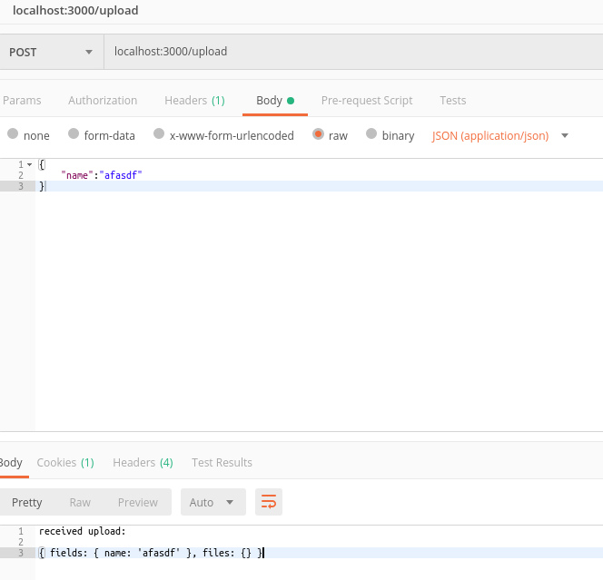

# express从入门到放弃

## Formidable

### 目的

用于解析表单数据，尤其是文件上载的node.js模块。

### 当前状态

需要维修人员：请参阅https://github.com/felixge/node-formable/issues/412
这个模块是为Transloadit开发的，这是一个专注于上传和编码图像和视频的服务。它经过了数百GB的文件上传测试，从各种各样的客户机上传，被认为是生产就绪。

### 特征

- 快速（约500MB/秒），非缓冲多部分分析器
- 自动将文件上载写入磁盘
- 低内存占用
- 优雅的错误处理
- 非常高的测试覆盖率

### 安装
```
npm i -S formidable
```
这是一个低级包，如果您使用的是高级框架，那么它可能已经包含在内了。但是，Expressv4不包括任何多部分处理，body解析器也不包括。
注意：强大需要轻而易举地运行单元测试，但您不需要它来仅仅使用库。

### 例子
分析传入文件上载。

```js
var formidable = require('formidable'),
    http = require('http'),
    util = require('util');
 
http.createServer(function(req, res) {
  if (req.url == '/upload' && req.method.toLowerCase() == 'post') {
    // parse a file upload
    var form = new formidable.IncomingForm();
 
    form.parse(req, function(err, fields, files) {
      res.writeHead(200, {'content-type': 'text/plain'});
      res.write('received upload:\n\n');
      res.end(util.inspect({fields: fields, files: files}));
    });
 
    return;
  }
 
  // show a file upload form
  res.writeHead(200, {'content-type': 'text/html'});
  res.end(
    '<form action="/upload" enctype="multipart/form-data" method="post">'+
    '<input type="text" name="title"><br>'+
    '<input type="file" name="upload" multiple="multiple"><br>'+
    '<input type="submit" value="Upload">'+
    '</form>'
  );
}).listen(8080);
```


### API

#### Formidable.IncomingForm
```js
var form = new formidable.IncomingForm()
```
创建新的传入表单。
```js
form.encoding = 'utf-8';
```
设置传入表单域的编码。
```js
form.uploadDir = "/my/dir";
```
设置用于放置文件上载的目录。稍后可以使用fs.rename（）移动它们。默认值为os.tmpdir（）。
```js
form.keepExtensions = false;
```
如果希望写入Form.UploadDir的文件包含原始文件的扩展名，请将此属性设置为true。
```js
form.type
```
“multipart”或“urlencoded”取决于传入请求。
```js
form.maxFieldsSize = 20 * 1024 * 1024;
```
限制所有字段（文件除外）可以按字节分配的内存量。如果超过此值，将发出“错误”事件。默认大小为20MB。
```js
form.maxFileSize = 200 * 1024 * 1024;
```
限制上载文件的大小。如果超过此值，将发出“错误”事件。默认大小为200MB。
```js
form.maxFields = 1000;
```

限制查询字符串分析器将解码的字段数。默认值为1000（0表示无限制）。

```js
form.hash = false;
```
如果要为传入文件计算校验和，请将其设置为“sha1”或“md5”。


```js
form.multiples = false;
```
如果启用此选项，则在调用form.parse时，“文件”参数将包含用于输入的文件数组，这些输入使用html5 multiple属性提交多个文件。
```js
form.bytesReceived
```
到目前为止为此表单接收的字节数。
```js
form.bytesExpected
```
此表单中的预期字节数。
```js
form.parse(request, [cb]);
```
解析包含表单数据的传入node.js请求。如果提供了cb，则收集所有字段和文件并将其传递给回调：
```js
form.parse(req, function(err, fields, files) {
  // ...
});
 
form.onPart(part);
```
如果您希望直接访问多部分流，则可以覆盖此方法。这样做将禁用否则将发生的任何“字段”/“文件”事件处理，使您完全负责处理该处理。

```js
form.onPart = function(part) {
  part.addListener('data', function() {
    // ...
  });
}
```

如果你想使用强大的只为你处理某些部分，你可以这样做：

```js
form.onPart = function(part) {
  if (!part.filename) {
    // let formidable handle all non-file parts
    form.handlePart(part);
  }
}
```
检查此方法中的代码以获得进一步的启发。

#### Formidable.File
```js
file.size = 0
```
the size of the上传文件的字节。如果上传的文件仍然存在（见“filebegin事件的性质），这是说这么多字节的文件已经老化。

```js
file.path = null
```

正在写入此文件的路径。您可以在“filebegin”事件中对此进行修改，以防不满意可怕的文件生成临时路径的方式。
```js
file.name = null
```
根据上载客户端，此文件的名称。

```js
file.type = null
```
包含此文件上次写入时间的日期对象（或空值）。主要是为了与W3C文件API草稿兼容。
```js
file.hash = null
```
如果设置了哈希计算，则可以从该变量中读取十六进制摘要。


#### Formidable.File#toJSON()
此方法返回文件的JSON表示，允许您使用json.stringify（）文件，该文件可用于记录和响应请求。

### 事件
#### progress

在解析了每个传入数据块之后发出。可用于滚动您自己的进度条。
```js
form.on('progress', function(bytesReceived, bytesExpected) {
});
```
#### field

每当接收到字段/值对时发出。
```js
form.on('field', function(name, value) {
});
```

#### fileBegin
每当在上载流中检测到新文件时发出。如果要在文件系统上缓冲上载时将文件传输到其他地方，请使用此事件。

```js
form.on('fileBegin', function(name, file) {
});
```
#### file
每当接收到field/file对时发出。file是file的实例。

```js
form.on('file', function(name, file) {
});
```

#### error
处理传入表单时出错时发出。遇到错误的请求将自动暂停，如果您希望请求继续触发“数据”事件，则必须手动调用`request.resume（）`。
```js
form.on('error', function(err) {
});
```

#### aborted
在用户中止请求时发出。现在，这可能是由于套接字上的“超时”或“关闭”事件造成的。此事件发出后，将发生错误事件。将来会有一个单独的“超时”事件（需要在节点核心中进行更改）。
```js
form.on('aborted', function() {
});
```

#### end

```js
form.on('end', function() {
});
```
在接收到整个请求并且所有包含的文件都已完成刷新到磁盘时发出。这是一个很好的地方，您可以发送您的回复。


### 解析
其中当服务端全部接收完客户端用post方式提交的表单数据之后，触发执行该回调函数。以post方式提交的表单域数据都放在fields这个对象当中，以post方式上传的文件、图片等文件域数据都放在files这个对象当中。
## [Winston](https://github.com/winstonjs/winston)
记录一切的日志

### 动机
`winston`被设计为一个简单和通用的日志记录库，支持多个传输。传输本质上是日志的存储设备。每个`winston`记录器可以具有在不同级别配置的多个传输

例如，可能希望将错误日志存储在持久远程位置（如数据库）中，但所有日志都输出到控制台或本地文件。

`winston`旨在将部分日志记录过程分离，使其更加灵活和可扩展。注意支持日志格式和级别的灵活性，并确保这些API与传输日志记录的实现分离

### 用法

建议使用的方法`winston`是创建自己的记录器。最简单的方法是使用`winston.createLogger`：

``` js
const winston = require('winston');

const logger = winston.createLogger({
  level: 'info',
  format: winston.format.json(),
  defaultMeta: { service: 'user-service' },
  transports: [
    //
    // - Write to all logs with level `info` and below to `combined.log` 
    // - Write all logs error (and below) to `error.log`.
    //
    new winston.transports.File({ filename: 'error.log', level: 'error' }),
    new winston.transports.File({ filename: 'combined.log' })
  ]
});

//
// If we're not in production then log to the `console` with the format:
// `${info.level}: ${info.message} JSON.stringify({ ...rest }) `
// 
if (process.env.NODE_ENV !== 'production') {
  logger.add(new winston.transports.Console({
    format: winston.format.simple()
  }));
}
```

您也可以通过`require('winston')`公开的默认记录器直接登录，但这只是为了成为一个方便的共享记录器，以便在整个应用程序中使用。

### 记录

记录级别`winston`符合RFC5424指定的严重性排序 ：假定所有级别的严重性 从最重要到最不重要的数字上升。

``` js
const levels = { 
  error: 0, 
  warn: 1, 
  info: 2, 
  verbose: 3, 
  debug: 4, 
  silly: 5 
};
```
#### 创建自己的记录器
您可以使用 `winston.createLogger`:以下方法创建记录器：

记录器接受以下参数：

名称|默认|描述
--|--|--
level|'info'|	仅在info.level小于或等于此级别时记录
levels|	winston.config.npm.levels|	表示日志优先级的级别（和颜色）
format|	winston.format.json|	格式化info消息（请参阅：格式）
transports|	[]| （没有运输）	info消息的记录目标集
exitOnError|	true|	如果为false，则不会导致处理的异常 process.exit
silent|	false|	如果为true，则禁止所有日志

提供的级别`createLogger`将被定义为`logger`返回的便捷方法。

``` js
//
// Logging
//
logger.log({
  level: 'info',
  message: 'Hello distributed log files!'
});

logger.info('Hello again distributed logs');
```
您可以添加或删除传输`logger`一旦已经提供给您`winston.createLogger`：

``` js
const files = new winston.transports.File({ filename: 'combined.log' });
const console = new winston.transports.Console();

logger
  .clear()          // Remove all transports
  .add(console)     // Add console transport
  .add(files)       // Add file transport
  .remove(console); // Remove console transport
```
您还可以`winston.Logger`使用以下`configure`方法批量重新配置实例 ：

``` js
const logger = winston.createLogger({
  level: 'info',
  transports: [
    new winston.transports.Console(),
    new winston.transports.File({ filename: 'combined.log' })
  ]
});

//
// Replaces the previous transports with those in the
// new configuration wholesale.
//
const DailyRotateFile = require('winston-daily-rotate-file');
logger.configure({
  level: 'verbose',
  transports: [
    new DailyRotateFile(opts)
  ]
});
```

#### 创建子记录器
您可以从现有记录器创建子记录器以传递元数据覆盖：
``` js
const logger = winston.createLogger({
  transports: [
    new winston.transports.Console(),
  ]
});

const childLogger = logger.child({ requestId: '451' });
```

#### 流，`objectMode`和`info`对象
在`winston`，两者`Logger`和`Transport`实例都被视为[`objectMode`](https://nodejs.org/api/stream.html#stream_object_mode)接受`info`对象的流。

`info`提供给给定格式的参数表示单个日志消息。对象本身是可变的。每个人 `info`必须至少拥有`level` 和 `message`属性：

``` js
const info = {
  level: 'info',                 // Level of the logging message  
  message: 'Hey! Log something?' // Descriptive message being logged.
};
```

##### 除了级别和消息之外的属性被视为“ meta”。即：

``` js
const { level, message, ...meta } = info;
```

其中一些格式`logform`本身添加了其他属性：

| Property    | Format added by | Description |
| ----------- | --------------- | ----------- | 
| `splat`     | `splat()`       | String interpolation splat for `%d %s`-style messages. |
| `timestamp` | `timestamp()`   |  timestamp the message was received. |
| `label`     | `label()`       | Custom label associated with each message. | 
| `ms`        | `ms()`          | Number of milliseconds since the previous log message. |

As a consumer you may add whatever properties you wish – _internal state is
maintained by `Symbol` properties:_

- `Symbol.for('level')` _**(READ-ONLY)**:_ equal to `level` property.
  **Is treated as immutable by all code.**
- `Symbol.for('message'):` complete string message set by "finalizing formats":
  - `json`
  - `logstash`
  - `printf`
  - `prettyPrint`
  - `simple`
- `Symbol.for('splat')`: additional string interpolation arguments. _Used
  exclusively by `splat()` format._

These Symbols are stored in another package: `triple-beam` so that all
consumers of `logform` can have the same Symbol reference. i.e.:

``` js
const { LEVEL, MESSAGE, SPLAT } = require('triple-beam');

console.log(LEVEL === Symbol.for('level'));
// true

console.log(MESSAGE === Symbol.for('message'));
// true

console.log(SPLAT === Symbol.for('splat'));
// true
```

> **NOTE:** any `{ message }` property in a `meta` object provided will
> automatically be concatenated to any `msg` already provided: For 
> example the below will concatenate 'world' onto 'hello':
>
> ``` js
> logger.log('error', 'hello', { message: 'world' });
> logger.info('hello', { message: 'world' });
> ```
> 
### 格式
`winston` 可以从中访问格式 `winston.format`。它们是在logform一个单独的模块中实现的winston。这样可以在编写自己的传输时提供灵活性，以防您希望在传输中包含默认格式。

在现代版本的node模板中，字符串非常高效，是进行大多数最终用户格式化的推荐方法。如果您想定制格式化日志，那么 `winston.format.printf` 适合您：

``` js
const { createLogger, format, transports } = require('winston');
const { combine, timestamp, label, printf } = format;

const myFormat = printf(({ level, message, label, timestamp }) => {
  return `${timestamp} [${label}] ${level}: ${message}`;
});

const logger = createLogger({
  format: combine(
    label({ label: 'right meow!' }),
    timestamp(),
    myFormat
  ),
  transports: [new transports.Console()]
});
```

#### 结合格式
可以使用任意数量的格式组合成单一格式 format.combine。由于format.combine没有opts，为方便起见，它返回组合格式的预先创建的实例。


``` js
const { createLogger, format, transports } = require('winston');
const { combine, timestamp, label, prettyPrint } = format;

const logger = createLogger({
  format: combine(
    label({ label: 'right meow!' }),
    timestamp(),
    prettyPrint()
  ),
  transports: [new transports.Console()]
})

logger.log({
  level: 'info',
  message: 'What time is the testing at?'
});
// Outputs:
// { level: 'info',
//   message: 'What time is the testing at?',
//   label: 'right meow!',
//   timestamp: '2017-09-30T03:57:26.875Z' }
```


#### 字符串插值
该log方法使用util.format提供字符串插值。必须使用启用它format.splat()。

下面是一个示例，它定义了使用字符串插值的格式，format.splat然后使用序列化整个info消息format.simple。

``` js
const { createLogger, format, transports } = require('winston');
const logger = createLogger({
  format: format.combine(
    format.splat(),
    format.simple()
  ),
  transports: [new transports.Console()]
});

// info: test message my string {}
logger.log('info', 'test message %s', 'my string');

// info: test message 123 {}
logger.log('info', 'test message %d', 123);

// info: test message first second {number: 123}
logger.log('info', 'test message %s, %s', 'first', 'second', { number: 123 });
```

#### 过滤`info`对象
如果您希望info在记录时完全过滤掉给定的Object，则只返回falsey值。

``` js
const { createLogger, format, transports } = require('winston');

// Ignore log messages if they have { private: true }
const ignorePrivate = format((info, opts) => {
  if (info.private) { return false; }
  return info;
});

const logger = createLogger({
  format: format.combine(
    ignorePrivate(),
    format.json()
  ),
  transports: [new transports.Console()]
});

// Outputs: {"level":"error","message":"Public error to share"}
logger.log({
  level: 'error',
  message: 'Public error to share'
});

// Messages with { private: true } will not be written when logged.
logger.log({
  private: true,
  level: 'error',
  message: 'This is super secret - hide it.'
});
```

使用format.combine将尊重任何虚假值返回并停止评估系列中的后续格式。例如：

``` js
const { format } = require('winston');
const { combine, timestamp, label } = format;

const willNeverThrow = format.combine(
  format(info => { return false })(), // Ignores everything
  format(info => { throw new Error('Never reached') })()
);
```

#### 创建自定义格式

格式是定义单个方法的原型对象（即类实例）：transform(info, opts)并返回mutated info：

- info：表示日志消息的对象。
- opts：特定于当前格式实例的设置。
预计他们将返回以下两件事之一：

info表示已修改info参数的Object。如果首选不变性，则无需保留对象引用。所有当前的内置格式都考虑info可变，但[immutablejs]正在考虑用于将来的版本。
一个falsey值，表示info调用者应该忽略该参数。

winston.format旨在尽可能简单。要定义一个新的格式，简单地传递一个transform(info, opts)函数来获得一个新的 格式Format。

Format返回的命名可用于根据需要创建给定的任意数量的副本 Format：


``` js
const { format } = require('winston');

const volume = format((info, opts) => {
  if (opts.yell) {
    info.message = info.message.toUpperCase();
  } else if (opts.whisper) {
    info.message = info.message.toLowerCase();
  }

  return info;
});

// `volume` is now a function that returns instances of the format.
const scream = volume({ yell: true });
console.dir(scream.transform({
  level: 'info',
  message: `sorry for making you YELL in your head!`
}, scream.options));
// {
//   level: 'info'
//   message: 'SORRY FOR MAKING YOU YELL IN YOUR HEAD!'
// }

// `volume` can be used multiple times to create different formats.
const whisper = volume({ whisper: true });
console.dir(whisper.transform({
  level: 'info',
  message: `WHY ARE THEY MAKING US YELL SO MUCH!`
}, whisper.options));
// {
//   level: 'info'
//   message: 'why are they making us yell so much!'
// }
```


### 记录级别

记录级别winston符合RFC5424指定的严重性排序 ：假定所有级别的严重性 从最重要到最不重要的数字上升。

每个level都给出一个特定的整数优先级。优先级越高，消息被认为越重要，并且相应的整数优先级越低。例如，正如在RFC5424中完全指定的那样，syslog级别的优先级从0到7（从最高到最低）。

同样，npm日志记录级别的优先级从0到5（从最高到最低）：

```js
{ 
  emerg: 0, 
  alert: 1, 
  crit: 2, 
  error: 3, 
  warning: 4, 
  notice: 5, 
  info: 6, 
  debug: 7
}
```

如果未明确定义winston应使用的 npm级别，则将使用上述级别。

``` js
{ 
  error: 0, 
  warn: 1, 
  info: 2, 
  verbose: 3, 
  debug: 4, 
  silly: 5 
}
```
#### 使用日志记录级别

设置日志消息的级别可以通过两种方式之一完成。您可以将表示日志记录级别的字符串传递给log（）方法，或使用在每个winston Logger上定义的级别指定方法。

``` js
//
// Any logger instance
//
logger.log('silly', "127.0.0.1 - there's no place like home");
logger.log('debug', "127.0.0.1 - there's no place like home");
logger.log('verbose', "127.0.0.1 - there's no place like home");
logger.log('info', "127.0.0.1 - there's no place like home");
logger.log('warn', "127.0.0.1 - there's no place like home");
logger.log('error', "127.0.0.1 - there's no place like home");
logger.info("127.0.0.1 - there's no place like home");
logger.warn("127.0.0.1 - there's no place like home");
logger.error("127.0.0.1 - there's no place like home");

//
// Default logger
//
winston.log('info', "127.0.0.1 - there's no place like home");
winston.info("127.0.0.1 - there's no place like home");
```

`winston`允许您level在每个传输上定义一个属性，该属性指定传输应记录的最大消息级别。例如，使用这些syslog级别，您只能将error消息记录到控制台，将所有内容info和下面的消息记录到文件（包括error 消息）：

``` js
const logger = winston.createLogger({
  levels: winston.config.syslog.levels,
  transports: [
    new winston.transports.Console({ level: 'error' }),
    new winston.transports.File({
      filename: 'combined.log',
      level: 'info'
    })
  ]
});
```
您还可以动态更改传输的日志级别：

``` js
const transports = {
  console: new winston.transports.Console({ level: 'warn' }),
  file: new winston.transports.File({ filename: 'combined.log', level: 'error' })
};

const logger = winston.createLogger({
  transports: [
    transports.console,
    transports.file
  ]
});

logger.info('Will not be logged in either transport!');
transports.console.level = 'info';
transports.file.level = 'info';
logger.info('Will be logged in both transports!');
```

`winston`支持可自定义的日志记录级别，默认为npm样式日志记录级别。必须在创建记录器时指定级别。


#### 使用自定义日志记录级别

除了预定义的npm，syslog以及cli在现有的水平 winston，你也可以选择定义自己：

``` js
const myCustomLevels = {
  levels: {
    foo: 0,
    bar: 1,
    baz: 2,
    foobar: 3
  },
  colors: {
    foo: 'blue',
    bar: 'green',
    baz: 'yellow',
    foobar: 'red'
  }
};

const customLevelLogger = winston.createLogger({ 
  levels: myCustomLevels.levels 
});

customLevelLogger.foobar('some foobar level-ed message');
```
尽管此数据结构略有重复，但如果您不想使用颜色，则可以实现简单的封装。如果你确实希望有颜色，除了将关卡传递给Logger本身之外，你必须让winston知道它们：

``` js
winston.addColors(myCustomLevels.colors);
```

这使得使用`colorize`格式化程序的记录器可以对自定义级别的输出进行适当的着色和样式设置。

此外，您还可以更改背景颜色和字体样式。例如，

可能的选项如下。

* 字体样式：`bold`, `dim`, `italic`, `underline`, `inverse`, `hidden`, 
  `strikethrough`。

* 字体前景颜色：`black`, `red`, `green`, `yellow`, `blue`, `magenta`,
  `cyan`, `white`, `gray`, `grey`。

* 背景颜色：`blackBG`, `redBG`, `greenBG`, `yellowBG`, `blueBG`
  `magentaBG`, `cyanBG`, `whiteBG`

#### 着色标准日志记录级别
要着色标准日志记录级别添加
```js
winston.format.combine(
  winston.format.colorize(),
  winston.format.json()
);
```
`winston.format.json()`你想要使用的其他格式化程序在哪里。该`colorize`格式一定要来加入你想彩色文本格式化任何之前。
### 运输
包含了 几个核心传输winston，它利用了Node.js核心提供的内置网络和文件I / O. 此外，还有社区成员编写的其他运输工具。
### 多个相同类型的传输
可以使用相同类型的多个传输，例如， `winston.transports.File`当您构建传输时。

``` js
const logger = winston.createLogger({
  transports: [
    new winston.transports.File({
      filename: 'combined.log',
      level: 'info'
    }),
    new winston.transports.File({
      filename: 'errors.log',
      level: 'error'
    })
  ]
});
```


如果您以后想要删除其中一个传输，则可以使用传输本身。例如：

``` js
const combinedLogs = logger.transports.find(transport => {
  return transport.filename === 'combined.log'
});

logger.remove(combinedLogs);
```

### 添加自定义传输
添加自定义传输很容易。您需要做的就是接受您需要的任何选项，实现log（）方法并使用它winston。

``` js
const Transport = require('winston-transport');
const util = require('util');

//
// Inherit from `winston-transport` so you can take advantage
// of the base functionality and `.exceptions.handle()`.
//
module.exports = class YourCustomTransport extends Transport {
  constructor(opts) {
    super(opts);
    //
    // Consume any custom options here. e.g.:
    // - Connection information for databases
    // - Authentication information for APIs (e.g. loggly, papertrail, 
    //   logentries, etc.).
    //
  }

  log(info, callback) {
    setImmediate(() => {
      this.emit('logged', info);
    });

    // Perform the writing to the remote service
    callback();
  }
};
```

### 例外

#### 使用winston处理未捕获的异常

使用winston，可以捕获和记录uncaughtException流程中的事件。使用您自己的记录器实例，您可以在应用程序生命周期中创建或稍后启用此行为：

``` js
const { createLogger, transports } = require('winston');

// Enable exception handling when you create your logger.
const logger = createLogger({
  transports: [
    new transports.File({ filename: 'combined.log' }) 
  ],
  exceptionHandlers: [
    new transports.File({ filename: 'exceptions.log' })
  ]
});

// Or enable it later on by adding a transport or using `.exceptions.handle`
const logger = createLogger({
  transports: [
    new transports.File({ filename: 'combined.log' }) 
  ]
});

// Call exceptions.handle with a transport to handle exceptions
logger.exceptions.handle(
  new transports.File({ filename: 'exceptions.log' })
);
```


如果要将此功能与默认记录器一起使用，只需.exceptions.handle()使用传输实例进行调用即可 。

``` js
//
// You can add a separate exception logger by passing it to `.exceptions.handle`
//
winston.exceptions.handle(
  new winston.transports.File({ filename: 'path/to/exceptions.log' })
);

//
// Alternatively you can set `handleExceptions` to true when adding transports
// to winston.
//
winston.add(new winston.transports.File({
  filename: 'path/to/combined.log',
  handleExceptions: true
}));
```

#### 退出或不退出

默认情况下，winston将在记录uncaughtException后退出。如果这不是您想要的行为，请设置exitOnError = false

``` js
const logger = winston.createLogger({ exitOnError: false });

//
// or, like this:
//
logger.exitOnError = false;
```

使用自定义记录器实例时，可以将单独的传输传递到exceptionHandlers属性或handleExceptions在任何传输上设置。

##### Example 1

``` js
const logger = winston.createLogger({
  transports: [
    new winston.transports.File({ filename: 'path/to/combined.log' })
  ],
  exceptionHandlers: [
    new winston.transports.File({ filename: 'path/to/exceptions.log' })
  ]
});
```

##### Example 2

``` js
const logger = winston.createLogger({
  transports: [
    new winston.transports.Console({
      handleExceptions: true
    })
  ],
  exitOnError: false
});
```

该exitOnError选项也可以是一个函数，以防止仅退出某些类型的错误：

``` js
function ignoreEpipe(err) {
  return err.code !== 'EPIPE';
}

const logger = winston.createLogger({ exitOnError: ignoreEpipe });

//
// or, like this:
//
logger.exitOnError = ignoreEpipe;
```

### 剖析
除了记录消息和元数据之外，winston还为任何记录器实现了一个简单的分析机制：

``` js
//
// Start profile of 'test'
//
logger.profile('test');

setTimeout(function () {
  //
  // Stop profile of 'test'. Logging will now take place:
  //   '17 Jan 21:00:00 - info: test duration=1000ms'
  //
  logger.profile('test');
}, 1000);
```

你也可以启动一个计时器并保留一个你可以调用`.done()``的引用：

``` js
 // Returns an object corresponding to a specific timing. When done
 // is called the timer will finish and log the duration. e.g.:
 //
 const profiler = logger.startTimer();
 setTimeout(function () {
   profiler.done({ message: 'Logging message' });
 }, 1000);
```

默认情况下，所有配置文件消息都设置为“信息”级别，消息和元数据都是可选的。对于单个配置文件消息，您可以通过提供具有level属性的元数据对象来覆盖默认日志级别：
```js
logger.profile('test', { level: 'debug' });
```

### 查询日志
winston支持使用类似Loggly的选项查询日志。请参阅Loggly Search API。具体做法是： `File`, `Couchdb`, `Redis`, `Loggly`, `Nssocket`, 和 `Http`。


``` js
const options = {
  from: new Date() - (24 * 60 * 60 * 1000),
  until: new Date(),
  limit: 10,
  start: 0,
  order: 'desc',
  fields: ['message']
};

//
// Find items logged between today and yesterday.
//
logger.query(options, function (err, results) {
  if (err) {
    /* TODO: handle me */
    throw err;
  }

  console.log(results);
});
```
### 流日志
Streaming允许您从所选的传输中流回日志。

``` js
//
// Start at the end.
//
winston.stream({ start: -1 }).on('log', function(log) {
  console.log(log);
});
```

### 进一步阅读

#### 使用默认记录器
可以winston直接通过模块访问默认记录器。您可以在默认记录器上使用您可以在记录器实例上调用的任何方法：

``` js
const winston = require('winston');

winston.log('info', 'Hello distributed log files!');
winston.info('Hello again distributed logs');

winston.level = 'debug';
winston.log('debug', 'Now my debug messages are written to console!');
```

默认情况下，默认记录器上未设置传输。您必须通过add()和remove()方法添加或删除传输：

``` js
const files = new winston.transports.File({ filename: 'combined.log' });
const console = new winston.transports.Console();

winston.add(console);
winston.add(files);
winston.remove(console);
```

或者通过一次调用configure（）来完成：

``` js
winston.configure({
  transports: [
    new winston.transports.File({ filename: 'somefile.log' })
  ]
});
```

#### 等待写入日志 winston
通常在退出进程之前等待您的日志写入是有用的。每个实例winston.Logger也是[Node.js stream]。一 finish当所有的日志已经刷新到所有传输流已经结束后，事件就会得到提升。

``` js
const transport = new winston.transports.Console();
const logger = winston.createLogger({
  transports: [transport]
});

logger.on('finish', function (info) {
  // All `info` log messages has now been logged
});

logger.info('CHILL WINSTON!', { seriously: true });
logger.end();
```

还值得一提的是，如果您不想要未处理的异常，记录器还会发出“错误”事件，您应该处理或禁止该事件：

``` js
//
// Handle errors
//
logger.on('error', function (err) { /* Do Something */ });

//
// Or just suppress them.
//
logger.emitErrs = false;
```

#### 在winston中使用多个记录器

通常在更大，更复杂的应用程序中，必须具有多个具有不同设置的记录器实例。每个记录器负责不同的功能区域（或类别）。这有winston两种方式：通过winston.loggers和实例winston.Container。实际上， winston.loggers它只是一个预定义的实例winston.Container：

``` js
const winston = require('winston');
const { format } = winston;
const { combine, label, json } = format;

//
// Configure the logger for `category1`
//
winston.loggers.add('category1', {
  format: combine(
    label({ label: 'category one' }),
    json()
  ),
  transports: [
    new winston.transports.Console({ level: 'silly' }),
    new winston.transports.File({ filename: 'somefile.log' })
  ]
});

//
// Configure the logger for `category2`
//
winston.loggers.add('category2', {
  format: combine(
    label({ label: 'category two' }),
    json()
  ),
  transports: [
    new winston.transports.Http({ host: 'localhost', port:8080 })
  ]
});
```

现在您的记录器已设置完毕，您可以在应用程序的任何文件中使用 winston 并访问这些预先配置的记录器：

``` js
const winston = require('winston');

//
// Grab your preconfigured loggers
//
const category1 = winston.loggers.get('category1');
const category2 = winston.loggers.get('category2');

category1.info('logging to file and console transports');
category2.info('logging to http transport');
```
如果您更喜欢管理Container自己，可以简单地实例化一个：


``` js
const winston = require('winston');
const { format } = winston;
const { combine, json } = format;

const container = new winston.Container();

container.add('category1', {
  format: combine(
    label({ label: 'category one' }),
    json()
  ),
  transports: [
    new winston.transports.Console({ level: 'silly' }),
    new winston.transports.File({ filename: 'somefile.log' })
  ]
});

const category1 = container.get('category1');
category1.info('logging to file and console transports');
```
##
## winston-daily-rotate-file

winston的传输，记录到旋转文件。可以根据日期，大小限制轮换日志，并且可以根据计数或经过的天数删除旧日志。

从版本2.0.0开始，传输已经过重构以利用file-stream-rotator模块。1.x版本的传输中的某些选项已更改。请查看以下选项以确定所需的任何更改。
### 安装
```
npm install winston-daily-rotate-file
```
### 选项
DailyRotateFile传输可以按分钟，小时，日，月，年或工作日旋转文件。除了记录器winston-daily-rotate-file接受的选项外，还接受以下选项：

* **frequency:** 表示旋转频率的字符串。如果您希望进行定时旋转，而不是在特定时刻发生旋转，则此功能非常有用。有效值为'#m'或'#h'（例如，'5m'或'3h'）。留下这个null依赖于datePattern旋转时间。（默认值：null）
* **datePattern:** 表示要用于旋转的moment.js日期格式的字符串。此字符串中使用的元字符将指示文件旋转的频率。例如，如果您的datePattern只是“HH”，那么您最终会得到24个日志文件，这些日志文件会被拾取并附加到每天。（默认'YYYY-MM-DD'）
* **zippedArchive:** 一个布尔值，用于定义是否对存档的日志文件进行gzip。（默认为'false'）
* **filename:**用于登录的文件名。此文件名可以包含%DATE%占位符，该占位符将在文件名中包含格式化的datePattern。（默认：'winston.log。％DATE％）
* **dirname:**保存日志文件的目录名称。（默认：'。'）
* **stream:**直接写入自定义流并绕过旋转功能。（默认值：null）
* **maxSize:** 文件的最大大小，然后旋转。这可以是多个字节，或kb，mb和gb的单位。如果使用单位，请添加'k'，'m'或'g'作为后缀。单位需要直接跟随数字。（默认值：null）
* **maxFiles:**要保留的最大日志数。如果未设置，则不会删除任何日志。这可以是多个文件或天数。如果使用天数，请添加“d”作为后缀。（默认值：null）
* **options:**类似于https://nodejs.org/api/fs.html#fs_fs_createwritestream_path_options的对象，指示应传递给文件流的其他选项。（默认值：{ flags: 'a' }）
* **auditFile**: 表示审计文件名称的字符串。这可以用于覆盖通过计算选项对象的哈希生成的默认文件名。（默认：'.. json'）
### 用法
``` js
  var winston = require('winston');
  require('winston-daily-rotate-file');

  var transport = new (winston.transports.DailyRotateFile)({
    filename: 'application-%DATE%.log',
    datePattern: 'YYYY-MM-DD-HH',
    zippedArchive: true,
    maxSize: '20m',
    maxFiles: '14d'
  });

  transport.on('rotate', function(oldFilename, newFilename) {
    // do something fun
  });

  var logger = winston.createLogger({
    transports: [
      transport
    ]
  });

  logger.info('Hello World!');
```

此传输会发出三个自定义事件：new，rotate和archive。您可以侦听新的自定义事件，该事件在创建新日志文件时触发。新事件将一个参数传递给回调（newFilename）。您可以侦听旋转自定义事件，该事件在旋转日志文件时触发。rotate事件将两个参数传递给回调（oldFilename，newFilename）。您还可以侦听归档日志文件时触发的归档自定义事件。归档事件将一个参数传递给回调（zipFilename）。
## bug
1. 
```
(node:1401) UnhandledPromiseRejectionWarning: MongoError: insertDocument :: caused by :: 11000 E11000 duplicate key error index: xalert.groups.$username_1  dup key: { : null }
```
解决
```
> db.groups.getIndexes()
[
	{
		"v" : 1,
		"key" : {
			"_id" : 1
		},
		"name" : "_id_",
		"ns" : "xalert.groups"
	},
	{
		"v" : 1,
		"unique" : true,
		"key" : {
			"username" : 1
		},
		"name" : "username_1",
		"ns" : "xalert.groups",
		"background" : true
	}
]

> db.groups.dropIndex({'username':1})
{ "nIndexesWas" : 2, "ok" : 1 }
> db.groups.dropIndex({'username':1})
{
	"nIndexesWas" : 1,
	"ok" : 0,
	"errmsg" : "can't find index with key:{ username: 1.0 }"
}
> db.groups.getIndexes()
[
	{
		"v" : 1,
		"key" : {
			"_id" : 1
		},
		"name" : "_id_",
		"ns" : "xalert.groups"
	}
]

```
1. 
```
(node:30940) DeprecationWarning: collection.ensureIndex is deprecated. Use createIndexes instead.
```

方法1:default引发的问题

方法2:mongoose.set('useCreateIndex', true);

## 参考文献

[formidable处理提交的表单或图片文件的简单介绍](https://segmentfault.com/a/1190000011424511#articleHeader1)

['E11000 duplicate key error collection: moviesProject.users index: username_1 dup key: { : null }](https://blog.csdn.net/colin_zff/article/details/77870191)


最后，别忘了给这个项目点一个star哦，谢谢支持。

[blog](https://github.com/qiufeihong2018/vuepress-blog)


一个学习编程技术的公众号。每天推送高质量的优秀博文、开源项目、实用工具、面试技巧、编程学习资源等等。目标是做到个人技术与公众号一起成长。欢迎大家关注，一起进步，走向全栈大佬的修炼之路

<style scoped>
    p:nth-last-child(2) {
        text-align: center
    }
</style>