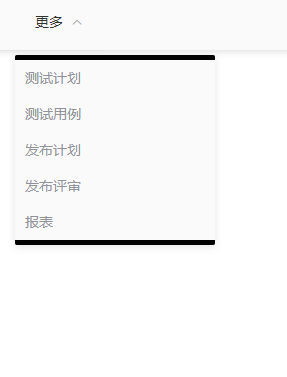
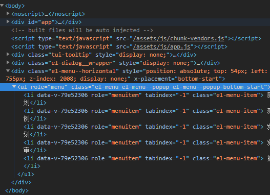
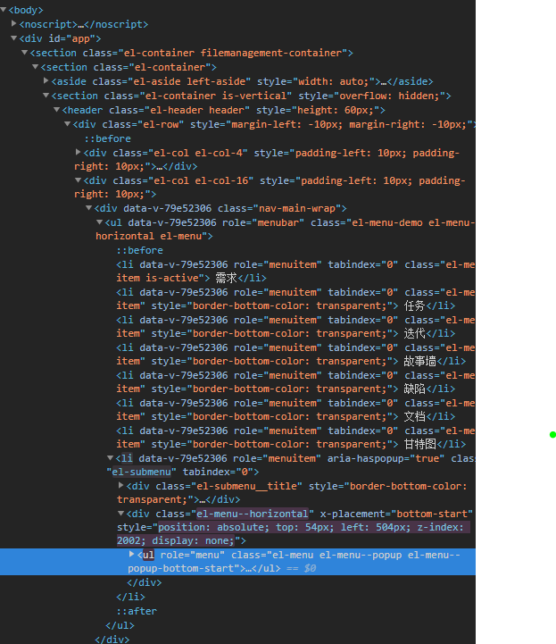
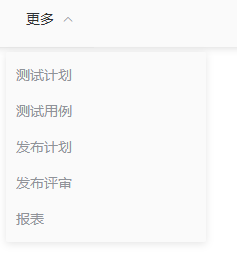
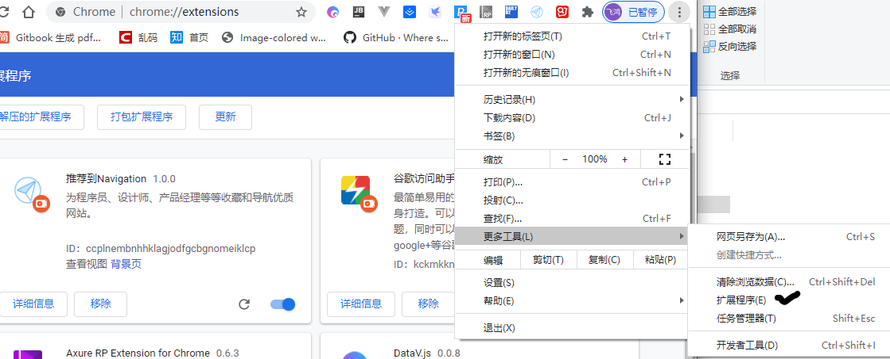
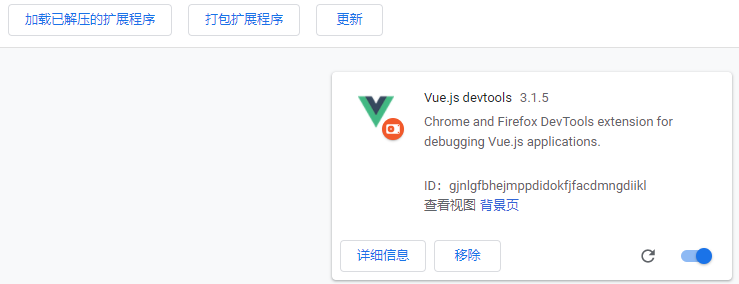

# 工作中遇到的前端问题和处理清单
## 1. 为什么$emit()方法不能触发父组件方法？
因为在组件中$emit传入的事件名称使用了大写的驼峰命名，但是其命名只能使用小写，所以无法触发父组件方法。
正确如下：
`this.$emit('prev-click', this.internalCurrentPage)`

错误如下：
`this.$emit('prevClick', this.internalCurrentPage)`

如果修改后还是不行的话，就改用：`this.$parent.Event`(Event为父组件中的自定义方法)
## 2. Node.js Error: listen EADDRNOTAVAIL这是什么？
地址占用
1. cmd 看下本地ipconfig，然后输入自己的ip，就可以了
2. 在浏览器输入http://ip:port即可查看页面
## 3. Vue和IE兼容问题(IE页面空白不显示）
当IE11打开vue页面的时候，居然是一片空白。
查看相关issue。
`https://github.com/vuejs-templates/webpack/issues/260`
在浏览器控制台中出现以下错误：SCRIPT5022: [vuex] vuex requires a Promise polyfill in this browser。
尤大的回答：
> ES6-> ES5转换仅处理语法转换，而不处理polyfill（这些更像是运行时功能）。您可以使用babel-polyfill（包括所有与ES6相关的polyfills），也可以使用es6-promise。
首先`npm install --save babel-polyfill`
然后在`main.js`中的最前面引入`babel-polyfill`
```js
import 'babel-polyfill'
```
在`index.html` 加入以下代码
```html
<meta http-equiv="X-UA-Compatible" content="IE=edge,chrome=1">
```
在`config`中的`webpack.base.conf.js`中,修改编译配置
```js
entry:{
    app:['babel-polyfill','./src/main.js']      
}
```
当然，如果你只用到了 axios 对 promise进行兼容，可以只用 es6-promise
`npm install es6-promise --save`
在 main.js 中的最前面 引入
```js
import 'es6-promise/auto'
```
## 4. 为什么会出现`Uncaught (in promise) RangeError: Maximum call stack size exceeded`问题？
因为在分页逻辑的时候，未进行条件判断，导致递归无限进行。
## 5. `before-leave`切换element标签之前提示
这是element-ui切换标签之前的钩子，可以在这个方法中写提示语。
## 6. 为什么在`keep-alive`中使用`activated`和`deactiveted`无效？
因为`keep-alive`中组件中不包含动态组件，那么那些不被包含的组件就无法触发这两个方法。
`:exclude="['a','b','c']"`，那么其中`a`,`b`,`c`组件就无法调用方法。

`:include="['a','b','c']"`，其中组件才可以使用activated和dctiveted。

`activated`在`keep-alive`组件激活时调用，该钩子函数在服务器端渲染期间不被调用
`deactivated`在`keep-alive`组件停用时调用，该钩子函数在服务器端渲染期间不被调用
## 7. axios中使用params怎么传数组？
`axios`使用`params`传递数组类型的参数时，在`query`中的参数名会带上`[]`字符串

明明要传入数组a=[1,2,3],

实际如下：
```js
a[]:1
a[]:2
a[]:3
```
因为`POST`传数组肯定是没问题，`data`本身支持`json`数据。但是`GET`数据带在`url`后面，那么就要转字符串。

正确方式是`JSON.stringify()`将数组`json`序列化
## 8. iframe高度如何自适应？

JS自适应高度，其实就是设置iframe的高度，使其等于内嵌网页的高度，从而看不出来滚动条和嵌套痕迹。对于用户体验和网站美观起着重要作用。

如果内容是固定的，那么我们可以通过CSS来给它直接定义一个高度，同样可以实现上面的需求。当内容是未知或者是变化的时候。这个时候又有几种情况了。

想要父页面中的iframe高度自适应，那就必须拿到子页面的高度。
通过iframe.height设置iframe的高度。
iframe 属性：
```
src: "http://www.bing.com/"
srcdoc: ""
name: ""
sandbox: DOMTokenList [value: ""]
allowFullscreen: false
width: ""
height: ""
contentDocument: null
contentWindow: global {window: global, self: global, location: Location, closed: false, frames: global, …}
referrerPolicy: ""
csp: ""
allow: ""
align: ""
scrolling: "no"
frameBorder: "0"
longDesc: ""
marginHeight: ""
marginWidth: ""
featurePolicy: FeaturePolicy {}
loading: "auto"
allowPaymentRequest: false
title: ""
lang: ""
translate: true
dir: ""
hidden: false
accessKey: ""
draggable: false
spellcheck: true
autocapitalize: ""
contentEditable: "inherit"
isContentEditable: false
inputMode: ""
offsetParent: body
offsetTop: 8
offsetLeft: 8
offsetWidth: 504
offsetHeight: 1000
style: CSSStyleDeclaration {alignContent: "", alignItems: "", alignSelf: "", alignmentBaseline: "", all: "", …}
innerText: ""
outerText: ""
oncopy: null
oncut: null
onpaste: null
onabort: null
onblur: null
oncancel: null
oncanplay: null
oncanplaythrough: null
onchange: null
onclick: null
onclose: null
oncontextmenu: null
oncuechange: null
ondblclick: null
ondrag: null
ondragend: null
ondragenter: null
ondragleave: null
ondragover: null
ondragstart: null
ondrop: null
ondurationchange: null
onemptied: null
onended: null
onerror: null
onfocus: null
oninput: null
oninvalid: null
onkeydown: null
onkeypress: null
onkeyup: null
onload: ƒ onload(event)
onloadeddata: null
onloadedmetadata: null
onloadstart: null
onmousedown: null
onmouseenter: null
onmouseleave: null
onmousemove: null
onmouseout: null
onmouseover: null
onmouseup: null
onmousewheel: null
onpause: null
onplay: null
onplaying: null
onprogress: null
onratechange: null
onreset: null
onresize: null
onscroll: null
onseeked: null
onseeking: null
onselect: null
onstalled: null
onsubmit: null
onsuspend: null
ontimeupdate: null
ontoggle: null
onvolumechange: null
onwaiting: null
onwheel: null
onauxclick: null
ongotpointercapture: null
onlostpointercapture: null
onpointerdown: null
onpointermove: null
onpointerup: null
onpointercancel: null
onpointerover: null
onpointerout: null
onpointerenter: null
onpointerleave: null
onselectstart: null
onselectionchange: null
onanimationend: null
onanimationiteration: null
onanimationstart: null
ontransitionend: null
dataset: DOMStringMap {}
nonce: ""
autofocus: false
tabIndex: 0
enterKeyHint: ""
onformdata: null
onpointerrawupdate: null
namespaceURI: "http://www.w3.org/1999/xhtml"
prefix: null
localName: "iframe"
tagName: "IFRAME"
id: "myFrame"
className: ""
classList: DOMTokenList [value: ""]
slot: ""
part: DOMTokenList [value: ""]
attributes: NamedNodeMap {0: src, 1: id, 2: frameborder, 3: scrolling, 4: onload, src: src, id: id, frameborder: frameborder, scrolling: scrolling, onload: onload, …}
shadowRoot: null
assignedSlot: null
innerHTML: ""
outerHTML: "<iframe src="http://www.bing.com" id="myFrame" frameborder="0" scrolling="no" onload="setFrameHeight(this)"></iframe>"
scrollTop: 0
scrollLeft: 0
scrollWidth: 504
scrollHeight: 1000
clientTop: 0
clientLeft: 0
clientWidth: 504
clientHeight: 1000
attributeStyleMap: StylePropertyMap {size: 0}
onbeforecopy: null
onbeforecut: null
onbeforepaste: null
onsearch: null
elementTiming: ""
previousElementSibling: null
nextElementSibling: script
children: HTMLCollection []
firstElementChild: null
lastElementChild: null
childElementCount: 0
onfullscreenchange: null
onfullscreenerror: null
onwebkitfullscreenchange: null
onwebkitfullscreenerror: null
nodeType: 1
nodeName: "IFRAME"
baseURI: "file:///D:/githubMe/blog-demo/frame.html"
isConnected: true
ownerDocument: document
parentNode: body
parentElement: body
childNodes: NodeList []
firstChild: null
lastChild: null
previousSibling: null
nextSibling: text
nodeValue: null
textContent: ""
```
通过测试发现设置`iframe`中的`height`即可实现高度变化。
```html
<html>
<iframe src="https://www.bing.com/" id="myFrame" frameborder='0' width="500px"></iframe>

</html>
<script>
    function initFrame() {
        var iframe = document.getElementById("myFrame");
        iframe.height = document.documentElement.clientHeight
    }
    window.onload = initFrame()
    window.onresize=initFrame()
</script>
<style>
    body {
        margin: 0;
        width: 0;
    }
</style>
```
就可以实现高度自适应
## 9. iframe边框怎么去？
`iframe`标签中添加属性`frameborder`，并且设置为'0'
## 10. el-dropdown中的事件command怎么携带参数？
`command`经过测试无法携带参数，只能通过触发每个下拉项事件来携带参数
`el-dropdown-menu`绑定`click`事件
## 11. v-for与v-else连用，为什么重复渲染该标签？

```html
        <div v-if="search">
              <el-checkbox  v-for="user in userList" :label="user.name" :key="user.name">
                {{ user.name }}
              </el-checkbox>
              </div>
              <!-- v-else不能和v-for用在同一标签中，否则重复渲染 -->
              <div  v-else >
              <el-checkbox v-for="user in userList" :label="user.name" :key="user.name"
                :disabled="user.name === userInfo.cn_name">
                {{ user.name }}
              </el-checkbox>
              </div>
```
未完待续
## 12. refused to set unsafe header 'cookie'
因为浏览器的请求`header`中存有`cookie`会不安全，所以浏览器后报错。但是硬要添加也是没问题的。
最佳做法是把`Cookie`改成`Authorization`，让后端从`Authorization`中拿到相关登录信息
## 13. vue插值中函数不能异步
vue中的插值表达式中添加异步函数
```vue
<template>
...
    <el-table :data="tableData">
      <el-table-column label="名字" width="200" show-overflow-tooltip>
        <template slot-scope="slot">
          <router-link
            class="name"
            :to="{ path: 'iframe', query: { id: slot.row.id }}"
          >{{ getName(slot.row.id) }}</router-link>
        </template>
      </el-table-column>
    </el-table>
...
</template>
<script>
export default {
...
methods:{
    getName(msg){
        let aaa
        axios.post({
            url:url,
            params:msg
        }).then(res=>{
        return res.data.name
        })
    }
}
...
}
</script>
```
就比如上面这个表格根据`id`获取姓名，在插值表达式中的函数返回异步请求的结果，可想而知，是没有结果渲染的。

最佳做法，从`table`中的依赖数据`tableData`入手，遍历其中的`id`先获取名字，然后放进`table`即可。
## 14. 为何时间戳是从1970年1月1日 00:00:00 UTC+00:00开始？
最初计算机操作系统是32位，而时间也是用32位表示。
System.out.println(Integer.MAX_VALUE); // 2147483647
Integer在Java内用32位表示，因此32位能表示的最大值是2147483647。另外1年365天的总秒数是31536000，
2147483647/31536000 = 68.1
也就是说32位能表示的最长时间是68年，而实际上到2038年01月19日03时14分07秒，便会到达最大时间，过了这个时间点，所有32位操作系统时间便会变为10000000 00000000 00000000 00000000，也就是1901年12月13日20时45分52秒，这样便会出现时间回归的现象，很多软件便会运行异常了。
因为用32位来表示时间的最大间隔是68年，而最早出现的UNIX操作系统考虑到计算机产生的年代和应用的时限综合取了1970年1月1日作为UNIX TIME的纪元时间(开始时间)，而java自然也遵循了这一约束。
至于时间回归的现象相信随着64为操作系统的产生逐渐得到解决，因为用64位操作系统可以表示到292,277,026,596年12月4日15时30分08秒，相信我们的N代子孙，哪怕地球毁灭那天都不用愁不够用了，因为这个时间已经是千亿年以后了。
1969年8月，贝尔实验室的程序员肯汤普逊利用妻儿离开一个月的机会，开始着手创造一个全新的革命性的操作系统，他使用B编译语言在老旧的PDP-7机器上开发出了Unix的一个版本。随后，汤普逊和同事丹尼斯里奇改进了B语言，开发出了C语言，重写了UNIX，新版于1971年发布。
那时的计算机操作系统是32位，时间用32位有符号数表示，则可表示 68 年,
用32位无符号数表示，可表示136年。他们认为 以 1970年 为时间 原点 足够可以了。 因此，C 的 time 函数 就这么 定了，后来的 java 等也用它，微机也用它，工作站本来就是unix系统当然也用它。（今后若用64位机年限更没问题。）
1970年1月1日 算 UNIX 和 C语言 生日。
时间戳
全世界各个时区的时间可能都是不一样的，那么就有了时间戳，可以不受时区的限制，精确的表示时间。
时间戳（timestamp），一个能表示一份数据在某个特定时间之前已经存在的、 完整的、 可验证的数据,通常是一个字符序列，唯一地标识某一刻的时间。
时间戳是指格林威治时间1970年01月01日00时00分00秒起至现在的总秒数。
有了时间戳，无论我们深处哪个时区，从格林威治时间1970年01月01日00时00分00秒到现在这一时刻的总秒数应该是一样的。所以说，时间戳是一份能够表示一份数据在一个特定时间点已经存在的完整的可验证的数据。
## 15. 修改ElementUI的提示框默认样式
像elementUI的tooltip、popover这种渲染出来的元素都是在body下面一层，所以你在组件里面去加样式发现根本不生效，所以需要到App.vue里面去加
1. 给tooltip加上popper-class="tips"自定义样式
2. 改变边框为灰色

```css
.el-tooltip__popper.is-light.tips{
  border 1px solid #eee
}
//改变边框，宽度，文字换行
.el-tooltip__popper.is-light.tooltipStyle{
  border 1px solid #eee
  width 80px
  word-break break-all
}
```
## 16. 控制台报错：@babel/polyfill is loaded more than once on this page.

前端控制台报错
```
@babel/polyfill is loaded more than once on this page. This is probably not desirable/intended and may have consequences if different versions of the polyfills are applied sequentially. If you do need to load the polyfill more than once, use @babel/polyfill/noConflict instead to bypass the warning.
```
问题是：`@babel/polyfill` 在页面中加载多次，如果不同版本的`polyfill`应用可能是不可取的，并可能有后果。
如果你需要多次加载`polyfill`，使用`@babel/polyfill/noConflict`来绕过警告。

这个警告出现在`node_modules\@babel\polyfill\browser.js`

解决方案：在`main.js`中将`import '@babel/polyfill`改成`import '@babel/polyfill/noConflict'`即可。
## 17. 控制台报错：[Violation] Added non-passive event listener to a scroll-blocking 'mousewheel' event. Consider marking event handler as 'passive' to make the page more responsive.
在基于 Element-ui 写项目的时候，Chrome 提醒：
```
[Violation] Added non-passive event listener to a scroll-blocking 'mousewheel' event. Consider marking event handler as 'passive' to make the page more responsive.
```
翻译过来如下：
【违反】没有添加被动事件监听器来阻止'mousewheel'事件，请考虑添加事件管理者'passive'，以使页面更加流畅。

原因是 Chrome51 版本以后，Chrome 增加了新的事件捕获机制－Passive Event Listeners；

Passive Event Listeners：就是告诉前页面内的事件监听器内部是否会调用preventDefault函数来阻止事件的默认行为，以便浏览器根据这个信息更好地做出决策来优化页面性能。当属性passive的值为true的时候，代表该监听器内部不会调用preventDefault函数来阻止默认滑动行为，Chrome浏览器称这类型的监听器为被动（passive）监听器。目前Chrome主要利用该特性来优化页面的滑动性能，所以Passive Event Listeners特性当前仅支持mousewheel/touch相关事件。

解决：
1. npm i default-passive-events -S
2. main.js中加入：import 'default-passive-events'
但是由于导入`default-passive-events`引入更多的报错，故没采用。
## 18. 详解如何修改el-select的样式：popper-append-to-body和popper-class
网上有很多关于这个的解决方式：

1. 找到下拉框的类名，写个全局样式覆盖掉就行了
2. 修改.el-select-dropdown__item的样式
3. 通过官网提供的popper-class进行样式修改

然而，上面的方法并没有说到点子上，覆盖全局样式的方法肯定不友好，修改样式和添加类也都不起作用。于是，我看了下下拉框的样式，它并没有在`el-select`里面，而是放在了最外层。

`popper-append-to-body`属性可以控制它,默认是true，改成false就可以起作用
```html
<el-select
    :popper-append-to-body="false"
    v-model="taskType"
    placeholder="请选择"
    size="mini"
    class="select-style"
    popper-class="select-popper"
  >
    <el-option
      v-for="(item,index) in taskTypes"
      :key="index"
      :value="item.value"
      :label="item.label"
    ></el-option>
  </el-select>
```
其实，这个只是改了下拉框里面的样式，输入框的样式还需要通过修改.el-input__inner样式：
```css
.select-style {
    width: 3rem;
    margin-right: 0.36rem;
    /deep/.el-input__inner {
      border-top-left-radius: 0;
      border-bottom-left-radius: 0;
      border: 1px solid #a1a3ad;
      border-left-width: 0;
      background-color: rgba(0, 0, 0, 0.8);
      font-family: PingFangSC-Regular;
      font-size: 0.28rem;
      color: rgba(255, 255, 255, 0.6);
    }
  }
```
最后，附上.select-popper的样式：
```css
/deep/.select-popper {
    background-color: $item-bg-color;
    border-radius: 0.08rem;
    border: solid 0.02rem #1c395d;
    font-family: PingFangSC-Regular;
    .el-select-dropdown__item.selected {
      font-family: PingFangSC-Regular;
      font-size: 0.28rem;
      color: rgba(74, 141, 253, 1);
    }
    li {
      color: #fff;
      background: transparent;
      color: #fff;
      font-size: 0.28rem;
    }
    .el-select-dropdown__item:hover,
    .el-select-dropdown__item.hover {
      background-color: rgba(110, 147, 206, 0.2);
      margin-right: 1px;
    }
    .popper__arrow::after {
      border-bottom-color: $item-bg-color;
    }
    .popper__arrow {
      border-bottom-color: $item-bg-color;
    }
    .el-select-dropdown__empty {
      padding: 0.2rem;
      font-size: 0.28rem;
    }
  }
```
关键点：:popper-append-to-body="false"，然后添加popper-class进行样式修改。
## 19. 导入js-base64后，终端提示找不到Base

```javascript
$ npm install --save js-base64
```
If you are using it on ES6 transpilers, you may also need:
如果你在ES6用它需要转化，你可能还需要:
```javascript
$ npm install --save babel-preset-env
```
Note `js-base64` itself is stand-alone so its `package.json` has no `dependencies`.  However, it is also tested on ES6 environment so `"babel-preset-env": "^1.7.0"` is on `devDependencies`.
注意`js-base64`本身是独立的，所以它的`package.json`没有`dependencies`。
不过，它也在`ES6`环境下测试过，所以`"babel-preset-env": "^1.7.0"`在`devDependencies`上。
## 20.js点击按钮滚动跳转定位到页面指定位置
- 我们要点击实现跳转的地方是一个`html`锚点，也就是点击一个`a`标签超链接实现跳转，可以把`a`标签的`href`属性直接指向跳转指定位置的`div`
```html
<a href="#abc">点击跳转</a>
<div id="abc">将要跳转到这里</div>
```
- 点击实现跳转的地方是一个button按钮的话，由于button不能添加href，所以我们只好使用js跳转代码来实现
```
    <script>
    function onTopClick() {
         window.location.hash = "#abc";
       }
    </script>
    <input  type="button" name="Submit" value="提交"  onclick="javascript:onTopClick();" />
    <div id="abc">跳转到的位置</div>
```
- scrollToView()跳转指定位置
在按钮位置添加`οnclick="scrollToView()"`
```
<button onclick="scrollToView()"></button>
```
之后添加`scrollToView()`，要跳转的目标地址的元素`id`执行该方法即可。
```
<script type="text/javascript">
    function scrollToView () {
        document.getElementById('id').scrollIntoView({
            block: 'start',
            inline: 'nearest',
            behavior: 'smooth'
        })
    }
</script>
```

scrollToView 属性|作用
--|--
block|定义垂直方向的对齐："start", "center", "end", 或 "nearest"
inline|定义水平方向的对齐："start", "center", "end", 或 "nearest"
behavior|动画的过渡效果："auto"或 "smooth"
alignToTop|true:元素的顶端将和其所在滚动区的可视区域的顶端对齐。相应的 scrollIntoViewOptions: {block: "start", inline: "nearest"}。false:元素的底端将和其所在滚动区的可视区域的底端对齐。相应的scrollIntoViewOptions: {block: "end", inline: "nearest"}。
## 21.vuecli3中htmlWebpackPlugin报ReferenceError: BASE_URL is not defined的错误
```
<head>   

<link rel="icon" href="<%= BASE_URL %>favicon.ico"> // 这里BASE_URL报错
</head>

config.plugins.push(
      new HtmlWebpackPlugin({
        template: ‘./public/index.html‘,
        inject: true,
        hash: new Date().getTime(),
        url: BASE_URL,  //需要这里传参
        minify: {
          removeComments: true,
          collapseWhitespace: true,
          removeAttributeQuotes: true
        },
        chunksSortMode: ‘manual‘
      })
    )
    
<head>   

<link rel="icon" href="<%= htmlWebpackPlugin.options.url %>favicon.ico"> //改成这种就ok了
</head>
```
## 22.如何动态创建iframe及释放内存？
```js
/**
 * 动态创建iframe
 * @param dom 创建iframe的容器，即在dom中创建iframe。dom能够是div、span或者其它标签。
 * @param src iframe中打开的网页路径
 * @param onload iframe载入完后触发该事件。能够为空
 * @return 返回创建的iframe对象
*/
function createIframe(dom, src, onload){
	//在document中创建iframe
	var iframe = document.createElement("iframe");
	
	//设置iframe的样式
	iframe.style.width = '100%';
	iframe.style.height = '100%';
	iframe.style.margin = '0';
	iframe.style.padding = '0';
	iframe.style.overflow = 'hidden';
	iframe.style.border = 'none';
	
	//绑定iframe的onload事件
	if(onload && Object.prototype.toString.call(onload) === '[object Function]'){
		if(iframe.attachEvent){
			iframe.attachEvent('onload', onload);
		}else if(iframe.addEventListener){
			iframe.addEventListener('load', onload);
		}else{
			iframe.onload = onload;
		}
	}
	
	iframe.src = src;
	//把iframe载入到dom以下
	dom.appendChild(iframe);
	return iframe;
}
```
```js
/**
 * 销毁iframe，释放iframe所占用的内存。

 * @param iframe 须要销毁的iframe对象
*/
function destroyIframe(iframe){
	//把iframe指向空白页面，这样能够释放大部分内存。
	iframe.src = 'about:blank';
	try{
		iframe.contentWindow.document.write('');
		iframe.contentWindow.document.clear();
	}catch(e){}
	//把iframe从页面移除
	iframe.parentNode.removeChild(iframe);
}
```
## 23.H5中video标签的poster无法自适应video大小？
做H5视频播放，`video`标签设置`poster`属性后，图片无法自适应`video`大小

最后给`video`标签设置，解决该问题
```css
width: 100%; height: 100%; object-fit: fill
```
## 24.element的弹出框popover如何精准匹配？
错误代码：
```html
<span  v-popover:popover-fun>
  <font-awesome-icon :icon="['file', iconList[node.level]]" size="xs" />
  <span> {{ node.label }}</span>
</span>
```
自定义指令`v-popover`指向 `Popover` 的索引`ref`会导致遍历的左侧树无法精准匹配到数组中的对应项。

采用具名插槽`slot="reference"`完美解决。
## 25.vue-router路由中的参数如何可传可不传？
当我们写一个页面时，有时候不需要传递参数，那如何做出可传可不传呢？

由于项目需求会遇到进入某个页面获取模默认信息，但有时需要传递一个id获取对应的信息，为了兼容同一个页面的路由的参数，可传可不传，可以针对路由做以下处理:
```js
{
    path: '/index/:id?', //获取参数：this.$route.params.id 
    name: 'index', 
    component: Index
}
```
## 26.数组对象如何查找对象并删除？
当数组中查找某个值并删除之很简单。
假如数组对象中查找某个对象并删除之，那要怎么做呢？
```js
deleteItem(array, item) {
      const index = array.findIndex(text => text.id === item.id);
      array.splice(index, 1);
      return array;
    },
```
该方法接受两个参数：第一个是原数组，第二个是要删除的对象，返回删除后的数组。
## 27. 父组件传入element中的选择框的值时，选择框显示value而不是label？
1. 经调试发现，当接口拿到的值是字符串类型，格式不正确，从父组件传入子组件的el-select中，选择框绑定的是数字类型，所以发生问题。
只需要`Number`改下即可：
```
this.readValue = '1' // 此处可以替换成接口读取的内容
this.form.select = Number(this.readValue) // 通过Number将类型转换
```
2. 反之，接口拿到数字类型，但是选择框绑定的是字符串类型。
```
this.readValue = 1 // 此处可以替换成接口读取的内容
this.form.select = String(this.readValue) // 通过Number将类型转换
```
## 28. js对象与字符串如何相互转换?
1. 对象转字符串
```js
p={name:'qfh',age:24}
// {name: "qfh", age: 24}
p1=JSON.stringify(p)
// "{"name":"qfh","age":24}"
```
2. 字符串转对象
```js
a=JSON.parse(p1)
{name: "qfh", age: 24}
```
## 29.npm如何切换成阿里源？
阿里在国内搭建了镜像服务器:http://npm.taobao.org 

需要执行以下命令更改:
```
npm config set registry https://registry.npm.taobao.org --global
npm config set disturl https://npm.taobao.org/dist --global
```
更改完成

使用命令查看本地镜像源
```
npm config get registry
```
## 30.vue如何修改多层嵌套数据使页面重新渲染？
采用的这种方式可能不起作用，虽然打开控制台发现data值发生了变化，但是没有渲染到页面上。其实是因为数据层次太多，没有触发render函数进行自动更新。
```js
this.$set(this.data[id],"newPro",true);
```
需手动调用
```js
this.$forceUpdate();
```
## 31.vue中如何全局使用moment.js?
moment是时间库，可以方便任何时间格式的转化。
1. 安装
```
npm install moment -D
main.js 引入moment
```
2. 定义全局 时间过滤器
```js
import Moment from 'moment';
Vue.filter('comverTime',function(data,format){
  return Moment(data).format(format);
});
```
3. vue组件中使用 定义的 comverTime 过滤器
```html
　　<p>{{Time | comverTime('MMMM Do YYYY, h:mm:ss a')}}</p>
<!-- 五月 6日 2020, 8:46:21 晚上 -->
　　<p>{{Time | comverTime('YYYY-MM-DD HH:mm:ss')}}</p>
<!-- "2020-05-06 20:48:25" -->
```
## 32.如何判断某值等于NaN?
聪明的你会发现
```js
NaN==NaN
// false
NaN===NaN
// false
```
在ECMAScript 6中, 有一个Number.isNaN() 方法提供可靠的NaN值检测，只有在参数是真正的NaN时，才会返回true。

判断如下
```js
Number.isNaN(NaN)
// true
Number.isNaN({})
// false
Number.isNaN([])
// false
Number.isNaN(Math.log(-2))
// true
```
## 33.项目报错less--Module build failed: TypeError: loaderContext.getResolve is not a function？
这是因为less版本太高，只要将less卸载后装一个低版本的就解决了。
```
npm uninstall less-loader
npm install less-loader@4.1.0 --save
```
## 34.elementui中label标签添加自定义图标
```vue
   <el-form-item >
            <span slot="label">
              <span class="span-box">
                <i class="el-icon-question"></i>
                <el-tooltip content="这是个问号"></el-tooltip>
                <span>问题：</span>
              </span>
            </span>
  </el-form-item >
```
加一个`slot`，在其下添加自定义图标。
## 35. this.$router.push的两种方式

清理`/#/`后面的`url`，加上`/${this.id}/result`
```
this.$router.push(`/${this.id}/result`)
```
不清除`/#/`后面的`url`，`/${this.id}/result`跟在`url`后面
```
this.$router.push(`${this.id}/result`)
```
## 36.node-sass包安装失败
可以切换淘宝镜像试一下
```
set sass_binary_site=https://npm.taobao.org/mirrors/node-sass/
npm install node-sass
```
下载速度非常快，毕竟从国外源换到了国内。
## 37.npm install 报错 gyp ERR! build error
这是因为在 `Windows` 系统上安装依赖时，如果缺少 `C++` 编译环境会报错。

[`windows-build-tools`](https://github.com/felixrieseberg/windows-build-tools) 是一个 `npm` 包，可以一键安装 `c++` 编译所需的 `python27、Visual Studio、C++ Build Tool` 等。
```
yarn global add windows-build-tools
```
安装一下问题解决
## 38.unexpected side effect in computed properties
`computed`不能改变页面中变量的值，必须要使用`watch`。
## 39.el-menu样式改变无法生效
具体代码如下：
```js
      <el-menu :default-active="activeIndex" class="el-menu-demo" mode="horizontal" @select="handleSelect">
            <template v-for="item in menuOptions">
                <el-submenu v-if="item.subItems&&item.subItems.length>0" :key="item.index" :index='item.index'>
                    <template slot="title">{{item.title}}</template>
                    <el-menu-item v-for="subItem in item.subItems" :key='subItem.index' :index="subItem.index">
                        {{subItem.title}}</el-menu-item>
                </el-submenu>
                <el-menu-item v-else :key="item.index" :index="item.index">
                    {{item.title}}</el-menu-item>
            </template>
        </el-menu>
```
修改的样式
```css
  .nav-main-wrap {
        display: -webkit-inline-box;
    }

    .nav-main-wrap /deep/ .el-menu,
    .nav-main-wrap /deep/ .el-menu--horizontal>.el-menu-item:not(.is-disabled):focus,
    .nav-main-wrap /deep/ .el-menu--horizontal>.el-menu-item:not(.is-disabled):hover,
    .nav-main-wrap /deep/ .el-menu--horizontal>.el-submenu .el-submenu__title:hover {
        background-color: #fafafa !important;
    }

    .nav-main-wrap /deep/ .el-menu,
    .nav-main-wrap /deep/ .el-submenu,
    .nav-main-wrap /deep/ .el-menu-vertical-demo,
    .nav-main-wrap /deep/ .el-menu--vertical .el-submenu__title,
    .nav-main-wrap /deep/ .el-menu-item.subItem,
    .nav-main-wrap /deep/ .el-submenu {
        background-color: #fafafa !important;
    }

    .nav-main-wrap /deep/ .el-menu-item.subItem:hover,
    .nav-main-wrap /deep/ .el-menu-vertical-demo .el-submenu__title:hover,
    .nav-main-wrap /deep/ .el-menu--vertical .el-submenu__title:hover {
        background-color: #fafafa !important;
    }

    .nav-main-wrap /deep/ .el-menu {
        background-color: #fafafa !important;
    }

    .el-menu--horizontal .el-menu .el-menu-item,
    .el-menu--horizontal .el-menu .el-submenu__title {
        background-color: #fafafa !important;
    }

```
效果如下：



此时的弹框实在body下的，所以无论怎么定义，自定义的样式没有作用。



只要加上
```js
:popper-append-to-body='false' 
```
将弹框不放入body即可


正确样式如下：


## 40.等高的div却不在同一条水平线上
`display:-webkit-inline-box`和`display: inline-block`使两个`div`放在同一行里，但是等高的`div`却不在同一条水平线上。

原因是基线没有对齐，加上`vertical-align: top`即可。

## 41.通过watch方法监听route的变化来获取最新的项目id
可以通过 `watch` 方法监听 `route` 的变化来获取最新的 `id`。

响应路由参数的变化

当使用路由参数时，例如从 `/project/1` 导航到 `/project/2` ，原来的组件实例会被复用。因为两个路由都渲染同个组件，比起销毁再创建，复用则显得更加高效。不过，这也意味着组件的生命周期钩子不会再被调用。

复用组件时，想对路由参数的变化作出响应的话，你可以简单地 `watch` (监测变化) `$route` 对象：
```js
const User = {
  template: '...',
  watch: {
    $route(to, from) {
      // 对路由变化作出响应...
    }
  }
}
```

或者使用 2.2 中引入的 beforeRouteUpdate 导航守卫：
```js
const User = {
  template: '...',
  beforeRouteUpdate (to, from, next) {
    // react to route changes...
    // don't forget to call next()
  }
}
```
## 42.使用window.open打开的子窗口与父窗口之间的通信
1. 打开一个新窗口： `window.open()` ; 为了便于父窗口操作子窗口可以为 `window.open()` 定义一个变量，例如：
`var opW = window.open(‘tests.html’,'popup’,'width=300,height=300′);`
这样要关闭子窗口可直接使用： `opW.close()` 关闭子窗口;
`opw` 就是子窗口对象，要操作子窗口元素，只要操作其中的方法和属性即可例如：
`opW.document.getElementById(“fartherWindowTxt”).innerHTML = “操作子窗口”;`
2. 子窗口可以使用 `window.opener` 来引用父窗口：`window.opener.document.getElementById(“fartherWindowTxt”).innerHTML=”子窗口操作父窗口！”;`
3. 窗口关闭自身窗口可以使用：`window.close();`

## 43.webpack编译报错 Couldn't find preset "env" relative to directory
### 背景
这种现象是由于在 `.babelrc` 文件中设置了 `env` 选项，但是没有用插件 `babel-preset-env` 处理。
调用插件 `babel-preset-env` 处理。依赖引入即可
```
npm install babel-preset-env --save-dev 
```
> babel-preset-env
一个 `Babel` 预置，通过根据你的目标浏览器或运行时环境自动确定你需要的 `Babel` 插件和填充，将 `ES2015+` 编译为 `ES5`。
详情见 [https://github.com/babel/babel-preset-env](https://github.com/babel/babel-preset-env)

## 44.vue路由跳转到新的窗口
### 背景
针对一个例子，如下：原url为`hello/#/a/`需要跳转到`hello/#/a/${id}`的路由，
```js
let newUrl=`/#/a/${id}`
        this.$router.resolve(newUrl)
```
当前页面需要打开一个新的窗口，原来的思路是`this.$router.resolve`，但是无用，在原基础上加上跳转的部分
如原来`url`为`hello/#/c/${id}`，用上`resolve`，就变为`hello/#/c/a/${id}`

正确的方式：
```js
let newUrl=`/#/a/${id}`
        window.open(newUrl,'_blank')
```

## 45.有没有时间处理库
### 背景
做项目的时候，由于时区和格式的不同，时间展示各有所不同。

我们希望统一时间格式，那么有没有时间处理库呢？
### moment.js
Moment 被设计为在浏览器和 Node.js 中都能工作。

所有的代码都应该在这两种环境中都可以工作，并且所有的单元测试都应该在这两种环境中运行。

CI 系统当前使用以下的浏览器：Windows XP 上的 Chrome，Windows 7 上的 IE 8、9 和 10，Windows 10 上的 IE 11，Linux 上最新的 Firefox，OSX 10.8 和 10.11 上最新的 Safari。
#### 使用方式
```js
日期格式化
moment().format('MMMM Do YYYY, h:mm:ss a'); // 九月 8日 2020, 7:35:59 晚上
moment().format('dddd');                    // 星期二
moment().format("MMM Do YY");               // 9月 8日 20
moment().format('YYYY [escaped] YYYY');     // 2020 escaped 2020
moment().format();                          // 2020-09-08T19:35:59+08:00
相对时间
moment("20111031", "YYYYMMDD").fromNow(); // 9 年前
moment("20120620", "YYYYMMDD").fromNow(); // 8 年前
moment().startOf('day').fromNow();        // 20 小时前
moment().endOf('day').fromNow();          // 4 小时内
moment().startOf('hour').fromNow();       // 36 分钟前
日历时间
moment().subtract(10, 'days').calendar(); // 2020/08/29
moment().subtract(6, 'days').calendar();  // 上星期三19:35
moment().subtract(3, 'days').calendar();  // 上星期六19:35
moment().subtract(1, 'days').calendar();  // 昨天19:35
moment().calendar();                      // 今天19:35
moment().add(1, 'days').calendar();       // 明天19:35
moment().add(3, 'days').calendar();       // 下星期五19:35
moment().add(10, 'days').calendar();      // 2020/09/18
多语言支持
moment.locale();         // zh-cn
moment().format('LT');   // 19:35
moment().format('LTS');  // 19:35:59
moment().format('L');    // 2020/09/08
moment().format('l');    // 2020/9/8
moment().format('LL');   // 2020年9月8日
moment().format('ll');   // 2020年9月8日
moment().format('LLL');  // 2020年9月8日晚上7点35分
moment().format('lll');  // 2020年9月8日 19:35
moment().format('LLLL'); // 2020年9月8日星期二晚上7点35分
moment().format('llll'); // 2020年9月8日星期二 19:35
```
## 46.修改输入框占位符
### 背景
h5为输入框添加了原生的占位符属性placeholder，但是他的占位符字体颜色默认是浅灰色。如果要自定义字体色，该怎么办呢？这里需要了解下`::-webkit-input-placeholder`这个伪元素。
### 修改字体色
```
input::-webkit-input-placeholder,
textarea::-webkit-input-placeholder {
color: #000;
}
```
## 47.canvas画图，收缩比例出错
`canvas` 的 `drawImage()` 方法画图，图片收缩出错。

原图大小是 `1080*1920`，由于页面水平需要收缩加之高度较大，所以将 `canvas` 的宽度固定，高度自适应。

正常应该是如下草图：

为什么会出现这个问题呢？通过研究发现，原来是 `canvas` 的宽高被设置成100%造成的。

将 `canvas` 的宽高设置为固定值，就能解决问题。
## 48.npm清除未被使用的模块
有些模块未被项目引入，但是我们还是安装了这些模块，为了减少 `node_modules` 的体积。

这时我们只需要简单的一行命令即可解决！
```
npm prune
```
## 49.在chrome devtools的network面板使用高级过滤
除此之外 “-”还可以用来反向过滤。
## 50.window下删除指定端口的进程
显示指定端口的进程
```
netstat -ano|findstr "8080"
```
```
显示： TCP 0.0.0.0:80 0.0.0.0:0 LISTENING 2222
```
删除指定端口的进程
```
taskkill -pid 2222 /f
```
## 51.vscode搜索文件，如何排除多个文件夹
对于大型项目，快速定位代码的方式就是搜索关键词，那么有一些不写在配置中，但是又不需要搜索的文件夹如何排除呢？

1. 选中 `vscode` 左侧栏的搜索按钮
2. 搜索第一行 `input` 输入你要搜索的关键词
3. 搜索第二行 `input` 输入想在哪个文件中搜索，不填就是全局项目
4. 搜索第二行 `input` 输入你想排除的文件，如果多文件，需要逗号隔开','

## 52.数组对象根据id值相同合并其的value值
将相同 `id` 的 `value` 值塞进 `valueMap` 中。
```js
var  arr = [
    { "id" : "1001" , "name" : "值1" , "value" : "111" },
    { "id" : "1001" , "name" : "值1" , "value" : "11111" },
    { "id" : "1002" , "name" : "值2" , "value" : "25462" },
    { "id" : "1002" , "name" : "值2" , "value" : "23131" },
    { "id" : "1002" , "name" : "值2" , "value" : "2315432" },
    { "id" : "1003" , "name" : "值3" , "value" : "333333" }
];

var  map = {},
    dest = [];
for ( var  i = 0; i < arr.length; i++){
    var  ai = arr[i];
    if (!map[ai.id]){
        dest.push({
            id: ai.id,
            name: ai.name,
            valueMap: [ai.value]
        });
        map[ai.id] = ai;
    } else {
        for ( var  j = 0; j < dest.length; j++){
            var  dj = dest[j];
            if (dj.id == ai.id){
                dj.valueMap.push(ai.value);
                break ;
            }
        }
    }
}

console.log(dest);
// [ { id: '1001', name: '值1', valueMap: [ '111', '11111' ] },
//   { id: '1002',
//     name: '值2',
//     valueMap: [ '25462', '23131', '2315432' ] },
//   { id: '1003', name: '值3', valueMap: [ '333333' ] } ]
```
### 分析
1. 最外层的循环，遍历 `id`，将其塞进 `map` 中；
2. 如果下一个对象中的 `id` 不存在 `map` 中，就将其 `id` 塞进并将 `value` 值塞进 `valueMap` 中；
3. 如果存在，就直接将 `value` 塞进 `map` 中对象 `id` 的 `valueMap` 中。

## 53.对象和数组的深拷贝
`JavaScript` 程序中，对于简单的数字、字符串可以通过 `=` 赋值拷贝，
但是对于数组、对象、对象数组的拷贝，就有浅拷贝和深拷贝之分。

浅拷贝就是当改变了拷贝后的数据，原数据也会相应改变。

浅拷贝：指两个对象指向同一个内存地址，其中一个改变会影响另一个
深拷贝：指复制后的新对象重新指向一个新的内存地址，两个对象改变互不影响

### 数组深拷贝
1. 遍历赋值
```js
let a = [1, 2, 3]
let b = []
for (let i of a) {
  b.push(i)
}
b.push(4)

console.log(a)
console.log(b)
// [ 1, 2, 3 ]
// [ 1, 2, 3, 4 ]
```
2. slice()
数组方法 `slice()` 可从已有的数组中返回选定的元素
那么设置为 `0`，就是返回整个数组
```js
let a = [1, 2, 3]
let b = []
b = a.slice(0)
b.push(4)
console.log(a)
console.log(b)
// [ 1, 2, 3 ]
// [ 1, 2, 3, 4 ]
```
3. concat()
数组方法 `concat()` 连接一个或多个数组，并返回一个副本
那么不设置参数，就返回本数组
```js
let a = [1, 2, 3]
let b = []
b = a.concat()
b.push(4)
console.log(a)
console.log(b)
// [ 1, 2, 3 ]
// [ 1, 2, 3, 4 ]
```
4. ES6 方法
```js
let a = [1, 2, 3]
let b = []
b = [...a]
b.push(4)
console.log(a)
console.log(b)
// [ 1, 2, 3 ]
// [ 1, 2, 3, 4 ]
let a = [1, 2, 3]
let b = []
b = Array.from(a)
b.push(4)
console.log(a)
console.log(b)
// [ 1, 2, 3 ]
// [ 1, 2, 3, 4 ]
```
### 对象深拷贝
1. Object.assign()
```js
let a = {
    name: 'qfh',
    info: {
        age: 24
    }
}
let b = {}
b = Object.assign({}, a)
b.name = 'test'
b.info.age = 12
console.log(a)
console.log(b)
// { name: 'qfh', info: { age: 12 } }
// { name: 'test', info: { age: 12 } }
```
> 注意使用 assign() 有如下特点：
>> 不会拷贝对象继承的属性、不可枚举的属性、属性的数据属性/访问器属性
>> 可以拷贝 Symbol 类型
>> 只能深拷贝一层
2. 扩展运算符
```js
let a = {
    name: 'qfh',
    info: {
        age: 24
    }
}
let b = {}
b = { ...a }
b.name = 'test'
b.info.age = 12
console.log(a)
console.log(b)
// { name: 'qfh', info: { age: 12 } }
// { name: 'test', info: { age: 12 } }
```
同上
### 总结
以上是简单数组、对象的深拷贝方法，但是对于二维数组、对象数组、对象里包含对象，以上方法均达不到深拷贝方法

以上只能达到数组、对象的第一层的深拷贝，对于里面的数组或对象属性则是浅拷贝，因为里面的内存地址只是拷贝了一份，但都是指向同一个地址

所以当改变数组、对象里的数组元素或对象，原数据依然会改变

### 多层数组对象的深拷贝
1. JSON 序列化与反序列化
使用 `JSON.parse(JSON.stringify(obj))`
```
let a = {
    name: 'qfh',
    info: {
        age: 24
    }
}
let b = {}
b = JSON.parse(JSON.stringify(a))
b.name = 'test'
b.info.age = 12
console.log(a)
console.log(b)
// { name: 'qfh', info: { age: 24 } }
// { name: 'test', info: { age: 12 } }
```
通过 `JSON.stringify` 实现深拷贝有几点要注意
- 拷贝的对象的值中如果有函数、`undefined`、`symbol`，则经过 `JSON.stringify()` 序列化后的 `JSON` 字符串中这个键值对会消失
- 无法拷贝不可枚举的属性，无法拷贝对象的原型链
-  拷贝 Date 引用类型会变成字符串
-  拷贝 RegExp 引用类型会变成空对象
-  对象中含有 NaN、Infinity 和 -Infinity，则序列化的结果会变成 null
-  无法拷贝对象的循环应用（即 obj[key] = obj）

2. 自己实现深拷贝方法
```js
function deepCopy(obj) {
    let result = Array.isArray(obj) ? [] : {};
    for (let key in obj) {
      if (obj.hasOwnProperty(key)) {
        if (typeof obj[key] === 'object') {
          result[key] = deepCopy(obj[key]);   // 递归复制
        } else {
          result[key] = obj[key];
        }
      }
    }
    return result;
  }
```
测试对象
```js
let a = {
    name: 'qfh',
    info: {
        age: 24
    }
}
let b = {}
b = deepCopy(a)
b.name = 'test'
b.info.age = 12
console.log(a)
console.log(b)
// { name: 'qfh', info: { age: 24 } }
// { name: 'test', info: { age: 12 } }
```
测试数组
```js
let a = [1, 2, 3, [4, 5]]
let b = []
b = deepCopy(a)
b[3].push(6)
b.push(4)
console.log(a)
console.log(b)
// [ 1, 2, 3, [ 4, 5 ] ]
// [ 1, 2, 3, [ 4, 5, 6 ], 4 ]
```
3. `lodash` 的深拷贝 `cloneDeep`
使用 `lodash` 插件的深拷贝方法
```js
// 官方例子
var objects = [{ 'a': 1 }, { 'b': 2 }];
 
var deep = _.cloneDeep(objects);
console.log(deep[0] === objects[0]);
// => false`
```
## 54. vue-devtools安装配置
此方案主要面向没有科学上网条件的同学。

首先你得有node环境和git，在github克隆下来vue-devtoos的项目，经过npm install和npm run build打包生成可以提供浏览器运行的程序。

但是往往途中会出现各种问题，所以直接提供了打包好后的项目[代码](https://github.com/qiufeihong2018/vue-devtools-dist)。

打开扩展程序



加载已解压的扩展程序,将刚下载下来的chrome添加进去，就生成好了，打开vue程序，随心测试。



## 55.使用pkg打包Node.js应用
Node.js应用不需要经过编译过程，可以直接把源代码拷贝到部署机上执行，确实比C++、Java这类编译型应用部署方便。然而，Node.js应用执行需要有运行环境，意味着你需要先在部署机器上安装Node.js。虽说没有麻烦到哪里去，但毕竟多了一个步骤，特别是对于离线环境下的部署机，麻烦程度还要上升一级。假设你用Node.js写一些小的桌面级工具软件，部署到客户机上还要先安装Node.js，确实十分麻烦。更严重的是，如果部署机器上游多个Node.js应用，而且这些应用要依赖于不同的Node.js版本，那就更难部署了。

理想的情况是将Node.js打包为一个单独的可执行文件，部署的时候直接拷贝过去就行了。除了部署方便外，因为不需要再拷贝源代码了，还有利于保护知识产权。

将Node.js打包为可执行文件的工具有pkg、nexe、node-packer、enclose等，从打包速度、使用便捷程度、功能完整性来说，pkg是最优秀的。这篇文章就来讲一讲半年来我使用pkg打包Node.js应用的一些经验。

pkg的打包原理简单来说，就是将js代码以及相关的资源文件打包到可执行文件中，然后劫持fs里面的一些函数，使它能够读到可执行文件中的代码和资源文件。pkg 魔改了 node 的 fs API，拦截了文件操作并代理到自己虚拟的文件快照系统 (snapshot filesystem) 中。例如，原来的 `require('./a.js')` 会被劫持到一个虚拟目录 `require('/snapshot/a.js')` 。并从虚拟文件快照系统中返回之前打包的文件内容。

哪些形式的文件读写会命中 pkg 的虚拟文件快照系统呢？

value|with node|packaged
--|--|--
__filename |/project/app.js| /snapshot/project/app.js
__dirname| /project| /snapshot/project
process.cwd()| /project |/deploy
process.execPath| /usr/bin/nodejs| /deploy/app-x64
process.argv[0]| /usr/bin/nodejs| /deploy/app-x64
process.argv[1]| /project/app.js |/snapshot/project/app.js
process.pkg.entrypoint| undefined |/snapshot/project/app.js
process.pkg.defaultEntrypoint| undefined |/snapshot/project/app.js
require.main.filename |/project/app.js |/snapshot/project/app.js

也就是说，如果想要资源被自动打包进可执行文件，就使用 __filename 和 __direname 等路径定位符。另一方面，如果你想访问真实的文件系统，如加载环境变量文件，就应该使用 process.cwd() 等路径定位符，这使得动态修改服务的启动或运行参数成为可能，如修改服务端口号等。
这个时候我们来思考一个问题，像本地记录运行日志这种情况应该如何处理呢？
没错，我们需要在 egg 配置文件中通过 `process.cwd() `来指定日志路径，以便执行对真实文件系统的写入操作。同理，但凡是对真实文件系统的读写操作，都要在配置文件中通过 process.cwd() 进行声明：
#### 安装
pkg既可以全局安装也可以局部安装，推荐采用局部安装：
```
npm install pkg --save-dev
```
#### 用法
pkg使用比较简单，执行下pkg -h就可以基本了解用法，基本语法是：
```
1 pkg [options] <input>
<input>可以通过三种方式指定：
1.一个脚本文件，例如pkg index.js;
2.package.json，例如pkg package.json，这时会使用package.json中的bin字段作为入口文件；
3.一个目录，例如pkg .，这时会寻找指定目录下的package.json文件，然后在找bin字段作为入口文件。
[options]中可以指定打包的参数：
1.-t指定打包的目标平台和Node版本，如-t node6-win-x64,node6-linux-x64,node6-macos-x64可以同时打包3个平台的可执行程序；
2.-o指定输出可执行文件的名称，但如果用-t指定了多个目标，那么就要用--out-path指定输出的目录；
3.-c指定一个JSON配置文件，用来指定需要额外打包脚本和资源文件，通常使用package.json配置。
```

#### 使用pkg的最佳实践是
在package.json中的pkg字段中指定打包参数，使用npm scripts来执行打包过程，例如：
12345678910111213 {  ...  "bin": "./bin/www",  "scripts": {    "pkg": "pkg . --out-path=dist/"  },  "pkg": {    "scripts": [...]    "assets": [...],    "targets": [...]  },  ...}
scripts和assets用来配置未打包进可执行文件的脚本和资源文件，文件路径可以使用glob通配符。这里就浮现出一个问题：为什么有的脚本和资源文件打包不进去呢？
要回答这个问题，就涉及到pkg打包文件的机制。按照pkg文档的说法，pkg只会自动地打包相对于__dirname、__filename的文件，例如path.join(__dirname, '../path/to/asset')。至于require()，因为require本身就是相对于__dirname的，所以能够自动打包。假设文件中有以下代码：
```
12 require('./build/' + cmd + '.js')path.join(__dirname, 'views/' + viewName)
```
这些路径都不是常量，pkg没办法帮你自动识别要打包哪个文件，所以文件就丢失了，所以这时候就使用scripts和assets来告诉pkg，这些文件要打包进去。那么我们怎么知道哪些文件没有被打包呢？难倒要一行行地去翻源代码吗？其实很简单，只需要把打包好的文件运行下，报错信息一般就会告诉你缺失哪些文件，并且pkg在打包过程中也会提示一些它不能自动打包的文件。
#### 注意事项
如果说pkg还有哪儿还可以改进的地方，那就是无法自动打包二进制模块*.node文件。如果你的项目中引用了二进制模块，如sqlite3，那么你需要手动地将*.node文件复制到可执行文件同一目录，我通常使用命令cp node_modules/**/*.node .一键完成。但是，如果你要跨平台打包，例如在windows上打包linux版本，相应的二进制模块也要换成linux版本，通常需要你手动的下载或者编译。
那为什么pkg不能将二进制模块打包进去呢？我猜想是require载入一个js文件和node文件，它们的机制是不一样的。另外从设计来说，不自动打包二进制模块也是合理的，因为二进制模块都是平台相关的。如果我在windows上生成一个linux文件，那么就需要拉取linux版本的.node文件，这是比较困难的。并且有些二进制模块不提供预编译版本，需要安装的时候编译，pkg再牛也不可能模拟一个其他平台的编译环境吧。nexe可以自动打包二进制模块，但是只能打包当前平台和当前版本的可执行文件。这意味着如果Node.js应用引用了二进制包，那么这个应用就不能跨平台打包了，所以我认为这方面，nexe不能算是一个好的设计。
还有一点就是关于项目中的配置文件处理，比如数据库连接参数、环境变量等。因为这些配置文件会跟着不同的部署环境进行更改，所以为了方便更改，一般不希望把配置文件打包到exe。为了避免pkg自动地将配置文件打包到exe中，代码中不要采用以下方式读取配置文件：
```
1 fs.readFile(path.join(__dirname, './config.json')), callback)
```
而是采用相对于process.CWD()的方法读取：
```
1234 fs.readFile(path.join(process.CWD(), './config.json'), callback)// 或者fs.readFile('./config.json', callback)
```
如果配置文件是js格式的，那么不要直接require('./config')，而是采用动态require：
```
1 const config = require(process.CWD() + './config')
```
另外要提及的是pkg打包之后动态载入js文件会有安全性问题，即用户可以在js文件写任何处理逻辑，注入到打包后的exe中。例如，可以读取exe里面的虚拟文件系统，把源代码导出来。所以，尽量不要采用JS作为配置文件，也不要动态载入js模块。

如果遇到 `pkg报错Error! ESOCKETTIMEDOUT 和 Asset not found by direct link`,请翻阅资料[《【nodejs打包软件PKG】pkg报错Error! ESOCKETTIMEDOUT 和 Asset not found by direct link》](https://www.cnblogs.com/guoxinyu/p/12657395.html)和[pkg打包报错 Error! ESOCKETTIMEDOUT](https://blog.csdn.net/zxp1004425084/article/details/105484707)
## 56.nodejs判断文件、文件夹是否存在及删除的方法
node.js的fs模块只提供了删除文件unlink夹及目录rmdir的功能，所以一起删除需要我们遍历删除
```js
var fs = require('fs'); // 引入fs模块
function deleteall(path) {
  var files = [];
  if(fs.existsSync(path)) {
    files = fs.readdirSync(path);
    files.forEach(function(file, index) {
      var curPath = path + "/" + file;
      if(fs.statSync(curPath).isDirectory()) { // recurse
        deleteall(curPath);
      } else { // delete file
        fs.unlinkSync(curPath);
      }
    });
    fs.rmdirSync(path);
  }
};

// test
deleteall("./dir")//将文件夹传入即可
```

## 57.video标签的视频无法播放
1. video不支持wmv；
2. 如果视频源是MP4，必须是正确的MP4格式

## 58.v-on与两个表达式
假如是 `&&` 连接两个表达式的话，
```html
   <svg-icon @click="$refs['goalBox'].goalVisible=true&$refs['goalBox'].currentIteration=currentIteration" icon-class="goal"
                      class-name="svg-header" />
```

出现下面报错
```bash
[vue/valid-v-on]
Avoid using JavaScript keyword as "v-on" value: "$refs['goalBox'].goalVisible=true&$refs['goalBox'].currentIteration=currentIteration".eslint-plugin-vue
```


意思是避免 `javascript` 关键词出现在 `v-on` 的事件中，尝试了用 `；` 可以替代 `&&`。
```html
   <svg-icon @click="$refs['goalBox'].goalVisible=true;$refs['goalBox'].currentIteration=currentIteration" icon-class="goal"
                      class-name="svg-header" />
```


## 参考文献
[iframe高度自适应的6个方法](http://caibaojian.com/iframe-adjust-content-height.html)

[ElementUI的提示框的使用记录](https://www.cnblogs.com/goloving/p/9195412.html)

[Element.scrollIntoView()](https://developer.mozilla.org/zh-CN/docs/Web/API/Element/scrollIntoView)

[使用pkg打包Node.js应用](https://jingsam.github.io/2018/03/02/pkg.html)