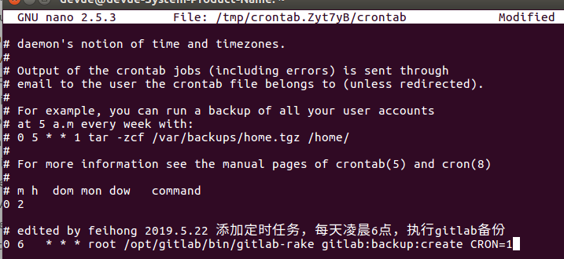
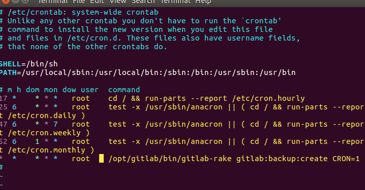
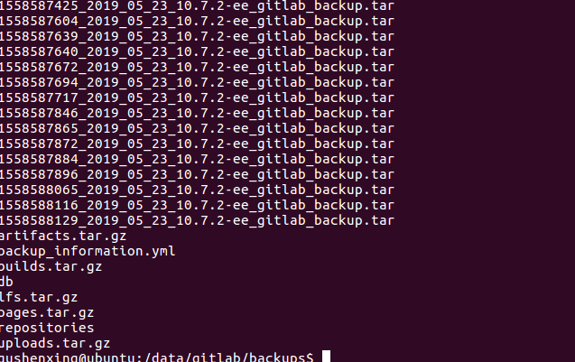

# 前端必须会的gitlab的操作——安装和备份

[原文地址](https://github.com/qiufeihong2018/vuepress-blog/tree/master/docs/technical-summary/gitlab)欢迎star

## 结果
- 在新服务器上安装并搭建好gitlab;
- 将原服务器上的gitlab备份到新服务器上;
- 自动备份;
- 逾期删除备份。

## todo
- 自动发送备份压缩包至新服务器;
- 自动将压缩包备份

## 前提
- 如果不是root用户请在命令前+sudo;
- 新老服务器gitlab版本保持一致。
- 我用的是`gitlab-ee_10.7.2-ee.0_amd64.deb`版本的gitlab


## 安装gitlab

- gitlab-ce是社区版

- gitlab-ee是企业版

### 官网安装gitlab
首先想用gitlab官网安装gitlab

请戳[gitlab的官方网站](https://about.gitlab.com/install/)


由于的我系统是ubuntu，所以我选择ubuntu
安装步骤就出现在下面了
> 安装和配置必须的依赖
```bash
sudo apt-get update
sudo apt-get install -y curl openssh-server ca-certificates
```
下一步，安装`Postfix`来发送通知邮件。如果你想要用另一个方式去发送邮件，请在gitlab安装好后，下一步就是配置一个额外的SMTP服务。
```bash
sudo apt-get install -y postfix
```
在安装`Postfix`时一个配置屏幕会出现。选择`Internet Site`并且回车。`mail name`为你的服务器的DNS并且回车。如果额外的屏幕出现，继续接受默认配置并且回车。

> 添加gitlab安装包仓库并安装
添加gitlab包仓库
```bash
curl https://packages.gitlab.com/install/repositories/gitlab/gitlab-ee/script.deb.sh | sudo bash
```

下一步，安装gitlab包。选择`https://gitlab.example.com`更改为要访问gitlab实例的url。安装将自动配置并启动gitlab到url。

为了`https://`gitlab将自动请求带有`Let's Encrypt`的证书，这需要入栈http访问和有效的主机名。
```bash
sudo EXTERNAL_URL="https://gitlab.example.com" apt-get install gitlab-ee
```
此时你会发现慢的要死，速度是100k/s，毕竟两者隔了一堵墙。

### 清华镜像安装gitlab
[Gitlab Community Edition 镜像使用帮助](https://mirror.tuna.tsinghua.edu.cn/help/gitlab-ce/)

既然官网太慢，那么我们选择清华镜像安装gitlab，我这边是速度达到30mb/s。

[清华大学开源软件镜像站](https://mirrors.tuna.tsinghua.edu.cn/)


里面有各种版本

备份需要和原服务器的gitlab版本一致，否则无法安装。

在搜索栏里搜索gitlab，就会跳出相关gitlab的版本。

我的`gitlab-ee_10.7.2-ee.0_amd64.deb`版本在`/ubuntu/pool/bionic/main/g/gitlab-ee/`下

或者是直接访问`https://mirrors.tuna.tsinghua.edu.cn/gitlab-ee/ubuntu/pool/bionic/main/g/gitlab-ee/`到gitlab-ee版本下，

直接访问`https://mirrors.tuna.tsinghua.edu.cn/gitlab-ce/ubuntu/pool/bionic/main/g/gitlab-ce/`到gitlab-ce版本下。


> 先更新仓库
```bash
sudo apt-get update
```

> 加入gitlab的GPG公钥
```bash
curl https://packages.gitlab.com/gpg.key 2> /dev/null | sudo apt-key add - &>/dev/null
```
> 写进再选择你的 Debian/Ubuntu 版本

文本框中内容写进`/etc/apt/sources.list.d/gitlab-ce.list`,

我是写进`/etc/apt/sources.list.d/gitlab-ee.list`,

写`deb https://mirrors.tuna.tsinghua.edu.cn/gitlab-ee/ubuntu xenial main`

安装 gitlab-ee:
```bash
sudo apt-get update
sudo apt-get install gitlab-ee=10.7.2-ee.0
```
更新apt仓库

下载`gitlab-ee_10.7.2-ee.0`

这样就安装了10.7.2-ee.0版本了。

### 断口被占用
端口80以及端口8080分别被Ubuntu服务器上的Apache、Tomcat和nginx等服务所占用。

我的做法是修改 /etc/gitlab/gitlab.rb 文件


```bash
vim /etc/gitlab/gitlab.rb
```


### 配置并启动gitlab
```bash
sudo gitlab-ctl reconfigure
```

有时候，像上面步骤修改了GitLab的ip地址一样,临时修改了GitLab的配置之后，得执行如下的命令，应用重新配好的配置并重启GitLab,然后查看GitLab的状态
```bash
sudo gitlab-ctl reconfigure
sudo gitlab-ctl restart
sudo gitlab-ctl status
```
打开浏览器，默认是访问本机ip即可。如果改了端口，则访问ip+端口


## gitlab创建备份
### 修改gitlab备份地址
打开原gitlab服务器终端，通过修改`gitlab.rc`配置文件来修改默认存放备份文件的目录

```bash
sudo vim /etc/gitlab/gitlab.rc
```

默认如下：
```bash
gitlab_rails['backup_path'] = "/var/opt/gitlab/backups"
```

将`backup_path`改为自定义的目录

```bash
gitlab_rails['backup_path'] = "/data/gitlab/backups"
```


修改后重载配置文件

```bash
sudo gitlab-ctl reconfigure
```

### gitlab开始备份
通过命令来备份原服务器上gitlab的数据。
```bash
sudo gitlab-rake gitlab:backup:create
```


备份的文件会放在`data/gitlab/backups`下，名称类似于`1558509153_2019_05_22_10.7.2-ee_gitlab_backup.tar`，这个压缩包包含了gitlab备份的时间和版本。

### 将备份文件scp到新服务器上
通过scp命令

不会请戳[Linux scp命令](https://www.runoob.com/linux/linux-comm-scp.html)
```bash
scp 1558509153_2019_05_22_10.7.2-ee_gitlab_backup.tar gitlab-backup@192.168.3.113:/var/opt/gitlabs/backups
```
如果无法拷贝到该目录下，则先拷贝到`tmp`目录下。
由于backups不是一个可以编辑的目录，所以不能直接拷贝到该目录下。那就先将backups迁移到backup下，然后创建backups目录，存放备份文件。

> 注意，backups目录的只有root才能操作的，但是gitlab恢复操作使用者是git


贸然恢复，就会出现以下错误


正确操作是降低backups操作权限
```bash
sudo chown git backups/
sudo chmod 700 backups/
```

### 修改备份文件权限
为了避免gitlab恢复时，由于权限，而产生不能解压的问题,我们就将备份文件权限改为777
```bash
chmod 777 1558509153_2019_05_22_10.7.2-ee_gitlab_backup.tar
```

### 停止相关数据连接服务
```bash
sudo gitlab-ctl stop unicorn
sudo gitlab-ctl stop sidekiq
```

### 从备份文件恢复gitlab
```bash
sudo gitlab-rake gitlab:backup:restore BACKUP=1558509153_2019_05_22_10.7.2-ee
```
安装开始
- 是否丢掉之前的仓库


- 是否丢掉之前的key文件


- 安装成功


### 开启gitlab，并访问

```bash
sudo gitlab-ctl start
```

打开浏览器，访问gitlab


## gitlab自动备份
### 定时自动备份
不会crontab，请戳[Linux crontab命令](https://www.runoob.com/linux/linux-comm-crontab.html)

- 添加定时任务，每天凌晨6点执行gitlab备份
```bash
crontab -e
```
加入
```bash
# edited by feihong 2019.5.22 添加定时任务，每天凌晨6点，执行gitlab备份
0 6 * * * root /opt/gitlab/bin/gitlab-rake gitlab:backup:create CRON=1
```



- 添加定时任务,每分钟执行gitlab备份
```bash
sudo vim /etc/crontab
```
加入
```bash
* * * * * root /opt/gitlab/bin/gitlab-rake gitlab:backup:create CRON=1
```


编写完 /etc/crontab 文件之后，需要重新启动cron服务
```bash
#重新加载cron配置文件
sudo /usr/sbin/service cron reload
#重启cron服务
sudo /usr/sbin/service cron restart
```

过了一天后，gitlab访问不了了，服务器炸了

看了下备份目录



猴塞雷……赶紧将他们删了

然后将定时备份的时间跳到每天6点
```bash
0 6 * * * root /opt/gitlab/bin/gitlab-rake gitlab:backup:create CRON=1
```

注意：6之前是0,而不是*
最后需要重新启动cron服务

### 设置备份过期时间
就算是每天6点备份，一年下来也有356份，那也不得了了

那就可以设置备份过期时间，备份目录下只保存还没过期的压缩包，大大减轻了服务器的压力

通过编辑`/etc/gitlab/gitlab.rb`配置文件,找到`gitlab_rails[‘backup_keep_time’]`

我设置了7天内不过期


## 参考文献

[gitlab官网](https://about.gitlab.com/install/#ubuntu)

[ubuntu16.04中gitlab安装](https://blog.csdn.net/weixin_38883338/article/details/82153402)

[gitlab自动备份](https://www.jianshu.com/p/a176789fef21)

[【git学习】在CenterOS系统上恢复GitLab时出现错误：tar: 由于前次错误，将以上次的错误状态退出 unpacking backup
failed](https://www.jianshu.com/p/8a287f31a646)

[如何查看 GitLab 版本号](https://blog.csdn.net/wo18237095579/article/details/81106150)

[Linux上Gitlab卸载](https://www.jianshu.com/p/e2e98c45c244)

[git学习------> Gitlab如何进行备份恢复与迁移？](https://blog.csdn.net/ouyang_peng/article/details/77070977)

[【git学习】在CenterOS系统上安装GitLab并自定义域名访问GitLab管理页面](https://blog.csdn.net/ouyang_peng/article/details/72903221)