# GitLab从安装到全自动化备份一条龙

[原文地址](https://github.com/qiufeihong2018/vuepress-blog/tree/master/docs/technical-summary/gitlab)欢迎star

## 需求
1. 在新服务器上安装并搭建好gitlab
2. 手动+自动将旧服务器上的gitlab备份
3. 手动+自动将gitlab备份包scp到新服务器上
4. 手动+自动恢复新服务器上的gitlab备份包
5. 在新旧服务器上自动删除过期备份包

## 前提

1. 版本
- gitlab-ce是社区版
- gitlab-ee是企业版

2. 方案
- 定时器执行shell脚本

3. 工具
- [crontab](https://www.runoob.com/linux/linux-comm-crontab.html)
- [shell](https://www.runoob.com/linux/linux-shell.html)
- [expect](https://www.cnblogs.com/lixigang/articles/4849527.html)

4. 操作
- 如果不是root用户请在所有命令前+sudo
- 新老服务器gitlab版本保持一致
- 旧服务器用的是`gitlab-ee_10.7.2-ee.0_amd64.deb`版本的gitlab,示例也选择这个企业版

5. backups目录的只有root才能操作的，但是gitlab恢复操作使用者是git

所以将新旧服务器上`/var/opt/gitlab/backups`文件夹设置为可读可写可执行,方便操作
```bash
sudo chmod 777 backups/
```


现在开始,我会一步一步操作,带领大家一条龙从安装到自动化备份,最终实现再也不要被gitlab备份困扰的问题且可以专心敲代码的梦想

## 在新服务器上安装并搭建好gitlab
1. 安装方式一:官网安装(慢)
2. 安装方式二:国内镜像安装(快)

### 官网安装gitlab
请戳[gitlab的官方网站](https://about.gitlab.com/install/)


由于的我系统是ubuntu，所以我选择ubuntu
安装步骤就出现在下面了
1. 安装和配置必须的依赖
```bash
sudo apt-get update
sudo apt-get install -y curl openssh-server ca-certificates
```
2. 安装`Postfix`来发送通知邮件。如果你想要用另一个方式去发送邮件，请在gitlab安装好后，下一步就是配置一个额外的SMTP服务。
```bash
sudo apt-get install -y postfix
```
在安装`Postfix`时一个配置屏幕会出现。选择`Internet Site`并且回车。`mail name`为你的服务器的DNS并且回车。如果额外的屏幕出现，继续接受默认配置并且回车。

3. 添加gitlab安装包仓库并安装
添加gitlab包仓库
```bash
curl https://packages.gitlab.com/install/repositories/gitlab/gitlab-ee/script.deb.sh | sudo bash
```

4. 安装gitlab包。选择`https://gitlab.example.com`更改为要访问gitlab实例的url。安装将自动配置并启动gitlab到url。

为了`https://`gitlab将自动请求带有`Let's Encrypt`的证书，这需要入栈http访问和有效的主机名。
```bash
sudo EXTERNAL_URL="https://gitlab.example.com" apt-get install gitlab-ee
```
此时你会发现慢的要死，速度是100k/s，毕竟两者隔了一堵墙,那就换国内镜像安装吧

### 清华镜像安装gitlab

既然官网太慢，那么我们选择清华镜像安装gitlab

[清华大学开源软件镜像站](https://mirrors.tuna.tsinghua.edu.cn/)

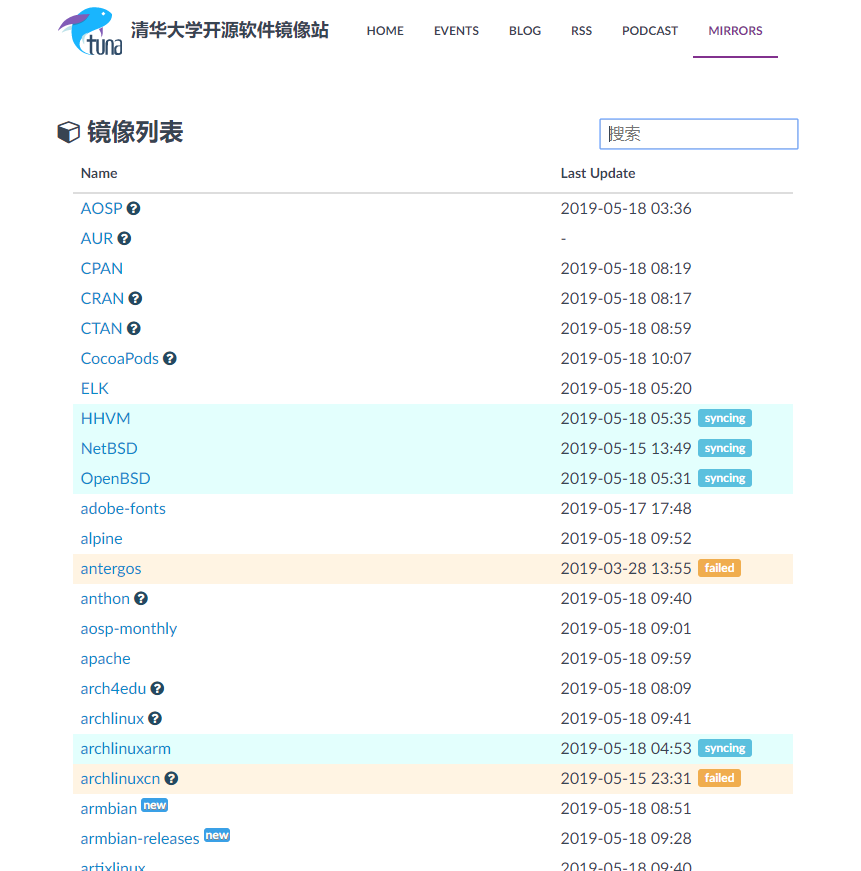

[Gitlab Community Edition 镜像使用帮助](https://mirror.tuna.tsinghua.edu.cn/help/gitlab-ce/)

里面有各种版本

备份需要和原服务器的gitlab版本一致，否则无法安装

在搜索栏里搜索gitlab，就会跳出相关gitlab的版本

`gitlab-ee_10.7.2-ee.0_amd64.deb`版本在`/ubuntu/pool/bionic/main/g/gitlab-ee/`下

或者是直接访问到[gitlab-ee](https://mirrors.tuna.tsinghua.edu.cn/gitlab-ee/ubuntu/pool/bionic/main/g/gitlab-ee/)版本下，

直接访问到[gitlab-ce](https://mirrors.tuna.tsinghua.edu.cn/gitlab-ce/ubuntu/pool/bionic/main/g/gitlab-ce/)版本下。


1. 先更新仓库
```bash
sudo apt-get update
```

2. 加入gitlab的GPG公钥
```bash
curl https://packages.gitlab.com/gpg.key 2> /dev/null | sudo apt-key add - &>/dev/null
```

3. 写进再选择你的 Debian/Ubuntu 版本

文本框中内容写进`/etc/apt/sources.list.d/gitlab-ce.list`,

我是写进`/etc/apt/sources.list.d/gitlab-ee.list`,

写`deb https://mirrors.tuna.tsinghua.edu.cn/gitlab-ee/ubuntu xenial main`

4. 更新apt仓库,安装 gitlab-ee
```bash
sudo apt-get update
sudo apt-get install gitlab-ee=10.7.2-ee.0
```
   
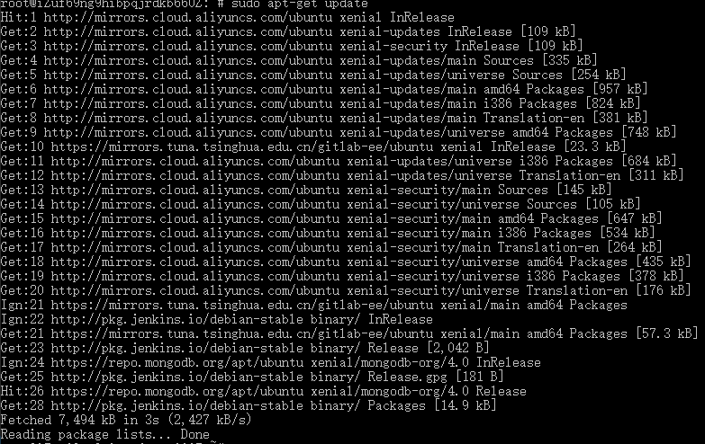

下载`gitlab-ee_10.7.2-ee.0`

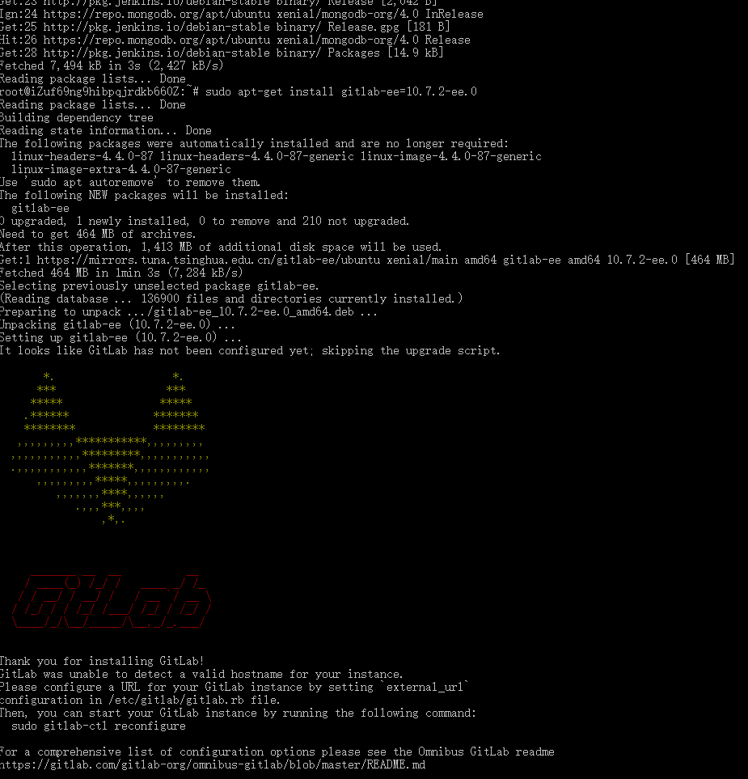

这样就安装了10.7.2-ee.0版本了。

### 配置并启动gitlab
```bash
sudo gitlab-ctl reconfigure
```
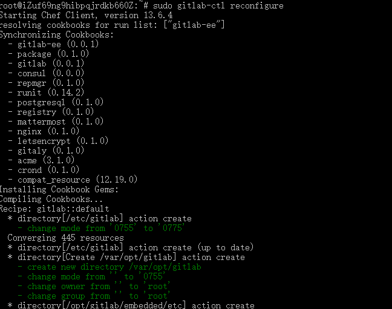

每当修改了GitLab的配置之后，都要执行如下的命令，重启配好的配置并重启GitLab,然后查看GitLab的状态

```bash
sudo gitlab-ctl reconfigure
sudo gitlab-ctl restart
sudo gitlab-ctl status
```

打开浏览器，默认是访问`http://localhost`即可。如果改了ip和端口，则访问`http://ip:端口`既可


这就是新搭建的gitlab

### 安装gitlab出现的问题
#### 断口被占用
端口80以及端口8080分别被Ubuntu服务器上的Apache、Tomcat和nginx等服务所占用。

我的做法是修改 /etc/gitlab/gitlab.rb 文件

```bash
vim /etc/gitlab/gitlab.rb
```
修改其中的external_url

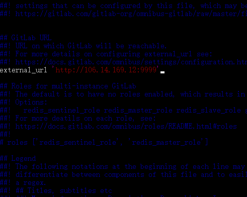

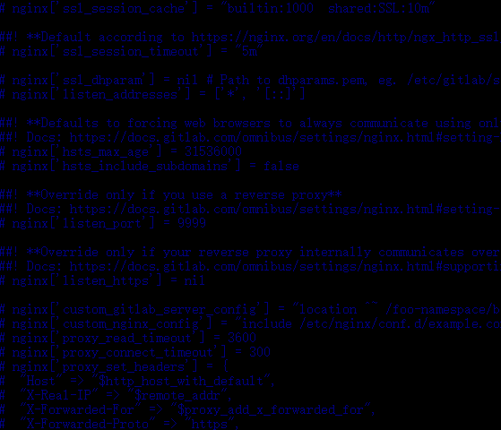


## 手动将旧服务器上的gitlab备份
### 修改gitlab备份地址
备份地址默认是在`var/opt/gitlab/backups`

1. 打开原gitlab服务器终端，通过修改`gitlab.rb`配置文件来修改默认存放备份文件的目录

```bash
sudo vim /etc/gitlab/gitlab.rb
```

2. 默认如下
```bashhttps://www.cnblogs.com/qlwy/archive/2011/06/26/2121919.html
gitlab_rails['backup_path'] = "/var/opt/gitlab/backups"
```

3. 将`backup_path`改为自定义的目录

```bash
gitlab_rails['backup_path'] = "/data/gitlab/backups"
```
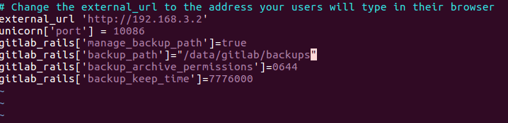

4. 修改后重启配置文件

```bash
sudo gitlab-ctl reconfigure
```

我的示例里是没有改,备份的时间倒是改成了7天
> /etc/gitlab/gitlab.rb
```bash
# Change the external_url to the address your users will type in their browser
external_url 'http://192.168.3.2'
unicorn['port'] = 10086
gitlab_rails['manage_backup_path']=true
gitlab_rails['backup_path']="var/opt/gitlab/backups"
gitlab_rails['backup_archive_permissions']=0644
gitlab_rails['backup_keep_time']=604800
```
### 重启配置出现的问题

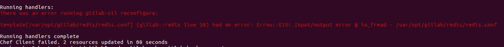

出现这个radis的问题,不知道如何解决,有大佬知道,求告知,但是不影响备份

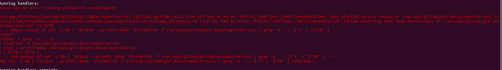

这个问题是由于,我执行了`sudo chmod -R 777 gitlab`的命令,将gitlab的子目录下的所有文件都赋予了可读可写可执行的权限

解决方式
```bash
sudo chmod -R 2770 /var/opt/gitlab/git-data/repositories
```

### gitlab开始备份

通过命令来备份原服务器上gitlab的数据。
```bash
sudo gitlab-rake gitlab:backup:create
```
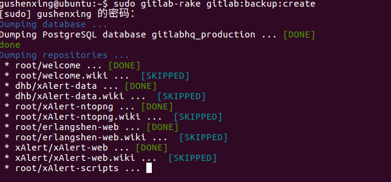

备份的文件会放在`var/opt/gitlab/backups`下，名称类似于`1558509153_2019_05_22_10.7.2-ee_gitlab_backup.tar`，这个压缩包包含了gitlab备份的时间和版本。

可以看到backups下面的备份包


## 手动将gitlab备份包scp到新服务器上
通过scp命令

不会请戳[Linux scp命令](https://www.runoob.com/linux/linux-comm-scp.html)
```bash
scp 1559635752_2019_06_04_10.7.2-ee_gitlab_backup.tar  gitlab-backup@192.168.3.113:/var/opt/gitlab/backups
```
在新服务器中`/var/opt/gitlab/backups`下就出现了新的备份包

### 重启发现所有备份包和脚本都清除的问题
之前由于backups权限问题,我将备份包发送到/tmp目录下,

重启电脑时,linux自动清除/tmp文件夹下的内容

原因是tmp是一个特殊的文件夹，系统会自动清理，所以大家最好不要把文件放到这个地方，被清理了就不好了。

## 手动恢复新服务器上的gitlab备份包

### 修改备份文件权限

如果没有修改backups目录的权限,会出现下面问题

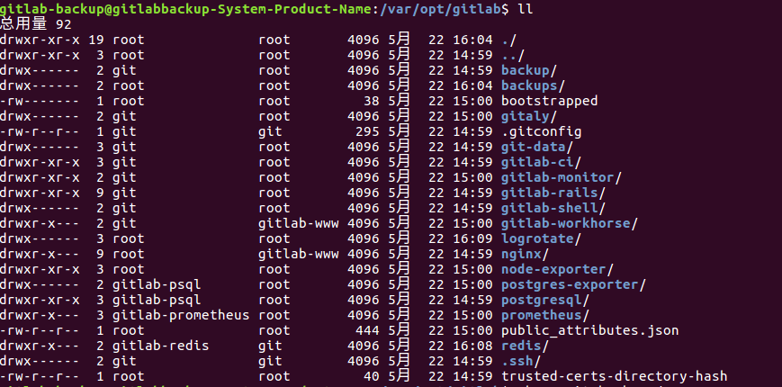

贸然恢复，就会出现以下错误
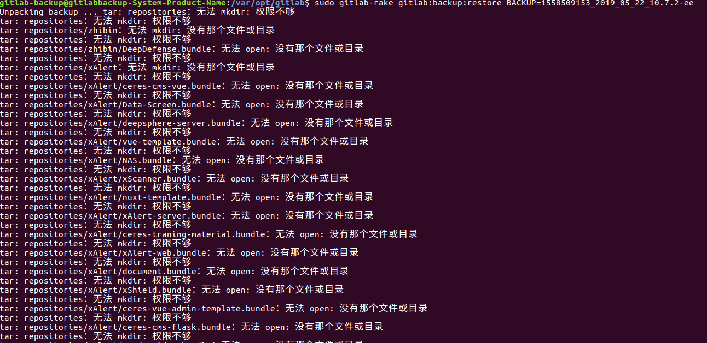

正确操作是降低backups操作权限
```bash> backups目录的只有root才能操作的，但是gitlab恢复操作使用者是git

sudo chown git backups/
sudo chmod 700 backups/
```

为了避免gitlab恢复时，由于权限，而产生不能解压的问题,我们就将备份文件权限改为777(可读可写)
```bash
chmod 777 1558509153_2019_05_22_10.7.2-ee_gitlab_backup.tar
```

### 停止相关数据连接服务
```bash
sudo gitlab-ctl stop unicorn
sudo gitlab-ctl stop sidekiq
```

### 从备份文件恢复gitlab
BACKUP等于gitlab版本号,`_gitlab_backup.tar`是会默认添加的
```bash
sudo gitlab-rake gitlab:backup:restore BACKUP=1558509153_2019_05_22_10.7.2-ee
```
安装开始,一共有两个交互
1. 是否丢掉之前的仓库


2. 是否丢掉之前的key文件

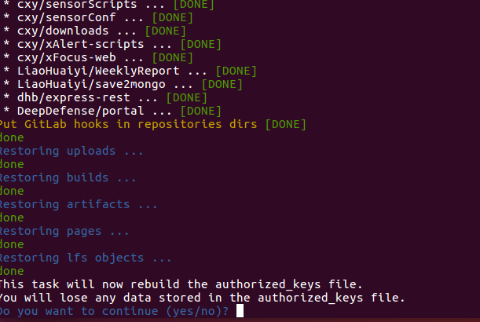
3 安装成功

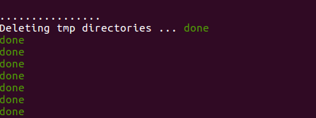

### 开启gitlab，并访问

```bash
sudo gitlab-ctl start
```

打开浏览器，访问gitlab

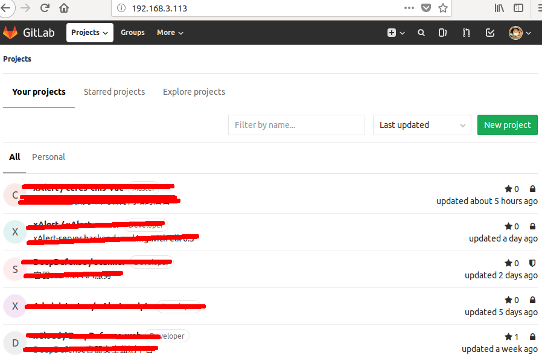

## 自动将旧服务器上的gitlab备份
旧服务器上的`/var/opt/gitlab`目录

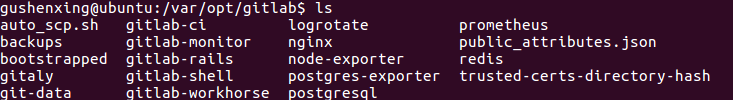

### 定时备份

添加定时任务，每天凌晨6点执行gitlab备份

```bash
# 仇飞鸿编辑于2019-5-30 添加定时任务，每天6点，自动执行将旧服务器上的gitlab备份操作
0  6    * * *   root    /opt/gitlab/bin/gitlab-rake gitlab:backup:create CRON=1
```

编写完 /etc/crontab 文件之后，需要重新启动cron服务
```bash
#重新加载cron配置文件
sudo /usr/sbin/service cron reload
#重启cron服务
sudo /usr/sbin/service cron restart
```

注意：6之前是0,而不是*
最后需要重新启动cron服务

### 设置备份过期时间
就算是每天6点备份，一年下来也有356份，那也不得了了

那就可以设置备份过期时间，备份目录下只保存还没过期的压缩包，大大减轻了服务器的压力

通过编辑`/etc/gitlab/gitlab.rb`配置文件,找到`gitlab_rails[‘backup_keep_time’]`

```bash
sudo vim /etc/gitlab/gitlab.rb
```
将`gitlab_rails[‘backup_keep_time’]`改为`gitlab_rails[‘backup_keep_time’]=604800`

我设置了7天内不过期

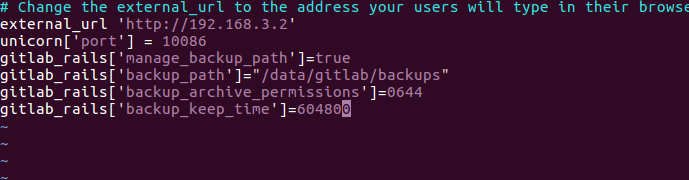

## 自动将gitlab备份包scp到新服务器上
### 新旧服务器配对密钥
由于scp总是出现交互,提示输入密码

方案一:配对密码,取消密码

方案二:expect自动交互

这里我们采取方案一

### 生成密钥对
在旧服务器上,输入命令
```bash
ssh-keygen -t rsa
```
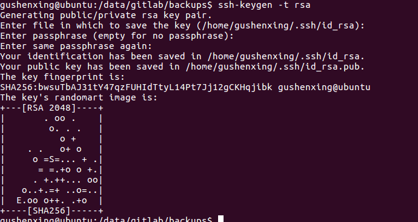

1. 生成的过程中提示输入密钥对保存位置，直接回车，接受默认值就行了。 
2. 因为之前已经有/root/.ssh/id_rsa 文件存在，因此提示你是否覆盖，输入y表示覆盖 
3. 接着会提示输入一个密码，直接回车，让它空着。当然，也可以输入一个密码。 
4. 接着输入确认密码，输入完之后，回车密钥对就生成完了。


> 在/root/.ssh下生成id_rsa 和 id_rsa.pub 两个文件， 
其中公共密钥保存在 /root/.ssh/id_rsa.pub，私有密钥保存在/root/.ssh/id_rsa。

```bash
cd /home/gushenxing/.ssh/
```
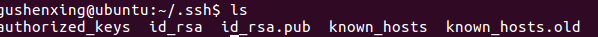

### 在旧服务器上cp生成rsa公钥证书给新服务器
然后在/root/.ssh下复制备份一份id_rsa.pub 命名为 id_rsa.pub.A，以便拷贝到新服务器。

执行cp命令复制
```bash
cp id_rsa.pub id_rsa.pub.A
```


执行scp命令传输
```bash
scp id_rsa.pub.A gitlab-backup@192.168.3.113:/home/gitlab-backup/.ssh
```
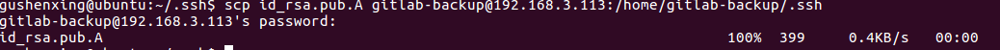

进入新服务器查看公钥


这里使用scp命令需要输入密码，当我们把下面的第三步执行完毕之后，以后旧服务器使用scp命令复制文件到新服务器的话，就不需要再次输入密码。

### 密钥配对
#### 创建authorized_keys文件
当第二步将旧服务器上的id_rsa.pub.A 文件copy到新服务器的目录/root/.ssh下


我们在新服务器的/root/.ssh下创建authorized_keys文件，使用如下命令
```bash
touch authorized_keys
```
#### 将id_rsa.pub.A文件内容追加到authorized_keys 文件中
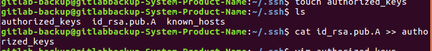

打开`authorized_keys`查看

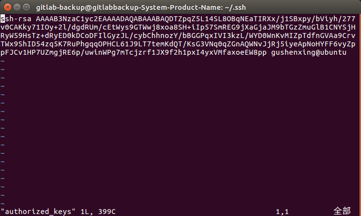

####  修改authorized_keys文件的权限
修改authorized_keys文件的权限

> authorized_keys文件的权限很重要，如果设置为777，那么登录的时候，还是需要提供密码的。


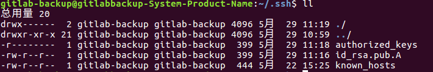

#### 测试
在旧服务器上使用scp命令复制文件到新服务器上是否还需要密码
```bash
scp 1559635752_2019_06_04_10.7.2-ee_gitlab_backup.tar gitlab-backup@192.168.3.113:/var/opt/gitlab/backups
```
在新服务器上，再次使用刚才的命令，发现已经可以不需要输入密码
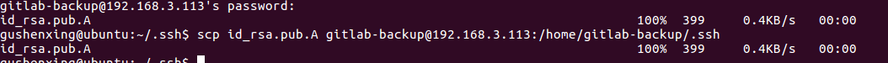

### 创建Shell定时远程备份脚本
#### 在新服务器上创建定时远程备份脚本

创建自动scp的脚本和日志目录
```bash
cd /var/opt/gitlab
touch auto_scp.sh
cd /backups
sudo mkdir log
```

因为到时候，我们会将该定时远程备份脚本auto_scp.sh执行的时间，放到Gitlab自动备份脚本auto_scp.sh之后的一小时之内，因此我们只需要每次执行远程备份脚本auto_scp.sh的时候，只需要cp一个小时之内的生成的新的Gitlab备份文件。


> auto_scp.sh

```bash
#!/bin/bash

# 新旧服务器 gitlab备份文件存放路径 
BACKUPDIR=/var/opt/gitlab/backups

# 远程备份服务器 登录账户 
RemoteUser=gitlab-backup

# 远程备份服务器 IP地址 
RemoteIP=192.168.3.113

#当前系统日期 
DATE=`date "+%Y-%m-%d-%H-%M-%S"`

#Log存放路径
LogFile=$BACKUPDIR/log/$DATE.log

#查找本地备份目录下时间为1天之内并且后缀为.tar的gitlab备份文件
BACKUPFILE_SEND_TO_REMOTE=$(find $BACKUPDIR -type f -mmin -1440 -name '*.tar')

#新建日志文件
touch $LogFile

#追加日志到日志文件
echo "---------------------------------开始-----------------------------------" >> $LogFile

echo "gitlab auto backup to remote server, start at $DATE" >> $LogFile

echo "---------------------------------分割线---------------------------------" >> $LogFile

#输出日志，打印出每次scp的文件名
echo "the file to scp to remote server is $BACKUPFILE_SEND_TO_REMOTE" >> $LogFile

#备份到远程服务器
scp $BACKUPFILE_SEND_TO_REMOTE $RemoteUser@$RemoteIP:$BACKUPDIR
echo "---------------------------------分割线---------------------------------" >> $LogFile

echo "remote server is $RemoteUser@$RemoteIP:$BACKUPDIR" >> $LogFile

#追加日志到日志文件
echo "---------------------------------结束-----------------------------------" >> $LogFile
~                      
```
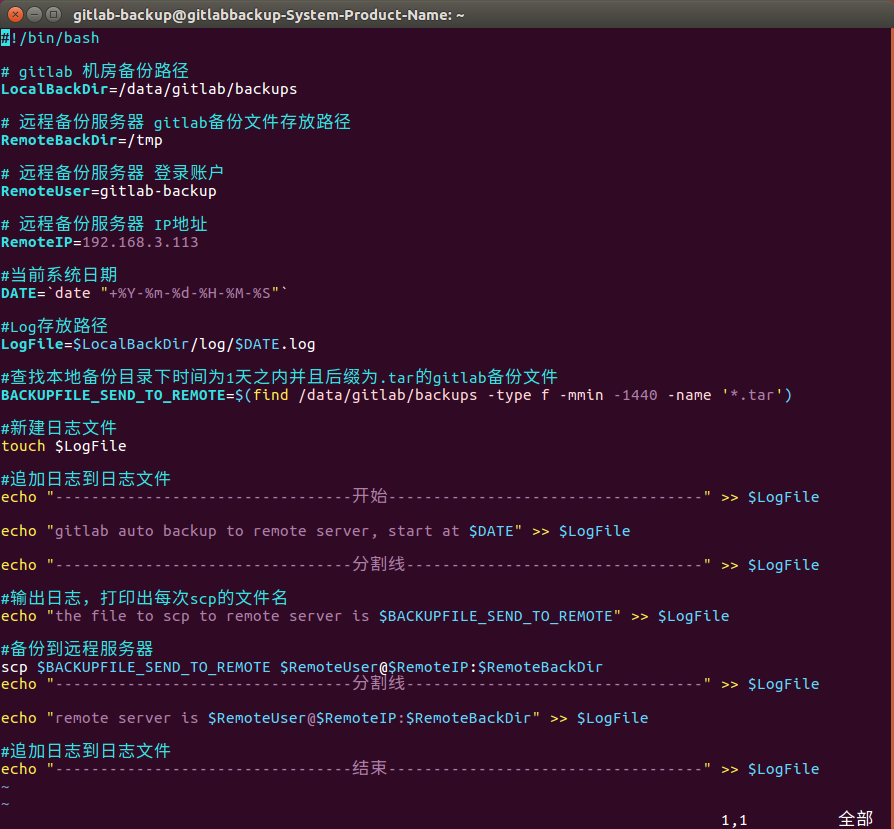

#### 测试
由于auto_scp.sh执行权限是root,所以还得要交互密码
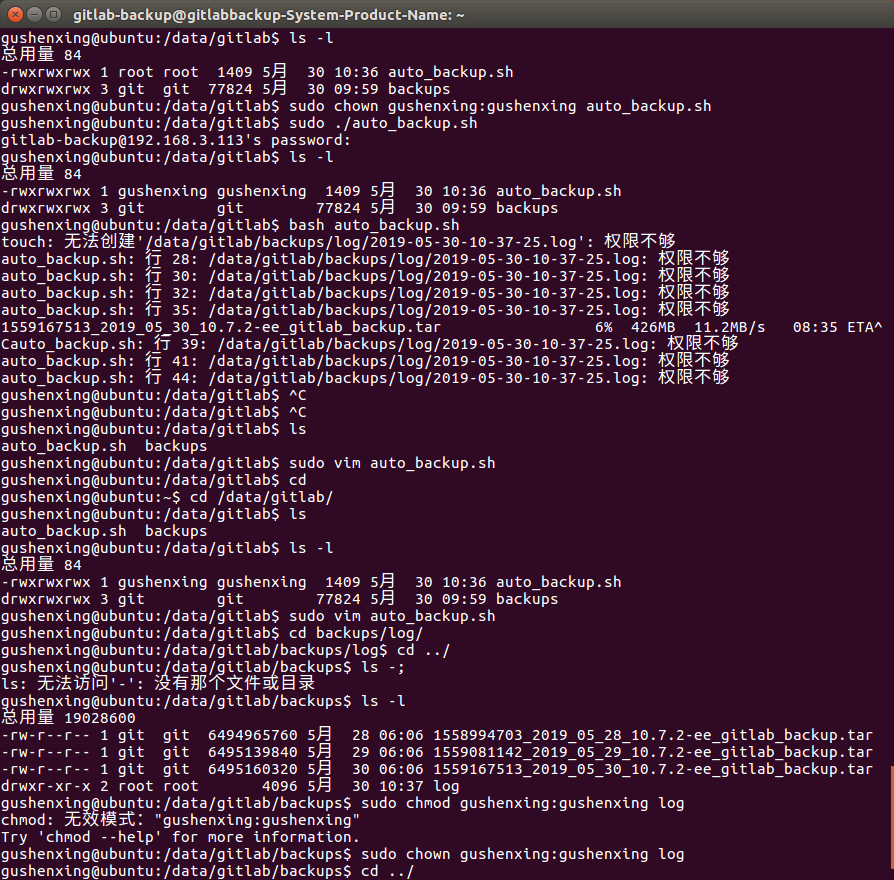

降低auto_scp.sh和log的权限
```bash
sudo chown gushenxing:gushenxing auto_scp.sh 
sudo chown gushenxing:gushenxing log
```
1. 执行命令,不要sudo执行
```bash
bash auto_scp.sh 
```
此时不需要密码

2. 查看日志文件
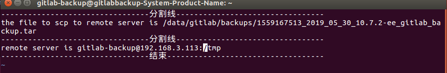

3. 发现新服务器上已经出现了备份包
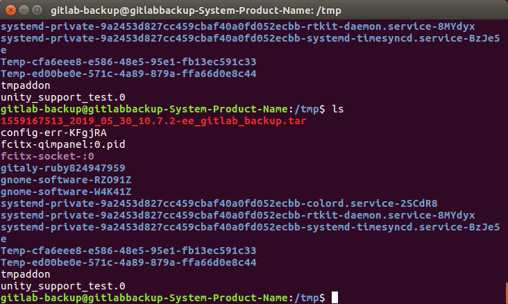


### 往crontab添加定时任务,自动执行scp脚本
```bash
sudo vim /etc/crontab
```
添加下面命令

```bash
# 仇飞鸿编辑于2019-6-04 添加定时任务，每天7点，自动执行将gitlab备份包scp到新服务
器上的操作
0  7    * * *   gushenxing    /var/opt/gitlab/auto_scp.sh
```

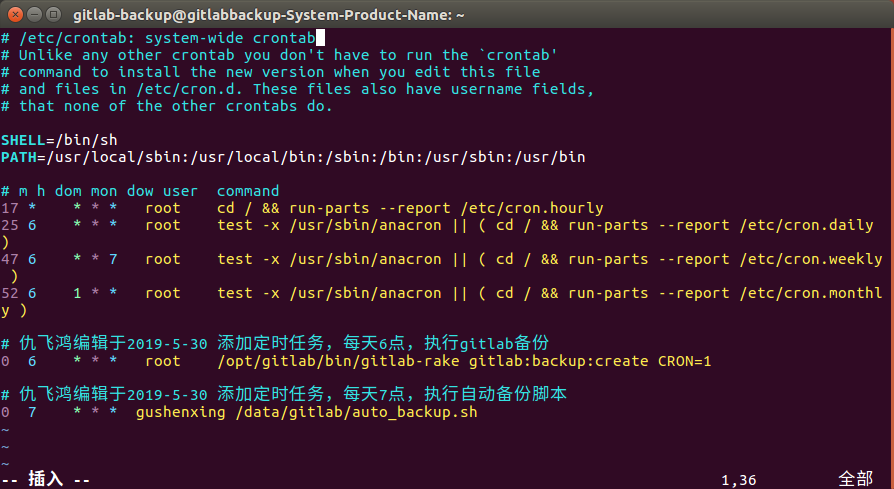

编写完 /etc/crontab 文件之后，需要重新启动cron服务

```bash
#重新加载cron配置文件
sudo /usr/sbin/service cron reload
#重启cron服务
sudo /usr/sbin/service cron restart
```

旧服务器上的操作已结束,完成了自动将旧服务器上的gitlab备份和自动将gitlab备份包scp到新服务器上

## 自动恢复新服务器上的gitlab备份包

### 自动删除过期备份包脚本
```bash
cd /var/opt/gitlab
sudo touch auto_remove_backup.sh
```
填写脚本代码
```bash
#!/bin/bash

#远程备份服务器gitlab备份文件存放路径
GITLABDIR=/var/opt/gitlab/backups

# 查找远程备份路径下，超过7天且文件后缀为.tar的gitlab备份文件，然后删除
find $GITLABDIR -type f -mtime +7 -name '*.tar' -exec rm {} \;
```

### 往crontab添加定时任务,自动执行删除备份包脚本
```bash
sudo vim /etc/crontab
```
添加下面命令
```bash
# 仇飞鸿编辑于2019-5-30 添加定时任务，每天上午8点,自动执行删除过期的gitlab备份文件操作
0  8    * * *   root    /var/opt/gitlab/auto_remove_backup.sh
```

编写完 /etc/crontab 文件之后，需要重新启动cron服务

```bash
#重新加载cron配置文件
sudo /usr/sbin/service cron reload
#重启cron服务
sudo /usr/sbin/service cron restart
```
### 自动恢复脚本
```bash
cd /var/opt/gitlab
sudo touch auto_recovery_backup.sh
```


```bash
#!/bin/bash

#备份文件所在目录
REMOTEDIRBACKUPS=/var/opt/gitlab/backups

#找到当日生成的备份文件
BACKUPFILE=$(sudo find ./ -mtime -1 -name '*.tar')

#当前系统日期 
DATE=`date "+%Y-%m-%d-%H-%M-%S"`

#Log存放路径
LogFile=$REMOTEDIRBACKUPS/log/$DATE.log

#新建日志文件
sudo touch $LogFile

#追加日志到日志目录
echo "---------------------------------开始-----------------------------------" >> $LogFile

echo "gitlab auto recovery, start at $DATE" >> $LogFile

echo "---------------------------------分割线---------------------------------" >> $LogFile

#输出日志，打印出当日生成的备份文件
echo "backup files generated on that day is $BACKUPFILE" >> $LogFile


#截取出主要文件名
FILE=$(echo ${BACKUPFILE#*backups/})

#截取恢复文件名
RESTOREFILE=$(echo ${FILE%_gitlab*})


echo "---------------------------------分割线---------------------------------" >> $LogFile

#输出日志，打印出备份文件复制目标目录
echo "backup files generated scp to $REMOTEDIRBACKUPS" >> $LogFile

#进入到目标目录
cd $REMOTEDIRBACKUPS

#备份文件权限修改为可读可写可执行
chmod 777 $FILE

#停止相关数据连接服务
sudo gitlab-ctl stop unicorn
sudo gitlab-ctl stop sidekiq

#自动化交互,从备份文件恢复gitlab
sudo /usr/bin/expect -c " 
set timeout -1
spawn sudo gitlab-rake gitlab:backup:restore BACKUP=$RESTOREFILE
expect {
\"yes/no\" {set timeout -1; send \"yes\n\";exp_continue;}
\"yes/no\" {set timeout -1; send \"yes\n\"}
}

expect eof"
#开启gitlab
sudo gitlab-ctl start

echo "---------------------------------分割线---------------------------------" >> $LogFile

#输出日志，从备份文件恢复gitlab
echo "recovery was successful" >> $LogFile

#追加日志到日志目录
echo "---------------------------------结束-----------------------------------" >> $LogFile


```
其中加入自动交互expect

测试

执行结果

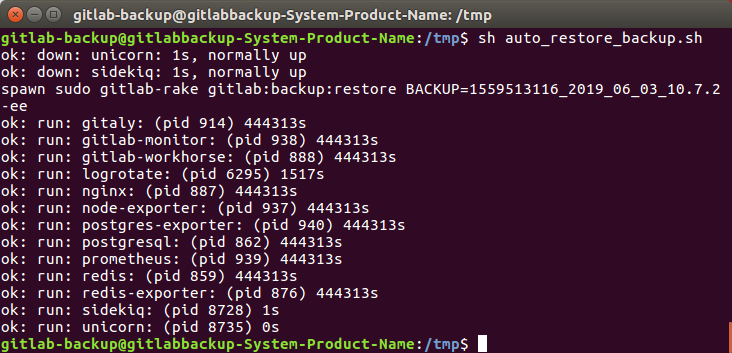

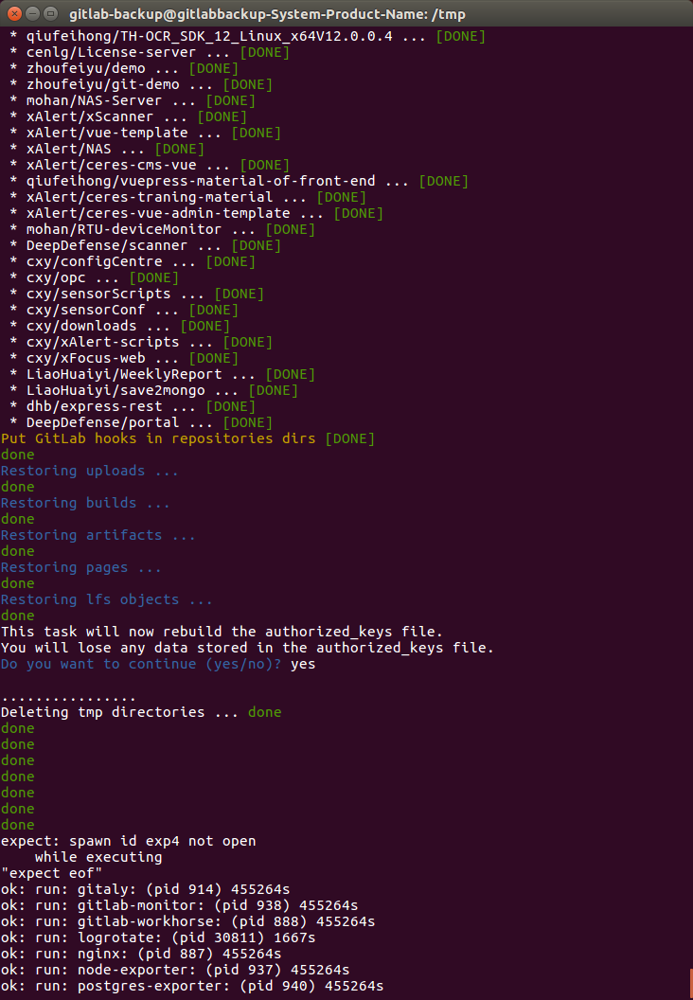

### 往crontab添加定时任务,自动执行恢复备份包脚本
```bash
sudo vim /etc/crontab
```
在crontab中加入此定时任务
```bash
# 仇飞鸿编辑于2019-6-3 添加定时任务，每天上午9点,自动执行从备份包中恢复gitlab操作
0  9    * * *   root    /var/opt/gitlab/auto_recovery_backup.sh
```
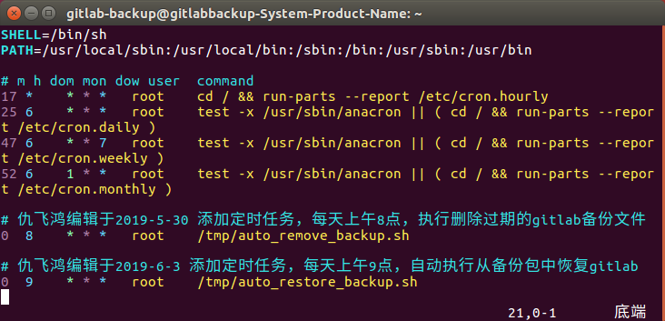
编写完 /etc/crontab 文件之后，需要重新启动cron服务

```bash
#重新加载cron配置文件
sudo /usr/sbin/service cron reload
#重启cron服务
sudo /usr/sbin/service cron restart
```
## 完整版脚本
### 旧服务器上的crontab脚本
```bash
# /etc/crontab: system-wide crontab
# Unlike any other crontab you don't have to run the `crontab'
# command to install the new version when you edit this file
# and files in /etc/cron.d. These files also have username fields,
# that none of the other crontabs do.

SHELL=/bin/sh
PATH=/usr/local/sbin:/usr/local/bin:/sbin:/bin:/usr/sbin:/usr/bin

# m h dom mon dow user  command
17 *    * * *   root    cd / && run-parts --report /etc/cron.hourly
25 6    * * *   root    test -x /usr/sbin/anacron || ( cd / && run-parts --report /etc/cron.daily )
47 6    * * 7   root    test -x /usr/sbin/anacron || ( cd / && run-parts --report /etc/cron.weekly )
52 6    1 * *   root    test -x /usr/sbin/anacron || ( cd / && run-parts --report /etc/cron.monthly )
# 仇飞鸿编辑于2019-5-30 添加定时任务，每天6点，自动执行将旧服务器上的gitlab备份>操作
0  6    * * *   root    /opt/gitlab/bin/gitlab-rake gitlab:backup:create CRON=1

# 仇飞鸿编辑于2019-6-04 添加定时任务，每天7点，自动执行将gitlab备份包scp到新服务
器上的操作
0  7    * * *   gushenxing    /var/opt/gitlab/auto_scp.sh
```
### 新服务器上的crontab脚本
```bash
# /etc/crontab: system-wide crontab
# Unlike any other crontab you don't have to run the `crontab'
# command to install the new version when you edit this file
# and files in /etc/cron.d. These files also have username fields,
# that none of the other crontabs do.

SHELL=/bin/sh
PATH=/usr/local/sbin:/usr/local/bin:/sbin:/bin:/usr/sbin:/usr/bin

# m h dom mon dow user  command
17 *    * * *   root    cd / && run-parts --report /etc/cron.hourly
25 6    * * *   root    test -x /usr/sbin/anacron || ( cd / && run-parts --report /etc/cron.daily )
47 6    * * 7   root    test -x /usr/sbin/anacron || ( cd / && run-parts --report /etc/cron.weekly )
52 6    1 * *   root    test -x /usr/sbin/anacron || ( cd / && run-parts --report /etc/cron.monthly )

# 仇飞鸿编辑于2019-5-30 添加定时任务，每天上午8点,自动执行删除过期的gitlab备份文件操作
0  8    * * *   root    /var/opt/gitlab/auto_remove_backup.sh

# 仇飞鸿编辑于2019-6-3 添加定时任务，每天上午9点,自动执行从备份包中恢复gitlab操作
0  9    * * *   root    /var/opt/gitlab/auto_recovery_backup.sh
```

### 自动将gitlab备份包scp到新服务器脚本`auto_scp.sh`

```bash
#!/bin/bash


# 新旧服务器 gitlab备份文件存放路径 

BACKUPDIR=/var/opt/gitlab/backups


# 远程备份服务器 登录账户 

RemoteUser=gitlab-backup


# 远程备份服务器 IP地址 

RemoteIP=192.168.3.113


#当前系统日期 

DATE=`date "+%Y-%m-%d-%H-%M-%S"`


#Log存放路径

LogFile=$BACKUPDIR/log/$DATE.log


#查找本地备份目录下时间为1天之内并且后缀为.tar的gitlab备份文件

BACKUPFILE_SEND_TO_REMOTE=$(find $BACKUPDIR -type f -mmin -1440 -name '*.tar')


#新建日志文件

touch $LogFile


#追加日志到日志文件

echo "---------------------------------开始-----------------------------------" >> $LogFile


echo "gitlab auto backup to remote server, start at $DATE" >> $LogFile


echo "---------------------------------分割线---------------------------------" >> $LogFile


echo "remote server is $RemoteUser@$RemoteIP:$BACKUPDIR" >> $LogFile


#追加日志到日志文件

echo "---------------------------------结束-----------------------------------" >> $LogFile
```

### 自动执行删除过期的gitlab备份文件脚本`auto_remove_backup.sh`

```bash
#!/bin/bash

#远程备份服务器gitlab备份文件存放路径
GITLABDIR=/var/opt/gitlab/backups

# 查找远程备份路径下，超过7天且文件后缀为.tar的gitlab备份文件，然后删除
find $GITLABDIR -type f -mtime +7 -name '*.tar' -exec rm {} \;

```

### 自动执行从备份包中恢复gitlab脚本`auto_recovery_backup.sh`

```bash
#!/bin/bash


#备份文件所在目录

REMOTEDIRBACKUPS=/var/opt/gitlab/backups


#找到当日生成的备份文件

BACKUPFILE=$(sudo find ./ -mtime -1 -name '*.tar')


#当前系统日期 

DATE=`date "+%Y-%m-%d-%H-%M-%S"`


#Log存放路径

LogFile=$REMOTEDIRBACKUPS/log/$DATE.log


#新建日志文件

sudo touch $LogFile


#追加日志到日志目录

echo "---------------------------------开始-----------------------------------" >> $LogFile


echo "gitlab auto recovery, start at $DATE" >> $LogFile


echo "---------------------------------分割线---------------------------------" >> $LogFile


#输出日志，打印出当日生成的备份文件

echo "backup files generated on that day is $BACKUPFILE" >> $LogFile


#截取出主要文件名
RESTOREFILE=$(echo ${FILE%_gitlab*})


echo "---------------------------------分割线---------------------------------" >> $LogFile


#输出日志，打印出备份文件复制目标目录

echo "backup files generated scp to $REMOTEDIRBACKUPS" >> $LogFile


#进入到目标目录

cd $REMOTEDIRBACKUPS


#备份文件权限修改为可读可写可执行

chmod 777 $FILE
#停止相关数据连接服务

sudo gitlab-ctl stop unicorn

sudo gitlab-ctl stop sidekiq


#自动化交互,从备份文件恢复gitlab

sudo /usr/bin/expect -c " 

set timeout -1

spawn sudo gitlab-rake gitlab:backup:restore BACKUP=$RESTOREFILE

expect {

\"yes/no\" {set timeout -1; send \"yes\n\";exp_continue;}

\"yes/no\" {set timeout -1; send \"yes\n\"}

}


expect eof"

#开启gitlab

sudo gitlab-ctl start


echo "---------------------------------分割线---------------------------------" >> $LogFile


#输出日志，从备份文件恢复gitlab

echo "recovery was successful" >> $LogFile


#追加日志到日志目录

echo "---------------------------------结束-----------------------------------" >> $LogFile


```
## 参考文献

[gitlab官网](https://about.gitlab.com/install/#ubuntu)

[ubuntu16.04中gitlab安装](https://blog.csdn.net/weixin_38883338/article/details/82153402)

[gitlab自动备份](https://www.jianshu.com/p/a176789fef21)

[【git学习】在CenterOS系统上恢复GitLab时出现错误：tar: 由于前次错误，将以上次的错误状态退出 unpacking backup
failed](https://www.jianshu.com/p/8a287f31a646)

[如何查看 GitLab 版本号](https://blog.csdn.net/wo18237095579/article/details/81106150)

[Linux上Gitlab卸载](https://www.jianshu.com/p/e2e98c45c244)

[git学习------> Gitlab如何进行备份恢复与迁移？](https://blog.csdn.net/ouyang_peng/article/details/77070977)

[【git学习】在CenterOS系统上安装GitLab并自定义域名访问GitLab管理页面](https://blog.csdn.net/ouyang_peng/article/details/72903221)

[linux权限补充：rwt rwT rws rwS 特殊权限](https://www.cnblogs.com/qlwy/archive/2011/06/26/2121919.html)