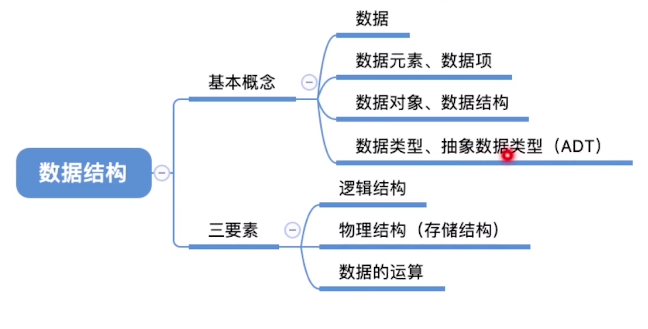
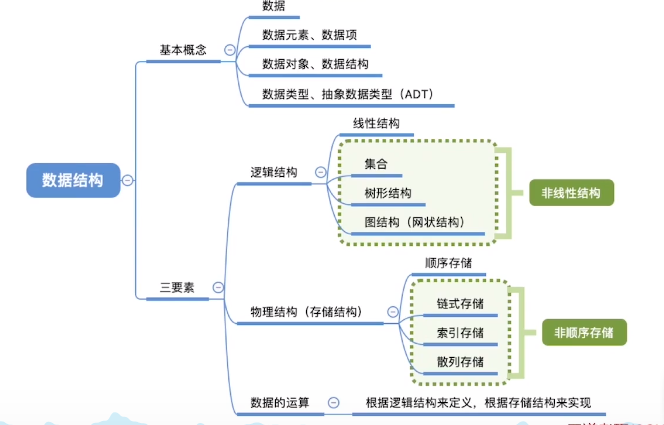
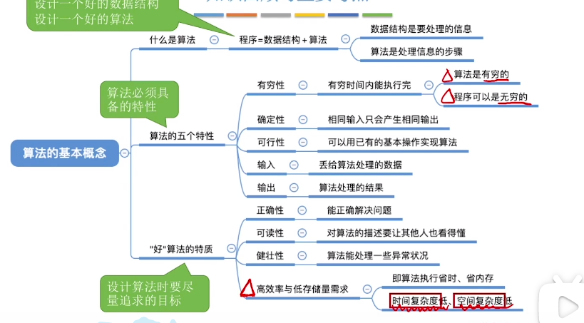
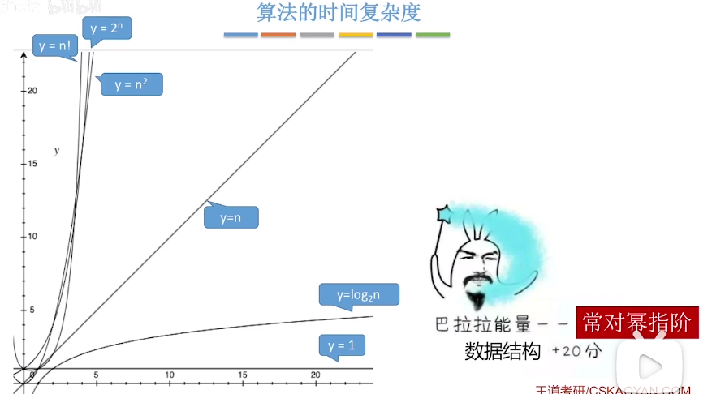
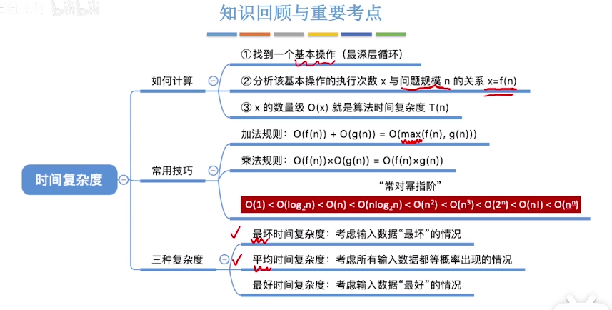
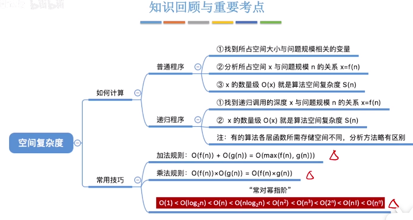

# 王道考研
## 数据结构
如何用程序代码将现实世界的问题**信息化**。

农业阶段-工业阶段-信息化阶段

### 绪论


- 顺序存储:各个数据在物理上必须是连续的。
- 非顺序存储：各个数据在物理上就是离散的。
- 存储结构会影响存储空间分配的方便程度。
- 存储结构会影响对数据运算的速度。


## 算法
- 有穷性
- 确定性
- 可行性
- 输入：零个或多个输入
- 输出：一个或多个输出

### 好算法特性
-  正确性
-  可读性
-  健壮性
-  高效率与低存储量需求


### 时间复杂度
事后统计运行时间存在的问题
- 机器性能
- 编程语言
- 机器指令质量
- 导弹控制算法

事前预估算法时间开销T(n)与问题规模n的关系（T表示“time”）

结论：可以只考虑阶数高的部分

-  加法规则
-  乘法规则







### 空间复杂度
代码装入内存，大小固定，与问题规模无关，存储的变量，导致内存开销的增加。

## 线性表
线性表是具有相同数据类型的n个数据元素的有限序列，其中n为表长，当n=0时线性表是一个空表。若用l命名线性表，则以办表示为
```
l=(a1,a2,...ai,ai+1,...,an)
```
- ai中 i 是位序
- a1是表头元素，an是表尾元素
- 除第一个元素外，每个元素有且仅有一个直接前驱，除最后一个元素外，每个元素有且仅有一个直接后继。


