#  陷入jenkins自动化部署的坑
[[toc]]


[原文地址](https://github.com/qiufeihong2018/vuepress-app/tree/master/docs/technical-summary/jenkins)
## 背景
[Jenkins官网](https://jenkins.io/)
 > Build great things at any scale 
 The leading open source automation server, Jenkins provides hundreds of plugins to support building, deploying and automating any project.

其是一款开源自动化部署服务器，由java编写，目的是为了持久集成。
## 具体步骤
- 项目和远程仓库
    - 将最新的代码推送到远程仓库
- 远程仓库和Jenkins
    - 定时获取远程仓库上最新的完整项目下载到本地 
- Jenkins与远程服务器
    - 通过jenkins上传到远程服务器

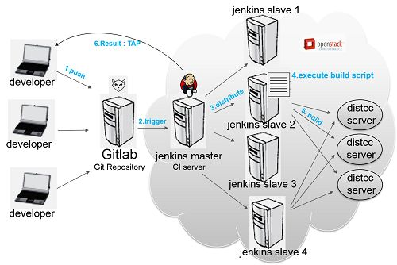

## 安装
先添加其`Debian`软件包，然后更新存储库,最后使用存储库`apt-get`安装`jenkins`。

### 安装运行环境
安装jdk
```
sudo apt-get install openjdk-8-jdk
```
### 存储库密钥添加到系统
```
wget -q -O - https://pkg.jenkins.io/debian/jenkins-ci.org.key | sudo apt-key add -
```
### Debian包存储库地址附加到服务器`sources.list`
```
echo deb http://pkg.jenkins.io/debian-stable binary/ | sudo tee /etc/apt/sources.list.d/jenkins.list
```
### 更新存储库
```
sudo apt-get update
```
### 安装jenkins
```
sudo apt-get install jenkins
```
## 启动jenkins
```
sudo systemctl start jenkins
```
- 用下面命令测试或者直接0.0.0.0:8080访问`jenkins`
```
sudo systemctl status jenkins
```
- 成功如下：不成功就是unactive
```
● jenkins.service - LSB: Start Jenkins at boot time
   Loaded: loaded (/etc/init.d/jenkins; bad; vendor preset: enabled)
   Active: active (exited) since 四 2019-04-18 09:00:28 CST; 8h ago
     Docs: man:systemd-sysv-generator(8)
  Process: 1136 ExecStart=/etc/init.d/jenkins start (code=exited, status=0/SUCCE

4月 18 09:00:24 devue-System-Product-Name systemd[1]: Starting LSB: Start Jenkin
4月 18 09:00:27 devue-System-Product-Name jenkins[1136]: Correct java version fo
4月 18 09:00:27 devue-System-Product-Name jenkins[1136]:  * Starting Jenkins Aut
4月 18 09:00:27 devue-System-Product-Name su[1511]: Successful su for jenkins by
4月 18 09:00:27 devue-System-Product-Name su[1511]: + ??? root:jenkins
4月 18 09:00:27 devue-System-Product-Name su[1511]: pam_unix(su:session): sessio
4月 18 09:00:28 devue-System-Product-Name jenkins[1136]:    ...done.
4月 18 09:00:28 devue-System-Product-Name systemd[1]: Started LSB: Start Jenkins
```

- jenkins默认端口就是8080，需要解锁jenkins

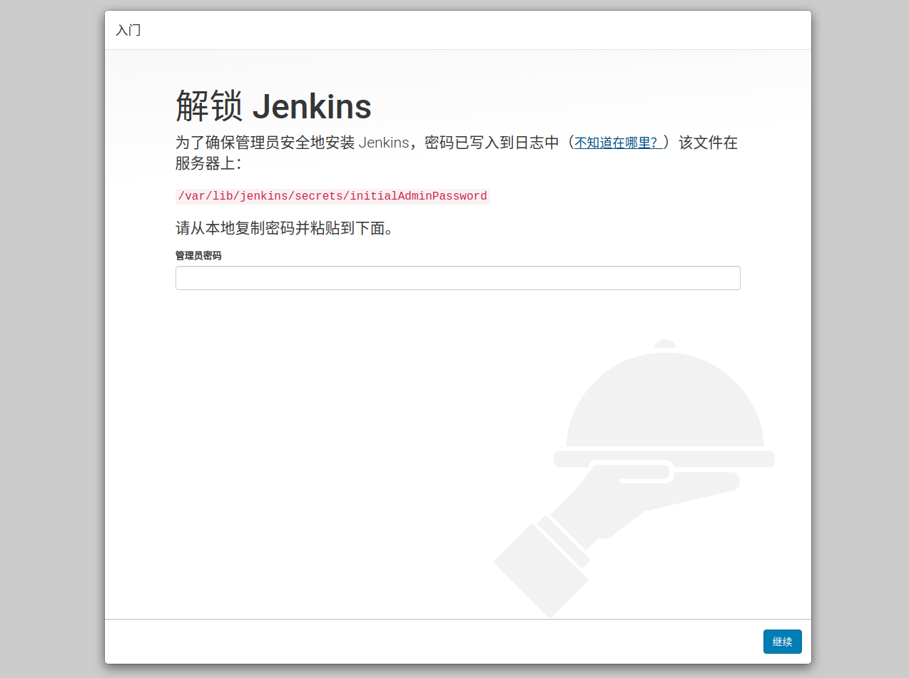

- 将拷贝的密码填入,点击继续

```
sudo cat /var/lib/jenkins/secrets/initialAdminPassword
```

- 点击安装建议的插件
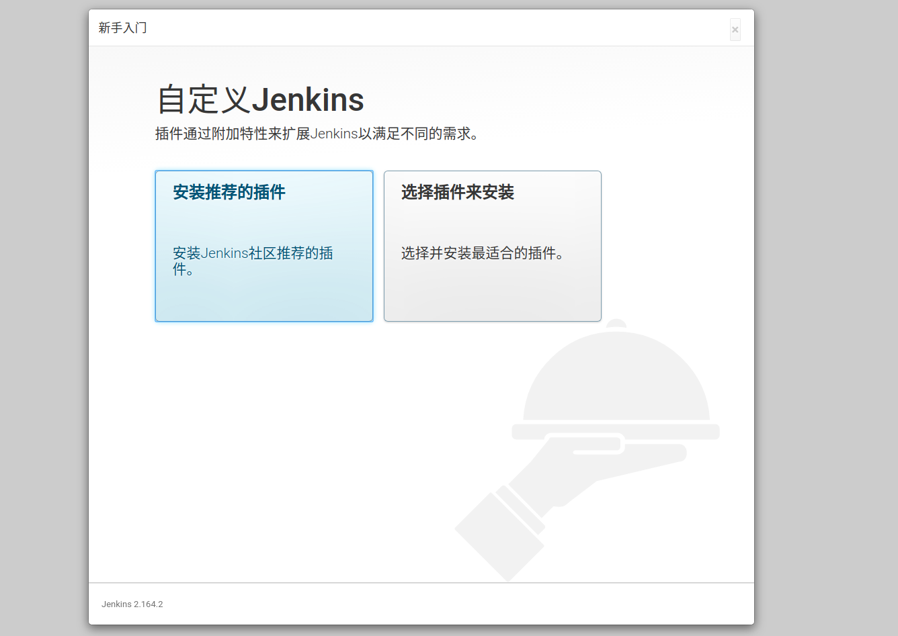

- 开始安装


- 安装完成，会提示设置管理用户。不要跳过，密码未知，但是最好还是创建用户。
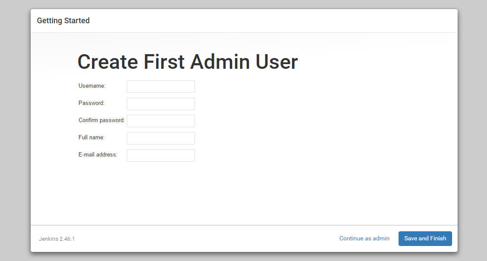

- 创建好用户
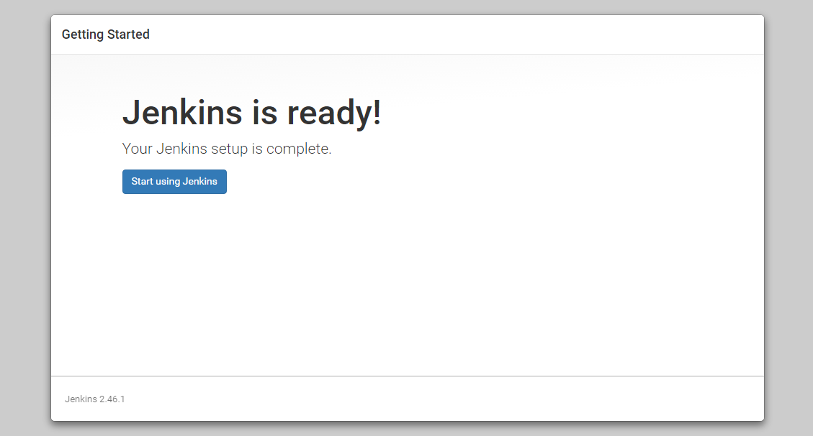

- jenkins面板
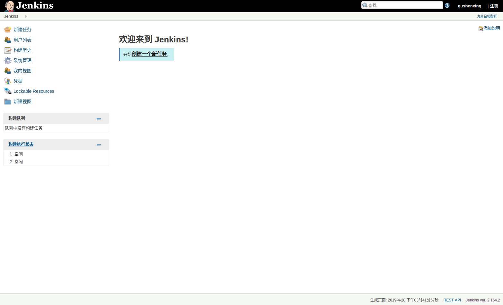
## 连接github
### 在jenkin上的操作：安装相关插件
- 安装插件'Publish Over SSH',连接远程服务器的插件。下图是已经安装后的
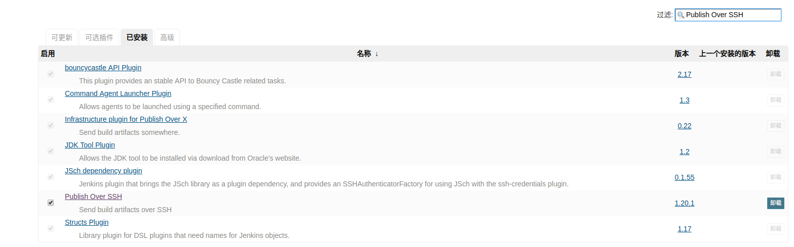
- 安装插件'[GitHub Integration Plugin](https://github.com/KostyaSha/github-integration-plugin/blob/master/README.adoc)',GitHub集成插件
### 在github上的操作：配置webhook
- github项目中点击'Settings'选项卡
  - 点击'webhook'菜单项
    - 添加'webhook'
    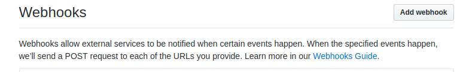
      - 'Payload URL'中'http://'+jenkins部署的ip和端口号+'/github-webhook/'
      - 'Content type'中选择'application/json'
      - 'Which events would you like to trigger this webhook?'选择'just the push event'
      - 选择'Active'  
      - 点击'Update webhook'
      
### jenkins拉取github上vue代码在本地启动

- 新建任务
  - 任务名随意
  - 选择'构建一个自由风格的软件项目'，最后'确定'
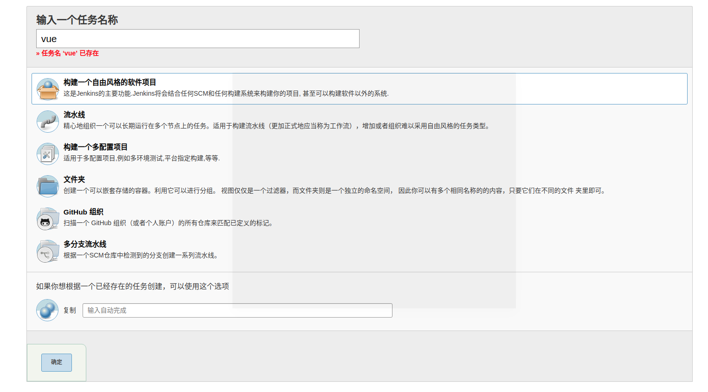
 
- 绑定github项目


- 绑定项目的下载链接
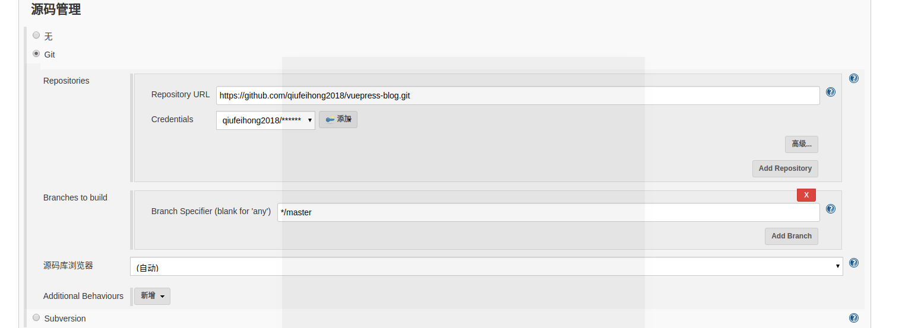
  - 选择'Git'
  - 在'Repositories'中的'Repository URL'填入项目下载链接
  - 'Credentials'中添加身份信息
    - 在类型中选择'Username with password'
    - 用户名和密码就是github的账号和密码，最后'确定'
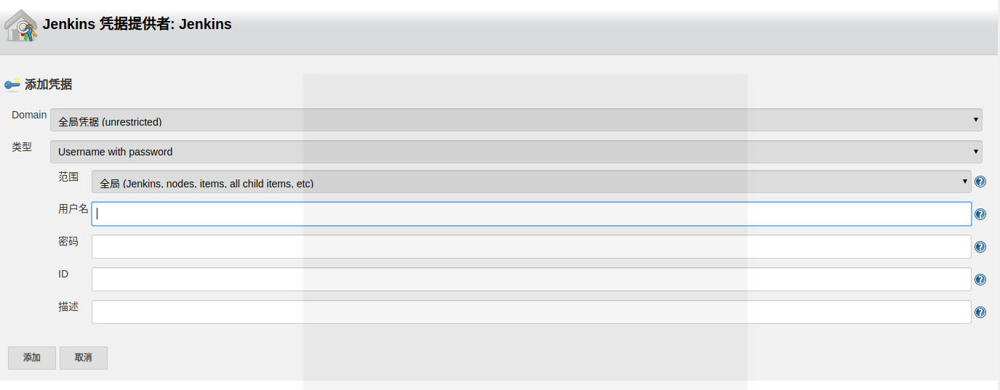
  - 'Branches to build' 选择部署的分支(*/分支名)

- 构建触发器
  - 选择'GitHub hook trigger for GITScm polling'
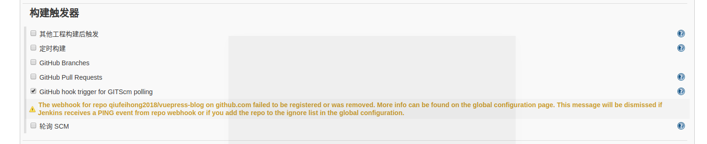

- 构建
  - 执行shell
    - 命令
    ```
    cd /var/lib/jenkins/workspace/vue #进入test项目目录
    npm install chromedriver --chromedriver_cdnurl=http://cdn.npm.taobao.org/dist/chromedriver
    npm install
    npm run dev
    ```
    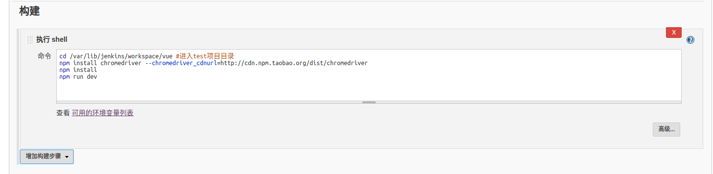
    
- 保存    
任务创建完成，'jenkins'大功告成
### jenkins拉取github上vue代码在远程服务器启动
- 连接远程服务器
  - 系统管理->系统设置->Publish over SSH
   	- Passphrase:输入jenkins的密码
   	- Key:jenkins私钥
   	- Name:服务器ip名字
   	- Hostname:服务器ip
   	- Username:服务器中的用户名
   	- Remote Directory:项目地址
   	- 点击'Test Configuration',success那么连接成功
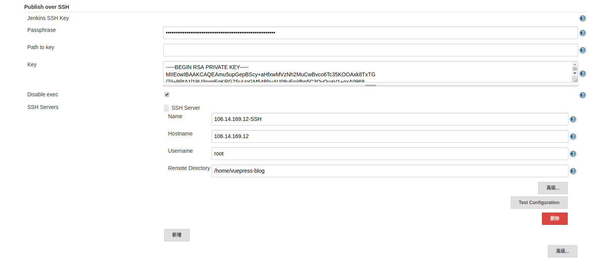
  - 远程服务器
    - 设置公钥  	
    
  
  
  > 获取公钥和私钥  
  ```
  su jenkins
  ssh-keygen -t rsa
  ```  
> 判断是否生成公钥和私钥
```
ls -l /var/lib/jenkins/.ssh/
```
```
jenkins@devue-System-Product-Name:/home/devue$ ls -l /var/lib/jenkins/.ssh/
total 8
-rw------- 1 jenkins jenkins 1675 4月  19 16:26 id_rsa
-rw-r--r-- 1 jenkins jenkins  415 4月  19 16:26 id_rsa.pub
```    
> 拷贝公钥
```
cd /var/lib/jenkins/.ssh/
cat id_rsa.pub >> authorized_keys
chmod 600 authorized_keys
```  
  
    
  ```
    vim ~/.ssh/authorized_keys 
  ```


- 立即构建
传输失败
   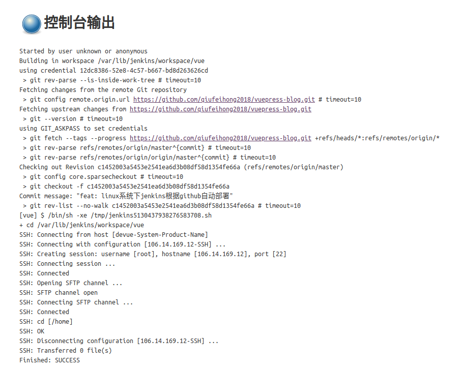

     	
### jenkins轮询github

## 连接gitlab
### 源码管理
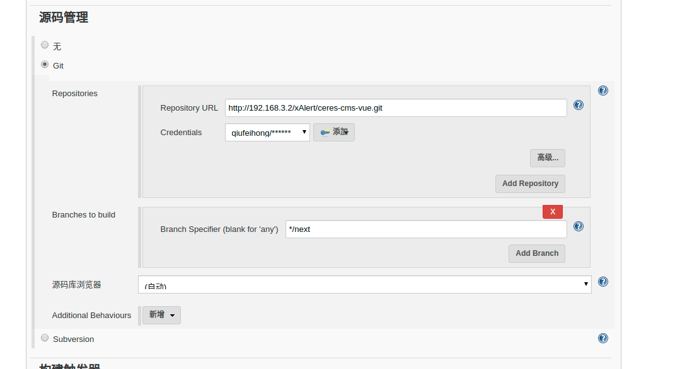
`Repository URL`必须要http请求
### 构建
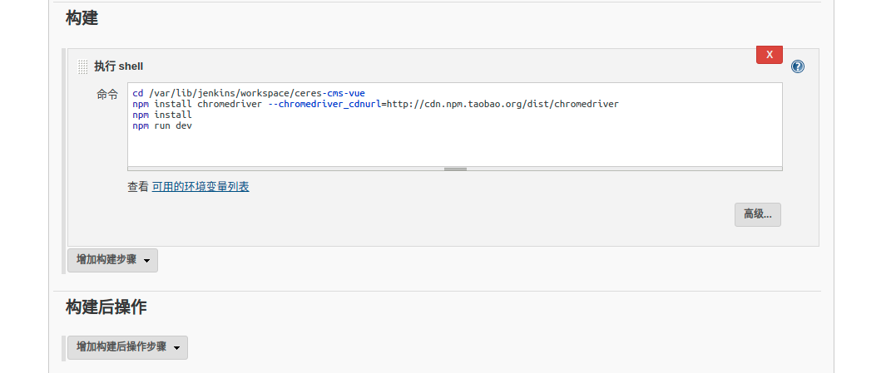
### jenkins轮询gitlab(必须要是管理员身份)
::: warnning
如果没有安装Gitlab Hook和gitlab上增加webhook的话，会报错
:::
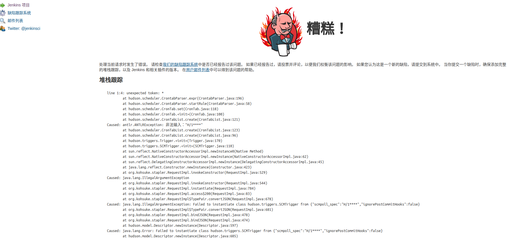
- gitlab项目侧边栏中Settings-Integrations增加webhook
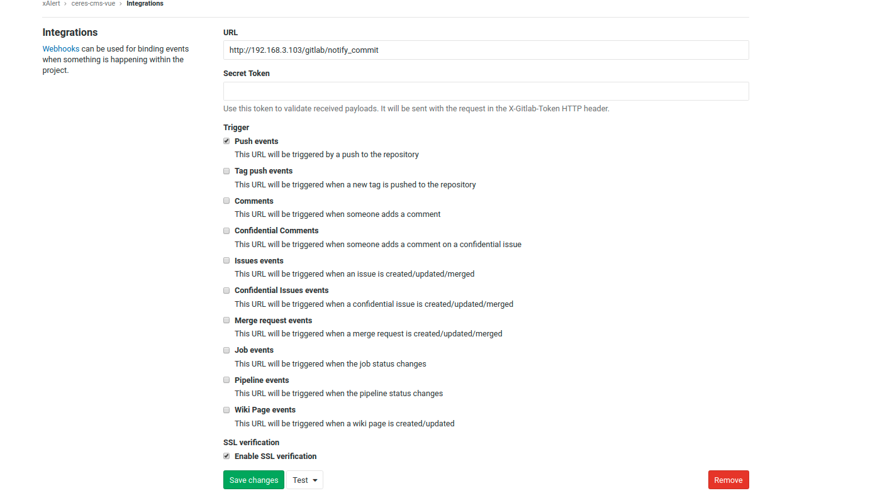
- 添加Gitlab Hook插件
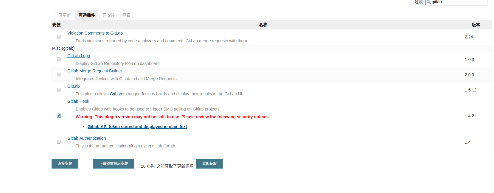、
## 轮询
- 定时构建：无论有无最新代码，都按时构建
- 轮询SCM：只要代码有更新，都会构建
----
- 构建语法说明：

  - 首先格式为：* * * * *（五个星）

选项|意思
--|--
第一个*表示分钟|取值0~59
第二个*表示小时|取值0~23
第三个*表示一个月的第几天|取值1~31
第四个*表示第几月|取值1~12
第五个*表示一周中的第几天|取值0~7，其中0和7代表的都是周日

  - 使用举例（不加H为时刻之前）：
  
选项|意思
--|--
每隔1分钟构建一次|H/1 * * * *
每隔1小时构建一次|H H/1 * * *
每月1号构建一次|H H 1 * *

  - 定时构建和轮询SCM使用互不冲突，具体如何组合，需要根据项目情况合理配置；

## 测试
- 本地push代码到github
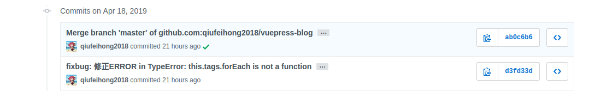

- 点击'立即构建'
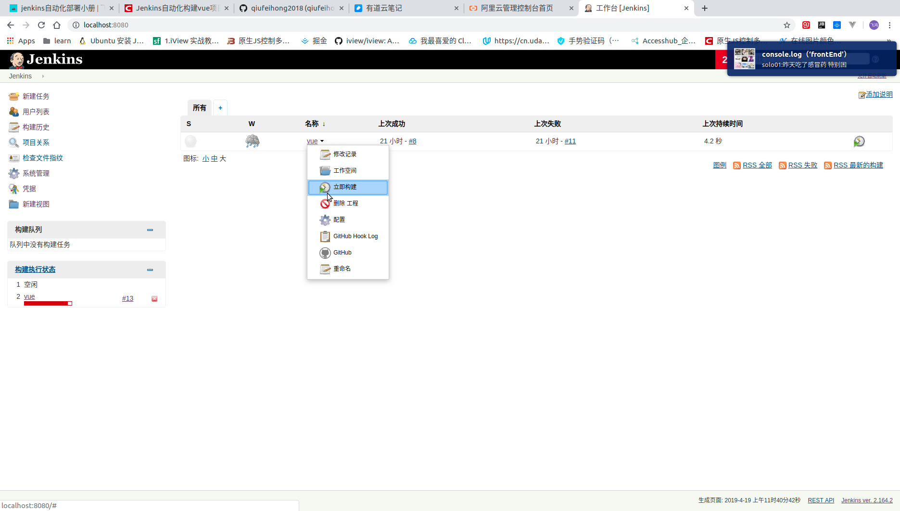

- 构建执行状态
  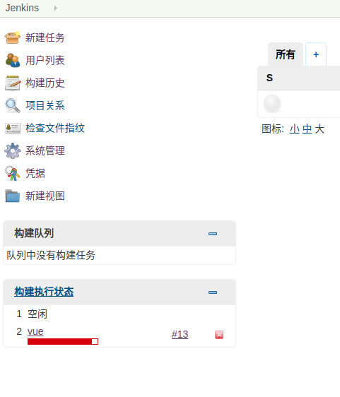

- 点击'#13',进入工程详情
  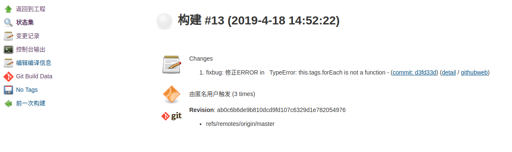

- 控制台输出结果
```
执行中控制台输出
Started by user unknown or anonymous
Started by user unknown or anonymous
Started by user unknown or anonymous
Building in workspace /var/lib/jenkins/workspace/vue
using credential 12dc8386-52e8-4c57-b667-bd8d263626cd
 > git rev-parse --is-inside-work-tree # timeout=10
Fetching changes from the remote Git repository
 > git config remote.origin.url https://github.com/qiufeihong2018/vuepress-app.git # timeout=10
Fetching upstream changes from https://github.com/qiufeihong2018/vuepress-app.git
 > git --version # timeout=10
using GIT_ASKPASS to set credentials 
 > git fetch --tags --progress https://github.com/qiufeihong2018/vuepress-app.git +refs/heads/*:refs/remotes/origin/*
 > git rev-parse refs/remotes/origin/master^{commit} # timeout=10
 > git rev-parse refs/remotes/origin/origin/master^{commit} # timeout=10
Checking out Revision ab0c6b6de9b810dcd9fd107c6329d1e782054976 (refs/remotes/origin/master)
 > git config core.sparsecheckout # timeout=10
 > git checkout -f ab0c6b6de9b810dcd9fd107c6329d1e782054976
Commit message: "Merge branch 'master' of github.com:qiufeihong2018/vuepress-app"
 > git rev-list --no-walk 9b7e2475ffaef9a60cc38cec1c660d0f9d8dc490 # timeout=10
[vue] $ /bin/sh -xe /tmp/jenkins5471132310334499324.sh
+ cd /var/lib/jenkins/workspace/vue
+ npm install chromedriver --chromedriver_cdnurl=http://cdn.npm.taobao.org/dist/chromedriver

> chromedriver@73.0.0 install /var/lib/jenkins/workspace/vue/node_modules/chromedriver
> node install.js

ChromeDriver binary exists. Validating...
ChromeDriver 73.0.3683.20 (8e2b610813e167eee3619ac4ce6e42e3ec622017)

ChromeDriver is already available at '/tmp/73.0.3683.20/chromedriver/chromedriver'.
Copying to target path /var/lib/jenkins/workspace/vue/node_modules/chromedriver/lib/chromedriver
Fixing file permissions
Done. ChromeDriver binary available at /var/lib/jenkins/workspace/vue/node_modules/chromedriver/lib/chromedriver/chromedriver
npm WARN vuepress-app@1.0.0 No repository field.
npm WARN vuepress-app@1.0.0 scripts['server'] should probably be scripts['start'].
npm WARN optional SKIPPING OPTIONAL DEPENDENCY: fsevents@1.2.7 (node_modules/fsevents):
npm WARN notsup SKIPPING OPTIONAL DEPENDENCY: Unsupported platform for fsevents@1.2.7: wanted {"os":"darwin","arch":"any"} (current: {"os":"linux","arch":"x64"})

+ chromedriver@73.0.0
updated 1 package and audited 14738 packages in 13.642s
found 15 vulnerabilities (1 low, 7 moderate, 7 high)
  run `npm audit fix` to fix them, or `npm audit` for details
+ npm install
npm WARN vuepress-app@1.0.0 No repository field.
npm WARN vuepress-app@1.0.0 scripts['server'] should probably be scripts['start'].
npm WARN optional SKIPPING OPTIONAL DEPENDENCY: fsevents@1.2.7 (node_modules/fsevents):
npm WARN notsup SKIPPING OPTIONAL DEPENDENCY: Unsupported platform for fsevents@1.2.7: wanted {"os":"darwin","arch":"any"} (current: {"os":"linux","arch":"x64"})

audited 14738 packages in 8.37s
found 15 vulnerabilities (1 low, 7 moderate, 7 high)
  run `npm audit fix` to fix them, or `npm audit` for details
+ npm run dev

> vuepress-app@1.0.0 dev /var/lib/jenkins/workspace/vue
> vuepress dev docs


 WAIT  Extracting site metadata...
<button @click.ctrl="onClick">A</button>
<button @click.ctrl.exact="onCtrlClick">A</button>
<button @click.exact="onClick">A</button>
 TIP  override.styl has been split into 2 APIs, we recommend you upgrade to continue.
      See: https://v0.vuepress.vuejs.org/default-theme-config/#simple-css-override
[2:52:53 PM] Compiling Client
[2:52:56 PM] Compiled Client in 4s
c
 DONE  [14:52:56] Build 854bb5 finished in 3536 ms! 

> VuePress dev server listening at http://localhost:7777/
c[2:52:57 PM] Compiling Client
[2:52:57 PM] Compiled Client in 204ms
c
 DONE  [14:52:57] Build 056d13 finished in 208 ms! (http://localhost:7777/)

```
- 项目启动成功
- 修改提交后，一键`立即构建`，就可以将最新提交的代码运行起来
## 参考文献
[自动化构建vue项目然后发布到远程服务器](https://app.csdn.net/ansu2009/article/details/83584796)

[Github配合Jenkins，实现vue等前端项目的自动构建与发布](https://app.csdn.net/t6546545/article/details/88771403)

[如何在Ubuntu 16.04上安装Jenkins](https://www.jianshu.com/p/845f267aec52)

[Jenkins卸载方法（Windows/Linux/MacOS）](https://www.cnblogs.com/EasonJim/p/6277708.html)

[jenkins 忘记admin用户账号密码](http://www.cnblogs.com/xiami303/p/3625829.html)

[手把手教你搭建Jenkins+Github持续集成环境](https://github.com/muyinchen/woker/blob/master/%E9%9B%86%E6%88%90%E6%B5%8B%E8%AF%95%E7%8E%AF%E5%A2%83%E6%90%AD%E5%BB%BA/%E6%89%8B%E6%8A%8A%E6%89%8B%E6%95%99%E4%BD%A0%E6%90%AD%E5%BB%BAJenkins%2BGithub%E6%8C%81%E7%BB%AD%E9%9B%86%E6%88%90%E7%8E%AF%E5%A2%83.md)

[Integrate with GitHub: build after each commit (Get started with Jenkins, part 13)](https://www.youtube.com/watch?v=Z3S2gMBUkBo)

[实战笔记：Jenkins打造强大的前端自动化工作流](https://juejin.im/post/5ad1980e6fb9a028c42ea1be)

[教你用Vue、GitLab、Jenkins、Nginx实现自动打包发布上线](https://www.vmartaw.com/zcc/2018/07/08/%E6%95%99%E4%BD%A0%E7%94%A8Vue-GitLab-Jenkins-Nginx%E5%AE%9E%E7%8E%B0%E8%87%AA%E5%8A%A8%E6%89%93%E5%8C%85%E5%8F%91%E5%B8%83%E4%B8%8A%E7%BA%BF/)

[Jenkins+github 前端自动化部署](https://segmentfault.com/a/1190000010200161)

[Jenkins自动化构建vue项目然后发布到远程服务器](https://app.csdn.net/ansu2009/article/details/83584796)

[Jenkins自动化发布前端代码VUE (配置模式)](https://app.csdn.net/rankawin/article/details/81699460)

[jenkins配置publish over ssh遇到的问题](https://zhuanlan.zhihu.com/p/39549204)

[jenkins使用publishover ssh插件连接应用机器时，报Message Auth fail的问题](https://app.csdn.net/u010947098/article/details/61922969)

[Jenkins+git+webhook自动触发部署和测试任务](https://www.jianshu.com/p/ad018160aff9)

[Jenkins定时构建和轮询SCM设置说明](https://app.csdn.net/MenofGod/article/details/81288987)

[第四十一章 微服务CICD（3）- jenkins + gitlab + webhooks + publish-over-ssh（1）](http://www.bubuko.com/infodetail-1823810.html)
