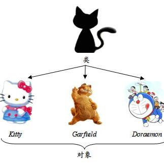
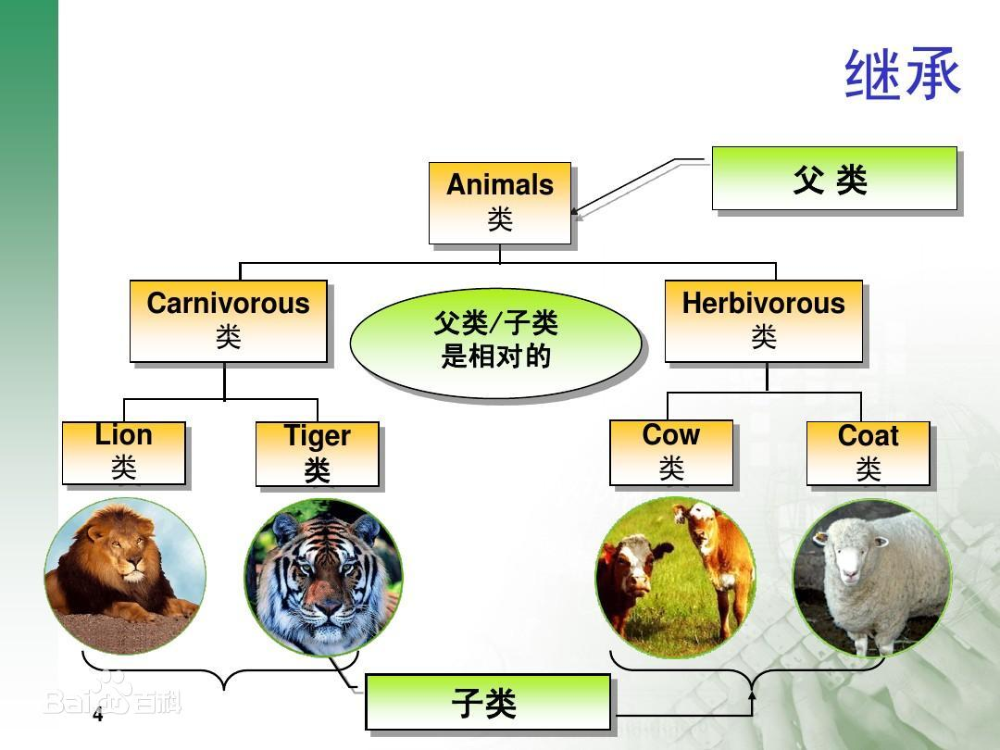
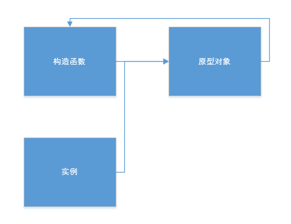
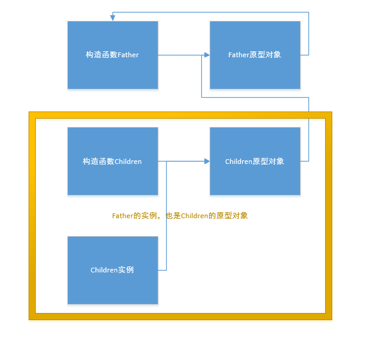
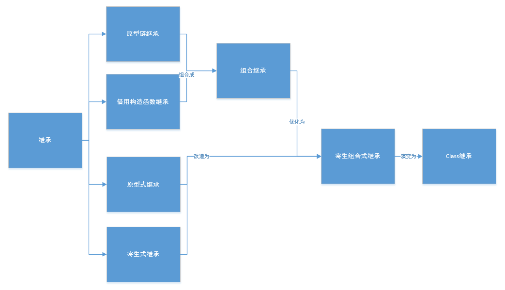

# Javascript继承知多少
## 目录
```
一、	背景	3
二、	什么是继承	3
三、	原型链继承	3
(一)	原型链概念	3
(二)	默认的原型	5
(三)	判断实例是否是原型派生的	6
(四)	重写方法需要在替换原型之后（缺点）	8
(五)	不能使用对象字面量创建原型方法（缺点）	9
(六)	引用类型值带来的问题（缺点）	10
(七)	不能传递参数（缺点）	11
四、	借用构造函数继承	12
(一)	Call和apply	12
(一)	解决原型链继承的问题（优点）	13
(二)	解决原型链传递参数的问题（优点）	14
(三)	原型属性和方法无法继承（缺点）	15
五、	组合继承	16
(一)	解决原型链和构造函数继承的问题（优点）	16
(二)	重复创建实例属性（缺点）	18
六、	原型式继承	19
(一)	Object.create	20
七、	寄生式继承	20
八、	寄生组合式继承	21
九、	类extends继承	23
十、	总结	24
(一)	原型链	25
(二)	借用构造函数	25
(三)	组合继承	25
(四)	原型式继承	26
(五)	寄生式继承	26
(六)	寄生组合式继承	26
(七)	类extends继承 26
ES5 和 ES6继承区别  26
十一、	参考文献	26
```
 
## 一、	背景
JavaScript 的继承是一个很常见的东西，我们一定要重视它。

它可以用在很多方面，提高代码复用、开发规范和开发效率。

在面试中经常会遇到哦。
## 二、	什么是继承
继承 inheritance 是面向对象软件技术当中的一个概念。

这种技术可以复用以前的代码，能够大大缩短开发周期，降低开发费用。

继承就是子类继承父类的特征和行为，使得子类对象（实例）具有父类的实例和方法，或子类从父类继承方法，使得子类具有父类相同的行为。

> 面向对象语言都支持两种继承方式，分别是 **接口继承** 和 **实现继承**。接口继承只继承方法签名，而实现继承则继承实际的方法。ES 只支持实现继承，主要是依赖原型链来实现的。

相信你们对下面两张大学时候老师经常拿出来的图相当熟悉。





那么在 JavaScript 中有哪些方式可以实现继承呢？
## 三、	原型链继承
**本质其实就是一个类型用另一个类型的实例重写原型对象**。
### (一)	原型链简介
三者关系：构造函数有个原型对象，原型对象有个指针指向构造函数，每个实例都有个内部指针指向原型对象。
 

 
例子：
```js
// 父构造函数
function Father() {
    this.name = "father"
    this.house = "cottage"
}
// 原型方法
Father.prototype.alertName = function () {
    console.log(this.name)
}
// 创造实例
let f = new Father()

f.alertName()//father

// 子构造函数
function Children() {
    this.name = "children"
}
// 实现继承：子构造函数的原型对象=父构造函数的实例对象
Children.prototype = new Father()
// 创建子实例
let c = new Children()
// 儿子就继承了父亲的所有属性（大别墅），并且获得了自己的名字

c.alertName()//children

console.log(c.house)//cottage
```
Father 通过 new 出一个实例赋值给 Children 的原型对象，从而实现了 Children 继承了 Father。

原型链实现继承的实例、构造函数和原型对象之间的关系图：



### (二)	默认的原型
所有的引用类型值默认都继承了 Object，而这个继承也是通过原型链实现的。所有函数的默认原型都是 Object 的实例，因此默认原型都会包含一个内部指针，指向 Object.prototype。

上述例子改一改：
```js
// 父构造函数
function Father() {
    this.name = "father"
    this.house = "cottage"
}
// 原型方法
Father.prototype.alertName = function () {
    console.log(this.name)
}
// 子构造函数
function Children() {
    this.name = "children"
}
// 实现继承：子构造函数的原型对象=父构造函数的实例对象
Children.prototype = new Father()
// 创建子实例
let c = new Children()
// 使用 Object 原型上的方法
console.log(c.hasOwnProperty('name'))//true
```
儿子继承了父亲，父亲继承了Object，所以儿子可以调用 Object 原型上的方法。
### (三)	判断实例是否是原型派生的
判断实例和原型的关系，有两种方式，分别是 **instanceof** 和 **isPrototypeOf()** 。

可以通过 instanceof 操作符

修改下例子：
```js
// 父构造函数
function Father() {
    this.name = "father"
    this.house = "cottage"
}
// 原型方法
Father.prototype.alertName = function () {
    console.log(this.name)
}
// 子构造函数
function Children() {
    this.name = "children"
}
// 实现继承：子构造函数的原型对象=父构造函数的实例对象
Children.prototype = new Father()
// 创建子实例
let c = new Children()

function Other() {
    this.name = "other"
}
console.log(c instanceof Children) // true

console.log(c instanceof Father) // true

console.log(c instanceof Object) // true

console.log(c instanceof Other) // false
```
还可以使用 isPrototypeOf() 方法

代码如下：
```js
// 父构造函数
function Father() {
    this.name = "father"
    this.house = "cottage"
}
// 原型方法
Father.prototype.alertName = function () {
    console.log(this.name)
}
// 子构造函数
function Children() {
    this.name = "children"
}
// 实现继承：子构造函数的原型对象=父构造函数的实例对象
Children.prototype = new Father()
// 创建子实例
let c = new Children()

function Other() {
    this.name = "other"
}
console.log(Children.prototype.isPrototypeOf(c)) // true

console.log(Father.prototype.isPrototypeOf(c)) // true

console.log(Object.prototype.isPrototypeOf(c)) // true

console.log(Other.prototype.isPrototypeOf(c)) // false
```
从代码结果中可以看出：c 是 Children、Father 和 Object 的实例，而不是 Other 的实例。
### (四)	重写方法需要在替换原型之后（缺点）
有些时候子类型需要重写超类型的方法，如果子类型重写的方法写在替换原型之前，那么继承后的超类型方法会覆盖子类型定义的方法，重写无效。所以，子类型重写方法需要在替换原型之后。

代码如下：
```js
// 父构造函数
function Father() {
    this.name = "father"
    this.house = "cottage"
}
// 原型方法
Father.prototype.alertName = function () {
    console.log(this.name)
}
// 子构造函数
function Children() {
    this.name = "children"
}
// 实现继承：子构造函数的原型对象=父构造函数的实例对象
Children.prototype = new Father()
// 在替换原型后，重写方法
Children.prototype.alertName = function () {
    console.log('在替换原型之后，重写方法有效')
}
// 创建子实例
let c = new Children()
c.alertName()// 在替换原型之后，重写方法有效
```
上述是有效的情况，换一下代码顺序，执行后瞬间无效，如下：
```js
// 父构造函数
function Father() {
    this.name = "father"
    this.house = "cottage"
}
// 原型方法
Father.prototype.alertName = function () {
    console.log(this.name)
}
// 子构造函数
function Children() {
    this.name = "children"
}
// 在替换原型前，重写方法
Children.prototype.alertName = function () {
    console.log('我在替换原型之后，重写方法有效')
}
// 实现继承：子构造函数的原型对象=父构造函数的实例对象
Children.prototype = new Father()
// 创建子实例
let c = new Children()
c.alertName()// children
```

### (五)	不能使用对象字面量创建原型方法（缺点）
对象字面量是 Object 类型，如果用对象字面量去替换子类型的原型，那么子类型是不继承超类型，而是直接继承 Object 类型。

代码如下：
```js
// 父构造函数
function Father() {
    this.name = "father"
    this.house = "cottage"
}
// 原型方法
Father.prototype.alertName = function () {
    console.log(this.name)
}
// 子构造函数
function Children() {
    this.name = "children"
}
// 实现继承：子构造函数的原型对象=父构造函数的实例对象
Children.prototype = new Father()
// 添加新方法
Children.prototype = {
    speakName: function () {
        console.log(this.name)
    }
}
// 创建子实例
let c = new Children()
console.log(c instanceof Father)// false

console.log(c instanceof Object)// true

c.alertName()// TypeError: c.alertName is not a function
```
从结果中可以看出： c 不是 Father 类型的实例，而是 Object 类型的实例，alertName() 方法定义在 Father 类型上，而不在 Object 上，所以在 children 原型链中找不到 alertName() 方法，所以调用失败。

所以，千万别用对象字面量创建原型方法啊。
### (六)	引用类型值带来的问题（缺点）
值类型：字符串string、数字number、布尔值boolean、null、undefined。

引用类型值：对象object、数组array、函数function。

类型中定义了引用类型值，那么继承得到的所有实例就会共享这个引用类型值。

值类型的继承不会造成共享，单独分配一个内存空间，代码如下：
```js
// 父构造函数
function Father() {
    this.name = "father"
}
// 子构造函数
function Children() {
}
// 实现继承：子构造函数的原型对象=父构造函数的实例对象
Children.prototype = new Father()
// 创建子实例
let c1 = new Children()
let c2 = new Children()

// 不是引用类型值没有问题
c1.name = "我修改了name"
console.log(c1.name)// 我修改了name

console.log(c2.name)// father
```
引用类型的继承会造成共享，共享一个内存空间，代码如下：
```js
// 父构造函数
function Father() {
    this.child = {
        name: 'father'
    }
}
// 子构造函数
function Children() {}
// 实现继承：子构造函数的原型对象=父构造函数的实例对象
Children.prototype = new Father()
// 创建子实例
let c1 = new Children()
let c2 = new Children()

// 是引用类型值就有问题
c1.child.name = "我修改了name"
console.log(c1.child)// { name: '我修改了name' }

console.log(c2.child)// { name: '我修改了name' }
```
从结果中可以看到，引用类型继承后，所有实例都共享一份数据，c1 改了，c2 没动，但是打印数据却是一模一样。
### (七)	不能传递参数（缺点）
由于原型中包含引用类型值带来的问题，在创建子类型的实例中不能像超类型的构造函数中传递参数。给超类型的构造函数传递参数会将继承这个超类型的子类型所有的实例发生改变，牵一发而动全身。

传参后的问题代码如下：
```js
// 父构造函数
function Father(name, age) {
    this.age = age
    this.child = {
        name: name
    }
}
// 子构造函数
function Children() {}

Children.prototype = new Father('father', 111)

// 创建子实例
let c1 = new Children()
let c2 = new Children()
// 修改引用类型值 name
c1.child.name = '修改引用类型值'
// 修改值类型 age
c1.age = 222
console.log(c1.age)// 222

console.log(c1.child)// { name: '修改引用类型值' }

console.log(c2.age)// 111

console.log(c2.child)// { name: '修改引用类型值' }
```
从结果中看出，超类型中给值类型传参并实现继承，再修改某个实例的值类型 age 后，两个实例的值类型 age 值不同。而引用类型相反，修改某个实例的引用类型值后，所有实例的该值都发生了变化，没有隔离，共享了一份数据。

## 四、	借用构造函数继承
利用call和apply方法实现借用构造函数来达到继承的目的。

### (一)	Call和apply
先来回顾下 call() 方法
 
定义：就是用一个指定的 this 和参数去调用另一个函数。接受的参数必须是列表。this 指的是调用者，
而不是 fn 的 this 值。如果是非严格模式下，null 和 undefined 会变成全局对象。

格式：`Fn.call(this,arg1,arg2，……省略n个参数……)`

再来回顾下 apply() 方法，与 call() 方法类似，但是接受的参数必须是数组。

格式：`Fn.call(this,[ arg1,arg2，……省略n个参数……])`

借用构造函数的本质就是利用 call 或者 apply 把父类中通过 this 指定的属性和方法复制（借用）到子类创建的实例中。因为 this 对象是在运行时基于函数的执行环境绑定的。

也就是说，this 等于window ，而当函数被作为某个对象的方法调用时，this 等于那个对象。call、apply 方法可以用来代替另一个对象调用一个方法。call、apply 方法可将一个函数的对象上下文从初始的上下文改变为 this 指定的新对象。

总之，在子类函数中，通过 call() 方法调用超类型后，子类型的实例可以访问到子类型和超类型中的所有属性和方法。这样就实现了子类向父类的继承，而且还解决了原型对象上对引用类型值的误修改操作。
### (一)	解决原型链继承的问题（优点）
由于引用类型值共用同一个内存空间，子类型继承超类型的同时，构造出的实例也复制了相同的超类型属性。改一个实例就等于所有实例发生了改变。

借用构造函数刚好可以解决这个问题。 
代码如下：
```js
// 父构造函数
function Father() {
    this.child = {
        name: 'father'
    }
}
// 子构造函数
function Children() {
    Father.call(this)
}

// 创建子实例
let c1 = new Children()
let c2 = new Children()

// 就算是引用类型值也没有了问题，太棒了
c1.child.name = "我修改了name"
console.log(c1.child)// { name: '我修改了name' }

console.log(c2.child)// { name: 'father' }
```
从结果中可以看到，更改 c1 实例的属性，c2 实例不受影响。借用构造函数继承的实例不共享属性，相互之间不干扰。
### (二)	解决原型链传递参数的问题（优点）
原型链无法正常传递参数，可以通过借用构造函数方式解决。

代码如下：
```js
// 父构造函数
function Father(name, age) {
    this.age = age
    this.child = {
        name: name
    }
}
// 子构造函数
function Children() {
    Father.call(this, 'father', 111)
}

// 创建子实例
let c1 = new Children()
let c2 = new Children()
// 修改引用类型值 name
c1.child.name = '修改引用类型值'
// 修改值类型 age
c1.age = 222
console.log(c1.age)// 222

console.log(c1.child)// { name: '修改引用类型值' }

console.log(c2.age)// 111
console.log(c2.child)// { name: 'father' }
```
从结果中可以看到，无论是值类型还是引用类型值，借用构造函数继承中传递参数，然后修改某个实例，并不会应用到所有实例属性中，每个实例保存自己的那份数据，具有很好的隔离性。
### (三)	原型属性和方法无法继承（缺点）
由于不是原型链继承，仅仅是借用构造函数，那么无法继承原型上的属性和方法。

构造函数中定义的属性和方法虽然可以访问，但是每个实例都复制了一份，如果实例过多，方法过多，占用内存就大，那么方法都在构造函数中定义，函数复用就无从谈起。

本来我们就是用 prototype 来解决复用问题。

如果方法都作为了实例自己的方法，当需求改变后，要改变其中的一个方法，那么之前的所有实例，其中的方法都不能做出更新，只有后面的实例才能访问到新方法。

代码如下：
```js
// 父构造函数
function Father() {
    this.name = 'father'
    this.speakName1 = function () {
        console.log('speakName1')
    }
    this.speakName2 = function () {
        console.log('speakName2')
    }
    this.speakName3 = function () {
        console.log('speakName3')
    }
    this.speakName4 = function () {
        console.log('speakName4')
    }
}
// 父原型上 方法
Father.prototype.alertName = function () {
    console.log(this.name)
}
// 父原型上 属性
Father.prototype.age = 21
// 子构造函数
function Children() {
    Father.call(this)
}

// 创建子实例
let c1 = new Children()
// 调用原型方法,实例访问不到
c1.alertName()
// TypeError: c1.alertName is not a function

// 访问原型属性,实例中未定义
console.log(c1.age)
// undefined

// 可以访问实例属性,但是每个实例都存有自己一份 name 值
console.log(c1.name)
// father

// 可以访问实例方法,但是每个实例都存有自己一份 speakName1() 方法,
// 且方法过多,内存占用量大,这就不叫复用了
c1.speakName1()// speakName1

c1.speakName2()// speakName2

c1.speakName3()// speakName3

c1.speakName4()// speakName4

// instanceof isPrototypeOf 无法判断实例和类型的关系
console.log(Father.prototype.isPrototypeOf(c1))// false
console.log(c1 instanceof Father)// false
```
从结果中可以看出，借用构造函数继承后，实例无法调用原型方法和访问属性，但是可以访问实例属性和方法。

而且instanceof 和  isPrototypeOf 无法判断实例和类型的关系。

## 五、	组合继承
### (一)	解决原型链和构造函数继承的问题（优点）
上述两者继承方式，无论是单独使用原型链继承还是借用构造函数继承都有自己的局限性，最好的方式是，将两者结合一起使用，发挥各自的优势。

组合继承就是将原型链继承和借用构造函数继承组合起来使用。利用原型链继承继承原型方法，利用借用构造函数继承继承实例属性。这样既能实现函数复用，又能保证每个实例间的属性不会相互影响。

代码如下：
```js
// 父构造函数
function Father(name) {
    this.child = {
        name: name
    }
}
// 父原型上绑定方法
Father.prototype.alertName = function () {
    console.log(this.child)
}
// 子构造函数 借用构造函数继承父
function Children(name) {
    Father.call(this, name)
}
// 原型链继承
Children.prototype = new Father()
 
Children.prototype.constructor = Children

// 子原型上创建 函数
Children.prototype.speakName = function () {
    console.log('speakName')
}
// 创建子实例
let c1 = new Children('c1')
let c2 = new Children('c2')
// 修改引用类型值 name
c1.child.name = '修改引用类型值'

// 组合继承做到了2件事：
// 1.复用原型方法
// 2.实例属性隔离

c1.alertName()// { name: '修改引用类型值' }

c1.speakName()// speakName

c2.alertName()// { name: 'c2' }

c2.speakName()// speakName

console.log(c1 instanceof Father)//true
```

很对人可能对**Children.prototype.constructor = Children**
这行代码不明白，飞鸿看前几遍的时候也是云里雾里，后来明白了。

这一步为创建子类型原型对象添加 constructor 属性，从而弥补因重写原型而失去的默认的 constructor 属性。

### (二)	重复创建实例属性（缺点）
```js
……代码省略……
// 子构造函数 借用构造函数继承父
function Children(name) {
    Father.call(this, name) //第二次调用 Father 构造函数
}
// 原型链继承
Children.prototype = new Father() //第一次调用 Father 构造函数
……代码省略……
```
在 new Father() 构造实例时，调用了一次 Father 的构造函数创建了一份实例属性 child，其绑定在原型对象上。

在 new Children('c') 构造实例时，由于原型指向 Father实例，所以又调用了一次 Father 的构造函数创建了一份实例属性 child，其绑定在实例上。

如果实例和原型上属性同名，那么实例上的属性就屏蔽了原型上的。

那么问题就来了，两次创建后子类型的原型上和实例对象上都有一份实例属性。这个不就很影响性能和复用吗？

## 六、	原型式继承
原型式继承的本质就是用一个对象作为另一个对象的基础。

有这个对象的话，将它传给 object，然后再根据具体需求将得到的新对象改一改。
代码如下：
```js
// 基于已有的对象创建新对象，同时还不用创建自定义类型。
function object(obj) {
    // 临时构造函数
    function fn() {}
    // 传入的对象替换临时构造函数的原型
    fn.prototype = obj
    // 最后返回临时构造函数的一个实例
    return new fn()
}
// father 对象
let father = {
    name: 'father',
    friend: ['abby', 'bob']
}

// 生成新实例对象 child1
let child1 = object(father)

// 更改值类型属性
child1.name = '修改了name'
console.log(child1.name) //修改了name

// 更改引用类型值
child1.friend.push('chely')
console.log(child1.friend) //[ 'abby', 'bob', 'chely' ]

// 生成新实例对象 child2
let child2 = object(father)
console.log(child2.name) //father
console.log(child2.friend) //[ 'abby', 'bob', 'chely' ]
```
从结果中可以看到，经过这个方法的实例对象中的引用类型值和其他实例对象共享，而值类型隔离。实际上创造了两个 father 对象的副本。
### (一)	Object.create
ES5 中的 **Object.create()** 方法规范化了原型式继承。

Object.create() 方法创建一个新对象，使用现有的对象来提供新创建的对象的 __proto__。

提供两个入参，第一个是新创建的原型对象；第二个是为新创建的对象添加属性的对象，同 Object.defineProperties()（看过vue2源码一定知道）。

代码如下：
```js
// father 对象
let father = {
    name: 'father',
    friend: ['abby', 'bob']
}

// 生成新实例对象 child1
let child1 = Object.create(father)

// 更改值类型属性
child1.name = '修改了name'
console.log(child1.name) //修改了name

// 更改引用类型值
child1.friend.push('chely')
console.log(child1.friend) //[ 'abby', 'bob', 'chely' ]

// 生成新实例对象 child2
let child2 = Object.create(father)
console.log(child2.name) //father
console.log(child2.friend) //[ 'abby', 'bob', 'chely' ]
```
## 七、	寄生式继承
寄生式继承是基于原型式继承上修改的，本质上就是创建一个仅用于封装继承过程的函数，该函数在内部以某种方式来增强对象，最后再像真的是它做了所有工作一样返回对象。

缺点就是：使用寄生式继承来为对象添加函数，会由于不能做到函数复用而降低效率，同借用构造函数继承的缺点。

代码如下：
```js
// father 对象
let father = {
    name: 'father',
    friend: ['abby', 'bob']
}

function fn(obj) {
    let origin = Object.create(obj)
    // 继承了方法，增强了对象，原对象不受影响
    origin.alertName = function () {
        console.log(this.name)
    }
    return origin
}
// 生成新实例对象 child1
let child1 = fn(father)

// 更改值类型属性
child1.name = '修改了name'
console.log(child1.name) //修改了name

// 更改引用类型值
child1.friend.push('chely')
console.log(child1.friend) //[ 'abby', 'bob', 'chely' ]

child1.alertName() // 修改了name

// 生成新实例对象 child2
let child2 = fn(father)
console.log(child2.name) //father
console.log(child2.friend) //[ 'abby', 'bob', 'chely' ]

child2.alertName() //father
```

## 八、	寄生组合式继承
寄生组合式继承本质就是寄生式继承来继承超类型的原型，然后再将结果指定给子类型的原型。

通过借用构造函数来继承属性，通过原型链的混成形式来继承方法。

基本思路就是不必为了指定子类型的原型而调用超类型的构造函数，我们所需的无非就是超类型的一个副本而已。

寄生组合式继承是引用类型最理想的继承范式。

代码如下：
```js
/**
 * 实现了寄生组合式继承的最简单形式
 * @param {*} children 子类型
 * @param {*} father 超类型
 */
function inheritPrototype(children, father) {
    // 创建对象：创建超类型的副本
    let prototype = Object.create(father.prototype)
    // 增强对象：为创建的副本添加constructor属性，弥补因为重写原型而失去的默认的constructor的属性
    prototype.constructor = children
    // 指定对象：将新创建的副本赋值给子类型的原型
    children.prototype = prototype
}

// 父构造函数
function Father(name) {
    this.child = {
        name: name
    }
}
// 父原型上绑定方法
Father.prototype.alertName = function () {
    console.log(this.child)
}
// 子构造函数 借用构造函数继承父
function Children(name) {
    Father.call(this, name)
}
inheritPrototype(Children, Father)

// 子原型上创建 函数
Children.prototype.speakName = function () {
    console.log('speakName')
}
// 创建子实例
let c1 = new Children('c1')
let c2 = new Children('c2')
// 修改引用类型值 name
c1.child.name = '修改引用类型值'

c1.alertName()// { name: '修改引用类型值' }

c1.speakName()// speakName

c2.alertName()// { name: 'c2' }

c2.speakName()// speakName

console.log(c1 instanceof Father)//true
```
## 九、	类extends继承
ES6使用 class 利用 **extends** 实现了继承，原理同寄生组合式继承。其实就是语法糖。

代码如下：
```js
// 父类
class Father {
    // 父构造函数
    constructor(name) {
        this.child = {
            name: name
        }
    }
    alertName() {
        console.log(this.child)
    }

}
// 子类继承父类
class Children extends Father {
    constructor(name) {
        // super 表示父类的构造函数，用来新建父类的 this 对象。
        // 因为子类没有自己的this，必须要调用super获取父类的this对象，并加以修改
        // 等同于 Father.prototype.constructor.call(this)
        // 同时绑定了子类的this
        super(name)
    }
    speakName() {
        // 等同于 Father.prototype.alertName() 绑定了子类 Children 的this
        super.alertName()
    }
}

// 创建子实例
let c1 = new Children('c1')
let c2 = new Children('c2')
// 修改引用类型值 name
c1.child.name = '修改引用类型值'

c1.alertName() //{ name: '修改引用类型值' }

c1.speakName() //{ name: '修改引用类型值' }

c2.alertName() //{ name: 'c2' }

c2.speakName() //{ name: 'c2' }

console.log(c1 instanceof Father) //true
```
## 十、	总结

### (一)	原型链
本质：利用超类型的实例替换子类型的原型对象

优点：
1.	非常纯粹的继承关系，实例是子类的实例，也是父类的实例
2.	父类新增原型方法和原型属性，子类都能访问到

缺点：
1.	重写方法需要在替换原型之后
2.	不能使用对象字面量创建原型方法
3.	无法实现多继承
4.	引用类型被所有实例共享
5.	创建子类实例时，无法向父类构造函数传参
### (二)	借用构造函数
本质：使用 call() 和 apply() 借用超类型的构造函数来增强子类的实例

优点：
1.	解决了原型链中，子类实例共享父类引用类型的问题
2.	创建子类实例时，可以向父类传递参数
3.	可以实现多继承（call多个父类对象）

缺点：
1.	实例并不是父类的实例，只是子类的实例
2.	只能继承父类的实例属性和方法，不能继承原型属性和原型方法
3.	无法实现函数复用，每个子类都有父类实例函数的副本，影响性能
### (三)	组合继承
本质：将原型链和借用构造函数组合

优点：
1.	弥补了原型链和借用构造函数的缺陷，可以继承实例属性和实例方法，也可以继承原型属性和原型方法
2.	既是子类的实例，也是父类的实例
3.	不存在引用类型共享问题
4.	可传参
5.	函数可复用

缺点：
1.	调用了两次的父类函数，有性能问题
2.	由于两次调用，会造成实例和原型上有相同的属性或方法
### (四)	原型式继承
本质：借用原型以已有对象为基础创建新对象

优点：
1.	不需要单独创建构造函数

缺点：
1.	多个实例共享被继承的属性，存在被篡改的情况
2.	不能传递参数

### (五)	寄生式继承
本质：创建一个仅用于封装继承过程的函数，内部增强对象，最后返回对象

优点：
1.	只需要关注对象本身，不在乎类型和构造函数的场景

缺点：
1.	难以复用函数
2.	无法传递参数
3.	多个实例共享被继承的属性，存在被篡改的情况

### (六)	寄生组合式继承
本质：寄生式继承来继承超类型的原型，然后再将结果指定给子类型的原型

### (七)	类extends继承
ES6使用 class 利用 **extends** 实现了继承，原理同寄生组合式继承。

### ES5 和 ES6继承区别
ES5 的继承本质就是先创造子类的实例对象 this，然后再将父类的方法添加到 this 上面（Parent.apply(this)）。

ES6的继承本质是先创建父类的实例对象 this（所以必须先调用 super 方法），然后在使用子类的构造函数修改 this。

作者不才，文中若有错误，望请指正，避免误人子弟。

## 十一、	参考文献
《JavaScript高级程序设计第3版》

《ES6标准入门第3版》
