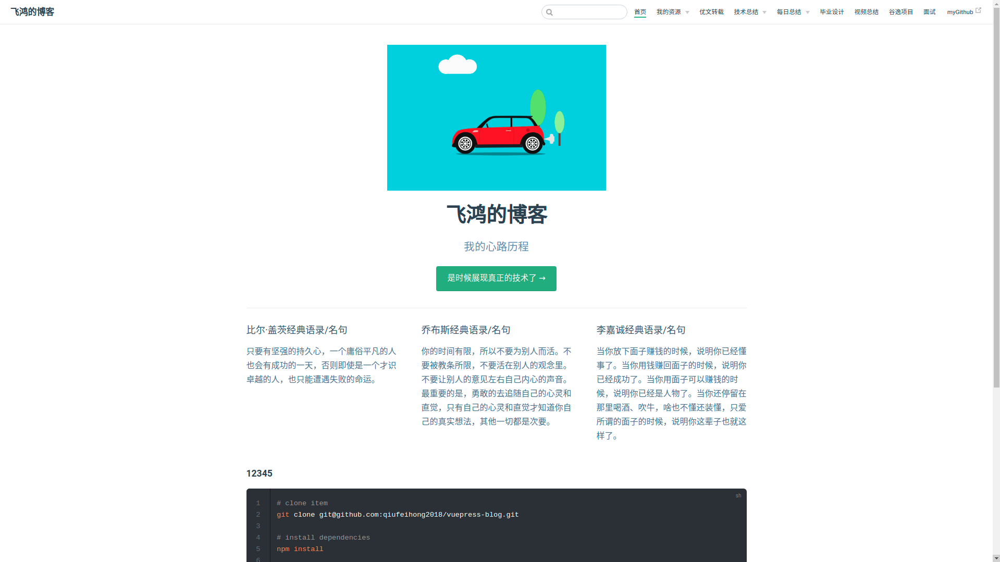

## Markdown的研究
[[toc]]
### 标题
> 我们用的最多的标签#

demo
```text
# 一级标题
## 二级标题
### 三级标题
#### 四级标题
##### 五级标题
###### 六级标题

```
### 代码高亮

``` js
console.log('hello world')
```
```
三个` js
console.log('hello world')
三个`
```


```py
print('hello world')
```
```
三个` py
print('hello world')
三个` 
```
### 字体

demo
```
*斜体*
```
*斜体*

```
**加粗**
```
**加粗**

```
***斜体和加粗***
```
***斜体和加粗***

```
~~删除线~~
```
~~删除线~~
### 引用

> 可以一直>>>嵌套下去

demo

> 引用的文字1
>> 引用的文字2
```text
> 引用的文字
> 引用的文字1
>> 引用的文字2
```

### 分割线

> 分割线用关键词*或-

demo

---
----
***
****

```text

---
----
***
****
```

### 图片

demo
1. 本地图片


```text

```
2. 网络图片


```

```
3. 图片存入md
用base64转码工具把图片转成一段字符串，然后把字符串填到基础格式中链接的那个位置。

基础用法：

这个时候会发现插入的这一长串字符串会把整个文章分割开，非常影响编写文章时的体验。如果能够把大段的base64字符串放在文章末尾，然后在文章中通过一个id来调用，文章就不会被分割的这么乱了。
高级用法
比如：
![avatar][base64str]
[base64str]:data:image/png;base64,iVBORw0......

最后，base64的图片编码如何得来？
使用python将图片转化为base64字符串
```py
import base64
f=open('723.png','rb') #二进制方式打开图文件
ls_f=base64.b64encode(f.read()) #读取文件内容，转换为base64编码
f.close()
print(ls_f)
```
base64字符串转化为图片
```py
import base64
bs='iVBORw0KGgoAAAANSUhEUg....' # 太长了省略
imgdata=base64.b64decode(bs)
file=open('2.jpg','wb')
file.write(imgdata)
file.close()
```
### 超链接

demo

[我的GitHub](https://github.com/qiufeihong2018)

```text
[我的GitHub](https://github.com/qiufeihong2018)
```

### 列表

>嵌套列表上下级之间差了两个space
demo
- 列表
* 列表
+ 列表

1. 列表
2. 列表
3. 列表

- 列表   
  - 列表
  - 列表
    - 列表
    
    
```text
- 列表
* 列表
+ 列表

1. 列表
2. 列表
3. 列表

- 列表   
  - 列表
  - 列表
    - 列表

```
### 制作待办事项To-do List

- [ ] a
  - [x] b
  - [ ] c
- [x] d 
```
- [ ] a
  - [x] b
  - [ ] c
- [x] d 
```
### 表格
> -居中  :-居左 -:居右 

demo

日期|姓名|地址
-|:-|-:
2016-05-02|王小虎|上海市普陀区金沙江路 1518 弄
2016-05-04|王小虎|上海市普陀区金沙江路 1517 弄
2016-05-01|王小虎|上海市普陀区金沙江路 1519 弄
2016-05-03|王小虎|上海市普陀区金沙江路 1516 弄

```text
日期|姓名|地址
-|:-|-:
2016-05-02|王小虎|上海市普陀区金沙江路 1518 弄
2016-05-04|王小虎|上海市普陀区金沙江路 1517 弄
2016-05-01|王小虎|上海市普陀区金沙江路 1519 弄
2016-05-03|王小虎|上海市普陀区金沙江路 1516 弄
```
### 流程图
```
graph TD
  A[A] -->B(B)
  B --> C{C}
  C -->|One| D[D]
  C -->|Two| E[E]
  C -->|Three| F[F]
```

### 序列图

### 甘特图
### 
### 代码


### gif和视频
<iframe frameborder="no" border="0" marginwidth="0" marginheight="0" height=200 width=400 src="http://img.soogif.com/dCLy9LZlkF6mv3FwPxCjBj7l0ciupNMc.gif_s400x0"></iframe>


用`iframe`包裹gif和视频，就可以正常访问啦
```html
<iframe frameborder="no" border="0" marginwidth="0" marginheight="0" height=200 width=400 src="http://img.soogif.com/dCLy9LZlkF6mv3FwPxCjBj7l0ciupNMc.gif_s400x0"></iframe>
```
或是
```html

```


最后，别忘了给这个项目点一个star哦，谢谢支持。

[blog](https://github.com/qiufeihong2018/vuepress-blog)


一个学习编程技术的公众号。每天推送高质量的优秀博文、开源项目、实用工具、面试技巧、编程学习资源等等。目标是做到个人技术与公众号一起成长。欢迎大家关注，一起进步，走向全栈大佬的修炼之路

<style scoped>
    p:nth-last-child(2) {
        text-align: center
    }
</style>