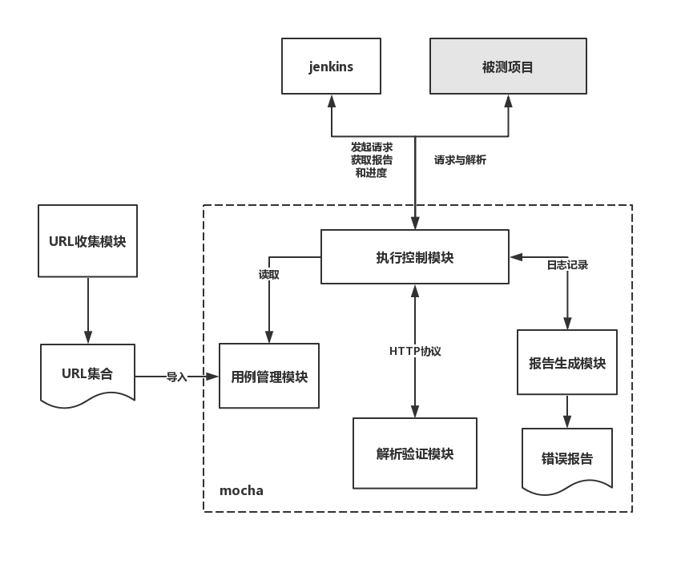
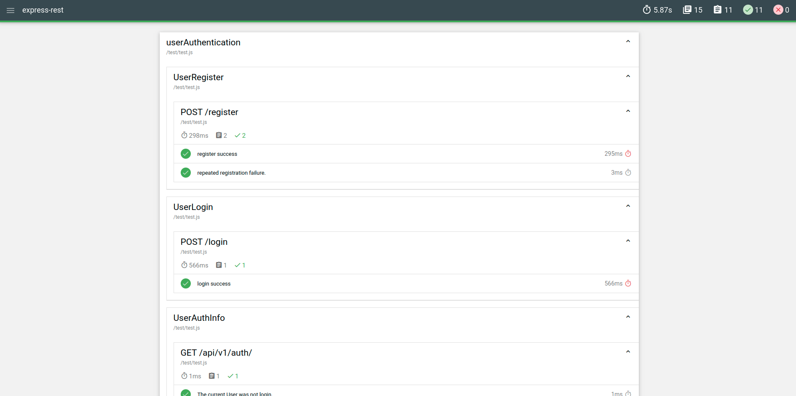
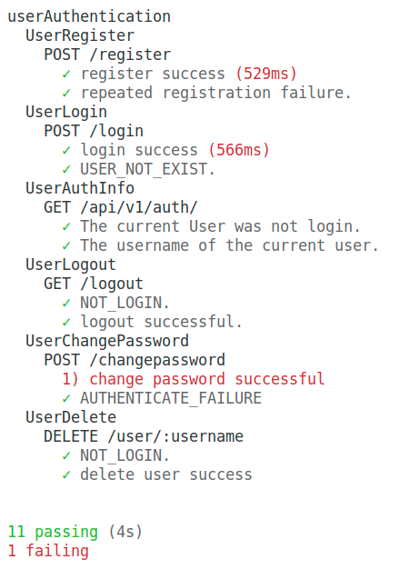

# express项目集成mocha测试框架


> mocha诞生于2011年，是一个特征丰富的javascript测试框架,可以运行在node.js和浏览器上,使异步测试更简单和有趣。mocha测试连续运行，允许灵活和准确的报告，同时将未捕获的异常映射到正确的测试用例。
## 背景
公司项目中,没有自动化的单元测试,而是通过写if/else判断,多少有点懵逼

所在在种种考虑之下,我们就选择mocha测试框架做单元测试



### 测试报告
在terminal里运行
```bash
npm run mochawesome
```
完成项目中的单元测试


单击 `file:///`+项目所在地址+`/mochawesome-report/mochawesome.html`

最终得到的就是这一份测试报告


### 待测试的接口
需要测试的代码如下

```javascript
'use strict';

const router = require('express').Router();
const passport = require('passport');
const User = require('../collections/user');
const log = require('../services/logger').createLogger('userAuthentication');
const AUTH_ERR = require('../constant/errMessage').AUTH;
const COMM_ERR = require('../constant/errMessage').COMMON;

/**
 * @api {get} /v1/auth/ User auth information
 * @apiName UserAuthInfo
 * @apiGroup userAuthentication
 *
 * @apiParam {null} null.
 *
 * @apiSuccess {String} username  The username of the current user.
 * @apiSuccess {date} last  User last logon time.
 *
 * @apiSuccessExample Success-Response:
 *     HTTP/1.1 200 OK
 *     {
 *       "username": "test",
 *       "last": "2019-06-03T06:22:53.567Z"
 *     }
 *
 * @apiError NOT_LOGIN The current User was not logon.
 *
 * @apiErrorExample Error-Response:
 *     HTTP/1.1 401 Unauthorized
 *     {
 *       "err": "NOT_LOGIN",
 *       "message": "User has not logon in!"
 *     }
 */

router.get('/', function(req, res) {
  if (req.user) {
    res.json({
      username: req.user.username,
      last: req.user.last
    });
  } else {
    res.status(401).json({
      err: 'NOT_LOGIN',
      message: AUTH_ERR.NOT_LOGIN
    });
  }
});

/**
 * @api {post} /v1/auth/register User Register
 * @apiName UserRegister
 * @apiGroup userAuthentication
 *
 * @apiParam {String} username  New user's name.
 * @apiParam {String} password  New user's password.
 *
 * @apiSuccess {String} username  The username of the register user.
 * @apiSuccess {string} message  The registering success info.
 *
 * @apiSuccessExample Success-Response:
 *     HTTP/1.1 200 OK
 *     {
 *       "username": "gushen",
 *       "message": "User registered successful"
 *     }
 *
 * @apiError REGISTER_FAILURE The register failure.
 *
 * @apiErrorExample Error-Response:
 *     HTTP/1.1 500 Internal Server Error
 *    {
 *      "err": "REGISTER_FAILURE",
 *      "message": "User register failure!"
 *    }
 */
router.post('/register', function(req, res, next) {
  User.register(new User({ username: req.body.username }), req.body.password, function(err) {
    if (err) {
      log.error(err);
      res.status(500).json({
        err: 'REGISTER_FAILURE',
        message: AUTH_ERR.REGISTER_FAILURE
      });
      return;
    }

    log.info('user ' + req.body.username + ' registered successful!');
    res.json({
      username: req.body.username,
      message: 'User registered successful'
    });

  });
});

/**
 * @api {post} /v1/auth/login User login
 * @apiName UserLogin
 * @apiGroup userAuthentication
 *
 * @apiParam {String} username  User's name.
 * @apiParam {String} password  User's password.
 *
 * @apiSuccess {String} username  The username of the register user.
 * @apiSuccess {string} message  The messgaer if the user login in successful.
 *
 * @apiSuccessExample Success-Response:
 *     HTTP/1.1 200 OK
 *    {
 *      "username": "test",
 *      "message": "Authentication Success"
 *    }
 *
 * @apiError REGISTER_FAILURE The register failure.
 *
 * @apiErrorExample Error-Response:
 *     HTTP/1.1 401 Unauthorized
 *    {
 *      "err": "AUTHENTICATE_FAILURE",
 *      "message": "Authenticate failure"
 *   }
 */
router.post('/login', isAhenticated, passport.authenticate('local'), function(req, res) {
  if (req.user) {
    log.info(`${req.user.username} login in successful`);
    res.json({
      username: req.user.username,
      message: 'Authentication Success'
    });
    return;
  }
  log.info(`${req.user.username} login failure`);
  res.status(401).json({
    err: 'AUTHENTICATE_FAILURE',
    message: `${req.user.username} login failure`
  });

});

/**
 * @api {post} /v1/auth/user/:username User delete
 * @apiName UserDelete
 * @apiGroup userAuthentication
 *
 * @apiParam {String} username  User's name.
 *
 * @apiSuccess {String} username  The username of the deleted user.
 * @apiSuccess {string} message  The message if deleting successful.
 *
 * @apiSuccessExample Success-Response:
 *     HTTP/1.1 200 OK
 *   {
 *     "username": "gushen",
 *     "message": "Delete User Successful"
 *   }
 *
 * @apiError NOT_LOGIN The register failure.
 *
 * @apiErrorExample Error-Response:
 *     HTTP/1.1 401 Unauthorized
 *    {
 *      "err": "NOT_LOGIN",
 *      "message": "User has not logon in!"
 *    }
 */
router.delete('/user/:username', function(req, res) {
  if (!req.user) {
    res.status(401).json({
      err: 'NOT_LOGIN',
      message: AUTH_ERR.NOT_LOGIN
    });
    return;
  }

  // if (!req.params.username) {
  //   res.json({
  //     err: 'PARAMS_NOT_CORRECT',
  //     message: 'No deleted user name'
  //   });
  //   return;
  // }

  User.deleteOne({ username: req.params.username }, (err) => {
    if (err) {
      log.error(err);
      res.status(500).json({
        err: 'SERVER_ERROR',
        message: COMM_ERR.SERVER_ERROR
      });
      return;
    }

    res.json({
      username: req.params.username,
      message: 'Delete User Successful'
    });

    log.info(`${req.params.username} has been deleted`);
  });
});

/**
 * @api {post} /v1/auth/changepassword User change password
 * @apiName UserChangePassword
 * @apiGroup userAuthentication
 *
 * @apiParam {String} username  User's name.
 * @apiParam {String} oldpassword  User's old password.
 * @apiParam {String} newpassword  User's old password.
 *
 * @apiSuccess {String} username  The username of the user.
 * @apiSuccess {string} message  The message if changing password successful.
 *
 * @apiSuccessExample Success-Response:
 *     HTTP/1.1 200 OK
 *   {
 *     "username": "test",
 *     "message": "change password successful"
 *   }
 *
 * @apiError AUTHENTICATE_FAILURE The register failure.
 *
 * @apiErrorExample Error-Response:
 *     HTTP/1.1 401 Unauthorized
 *   {
 *     "err": "AUTHENTICATE_FAILURE",
 *     "message": "Password or username is incorrect"
 *   }
 */
router.post('/changepassword', function(req, res) {
  User.findOne({ 'username': req.body.username }, (err, user) => {
    if (err) {
      log.error(err);
      res.status(500).json({
        err: 'SERVER_ERROR',
        message: COMM_ERR.SERVER_ERROR
      });
      return;
    }

    if (!user) {
      res.status(500).json({
        err: 'USER_NOT_EXIST',
        message: AUTH_ERR.USER_NOT_EXIST
      });
      return;
    }

    user.changePassword(req.body.oldpassword, req.body.newpassword, (err, value) => {
      if (err) {
        log.error(err);
        res.status(401).json({
          err: 'AUTHENTICATE_FAILURE',
          message: err.message
        });
        return;
      }

      log.info(`${req.body.username} change password successful`);
      res.json({
        username: req.body.username,
        message: 'change password successful'
      });

    });
  });
});

/**
 * @api {get} /v1/auth/logout User login out
 * @apiName UserLogout
 * @apiGroup userAuthentication
 *
 * @apiSuccess {String} username  The username of the user.
 * @apiSuccess {string} message  The message if user login out successful.
 *
 * @apiSuccessExample Success-Response:
 *     HTTP/1.1 200 OK
 *     {
 *       "username": "test",
 *       "message": "logout successful"
 *     }
 *
 * @apiError NOT_LOGIN There is no user logon in.
 *
 * @apiErrorExample Error-Response:
 *     HTTP/1.1 401 Unauthorized
 *   {
 *     "err": "NOT_LOGIN",
 *     "message": "No user has been logon"
 *   }
 */
router.get('/logout', function(req, res) {
  const user = req.user;
  if (!user) {
    res.status(401).json({
      err: 'NOT_LOGIN',
      message: 'No user has been logon'
    });
    return;
  }

  // user login out
  req.logout();
  if (!req.user) {
    res.json({
      username: user.username,
      message: 'logout successful'
    });

    log.info(`${user.username} has been logon out`);
    return;
  }

  res.status(500).json({
    err: 'SERVER_ERROR',
    message: 'logout failure!'
  });

});


function isAhenticated(req, res, next) {
  User.findOne({ 'username': req.body.username }, (err, user) => {
    if (err) {
      log.error(err);
      res.json({
        err: 'SERVER_ERROR',
        message: COMM_ERR.SERVER_ERROR
      });
      return;
    }
    // If user is not existed
    if (!user) {
      res.json({
        err: 'USER_NOT_EXIST',
        message: AUTH_ERR.USER_NOT_EXIST
      });

      return;
    }


    user.authenticate(req.body.password, (err, value) => {
      if (err) {
        log.error(err);
        res.json({
          err: 'SERVER_ERROR',
          message: COMM_ERR.SERVER_ERROR
        });
      } else if (value) {
        return next();
      } else {
        res.json({
          err: 'AUTHENTICATE_FAILURE',
          message: AUTH_ERR.AUTHENTICATE_FAILURE
        });
      }
    });
  });
}


module.exports = router;

```

这是一套常见的有关用户登录注册验证的接口


因为文本只涉及到这个模块,所以将这个模块的接口都写在`userAuthentication`测试套件下
```javascript
describe('userAuthentication', function() {}
```

### 测试代码

```javascript
'use strict';

const request = require('supertest');
const url = 'http://localhost:5001';
// eslint-disable-next-line no-unused-vars
const should = require('should');

var userCookie;

// 用户名密码
const user = {
  username: 'name',
  password: 'password'
};

// 测试更改密码(每次测试完调换)
const user2 = {
  username: 'uu2',
  password: 'oldpassword'
};

const newUser2 = {
  username: 'uu2',
  oldpassword: 'oldpassword',
  newpassword: 'newpassword'
};

// const user22={
//   username: 'uu2',
//   password: 'newpassword'
// };
// const oldUser2 = {
//   username: 'uu2',
//   oldpassword: 'newpassword',
//   newpassword: 'oldpassword'
// };

describe('userAuthentication', function() {
  // 测试注册接口
  describe('UserRegister', function() {
    describe('POST /register', function() {
      // eslint-disable-next-line max-len
      it('register success', function(done) {
        request(url)
          .post('/api/v1/auth/register')
          .send(user)
          .expect(200)
          .end(function(err, res) {
            res.body.should.containEql({
              message: 'User registered successful'
            });
            if (err) throw err;
            done();
          });
      });
      it('repeated registration failure.', function(done) {
        request(url)
          .post('/api/v1/auth/register')
          .send(user)
          .expect(500)
          .end(function(err, res) {
            res.body.should.containEql({
              err: 'REGISTER_FAILURE'
            });
            if (err) throw err;
            done();
          });
      });
    });
  });
  // 测试登录接口
  describe('UserLogin', function() {
    describe('POST /login', function() {
      it('login success', function(done) {
        request(url)
          .post('/api/v1/auth/login')
          .send(user)
          .expect(200)
          .end(function(err, res) {
            res.body.should.containEql({
              message: 'Authentication Success'
            });
            if (err) throw err;
            done();
          });
      });
      it('USER_NOT_EXIST.', function(done) {
        request(url)
          .post('/api/v1/auth/login')
          .send({
            username: 'a',
            password: 'admin'
          })
          .expect(200)
          .end(function(err, res) {
            res.body.should.containEql({
              err: 'USER_NOT_EXIST'
            });
            if (err) throw err;
            done();
          });
      });
    });
  });
  // 权限验证
  describe('UserAuthInfo', function() {
    describe('GET /api/v1/auth/', function() {
      // 没有登录,权限验证
      it('The current User was not login.', function(done) {
        request(url)
          .get('/api/v1/auth/')
          .set('Accept', 'application/json')
          .expect('Content-Type', /json/)
          .expect(401)
          .end(function(err, res) {
            res.body.should.containEql({
              err: 'NOT_LOGIN'
            });
            if (err) throw err;
            done();
          });
      });
      // 权限验证前先登录
      beforeEach(function(done) {
        request(url)
          .post('/api/v1/auth/login')
          .send(user)
          .set('Accept', 'application/json')
          .end(function(err, res) {
            if (!err) {
              userCookie = res.header['set-cookie'];
              done();
            }
          });
      });
      it('The username of the current user.', function(done) {
        request(url)
          .get('/api/v1/auth/')
          .set('Cookie', userCookie)
          .expect(200)
          .end(function(err, res) {
            res.body.should.have.keys('username');
            if (err) throw err;
            done();
          });
      });
    });
  });
  // 测试用户注销接口
  describe('UserLogout', function() {
    describe('GET /logout', function() {
      // 没有登录,测试注销
      it('NOT_LOGIN.', function(done) {
        request(url)
          .get('/api/v1/auth/logout')
          .expect(401)
          .end(function(err, res) {
            res.body.should.containEql({
              err: 'NOT_LOGIN'
            });
            if (err) throw err;
            done();
          });
      });
      // 注销成功前先登录
      beforeEach(function(done) {
        request(url)
          .post('/api/v1/auth/login')
          .send(user)
          .set('Accept', 'application/json')
          .end(function(err, res) {
            if (!err) {
              userCookie = res.header['set-cookie'];
              done();
            }
          });
      });
      it('logout successful.', function(done) {
        request(url)
          .get('/api/v1/auth/logout')
          .set('Cookie', userCookie)
          .expect(200)
          .end(function(err, res) {
            res.body.should.containEql({
              message: 'logout successful'
            });
            if (err) throw err;
            done();
          });
      });
    });
  });
  // 测试更改用户密码接口
  describe('UserChangePassword', function() {
    describe('POST /changepassword', function() {
      // 更改用户密码前先注册-登录
      // eslint-disable-next-line no-undef
      before(function(done) {
        request(url)
          .post('/api/v1/auth/register')
          .send(user2)
          .end(function(err, res) {
            if (err) throw err;
            done();
          });
      });
      // eslint-disable-next-line no-undef
      before(function(done) {
        request(url)
          .post('/api/v1/auth/login')
          .send(user2)
          .set('Accept', 'application/json')
          .end(function(err, res) {
            if (!err) {
              userCookie = res.header['set-cookie'];
              done();
            }
          });
      });
      it('change password successful', function(done) {
        request(url)
          .post('/api/v1/auth/changepassword')
          .set('Cookie', userCookie)
          .send(newUser2)
          .expect(200)
          .end(function(err, res) {
            res.body.should.containEql({
              message: 'change password successful'
            });
            if (err) throw err;
            done();
          });
      });
      it('AUTHENTICATE_FAILURE', function(done) {
        request(url)
          .post('/api/v1/auth/changepassword')
          .set('Cookie', userCookie)
          .send(newUser2)
          .expect(401)
          .end(function(err, res) {
            res.body.should.containEql({
              err: 'AUTHENTICATE_FAILURE'
            });
            if (err) throw err;
            done();
          });
      });
      // after(function(done) {
      //   request(url)
      //   .post('/api/v1/auth/login')
      //   .send(user22)
      //   .set('Accept', 'application/json')
      //   .end(function(err, res) {
      //     if (!err) {
      //       userCookie = res.header['set-cookie'];
      //       done();
      //     }
      //   });
      // });
      // after(function(done) {
      //   request(url)
      //   .post('/api/v1/auth/changepassword')
      //   .set('Cookie', userCookie)
      //   .send(oldUser2)
      //   .expect(200)
      //   .end(function(err, res) {
      //     res.body.should.containEql({
      //       message: 'rechange password successful'
      //     });
      //     if (err) throw err;
      //     done();
      //   });
      // });
    });
  });
  // 测试删除用户接口
  describe('UserDelete', function() {
    describe('DELETE /user/:username', function() {
      it('NOT_LOGIN.', function(done) {
        request(url)
          .delete(`/api/v1/auth/user/${user.username}`)
          .expect(401)
          .end(function(err, res) {
            res.body.should.containEql({
              err: 'NOT_LOGIN'
            });
            if (err) throw err;
            done();
          });
      });
      // 删除用户前先登录
      beforeEach(function(done) {
        request(url)
          .post('/api/v1/auth/login')
          .send(user)
          .set('Accept', 'application/json')
          .end(function(err, res) {
            if (!err) {
              userCookie = res.header['set-cookie'];
              done();
            }
          });
      });
      it('delete user success', function(done) {
        request(url)
          .delete(`/api/v1/auth/user/${user.username}`)
          .set('Cookie', userCookie)
          .expect(200)
          .end(function(err, res) {
            res.body.should.containEql({
              message: 'Delete User Successful'
            });
            if (err) throw err;
            done();
          });
      });
    });
  });
});
```

## 测试前的准备
### 测试框架

所谓"测试框架"，就是运行测试的工具。通过它，可以为JavaScript应用添加测试，从而保证代码的质量。

> 通常应用会有单元测试(Unit tests)和功能测试(Functional tests)，复杂大型应用可能会有整合测试(Integration tests)。

1. 单元测试：关注应用中每个零部件的正常运转，防止后续修改影响之前的组件。
2. 功能测试：确保其整体表现符合预期，关注能否让用户正常使用。
3. 整合测试：确保单独运行正常的零部件整合到一起之后依然能正常运行。

开发人员主要是集中单元测试，作为开发中的反馈。

单元测试的好处：

1. 如果能通过单元测试，那么通过后续测试且软件整体正常运行的概率大大提高。
2. 单元测试发现的问题定位到细节，容易修改，节省时间。
3. 追踪问题变得更加方便。

### 选择单元测试框架
单元测试应该：简单，快速执行，清晰的错误报告。
测试框架基本上都做了同一件事儿：

1. 描述你要测试的东西
2. 对其进行测试
3. 判断是否符合预期
   
选择框架会考虑下面的点：

1. 断言(Assertions)：用于判断结果是否符合预期。有些框架需要单独的断言库。
2. 适合 TDD / BDD：是否适合 测试驱动型 / 行为驱动型 的测试风格。
3. 异步测试：有些框架对异步测试支持良好。
4. 使用的语言：大部分 js 测试框架使用 js。
5. 用于特定目的：每个框架可能会擅长处理不同的问题。
6. 社区是否活跃。
注：
1. TDD：测试驱动型的开发方式，先写测试代码，之后编写能通过测试的业务代码，可以不断的在能通过测试的情况下重构。
2. BDD：与 TDD 很相似，测试代码的风格是预期结果，更关注功能，看起来像需求文档。

其实都是先写测试代码，感觉BDD 风格更人性。

### 测试工具的类型
组合使用工具很常见，即使已选框架也能实现类似的功能

1. 提供测试框架(Mocha, Jasmine, Jest, Cucumber)
2. 提供断言(Chai, Jasmine, Jest, Unexpected)
3. 生成，展示测试结果(Mocha, Jasmine, Jest, Karma)
4. 快照测试(Jest, Ava)
5. 提供仿真(Sinon, Jasmine, enzyme, Jest, testdouble)
6. 生成测试覆盖率报告(Istanbul, Jest, Blanket)
7. 提供类浏览器环境(Protractor, Nightwatch, Phantom, Casper)

解释上面提到的点：
1. 测试框架，即组织你的测试，当前流行 BDD 的测试结构。
2. 快照测试(snapshot testing)，测试 UI 或数据结构是否和之前完全一致，通常 UI 测试不在单元测试中
3. 仿真(mocks, spies, and stubs)：获取方法的调用信息，模拟方法，模块，甚至服务器

### Jest/Jasmine/Mocha框架特点


- Jest
  - facebook 坐庄
  - 基于 Jasmine 至今已经做了大量修改添加了很多特性
  - 开箱即用配置少，API简单
  - 支持断言和仿真
  - 支持快照测试
  - 在隔离环境下测试
  - 互动模式选择要测试的模块
  - 优雅的测试覆盖率报告，基于Istanbul
  - 智能并行测试(参考)
  - 较新，社区不十分成熟
  - 全局环境，比如 describe 不需要引入直接用
  - 较多用于 React 项目(但广泛支持各种项目)


- Jasmine
  - 开箱即用(支持断言和仿真)
  - 全局环境
  - 比较'老',坑基本都有人踩过了
  - AVA
  - 异步，性能好
  - 简约，清晰
  - 快照测试和断言需要三方支持
  - Tape
  - 体积最小，只提供最关键的东西
  - 对比其他框架，只提供最底层的 API


- Mocha
  - 灵活(不包括断言和仿真，自己选对应工具)
  - 流行的选择：chai，sinon
  - 社区成熟用的人多，测试各种东西社区都有示例
  - 需要较多配置
  - 可以使用快照测试，但依然需要额外配置
  
综上所述，Mocha 用的人最多，社区最成熟，灵活，可配置性强易拓展，Jest 开箱即用，里边啥都有提供全面的方案，Tape 最精简，提供最基础的东西最底层的API。所以本文就选择用mocha。

### mocha特征

1. 浏览器支持
2. 全局变量泄漏检测
3. 简单异步支持,包括promise
4. 可以选择运行与regexp匹配的测试
5. 测试覆盖率报告
6. 自动退出以防止活动循环“挂起”
7. 字符串差异支持
8. 易于元生成套件和测试用例
9. 用于运行测试的javascript API
10. 配置文件支持
11. CI支持等的正确退出状态
12. mocha.opts文件支持
13. 自动检测和禁用非tty的着色
14. 可单击套件标题以筛选测试执行
15. 将未捕获的异常映射到正确的测试用例
16. 节点调试器支持
17. 异步测试超时支持
18. 检测多个要完成的调用
19. 测试重试支持
20. 测试特定超时
21. 咆哮支持
22. 报告测试持续时间
23. 突出显示慢速测试
24. 文件监视程序支持
25. 使用所需的任何断言库
26. extensible reporting, bundled with 9+ reporters
27. 可扩展测试DSL或“接口”
28. 每个钩子之前、之后、所有钩子之前、之后
29. 任意蒸腾器支持（coffee-script 等）
30. TextMate bundle

### 断言库should
Mocha本身是不包含断言库的，所以我们需要自己选择断言库。should是一个很简单的、贴近自然语言的断言库。当然，Mocha是适配所有的断言库的，如果你喜欢其他的断言库比如expect之类的，你也可以把它包含进来使用。

### http测试模块SuperTest
单单使用Mocha和should就几乎可以满足所有JavaScript函数的单元测试。但是对于Node应用而言，不仅仅是函数的集合，比如一个web应用的测试。这时候就需要配合一个http代理，完成Http请求和路由的测试。
Supertest是一个HTTP代理服务引擎，可以模拟一切HTTP请求行为。Supertest可以搭配任意的应用框架，从而进行应用的单元测试。

### 测试套件describe
describe块称为"测试套件"（test suite），表示一组相关的测试。它是一个函数，第一个参数是测试套件的名称（"加法函数的测试"），第二个参数是一个实际执行的函数。

### 测试用例it

it块称为"测试用例"（test case），表示一个单独的测试，是测试的最小单位。它也是一个函数，第一个参数是测试用例的名称（"1 加 1 应该等于 2"），第二个参数是一个实际执行的函数。

### 钩子hooks
Mocha在describe块之中，提供测试用例的四个钩子：before()、after()、beforeEach()和afterEach()。它们会在指定时间执行。


```javascript
describe('hooks', function() {

  before(function() {
    // 在本区块的所有测试用例之前执行
  });

  after(function() {
    // 在本区块的所有测试用例之后执行
  });

  beforeEach(function() {
    // 在本区块的每个测试用例之前执行
  });

  afterEach(function() {
    // 在本区块的每个测试用例之后执行
  });

  // test cases
});
```

> 安装mocha> = v3.0.0，npm的版本应该> = v2.14.2。除此，确保使用Node.js的版本> = v4来运行mocha
### mocha小例子
#### 安装
作为项目的依赖进行安装
```bash
npm install --save-dev mocha
```

#### 开始

```bash
mkdir test
cd test
touch test.js
```
加入测试代码

```javascript
'use strict'
var assert = require('assert');
describe('Array', function() {
  describe('#indexOf()', function() {
    it('should return 0 when the value is not present', function() {
      assert.equal([1, 2, 3].indexOf(1), 1);
    });
  });
});
```
安装依赖
```bash
npm install --save-dev assert
```
执行测试
```bash
./node_modules/mocha/bin/mocha
```

报错结果
```bash

  Array
    #indexOf()
      1) should return 0 when the value is not present


  0 passing (5ms)
  1 failing

  1) Array
       #indexOf()
         should return 0 when the value is not present:

      AssertionError [ERR_ASSERTION]: 0 == 1
      + expected - actual

      -0
      +1
      
      at Context.<anonymous> (test/test.js:6:14)

```
package.json中写入命令
```bash
  "mocha": "mocha"
```
执行命令
```bash
npm run mocha
```

正确测试
```javascript
'use strict'
var assert = require('assert');
describe('Array', function() {
  describe('#indexOf()', function() {
    it('should return 0 when the value is not present', function() {
      assert.equal([1, 2, 3].indexOf(1), 0);
    });
  });
});
```
正确结果
```bash
 Array
    #indexOf()
      ✓ should return 0 when the value is not present


  1 passing (4ms)
```

到这里,对mocha就有了初步的认识

## 开始测试
了解了背景和框架后,正式开启测试

### 添加依赖
```bash 
npm install --save-dev mocha mochawesome should supertest
```

### 在scripts中添加命令
```json
"mochawesome": "./node_modules/.bin/mocha --reporter mochawesome",
"dev": "node index.js"
```
mochawesome生成报告

dev启动项目

### 注册接口的测试
1. 从注册接口中,我得知该接口返回两个状态码,分别是200和500,对应的注册成功和注册失败
2. 那么测试中就有两个注册成功和失败的测试用例
3. 每个测试用例针对每个状态返回的值判断
4. 通过即可
5. 不通过,要么是接口有问题,要么是写的测试有问题

```javascript

/**
 * @api {post} /v1/auth/register User Register
 * @apiName UserRegister
 * @apiGroup userAuthentication
 *
 * @apiParam {String} username  New user's name.
 * @apiParam {String} password  New user's password.
 *
 * @apiSuccess {String} username  The username of the register user.
 * @apiSuccess {string} message  The registering success info.
 *
 * @apiSuccessExample Success-Response:
 *     HTTP/1.1 200 OK
 *     {
 *       "username": "gushen",
 *       "message": "User registered successful"
 *     }
 *
 * @apiError REGISTER_FAILURE The register failure.
 *
 * @apiErrorExample Error-Response:
 *     HTTP/1.1 500 Internal Server Error
 *    {
 *      "err": "REGISTER_FAILURE",
 *      "message": "User register failure!"
 *    }
 */
router.post('/register', function(req, res, next) {
  User.register(new User({ username: req.body.username }), req.body.password, function(err) {
    if (err) {
      log.error(err);
      res.status(500).json({
        err: 'REGISTER_FAILURE',
        message: AUTH_ERR.REGISTER_FAILURE
      });
      return;
    }

    log.info('user ' + req.body.username + ' registered successful!');
    res.json({
      username: req.body.username,
      message: 'User registered successful'
    });

  });
});

```
1. `UserRegister`是第二层套件
2. `POST /register`是第三层套件
3. `register success`是测试用例名称
4. it的方法是测试用例的方法
5. 请求url地址
6. 发送post请求
7. 发送用户名和密码
8. 断言状态码
9. 断言返回的值
10. 执行下一步

注意: 每个测试用例结束后必须带上`done`,否则没有结束标识,会超时报错

```javascript
  // 测试注册接口
  describe('UserRegister', function() {
    describe('POST /register', function() {
      // eslint-disable-next-line max-len
      it('register success', function(done) {
        request(url)
          .post('/api/v1/auth/register')
          .send(user)
          .expect(200)
          .end(function(err, res) {
            res.body.should.containEql({
              message: 'User registered successful'
            });
            if (err) throw err;
            done();
          });
      });
      it('repeated registration failure.', function(done) {
        request(url)
          .post('/api/v1/auth/register')
          .send(user)
          .expect(500)
          .end(function(err, res) {
            res.body.should.containEql({
              err: 'REGISTER_FAILURE'
            });
            if (err) throw err;
            done();
          });
      });
    });
  });
```

### 登录接口的测试
没什么好讲的,同测试注册接口步骤一致
```javascript
  describe('UserLogin', function() {
    describe('POST /login', function() {
      it('login success', function(done) {
        request(url)
          .post('/api/v1/auth/login')
          .send(user)
          .expect(200)
          .end(function(err, res) {
            res.body.should.containEql({
              message: 'Authentication Success'
            });
            if (err) throw err;
            done();
          });
      });
      it('USER_NOT_EXIST.', function(done) {
        request(url)
          .post('/api/v1/auth/login')
          .send({
            username: 'a',
            password: 'admin'
          })
          .expect(200)
          .end(function(err, res) {
            res.body.should.containEql({
              err: 'USER_NOT_EXIST'
            });
            if (err) throw err;
            done();
          });
      });
    });
  });
```
### 权限验证的测试
1. 权限验证就有点不一样了,因为验证权限前必须先登录,这时候就要用上mocha的钩子
2. 权限是通过cookie验证,所以验证前必须要带上cookie
3. 在`before`钩子中加入
```javascript
userCookie = res.header['set-cookie'];
```
4. 在断言的请求中带上`Cookie`
```javascript
.set('Cookie', userCookie)
```
```javascript
// 权限验证
  describe('UserAuthInfo', function() {
    describe('GET /api/v1/auth/', function() {
      // 没有登录,权限验证
      it('The current User was not login.', function(done) {
        request(url)
          .get('/api/v1/auth/')
          .set('Accept', 'application/json')
          .expect('Content-Type', /json/)
          .expect(401)
          .end(function(err, res) {
            res.body.should.containEql({
              err: 'NOT_LOGIN'
            });
            if (err) throw err;
            done();
          });
      });
      // 权限验证前先登录
      beforeEach(function(done) {
        request(url)
          .post('/api/v1/auth/login')
          .send(user)
          .set('Accept', 'application/json')
          .end(function(err, res) {
            if (!err) {
              userCookie = res.header['set-cookie'];
              done();
            }
          });
      });
      it('The username of the current user.', function(done) {
        request(url)
          .get('/api/v1/auth/')
          .set('Cookie', userCookie)
          .expect(200)
          .end(function(err, res) {
            res.body.should.have.keys('username');
            if (err) throw err;
            done();
          });
      });
    });
  });
```


### 用户注销接口的测试
没什么好讲的,同测试权限验证步骤一致
```javascript
 describe('UserLogout', function() {
    describe('GET /logout', function() {
      // 没有登录,测试注销
      it('NOT_LOGIN.', function(done) {
        request(url)
          .get('/api/v1/auth/logout')
          .expect(401)
          .end(function(err, res) {
            res.body.should.containEql({
              err: 'NOT_LOGIN'
            });
            if (err) throw err;
            done();
          });
      });
      // 注销成功前先登录
      beforeEach(function(done) {
        request(url)
          .post('/api/v1/auth/login')
          .send(user)
          .set('Accept', 'application/json')
          .end(function(err, res) {
            if (!err) {
              userCookie = res.header['set-cookie'];
              done();
            }
          });
      });
      it('logout successful.', function(done) {
        request(url)
          .get('/api/v1/auth/logout')
          .set('Cookie', userCookie)
          .expect(200)
          .end(function(err, res) {
            res.body.should.containEql({
              message: 'logout successful'
            });
            if (err) throw err;
            done();
          });
      });
    });
  });
```
### 更改用户密码的测试 
更改用户密码前先注册-登录

```javascript
  // 测试更改用户密码接口
  describe('UserChangePassword', function() {
    describe('POST /changepassword', function() {
      // 更改用户密码前先注册-登录
      // eslint-disable-next-line no-undef
      before(function(done) {
        request(url)
          .post('/api/v1/auth/register')
          .send(user2)
          .end(function(err, res) {
            if (err) throw err;
            done();
          });
      });
      // eslint-disable-next-line no-undef
      before(function(done) {
        request(url)
          .post('/api/v1/auth/login')
          .send(user2)
          .set('Accept', 'application/json')
          .end(function(err, res) {
            if (!err) {
              userCookie = res.header['set-cookie'];
              done();
            }
          });
      });
      it('change password successful', function(done) {
        request(url)
          .post('/api/v1/auth/changepassword')
          .set('Cookie', userCookie)
          .send(newUser2)
          .expect(200)
          .end(function(err, res) {
            res.body.should.containEql({
              message: 'change password successful'
            });
            if (err) throw err;
            done();
          });
      });
      it('AUTHENTICATE_FAILURE', function(done) {
        request(url)
          .post('/api/v1/auth/changepassword')
          .set('Cookie', userCookie)
          .send(newUser2)
          .expect(401)
          .end(function(err, res) {
            res.body.should.containEql({
              err: 'AUTHENTICATE_FAILURE'
            });
            if (err) throw err;
            done();
          });
      });
      // after(function(done) {
      //   request(url)
      //   .post('/api/v1/auth/login')
      //   .send(user22)
      //   .set('Accept', 'application/json')
      //   .end(function(err, res) {
      //     if (!err) {
      //       userCookie = res.header['set-cookie'];
      //       done();
      //     }
      //   });
      // });
      // after(function(done) {
      //   request(url)
      //   .post('/api/v1/auth/changepassword')
      //   .set('Cookie', userCookie)
      //   .send(oldUser2)
      //   .expect(200)
      //   .end(function(err, res) {
      //     res.body.should.containEql({
      //       message: 'rechange password successful'
      //     });
      //     if (err) throw err;
      //     done();
      //   });
      // });
    });
  });
```
问题是我改完后得将密码改回来,这一步我没有成功,很奇怪为什么?

目前得每次测试完后将新旧密码调换,真的很麻烦


### 删除用户的测试
没什么好讲的,同测试权限验证步骤一致

```javascript
describe('UserDelete', function() {
    describe('DELETE /user/:username', function() {
      it('NOT_LOGIN.', function(done) {
        request(url)
          .delete(`/api/v1/auth/user/${user.username}`)
          .expect(401)
          .end(function(err, res) {
            res.body.should.containEql({
              err: 'NOT_LOGIN'
            });
            if (err) throw err;
            done();
          });
      });
      // 删除用户前先登录
      beforeEach(function(done) {
        request(url)
          .post('/api/v1/auth/login')
          .send(user)
          .set('Accept', 'application/json')
          .end(function(err, res) {
            if (!err) {
              userCookie = res.header['set-cookie'];
              done();
            }
          });
      });
      it('delete user success', function(done) {
        request(url)
          .delete(`/api/v1/auth/user/${user.username}`)
          .set('Cookie', userCookie)
          .expect(200)
          .end(function(err, res) {
            res.body.should.containEql({
              message: 'Delete User Successful'
            });
            if (err) throw err;
            done();
          });
      });
    });
  });
```
### 未完待续


口渴了,快去喝杯mocha吧

## 参考文献
[mocha官网](https://mochajs.org/)

[测试框架 Mocha 实例教程](http://www.ruanyifeng.com/blog/2015/12/a-mocha-tutorial-of-examples.html)

[前端测试框架对比(js单元测试框架对比)](https://www.cnblogs.com/lihuanqing/p/8533552.html)

[mocha 和 supertest](https://github.com/nswbmw/N-blog/blob/master/book/4.14%20%E6%B5%8B%E8%AF%95.md#4141-mocha-%E5%92%8C-supertest)

[使用mocha给mongoose写单元测试](http://ju.outofmemory.cn/entry/86908)

[nodejs使用mocha进行接口测试](https://blog.csdn.net/weixin_34308389/article/details/87441278)

[node中使用 mocha + supertest + should 来写单元测试](https://github.com/xiyuyizhi/movies/blob/master/dayByday/day5.md)

[【Node开发笔记】单元测试工具Mocha和SuperTest](https://www.imooc.com/article/2631)

[一步一步搭建react应用-node中使用 mocha + supertest + should 来写单元测试](https://segmentfault.com/a/1190000011095213)

[mocha + chai + supertest 测试 node server](https://webfem.com/post/mocha-test)

[Should.js](http://shouldjs.github.io/)

[接口自动化 开源框架学习-supertest](https://blog.csdn.net/lichao330530/article/details/51907075)

[supertest](https://www.npmjs.com/package/supertest)

[Nodejs单元测试小结](https://segmentfault.com/a/1190000002921481?utm_source=tag-newest)

[使用mocha进行单元测试](https://www.jianshu.com/p/47575895bc54)


最后，别忘了给这个项目点一个star哦，谢谢支持。

[blog](https://github.com/qiufeihong2018/vuepress-blog)


一个学习编程技术的公众号。每天推送高质量的优秀博文、开源项目、实用工具、面试技巧、编程学习资源等等。目标是做到个人技术与公众号一起成长。欢迎大家关注，一起进步，走向全栈大佬的修炼之路

<style scoped>
    p:nth-last-child(2) {
        text-align: center
    }
</style>