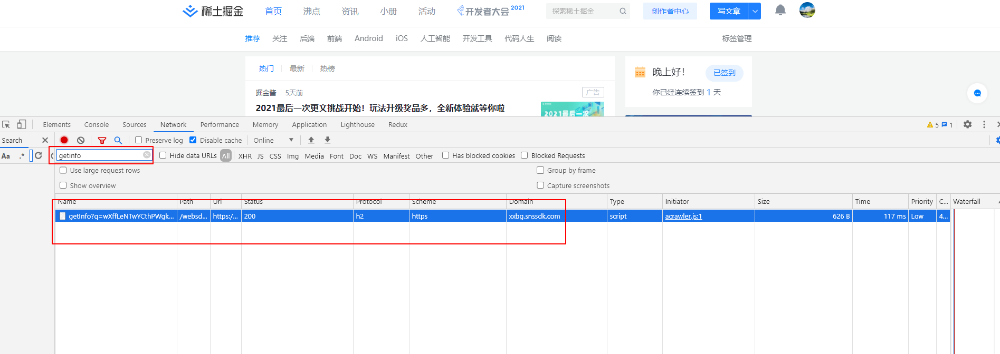
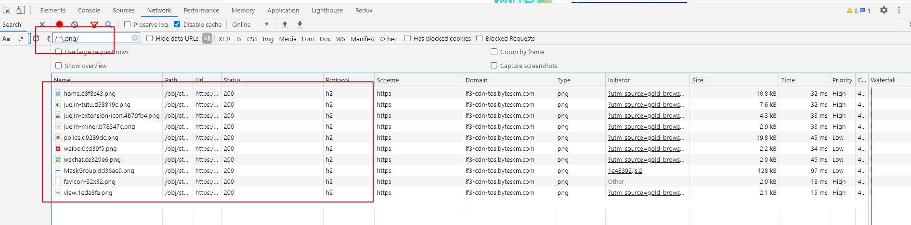
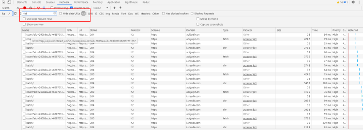
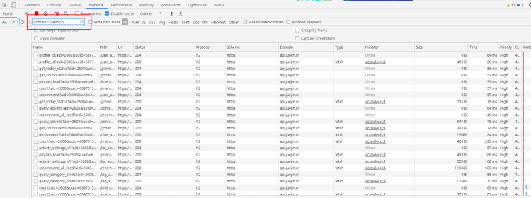
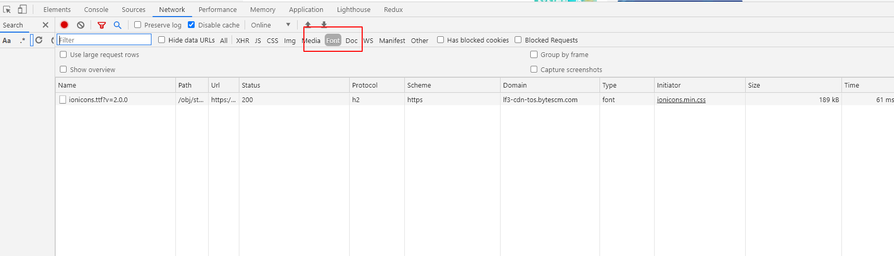
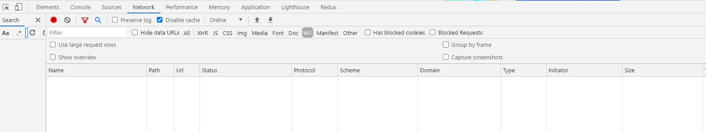
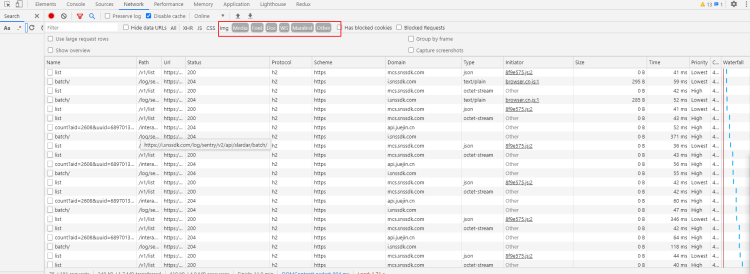

# 网络请求
如果有接口轮询，大家是不是查找某个接口特别不方便。
其实有办法可以过滤接口，找到心仪的接口。

方法：

## 通过文本查找网络请求

## 通过正则表达式查找网络请求

## 过滤（排除）网络请求

输入 -list，DevTools 会过滤掉包含 list的所有文件。如果任何其他文件与该模式匹配，它们也将被过滤掉，并且在网络面板中将不可见。

## 使用属性过滤器查看特定域的网络请求

在过滤区域输入 domain:*.juejin.cn，将只显示 URL 为domain:*.juejin.cn 的网络请求。

## 按资源类型查找网络请求

如果你只想查看某个页面上正在使用哪种字体文件，请单击 Font：

或者，如果你只想查看特定页面上正在加载的 web socket 文件，请单击 WS

你还可以更进一步，同时查看 Media、Font、Doc、WS、Manifest 和Other 文件。只需先单击 Media，然后按住 cmd单击 Font、Doc、WS、Manifest 和Other，打开多个面板。（如果你在 Windows 电脑上，则可以通过使用 ctrl 来进行多选）。

