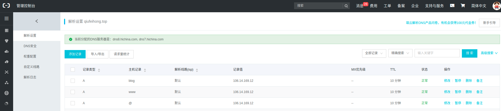
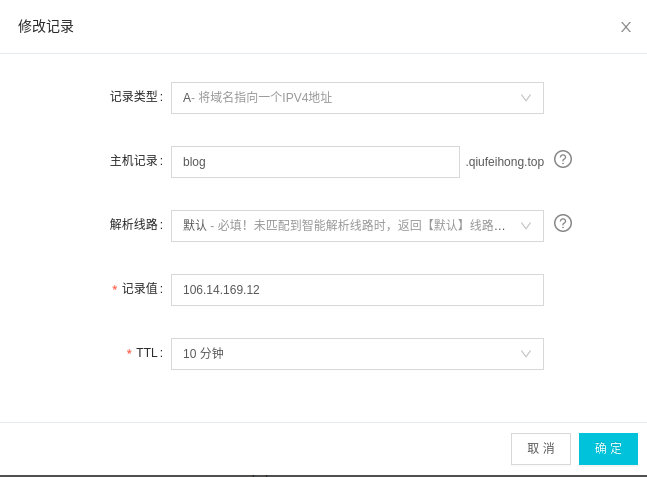

# nginx配置
## 安装nginx
[ubuntu的安装指南](https://nginx.org/en/linux_packages.html#Ubuntu)
- 安装前提
```bash
sudo apt install curl gnupg2 ca-certificates lsb-release
```
- 为稳定版的nginx设置apt仓库，运行下面命令
```bash
echo "deb http://nginx.org/packages/ubuntu `lsb_release -cs` nginx" \
    | sudo tee /etc/apt/sources.list.d/nginx.list
```
- 用主分支的nginx包，则运行一下命令
```bash
echo "deb http://nginx.org/packages/mainline/ubuntu `lsb_release -cs` nginx" \
    | sudo tee /etc/apt/sources.list.d/nginx.list
```
- 下一步，导入官方nginx签名证书，为了让apt验证包的真实性
```bash
curl -fsSL https://nginx.org/keys/nginx_signing.key | sudo apt-key add -
```
- 确认你现在用的正确的密钥
```bash
sudo apt-key fingerprint ABF5BD827BD9BF62
```
- 输出应该包含完整的指纹
```bash
pub   rsa2048 2011-08-19 [SC] [expires: 2024-06-14]
      573B FD6B 3D8F BC64 1079  A6AB ABF5 BD82 7BD9 BF62
uid   [ unknown] nginx signing key <signing-key@nginx.com>
```
- 去安装nginx
```bash
sudo apt update
sudo apt install nginx
```

## 配置nginx
- Nginx安装结束后，yum默认安装位置在/etc/nginx中。配置文件位于：/etc/nginx/nginx.conf，可以修改处理器数量、日志路径、pid文件路径等，默认的日志。
- nginx.conf末尾的 include /etc/nginx/conf.d/.conf，意思是把用户自己的配置放到conf.d/*。修改默认的server配置，包括监听端口listen和文件目录root
```bash
$ vi /etc/nginx/conf.d/default.conf
```
将自己的项目配置放入，80端口监听blog项目的7777端口

多个服务并存
```bash
server
        {
                listen  80;
                server_name tack-out.qiufeihong.top;
                location / {
                proxy_set_header Host $http_host;
                proxy_set_header X-Real-IP $remote_addr;
                proxy_pass http://127.0.0.1:1234;
                }

        }
server
        {
                listen  80;
                server_name www.qiufeihong.top;
                location / {
                proxy_set_header Host $http_host;
                proxy_set_header X-Real-IP $remote_addr;
                proxy_pass http://127.0.0.1:7777;
                }

        }
server
        {
                listen  80;
                server_name jenkins.qiufeihong.top;
                location / {
                proxy_set_header Host $http_host;
                proxy_set_header X-Real-IP $remote_addr;
                proxy_pass http://127.0.0.1:1314;
                }

        }
server
        {
                listen  80;
                server_name resume.qiufeihong.top;
                location / {
                proxy_set_header Host $http_host;
                proxy_set_header X-Real-IP $remote_addr;
                proxy_pass http://127.0.0.1:2019;
                }

        }
server
        {
                listen  80;
                server_name express-mongodb-tack-out.qiufeihong.top;
                location / {
                proxy_set_header Host $http_host;
                proxy_set_header X-Real-IP $remote_addr;
                proxy_pass http://127.0.0.1:7979;
                }

        }
```
标签|用法
--|--
$http_host和$remote_addr|这里的$http_host和$remote_addr都是nginx的导出变量，可以再配置文件中直接使用。如果Host请求头部没有出现在请求头中，则$http_host值为空，但是$host值为主域名。因此，一般而言，会用$host代替$http_host变量，从而避免http请求中丢失Host头部的情况下Host不被重写的失误。
proxy_set_header X-Real-IP $remote_addr|将$remote_addr的值放进变量X-Real-IP中，此变量名可变，$remote_addr的值为客户端的ip
proxy_pass|只需要提供域名或ip地址和端口。可以理解为端口转发，可以是tcp端口，也可以是udp端口
- 修改nginx配置后，重新启动nginx
```bash
/etc/init.d/nginx reload
```
出现如下，成功

> [ ok ] Reloading nginx configuration (via systemctl): nginx.service.
- 每个服务匹配一个server,加服务就加server即可
## 添加二级域名
进入阿里云-域名-解析

- 添加主机记录（二级域名）

主机记录就是域名前缀，常见用法有：

标签|解析
--|--
www|解析后的域名为www.aliyun.com
@|直接解析主域名 aliyun.com
*|泛解析，匹配其他所有域名 *.aliyun.com
mail|将域名解析为mail.aliyun.com，通常用于解析邮箱服务器
二级域名|如：abc.aliyun.com，填写abc
手机网站|如：m.aliyun.com，填写m
显性URL|不支持泛解析（泛解析：将所有子域名解析到同一地址

记录值：写上ip地址

最后`确定`
- 添加记录

`blog`就是添加的记录


## 访问静态页面
在`nginx`配置文件中添加一个服务，将`root`设为`/`，`index`指向页面的绝对路径。
`root`是最上层目录的定义，`nginx`会在`/var/lib/jenkins/jobs/vuepress-blog/workspace/docs/technical-summary/scrollbar/`寻找`scroll.html`。
```
server
        {
                listen 80;
                server_name blog-demo.qiufeihong.top;
                location /{
                root /;
                index /var/lib/jenkins/jobs/vuepress-blog/workspace/docs/technical-summary/scrollbar/scroll.html;
                }
        }
```
## nginx域名访问的白名单配置
显然大家配置nginx的目标是一样：都为了隐藏项目的端口。
当然还有人在考虑：是不是可以禁用一些用户访问项目。
这里就要提到白名单。

- 方案一：可以利用nginx的allow、deny参数进行访问限制

```
server
        {
                listen  80;
                server_name www.qiufeihong.top;
                ## 禁用所有地址，只允许10.10.111.111和127.0.0.1这两个地址访问
                allow 10.10.111.111;
                allow 127.0.0.1;
                deny all;
                location / {
                proxy_set_header Host $http_host;
                proxy_set_header X-Real-IP $remote_addr;
                proxy_pass http://127.0.0.1:7777;
                }

        }
```
- 方案二：针对nginx域名配置所启用的端口(比如80端口)在iptables里做白名单
比如只允许`10.10.111.111`、`127.0.0.1`访问.但是这样就把nginx的所有80端口的域名访问都做了限制，范围比较大。

```
[root@xxx ~]# vim /etc/sysconfig/iptables
......
-A INPUT -s 10.10.111.111 -p tcp -m state --state NEW -m tcp --dport 80 -j ACCEPT
-A INPUT -s 127.0.0.1 -p tcp -m state --state NEW -m tcp --dport 80 -j ACCEPT
```
- 方案三：利用$remote_addr参数进行访问的分发限制
```
server
        {
                listen  80;
                server_name www.qiufeihong.top;
                ## 禁用所有地址，只允许10.10.111.111和127.0.0.1这两个地址访问
                if ($remote_addr !~ ^(10.10.111.111|127.0.0.1)) {
                 rewrite ^.*$ /xxx.vue last;
                }
                location / {
                proxy_set_header Host $http_host;
                proxy_set_header X-Real-IP $remote_addr;
                proxy_pass http://127.0.0.1:7777;
                }

        }
```
- 方案四：使用$http_x_forwarded_for参数进行访问的分发限制
```
server
        {
                listen  80;
                server_name www.qiufeihong.top;
                ## 禁用所有地址，只允许10.10.111.111和127.0.0.1这两个地址访问
                if ($http_x_forwarded_for !~ ^(10.10.111.111|127.0.0.1)) {
                 rewrite ^.*$ /xxx.vue last;
                }
                location / {
                proxy_set_header Host $http_host;
                proxy_set_header X-Real-IP $remote_addr;
                proxy_pass http://127.0.0.1:7777;
                }

        }
```
## nginx反向代理跨域
除了前端和后端跨域之外，还可以利用nginx反向代理跨域。
实现如下：
```
server
        {
                listen  80;
                server_name www.qiufeihong.top;
          
                location / {
                add_header Access-Control-Allow-Origin $http_origin;
                add_header Access-Control-Allow-Headers Authorization,Content-Type,Accept,Origin,User-Agent,DNT,Cache-Control,X-Mx-ReqToken,X-Data-Type,X-Requested-With;
                add_header Access-Control-Allow-Methods GET,POST,OPTIONS,HEAD,PUT;
                add_header Access-Control-Allow-Credentials true;
                add_header Access-Control-Allow-Headers X-Data-Type,X-Auth-Token;
                proxy_set_header Host $http_host;
                proxy_set_header X-Real-IP $remote_addr;
                proxy_pass http://127.0.0.1:7777;
                }

        }
```
## nginx反向代理跨域之请求头options问题
`axios`请求时一般会先发一个`options`来预检。
但是配置了`nginx`后，请求拦截了，最后跨域报错。
由于不能确定是否是`option`引起的跨域，
所以排除`options`的问题，在nginx中配置`options`巡检后返回`200`，不让其进入后台，真正的请求才能进入后台。
```
server
        {
                listen  80;
                server_name www.qiufeihong.top;
          
                location / {
                if ( $request_method = 'OPTIONS' ) {
                        add_header Access-Control-Allow-Origin $http_origin;
                        add_header Access-Control-Allow-Headers Authorization,Content-Type,Accept,Origin,User-Agent,DNT,Cache-Control,X-Mx-ReqToken,X-Data-Type,X-Requested-With;
                        add_header Access-Control-Allow-Methods GET,POST,OPTIONS,HEAD,PUT;
                        add_header Access-Control-Allow-Credentials true;
                        add_header Access-Control-Allow-Headers X-Data-Type,X-Auth-Token;
                        return 200;
                }
                proxy_set_header Host $http_host;
                proxy_set_header X-Real-IP $remote_addr;
                proxy_pass http://127.0.0.1:7777;
                }

        }
```
## 参考文献

[nginx服务器简单配置文件路径](https://blog.csdn.net/haoaiqian/article/details/78961998)

[nginx: Linux packages](https://nginx.org/en/linux_packages.html#Ubuntu)


最后，别忘了给这个项目点一个star哦，谢谢支持。

[blog](https://github.com/qiufeihong2018/vuepress-blog)


一个学习编程技术的公众号。每天推送高质量的优秀博文、开源项目、实用工具、面试技巧、编程学习资源等等。目标是做到个人技术与公众号一起成长。欢迎大家关注，一起进步，走向全栈大佬的修炼之路

<style scoped>
    p:nth-last-child(2) {
        text-align: center
    }
</style>