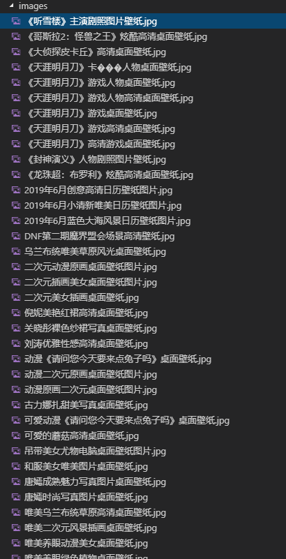
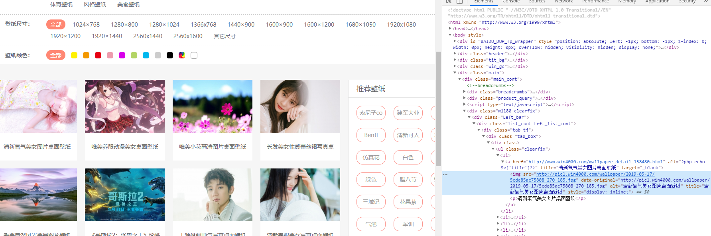

# node爬取某图片网站的桌面壁纸


[项目地址](https://github.com/qiufeihong2018/node-reptile)

> [cheerio](https://cheerio.js.org/)——是nodejs的抓取页面模块，为服务器特别定制的，快速、灵活、实施的jQuery核心实现。适合各种Web爬虫程序。
> [http](https://nodejs.org/api/http.html)——node提供的访问浏览器的api
> [fs](https://nodejs.org/api/fs.html)——node处理文件的api

## 需求
我需要爬取这个网站的桌面壁纸来筛选一张作为我的壁纸。

## 结果
爬取的图片



## 解析
就是这个网站

需要爬取的页面是有五个

第一个页面：

第二个页面：


第三个页面：


分别是：
``` bash
http://www.win4000.com/wallpaper_0_0_0_0.html
http://www.win4000.com/wallpaper_0_0_0_1.html
http://www.win4000.com/wallpaper_0_0_0_2.html
http://www.win4000.com/wallpaper_0_0_0_3.html
http://www.win4000.com/wallpaper_0_0_0_4.html
http://www.win4000.com/wallpaper_0_0_0_5.html
```
通过比较，可以用一个循环得到所有的页面


发现，这些图都是在`.clearfix>.Left_bar>a>img`
可以通过`data-original`得到壁纸的url，`alt`得到壁纸的名字。

## 编码
### 引入所需模块
``` javascript
var http = require('http');
var cheerio = require('cheerio');
var fs = require('fs');
```

### 找到规律爬取这5个页面
``` javascript
for (let i = 0; i <= 5; i++) {
    let Url = `http://www.win4000.com/wallpaper_0_0_0_${i}.html`
    getPageData(Url)
}
```

### 获取页面数据
``` javascript
function getPageData(Url) {
    http.get(Url, res => {
        let htmlData = '';
        res.on('data', chunk => {
            htmlData += chunk;
        });
        // 数据获取结束
        res.on('end', () => {
            // 过滤出所需的元素
            filterContent(htmlData);
        });
    }).on('error', (error) => {
        console.log(`错误：${error}`);
    });
}
```

### 过滤页面
``` javascript
function filterContent(htmlData) {
    if (htmlData) {
        let $ = cheerio.load(htmlData);
        // 缩小范围
        let Content = $('.clearfix').find('.Left_bar')
        // 所需的数据
        let ContentData = [];
        // 对每个li进行遍历
        Content.find('li').each(function (item, b) {
            let pic = $(this);
            // src指的是a的href...那么我只能选用data-original
            let src = pic.find('a').children('img').attr('data-original')
            let name = pic.find('a').children('img').attr('alt')
            // 下载图片
            download(src, name)
            // 这里也存一份
            ContentData.push({
                src,
                name
            })
            // 存放了抓取的图片信息
            console.log(ContentData)
        })
    } else {
        console.log('html null');
    }
}
```

### 图片下载函数
``` javascript
function download(url, name) {
    http.get(url, (res) => {
        let imgData = '';
        //设置图片编码格式
        res.setEncoding("binary");
        //检测请求的数据
        res.on('data', (chunk) => {
            imgData += chunk;
        })
        res.on('end', () => {
            // 没有文件夹则创建 以防报错
            if (!fs.existsSync('./images')) {
                fs.mkdirSync('./images');
            }
            fs.writeFile(`./images/${name}.jpg`, imgData, 'binary', (error) => {
                if (error) {
                    console.log(error);
                } else {
                    console.log(`success-${name}！`)
                }
            })
        })
    })
}
```
## 启动
``` bash
# 克隆项目
git clone git@github.com:qiufeihong2018/node-reptile.git

# 安装依赖
git install fs http cheerio

# 启动项目
node .\index.js
```

## 参考
[node批量抓取并下载小姐姐照片](https://juejin.im/post/5cda19dd518825696125effc)


最后，别忘了给这个项目点一个star哦，谢谢支持。

[blog](https://github.com/qiufeihong2018/vuepress-blog)

下面是小编的公众号


一个学习编程技术的公众号。每天推送高质量的优秀博文、开源项目、实用工具、面试技巧、编程学习资源等等。目标是做到个人技术与公众号一起成长。欢迎大家关注，一起进步，走向全栈大佬的修炼之路