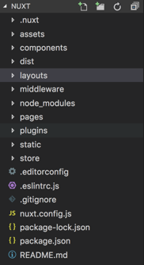
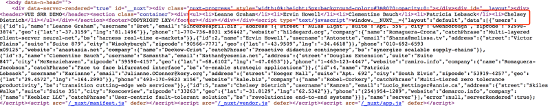

# nuxt教程大全
 [[toc]]

## nuxt教程
```
vue init nuxt-community/starter-template <project-name>
```

随着现在vue和react的流行，许多网站都做成了SPA，确实提升了用户体验，
但SPA也有两个弱点，就是SEO和首屏渲染速度。为了解决单页应用的痛点，
基于vue和react的服务端渲染应运而生。由于公司的框架采用的是vue，
所以就简单的研究了一下基于vue的服务端渲染框架——NUXT。
在vue的官网有关于服务端渲染的详细介绍，
而NUXT集成了利用Vue开发服务端渲染的应用所需要的各种配置，
也集成了Vue2、vue-router、vuex、vux-meta（管理页面meta信息的），
利用官方的脚手架，基本上是傻瓜式操作，不用写路由配置，
不用写webpcak配置就可以跑起来一个基于服务端渲染的SPA。

### Nuxt特性
NUXT的特性包括：
- 基于 Vue.js
- 自动代码分层
- 服务端渲染
- 强大的路由功能，支持异步数据
- 静态文件服务
- ES6/ES7 语法支持
- 打包和压缩 JS 和 CSS
- HTML头部标签管理
- 本地开发支持热加载
- 集成ESLint
- 列表项目
- 支持各种样式预处理器： SASS、LESS、 Stylus等等

### Nuxt目录结构
通过
```
vue init nuxt-community/starter-template <project-name>
```
生成的文件目录结构如下：



其中有一些目录（layouts、pages、static、store、nuxt.config.js、package.json）是Nuxt保留的，不可以更改，需要注意一下。

### Nuxt路由
Nuxt中的一大特点就是路由无需手动配置，会根据pages下的文件路径自动生成一套路由。如果路由中需要带参数，只需将pages下的文件已下划线_作为前缀即可。例如pages下的目录结构如下：
```
pages/
--| user/
-----| index.vue
-----| one.vue
-----| _id.vue
--| index.vue
```


Nuxt自动生成的路由配置为：
```
router: {
  routes: [
    {
      name: 'index',
      path: '/',
      component: 'pages/index.vue'
    },
    {
      name: 'user',
      path: '/user',
      component: 'pages/user/index.vue'
    },
    {
      name: 'user-one',
      path: '/user/one',
      component: 'pages/user/one.vue'
    },
    {
      name: 'users-id',
      path: '/users/:id?',
      component: 'pages/users/_id.vue'
    },
  ]
}
```
而在vue文件中可以针对路由的参数进行校验，例如在pages/users/_id.vue文件中
```
export default {
  validate ({ params }) {
    // Must be a number
    return /^\d+$/.test(params.id)
  }
}
```
如果校验方法返回的值不为 true， Nuxt 将自动加载显示 404 错误页面。而这个错误页面需要写在指定的位置，也就是layout中error页面。接下来就来介绍有关视图相关的东西。
Nuxt视图
可以在layouts目录下创建自定义的布局，可以通过更改 layouts/default.vue 文件来扩展应用的默认布局。需要在布局文件中添加 `<nuxt/>` 组件用于显示页面的主体内容，感觉跟vue中的slot方法类似。例如在默认布局中增加header和footer，这样每个页面都会加上header和footer。
```
<template>
  <div>
    <header>VUE SRR DEMO</header>
    <nuxt/>
    <footer>COPYRIGHT LXY</footer>
  </div>
</template>
```
而上面说到的error页面，可以通过在layouts下增加error.vue文件来修改默认的错误页面。该页面可以接受一个error参数。
```
<template>
  <div class="container">
    <h1 v-if="error.statusCode === 404">页面不存在</h1>
    <h1 v-else>应用发生错误异常</h1>
    <p class="goback">
      <nuxt-link to="/">返回首页</nuxt-link>
    </p>
  </div>
</template>

<script>
export default {
  props: ['error'],
  layout: 'self-aside'
}
</script>
```
也可以给某个页面指定特定的模板，做到个性化布局。例如在上面的error页面中，我指定了一个self-aside的模板
以上所说的都是有关布局和路由相关的东西，而还没有讲到有关服务端渲染的知识，究竟 Nuxt 是如何做到SSR的呢，关键人物要出场了。
Nuxt asyncData 方法
Nuxt 扩展了 Vue.js，增加了一个叫 asyncData 的方法，使得我们可以在设置组件的数据之前能异步获取或处理数据。这个函数可了不得了，有了它，我们可以先从服务员拿到数据，在服务端解析好，拼成HTML字符串，返回给浏览器。
asyncData方法会在组件每次加载之前被调用，它可以在服务端或路由更新之前被调用。 可以利用 asyncData方法来获取数据，Nuxt 会将 asyncData 返回的数据融合组件 data 方法返回的数据一并返回给当前组件。这个方法只能用在页面组件中，在componets下在公共组件是不能调用该方法的，Nuxt 不会扩展增强该目录下 Vue 组件。
因为 asyncData 方法是在组件 初始化 前被调用的，所以在方法内是没有办法通过 this 来引用组件的实例对象。
```
async asyncData ({ params, error }) {
    const { data } = await axios.get('https://jsonplaceholder.typicode.com/users')
    return { 
      users: data.slice(0,5)
    }
  },
  ```
上面demo中asyncData返回的数据赋值给了users，这样我就可以在页面中像使用data里的数据一样去使用users，例如我在template下循环出users
```
<ul>
    <li v-for="item in users" :key="item.name">{{item.name}}</li>
 </ul>
 ```
我现在去查看源代码，发现页面中li中的数据已经渲染过来了，
。

附一张Nuxt渲染的流程图：




## 问题：[nodemon] app crashed - waiting for file changes before starting...
问题：[nodemon] app crashed - waiting for file changes before starting...
等你改完之后重启


最后，别忘了给这个项目点一个star哦，谢谢支持。

[blog](https://github.com/qiufeihong2018/vuepress-blog)


一个学习编程技术的公众号。每天推送高质量的优秀博文、开源项目、实用工具、面试技巧、编程学习资源等等。目标是做到个人技术与公众号一起成长。欢迎大家关注，一起进步，走向全栈大佬的修炼之路

<style scoped>
    p:nth-last-child(2) {
        text-align: center
    }
</style>