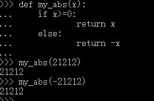

# 【Python】Python问题汇总
## 1.Python安装PIL报错：Could not find a version that satisfies the requirement PIL (from versions: )
起初安装命令是按照 `pip install PIL`来安装的

结果显示：`Could not find a version that satisfies the requirement PIL (from versions: )No matching distribution found for PIL`

错误原因：现在已经用`Pillow`代替`PIL`，`PIL`较多用于`2.7`版本的`Python`中

解决方法：
```
pip install Pillow
```
## 2.Python-IndexError: list index out of range
对Python中有序序列进行按索引取值的时候，出现这个异常。

对于有序序列： 字符串 str 、列表 list 、元组 tuple进行按索引取值的时候，默认范围为 0 ~ len(有序序列)-1，计数从0开始，而不是从1开始，最后一位索引则为总长度减去1。当然也可以使用 负数表示从倒数第几个，计数从-1开始，则对于有序序列，总体范围为 -len(有序序列) ~ len(有序序列)-1，如果输入的取值结果不在这个范围内，则报这个错。

解决方法：检查索引是否在 -len(有序序列) ~ len(有序序列)-1 范围内，修改正确

例如：
```py 
name_list=['qfh','qff']
```
错误如下：
```py 
a=name_list[10]
```
正确如下：
```py 
a=name_list[0]
```

## 3.在交互环境中定义函数
需要在函数里敲`tab`空出缩进，结束函数可以敲两次回车


## 4.python TypeError: 'int' object is not iterable
报错
```py 
for index in len(numbers): 
```
`len(numbers)`返回的是`int`类型变量
不能直接对`int`类型变量进行迭代，而必须加个`range`。
对于数组的索引迭代，需要用到`len()`求数组的长度，用`range`进行索引迭代。

## 5.python3中使用urlopen()报错:urllib.error.URLError
在使用`python3`中的`urllib.request`模块抓取网页的时候使用一下的代码会报一个`urllib.error.URLError的`错误。
```py 
import urllib.request
response = urllib.request.urlopen('https://www.python.org')
urllib.error.URLError: <urlopen error [SSL: CERTIFICATE_VERIFY_FAILED] certificate verify failed: unable to get local issuer certificate (_ssl.c:1045)>
```
这个错误是因为`Python 2.7.9 `之后引入了一个新特性，当你使用`urllib.urlopen`爬取一个`https`网站的时候会验证一次`SSL`证书。当目标使用的是自签名的证书时就会报`urllib.error.URLError`错误。

解决方法:
``` py {3}
import urllib.request
import ssl
ssl._create_default_https_context = ssl._create_unverified_context
response = urllib.request.urlopen('https://www.python.org')
print(response.read().decode('utf-8'))
```
## 6.如何从ImmutableMultiDict提取数据?
以`ImmutableMultiDict`的形式接收数据。

我将其转换为字典就可以提取数据。
```py
data = dict(request.form)
```
## 7.ModuleNotFoundError: No module named 'Crypto'?
最后我将`D:\Python36\Python36\Lib\site-packages\crypto`里的所有`py`文件中的大写`Crypto`改成小写`crypto`。
## 8.python如何对变量是否为None进行判断？
1. if X is None：
2. if not X：（当X为None,  False, 空字符串"", 0, 空列表[], 空字典{}, 空元组()这些时，not X为真，即无法分辨出他们之间的不同）
3. if not x is None:

使用`if not x`这种写法的前提是：必须清楚`x`等于`None`, `False`, 空字符串"", 0, 空列表[], 空字典{}, 空元组()时对你的判断没有影响才行。
## 9.python代码如何整体左移或右移？
1. 右移：tab
2. 左移：shift+tab
## 10.python中三元表达式如何写？
`python`没有`js`的三元表达式。
```js
let tag=true
let a=tag?'b':'c'
```
但是`python`中有替代的方法
```py
tag=True
a=True if tag else a=False
```
解释为：如果`tag`为真，那么`a`为真，否则`a`为假。
## 11.python如何搭建一个简易的本地局域网？
只要在需要共享的文件夹目录下输入以下命令即可搭建：
```py
python -m http.server
```