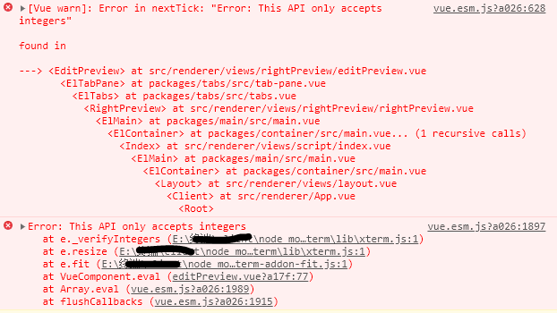

## 问题如下截图

## 出现的前置条件
当我在某个xxx页面里的yyy面板中双击打开y，在tab页中新增一条y，就产出了该问题
 ```
 [Vue warn]: Error in nextTick: "Error: This API only accepts integers"
```
一闻到这个问题，我就知道不是那么好解决。

从错误栈中按顺序排查问题，这是我的老办法，也是最好的办法。
```
   at flushCallbacks (vue.esm.js?a026:1915)
```
看第一条，我们在vue.esm.js经常可以看到vue的任务处理机制，flushCallbacks是经常看到的。
```js
function flushCallbacks () {
  pending = false;
  var copies = callbacks.slice(0);
  callbacks.length = 0;
  for (var i = 0; i < copies.length; i++) {
    copies[i]();
  }
}
```
```
    at Array.eval (vue.esm.js?a026:1989)
```
看第二条，nextTick的实现，这里就能猜测十有八九跟nextTick有关。
```js
function nextTick (cb, ctx) {
  var _resolve;
  callbacks.push(function () {
    if (cb) {
      try {
        cb.call(ctx);
      } catch (e) {
        handleError(e, ctx, 'nextTick');
      }
    } else if (_resolve) {
      _resolve(ctx);
    }
  });
}
```
```
 at VueComponent.eval (editPreview.vue?a17f:77)
```
第三条,直接回到了项目的editPreview.vue组件中，定位到了该问题，是因为监听y.path，页面自适应，导致报错。
```js
   watch: {

      'y.path' () {
        this.$nextTick(() => {
          this.fitAddon.fit()
        })
      },

    },
```
删除即可。

继续往下看，究其原因
报错：
```
  at e.fit (E:\xxx\node_modules\xterm-addon-fit\lib\xterm-addon-fit.js:1)
```
源码里
```
this._terminal.resize(e.cols,e.rows))   
```
e.cols,e.rows往下传参
 报错： 
 ```  at e.resize (E:\xxx\node_modules\xterm\lib\xterm.js:1)

e.prototype.resize=function(e,t){this._verifyIntegers(e,t),this._core.resize(e,t)}
```
报错：  
```
at e._verifyIntegers (E:\xxx\node_modules\xterm\lib\xterm.js:1)

  e.prototype._verifyIntegers=function(){for(var e=[],t=0;t<arguments.length;t++)e[t]=arguments[t];for(var r=0,i=e;r<i.length;r++){var n=i[r];if(n===1/0||isNaN(n)||n%1!=0)throw new Error("This API only accepts integers")}},e}();
```
n这个参数不是整数，导致报错
 

