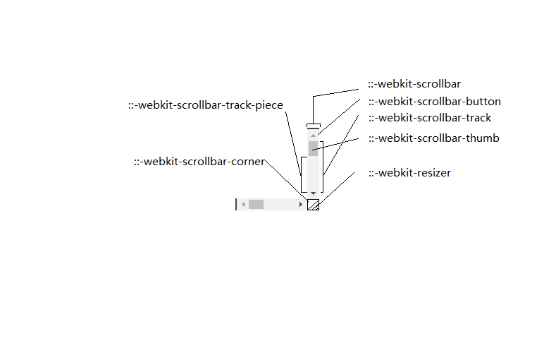
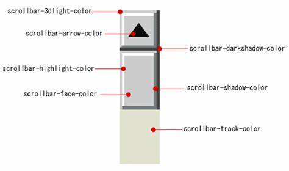

# chrome和ie浏览器下的滚动条
## 

滚动条伪元素|作用的位置
--|--
::-webkit-scrollbar|整个滚动条.
::-webkit-scrollbar-button|滚动条上的按钮 (上下箭头).
::-webkit-scrollbar-thumb|滚动条上的滚动滑块.
::-webkit-scrollbar-track|滚动条轨道.
::-webkit-scrollbar-track-piece|滚动条没有滑块的轨道部分.
::-webkit-scrollbar-corner|当同时有垂直滚动条和水平滚动条时交汇的部分.
::-webkit-resizer|某些元素的corner部分的部分样式(例:textarea的可拖动按钮).

在图上就能更清晰地呈现：

这些伪元素仅使用在支持webkit的浏览器上（如chrome和safari）。
当然webkit提供的不止这些，还有很多伪类，可以更丰富滚动条样式：

滚动条伪类|作用的位置
--|--
:horizontal|适用于任何水平方向上的滚动条
:vertical|适用于任何垂直方向的滚动条
:decrement|适用于按钮和轨道碎片。表示递减的按钮或轨道碎片，例如可以使区域向上或者向右移动的区域和按钮
:increment|适用于按钮和轨道碎片。表示递增的按钮或轨道碎片，例如可以使区域向下或者向左移动的区域和按钮
:start|适用于按钮和轨道碎片。表示对象（按钮 轨道碎片）是否放在滑块的前面
:end|适用于按钮和轨道碎片。表示对象（按钮 轨道碎片）是否放在滑块的后面
:double-button|适用于按钮和轨道碎片。判断轨道结束的位置是否是一对按钮。也就是轨道碎片紧挨着一对在一起的按钮。
:single-button|适用于按钮和轨道碎片。判断轨道结束的位置是否是一个按钮。也就是轨道碎片紧挨着一个单独的按钮。
:no-button|表示轨道结束的位置没有按钮。
:corner-present|表示滚动条的角落是否存在。
:window-inactive|适用于所有滚动条，表示包含滚动条的区域，焦点不在该窗口的时候。
 
::-webkit-scrollbar-track-piece:start {
/*滚动条上半边或左半边*/
}
 
::-webkit-scrollbar-thumb:window-inactive {
/*当焦点不在当前区域滑块的状态*/
}
 
::-webkit-scrollbar-button:horizontal:decrement:hover {
/*当鼠标在水平滚动条下面的按钮上的状态*/
}

ie5+上的滚动条属性|其作用
--|--
scrollbar-3dlight-color|设置对象滚动条3d亮色阴影边框(threedlightshadow)的外观颜色。
scrollbar-darkshadow-color|设置对象滚动条3d暗色阴影边框(threeddarkshadow)的外观颜色。
scrollbar-highlight-color|设置对象滚动条3d高亮边框(threedhighlight)的外观颜色。
scrollbar-shadow-color|设置对象滚动条3d阴影边框(threedshadow)的外观颜色。
scrollbar-arrow-color|设置对象滚动条方向箭头的颜色。当滚动条出现但不可用时，此属性失效。
scrollbar-face-color|设置对象滚动条3D表面的(threedface)的外观颜色。
scrollbar-track-color|设置对象滚动条拖动区域的外观颜色。
scrollbar-base-color|设置对象滚动条基准颜色，其它界面颜色将据此自动调整。

在图上就能更清晰地呈现：

