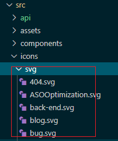
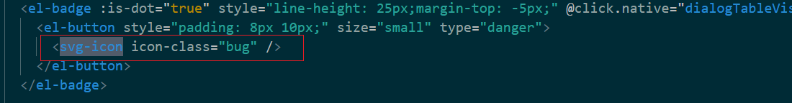

# 【vue】vue项目中引入svg且svg-sprite-loader源码阅读
## svg的用途
## 与其他图片形式比较
## 引入步骤
1. 编写svg组件
在 `src/components` 下创建 `SvgIcon` 组件
```vue
<template>
  <!--svg外链-->
  <div
    v-if="isExternal"
    :style="styleExternalIcon"
    class="svg-external-icon svg-icon"
    v-on="$listeners"
  />
  <!--svg本地-->
  <svg v-else :class="svgClass" aria-hidden="true" v-on="$listeners">
    <use :href="iconName" />
  </svg>
</template>

<script>
// doc: https://panjiachen.github.io/vue-element-admin-site/feature/component/svg-icon.html#usage
import { isExternal } from "@/util/validate";

export default {
  name: "SvgIcon",
  props: {
    iconClass: {
      type: String,
      required: true
    },
    className: {
      type: String,
      default: ""
    }
  },
  computed: {
    isExternal() {
      // 判断是否是外链
      return isExternal(this.iconClass);
    },
    iconName() {
      // 拼接icon名字
      return `#icon-${this.iconClass}`;
    },
    svgClass() {
      // 自定义类名
      if (this.className) {
        return "svg-icon " + this.className;
      } else {
        return "svg-icon";
      }
    },
    styleExternalIcon() {
      // 给外链svg添加图片蒙版效果
      return {
        mask: `url(${this.iconClass}) no-repeat 50% 50%`,
        "-webkit-mask": `url(${this.iconClass}) no-repeat 50% 50%`
      };
    }
  }
};
</script>

<style scoped>
.svg-icon {
  vertical-align: -0.15em;
  fill: currentColor;
  overflow: hidden;
}

.svg-external-icon {
  background-color: currentColor;
  mask-size: cover !important;
  display: inline-block;
}
</style>
```
2. 引入svg文件，将所有项目需要的svg文件套用SvgIcon组件
3. 在webpack.base.conf.js中，改变url-loader和svg-sprite-loader对svg的争夺权
就是下面的代码:
```js
 {
        test: /\.svg$/,
        loader: 'svg-sprite-loader',
        include: [resolve('src/icons')],
        options: {
          symbolId: 'icon-[name]'
        }
      },
      {
        test: /\.(png|jpe?g|gif|svg)(\?.*)?$/,
        loader: 'url-loader',
        exclude: [resolve('src/icons')],
        options: {
          limit: 10000,
          name: utils.assetsPath('img/[name].[hash:7].[ext]')
        }
      },

 exclude: [resolve('src/icons')],
  include: [resolve('src/icons')],
```
4. 在main.js中引入svg
```js
import './icons'
```
5. 下载svg图片，这里使用阿里云提供的iconfont：https://www.iconfont.cn/
6. 点击图片，下载svg格式即可，将下载下来的图片放置到到项目中的svg文件夹下

7. 在页面中使用
```
<svg-icon icon-class="{svg的名称}"></svg-icon>
```


## Vue-cli3使用svg-sprite-loader的vue.config配置
（`node_modules` 里有个 `svg` 导致一直报错）只应用于 `src/icons` 目录下

解决：需要在 `vue.config.js` 文件下加入 `webpack` 配置
```js
const path = require('path')
module.exports = {  
   chainWebpack: config => {    
    const svgRule = config.module.rule('svg')   
    svgRule.uses.clear()    
    svgRule        
    	.test(/\.svg$/)        
    	.include.add(path.resolve(__dirname, './src/icons'))        	.end()        
    	.use('svg-sprite-loader')        
    	.loader('svg-sprite-loader')        
    	.options({          
    		symbolId: 'icon-[name]'        
    		})    
    const fileRule = config.module.rule('file')  
    fileRule.uses.clear()    
    fileRule        
    	.test(/\.svg$/)        
    	.exclude.add(path.resolve(__dirname, './src/icons'))        
    	.end()        
    	.use('file-loader')        
    	.loader('file-loader')  }}
```
## svg-sprite-loader源码
### 是什么
创建 `svg` 的 `webpack` 加载器
### 地址
https://github.com/JetBrains/svg-sprite-loader
### 为什么要用
最低初始配置。大多数选项都是自动配置的。

使用的问题：容易和url-loader发生冲突。
`Uncaught Error: Module build failed: InvalidSvg: svg-sprite-loader exception`
解决方式就是引入步骤的第三步。
