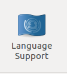

# ubuntu
[[toc]]

## ubuntu打包解包


### 打包
tar zcvf/cvf filename.tar filename

 例:tar cvf dist.tar dist
### 压缩
tar zcvf/cvf filename.tar.gz filename

例 tar zcvf dist.tar.gz dist
### 解压
tar xvf filename.tar.gz filename
tar xvf filename.tar filename

例:tar xvf dist.tar.gz dist
tar xvf dist.tar dist


### ZIP

zip可能是目前使用得最多的文档压缩格式。它最大的优点就是在不同的操作系统平台，比如Linux， Windows以及Mac OS，上使用。缺点就是支持的压缩率不是很高，而tar.gz和tar.gz2在压缩率方面做得非常好。闲话少说，我们步入正题吧：

我们可以使用下列的命令压缩一个目录：

```
 zip -r archive_name.zip directory_to_compress
```

下面是如果解压一个zip文档：

```
 unzip archive_name.zip
```


## ubuntu下webstorm无法输入中文

1. 修改webstorm配置文件
2. vim webstorm.sh在最前面加上
```
export XMODIFIERS=@im=fcitx
export QT_IM_MODULE=fcitx
```
3. 然后保存重新打开即可.

## ubuntu中文输入法

1. 当项目中需要中文输入开发时,可以不用第三方输入法,用fcitx-小企鹅




2. 点击右上角的小企鹅


3. 点击+从里面找到Pinyin


[ubuntu sudo update与upgrade的作用及区别](http://www.baiyuxiong.com/?p=529)

## 杀死僵尸进程
```
ps -ef        //查看进程,发现里面有个PPID选项,对这个就是他的父进程.
 
kill --PPID  //杀掉他的父进程
```

## 查看端口占用
```
sudo lsof -nP -iTCP:端口号 -sTCP:LISTEN
```

- n 表示不显示主机名
- P 表示不显示端口俗称
- 不加 sudo 只能查看以当前用户运行的程序

## 参考文献
[如何杀死僵尸进程](https://blog.51cto.com/wiliiwin/202015)


最后，别忘了给这个项目点一个star哦，谢谢支持。

[blog](https://github.com/qiufeihong2018/vuepress-blog)


一个学习编程技术的公众号。每天推送高质量的优秀博文、开源项目、实用工具、面试技巧、编程学习资源等等。目标是做到个人技术与公众号一起成长。欢迎大家关注，一起进步，走向全栈大佬的修炼之路

<style scoped>
    p:nth-last-child(2) {
        text-align: center
    }
</style>