# Electron升级更新服务
```
目录
一、	背景	2
二、	目标	2
三、	新插件的应用	3
(一)	vue-cli-plugin-electron-builder是什么	3
(二)	打包服务electron-builder的配置	5
(三)	更新服务electron-updater	10
(四)	应用打包	18
(五)	测试更新	24
```
 
## 一、	背景
很久前写了一篇《Electron自动更新》介绍了当时存在的问题、自动更新的方案、打包的两种方式和开发中存在的问题。当时文中应用采用的是 `squirrel.windows` 的更新机制和 `nsis` 的自定义安装策略。通过 `electron-builder` 将两者配置后，产出不同的安装程序 `setup.exe` 和更新程序 `nupkg`。然后将 `nsis` 的 `setup.exe` 和 `squirrel.windows` 中的 `nupkg` 上传到 `electron-release-server` 中。利用 `electron-release-server` 定时检查策略，对比本地版本和线上版本，自动下载依赖和程序，进行更新并且替换，做到用户无感知，操作不繁琐。
## 二、	目标
《Electron自动更新》中的方案完成了当时的目标。

但是方案中的问题很多。

问题：
1.	更新不受用户控制，无法停止更新。没法提示用户是否更新。如果带宽很小，应用下载完成后就更新，打断了正在执行的脚本；
2.	更新方案在linux环境中不适用；
3.	electron-vue项目作者很久不维护；
4.	官方提供的方案不详细，自己编写脚本偏多，考虑可能不全面。

现在的目标是：
1.	更为完善的自动更新；
2.	更新需要提示用户，需要控制应用是否更新；
3.	申请管理员权限；
4.	更新时加入loading。
这时候，新插件 **vue-cli-plugin-electron-builder** 就出世了。
## 三、	新插件的应用
### (一)	vue-cli-plugin-electron-builder是什么
是一款构建带有 `electron` 桌面应用的 `vue.js` 应用程序的插件。

它的 `github` 地址：https://github.com/nklayman/vue-cli-plugin-electron-builder。

它的文档：https://nklayman.github.io/vue-cli-plugin-electron-builder/。

具体配置，大家可以取查看文档，写的很详细。

优点：
1.	一次编写，到处可用
2.	可以定制
3.	支持测试和调试

飞鸿觉得这个框架很友好，不需要开发者重写更新服务，只需要管理好业务代码并且提供静态服务器用于更新，其他不需要开发者操心，一步到位。

创建步骤：
1.	先用vue-cli3或4创建vue项目
2.	在项目中添加electron-builder依赖
3.	启动应用：npm run electron:serve
4.	打包应用：npm run electron:build

备注：当然这些命令你可以在package.json中修改。

`vue create electron-builder-demo` 创建项目，

在项目中添加插件 `vue add electron-builder` 开始下载 `vue-cli-plugin-electron-builder`

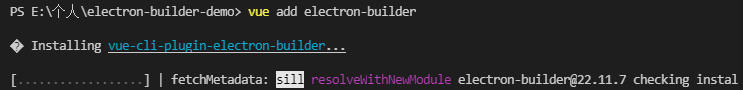

选择 `electron` 版本，最好选择最新的。

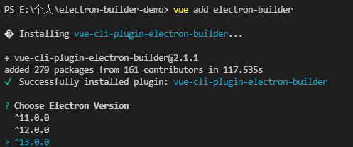

选择后项目会去拉去electron，这个过程很漫长。如果等不了，看看之前有没有electron项目，将依赖复制过来。
 
npm run electron:serve启动应用：

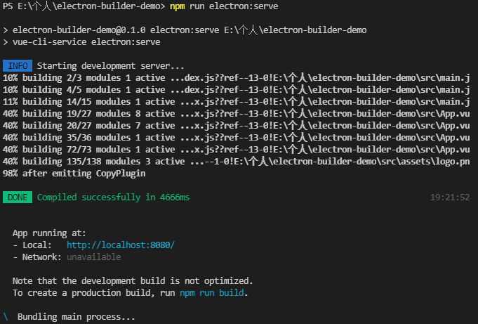

那么这个命令他做了什么？
1.	启动内置开发服务器，并进行一些修改以与electron正常工作；
2.	捆绑主进程；
3.	启动electron应用并告诉它加载上述开发服务器的 url。

最后自动打开应用界面：
 
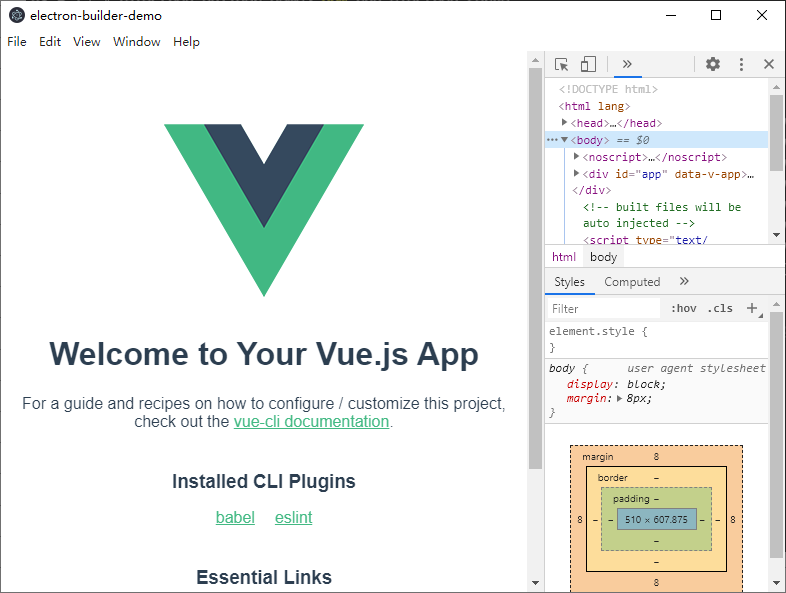

你以为完了？不不不，还有很多步骤。

接下来我们要将打包配置和更新配置都要加上，才能将更新服务打通。

### (二)	打包服务electron-builder的配置
此时还缺少打包配置，我们可以根据 electron-builder文档进行配置。之所以不适用electron-packager，是因为这个插件是基于electron-builder开发的。

其官网地址如下：https://www.electron.build/。

在根目录下新增vue.config.js文件，填写配置。

vue.config.js是一个可选的配置文件，如果@vue/cli-service存在于项目根目录package.json中，项目会自动加载配置文件。

完整配置如下：
```js
const path = require('path')
module.exports = {
    // 部署应用包时的基本 URL
    publicPath: '/',
    // 生成的生产环境构建文件的目录
    outputDir: 'dist',
    // 放置生成的静态资源 (js、css、img、fonts) 的 (相对于 outputDir 的) 目录
    assetsDir: 'assets',
    // 指定生成的 index.html 的输出路径 (相对于 outputDir)。也可以是一个绝对路径。
    indexPath: 'index.html',
    // 文件名中包含hash
    filenameHashing: true,
    // 在 multi-page 模式下构建应用, 单页面一般不需要考虑（详情查看文档配置）
    pages: undefined,
    // 保存时自动触发eslint
    lintOnSave: process.env.NODE_ENV !== 'production',
    // 是否使用包含运行时编译器的 Vue 构建版本
    runtimeCompiler: false,
    // babel 显示转译一个依赖
    transpileDependencies: ['socket.io-client'],
    // 生产环境source map 关闭可提升打包速度
    productionSourceMap: false,
    // crossorigin: undefined,
    // integrity: false,
    css: {
        // modules: false,
        requireModuleExtension: true,
        extract: process.env.NODE_ENV === 'production',
        sourceMap: false,
        loaderOptions: {
            less: {
                prependData: ``
            }
        }
    },
    // 并行打包
    parallel: true, // 默认值require('os').cpus().length > 1,
    pluginOptions: {},
    // 本地开发服务器配置
    devServer: {
        // 自动打开浏览器
        open: true,
        // 设置为0.0.0.0则所有的地址均能访问
        host: '0.0.0.0',
        port: 8888,
        https: false,
        hotOnly: false,
        compress: true,
        disableHostCheck: true,
        // 使用代理
        proxy: {
            '/api': {
                // 目标代理服务器地址
                target: 'http://10.66.194.44:8081/',
                // 允许跨域
                changeOrigin: true,
            },
        },
    },
    // 针对webpack的配置，如果遇到上述配置，能使用的尽量不要改动webpack的配置
    configureWebpack: config => {
        if (process.env.NODE_ENV === 'production') {
            // 为生产环境修改配置...
            config.optimization.minimizer[0].options.terserOptions.compress.drop_console = true;
        } else {
            // 为开发环境修改配置...
        }
    },
    // chain模式下的webpack plugin配置
    chainWebpack: config => {
        // 使用svg-sprite-loader的vue.config配置 只应用于src/icons目录下
        const svgRule = config.module.rule('svg')
        svgRule.uses.clear()
        svgRule
            .test(/\.svg$/)
            .include.add(path.resolve(__dirname, './src/icons')).end()
            .use('svg-sprite-loader')
            .loader('svg-sprite-loader')
            .options({
                symbolId: 'icon-[name]'
            })
        const fileRule = config.module.rule('file')
        fileRule.uses.clear()
        fileRule
            .test(/\.svg$/)
            .exclude.add(path.resolve(__dirname, './src/icons'))
            .end()
            .use('file-loader')
            .loader('file-loader')
        config
            .plugin('env')
            .use(require.resolve('webpack/lib/ProvidePlugin'), [{
                jQuery: 'jquery',
                $: 'jquery',
                "windows.jQuery": "jquery"
            }]);
        config.resolve.alias.set('@', path.join(__dirname, './src'))
    },
    pluginOptions: {
        electronBuilder: {
            externals: ['log4js'],
            // If you are using Yarn Workspaces, you may have multiple node_modules folders
            // List them all here so that VCP Electron Builder can find them
            nodeModulesPath: ['./node_modules'],
            nodeIntegration: true,
            chainWebpackMainProcess: (config) => {
                // 修复HMR
                config.resolve.symlinks(true);
                config.resolve.alias.set('@', path.join(__dirname, './src'))
                // Chain webpack config for electron main process only
            },
            chainWebpackRendererProcess: (config) => {
                // 修复HMR
                config.resolve.symlinks(true);
                // 使用svg-sprite-loader的vue.config配置 只应用于src/icons目录下
                const svgRule = config.module.rule('svg')
                svgRule.uses.clear()
                svgRule
                    .test(/\.svg$/)
                    .include.add(path.resolve(__dirname, './src/icons')).end()
                    .use('svg-sprite-loader')
                    .loader('svg-sprite-loader')
                    .options({
                        symbolId: 'icon-[name]'
                    })
                const fileRule = config.module.rule('file')
                fileRule.uses.clear()
                fileRule
                    .test(/\.svg$/)
                    .exclude.add(path.resolve(__dirname, './src/icons'))
                    .end()
                    .use('file-loader')
                    .loader('file-loader')
                config.resolve.alias.set('@', path.join(__dirname, './src'))
                // Chain webpack config for electron renderer process only (won't be applied to web builds)
            },
            // Changing the Output Directory
            outputDir: "dist_electron",
            // Electron's Junk Terminal Output https://nklayman.github.io/vue-cli-plugin-electron-builder/guide/configuration.html#electron-s-junk-terminal-output
            removeElectronJunk: false,
            // Use this to change the entrypoint of your app's main process
            mainProcessFile: 'background/main.js',
            // Use this to change the entry point of your app's render process. default src/[main|index].[js|ts]
            rendererProcessFile: 'src/main.js',
            // Provide an array of files that, when changed, will recompile the main process and restart Electron
            // Your main process file will be added by default
            mainProcessWatch: ['background/main.js'],
            // Provide a list of arguments that Electron will be launched with during "electron:serve",
            // which can be accessed from the main process (src/background.js).
            // Note that it is ignored when --debug flag is used with "electron:serve", as you must launch Electron yourself
            // Command line args (excluding --debug, --dashboard, and --headless) are passed to Electron as well
            //   mainProcessArgs: ['--arg-name', 'arg-value']
            builderOptions: {
                "productName": "Vue Electron",
                "appId": "com.VueElectron",
                "publish": [{
                    "provider": "generic",
                    "url": "http://localhost:7777/dist_electron/"
                }],
                "win": {
                    "target": [
                        "nsis"
                    ],
                    "icon": "./public/favicon.ico",
                    "requestedExecutionLevel": "highestAvailable"
                },
                "nsis": {
                    "oneClick": false,
                    "allowElevation": true,
                    "allowToChangeInstallationDirectory": true,
                    "installerIcon": "./public/favicon.ico",
                    "uninstallerIcon": "./public/favicon.ico",
                    "installerHeaderIcon": "./public/favicon.ico",
                    "createDesktopShortcut": true,
                    "createStartMenuShortcut": true,
                    "perMachine": false,
                    "unicode": true,
                    "deleteAppDataOnUninstall": false
                }
            }
        }
    }
}
```
`electron-builder` 配置可以在 **pluginOptions** 配置，也可以通过外部配置导入的方式。
### (三)	更新服务electron-updater
当然，要想要更新的话，需要加上更新插件。

之前飞鸿是使用 `electron` 自带的 `autoUpdater` 插件，现在根据文档建议，转投 `electron-updater` 的 `autoUpdater` 怀抱了。

`electron-updater` 跟 `electron` 内置的 `autoUpdater` 还是有区别的：

1.	只需要静态服务器存放更新文件和版本文件，不需要专用的更新版本服务器，后者使用的就是electron-release-server服务器，优缺点很明显，这里我就不做比较了，可以参考飞鸿之前写的《Electron自动更新》；
2.	代码签名验证不仅适用于macOS，也适用于Windows；
3.	所有必需更新包都会自动生成并发布；
4.	支持下载进度。

`Windows` 平台是按照 `nsis` 更新，`mac` 是按照 `DMG` 更新，`linux` 是按照 `AppImage` 更新。
#### 事件区别
事件	|作用	|Electron自带的autoUpdater	|electron-updater
--|--|--|--
Checking-for-update	|开始检查更新的时候触发		|无法差异|无法差异
Update-available	|又可以使用的更新的时候触发更新。	|自动下载，不可以阻断	|默认自动下载，可以阻断转化为手动。如果autoDownload为true，则会自动下载更新。提供 info
Update-not-available|	没有可以使用的更新的时候触发|		|提供 info
Update-downloaded	|更新下载完成的时候触发	|更新包下载完成后可以阻断自动更新。但是应用退出后会自动更新。|	更新包下载完成后可以阻断。如果autoInstallOnAppQuit为true，则应用退出后自动更新。为false，则应用退出后不会更新。
Before-quit-for-update	|	|调用quitAndInstall()方法之后触发	|无
Error	|当更新遇到错误的时候触发	|提供error信息	|提供error信息
Download-progress	|	|无	|显示更新进度，提供progress 进度信息 bytesPerSecond percent total transferred


#### 方法区别
方法	|作用	|Electron自带的autoUpdater	|electron-updater
--|--|--|--
autoUpdater.setFeedURL(url)		|设置检查更新用的url，还初始化自动更新		|提供url、headers、serverType（适用于mac）		|跟electron-builder配置的发布配置选项强相关，如provider、package、repo、owner等
autoUpdater.getFeedURL()		|获得当前更新的url地址		|	|	
autoUpdater.checkForUpdates()		|询问服务器是否有更新	|	轮询时间可以开发自己设置	|	轮询时间可以开发自己设置
autoUpdater.quitAndInstall()		|重启应用并在下载后安装更新。只能在update-download事件后被调用		| 调用这个方法将首先关闭应用，并在关闭后自动调用app.quit()。执行一次自动更新可以不调用这个方法。但是在下一次打开应用的时候，应用检测到更新包下载完成后会自动更新。		| 提供选项isSilent和isForceRunAfter isSilent默认false，windows平台应用按照静默模式安装程序。isForceRunAfter即使是静默安装，也可以在完成后运行应用程序。
autoUpdater.checkForUpdatesAndNotify()		|		|	无	|	询问服务器是否有更新，并且下载提示用户
autoUpdater.downloadUpdate()	|			|	无	|	如果autoDownload选项设置为false，就可以使用这个方法手动下载更新。
autoUpdater.channel()		|		|	无	|	更换自动更新的channel，可以参考https://www.electron.build/tutorials/release-using-channels#release_using_channels

> 静默模式安装
>>安装时无需任何用户干预，直接按默认设置安装。就是更新的时候，应用不需要重新让用户选择安装路径等操作，应用直接读取之前的配置，按照第一次的安装配置安装，不显示任务配置选项。

注意事项：
1.	静默模式安装需要相同数量的临时磁盘空间，并使用与标准安装相同的临时存储目录。如果临时目录中没有足够的空间，安装程序不会提醒用户。
2.	静默模式安装需要与标准安装相同的时间。在静默模式安装开始时，会短暂显示初始安装程序窗口或消息，指示安装已启动。没有消息显示，表明安装正在进行或已成功完成。

#### 类型配置选项
electron-updater独有的类型配置选项
参数		|	作用	|		备注
--|--|--
autoDownload		|	是否在找到更新时自动下载更新。默认为true	|		这个需要和autoUpdater.downloadUpdate()搭配使用
autoInstallOnAppQuit	|		是否在应用退出时自动安装下载的更新默认为true	|		这个和autoUpdater.quitAndInstall()方法有关
allowPrerelease	是	|	否允许更新到预发布版本默认为false		|	这个和allowDowngrade有关。只支持github
fullChangelog		|	获取所有发行说明（从当前版本到最新版本），而不仅仅是最新版本。默认为false		|	只支持github
allowDowngrade	|		只支持github 默认为false		|	
channel		|	 获取更新channel	|		不支持github
requestHeaders	|		请求头	
logger	|		日志	
signals	|		为了类型安全，我们可以使用singals	
currentVersion		|	当前应用程序版本信息	

这样看来，electron-updater基本上兼容了原生autoUpdater，而且提供的东西功能更多更有用。现在，飞鸿肯定是选择electron-updater。相信大家肯定也是这样的。
#### 安装使用
下载electron-updater依赖
```
npm install --save-dev electron-updater
```
使用依赖包
```js
const {
  autoUpdater
} = require("electron-updater");
```
`Vue-cli-plugin-electron-builder` 的更新，也是提供好几个方案，如 `github` 这类的第三方托管平台，参考更新例子：https://github.com/nklayman/electron-auto-update-example。

还有比如 `minio` 这类私有平台，参考更新例子：https://github.com/iffy/electron-updater-example。

在electron-builder配置的publish中加入url参数，指向minio指定的项目桶。当然我们的应用是可以区分环境的。
```js
            builderOptions: {
……
                "publish": [{
                    "provider": "generic",
                    "url": process.env.VUE_APP_PUBLISHMINIO
                }],
……
            }
```
在主进程中，加入更新服务
```js
……
autoUpdater.autoInstallOnAppQuit = false
autoUpdater.on('checking-for-update', () => {
  logger.info('正在检查更新……')
})
autoUpdater.on('update-available', (ev, info) => {
  logger.info('下载更新包成功')
})
autoUpdater.on('update-not-available', (ev, info) => {
  logger.info('现在使用的就是最新版本，不用更新')
})
autoUpdater.on('error', (ev, err) => {
  logger.info('检查更新出错')
  logger.info(ev)
  logger.info(err)
})
autoUpdater.on('download-progress', (ev, progressObj) => {
  logger.info('正在下载...')
})
autoUpdater.on('update-downloaded', (ev, releaseNotes, releaseName) => {
  logger.info('下载完成，更新开始')
  // Wait 5 seconds, then quit and install
  // In your application, you don't need to wait 5 seconds.
  // You could call autoUpdater.quitAndInstall(); immediately
  const options = {
    type: 'info',
    buttons: ['确定', '取消'],
    title: '应用更新',
    message: process.platform === 'win32' ? releaseNotes : releaseName,
    detail: '发现有新版本，是否更新？'
  }
  dialog.showMessageBox(options).then(returnVal => {
    if (returnVal.response === 0) {
      logger.info('开始更新')
      setTimeout(() => {
        autoUpdater.quitAndInstall()
      }, 5000);
    } else {
      logger.info('取消更新')
      return
    }
  })
});
……

```
开头需要导入 `autoUpdater` 和 `dialog` 等方法
```js
import {
  autoUpdater
} from 'electron-updater'
import {
  app,
  protocol,
  BrowserWindow,
  dialog
} from 'electron'
```
最后需要加入更新检测，什么时候加入检测，看业务的需求，飞鸿在应用启动的时候加入检测。
```js
app.on('ready', async () => {
  createWindow()
  autoUpdater.checkForUpdates()
})
```
在这里飞鸿将更新提示使用electron提供的dialog写的，其实功能和checkForUpdatesAndNotify()一样。

### (四)	应用打包
打包生成两个不同版本号的应用进行检测更新。

执行命令：
```
npm run electron:build
```
那它做了什么呢？
1.	先用webpack打包渲染进程，打包出来的产物放在dist_electron，这个地址可以在配置中的outputDir中修改；
2.	打包生成chunk-vendors.xxx.js、app.xxx.js和app.xxx.css放在其中的bundled\assets中；
3.	渲染进程构建完成后，紧跟着构建主进程，捆绑后台文件，还是打包进dist_electron/bundled下，生成background.js；
4.	最后用electron-builder构建app，将web应用程序代码构建成electron提供的桌面程序；
5.	生成配置文件builder-effective-config.yaml；
6.	最后用nsis构建应用。

electron-builder的配置：

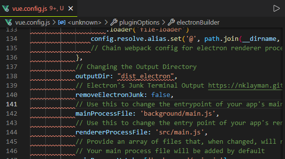

`builder-effective-config.yaml` 就是 `electron-builder` 的配置项文件。
 
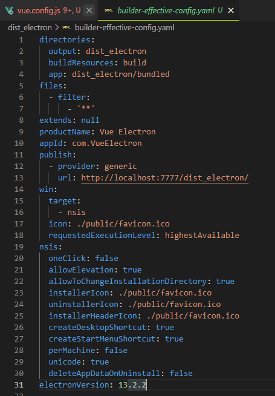

0.1.0版本打包成功：
 
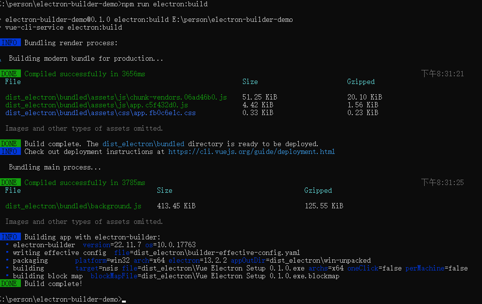
 
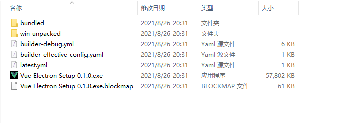

双击打开应用
 
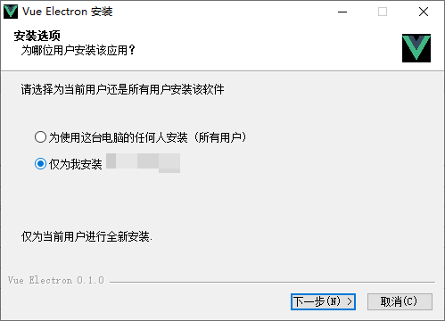
 
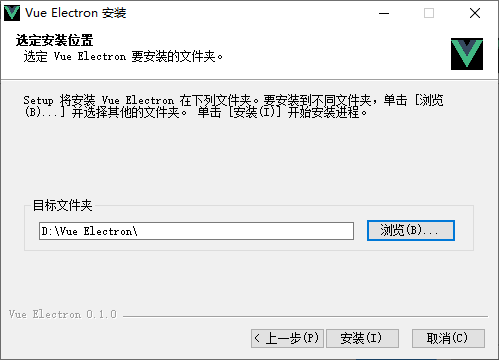
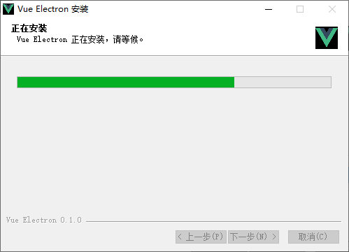
 
点击完成，自动运行应用

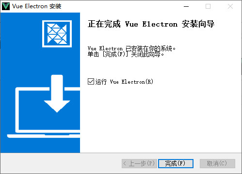
 
又能看到应用界面了

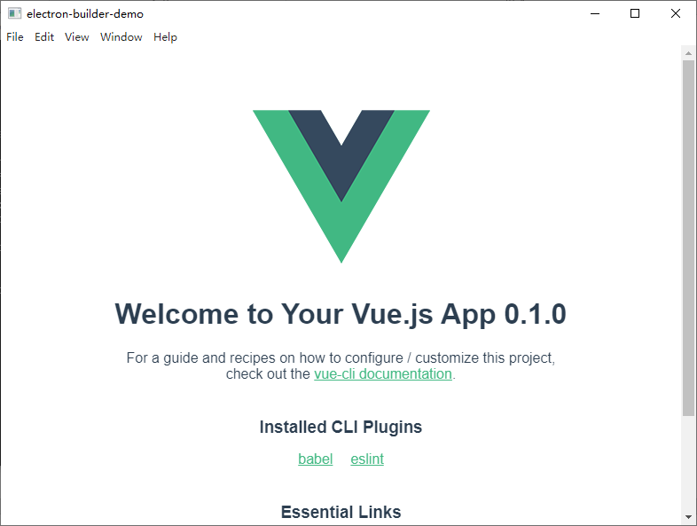

桌面自动生成快捷方式
 
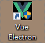

Windows开始菜单也会出现应用


### (五)	测试更新
接下来就是打包一个高版本的应用来测试更新是否生效。

当前版本是0.1.0，我们来打包一个0.2.0的吧。

修改一下package.json中的version，最后重新打包。

打包0.2.0：

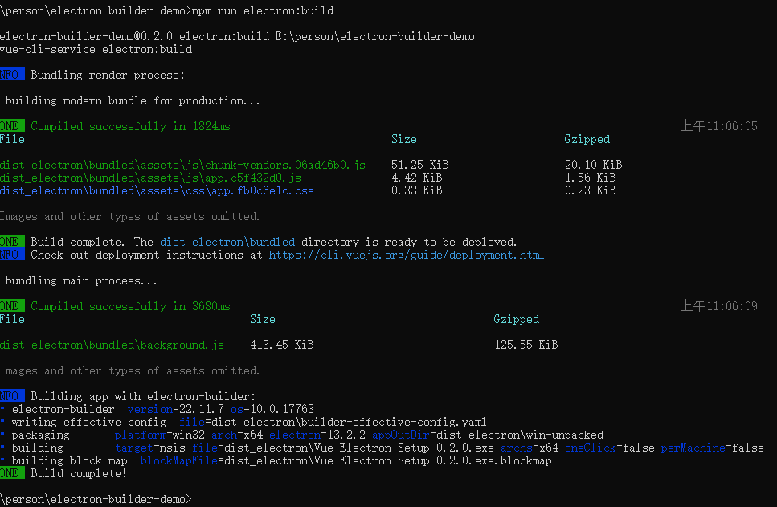

dist_electron目录下就会出现两个安装包
 
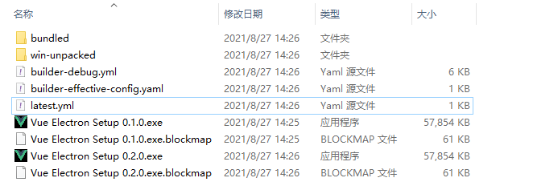

应用是通过打包配置publish中的url提供的地址请求，检测更新。

根据electron-builder的配置：
 
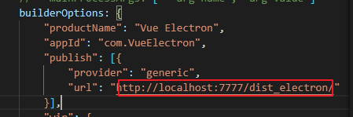

需要启动一个端口为7777的静态文件服务器。
```
python -m SimpleHTTPServer 7777
```
重启0.1.0，打开就检测到有新版本：
 
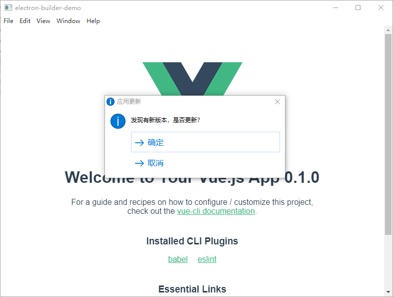

点击取消，应用不更新，用户可以进行这个版本的继续操作。

查看日志
 
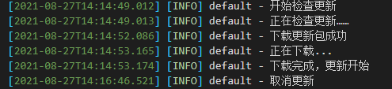

重启0.1.0应用，再次出现应用提示界面，点击确定，应用消失，紧接着回到应用安装界面，当然可以选择静默安装。
 
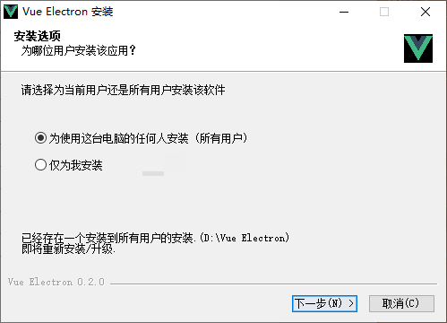

然后下一步安装，最后启动应用，就更新到了0.2.0。
 
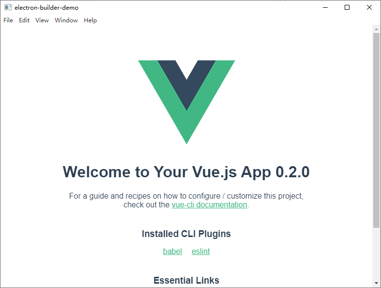

再打开日志：
 
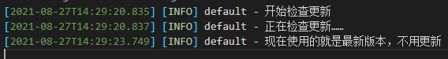

其中静态服务器是用 `python` 起的，大家可以采用其他方式。

应用先拿取 `latest.yml` 文件，比较其中的哈希码。
 
如果和本地不同，再去拉取最新的安装包进行安装。

应用和功能、桌面快捷方式、Windows开始菜单的应用从0.1.0都变成了0.2.0。

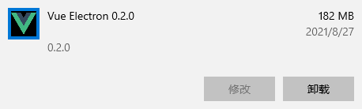
