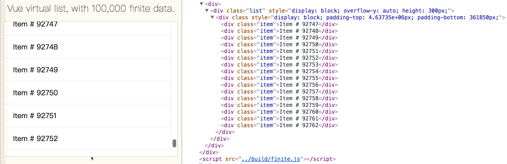
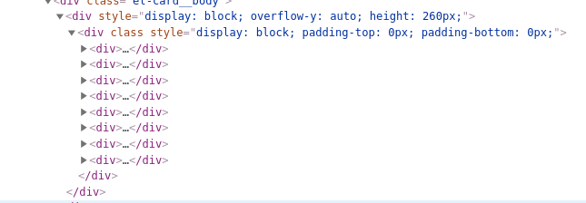

## 大数据量优化性能
[[toc]]

### 背景

当数据量大的时候，我们渲染的列表/表格/表单在页面加载的时候会出现延迟，导致用户体验十分的差劲。
那么怎么解决呢？
我找到如下几个组件
- [vue-virtual-scroller](https://github.com/Akryum/vue-virtual-scroller)
- [vue-virtual-scroll-list](https://github.com/tangbc/vue-virtual-scroll-list)
- [vue-list](https://github.com/hejianxian/vue-list)
- [vue-recyclerview](https://github.com/hilongjw/vue-recyclerview)

测试过vue-virtual-scroller不可以用，原因按照官方的配置来无法实现。
vue-virtual-scroll-list可以用。

### vue-virtual-scroll-list
#### 优势
- 整洁而且小巧
- 高性能的数剧列表
- 支持固定高度和可变高度
- 支持将滚动索引和偏移设置为任意
- 可以检测到滚动到顶部和底部的事件
#### 在线demo
- [Build 100,000 items with item-mode](https://tangbc.github.io/vue-virtual-scroll-list/demos/item-mode/)
- [Build 100,000 items with vfor-mode](https://tangbc.github.io/vue-virtual-scroll-list/demos/vfor-mode/)
- [Build 100,000 items with variable height](https://tangbc.github.io/vue-virtual-scroll-list/demos/variable-height/)
`item-mode`和`vfor-mode`主要区别在于:前者具有高性能，但是频繁的改变数据不是非常方便。但是后者相反。
另外，可以比较下没有用`virtual-list`的：[without-virtual-list](https://tangbc.github.io/vue-virtual-scroll-list/demos/without-virtual-list/)
#### 如何工作


#### 属性
prop|type|required|description
--|--|--|--
size|Number|必须|每个列表项的高度，在可变高度中,这个属性一定是用来去计算容器外虚拟列表的固定高度
remain|Number|必须|有多少个项应该展示在虚拟列表视区中，所以`size`和`remain`决定外部容器高度（size×remain）
bench|Number|可选|默认值是等于`remain`，不在虚拟列表视区中显示，但存在于真实的DOM中，工作台越大，滚动性能就越高
start|Number|可选|默认值是0,是最初开始滚动索引。他必须是`integer`且在列表索引范围内，如果无效，将以0或最后一个生效
offset|Number|可选|默认值是0,是最初开始滚动的偏移量。如果如果在初始化时同时指定了`start`和`offset`，那么首选`start`
debounce|Number|可选|默认情况下，它是禁用的，使用debounce函数以毫秒为单位来确保滚动事件不会频繁触发，从而影响浏览器性能。
rtag|String|可选|默认是`div`，这个虚拟列表根元素标签名。在所有情况下，他的样式被设置为`style：block`
wtag|String|可选|默认是`div`，这个虚拟列表包装元素标签名。在所有情况下，他的样式被设置为`style：block`
wclass|String|可选|默认值是`no classname`，虚拟列表项包装元素类，如果分配这个属性，最好不要更改它的`css box`模型
totop|Function|可选|当虚拟列表滚动到顶部时调用，没有参数
tobottom|Function|可选|当虚拟列表滚动到底部时调用，没有参数
onscroll|Function|可选|当虚拟列表滚动时，参数是`(event,data)`
variable|Function or Boolean|可选|用在可变高度，如果是`Function`，这个属性是一个可变高度，去获得一个叫做`index`的参数的方法，当每项是准备去计算，如果`Boolean`，虚拟列表将获得每项他的内置样式的自动高度
item|Component|可选|用`item-mode`，列表项vue组件
itemcount|Number|可选|用`item-mode`，列表数据总量
itemprops|Function|可选|用`item-mode`，每项都将渲染的回调

### 操作

#### 安装组件
```
npm i --save vue-virtual-scroll-list
```

```json
"vue-virtual-scroll-list": "^1.3.3",
```
#### 调用组件
```vue
          <VirtualList :size="52" :remain="5">
                  <div v-for="(item,key) in bottomRightData" :key="key">
                    <div class="title" @click="linkToAlarm(item, 'MONITOR')">{{item.title}} <a
                      v-if="item.probe">xxx：{{item.probe}}</a></div>
                    <p>{{item.timestamp|timeTrans}} <a v-if="item.src">aaa:{{item.src}}</a> <a v-if="item.dst">bbb:{{item.dst}}</a>
                    </p>
                    <hr color='#34343A' size="1">
                  </div>
          </VirtualList>                          
```
```vue
import VirtualList from 'vue-virtual-scroll-list'
```
```vue
 components: {
      VirtualList,
    },
```
#### 结果
数据总共有50来条，不会一次性渲染出来，而在dom中出现8条数据


所以大大降低了浏览器的压力

### 碰到的问题
[remain出现的问题](https://github.com/tangbc/vue-virtual-scroll-list/issues/94)

### 参考文献
- [vue-virtual-scroller](https://github.com/Akryum/vue-virtual-scroller)
- [vue-virtual-scroll-list](https://github.com/tangbc/vue-virtual-scroll-list)
- [vue-list](https://github.com/hejianxian/vue-list)
- [vue-recyclerview](https://github.com/hilongjw/vue-recyclerview)


最后，别忘了给这个项目点一个star哦，谢谢支持。

[blog](https://github.com/qiufeihong2018/vuepress-blog)


一个学习编程技术的公众号。每天推送高质量的优秀博文、开源项目、实用工具、面试技巧、编程学习资源等等。目标是做到个人技术与公众号一起成长。欢迎大家关注，一起进步，走向全栈大佬的修炼之路

<style scoped>
    p:nth-last-child(2) {
        text-align: center
    }
</style>