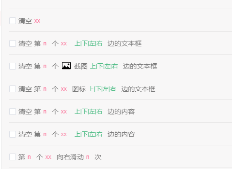
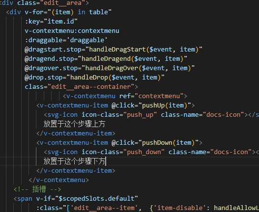
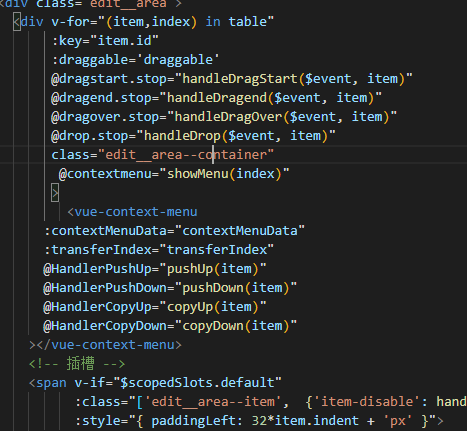
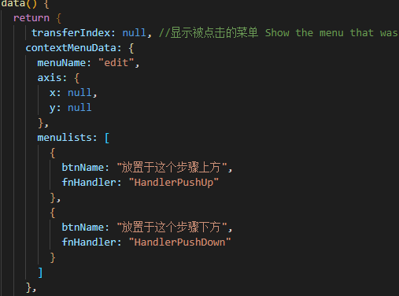
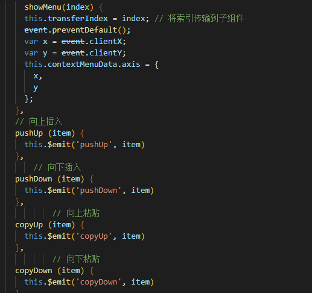

# vue
## You are using the runtime-only build of Vue where the template compiler is not available. Either pre-compile the templates into render functions, or use the compiler-included build. (found in )
当 `vue` 脚手架从 `2.0` 版本切换到 `3.0` 时，出现了上述问题。
### 原因
`vue` 有两种形式的代码 `compiler`（模板）模式和 `runtime` 模式（运行时），`vue` 模块的 `package.json` 的 `main` 字段默认为 `runtime` 模式， 指向了"`dist/vue.runtime.common.js`"位置。

这是 `vue` 升级到 `2.0` 之后就有的特点。

而我的 `main.js` 文件中，初始化 `vue` 却是这么写的，这种形式为 `compiler` 模式的，所以就会出现上面的错误信息。
```js
// compiler
new Vue({
  el: '#app',
  router: router,
  store: store,
  template: '<App/>',
  components: { App }
})

```
解决办法
将 `main.js` 中的代码修改如下就可以
```js
//runtime

new Vue({
  router,
  store,
  render: h => h(App)
}).$mount("#app")
```
到这里我们的问题还没完，那为什么之前是没问题的，之前 `vue` 版本也是 `2.x` 呀？

这也是我要说的第二种解决办法

因为之前我们的 `webpack` 配置文件里有个别名配置，具体如下
```js
resolve: {
    alias: {
        'vue$': 'vue/dist/vue.esm.js' //内部为正则表达式  vue结尾的
    }
}
```
也就是说，`import Vue from 'vue'` 这行代码被解析为 `import Vue from 'vue/dist/vue.esm.js'`，直接指定了文件的位置，没有使用 `main` 字段默认的文件位置

所以第二种解决方法就是，在 `vue.config.js` 文件里加上 `webpack` 的如下配置即可，
```js
configureWebpack: {
    resolve: {
      alias: {
        'vue$': 'vue/dist/vue.esm.js' 
      }
    }
```
既然到了这里我想很多人也会想到第三中解决方法，那就是在引用 `vue` 时，直接写成如下即可
```js
import Vue from 'vue/dist/vue.esm.js'
```
## 插槽中事件中的参数不动态刷新
在插槽中的子组件上绑定事件不要传参，
由于组件复用，所以事件中的参数永远是最新的子组件的参数。

如果 `a` 插槽是一个 `for` 循环的插槽，内部组件传入的参数永远是最新的那一条数据，不会动态刷新。

如：
错误写法：
```html
<div slot="a" slot-scope="scope">
<child-component @event="handleEvent(scope)"></child-component>
</div>
```
正确写法：
```html
<div slot="a" slot-scope="scope">
<child-component @event="handleEvent"></child-component>
</div>
```
在 `handleEvent` 中传入每个子组件中应该收到的对象。

## 在Vue中使用websocket实时通信
websocket全局配置
```js
export default {
    ws: {},
    delay: 1500,
    setWs: function (newWs) {
        this.ws = newWs
    },
    setDelay: function (newDelay) {
        this.delay = newDelay
    },
    sendMsg: function (msg) {
        this.ws.send(JSON.stringify(msg))
    }
}
```

在main.js中全局挂载
```js
import socket from '@/utils/socket'

Vue.prototype.$socket = socket
```

vue页面中使用
```js
      createSocket() {
        let _t = this
        if ('WebSocket' in window) {
          console.log('您的浏览器支持 webSocket')
          _t.ws = new WebSocket('ws://127.0.0.1:8849')
          _t.$socket.setWs(_t.ws)
          _t.ws.onopen = () => {
            console.log('打开')
            // 发送消息
            if (_t.$socket.ws && _t.$socket.ws.readyState === 1) {
              _t.$socket.sendMsg(`xxx`)
            }
          }
          _t.ws.onerror = () => {
            console.log('连接出错')
            // 延迟重连
            setTimeout(() => {
              _t.createSocket()
            }, _t.$socket.delay);
          }
          _t.ws.onclose = () => {
            console.log('连接关闭')
            // 延迟重连
            setTimeout(() => {
              _t.createSocket()
            }, _t.$socket.delay);
          }
          _t.ws.onmessage = (res) => {
            _t.logVal.push(res.data)
            console.log('收到信息：', res.data)
          }
        } else {
          console.log('您的浏览器不支持 webSocket')
        }
      },
```
### 心跳机制

为了保证连接一直正常，需要加入心跳机制，以保证后端可以实时知道当前连接状态。具体操作：前端会每隔一段时间发送请求到后端。

```js
keepAlive() {
    let that = this;
    setTimeout(() => {
        //判断当前webscokt状态
        if (that.$socket.ws.readyState == 1) {
            console.log('发送keepalve')
            //调用发送方法
            that.$socket.sendMsg({
                "type": "keepAlive"
            })
            that.keepAlive()
        }
    }, 1000);
}
```
在this.ws.onopen事件中调用心跳方法。


在其他路由页面中

直接调用onmessage方法

```js
eventMsg() {
    this.$socket.ws.onmessage = function (res) {
        //处理接收的数据
    }
}
```


用来测试websocket的网页`http://www.websocket-test.com/`

## You are using the runtime-only build of Vue where the template compiler is not available. Either pre-compile the templates into render functions, or use the compiler-included build. (found in )
问题中文是：您正在使用 Vue 的仅运行时构建，其中模板编译器不可用。

要么将模板预编译成呈现函数，要么使用编译器包含的构建。
(发现)

vue有两种形式的代码 compiler（模板）模式和 runtime 模式（运行时），vue 模块的 package.json 的 main 字段默认为 runtime 模式， 指向了"dist/vue.runtime.common.js"位置。

这是 vue 升级到 2.0 之后就有的特点。

而我的 main.js 文件中，初始化 vue 却是这么写的，这种形式为 compiler 模式的，所以就会出现上面的错误信息

```js
// compiler
new Vue({
  el: '#app',
  router: router,
  store: store,
  template: '<App/>',
  components: { App }
})
```
解决办法

将 main.js 中的代码修改如下就可以
```js
//runtime

new Vue({
  router,
  store,
  render: h => h(App)
}).$mount("#app")
```
到这里我们的问题还没完，那为什么之前是没问题的，之前vue版本也是2.x的呀？

这也是我要说的第二种解决办法

因为之前我们的webpack配置文件里有个别名配置，具体如下
```js
resolve: {
    alias: {
        'vue$': 'vue/dist/vue.esm.js' //内部为正则表达式  vue结尾的
    }
}
```
也就是说，import Vue from ‘vue’ 这行代码被解析为 import Vue from ‘vue/dist/vue.esm.js’，直接指定了文件的位置，没有使用main字段默认的文件位置

所以第二种解决方法就是，在vue.config.js文件里加上webpack的如下配置即可，
```js
configureWebpack: {
    resolve: {
      alias: {
        'vue$': 'vue/dist/vue.esm.js' 
      }
    }
```
既然到了这里我想很多人也会想到第三中解决方法，那就是在引用vue时，直接写成如下即可
```js
import Vue from 'vue/dist/vue.esm.js'
```
## vue-cli4项目中使用svg图标
```
npm install svg-sprite-loader --save-dev
```
在根目录下添加 vue.config.js 文件
代码如下：
```js
const path = require('path')
module.exports = {  
   chainWebpack: config => {    
    const svgRule = config.module.rule('svg')   
    svgRule.uses.clear()    
    svgRule        
    	.test(/\.svg$/)        
    	.include.add(path.resolve(__dirname, './src/icons'))        	.end()        
    	.use('svg-sprite-loader')        
    	.loader('svg-sprite-loader')        
    	.options({          
    		symbolId: 'icon-[name]'        
    		})    
    const fileRule = config.module.rule('file')  
    fileRule.uses.clear()    
    fileRule        
    	.test(/\.svg$/)        
    	.exclude.add(path.resolve(__dirname, './src/icons'))        
    	.end()        
    	.use('file-loader')        
    	.loader('file-loader')  }} 
```
src下创建icons文件夹（与components是同一级），文件夹下设两个，一个是svg文件夹，留着存放svg图片，另一个为index.js文件。

index.js代码
```js

import Vue from 'vue'//引入组件
import SvgIcon from '@/components/SvgIcon/index.vue'// svg组件
//全局注册组件
Vue.component('svg-icon', SvgIcon)//此处递归获取.svg文件
const requireAll = requireContext => requireContext.keys().map(requireContext)
const req = require.context('./svg', false, /\.svg$/)
requireAll(req)
```
components下创建SvgIcon
```js
<template>  
   <svg :class="svgClass" aria-hidden="true">    
     <use :href="iconName" />  
   </svg>
</template>
<script>
export default {  
    name: 'SvgIcon', 
    props: {    
      iconClass: {      
        type: String,      
        required: true    
        },    
      className: {      
        type: String,     
         default: ''    
         }  
        },  
     computed: {
        iconName () {      
        return `#icon-${this.iconClass}`    
        },    
        svgClass () {      
        if (this.className) {       
         return 'svg-icon ' + this.className      
         } else {        
         return 'svg-icon'      
         }    
       },
  }
  }
</script> 

<style scoped>
 .svg-icon {  
     width: 1em;  
     height: 1em;  
     vertical-align: -0.15em;  
     fill: currentColor;  
     overflow: hidden;}
  .svg-external-icon {  
     background-color: currentColor; 
     mask-size: cover !important;  
     display: inline-block;}
  </style>
```
不要忘了在main.js里进行引入组件引用
```js
<svg-icon icon-class="" />
//""里为svg图标文件名
```
按照上述配好之后不要直接刷新，要重启！重启！项目会有图标出现。

## vue中实现拖动调整左右两侧div的宽度
我们需要将要实现此功能的页面划分为三个部分，左部、调整区、右部，分别对应css样式为left、resize、mid，然后将这三个div放在css样式为box的div中即可。

将以下代码放置在vue页面文件中`<templete></templete>`标签内即可

```html
        <div class="box" ref="box">
            <div class="left">
                <!--左侧div内容-->
            </div>
            <div class="resize" title="收缩侧边栏">
                ⋮
            </div>
            <div class="mid">
                <!--右侧div内容-->
            </div>
        </div>
```

将以下代码放置在`<style> </style>`标签内中即可
```css
  /* 拖拽相关样式 */
    /*包围div样式*/
    .box {
        width: 100%;
        height: 100%;
        margin: 1% 0px;
        overflow: hidden;
        box-shadow: -1px 9px 10px 3px rgba(0, 0, 0, 0.11);
    }
    /*左侧div样式*/
    .left {
        width: calc(32% - 10px);  /*左侧初始化宽度*/   
        height: 100%;
        background: #FFFFFF;
        float: left;
    }
    /*拖拽区div样式*/
    .resize {
        cursor: col-resize;
        float: left;
        position: relative;
        top: 45%;
        background-color: #d6d6d6;
        border-radius: 5px;
        margin-top: -10px;
        width: 10px;
        height: 50px;
        background-size: cover;
        background-position: center;
        /*z-index: 99999;*/
        font-size: 32px;
        color: white;
    }
    /*拖拽区鼠标悬停样式*/
    .resize:hover {
        color: #444444;
    }
    /*右侧div'样式*/
    .mid {
        float: left;
        width: 68%;   /*右侧初始化宽度*/
        height: 100%;
        background: #fff;
        box-shadow: -1px 4px 5px 3px rgba(0, 0, 0, 0.11);
    }
```
将以下代码放置在methods方法区即可
```js
dragControllerDiv: function () {
                var resize = document.getElementsByClassName('resize');
                var left = document.getElementsByClassName('left');
                var mid = document.getElementsByClassName('mid');
                var box = document.getElementsByClassName('box');
                for (let i = 0; i < resize.length; i++) {
                    // 鼠标按下事件
                    resize[i].onmousedown = function (e) {
                        //颜色改变提醒
                        resize[i].style.background = '#818181';
                        var startX = e.clientX;
                        resize[i].left = resize[i].offsetLeft;
                        // 鼠标拖动事件
                        document.onmousemove = function (e) {
                            var endX = e.clientX;
                            var moveLen = resize[i].left + (endX - startX); // （endx-startx）=移动的距离。resize[i].left+移动的距离=左边区域最后的宽度
                            var maxT = box[i].clientWidth - resize[i].offsetWidth; // 容器宽度 - 左边区域的宽度 = 右边区域的宽度

                            if (moveLen < 32) moveLen = 32; // 左边区域的最小宽度为32px
                            if (moveLen > maxT - 150) moveLen = maxT - 150; //右边区域最小宽度为150px

                            resize[i].style.left = moveLen; // 设置左侧区域的宽度

                            for (let j = 0; j < left.length; j++) {
                                left[j].style.width = moveLen + 'px';
                                mid[j].style.width = (box[i].clientWidth - moveLen - 10) + 'px';
                            }
                        };
                        // 鼠标松开事件
                        document.onmouseup = function (evt) {
                            //颜色恢复
                            resize[i].style.background = '#d6d6d6';
                            document.onmousemove = null;
                            document.onmouseup = null;
                            resize[i].releaseCapture && resize[i].releaseCapture(); //当你不在需要继续获得鼠标消息就要应该调用ReleaseCapture()释放掉
                        };
                        resize[i].setCapture && resize[i].setCapture(); //该函数在属于当前线程的指定窗口里设置鼠标捕获
                        return false;
                    };
                }
            },
```
然后在mouted初始化加载部分添加即可
```js
this.dragControllerDiv();
```
## npm run dev卡住
npm run dev 卡住 即 vue-cli-service serve 卡住，不提示错误信息，进程也不关闭。

问题分析和解决：

我的问题出现在使用 template 时，外层没有给根 div，导致死循环
```
<template>
ddd
</template>
```
其实就是自己粗心大意产生的一些错误

## Javascript heap out of memory

前端项目打包产生错误：
```
[91mFATAL ERROR: Ineffective mark-compacts near heap limit Allocation failed - JavaScript heap out of memory
```
内存溢出造成的

解决方法：

修改 npm run build
把package.json中 "build": "node build/build.js" 修改成 "build": "node --max_old_space_size=2048 build/build.js"

## vue右键菜单插件问题




使用 v-contextmenu 无论点击哪一行输出的只有第一行的数据

但是可以使用 vue-contextmenu 解决







参考仓库：

https://github.com/heynext/v-contextmenu

https://github.com/chiic/vue-contextmenu

## Vue中实现输入框Input输入限制
> 1.使用修饰符实现数字输入

在VUE中可以在v-modal后添加修饰符的形式来限制输入，比如：
```html
<input v-model.number="testValue" type="number">
```
.number可以实现限制数字输入，但是会有以下问题：

会出现type="number"自带样式，当然可以通过添加以下css清除
```css
/* 普通IE浏览器 样式清除 */
input::-webkit-outer-spin-button,input::-webkit-inner-spin-button{
  -webkit-appearance: none !important;
}
/* 火狐浏览器样式清除 */
input[type="number"]{
  -moz-appearance:textfield;
}
```
可以无限输入特殊符号+-.，会导致清空data中的值testValue
这里的修饰符也无法实现定制限制输入，不能满足要求

> 2.监听输入框变化

通过@input监听更新数据，实现只能输入数字，而且可以自行定制限制输入内容
```html
<input v-model="testValue" @input="testValue = testValue.replace(/[^\d]/g,'')">
```
此方法可以满足需求，但是无法封装进行批量使用

> 3.封装全局指令

封装input限制输入指令

```js
//input.js

const addListener = function(el, type, fn) {
  el.addEventListener(type, fn, false)
}

//去掉空格
const spaceFilter = function(el) {
  addListener(el, 'input', () => {
    el.value = el.value.replace(/\s+/, '')
  })
}

// 限制只能输入整数和小数（适用于价格类、最多两位小数）
const priceFilter = function(el) {
  addListener(el, 'input', () => {
    el.value = (el.value.match(/^\d*(\.?\d{0,2})/g)[0]) || null
    if (isNaN(el.value)) {
      el.value = ''
    }
  })
}

// 限制只能输入字母数字（适用于运单号）
const integerLetterFilter = function(el) {
  addListener(el, 'input', () => {
    el.value = el.value.replace(/[\W]/g,'')
    el.dispatchEvent(new Event('input'))
  })
}

export default {
  bind(el, binding) {
    if (el.tagName.toLowerCase() !== 'input') {
      el = el.getElementsByTagName('input')[0]
    }
    spaceFilter(el)
    switch (binding.arg) {
      case 'price':
        priceFilter(el)
        break
      case 'integerLetter':
        integerLetterFilter(el)
        break
      default:
        console.warn('未知指令类型',binding.arg)
        break
    }
  }
}
```
注册全局自定义指令
```js
//main.js

import inputFilter from '@/directives/InputFilter.js'

Vue.directive('inputFilter', inputFilter)
```
使用v-input-filter指令
```html
<input v-modal="testValue" v-input-filter:price>
```

这样封装在使用时会出现一个隐蔽的bug，就是在输入指令中正则限制以外的字符时，视图中输入框显示是正确的，但是在浏览器控制栏Vue Devtools中的testValue最后一位字符是最后输入的时的字符。

比如输入abc、123abc输入框内是 、123，但实际testValue值是c、123c。

原因是vue中绑定的值是通过监听input进行赋值的，直接修改输入框值不会触发input事件，需要通过

dispatchEvent再次手动触发input事件，但是在监听的input回调中再触发input会无限循环，所以调整为监听keyup事件来修改值，修改如下:

```js
//input.js

···
// 防抖
let debounce = (fn, delay) => {
  var delay = delay || 300;
  var timer;
  return function() {
    var th = this;
    var args = arguments;
    if (timer) {
      clearTimeout(timer);
    }
    timer = setTimeout(function() {
      timer = null;
      fn.apply(th, args);
    }, delay);
  };
}

// 限制只能输入整数和小数（适用于价格类、最多两位小数）
const priceFilter = function(el) {
  addListener(el, 'keyup', debounce(() => {//添加防抖 方便添加小数点
    el.value = (el.value.match(/^\d*(\.?\d{0,2})/g)[0]) || null
    if (isNaN(el.value)) {
      el.value = ''
    }
    //格式化去掉却没有输入小数位的小数点
    el.value = +el.value
    //触发input事件
    el.dispatchEvent(new Event('input'))
  }))
}

// 限制只能输入字母数字（适用于运单号）
const integerLetterFilter = function(el) {
  addListener(el, 'keyup', () => {
    el.value = el.value.replace(/[\W]/g,'')
    el.dispatchEvent(new Event('input'))
  })
}
···
```
链接：https://juejin.cn/post/6876066773720891399
## 参考文献
[You are using the runtime-only build of Vue where the template compiler is not available.](https://blog.csdn.net/wxl1555/article/details/83187647)


