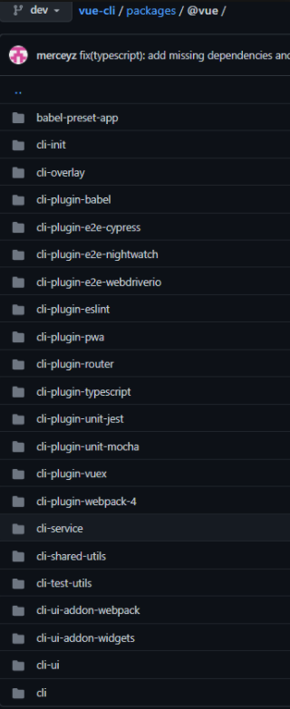

# vue-cli3实战技巧
## 包管理工具
npm包为什么要用"@"开头？
唯一性，避免发布不了，与现有包名称重复
vue cli 的插件有哪些？

## 编码技巧与规范
1. 使用对象代替if及switch
2. 使用Array.from快速生成数组
3. 使用router.beforeEach来处理跳转前逻辑
4. 使用v-if来优化页面加载
5. 路由跳转尽量用name而不是path
6. 使用key来优化v-for循环
7. 使用computed代替watch
8. 统一管理缓存变量
9. 使用setTimeout代替setInterval
10. 不要使用for...in来遍历数组

## vue api盲点解析
- 使用performance开启性能追踪
- 使用errorHandler来捕获异常
- 使用nextTick将回调延迟到下次DOM更新循环之后执行
- 使用watch深层遍历和立即回调的功能
- 对低开销的组件使用v-once
- 使用$isServer判断当前实例是否运行于服务器
