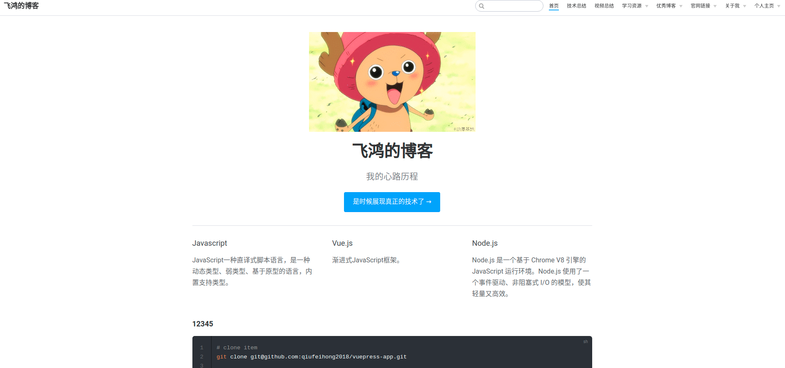
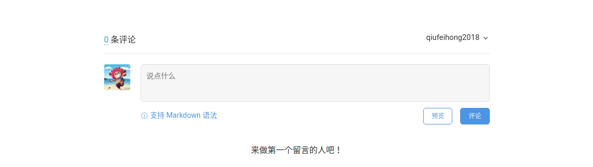
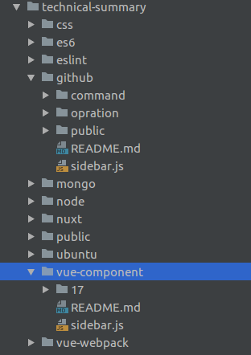
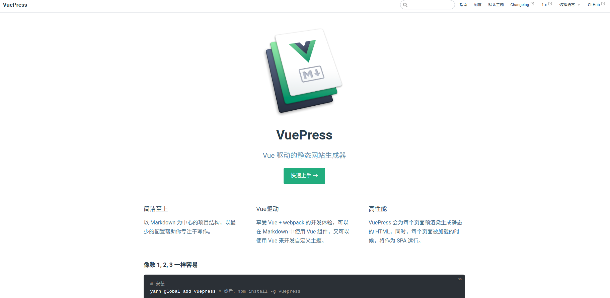
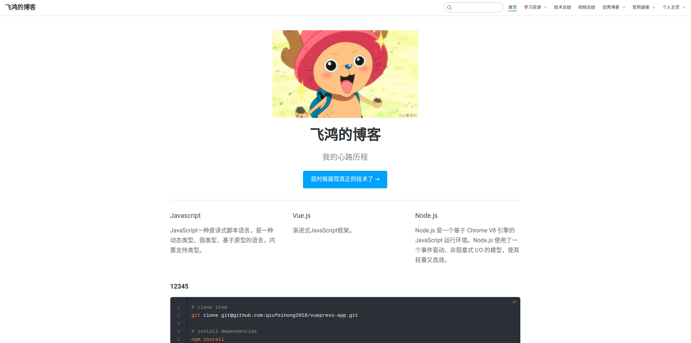
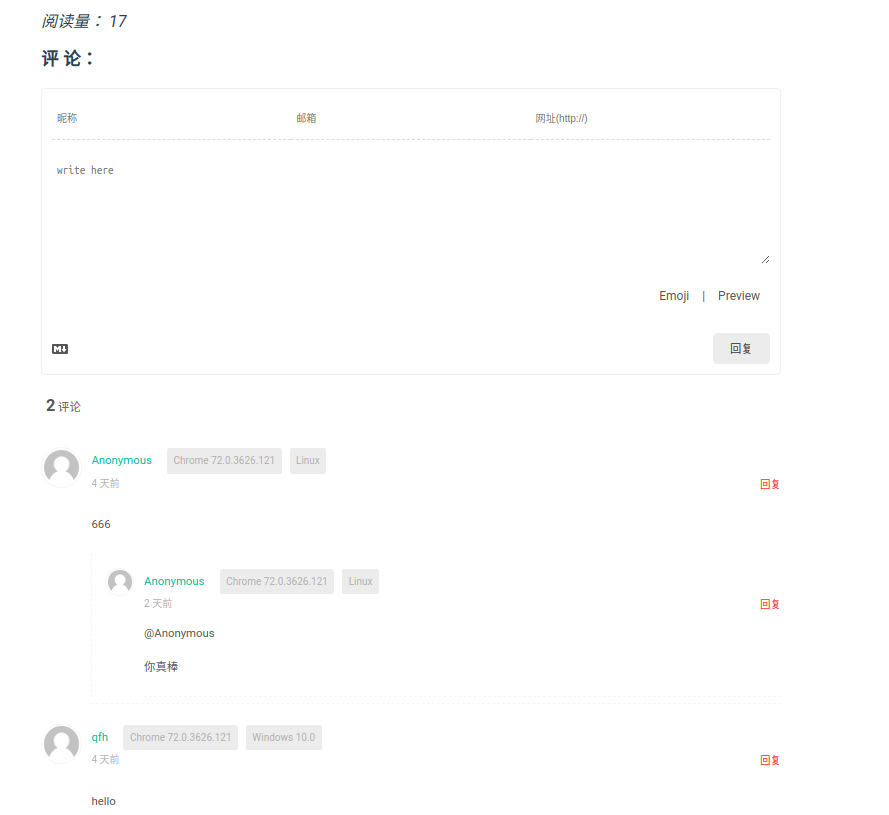
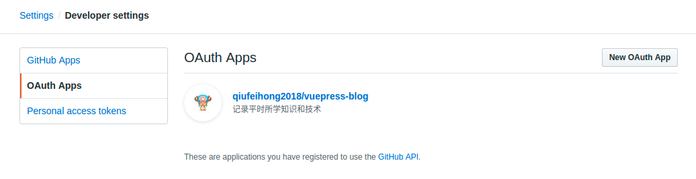
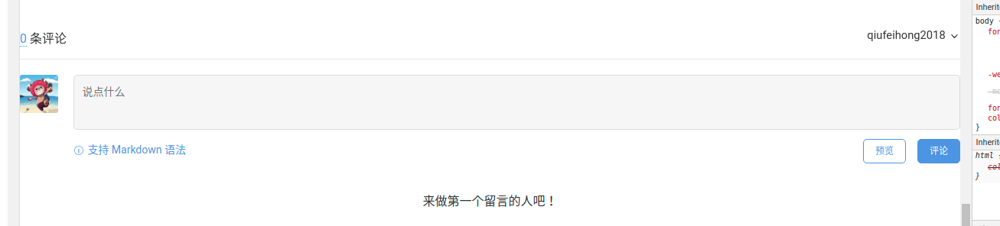
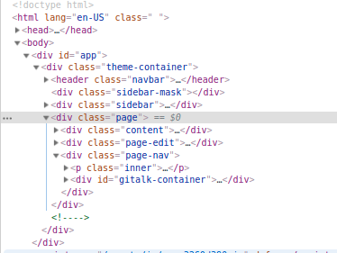
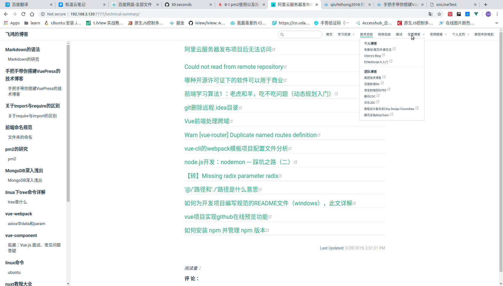

## 手把手带你搭建VuePress的技术博客
[[toc]]

先看效果图:

- 首页



- 评论区域




> 需要node环境和npm支持

如果不会安装npm请转到[如何安装 npm 并管理 npm 版本](https://www.npmjs.cn/getting-started/installing-node/)


### [vuepress](https://vuepress.vuejs.org/zh/)

这个还是蛮不错的,尤大出品,必属精品.
::: tip vuepress是什么?
>Vue 驱动的静态网站生成器

1. 简洁至上
以 Markdown 为中心的项目结构，以最少的配置帮助你专注于写作。

2. Vue驱动
享受 Vue + webpack 的开发体验，可以在 Markdown 中使用 Vue 组件，又可以使用 Vue 来开发自定义主题。

3. 高性能
VuePress 会为每个页面预渲染生成静态的 HTML，同时，每个页面被加载的时候，将作为 SPA 运行。

:::

具体就不介绍了

详情请看官网[vuepress](https://vuepress.vuejs.org/zh/)

既然是手把手,当然我得一步一步下来

### 全局安装

```markdown
npm install -g vuepress
```

### 创建项目vuepess-app
```markdown
mkdir vuepress-app
```

### 项目初始化
```markdown
npm init -y
```
完了,会创建一个package.json
```js
{
  "name": "vuepess-app",
  "version": "1.0.0",
  "description": "",
  "main": "index.js",
  "scripts": {
    "test": "echo \"Error: no test specified\" && exit 1"
  },
  "keywords": [],
  "author": "",
  "license": "ISC"
}
```

### 其中添加主README.md文件
```markdown
touch README.md
```
在这个文件中主要写一些这是什么项目啊,这个项目有什么特性啊,这个项目怎么启动啊等等

```markdown
<h1 align="center">Welcome to vuepress-blog 👋</h1>
<p>
  
  <a href="https://www.qiufeihong.top/">
    
  </a>
  <a href="https://twitter.com/qiufeihong">
    
  </a>
</p>

>  a vuepress blog about qiufeihong

### 🏠 [Homepage](https://www.qiufeihong.top/)

## Install

```sh
npm install
```

## Run tests

```sh
npm run test
```

## Author

👤 **qiufeihong**

* Twitter: [@qiufeihong](https://twitter.com/qiufeihong)
* Github: [@qiufeihong2018](https://github.com/qiufeihong2018)

## Show your support

Give a ⭐️ if this project helped you!

***
_This README was generated with ❤️ by [readme-md-generator](https://github.com/kefranabg/readme-md-generator)_
```

###  添加docs文件夹
```markdown
mkdir docs
```
这个文件夹中主要放些你的配置和所写的博客内容

###  在docs文件夹中创建.vuepress文件夹

```markdown
cd docs
mkdir .vuepress
```

这个文件夹中你就可以放[配置](https://vuepress.vuejs.org/zh/config/)了

### 新建总配置config.js文件
```markdown
cd .vuepress
touch config.js
```

主要配置都写在这里，我将侧边栏和导航懒配置抽离出来，实现模块化
```js
module.exports = {
    title: '飞鸿的博客',
    description: '我的心路历程',
    dest: './dist',
    port: '7777',
    head: [
        ['link', {rel: 'icon', href: '/logo.gif'}]
    ],
    markdown: {
        lineNumbers: true
    },
    themeConfig: {
        nav: require('./nav'),
        sidebar: require('./sidebar'),
        sidebarDepth: 2,
        lastUpdated: 'Last Updated',
        searchMaxSuggestoins: 10,
        serviceWorker: {
            updatePopup: {
                message: "New content is available.",
                buttonText: 'Refresh'
            }
        },
        editLinks: true,
        editLinkText: '在 GitHub 上编辑此页 ！'
    }
}

```

### 新建导航栏nav.js

效果：
1. 闭合


2. 展开


```markdown
touch nav.js
```

导航栏配置放在这个文件中

1. 数组中的每个对象指的是每个导航标签;
2. text就是导航标签名;
3. link就是该文件的路径，docs是该路径的根目录，所以要‘/’开头。如果是外部链接，那就直接放进去即可。
4. 导航标签下拉菜单，就要配置items，里面也是一个数组对象，同上。

```js
module.exports = [{
    text: "首页",
    link: "/"
  },
  {
    text: "技术总结",
    link: "/technical-summary/"
  },
  {
    text: "视频总结",
    link: "/video-summary/"
  },
  {
    text: "学习资源",
    items: [{
        text: "前端学习视频",
        link: "/front-end-video/"
      },
      {
        text: "全栈",
        link: "/resource/"
      },
      {
        text: "新闻",
        link: "/news/"
      },
      {
        text: "开源项目",
        link: "/openItem/"
      },
      {
        text: "分享",
        link: "/share/"
      },
      {
        text: "网站",
        link: "/network/"
      },
      {
        text: "设计",
        link: "/design/"
      }
    ]
  },
  {
    text: "优秀博客",
    items: [{
        text: "个人博客",
        items: [{
            text: "张鑫旭-鑫空间-鑫生活",
            link: "https://www.zhangxinxu.com/"
          },
          {
            text: "Cherry's Blog",
            link: "https://cherryblog.site/"
          },
          {
            text: "ECMAScript 6 入门",
            link: "http://es6.ruanyifeng.com/"
          },
          {
            text: "WebStack.cc - 设计师网址导航",
            link: "http://yangweijie.cn/webstack#"
          }, {
            text: 'D2 Admin',
            link: 'https://doc.d2admin.fairyever.com/zh/'
          }, {
            text: 'Javascript之父',
            link: 'https://brendaneich.com/'
          },
          {
            text: 'yck面试图谱',
            link: 'https://yuchengkai.cn/docs/'
          },
          {
            text: '林亮',
            link: 'https://blog.fritx.me/'
          },
          {
            text: '软件垃圾回收师，Android搬砖小能手',
            link: 'http://lckiss.com/'
          }, {
            text: '小弟调调',
            link: 'https://wangchujiang.com/'
          },
          {
            text: '腾讯 ISUX UI 工程师李洋',
            link: 'https://newbieweb.lione.me/'
          }
        ]
      },
  ......
];

```

::: warning nav
当你们像我这样配置时，目录结构最好和我一样
:::

目录结构如下：


### 创建侧边栏sidebar.js

效果：


侧边栏配置放在这里,将其他文件夹中的侧边栏配置引进来
```js
module.exports = {
    '/technical-summary/github/': require(A),
    '/technical-summary/vue-component/': require(A),
    '/interview/': require('../interview/sidebar'),
    '/reprint/':require(technical-summary)
}

```

上述的具体文件的目录结构如下：
 
- technical-summary



- interview


- reprint


### 在docs文件夹下面创建一个README.md文件

- 默认的主题提供了一个首页，跟VuePress一样的主页

效果如下：


```markdown

home: true
heroImage: /logo.jpg
actionText: 快速上手 →
actionLink: /zh/guide/
features:
- title: 简洁至上
  details: 以 Markdown 为中心的项目结构，以最少的配置帮助你专注于写作。
- title: Vue驱动
  details: 享受 Vue + webpack 的开发体验，在 Markdown 中使用 Vue 组件，同时可以使用 Vue 来开发自定义主题。
- title: 高性能
  details: VuePress 为每个页面预渲染生成静态的 HTML，同时在页面被加载的时候，将作为 SPA 运行。
footer: MIT Licensed | Copyright © 2018-present Evan You

```

- 也可以像我这样配置：你可以将首页图片换成gif格式的，骚一点

效果如下：



```markdown
---
home: true
heroImage: /logo-computed.gif
actionText: 是时候展现真正的技术了 →
actionLink: /resource/
features:
- title:  比尔·盖茨经典语录/名句
  details: 只要有坚强的持久心，一个庸俗平凡的人也会有成功的一天，否则即使是一个才识卓越的人，也只能遭遇失败的命运。

- title: 乔布斯经典语录/名句
  details: 你的时间有限，所以不要为别人而活。不要被教条所限，不要活在别人的观念里。不要让别人的意见左右自己内心的声音。最重要的是，勇敢的去追随自己的心灵和直觉，只有自己的心灵和直觉才知道你自己的真实想法，其他一切都是次要。

- title: 李嘉诚经典语录/名句
  details: 当你放下面子赚钱的时候，说明你已经懂事了。当你用钱赚回面子的时候，说明你已经成功了。当你用面子可以赚钱的时候，说明你已经是人物了。当你还停留在那里喝酒、吹牛，啥也不懂还装懂，只爱所谓的面子的时候，说明你这辈子也就这样了。

footer: MIT Licensed | Copyright © 2019-present FeiHong
---

### 12345
```bash
# clone item
git clone git@github.com:qiufeihong2018/vuepress-app.git

# install dependencies
npm install 

# serve with hot reload at localhost:6666
npm run dev

# build for production with minification
npm run build

# deploy to github page
npm run d

# build&&pm2
npm run server
```

::: warning 注意

请确保你的 Node.js 版本 >= 8。
:::

```

###  现在就可以在docs文件夹中写博客内容了
我就举一个最简单的例子
1. 创建front-end-video文件,在文件夹中创建README.md,这里面写博客啦
```markdown
mkdir front-end-video
cd front-end-video
touch README.md
```

```markdown
###  前端学习
技术博客

```

###  在package.json中添加启动命令

1. 启动项目:npm run dev
这条命令就等于vuepress dev docs
2. 打包项目:npm run build
这条命令就等于vuepress build docs

```js
{
  "name": "vuepress-app",
  "version": "1.0.0",
  "description": "",
  "main": "index.js",
  "scripts": {
    "test": "echo \"Error: no test specified\" && exit 1",
    "dev": "vuepress dev docs",
    "build": "vuepress build docs",
    "server": "npm run build && pm2 start appjs",
    "d": "bash deploy.sh"
  },
  "keywords": [],
  "author": "",
  "license": "ISC",
  "dependencies": {
    "@vuepress/plugin-back-to-top": "^1.0.0-alpha.0",
    "element-ui": "^2.5.4",
    "express": "^4.16.4",
    "leancloud-storage": "^3.12.0",
    "pm2": "^3.2.9",
    "valine": "^1.3.4",
    "vuepress": "^0.14.9"
  }
}

```

你的项目就run起来了


### 推送到远程仓库
1. 在GitHub中新建仓库
2. 在根目录下添加.gitignore忽略一些文件
3. 推送上去

```markdown
node_modules
dist
.idea
```
```markdown
git init

git add .

git commit -m "my first push vuepess app"

git push

```

### 挂载到GitHub Pages


1. 在根目录中创建脚本deploy.sh
::: tip #
这里的'#'是注释
:::

2. 然后打开你的github仓库,再建一个仓库
3. 将下列第20行中我的仓库名替换成你的仓库名
4. 在package.json中添加命令npm run d,这条命令就是bash deploy.sh,这条命令的意思是启动这个脚本
5. 你的vueress的博客就成功挂载GitHub Pages上了
```markdown
###!/usr/bin/env sh

### 确保脚本抛出遇到的错误
set -e

### 生成静态文件
npm run build

### 进入生成的文件夹
cd dist

### 如果是发布到自定义域名
### echo 'www.yourwebsite.com' > CNAME

git init
git add -A
git commit -m 'deploy'

### 如果你想要部署到 https://USERNAME.github.io
git push -f git@github.com:qiufeihong2018/qiufeihong2018.github.io.git master

### 如果发布到 https://USERNAME.github.io/<REPO>  REPO=github上的项目
### git push -f git@github.com:USERNAME/<REPO>.git master:gh-pages

cd -
```

完了后，就可以[https://qiufeihong2018.github.io/](https://qiufeihong2018.github.io/)访问了

### pm2守护程序


效果自行脑补，后台一直运行

1. 安装pm2,将其写进package.json中
```markdown
npm install -save pm2
```

::: tip
用到express,所以你得先安装一下
npm install -save express
:::

2. 根文件中添加pm2脚本blog.js
```js
const fs = require('fs');
const path = require('path');
const express = require('express');
const chalk = require('chalk')
const app = express();
app.use(express.static(path.resolve(__dirname, './dist')))

app.get('*', function(req, res) {
    const html = fs.readFileSync(path.resolve(__dirname, './dist/index.html'), 'utf-8')
    res.send(html)
})
app.listen(7777, res => {
    console.log(chalk.yellow('Start Service On 7777'));
});

```
3. 添加启动命令

npm run server:这条命令是npm run build && pm2 start app.js意思是打包并且启动pm2

想要知道更多pm2操作，请移步[pm2](https://pm2.io/doc/en/runtime/overview/)

### 添加valine评论和阅读量统计

效果如下：




1. 安装valine模块
```js
npm install -save valine
```
2. 在.vuepress中创建components文件夹,在其中创建Valine组件
```vue
<template>
    <div class="page">
        <section class="page-edit">
            <div>
                <!-- id 将作为查询条件 -->
                <span class="leancloud-visitors"
                      data-flag-title="Your Article Title">
        <em class="post-meta-item-text">阅读量： </em>
        <i class="leancloud-visitors-count"></i>
      </span>
            </div>
            <h3>
                <a href="javascript:;"></a>
                评 论：
            </h3>
            <div id="vcomments"></div>
        </section>
    </div>

</template>

<script>
    export default {
        name: 'Valine',
        mounted: function () {
            // require window
            const Valine = require('valine');
            if (typeof window !== 'undefined') {
                this.window = window
                window.AV = require('leancloud-storage')
            }
            this.valine = new Valine()
            this.initValine()
        },
        watch: {
            $route (to, from) {
                if (from.path != to.path) {
                    this.initValine()
                }
            }
        },
        methods: {
            initValine () {
                let path = location.origin + location.pathname
                // vuepress打包后变成的HTML不知为什么吞掉此处的绑定`:id="countId"`
                document.getElementsByClassName('leancloud-visitors')[0].id = path
                this.valine.init({
                    el: '#vcomments',
                    appId: '********',// your appId
                    appKey: '********', // your appKey
                    notify: false,
                    verify: false,
                    path: path,
                    visitor: true,
                    avatar: 'mm',
                    placeholder: 'write here'
                });
            }
        }
    }
</script>
```

3. 修改其中的appId和appKey
4. 获取APP ID 和 APP Key,请先登录或注册 [LeanCloud](https://leancloud.cn/dashboard/login.html#/signin), 进入控制台后点击左下角创建应用
5. 在.vuepress中创建theme文件夹
6. 将node_modules中的Layout拷贝到theme文件夹中


7. 将引用的文件路径改成指向node_modules去
```js
    import Vue from 'vue'
    import nprogress from 'nprogress'
    import Home from '../../../node_modules/vuepress/lib/default-theme/Home.vue'
    import Navbar from '../../../node_modules/vuepress/lib/default-theme/Navbar.vue'
    import Page from '../../../node_modules/vuepress/lib/default-theme/Page.vue'
    import Sidebar from '../../../node_modules/vuepress/lib/default-theme/Sidebar.vue'
    import SWUpdatePopup from '../../../node_modules/vuepress/lib/default-theme/SWUpdatePopup.vue'
    import {resolveSidebarItems} from '../../../node_modules/vuepress/lib/default-theme/util'
    import Valine from '../components/Valine'
```
8. 在Layout中添加valine
```vue
<template>
    <div
            class="theme-container"
            :class="pageClasses"
            @touchstart="onTouchStart"
            @touchend="onTouchEnd"
    >
        <Navbar
                v-if="shouldShowNavbar"
                @toggle-sidebar="toggleSidebar"
        />

        <div
                class="sidebar-mask"
                @click="toggleSidebar(false)"
        ></div>

        <Sidebar
                :items="sidebarItems"
                @toggle-sidebar="toggleSidebar"
        >
            <slot
                    name="sidebar-top"
                    slot="top"
            />
            <slot
                    name="sidebar-bottom"
                    slot="bottom"
            />
        </Sidebar>

        <div
                class="custom-layout"
                v-if="$page.frontmatter.layout"
        >
            <component :is="$page.frontmatter.layout"/>
        </div>

        <Home v-else-if="$page.frontmatter.home"/>

        <Page
                v-else
                :sidebar-items="sidebarItems"
        >
            <slot
                    name="page-top"
                    slot="top"
            />
            <slot
                    name="page-bottom"
                    slot="bottom"
            />
        </Page>
        <Valine></Valine>

        <SWUpdatePopup :updateEvent="swUpdateEvent"/>
    </div>
</template>
```
9. 大功告成
::: warning home
目前暂不支持首页去除,每个页面最底下都有
:::

想要知道更多Valine操作，请移步[Valine](https://valine.js.org/)
### 添加gittalk评论和github的issues挂钩

Gitalk 是一个基于 GitHub Issue 和 Preact 开发的评论插件。
- 使用 GitHub 登录
- 支持多语言 [en, zh-CN, zh-TW, es-ES, fr, ru]
- 支持个人或组织
- 无干扰模式（设置 distractionFreeMode 为 true 开启）
- 快捷键提交评论 （cmd|ctrl + enter）


#### 旧版: 修改2019.7.1
在.vuepress中新建`enhanceApp.js`

代码如下
```js
import getGitalk from "./common/getGittalk"

export default ({
  Vue, // VuePress 正在使用的 Vue 构造函数
  options, // 附加到根实例的一些选项
  router, // 当前应用的路由实例
  siteData // 站点元数据
}) => {
  setTimeout(() => {
    try {
      document && (() => {
        getGitalk.call(this, siteData)
        copy()
      })()
    } catch (e) {
      console.error(e.message)
    }
  },500)
}

```

要引入common中的`getGittalk.js`
代码如下:
```js
export default ({pages})=> {
    const path = window.location.pathname
    // 获取当前页面信息
    const dist = pages.filter(item => {
      return item.path === path
    })[0]
  
    //只有在isNoPage是false的时候才会显示评论
    if (!dist.frontmatter || !dist.frontmatter.isNoPage) {
      const page =document.querySelector('.page')
  
      const linkGitalk = document.createElement('link');
      linkGitalk.href = 'https://cdn.jsdelivr.net/npm/gitalk@1/dist/gitalk.css';
      linkGitalk.rel = 'stylesheet';
      document.body.appendChild(linkGitalk);
  
      const scriptGitalk = document.createElement('script');
      scriptGitalk.src = 'https://cdn.jsdelivr.net/npm/gitalk@1/dist/gitalk.min.js';
      document.body.appendChild(scriptGitalk);
  
      scriptGitalk.onload= () => {
        let gitalk = document.createElement('div')
        gitalk.id = 'gitalk-container'
        page.appendChild(gitalk)
        var _gitalk = new Gitalk({
          clientID: '869b2dea1c53cc9b6ddd',// 填入你的clientID
          clientSecret: '0416acb02689088d4d2c55243a82db0582af4575',// 填入你的clientSecret
          repo: 'vuepress-blog', // 填入你的存储评论的仓库名字
          owner: 'qiufeihong2018',//你的用户名
          admin: ['qiufeihong2018'],  // 你的用户名
          id: decodeURI(path),      // 每个页面根据url生成对应的issue，保证页面之间的评论都是独立的
        })
        _gitalk.render('gitalk-container')
      }
    }
  }

```

注册一个新的OAuth应用程序

[地址](https://github.com/settings/applications/new)

- Application name: 你的项目名
- Homepage URL:部署项目后的在线的网址
- Application description:网站描述
- Authorization callback URL:部署项目后的在线的网址

点击注册,后可以看到


重定向网址

该redirect_uri参数是可选的。如果省略，GitHub会将用户重定向到OAuth应用程序设置中配置的回调URL。如果提供，重定向URL的主机和端口必须与回调URL完全匹配。重定向URL的路径必须引用回调URL的子目录。



但是当我们添加好gittalk容器的时候会发现,好丑啊,容器都不和主内容对齐

好办



通过f12拖拉dom,发现gitalk不应该在.page下,而是要在.page-nav容器里最合适

改下代码
```js
....
    const page =document.querySelector('.page-nav')
....
```

#### 新版: 修改2019.7.26


1. 在components文件夹中增加`Gittalk.vue`

> Gittalk.vue

```js
<template>
    <div class="page">
        <section class="page-edit">
            <h3>
                <!-- id 将作为查询条件 -->
                <span :id="path" class="leancloud-visitors" data-flag-title="Your Article Title">
                    <a class="post-meta-item-text">阅读量：</a>
                    <a class="leancloud-visitors-count"></a>
                </span>
            </h3>
            <div id="gitalk-container"></div>
        </section>
    </div>

</template>
<script>
    import 'gitalk/dist/gitalk.css'
    import Gitalk from 'gitalk'
    import Valine from 'valine'

    export default {
        name: 'Gittalk',
        data() {
            return {
                path: window.location.pathname
            }
        },
        mounted: function () {
            // require window
            if (typeof window !== 'undefined') {
                this.window = window
                window.AV = require('leancloud-storage')
            }

            this.initGittalk()
            this.initReadingVolume()

        },
        watch: {
            $route(to, from) {
                if (from.path != to.path) {
                    this.initGittalk()
                    this.initReadingVolume()
                }
            }
        },
        methods: {
            initReadingVolume() {
                document.getElementsByClassName('leancloud-visitors')[0].id = this.path
                this.valine = new Valine()
                this.valine.init({
                    el: '#vcomments',
                    appId: '54maloyBQ5IhlzR4zhQQcWSN-gzGzoHsz', // your appId
                    appKey: '8wNBKl9gNeGderoEfSxiP3Si', // your appKey
                    notify: false,
                    verify: false,
                    path: this.path,
                    visitor: true,
                    avatar: 'mm',
                    placeholder: 'write here'
                });

            },
            initGittalk() {

                const gitalk = new Gitalk({
                    clientID: '869b2dea1c53cc9b6ddd', // 填入你的clientID
                    clientSecret: '0416acb02689088d4d2c55243a82db0582af4575', // 填入你的clientSecret
                    repo: 'vuepress-blog', // 填入你的存储评论的仓库名字
                    owner: 'qiufeihong2018', //你的用户名
                    admin: ['qiufeihong2018'], // 你的用户名
                    id: decodeURI(this.path), // 每个页面根据url生成对应的issue，保证页面之间的评论都是独立的
                    distractionFreeMode: false // Facebook-like distraction free mode
                })
                gitalk.render('gitalk-container')
            }
        }
    }
</script>

```


`Valin`e会自动查找页面中`class`值为`leancloud-visitors`的元素，获取其`id`为查询条件。并将得到的值填充到其`class`的值为`leancloud-visitors-count`的子元素里：
```js
    <!-- id 将作为查询条件 -->
                <span :id="path" class="leancloud-visitors" data-flag-title="Your Article Title">
                    <a class="post-meta-item-text">阅读量：</a>
                    <a class="leancloud-visitors-count"></a>
                </span>


                  initReadingVolume() {
                document.getElementsByClassName('leancloud-visitors')[0].id = this.path
                this.valine = new Valine()
                this.valine.init({
                    el: '#vcomments',
                    appId: '54maloyBQ5IhlzR4zhQQcWSN-gzGzoHsz', // your appId
                    appKey: '8wNBKl9gNeGderoEfSxiP3Si', // your appKey
                    notify: false,
                    verify: false,
                    path: this.path,
                    visitor: true,
                    avatar: 'mm',
                    placeholder: 'write here'
                });

            },
```


```js
   <div id="gitalk-container"></div>

      initGittalk() {

                const gitalk = new Gitalk({
                    clientID: '869b2dea1c53cc9b6ddd', // 填入你的clientID
                    clientSecret: '0416acb02689088d4d2c55243a82db0582af4575', // 填入你的clientSecret
                    repo: 'vuepress-blog', // 填入你的存储评论的仓库名字
                    owner: 'qiufeihong2018', //你的用户名
                    admin: ['qiufeihong2018'], // 你的用户名
                    id: decodeURI(this.path), // 每个页面根据url生成对应的issue，保证页面之间的评论都是独立的
                    distractionFreeMode: false // Facebook-like distraction free mode
                })
                gitalk.render('gitalk-container')
            }
```

每次切换页面后,触发一下事件
```js
       watch: {
            $route(to, from) {
                if (from.path != to.path) {
                    this.initGittalk()
                    this.initReadingVolume()
                }
            }
        },
```

2. 在Layout.vue中引入该组件

```js
import Gittalk from '../components/Gittalk'

...


components: { Home, Page, Sidebar, Navbar, SWUpdatePopup, Gittalk},

...

<Gittalk></Gittalk>
```

### 复制时添加版权信息

效果：
```text
JavaScript一种直译式脚本语言，是一种动态类型、弱类型、基于原型的语言，内置支持类型。
作者：qiufeihong
原文：http://www.qiufeihong.top/
来源:飞鸿的博客
著作权归作者所有。商业转载请联系作者获得授权，非商业转载请注明出处。
```


在common.js中copyright.js，添加代码

```js
export default () => {
    function addCopy(e) {
      let copyTxt = ""
      e.preventDefault(); // 取消默认的复制事件
      copyTxt = window.getSelection(0).toString()
      copyTxt = `${copyTxt}\n作者：qiufeihong\n原文：${window.location.href}\n来源:飞鸿的博客\n著作权归作者所有。商业转载请联系作者获得授权，非商业转载请注明出处。`
      const clipboardData = e.clipboardData || window.clipboardData
      clipboardData.setData('text', copyTxt);
    }
    document.addEventListener("cut", e => {
      addCopy(e)
    });
    document.addEventListener("copy", e => {
      addCopy(e)
    });
  }
```
在enhanceApp.js中引入copyright的方法
```js
import getGitalk from "./common/getGittalk"
import copy from './common/copyright'

export default ({
  Vue, // VuePress 正在使用的 Vue 构造函数
  options, // 附加到根实例的一些选项
  router, // 当前应用的路由实例
  siteData // 站点元数据
}) => {
  setTimeout(() => {
    try {
      document && (() => {
        getGitalk.call(this, siteData)
        copy()
      })()
    } catch (e) {
      console.error(e.message)
    }
  },500)
}

```
### 导航栏分类小技巧
效果图

如图,优秀博客分为个人博客和团队博客两大类,实验证明,items是可以一直items下去的,所以可以分得很细
```
    {
        text: '优秀博客',
        items: [
            {
                text: '个人博客',
                items: [
                    {
                        text: '张鑫旭-鑫空间-鑫生活', link: 'https://www.zhangxinxu.com/'
                    },
                    {
                        text: 'Cherry\'s Blog', link: 'https://cherryblog.site/'
                    },
                    {
                        text: 'ECMAScript 6 入门', link: 'http://es6.ruanyifeng.com/'
                    }
                ]
            },
            {
                text: '团队博客',
                items: [

                    {
                        text: '美团技术博客', link: 'https://tech.meituan.com/'
                    },
                    {
                        text: '百度前端fex', link: 'http://fex.baidu.com/'
                    },
                    {
                        text: '淘宝前端团队FED', link: 'http://taobaofed.org/'
                    },
                    {
                        text: '腾讯CDC', link: 'https://cdc.tencent.com/'
                    },
                    {
                        text: '京东JDC', link: 'https://jdc.jd.com/'
                    },
                    {
                        text: '携程设计委员会Ctrip Design Committee', link: 'http://ued.ctrip.com/'
                    },
                    {
                        text: '腾讯全端AlloyTeam', link: 'http://www.alloyteam.com/2018/12/13440/'
                    }
                ]
            }
        ]
    },

```
### 添加elementUI组件
在`vuepress-blog/docs/.vuepress/enhanceApp.js`中添加

```js
import ElementUI from 'element-ui';
import 'element-ui/lib/theme-chalk/index.css';
```

抛出
```js
  Vue.use(ElementUI)
```

就可以在markdown文件中使用了

### 其余配置

[Markdown 拓展](https://vuepress.vuejs.org/zh/guide/markdown.html#header-anchors)


### 参考文献
[VuePress 手把手教你搭建一个类Vue文档风格的技术文档/博客](https://segmentfault.com/a/1190000016333850)

[手把手教你使用 VuePress 搭建个人博客](https://www.cnblogs.com/softidea/p/10084946.html)

[vuepress和valine搭建带评论的博客](https://juejin.im/post/5c2e0b2f5188257c30462a21)

[一个基于 Github Issue 和 Preact 开发的评论插件](https://gitalk.github.io/)

[gitalk/gitalk](https://github.com/gitalk/gitalk)

[如何使用VuePress搭建一个类型element ui文档](https://www.jb51.net/article/156264.htm)

[博客诞生记](https://slbyml.github.io/saves/blog.html)

[Gittalk](https://www.npmjs.com/package/gitalk)