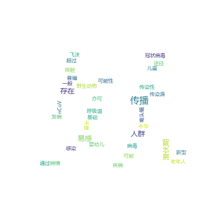
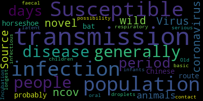
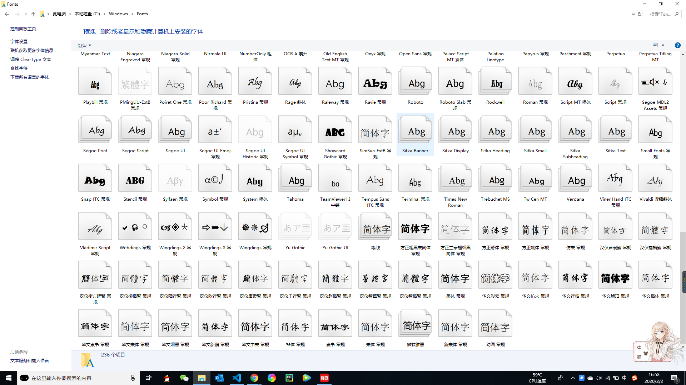
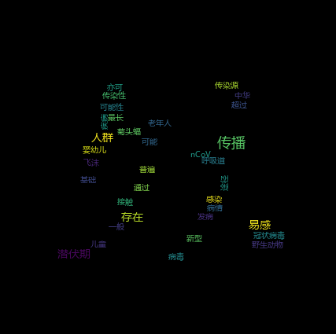
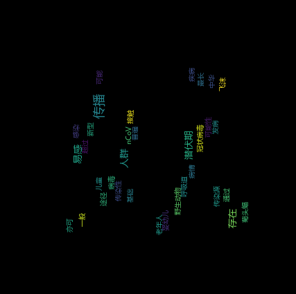
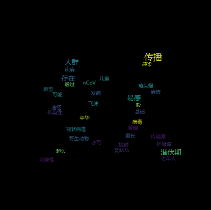

# Python绘制实时疫情词云
> “词云”这个概念由美国西北大学新闻学副教授里奇·戈登（Rich Gordon）于提出。他一直很关注网络内容发布的最新形式——即那些只有互联网可以采用而报纸、广播、电视等其它媒体都望尘莫及的传播方式。通常，这些最新的、最适合网络的传播方式，也是最好的传播方式。 因此，“词云”就是通过形成“关键词云层”或“关键词渲染”，对网络文本中出现频率较高的“关键词”的视觉上的突出。

>词云图过滤掉大量的文本信息，使浏览网页者只要一眼扫过文本就可以领略文本的主旨。

当初的想法是定时将[丁香园肺炎疫情实时动态](https://ncov.dxy.cn/ncovh5/view/pneumonia)爬下来保存在本地，做成一个网站，将详细的疫情播报做成词云，人们就可以不用看长篇大论，而是通过词云获取关键词。结果发现网上都是一个个`xxx肺炎疫情实时动态`。

## 读取文件
首先，我从丁香园肺炎疫情实时动态复制以下文本将其绘制成词云。
```text
病毒: 新型冠状病毒 2019-nCoV

传染源: 野生动物，可能为中华菊头蝠

传播途径: 经呼吸道飞沫传播，亦可通过接触传播，存在粪-口传播可能性

易感人群：人群普遍易感。老年人及有基础疾病者感染后病情较重，儿童及婴幼儿也有发病

潜伏期：一般为 3～7 天，最长不超过 14 天，潜伏期内存在传染性
```
效果如下：



第一步当然是将数据保存在本地，然后读取数据。
因为文件对象会占用操作系统的资源，所以文件读取完后必须要关闭。
因为文件读写时都有可能产生`IOError`,出错后就不会调用`close()`，所以保证程序正常运行，应该使用`try……finally`。
代码如下：
```py
try:
    fp=open("D:\\githubMe\\flask-tutorial\\doc\\coronavirus_data.txt",'r', encoding='UTF-8')
    text=fp.read()
    print(text)
finally:
    if fp:
        fp.close()
```
当然，`python`的`with`可以自动调用`close()`。
优化的代码如下：
```py
with open("D:\\githubMe\\flask-tutorial\\doc\\coronavirus_data.txt",'r', encoding='UTF-8') as fp:
    text=fp.read()
```
## 生成词云
想要生成词云，方式有很多，这里调用`wordcloud`包。
```
pip install WordCloud
```
其官网的[案例](https://amueller.github.io/word_cloud/auto_examples/index.html)。
导入`PIL`图片处理库，对图片进行保存。
```
pip install PIL
```
`PIL`已经是弃用了，所以可以安装`PIL` `fork` 版的 `Pillow`来替代它。 
```
pip install Pillow
```
```py
from wordcloud import WordCloud
import PIL .Image as image

with open("D:\\githubMe\\flask-tutorial\\doc\\coronavirus_data.txt",'r', encoding='UTF-8') as fp:
    text=fp.read()
    wordcloud=WordCloud().generate(text)
    word_image=wordcloud.to_image()
    word_image.save('coronavirus_test_1.png','png')
```
生成词云，但是图中出现中文乱码，可以正常显示英文字符。


将全部中文内容换成英文，词云无乱码



`wordcloud`默认是`DroidSansMono`。`window10`上没有该字体，所以要修改`font_path`来调整此路径。
我导入了系统自带的字体微软雅黑`msyh.ttc`。当然也可以导入网上的第三方字体。



将`font_path`指向字体的地址，代码如下：
```py
    wordcloud=WordCloud(font_path="D:\\githubMe\\flask-tutorial\\doc\\msyh.ttc").generate(text)
```
执行后生成的词云


到这一步，基本的中文词云已经出现了，但是有些不是一个词，而是一句话，那怎么分词呢？
## 中文分词
这里就需要导入[`jieba`分词](https://github.com/fxsjy/jieba)
1. 支持四种分词模式：
精确模式，试图将句子最精确地切开，适合文本分析；
全模式，把句子中所有的可以成词的词语都扫描出来, 速度非常快，但是不能解决歧义；
搜索引擎模式，在精确模式的基础上，对长词再次切分，提高召回率，适合用于搜索引擎分词。
paddle模式，利用PaddlePaddle深度学习框架，训练序列标注（双向GRU）网络模型实现分词。同时支持词性标注。
1. 支持繁体分词
2. 支持自定义词典

```
pip install jieba
```
代码如下：
```py
from wordcloud import WordCloud
import PIL .Image as image
import jieba

def participle_word(text):
    text_list=jieba.cut(text)
    res=' '.join(text_list)
    return res

with open("D:\\githubMe\\flask-tutorial\\doc\\coronavirus_data.txt",'r', encoding='UTF-8') as fp:
    text=fp.read()
    text=participle_word(text)
    wordcloud=WordCloud(font_path="D:\\githubMe\\flask-tutorial\\doc\\msyh.ttc").generate(text)
    word_image=wordcloud.to_image()
    word_image.save('coronavirus_test_4.png','png')
```

生成的中文分词词云如下：


## 改变宽高
`wordcloud`不仅有`font_path`属性，还有`width`和`height`,两者分别默认是`400px`和`200px`。
可以让画布变大，使之成为`800*800`的正方形，更改如下：
```py
    wordcloud=WordCloud(font_path="D:\\githubMe\\flask-tutorial\\doc\\msyh.ttc",width=800,height=800).generate(text)
```


## 改变形状
除了上述三个属性之外，还有`mask`这个常见属性。
在绘制文字的位置给出二进制掩码。如果`mask`有值，则将忽略宽度和高度，并改用mask的形状。所有白色区域都将被视为“蒙版”，而其他区域则可以随意使用。

`mask`只接受`nd-array`或`None`类型的值,所以需要`numpy`将图片转化。

找了一张白底的图片“妖”，很符合这次疫情的始作俑者的操作。


```
pip install numpy
```
导入`numpy`包，支持大量的维度数组与矩阵运算，此外也针对数组运算提供大量的数学函数库。可以把图片“妖”想象成一个大型矩阵，然后`worlcloud`根据算法在非白色区域填充文字。`numpy`最重要的一个特点是其 `N` 维数组对象 `ndarray`，它是一系列同类型数据的集合，以 `0` 下标为开始进行集合中元素的索引。`ndarray` 对象是用于存放同类型元素的多维数组。
`ndarray` 中的每个元素在内存中都有相同存储大小的区域。
```python
from wordcloud import WordCloud
import PIL .Image as image
import jieba
import numpy as np

def participle_word(text):
    text_list=jieba.cut(text)
    res=' '.join(text_list)
    return res

with open("D:\\githubMe\\flask-tutorial\\doc\\coronavirus_data.txt",'r', encoding='UTF-8') as fp:
    text=fp.read()
    text=participle_word(text)
    shade=np.array(image.open('D:\\githubMe\\flask-tutorial\\doc\\wordcloud2.png'))
    wordcloud=WordCloud(font_path="D:\\githubMe\\flask-tutorial\\doc\\msyh.ttc",width=800,height=800,mask=shade).generate(text)
    word_image=wordcloud.to_image()
    word_image.save('coronavirus_test_6.png','png')
```
执行脚本生成如下词云，轮廓就是“妖”


## 其余属性
1. `prefer_horizontal`
>The ratio of times to try horizontal fitting as opposed to vertical. If prefer_horizontal < 1, the algorithm will try rotating the word if it doesn’t fit. (There is currently no built-in way to get only vertical words.)

我的理解是：当该值取0时，词云中所有词汇都是垂直；
当该值取1或大于1时，词云中所有词汇都是水平；
只有大于0小于1之间，词汇才会放置合理。
```py
    wordcloud=WordCloud(font_path="D:\\githubMe\\flask-tutorial\\doc\\msyh.ttc",width=800,height=800,mask=shade,prefer_horizontal=1).generate(text)
```

```py
    wordcloud=WordCloud(font_path="D:\\githubMe\\flask-tutorial\\doc\\msyh.ttc",width=800,height=800,mask=shade,prefer_horizontal=0).generate(text)
```


2. `background_color`
词云的背景颜色，默认是黑色。比如，下面我改成白色。
```py
    wordcloud=WordCloud(font_path="D:\\githubMe\\flask-tutorial\\doc\\msyh.ttc",width=800,height=800,mask=shade,background_color='#fff').generate(text)
```


3. `relative_scaling`
相对词频对字体大小的重要性。当`relative_scaling = 0`时，仅考虑单词排名。当`relative_scaling = 1`时，频繁出现的单词的大小将是两倍。如果要考虑单词频率而不是单词频率，那么`.5`左右的`relative_scaling`通常看起来不错。如果为`auto`，除非重复为`true`，否则它将设置为`0.5`，在这种情况下，它将设置为`0`。


## 参考文献
[word_cloud官网](https://amueller.github.io/word_cloud/index.html)