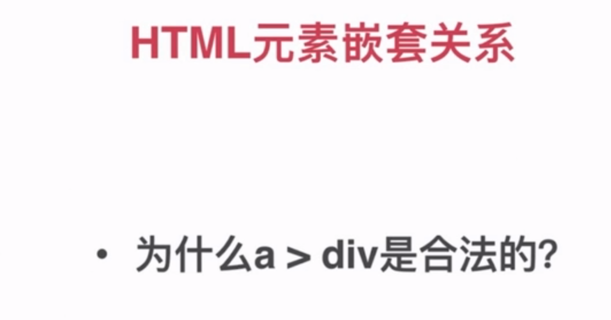
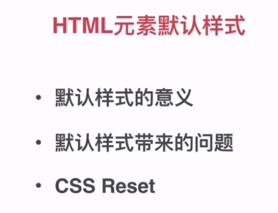

## (慕课网)[全面系统讲解CSS 工作应用+面试一步搞定](https://coding.imooc.com/class/chapter/164.html#Anchor)
### 第2章 HTML基础强化
>讲解[HTML常见元素](https://developer.mozilla.org/zh-CN/docs/Web/HTML/Element)、版本（HTML4/XHTML/HTML5的关系）以及HTML元素的分类和嵌套关系。关注元素默认样式和定制化。

- meta
- title
- style
- link
- script
- base

>嵌套关系,主要看a标签外面的元素，因为a是transport



> 默认样式和reset
[CSS Tools: Reset CSS](https://meyerweb.com/eric/tools/css/reset/)



简单粗暴的css reset
```css
*{
margin: 0;
padding: 0;
}
```

>doctype的意思是什么？
<!DOCTYPE> 声明必须是 HTML 文档的第一行，位于 <html> 标签之前。

<!DOCTYPE> 声明不是 HTML 标签；它是指示 web 浏览器关于页面使用哪个 HTML 版本进行编写的指令。

在 HTML 4.01 中，<!DOCTYPE> 声明引用 DTD，因为 HTML 4.01 基于 SGML。DTD 规定了标记语言的规则，这样浏览器才能正确地呈现内容。

HTML5 不基于 SGML，所以不需要引用 DTD。

提示：请始终向 HTML 文档添加 <!DOCTYPE> 声明，这样浏览器才能获知文档类型。

> HTML XHTML HTML5

html:超文本标记语言 (Hyper Text Markup Language)

xhtml:可扩展超文本标记语言，是一种置标语言，表现方式与超文本标记语言（HTML）类似，不过语法上更加严格。

h5:最先由WHATWG(Web 超文本应用技术工作组)命名的一种超文本标记语言，随后和W3C的xhtml2.0(标准)相结合，产生现在最新一代的超文本标记语言。可以简单点理解成：h5≈ html+CSS 3+js+API。

html特性：

- 标识文本。例如：定义标题文本、段落文本、列表文本、预定义文本。
- 建立超链接，便于页面链接的跳转。
- 创建列表，把信息有序组织在一起以方便浏览。
- 在网页中显示图像、声音、视频、动画等多媒体信息，把网页设计得更富冲击力。
- 可以制作表格，以便显示大量数据。
- 可以制作表单，允许在网页内输入文本信息，执行其他用户操作，方便信息互动。


> HTML5有什么变化

h5的认识：

- 新特性应该基于 HTML、CSS、DOM 以及 JavaScript。
- 减少对外部插件的需求（比如 Flash）
- 更优秀的错误处理
- 更多取代脚本的标记
- HTML5 应该独立于设备
- 开发进程应对公众透明

h5新特性：
- 用于绘画的 canvas 元素
- 用于媒介回放的 video 和 audio 元素
- 对本地离线存储的更好的支持
- 新的特殊内容元素，比如 article、footer、header、nav、section
- 新的表单控件，比如 calendar、date、time、email、url、search
> 语义化的意思是什么

- 去掉或者丢失样式的时候能够让页面呈现出清晰的结构；
- 有利于SEO：和搜索引擎建立良好沟通，有助于爬虫抓取更多的有效信息：爬虫依赖于标签来确定上下文和各个关键字的权重；
- 方便其他设备解析（如屏幕阅读器、盲人阅读器、移动设备）以意义的方式来渲染网页；
- 便于团队开发和维护，语义化更具可读性，是下一步吧网页的重要动向，遵循W3C标准的团队都遵循这个标准，可以减少差异化。
> 哪些元素可以自闭合

```html
<meta>
<base>
<br>
<hr>

<input>
<col>在表格table中定义一个或多个列的属性
<frame>定义框架的窗口
<link>
<area>带有可点击区域的图像
<param>元素允许您为插入 XHTML 文档的对象规定 run-time 设置，也就是说，此标签可为包含它的 
       <object> 或者<applet> 标签提供参数。 
<embed>HTML5 中新增的,标签定义了一个容器，用来嵌入外部应用或者互动程序（插件）
<keygen>该对象提供了一个安全的方式来验证用户
<source> 标签为媒体元素（比如 和 ）定义媒体资源

```
> HTML和DOM的关系

> property和attribute的区别

> form的作用有哪些


### 参考文献
[xhtml、html与html5的区别](xhtml、html与html5的区别)
