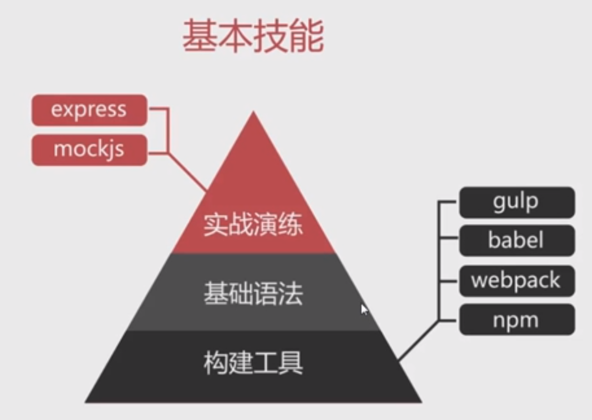
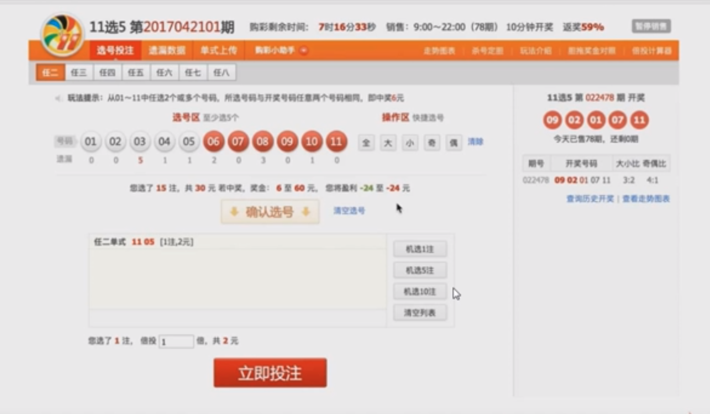
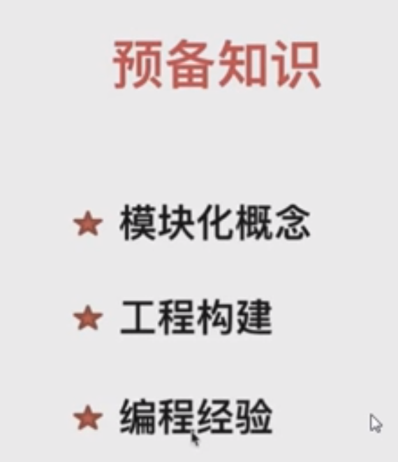
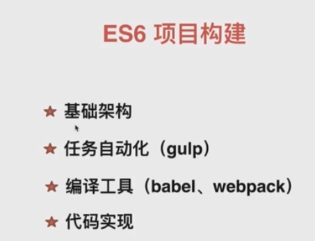
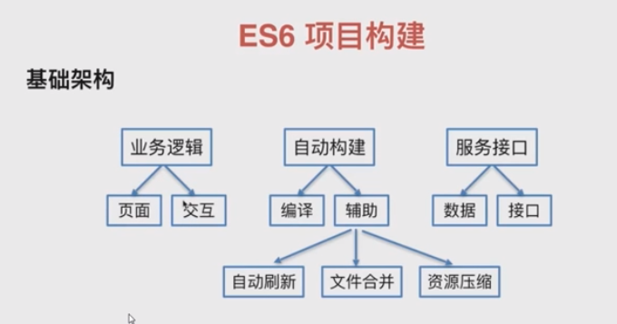
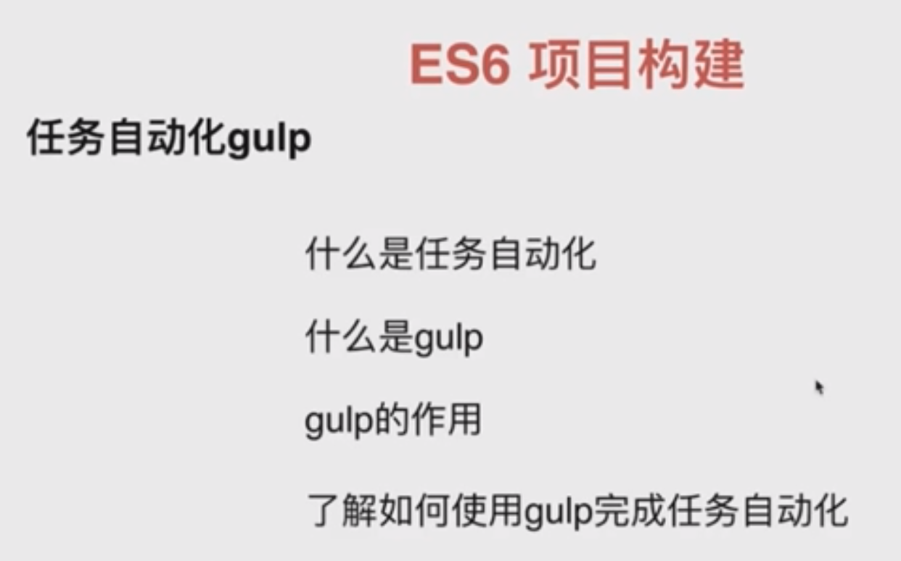
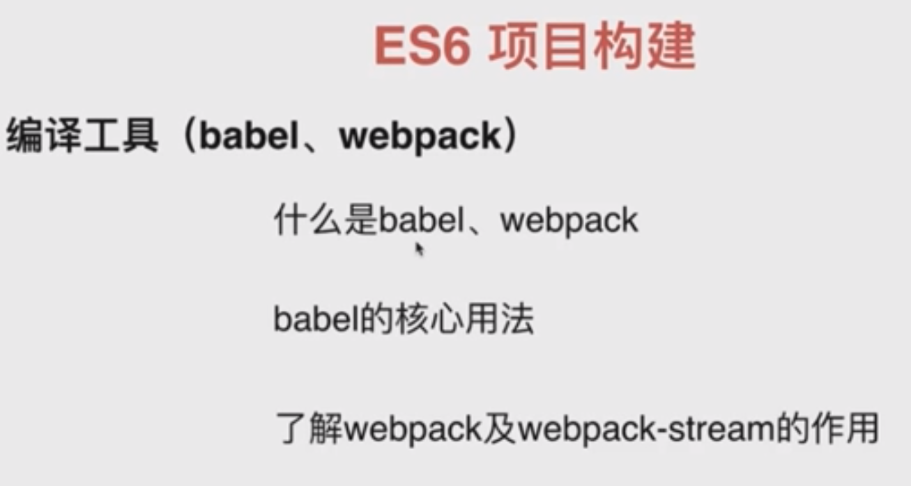
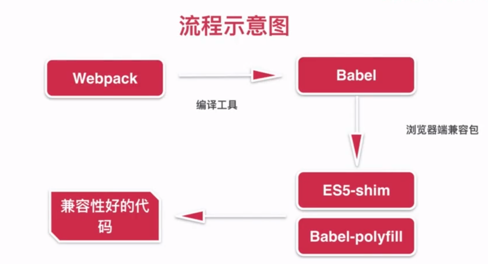

## ES6 (慕课网)[ES6零基础教学 解析彩票项目](https://coding.imooc.com/class/chapter/98.html#Anchor)

涉及到块级作用域，对象代理，promise等

babel es6编译成es5

热更新

提供插件，多个tesk实现自动化 

babel的核心用法：
解决兼容性问题

 2-3 命令行处理，创建JS编译任务脚本

## (慕课网)[ES6+ 开发电商网站的账号体系 JS SDK](https://coding.imooc.com/class/152.html)

## 第2章 ES6+实战所需要的环境
本章主要介绍ES6+实战中必备的两个工具：Babel和webpack，以及工程化中脚手架工具的重要性和意义，介绍html-bundler这样一个脚手架工具（后面实战会用到）
#### 2-2 webpack讲解与示例

webpack配置

#### 2-3 Babel讲解与示例

2-4
## 参考文献

