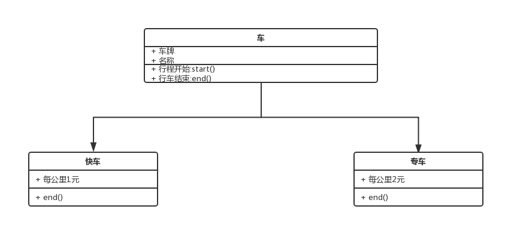
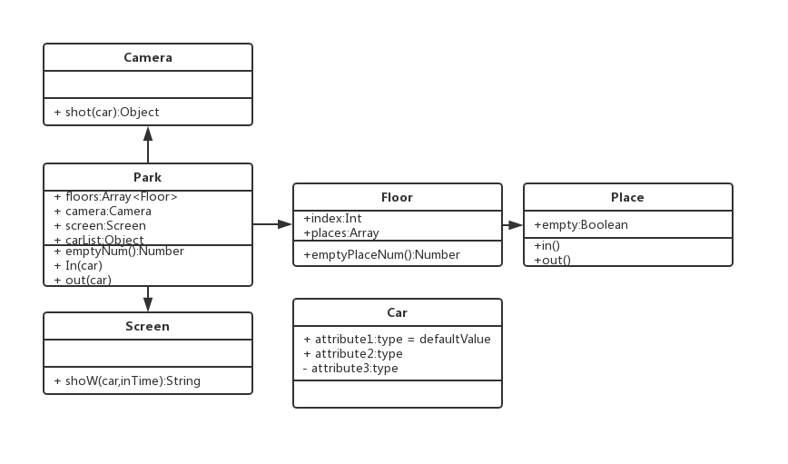
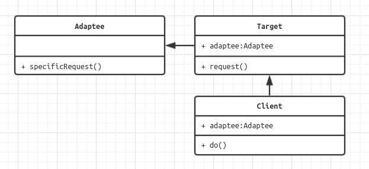
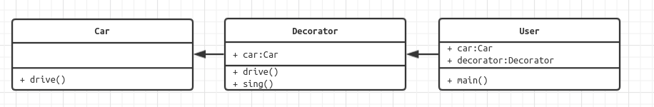
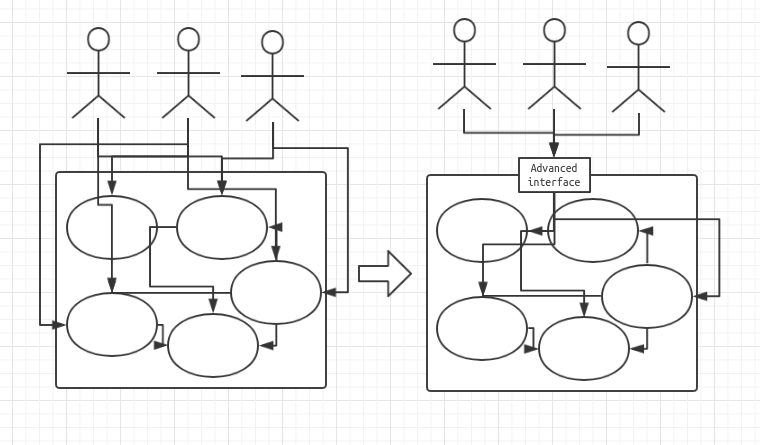

# Javascript 设计模式系统讲解与应用
> Javascript设计模式系统讲解与应用
从“写好代码”到“设计代码”的过程，不仅是技术的提升，更是编程思维的提升，而这其中最关键的就是设计模式，是否理解并掌握设计模式，也是衡量程序员能力的标准之一

## 设计模式不虚幻，一个案例带你看清它的具体应用

> 学习前考虑

操作DOM / 绑定事件 / 发送请求

> 学习后考虑

面向对象 / 设计模式 / 合理性和扩展性

> 使用jQuery，而不是Vue或React，完成一个购物车demo，因为Vue
和React封装了很多东西，不利于你理解设计模式，这是讲
师为讲解“前端设计模式”而精心设计的案例 

- 工厂模式

创建商品实例

- 单例模式

购物车

- 装饰器模式

Log（点击按钮日志打点）

- 代理模式

优惠商品打折（name有“优
惠”字样、price是原价的
80%）

- 观察者模式

事件监听 / Promise

- 状态模式

添加到购物车&从购物车删除

- 模版方法模式

渲染的方法统一成一个，里
面再分别写渲染不同部分的
代码

- 职责链模式

Promise多个then

## 导学
- 论工程师的设计能力
  - 3年工作经验，面试必考设计能力
  - 项目技术负责人，设计能力必要基础
  - 从写好代码到做好设计，设计模式是必经之路

- 困惑
  - 网上的资料-java
  - 看懂不会用
  - js框架应用于业务

- 课程概述
  - 做什么？-讲解js设计模式
  - 哪些部分？-面向对象，设计原则，设计模式
  - 技术？-面向对象，UML类图，ES6

- 知识点
  - 面向对象
    - ES6 
    - UML类图
  - 设计原则
    - 何为设计？
    - 5大设计原则
    - 从设计到模式
  - 设计模式
    - 分优先级
    - 核心技术
    - 框架应用


## 面向对象
### 搭建开发环境1

- 安装node/npm 
- 创建项目design-pattern-test
- 安装webpack/webpack-cli,借用淘宝npm镜像
```bash
npm install webpack webpack-cli --save-dev --registry=https://registry.npm.taobao.org
npm init
```
生成package.json
- 创建src-index.js
- 创建webpack.dev.config.js
```json
module.exports = {
  entry: "./src/index.js",
  output: {
    path: __dirname,
    filename: "./release/bundle.js"
  }
};
```
- 添加dev，在开发模式下，用webpack的配置去运行webpack.dev.config.js，执行`npm run dev`
```json
{
  "name": "design-pattern-test",
  "version": "1.0.0",
  "description": "",
  "main": "index.js",
  "scripts": {
    "test": "echo \"Error: no test specified\" && exit 1",
    "dev":"webpack --config ./webpack.dev.config.js --mode development"
  },
  "author": "",
  "license": "ISC",
  "devDependencies": {
    "webpack": "^4.30.0",
    "webpack-cli": "^3.3.2"
  }
}

```

- 最后的项目架构
``` 
.
├── package.json
├── package-lock.json
├── release
│   └── bundle.js
├── src
│   └── index.js
└── webpack.dev.config.js
```

### 搭建开发环境2
- 安装webpack-dev-server html-webpack-plugin
```bash
npm install webpack-dev-server html-webpack-plugin --save-dev --registry=https://registry.npm.taobao.org
```
- 创建index.html，！+tab生成html模板
```html
<!DOCTYPE html>
<html lang="en">
<head>
    <meta charset="UTF-8">
    <meta name="viewport" content="width=device-width, initial-scale=1.0">
    <meta http-equiv="X-UA-Compatible" content="ie=edge">
    <title>qiufeihong前端设计模式</title>
</head>
<body>
    <p>qiufeihong前端设计模式</p>    
</body>
</html>
```
- webpack.dev.config.js添加html模板,并且进行服务器配置
```json
const path = require("path");
const HtmlWebpackPlugin = require("html-webpack-plugin");

const config = {
  entry: "./src/index.js",
  output: {
    path: __dirname,
    filename: "./release/bundle.js"
  },
  plugins: [
    new HtmlWebpackPlugin({
      template: "./index.html"
    })
  ],
  devServer: {
    // contextBase: path.join(__dirname, "./release"),默认来自于根目录
    open: true, //自动打开浏览器
    port: 2000,
    hot: true //开启热更新
  }
};
module.exports = config;

```
- webpack-dev-server启动项目，npm run dev 
```json
{
  "name": "design-pattern-test",
  "version": "1.0.0",
  "description": "",
  "main": "index.js",
  "scripts": {
    "test": "echo \"Error: no test specified\" && exit 1",
    "dev": "webpack-dev-server --config ./webpack.dev.config.js --mode development"
  },
  "author": "",
  "license": "ISC",
  "devDependencies": {
    "html-webpack-plugin": "^3.2.0",
    "webpack": "^4.30.0",
    "webpack-cli": "^3.3.2",
    "webpack-dev-server": "^3.3.1"
  }
}

```

- 最后的项目架构

```
.
├── index.html
├── package.json
├── package-lock.json
├── release
│   └── bundle.js
├── src
│   └── index.js
└── webpack.dev.config.js
```
### 搭建开发环境3
- 安装`babel-core babel-loader babel-polyfill babel-preset-es2015 babel-preset-latest`
```bash
npm install babel-core babel-loader babel-polyfill babel-preset-es2015 babel-preset-latest --save-dev --registry=https://registry.npm.taobao.org
```
- 创建.babelrc
```json
{
    "presets":["es2015","latest"],
    "plugins":[]
}
```
- 增加module
```json
const path = require("path");
const HtmlWebpackPlugin = require("html-webpack-plugin");

const config = {
  entry: "./src/index.js",
  output: {
    path: __dirname,
    filename: "./release/bundle.js"
  },
  module: {
    rules: [
      {
        test: /\.js?$/,
        exclude: /(node_modules)/,
        loader: "babel-loader"
      }
    ]
  },
  plugins: [
    new HtmlWebpackPlugin({
      template: "./index.html"
    })
  ],
  devServer: {
    // contextBase: path.join(__dirname, "./release"),默认来自于根目录
    open: true, //自动打开浏览器
    port: 2000,
    hot: true //开启热更新
  }
};
module.exports = config;

```
- 增加ES6， `npm run dev`
```javascript
class Person {
  constructor(name) {
    this.name = name;
  }
  getName() {
    return this.name;
  }
}
let p = new Person("qiufeihong");
alert(p.getName());

```
### 什么是面向对象
1. 概念
类/对象（实例）
```javascript
class Person {
  constructor(name, age) {
    this.name = name;
    this.age = age;
  }
  eat() {
    alert(`我是${this.name}`);
  }
  speak() {
    alert(`今年${this.age}`);
  }
}

let qiu = new Person("qiu", 12);
qiu.eat();
qiu.speak();
let wang = new Person("wang", 123);
wang.eat();
wang.speak();

```
2. 三要素
- 继承，子类继承父类
- 封装,数据的权限和保密
- 多态，同一接口不同实现

### 继承
- 父类是公共的
- 可以抽离复用的代码，减轻冗余
```javascript
class Person {
  constructor(name, age) {
    this.name = name;
    this.age = age;
  }
  eat() {
    alert(`我是${this.name}`);
  }
  speak() {
    alert(`今年${this.age}`);
  }
}

class Student extends Person {
  constructor(name, age, number) {
    super(name, age);
    this.number = number;
  }
  study() {
    alert(`${this.name}在学习`);
  }
}
let qiu = new Student("qiu", 12, "1213vfzad");
qiu.eat();
alert(qiu.number);
qiu.speak();
qiu.study();
let wang = new Student("wang", 123, "232dfafd");
wang.eat();
alert(qiu.number);
wang.speak();
wang.study();

```
### 封装

- public 完全开放
- protected 对子类开放
- private 对自己开放
- （ES6尚不支持，typesript可以）
1. 减少耦合，不该外露的不外露
2. 利于数据/接口的权限管理
3. ES6目前不支持，一般认为_开头的属性是private
支持变量声明
[TypeScript](https://www.tslang.cn/play/index.html)

### 多态
- 同一接口，不同表现
- js应用极少
- 需要结合java等语言的接口/重写/重载等功能
1. 保持子类的开放性和灵活性
2. 面向接口编程

```javascript
class Person {
  constructor(name) {
    this.name = name;
  }
}
class A extends Person {
  constructor(name) {
    super(name)
    this.name=name
  }
  getName() {
    alert(`我是a${this.name}`)
  }
}
class B extends Person {
  constructor(name) {
    super(name)
    this.name=name
  }
  getName() {
    alert(`我是b${this.name}`)
  }
}

const a = new A('a')
a.getName()

const b = new B('b')
b.getName()
```

### 应用举例
- jQuery就是一个class
- $('p')就是一个实例
- jQuery就是面向对象实现的
```javascript
class jquery {
  constructor(selector) {
    let slice = Array.prototype.slice //抽取当前数组中的一段元素组合成一个新数组。
    let dom = slice.call(document.querySelectorAll(selector)) //返回与指定的选择器匹配的文档中的元素列表，变成数组
    let len = dom ? dom.length : 0
    for (let i = 0; i < len; i++) {
      this[i] = dom[i]
    }
    this.length = len
    this.selector = selector || ''
  }
  append(node) {
    // ...
  }
  addClass(name) {
    // ...
  }
  html(data) {
    // ...
  }
  // 省略
}

window.$ = function (selector) {
  return new jquery(selector)
}

var p = $('p')
console.log(p)
console.log(p.append())
console.log(p.addClass())

```

### 为何使用面向对象
- 程序执行：顺序/判断/循环——结构化
- 面向对象——数据结构化
- 对于计算机来说，结构化的才是最简单的
- 编程应该简单和抽象

### UML类图
- 统一建模语言
- 类图
- 关系——泛化和关联
- 代码和类图结合

## 设计原则
### 何为设计
- 描述
  - 按照一种思路或者标准来实现功能
  - 不同方案实现相同功能
  - 随着需求的增加，设计的作用才能体现出来
- 结合《unix/linux设计哲学》
  - 大准则
    - 准则1：小即是美
    - 准则2：让每个程序只做好一件事
    - 准则3：快速建立模型
    - 准则4：舍弃高效率而取可移植性
    - 准则5：采用纯文本来存储数据
    - 准则6：充分利用软件的杠杆效应（软件复用）
    - 准则7：使用shell脚本来提高杠杆效应和可移植性
    - 准则8：避免强制性的用户界面
    - 准则9：让每个程序都称为过滤器
  - 小准则
    - 允许用户定制环境
    - 尽量使操作系统内核小而轻量化
    - 使用小写字母并尽量简短
    - 沉默是金
    - 各部分之和大于整体
    - 寻求90%的解决方案

linux的每个命令都是通过程序运行的

准则2：让每个程序只做好一件事+准则9：让每个程序都称为过滤器
```bash
ls | grep *.js | grep 'webpack'
```

SOLID五大设计原则
1. S-单一职责原则
- 一个程序只做一件事情
- 如果功能过于复杂则拆分
2. O-开放封闭原则
- 对扩展开放，对修改封闭
- 增加需求时，扩展新代码，而非修改已有代码
- 这是软件设计的终极目标
3. L-李氏置换原则
- 子类能覆盖父类
- 父类能出现的地方子类就能出现
- js中使用较少
4. I-接口独立原则
- 保持接口的单一独立，避免出现“胖接口”
- js中没有接口
- 类似于单一原则
5. D-依赖导致原则
- 依赖于抽象而不是具体
- 使用方只关注接口而不关注具体类的实现
- js中使用较少

promise实现SO原则
- 每个then只做一件事情
- 如果要增加需求,只要增加then即可
```javascript
function loadImg(src) {
  return new Promise(function (resolve, reject) {
    let img = document.createElement('img')
    img.onload = function () {
      resolve(img)
    }
    img.onerror = function () {
      reject('error')
    }
    img.src = src
  })
}
let src = 'https://avatars1.githubusercontent.com/u/12479470?s=460&v=4'
let res = loadImg(src)
res.then(function (img) {
  alert(`img's height:${img.height}`)
  return img
}).then(function (img) {
  alert(`img's width:${img.width}`)
  return img
}).then(function(img){
  alert(img.src)
}).catch(function (ex) {
  alert(`errorrrrr${ex}`)
})


```

### 从设计到模式
1. 创建型(5)
- 工厂模式
  - 工厂方法模式
  - 抽象工厂模式
  - 建造者模式
- 单例模式
- 原型模式

2. 结构型(7)
- 适配器模式
- 装饰器模式
- 代理模式
- 外观模式
- 桥接模式
- 组合模式
- 享元模式

3. 行为型(11)
- 策略模式
- 模板方法模式
- 观察者模式(js watch)
- 迭代器模式(ES6)
- 职责连模式
- 命令模式
- 备忘录模式
- 状态模式
- 访问者模式
- 中介者模式
- 解释器模式

### 面试题示例
#### 第一题
1. 打车时,可以打专车或者快车,任何车都有车牌号和名称
2. 不同车价格不同,快车每公里1元,专车每公里2元
3. 行程开始时,显示车辆信息
4. 行车结束时,显示打车金额(假定行程就5公里)
问题:
- 画出UML类图
- 用ES6语法写出该示例

我的版本:

```javascript
class car {
  constructor(name, id) {
    this.name = name
    this.id = id
  }
  start() {
    alert(`我在乘坐${this.name},车牌是${this.id}`)
  }
  end(){}
}

class quickCar extends car {
  constructor(name, id, free, length) {
    super(name, id)
    this.total = free * length
  }
  end() {
    alert(`费用是${this.total}`)
  }
}

class specialCar extends car {
  constructor(name, id, free, length) {
    super(name, id)
    this.total = free * length
  }
  end() {
    alert(`费用是${this.total}`)
  }
}

const qCar = new quickCar('aodi', '23423dfasdfasd', 1, 5)
qCar.start()
qCar.end()
const sCar = new specialCar('benchi', '2fdssd', 2, 5)
sCar.start()
sCar.end()
```


#### 第二题
1. 某停车场,分3层,每层100车位
2. 每个车位都能监控到车辆的驶入和离开
3. 车辆进入前,显示每层的空余车位数量
4. 车辆进入时,摄像头可识别车牌号和时间
5. 车辆出来时,出口显示器显示车牌号和停车时长

问题
- 画出UML类图
- 编码



## 工厂模式
```javascript
class Car{
  constructor(name,money){
    this.name=name
    this.money=money
  }
  getName(){
    alert(`这是一辆${this.name}`)
  }
  getMoney(){
alert(`这辆车值${this.money}`)
  }
}
class Factory{
  create(name,money) {
    return new Car(name,money)
  }
}

//测试
let factory=new Factory()
let car1=factory.create('benchi','100w')
car1.getName()
car1.getMoney()
let car2=factory.create('biyadi','10w')
car2.getName()
car2.getMoney()
```
### 使用场景
1. jQuery
- $('div')和new $('div')有何区别?
- 第一:书写麻烦,jQuery的链式操作将成为噩梦
- 第二:一旦jQuery名字变化,将是灾难性的

- 聊聊阅读经典lib源码的意义
  - 功能
  - 设计

- 聊聊创新和拿来主义
  - 多看

2. React.createElement
3. vue异步组件

> 构造函数和创建者分离

> 符合开发封闭原则

## 单例模式
```javascript
class SingleObj{
  say(){
    alert('我是一个单例')
  }
}
SingleObj.getInstance=(function(){
  let instance
  return function(){
    if(!instance){
      instance=new SingleObj()
    }
    return instance
  }
})()

let obj1=SingleObj.getInstance()
obj1.say()
let obj2=SingleObj.getInstance()
obj2.say()
console.log('obj1',obj1)//SingleObj{}
let obj3=new SingleObj()
let obj4=new SingleObj()
console.log('obj1===obj2?',obj1 === obj2)//true
console.log('obj3===obj4?',obj3 === obj4)//false

```
### 场景
- jQuery只有一个$
- 模拟登录框
- 购物车
- vuex和redux中的store


> 符合单一职责原则,只实例化唯一的对象

> 没法具体开放封闭原则,但是绝对不违反开放封闭原则

## 适配器
想象成插座的适配:美国插座和中国插座不兼容,加适配器


```javascript
class Adaptee{
  specificRequest(){
    return '美国插座'
  }
}
class Target{
  constructor(name){
    this.name=name
    this.adaptee=new Adaptee
  }
  request(){
    alert(`${this.name}-适配器-${this.adaptee.specificRequest()}`)
  }
}

let target=new Target('中国插头')

target.request()//中国插头-适配器-美国插座
```
### 背景
封装旧接口
- jQuery的ajax
- vue computed

## 装饰器
- 为对象添加新功能
- 不改变其原有的结构和功能

 
```javascript
class Car {
  drive() {
   alert('车能开')
  }
}
class Decorator {
  constructor(car){
    this.car=car
  }
  drive() {
    this.car.drive()
    this.sing(car)
  }
  sing(car){
    alert('加一个音箱，来唱歌')
  }
}
let car=new Car()
car.drive()
alert('----')
let user=new Decorator(car)
user.drive()
```
### 场景
- ES7装饰器
- core-decorator
  - 第三方开源lib
  - 提供常用的装饰器

```bash
npm install babel-plugin-transform-decorators-legacy --save-dev --registry=https://registry.npm.taobao.org
```
1. 有参数的装饰器
```javascript
@testDec(false)
class Demo{

}
function testDec(isDec){
  return function(target){
    target.isDec=isDec
  }
}
alert(Demo.isDec)//false
```
2. @readonly演示
```javascript
function readonly(target,name,descriptor){
  descriptor.writable=false
  return descriptor
}
class People{
  constructor(name,age){
    this.name=name
    this.age=age
  }

  @readonly
  getName(){
    alert(`${this.name}是我的名字,${this.age}是我的年龄`)
  }
}
let people=new People('qfh',123)
people.getName()//qfh是我的名字,123是我的年龄
people.getName=function(){
  alert('update')
}
//Uncaught TypeError: Cannot assign to read only property 'getName' of object '#<People>'
```
3. @log

用上[core-decorator](https://github.com/jayphelps/core-decorators#nonconfigurable)
```javascript
import {
  readonly
} from 'core-decorators'
class People {
  constructor(name, age) {
    this.name = name
    this.age = age
  }

  @readonly
  getName() {
    alert(`${this.name}是我的名字,${this.age}是我的年龄`)
  }
}
let people = new People('qfh', 123)
people.getName() //qfh是我的名字,123是我的年龄
people.getName = function () {
  alert('update')
}
//Uncaught TypeError: Cannot assign to read only property 'getName' of object '#<People>'
```

> 将现有对象和装饰器分离，两者独立
> 开放原则


## 代理模式
### 介绍
- 使用者无权访问目标对象
- 中间加代理，通过代理做授权和控制
### 示例
- 科学上网，
- 明星经纪人

```javascript
class Star {
  constructor(name) {
    this.name = name
    this.call = this.call(name)
  }
  play() {
    console.log(`${this.name}演出真好看`)
  }
  call() {
    console.log(`我可以邀请${this.name}来演出吗`)
  }
}
class ProxyStar {
  constructor(name) {
    this.star = new Star(name)
  }
  play() {
    this.star.play()
  }
}
// 测试
let proxyStar=new ProxyStar('zhuliye')
proxyStar.play()

// 我可以邀请zhuliye来演出吗
// zhuliye演出真好看
```

### 场景
- 网页事件代理
```javascript
<!DOCTYPE html>
<html lang="en">

<head>
    <meta charset="UTF-8">
    <meta name="viewport" content="width=device-width, initial-scale=1.0">
    <meta http-equiv="X-UA-Compatible" content="ie=edge">
    <title>qiufeihong前端设计模式</title>
</head>

<body>
    <div id='divProxy'>
        <a href="#">qiufeihong前端设计模式1</a>
        <a href="#">qiufeihong前端设计模式2</a>
        <a href="#">qiufeihong前端设计模式3</a>
        <a href="#">qiufeihong前端设计模式4</a>
    </div>
    <script type="text/javascript" src="./release/bundle.js"></script>
</body>
<script src="http://libs.baidu.com/jquery/2.0.0/jquery.min.js"></script>
<script>
    let div = document.getElementById('divProxy')
    div.addEventListener('click', (e) => {
        let target = e.target
        // 事件冒泡
        if (target.nodeName === 'A') {
            alert(target.innerHTML)
        }
    })
</script>
</html>
```
- jQuert $.proxy
```javascript
<!DOCTYPE html>
<html lang="en">

<head>
    <meta charset="UTF-8">
    <meta name="viewport" content="width=device-width, initial-scale=1.0">
    <meta http-equiv="X-UA-Compatible" content="ie=edge">
    <title>qiufeihong前端设计模式</title>
    <style>
        .intro {
            font-size: 100px;
            color: blue;
        }
    </style>
</head>

<body>
    <div id='divProxy'>
        <a href="#">qiufeihong前端设计模式1</a>
        <a href="#">qiufeihong前端设计模式2</a>
        <a href="#">qiufeihong前端设计模式3</a>
        <a href="#">qiufeihong前端设计模式4</a>
    </div>
    <script type="text/javascript" src="./release/bundle.js"></script>
</body>
<script src="http://libs.baidu.com/jquery/2.0.0/jquery.min.js"></script>
<script>
    $('#divProxy').click(function () {
        // 1箭头函数
        // setTimeout(()=> {
        //     $(this).addClass('intro')
        // }, 1000)
        // 2.$.proxy
        // setTimeout($.proxy(function () {
        //     $(this).addClass('intro')
        // }, this), 1000)
    })
</script>

</html>
```
- ES6 proxy
```javascript
// 明星
let Star = {
  name: 'zhuliye',
  age: '12',
  height: '167',
  weight: '90',
  price: 1230000,
  phone: 'star_12355553333'
}
// 经纪人
let agent = new Proxy(Star, {
  get: function (target, key) {
    if (key === 'phone') {
      // 返回经纪人电话
      return 'agent_12355557666'
    }
    if (key === 'price') {
      // 经纪人报价
      return 2000000
    }
    return target[key]
  },
  set: function (target, key, val) {
    if (key === 'cusPrice') {
      if (val < 1000000) {
        throw new Error('too low')
      } else {
        target[key] = val
        return true
      }
    }
  }
})
// 测试
// console.log(agent.name)
// console.log(agent.age)
// console.log(agent.weight)
// console.log(agent.price)
// console.log(agent.phone)
// agent.cusPrice=400000
// console.log(agent.cusPrice)
// zhuliye
//   12
//   90
//   2000000
//   agent_12355557666
// Uncaught Error: too low


// console.log(agent.name)
// console.log(agent.age)
// console.log(agent.weight)
// console.log(agent.price)
// console.log(agent.phone)
// agent.cusPrice=4000000
// console.log(agent.cusPrice)
// zhuliye
// 12
//  90
//  2000000
//  agent_12355557666
//  4000000
```
### 设计原则验证
- 代理类和目标类分离，隔离开目标类和使用者
- 符合开放封闭原则

### 代理模式vs适配器模式
- 适配器模式：提供不同的接口（如不同版本的插头）
- 代理模式：提供一模一样的接口

### 代理模式vs装饰器模式
- 装饰器模式：扩展功能，原有功能不变且可直接使用
- 代理模式：显示原有功能，但是经过限制或者阉割之后的

## 外观模式
- 为子系统的多个接口提供一个高级接口
- 用户只要调用这个高级接口即可


不符合单一职责原则和开放封闭原则

## 观察者模式
- 发布&订阅
- 一对多

### 场景
- 网页事件绑定
所有事件监听机制都是观察者模式

- promise

- jquery callbacks
每一个fire就是一个订阅，可以一对多，也可以一对一，很形象的观察者模式。
```javascript
<script src="https://cdn.bootcss.com/jquery/3.4.1/jquery.js"></script>
<script>
    var callback = $.Callbacks()
    callback.add(function (some) {
        console.log(some, '--1')
    })
    callback.add(function (some) {
        console.log(some, '--2')
    })
    callback.add(function (some) {
        console.log(some, '--3')
    })
    callback.add(function (some) {
        console.log(some, '--4')
    })
    callback.fire('qfh')
    callback.fire('hfq')
    // qfh --1
    // qfh --2
    // qfh --3
    // qfh --4
    // hfq --1
    // hfq --2
    // hfq --3
    // hfq --4
</script>

```
- nodejs自定义事件
案例一：EventEmitter
```javascript
const EventEmitter=require('events').EventEmitter

const event=new EventEmitter()
// 同一个事件上发生的两件事
event.on('click',res=>{
  console.log(`qfh${res}`)
}).on('click',res=>{
  console.log(`qfh2${res}`)
})

// 触发监听事件click
event.emit('click','加油')
// qfh加油
// qfh2加油
```

案例二：Car继承事件监听api

```javascript
const EventEmitter = require('events').EventEmitter
// Car继承事件监听api
class Car extends EventEmitter {
  constructor(name) {
    super()
    this.name = name
  }
}

const car = new Car('aodi')
// 如要取this，那么就不要用箭头函数，否则作用域不同
car.on('open', function(){
  console.log(this.name, '在高速飞驰')
})

car.emit('open')
// aodi 在高速飞驰
```
案例三：打印每一行流的长度

```javascript
const fs = require('fs')
const readStream = fs.createReadStream('../static/interview.docx')

let total = 0
readStream.on('data', function (data) {
  // 打印每一行流的长度
  console.log(data.length)
  total += data.length
})
readStream.on('end', function () {
  // 打印总共长度
  console.log(total)
})

// 65536
// 65536
// 65536
// 65536
// 65536
// 65536
// 65536
// 65536
// 65536
// 65536
// 65536
// 65536
// 65536
// 48221
// 900189
```
案例四：打印每行的长度
 
```javascript
const fs = require('fs')
const readLine = require('readline')
const rl = readLine.createInterface({
  input: fs.createReadStream('../static/interview.docx')
})
let totalLine = 0
rl.on('line', function (line) {
  let llen = line.length
  console.log(llen)
  totalLine += llen
})
rl.on('close', function () {
  console.log(totalLine)
})
// 128
// 93
// 109
// 103
// 151
// 82
// 225
// 129
// 52
// 6
// 93
// 105
// 31
// 270
// 137
// 170
……
``` 
### 其他场景
- nodejs 处理http请求
- vue react 生命周期
- vue watch

### 设计原则验证
- 主题和观察者分离，不是主动触发而是被动监听，两者解耦
- 符合开放封闭原则

## 迭代器
### 介绍
- 顺序访问一个集合
- 使用者不需要知道集合的内部结构(封装)

### 实例
- 用jQuery演示
```javascript
<!DOCTYPE html>
<html lang="en">

<head>
    <meta charset="UTF-8">
    <meta name="viewport" content="width=device-width, initial-scale=1.0">
    <meta http-equiv="X-UA-Compatible" content="ie=edge">
    <title>qiufeihong前端设计模式</title>
    <style>
        .intro {
            font-size: 100px;
            color: blue;
        }
    </style>
</head>

<body>
    <div id='divProxy'>
        <a href="#">qiufeihong前端设计模式1</a>
        <a href="#">qiufeihong前端设计模式2</a>
        <a href="#">qiufeihong前端设计模式3</a>
        <a href="#">qiufeihong前端设计模式4</a>
    </div>
    <script type="text/javascript" src="./release/bundle.js"></script>
</body>
<script src="https://cdn.bootcss.com/jquery/3.4.1/jquery.js"></script>
<script>
    const list = [1, 23, 43, 54, 12]
    const arr = document.getElementsByTagName('a')
    let $a = $('a')


    // jQuery 生成迭代器
    function each(node) {
        $node = $(node)
        $node.each(function (index, elem) {
            console.log(index, elem)
        })
    }

    each(list)
    each(arr)
    each($a)
    // 三种遍历
    // list.forEach(item => {
    //     console.log(item)
    // })

    // for (let i = 0; i < arr.length; i++) {
    //     console.log(arr[i])
    // }

    // $a.each(function (index, elem) {
    // console.log(index, elem)
    // })
</script>

</html>

```

### 场景
- ES6 Iterator为何存在
   - ES6语法中,有序集合的数据类型已经有很多
   - Array,Map,Set,String,TypedArray,arguments,NodeList
   - 需要有一个统一的遍历接口来遍历所有数据类型
   - object不是有序集合,可以用map代替
- Irterator是什么
   - 以上数据类型,都有[Symbol.iterator]属性
   - 属性值是函数,执行函数返回一个迭代器
   - 这个迭代器就有next方法可顺序迭代子元素
   - 可运行Array.prototype[Symbol.iterator]来测试

#### iterator low
```javascript
<body>
    <div id='divProxy'>
        <a href="#">qiufeihong前端设计模式1</a>
        <a href="#">qiufeihong前端设计模式2</a>
        <a href="#">qiufeihong前端设计模式3</a>
        <a href="#">qiufeihong前端设计模式4</a>
    </div>
    <script type="text/javascript" src="./release/bundle.js"></script>
</body>
<script src="https://cdn.bootcss.com/jquery/3.4.1/jquery.js"></script>
<script>
    const list = [1, 23, 43, 54, 12]
    const arr = document.getElementsByTagName('a')
    let $a = $('a')
    let map = new Map()
    map.set('a', 100)
    map.set('b', 100)
    // iterator low
    function each(node) {
        let res = node[Symbol.iterator]()
        console.log(res.next())
        console.log(res.next())
        console.log(res.next())
        console.log(res.next())
        console.log(res.next())
        console.log(res.next())

    }
    each(list)
    each(arr)
    each($a)
    each(map)
</script>
```
#### iterator while
```javascript

<body>
    <div id='divProxy'>
        <a href="#">qiufeihong前端设计模式1</a>
        <a href="#">qiufeihong前端设计模式2</a>
        <a href="#">qiufeihong前端设计模式3</a>
        <a href="#">qiufeihong前端设计模式4</a>
    </div>
    <script type="text/javascript" src="./release/bundle.js"></script>
</body>
<script src="https://cdn.bootcss.com/jquery/3.4.1/jquery.js"></script>
<script>
    const list = [1, 23, 43, 54, 12]
    const arr = document.getElementsByTagName('a')
    let $a = $('a')
    let map = new Map()
    map.set('a', 100)
    map.set('b', 100)
    // iterator while
    function each(node) {
        let res = node[Symbol.iterator]()
        let item={
            done:false
        }
        while (!item.done) {
            let item=res.next()
            if(!item.done){
                console.log(item.value)
            }
        }
    }
    each(list)
    each(arr)
    each($a)
    each(map)
</script>
```
#### for...of
```javascript
<body>
    <div id='divProxy'>
        <a href="#">qiufeihong前端设计模式1</a>
        <a href="#">qiufeihong前端设计模式2</a>
        <a href="#">qiufeihong前端设计模式3</a>
        <a href="#">qiufeihong前端设计模式4</a>
    </div>
    <script type="text/javascript" src="./release/bundle.js"></script>
</body>
<script src="https://cdn.bootcss.com/jquery/3.4.1/jquery.js"></script>
<script>
    const list = [1, 23, 43, 54, 12]
    const arr = document.getElementsByTagName('a')
    let $a = $('a')
    let map = new Map()
    map.set('a', 100)
    map.set('b', 100)
    // for...of
    function each(node) {
       for(let i of node){
           console.log(i)
       }
    }
    each(list)
    each(arr)
    each($a)
    each(map)
</script>

```
### 设计原则验证
- 迭代器对象和目标对象分离
- 迭代器将使用者与目标对象分离
- 开放封闭原则

## 状态模式
### 介绍和演示
- 一个对象有状态变化
- 每次状态变化都会触发一个逻辑
- 不能总是用if...else来控制

### 案例：红绿灯（设置状态）
```javascript
// 颜色状态
class State {
    constructor(color) {
        this.color = color
    }
    handle(content){
        console.log(`现在是${this.color}灯`)
        // 设置状态
        content.setState(this)
    }
}

// 主体
class Content {
    constructor() {
        this.state = null
    }
    getState() {
        return this.state
    }
    setState(state) {
        this.state = state
    }
}
// 测试
let content = new Content()
const red = new State('red')
const yellow = new State('yellow')
const green = new State('green')

red.handle(content)
console.log(content.getState())

yellow.handle(content)
console.log(content.getState())

green.handle(content)
console.log(content.getState())
```

### 场景1——有限状态机
- 有限个状态/以及在这些状态之间的变化
 
```javascript
import StateMachine from 'javascript-state-machine'
import $ from 'jquery'
var fsm=new StateMachine({
    init:'收藏',
    transitions:[{
        name:'handleStore',
        from:'收藏',
        to:'取消收藏'
    },{
        name:'handleDelStore',
        from:'取消收藏',
        to:'收藏'
    }],
    methods: {
        onHandleStore:()=>{
            alert('收藏成功')
            updateTxt()
        },
        onHandleDelStore:()=>{
            alert('取消收藏成功')
            updateTxt()        
        }
    }
})

let btn=$('#btn')
// 按钮点击
btn.click(function(){
    fsm.is('收藏')?fsm.handleStore():fsm.handleDelStore()
})

// 按钮文字更新

function updateTxt(){
    btn.text(fsm.state)
}

// 初始化
updateTxt()

// methods中的onHandleStore与transitions中的handleStore要对应且首字母大写，表示监听该方法
```
### 场景2——promise

promise可以用状态机实现，state+methods整理起来就像data+methods，不就类似于vue实例吗？

## 其他设计模式
### 优先级划分依据
- 不常用
- 对应不到经典的应用场景

### 创建型
- 原型模式
  
### 结构型
- 桥接模式
- 组合模式
- 享元模式


### 行为型
- 策略模式
- 模板方法模式
- 职责链模式
- 命令模式
- 备忘录模式
- 中介者模式
- 访问者模式
- 解释器模式


### 原型模式
#### 概念
- new一个对象开销太大,克隆自己，生成一个新对象
- java默认有克隆接口，不用自己实现

#### 场景
```javascript
let prototype = {
    getPerson() {
        alert(`我是${this.name}，今年${this.age}`)
    },
    sayName() {
        alert('你是天边最美的云彩')
    }
}
// 根据原型创建对象
let qfh = Object.create(prototype)
qfh.name = 'qfh'
qfh.age = 23
qfh.getPerson()
qfh.sayName()

let lxl = Object.create(prototype)
lxl.name = 'lxl'
lxl.age = 234
lxl.getPerson()
lxl.sayName()
```

对比js中的原型protype
- prototype可以理解为ES6 class的一种底层原理
- 而class是实现面向对象的基础，并不是服务于某个模式
- object.create却会长久保存

### 桥接模式
#### 概念
- 用于把抽象化与实现化解耦
- 使得二者可以独立变化
  
#### 案例
比如 颜色图形

#### 设计原则验证
- 抽象和实现分离,解耦
- 开放分闭原则


### 组合模式
#### 概念
- 生成树形结构,表示'整体-部分'关系
- 让整体和部分都具有一致操作

#### 演示
- 虚拟DOM中的vnode是这种形式,但是数据类型简单
- js实现菜单,与业务相关

#### 设计原则验证
- 整体和单个抽象出来
- 开放分闭原则


### 享元模式
#### 概念
- 共享内存(主要考虑内存,而非效率)

#### 演示
无限下拉列表,事件绑定到容器上,而不是每个div上

#### 设计原则验证
- 将相同部分抽象出来
- 开放分闭原则

### 策略模式
#### 概念
- 不同策略分开处理
- 避免出现大量if...else或者switch...case

#### 演示
普通
```javascript
class Car {
    constructor(type) {
        this.type = type
    }
    drive() {
        if (this.type === 'aodi') {
            console.log('今天开奥迪')
        } else if (this.type === 'benchi') {
            console.log('今天开奔驰')
        } else if (this.type === 'baoma') {
            console.log('今天开宝马')
        }
    }
}

const car1 = new Car('aodi')
car1.drive()
const car2 = new Car('benchi')
car2.drive()
const car3 = new Car('baoma')
car3.drive()
// 今天开奥迪
// 今天开奔驰
// 今天开宝马


```
运用策略模式,不用多重判断
```javascript
class aodiCar {
    drive() {
        console.log('今天开奥迪')
    }
}
class benchiCar {
    drive() {
    console.log('今天开奔驰')
      
    }
}
class baomaCar {
    drive() {
        console.log('今天开宝马')
    
    }
}

const car1 = new aodiCar()
car1.drive()
const car2 = new benchiCar()
car2.drive()
const car3 = new baomaCar()
car3.drive()
// 今天开奥迪
// 今天开奔驰
// 今天开宝马
```


#### 设计原则验证
- 不同策略分开处理,不混在一块
- 开放封闭原则

### 模板方法模式

### 职责链模式
#### 演示
```javascript
class Action {
    constructor(oprator) {
        this.oprator = oprator
        this.nextOprator = null
    }
    next(actions) {
        this.nextOprator = actions
    }
    handle() {
        console.log(`我正在${this.oprator}`)
        if (this.nextOprator !== null) {
            this.nextOprator.handle()
        }
    }
}

const a1 = new Action('起床')
const a2 = new Action('洗漱')
const a3 = new Action('上班')
a1.next(a2)
a2.next(a3)
// handle触发所有方法
a1.handle()
// 我正在起床
// 我正在洗漱
// 我正在上班
```

#### 场景
js中的链式操作
- 职责链模式和业务结合较多,js中能联想到链式操作
- jquery的链式操作 promise.then的链式操作

### 命令模式
#### 概念
- 执行命令时,发布者和执行者分开
- 中间加入中转站

#### 演示
老板招人:
- 老板命令hr让他给员工发offer
- hr给员工发offer,让他入职
- 员工就来报道入职
```javascript
class Staff{
    execute(){
        console.log('入职')
    }
}

class HR{
    constructor(staff){
        this.staff=staff
    }
    email(){
        console.log('offer给你了,来入职吧')
        this.staff.execute()
    }
}

class Boss{
    constructor(hr){
        this.hr=hr
    }
    decree(){
        console.log('来入职吧')
        this.hr.email()
    }
}

const staff=new Staff()
const hr=new HR(staff)
const boss=new Boss(hr)
boss.decree()

// 来入职吧
// offer给你了,来入职吧
// 入职
```

#### 场景
- 网页富文本编辑器操作,浏览器封装了一个命令对象
- document.execCommand('bold')

#### 设计原则验证
- 命令者和执行者分开,解耦
- 开放封闭原则

### 备忘录模式
#### 概念
- 随时记录一个对象的状态变化
- 随时可以恢复之前的某个状态


#### 演示
<!-- 备忘录的保存和撤销 -->
```javascript
// 暂时备份
class TmpBackup {
    constructor(content) {
        this.content = content
    }
    getContent() {
        return this.content
    }
}

// 备份列表
class Memento {
    constructor() {
        this.list = []
    }
    add(tmpBackup) {
        this.list.push(tmpBackup)
    }
    get(index) {
        return this.list[index]
    }
}

// 编辑器
class Editor {
    constructor() {
        this.content = null
    }
    setContent(content) {
        this.content = content
    }
    getContent() {
        return this.content
    }
    // 保存
    saveContentToTmpBackup() {
        return new TmpBackup(this.content)
    }
    // 撤销
    getContentFromTmpBackup(tmpBackup) {
        this.content = tmpBackup.getContent()
    }
}

// 测试
let editor=new Editor()
let memento=new Memento()
// 先填内容
editor.setContent('aaaa')
// 再将内容暂时保存
let tmp=editor.saveContentToTmpBackup()
// 最后将内容保存进备忘录
memento.add(tmp)
editor.setContent('bbbb')
editor.setContent('cccc')
editor.setContent('dddd')
editor.setContent('eeee')
editor.setContent('ffff')
editor.setContent('gggg')

console.log(editor.getContent())//gggg
// 撤销到第一条
editor.getContentFromTmpBackup(memento.get(0))
console.log(editor.getContent())//aaaa

```

#### 场景
编辑工具

#### 设计原则验证
- 状态和编辑工具分离,解耦
- 开放封闭原则

### 中介者模式

#### 概念
好多个对象互相交互,改用对象和对象通过中介者访问

#### 演示
```javascript
// 买家
class Buyer {
    constructor() {
        this.number = 0
    }
    setNum(num, m) {
        this.number = num
        if (m) {
            m.setSellerNum()
        }
    }
}
// 卖家
class Seller {
    constructor() {
        this.number = 0
    }
    setNum(num, m) {
        this.number = num
        if (m) {
            m.setBuyerNum()
        }
    }
}
// 中介者
class Medium {
    constructor(buyer, seller) {
        this.buyer = buyer
        this.seller = seller
    }
    setBuyerNum() {
        let number = this.seller.number
        this.buyer.setNum(number)
    }
    setSellerNum() {
        let number = this.buyer.number
        this.seller.setNum(number)
    }
}

// 测试
let buyer = new Buyer()
let seller = new Seller()
let medium = new Medium(buyer, seller)
buyer.setNum(9000000,medium)
console.log(`买家说出${seller.number}买这套房子`)
//买家说出9000000买这套房子

seller.setNum(10000000,medium)
console.log(`卖家说没有${buyer.number}不卖这套房子`)
// 卖家说没有10000000不卖这套房子
```
#### 设计原则验证
- 通过中介者隔离
- 开放封闭原则

### 访问者模式
#### 概念
- 将数据操作和数据结构进行分离

### 解释器模式
#### 概念
- 描述语言语法定义
- 用于专业场景


## 综合应用

## 课程总结

## 材料
[《unix/linux设计哲学》](https://pan.baidu.com/s/1V0caTE3kge-uG6jtNhA0ow)

链接: https://pan.baidu.com/s/1V0caTE3kge-uG6jtNhA0ow 提取码: bup5 复制这段内容后打开百度网盘手机App，操作更方便哦 