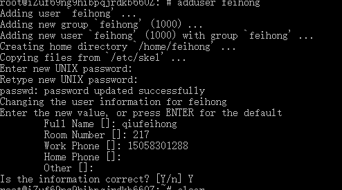
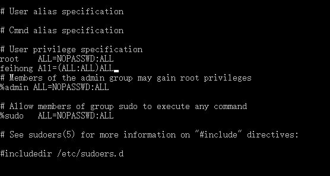
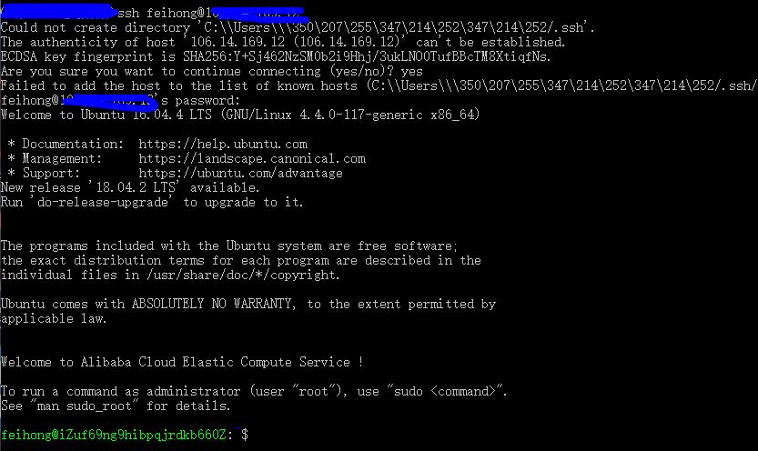

# nodejs项目线上服务器部署与发布

## 远程登录服务器
### ECS创建普通管理员，区别于root

```bash
adduser feihong
```



授予权限

```bash
 gpasswd -a feihong sudo
 sudo visudo
 ```

添加用户





设置ssh rsa，生成公钥和私钥，取消密码

## 增强服务器安全等级
端口范围0-65536
不要使用1024

修改ssh配置文件
```bash
 sudo vim ssh/sshd_config
```


可以更改其中的port，添加用户

```bash
port *****
AllowUsers feihong
```
重启ssh
```bash
sudo service ssh restart
```
重新登录则失败
```bash
ssh: connect to host ******** port 22: Connection refused
```
加上-p和端口号
```bash
ssh -p **** feihong@********
```

禁止root登录

```bash
PermitRootLogin no
```

[iptable详解](https://yq.aliyun.com/articles/480944)
failban

## 搭建node生产环境
- nvm管理node版本
- npm用下载淘宝镜像

## 配置nginx实现反向代理

负载均衡

浏览器中nginx版本信息可以隐藏

解注释即可
```bash
  # server_tokens off;
```
## 利用DNSPod管理域名解析

- [七牛云](https://portal.qiniu.com/create)
集成存储与融合 CDN，汇聚七牛强大的数据处理能力，提供直播、录制、转码、发布、加速、播放等一站式视频直播、点播服务。