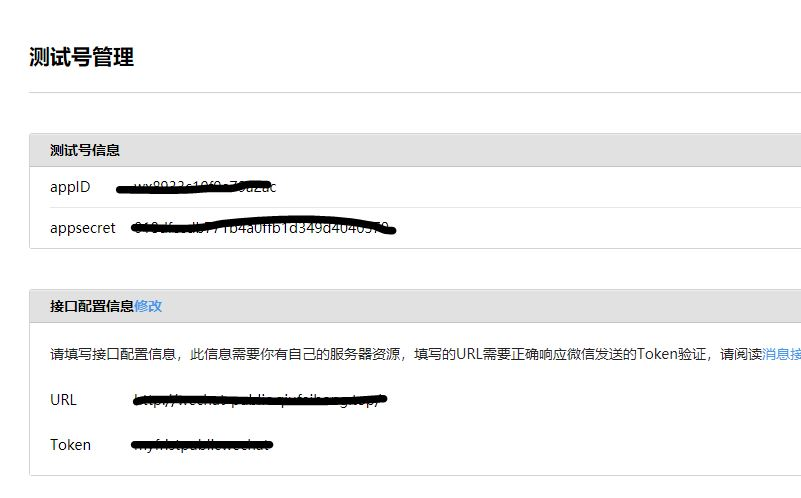
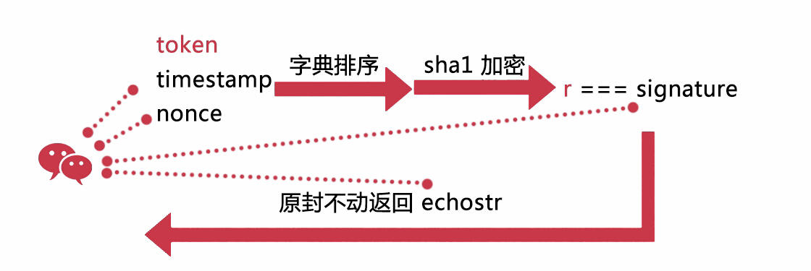

# [7天搞定Node.js微信公众号开发](https://coding.imooc.com/class/38.html#Anchor)
## 第一章 前期准备
- ngrok 内网穿透 内网地址——外网可以访问
- localtunnel
- pagekite

### 配置接入微信公众号
先用微信公众号测试账号来进行开发工作。

appID
系统分配的唯一串，在请求url中作为参数，校验请求是否来自微信服务器


appsecret
系统分配的唯一串，在请求url中作为参数，校验请求是否来自微信服务器


URL
上文说过的工具生成的虚拟URL，公网能够访问


Token
我们自己填写的任意字符串，用于本地服务器校验请求是否来自微信服务器


### 用代码实现加密认证逻辑


步骤:
1. 获取到token、timestamp和nonce进行字典排序后进行拼接
2. 然后进行加密
3. 与signature进行比对
4. 一致则返回echostr

> 本机服务器接收到参数，根据约定校验参数后，返回消息给微信服务器。微信服务器接收到消息之后，确认和本地服务器建立了关系，页面显示“配置成功”，本地服务器的校验


```javascript
'use strict'

var Koa = require('koa')
var sha1 = require('sha1')
var config = {
    wechat: {
        appID: '********************',
        appSecret: '************************',
        token: '********************'
    }
}
var app = new Koa()
app.use(function* (next) {
    console.log(this.query)
    var token = config.wechat.token
    var timestamp = this.query.timestamp
    var nonce = this.query.nonce

    var signature = this.query.signature
    var echostr = this.query.echostr
    var str = [token, timestamp, nonce].sort().join('')
    var sha = sha1(str)
    console.log(sha)
    if (sha === signature) {
        this.body = echostr + ''
    } else {
        this.body = 'wrong'
    }
})

app.listen(1414)
console.log('listening:1414')
```
## 第二章 实战入门
### 简介
重点票据

### qq浏览器代理调试端口

### 简述7种消息6种回复
https://developers.weixin.qq.com/doc/offiaccount/Message_Management/Receiving_standard_messages.html
### 注意事项总结
1. 微信公众号接口只支持80端口
2. 微信后台配置的URL是唯一能接收到消息，事件的入口，我们在公众号中的所有操作，都是基于这个url进行交互
3. 调用所有微信接口时几乎全部使用https协议
4. 用户向公众号发送消息时，会传过来OpenID,这个OpenID是用户微信号加密后的值，每个用户在每个公众号中OpenID是唯一的
5. 在开发阶段，要留意报错信息，比如全局返回码，这个非常重要，开发出了问题，最终依然要靠自己动手解决
6. [在和微信服务器交互的时候，需要满足各个接口的规范限制、调用频率限制，也要特别注意模板消息、用户数据等敏感信息的使用规范](https://developers.weixin.qq.com/doc/offiaccount/Getting_Started/Explanation_of_interface_privileges.html)
   


### 从封装和抽象开始

app.js
```javascript
'use strict'

var Koa = require('koa')
var check = require('./middlewares/check')
var config = require('./config')
var app = new Koa()
app.use(check(config.wechat))

app.listen(1414)
console.log('listening:1414')
```
config.js
```javascript
'use strict'

const config = {
    wechat: {
        appID: '********************',
        appSecret: '************************',
        token: '********************'
    }
}

module.exports = config
```
check.js
```javascript
'use strict'
var sha1 = require('sha1')

module.exports = function (config) {
    return function* (next) {
        console.log(this.query)
        let token = config.token
        let timestamp = this.query.timestamp
        let nonce = this.query.nonce

        let signature = this.query.signature
        let echostr = this.query.echostr
        let str = [token, timestamp, nonce].sort().join('')
        let sha = sha1(str)
        console.log(sha)
        if (sha === signature) {
            this.body = echostr + ''
        } else {
            this.body = 'check error'
        }
    }

}
```
### [票据access_token打开新世界的大门](https://developers.weixin.qq.com/doc/offiaccount/Basic_Information/Get_access_token.html)
是什么？
1. access_token 每2小时自动失效，需要重新获取
2. 若是重新获取，前者无效

access_token是公众号的全局唯一接口调用凭据，公众号调用各接口时都需使用access_token。开发者需要进行妥善保存。access_token的存储至少要保留512个字符空间。access_token的有效期目前为2个小时，需定时刷新，重复获取将导致上次获取的access_token失效。

公众平台的API调用所需的access_token的使用及生成方式说明：

1、建议公众号开发者使用中控服务器统一获取和刷新access_token，其他业务逻辑服务器所使用的access_token均来自于该中控服务器，不应该各自去刷新，否则容易造成冲突，导致access_token覆盖而影响业务；

2、目前access_token的有效期通过返回的expire_in来传达，目前是7200秒之内的值。中控服务器需要根据这个有效时间提前去刷新新access_token。在刷新过程中，中控服务器可对外继续输出的老access_token，此时公众平台后台会保证在5分钟内，新老access_token都可用，这保证了第三方业务的平滑过渡；

3、access_token的有效时间可能会在未来有调整，所以中控服务器不仅需要内部定时主动刷新，还需要提供被动刷新access_token的接口，这样便于业务服务器在API调用获知access_token已超时的情况下，可以触发access_token的刷新流程。

公众号和小程序均可以使用AppID和AppSecret调用本接口来获取access_token。AppID和AppSecret可在“微信公众平台-开发-基本配置”页中获得（需要已经成为开发者，且帐号没有异常状态）。**调用接口时，请登录“微信公众平台-开发-基本配置”提前将服务器IP地址添加到IP白名单中，点击查看设置方法，否则将无法调用成功。**小程序无需配置IP白名单。

怎么用？
1. 每隔2小时启动去刷新一次票据，无论何时内部调用接口，票据都是最新的
2. 为了方便频繁调用，把票据存储在唯一的一个地方


### 撸一个自动回复

1. 处理post类型的控制逻辑，接受这个xml的数据包
2. 解析这个数据包
3. 拼装定义好的消息
4. 包装成xml的格式
5. 在5秒内返回回去


## 第三章 微信流程及技术串讲
本章节会对课程中所需要的ES6中的新技术点进行一次串讲，包括Promise 如何使用，Generator 生成器，及 Koa 和 Express 中间件。

 3-2 第三天 微信交互流程
 1. 验证开发者身份，参数串返回
 2. 发送事件或消息
 3. post xml数据
 4. 回复xml数据
 5. 推送回复到手机


 3-3 第三天 Promise 如何使用

 3-4 第三天 Generator生成器


 3-5 第三天 Koa 和 Express 中间件
 3-6 第三天课程作业：把第二天的 Koa 改造成 Express 项目

## 第四章 实战进阶
这一天的工作是将微信提供的重要接口，一个一个串下来，尤其是实现素材接口的调用。

 4-2 第四天 封装消息响应模块
 4-3 第四天 自动回复各种消息
 4-4 第四天 上传临时素材之图片和视频
 4-5 第四天 荡平永久素材接口-上传
 4-6 第四天 荡平永久素材接口-下载、删除、更新
 4-7 第四天 荡平永久素材接口-查询永久素材数量接口、获取永久素材列表接口
 4-8 第四天 用户分组爽歪歪（上）
 4-9 第四天 用户分组爽歪歪（下）
 4-10 第四天 获取用户私密信息（设置备注名、获取用户基本信息）
 4-11 第四天 获取用户私密信息（ 获取用户列表）
 4-12 第四天 地理位置和用户资料挖坑
 4-13 第四天课程作业：实现统计请求耗时的中间件
## 第五章 实战互动

## 第六章 实战电影公众号

## 第七章 公众号提供网站访问

## 参考文献
[微信公众号平台测试账号接入流程](https://www.jianshu.com/p/294de9d4bd3f)