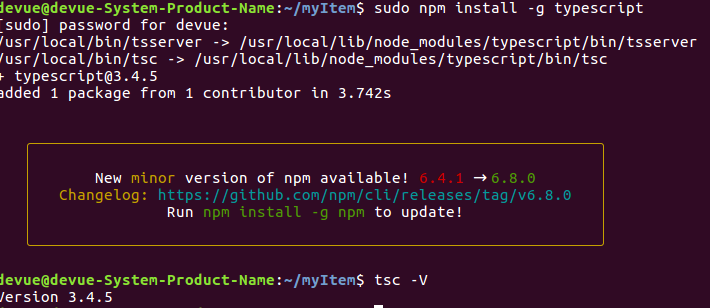

# 基于TypeScript从零重构axios

## 课程介绍
### TypeScript常用语法
- 基础类型
- 变量申明
- 接口
- 类
- 函数
- 泛型
- 类型推新
- 高级类型
  
### axios js库抽丝剥茧
- 项目脚手架
- 基础功能实现
- 异常情况处理
- 接口扩展
- 拦截器实现
- 配置化实现
- 取消功能实现
- 更多功能实现

### 前端工具运用
- [Jest](https://jestjs.io/docs/en/getting-started) facebook推出的js测试框架
- [Commitizen](http://www.ruanyifeng.com/blog/2016/01/commit_message_change_log.html) 是一个撰写合格 Commit message 的工具
- [RollupJS](https://www.rollupjs.com/guide/zh) 是一个 JavaScript 模块打包器
- TSLint 代码风格统一
- Prettier 格式化代码
- [Semantic release](https://www.npmjs.com/package/semantic-release) 完全自动化的版本管理和包发布


## 初识TypeScript
### 安装TypeScript

安装-查看版本

```bash
sudo npm install -g typescript
tsc -V
```


### 编写第一个程序
类型检查
1. 案例一: 数据类型错误
```typescript
function greeter(person:string) {
    return 'hello ' + person
}
let user = 1231
console.log(greeter(user))
```
虽然报错,但是还是会编译出greeter.js
```bash
devue@devue-System-Product-Name:~/myItem/vuepress-blog/examples$ tsc greeter.ts 
greeter.ts:5:21 - error TS2345: Argument of type 'number' is not assignable to parameter of type 'string'.

5 console.log(greeter(user))
                      ~~~~


Found 1 error.
```

2. 案例二: 有接口

greeter.ts
```typescript
interface Person {
    name: string,
        age: number
}

function greeter(person: Person) {
    return `hello ${person.name} ${person.age}`
}
let user = {
    name: 'qfh',
    age: 24
}
console.log(greeter(user))
```

编译好后的greeter.js
```javascript
function greeter(person) {
    return "hello " + person.name + " " + person.age;
}
var user = {
    name: 'qfh',
    age: 24
};
console.log(greeter(user));//hello qfh 24

```

3. 案例三: 有类
```typescript
// 类
class User {
    name: string
    age: number
    total: string
    constructor(name: string, age: number) {
        this.name = name
        this.age = age
        this.total = this.name + this.age
        console.log(this.total)
    }
}
// 接口
interface Person {
    name: string,
        age: number
}

function greeter(person: Person) {
    return `hello ${person.name} ${person.age}`
}

// 实例化对象
const user = new User('qfh', 24)
console.log(greeter(user))
```
编译后的js,原来就是将类改写成方法,返回值
```javascript
// 类
var User = /** @class */ (function () {
    function User(name, age) {
        this.name = name;
        this.age = age;
        this.total = this.name + this.age;
        console.log(this.total);//qfh24
    }
    return User;
}());
function greeter(person) {
    return "hello " + person.name + " " + person.age;
}
// 实例化对象
var user = new User('qfh', 24);
console.log(greeter(user));//hello qfh 24

```

## TypeScript类型系统
### 基础类型
- boolean
- string
- number
- array
- any
- void
- null
- undefined
- nerver
- object 

### var
#### 变量提升

#### 闭包

### let

#### 块级作用域

#### 暂时性死区

#### 不能重复声明

#### 屏蔽

### const
#### 不变

### 解构
元祖
```typescript
const a: [number, number] = [1212, 32323]

function B([one, two]: [number, number]) {
    console.log(one)
    console.log(two)
}

B(a)
```
```javascript
var a = [1212, 32323];
function B(_a) {
    var one = _a[0], two = _a[1];
    console.log(one);
    console.log(two);
    // 1212
// 32323
}
B(a);
```

参数默认值
```typescript
function f({a=123123,b}={b:12321}):void{
    console.log(a,b)
}

f()
f({b:1231231})
f({a:23123131,b:131231231231231})
```
```javascript
function f(_a) {
    var _b = _a === void 0 ? { b: 12321 } : _a, _c = _b.a, a = _c === void 0 ? 123123 : _c, b = _b.b;
    console.log(a, b);
}
f();
f({ b: 1231231 });
f({ a: 23123131, b: 131231231231231 });
// 123123 12321
// 123123 1231231
// 23123131 131231231231231
```

### 展开
#### 数组展开

```typescript
const A = ['a', 'b', 'c', 'd']

const B = ['x', 'y', ...A, 'z']
console.log(B)
```

```javascript
var A = ['a', 'b', 'c', 'd'];
var B = ['x', 'y'].concat(A, ['z']);
console.log(B);
// [ 'x', 'y', 'a', 'b', 'c', 'd', 'z' ]
```

#### 对象展开

```typescript
const A = {
    a: 'aaaa',
    b: 'bbbbb',
    c: 'ccccc'
}
const B = {
    ...A,
    d: 'ddddd',
    a: 'AAAAA'
}
console.log(B)
```
```javascript
var __assign = (this && this.__assign) || function () {
    __assign = Object.assign || function(t) {
        for (var s, i = 1, n = arguments.length; i < n; i++) {
            s = arguments[i];
            for (var p in s) if (Object.prototype.hasOwnProperty.call(s, p))
                t[p] = s[p];
        }
        return t;
    };
    return __assign.apply(this, arguments);
};
var A = {
    a: 'aaaa',
    b: 'bbbbb',
    c: 'ccccc'
};
var B = __assign({}, A, { d: 'ddddd', a: 'AAAAA' });
console.log(B);
// { a: 'AAAAA', b: 'bbbbb', c: 'ccccc', d: 'ddddd' }
```

### 接口

```typescript
interface isObj {
    name: string,
    age: number
}

function A(obj: isObj) {
    console.log(obj)
}
A({
    name: 'qfh',
    age: 21231231,
    sex:'men'
})
```
多加一个属性就报错
```bash
index.ts:12:5 - error TS2345: Argument of type '{ name: string; age: number; sex: string; }' is not assignable to parameter of type 'isObj'.
  Object literal may only specify known properties, and 'sex' does not exist in type 'isObj'.

12     sex:'men'
       ~~~~~~~~~


Found 1 error.
```